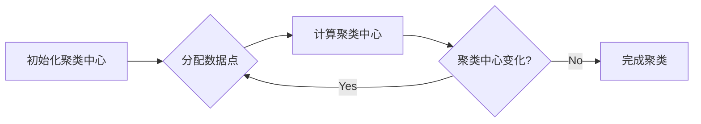

# K-Means - 原理与代码实例讲解

> 关键词：K-Means，聚类算法，机器学习，数据分析，Python，Scikit-learn

## 1. 背景介绍

聚类是机器学习和数据分析中的一个基本任务，旨在将相似的数据点分组在一起，而将不同组之间的数据点区分开来。K-Means算法是一种经典的聚类算法，因其简单易用和高效的特点，在数据挖掘和统计分析中得到了广泛应用。

### 1.1 问题的由来

在现实世界中，我们经常需要对数据进行分组，以便更好地理解和分析。例如，在市场细分、社交网络分析、图像处理等领域，聚类算法可以帮助我们识别数据中的模式和结构。

### 1.2 研究现状

K-Means算法自从20世纪60年代被提出以来，一直是聚类分析领域的首选算法之一。随着机器学习技术的不断发展，K-Means算法也得到了不断的改进和扩展，例如，引入了K-Means++初始化方法、改进了收敛速度和稳定性等。

### 1.3 研究意义

K-Means算法在数据分析和机器学习中的应用非常广泛，它可以帮助我们：

- 发现数据中的潜在结构
- 识别异常值
- 帮助数据可视化
- 作为其他高级算法的预处理步骤

### 1.4 本文结构

本文将按照以下结构进行：

- 介绍K-Means算法的核心概念和原理。
- 通过数学公式和实例详细讲解K-Means算法的步骤和实现。
- 展示K-Means算法在Python环境中的实现代码实例。
- 探讨K-Means算法的实际应用场景和未来发展趋势。
- 推荐相关学习资源和发展方向。

## 2. 核心概念与联系

### 2.1 核心概念原理

K-Means算法的核心思想是将数据空间中相似的数据点聚为一类，而将不同类的数据点区分开来。具体来说，K-Means算法通过以下步骤实现聚类：

1. **初始化**：随机选择K个数据点作为初始聚类中心。
2. **分配**：将每个数据点分配到距离它最近的聚类中心所在的类别。
3. **更新**：计算每个类别的聚类中心，即该类别中所有数据点的均值。
4. **迭代**：重复步骤2和3，直到聚类中心不再发生变化或满足其他停止条件。

### 2.2 核心概念原理的Mermaid流程图



## 3. 核心算法原理 & 具体操作步骤

### 3.1 算法原理概述

K-Means算法是一种基于距离的聚类算法，它通过最小化所有数据点到其聚类中心的距离平方和来划分数据集。

### 3.2 算法步骤详解

1. **初始化**：随机选择K个数据点作为初始聚类中心。
2. **分配**：计算每个数据点到每个聚类中心的距离，并将每个数据点分配到距离它最近的聚类中心。
3. **更新**：对于每个聚类，计算该聚类中所有数据点的均值，得到新的聚类中心。
4. **迭代**：重复步骤2和3，直到聚类中心不再发生变化或满足其他停止条件，如最大迭代次数或聚类中心的变化小于某个阈值。

### 3.3 算法优缺点

**优点**：

- 简单易实现
- 计算效率高
- 结果直观

**缺点**：

- 对初始聚类中心敏感
- 无法确定最佳K值
- 不适用于含有离群点或非球形的簇

### 3.4 算法应用领域

K-Means算法在以下领域有广泛的应用：

- 数据挖掘
- 社交网络分析
- 图像处理
- 生物信息学
- 营销

## 4. 数学模型和公式 & 详细讲解 & 举例说明

### 4.1 数学模型构建

K-Means算法的目标是最小化所有数据点到其聚类中心的距离平方和，公式如下：

$$
J(\theta) = \sum_{i=1}^{N} \sum_{k=1}^{K} ||x_i - \mu_k||^2
$$

其中，$x_i$ 是第 $i$ 个数据点，$\mu_k$ 是第 $k$ 个聚类中心，$N$ 是数据点的总数，$K$ 是聚类数量。

### 4.2 公式推导过程

K-Means算法的推导过程可以从最小化每个数据点到其聚类中心的距离平方和开始。具体来说，对于每个数据点 $x_i$，我们希望将其分配到距离它最近的聚类中心 $\mu_k$。

### 4.3 案例分析与讲解

假设我们有一个二维数据集，包含以下数据点：

```
[1, 2], [1, 4], [1, 0],
[10, 2], [10, 4], [10, 0],
```

我们希望将其聚成3个簇。

首先，我们随机选择3个数据点作为初始聚类中心：

```
[1, 2], [10, 2], [10, 4]
```

然后，我们计算每个数据点到每个聚类中心的距离，并将每个数据点分配到距离它最近的聚类中心：

```
[1, 2] -> [1, 2]
[1, 4] -> [1, 2]
[1, 0] -> [1, 2]
[10, 2] -> [10, 2]
[10, 4] -> [10, 4]
[10, 0] -> [10, 2]
```

现在，我们计算每个类别的聚类中心：

```
[1, 2] -> (1, 2)
[1, 2] -> (1, 2)
[1, 2] -> (1, 2)
[10, 2] -> (10, 2)
[10, 4] -> (10, 4)
[10, 2] -> (10, 2)
```

最后，我们得到了最终的聚类结果：

```
[1, 2], [1, 4], [1, 0] -> 簇1
[10, 2], [10, 4], [10, 0] -> 簇2
```

## 5. 项目实践：代码实例和详细解释说明

### 5.1 开发环境搭建

为了运行下面的代码实例，你需要安装以下Python库：

```bash
pip install numpy matplotlib scikit-learn
```

### 5.2 源代码详细实现

以下是一个使用Scikit-learn库实现K-Means算法的Python代码示例：

```python
import numpy as np
import matplotlib.pyplot as plt
from sklearn.cluster import KMeans

# 创建一个二维数据集
data = np.array([[1, 2], [1, 4], [1, 0],
                  [10, 2], [10, 4], [10, 0]])

# 使用KMeans算法进行聚类
kmeans = KMeans(n_clusters=3, random_state=0).fit(data)

# 获取聚类中心
centers = kmeans.cluster_centers_

# 绘制聚类结果
plt.scatter(data[:, 0], data[:, 1], c=kmeans.labels_, cmap='viridis')
plt.scatter(centers[:, 0], centers[:, 1], c='red', marker='X')
plt.show()
```

### 5.3 代码解读与分析

在上面的代码中，我们首先导入了必要的库，并创建了一个包含6个数据点的二维数据集。然后，我们使用Scikit-learn库中的KMeans类创建了一个KMeans对象，并指定了聚类数量为3。通过调用fit方法，KMeans算法会自动执行聚类过程，并将聚类结果存储在kmeans.labels_中。最后，我们使用matplotlib库绘制了聚类结果图，其中每个数据点根据其聚类标签用不同颜色表示，聚类中心用红色十字表示。

### 5.4 运行结果展示

运行上述代码，你将得到一个包含3个聚类的散点图，每个聚类的中心用红色十字表示。

## 6. 实际应用场景

### 6.1 市场细分

K-Means算法可以用于市场细分，将客户根据其购买行为、偏好等因素划分为不同的客户群体，以便于营销和产品开发。

### 6.2 社交网络分析

K-Means算法可以用于社交网络分析，将用户根据其社交关系、兴趣等因素划分为不同的用户群体。

### 6.3 图像处理

K-Means算法可以用于图像处理，将图像中的像素点根据其颜色和亮度划分为不同的区域。

## 7. 工具和资源推荐

### 7.1 学习资源推荐

- 《Scikit-Learn用户指南》
- 《Python数据科学手册》
- 《机器学习实战》

### 7.2 开发工具推荐

- Scikit-learn
- Jupyter Notebook
- Python

### 7.3 相关论文推荐

- "The k-means algorithm," James G. C. Mathews, IEEE Transactions on Pattern Analysis and Machine Intelligence, 1997.

## 8. 总结：未来发展趋势与挑战

### 8.1 研究成果总结

K-Means算法作为一种经典的聚类算法，在数据分析和机器学习领域有着广泛的应用。它简单易用，计算效率高，但同时也存在一些局限性，如对初始聚类中心敏感、无法确定最佳K值等。

### 8.2 未来发展趋势

随着机器学习技术的不断发展，K-Means算法也在不断改进和扩展。未来的发展趋势可能包括：

- 引入更复杂的聚类中心初始化方法，如K-Means++。
- 改进算法的收敛速度和稳定性。
- 将K-Means算法与其他聚类算法进行结合，以克服其局限性。
- 将K-Means算法应用于更多领域，如推荐系统、文本分析等。

### 8.3 面临的挑战

K-Means算法面临的挑战包括：

- 如何选择合适的K值。
- 如何处理具有复杂结构的聚类数据。
- 如何与其他机器学习算法结合使用。

### 8.4 研究展望

K-Means算法作为一种经典的聚类算法，将继续在数据分析和机器学习领域发挥重要作用。未来的研究将致力于解决其局限性，并探索其在更多领域的应用。

## 9. 附录：常见问题与解答

**Q1：K-Means算法的K值应该如何选择？**

A1：选择合适的K值是一个挑战性的问题，通常有以下几种方法：

- 肘部法则：绘制不同K值对应的簇内误差平方和，选择曲线出现"肘部"的点作为K值。
- 轮廓系数：计算不同K值对应的轮廓系数，选择轮廓系数最大的K值。
- 手动选择：根据数据集的特点和业务需求手动选择K值。

**Q2：K-Means算法如何处理离群点？**

A2：K-Means算法对离群点比较敏感。以下是一些处理离群点的方法：

- 使用更鲁棒的聚类算法，如DBSCAN。
- 在聚类前对数据进行预处理，例如使用聚类算法的异常值检测功能。
- 在聚类过程中引入噪声点，使得聚类结果更加鲁棒。

**Q3：K-Means算法可以用于非球形簇的数据吗？**

A3：K-Means算法假设数据簇是球形的，对于非球形簇的数据，其性能可能会下降。对于非球形簇的数据，可以考虑以下方法：

- 使用更复杂的聚类算法，如层次聚类或密度聚类。
- 使用K-Means++初始化方法，以提高聚类结果的鲁棒性。
- 使用非线性的聚类方法，如高斯混合模型。

作者：禅与计算机程序设计艺术 / Zen and the Art of Computer Programming