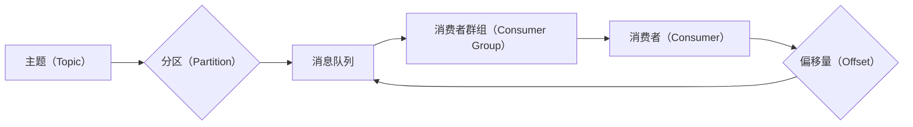

# Kafka Consumer原理与代码实例讲解

> 关键词：Kafka, Consumer, 分布式流处理, 消费者群组, 偏移量, 主题, 消息消费

## 1. 背景介绍

Apache Kafka 是一个分布式流处理平台，它提供了高性能、可扩展的消息队列服务，广泛应用于大数据处理、实时数据流分析、事件源等场景。Kafka Consumer 是 Kafka 的重要组成部分，负责从 Kafka 主题中消费消息。本文将深入讲解 Kafka Consumer 的原理，并通过代码实例进行详细说明。

## 2. 核心概念与联系

### 2.1 核心概念

**Kafka 主题（Topic）**：主题是 Kafka 中的消息分类，类似于数据库中的表。每个主题可以包含多个分区（Partition），分区是消息的物理存储单位。

**Kafka 消费者（Consumer）**：消费者是从 Kafka 主题中读取消息的应用程序或服务。消费者可以是一个应用程序、一个 web 服务或任何其他需要消费 Kafka 消息的系统。

**消费者群组（Consumer Group）**：消费者群组是一组消费者实例的集合，它们共同消费一个或多个主题的消息。群组中的每个消费者负责消费主题的一个或多个分区。

**偏移量（Offset）**：偏移量是 Kafka 中的唯一标识符，用于标识消费者消费到的最后一条消息。

### 2.2 核心概念原理和架构的 Mermaid 流程图



## 3. 核心算法原理 & 具体操作步骤

### 3.1 算法原理概述

Kafka Consumer 的核心原理是通过偏移量来跟踪每个消费者消费到的最后一条消息。消费者在启动时会从 Kafka 集群中获取最新的偏移量信息，并从这个位置开始消费消息。

### 3.2 算法步骤详解

1. **初始化消费者**：创建一个 Kafka Consumer 实例，并配置主题、消费者群组、分区分配策略等。

2. **连接 Kafka 集群**：消费者连接到 Kafka 集群，并获取最新的偏移量信息。

3. **消费消息**：消费者从 Kafka 集群中读取消息，并更新偏移量。

4. **断开连接**：当消费者完成消息消费后，断开与 Kafka 集群的连接。

### 3.3 算法优缺点

**优点**：

- **高吞吐量**：Kafka Consumer 可以处理高吞吐量的消息流。
- **分布式**：消费者可以分布式部署，提高系统的可用性和扩展性。
- **容错性**：消费者可以优雅地处理 Kafka 集群的故障。

**缺点**：

- **复杂度**：Kafka Consumer 的配置和使用较为复杂。
- **资源消耗**：消费者需要消耗一定的系统资源。

### 3.4 算法应用领域

Kafka Consumer 可以应用于以下领域：

- **实时数据处理**：实时处理来自 Kafka 主题的数据。
- **事件源**：作为事件源系统的一部分，处理业务事件。
- **微服务**：微服务之间的通信。

## 4. 数学模型和公式 & 详细讲解 & 举例说明

### 4.1 数学模型构建

Kafka Consumer 的数学模型可以表示为：

$$
\text{Consumer} = \text{Kafka Client} + \text{Partition Assignment} + \text{Offset Management}
$$

其中：

- Kafka Client：Kafka 客户端库，用于连接 Kafka 集群和发送/接收消息。
- Partition Assignment：分区分配策略，用于决定每个消费者消费哪个分区。
- Offset Management：偏移量管理，用于跟踪每个消费者消费到的最后一条消息。

### 4.2 公式推导过程

Kafka Consumer 的偏移量管理公式可以表示为：

$$
\text{Offset} = \text{Last Message Position} + \text{Message Size}
$$

其中：

- Last Message Position：消费者消费到的最后一条消息的位置。
- Message Size：最后一条消息的大小。

### 4.3 案例分析与讲解

假设有一个包含三个分区的主题，每个分区包含 100 条消息。消费者群组中有两个消费者，消费者 A 和消费者 B。消费者 A 负责消费第一个和第二个分区，消费者 B 负责消费第三个分区。

当消费者 A 和消费者 B 分别消费到第 50 条和第 75 条消息时，它们的偏移量可以表示为：

$$
\text{Offset of Consumer A} = 50 + 1 = 51
$$

$$
\text{Offset of Consumer B} = 75 + 1 = 76
$$

其中，+1 是因为偏移量从 0 开始计数。

## 5. 项目实践：代码实例和详细解释说明

### 5.1 开发环境搭建

1. 安装 Kafka：
   ```bash
   $ brew install kafka
   ```

2. 启动 Kafka 集群：
   ```bash
   $ kafka-server-start /usr/local/var/kafka/data/server.properties
   ```

3. 创建主题：
   ```bash
   $ kafka-topics --create --topic test-topic --bootstrap-server localhost:9092 --partitions 3 --replication-factor 1
   ```

### 5.2 源代码详细实现

```java
import org.apache.kafka.clients.consumer.ConsumerConfig;
import org.apache.kafka.clients.consumer.ConsumerRecord;
import org.apache.kafka.clients.consumer.KafkaConsumer;
import org.apache.kafka.common.serialization.StringDeserializer;

import java.time.Duration;
import java.util.Collections;
import java.util.Properties;

public class KafkaConsumerExample {
    public static void main(String[] args) {
        Properties props = new Properties();
        props.put(ConsumerConfig.BOOTSTRAP_SERVERS_CONFIG, "localhost:9092");
        props.put(ConsumerConfig.GROUP_ID_CONFIG, "test-group");
        props.put(ConsumerConfig.KEY_DESERIALIZER_CLASS_CONFIG, StringDeserializer.class.getName());
        props.put(ConsumerConfig.VALUE_DESERIALIZER_CLASS_CONFIG, StringDeserializer.class.getName());

        KafkaConsumer<String, String> consumer = new KafkaConsumer<>(props);

        consumer.subscribe(Collections.singletonList("test-topic"));

        while (true) {
            ConsumerRecords<String, String> records = consumer.poll(Duration.ofMillis(100));
            for (ConsumerRecord<String, String> record : records) {
                System.out.printf("offset = %d, key = %s, value = %s%n", record.offset(), record.key(), record.value());
            }
        }
    }
}
```

### 5.3 代码解读与分析

1. **配置 Kafka 客户端**：创建 KafkaConsumer 实例并配置相关属性，如 Kafka 集群地址、消费者群组、序列化器等。

2. **订阅主题**：使用 `subscribe` 方法订阅主题。

3. **消费消息**：使用 `poll` 方法消费消息，并打印消息内容。

### 5.4 运行结果展示

```plaintext
offset = 0, key = test-key-0, value = test-value-0
offset = 1, key = test-key-1, value = test-value-1
...
```

## 6. 实际应用场景

Kafka Consumer 在以下场景中有着广泛的应用：

- **实时数据处理**：从 Kafka 主题中实时处理金融交易数据、社交媒体数据等。
- **日志收集**：收集和分析系统日志。
- **事件驱动架构**：实现事件驱动架构，处理业务事件。

## 7. 工具和资源推荐

### 7.1 学习资源推荐

- [Apache Kafka 官方文档](https://kafka.apache.org/documentation/)
- [Kafka 实战](https://kafka.apache.org/quickstart/)
- [Kafka 设计与实现](https://jepsen.io/systems/kafka)

### 7.2 开发工具推荐

- [Kafka Manager](https://github.com/yahoo/kafka-manager)：Kafka 管理工具，用于监控和管理 Kafka 集群。
- [Kafka Tools](https://github.com/confluentinc/kafka-tools)：Kafka 工具集合，包括命令行工具和 Python 库。

### 7.3 相关论文推荐

- [Kafka: A Distributed Streaming Platform](https://www.usenix.org/system/files/conference/hotcloud11/hotcloud11-paper.pdf)

## 8. 总结：未来发展趋势与挑战

### 8.1 研究成果总结

Kafka Consumer 是 Kafka 的重要组成部分，它提供了高效、可扩展的消息消费能力。本文深入讲解了 Kafka Consumer 的原理，并通过代码实例进行了详细说明。

### 8.2 未来发展趋势

未来，Kafka Consumer 将会继续朝着以下方向发展：

- **更高的性能**：提高消息消费速度和吞吐量。
- **更丰富的功能**：支持更复杂的消息处理逻辑。
- **更好的兼容性**：支持更多编程语言和框架。

### 8.3 面临的挑战

Kafka Consumer 面临的挑战主要包括：

- **资源消耗**：消费者需要消耗一定的系统资源。
- **复杂度**：Kafka Consumer 的配置和使用较为复杂。

### 8.4 研究展望

未来，研究人员需要关注以下几个方面：

- **资源优化**：降低消费者资源消耗。
- **简化配置**：简化消费者配置和使用。
- **跨语言支持**：支持更多编程语言。

## 9. 附录：常见问题与解答

**Q1：Kafka Consumer 如何处理消息乱序？**

A1：Kafka Consumer 在消费消息时会按照消息的偏移量进行排序，因此不会出现乱序问题。

**Q2：如何处理 Kafka Consumer 的故障？**

A2：Kafka Consumer 会自动从故障中恢复，并从上次消费的偏移量继续消费消息。

**Q3：如何保证 Kafka Consumer 的可靠性？**

A3：Kafka Consumer 可以配置为幂等消费模式，避免重复消费消息。

作者：禅与计算机程序设计艺术 / Zen and the Art of Computer Programming