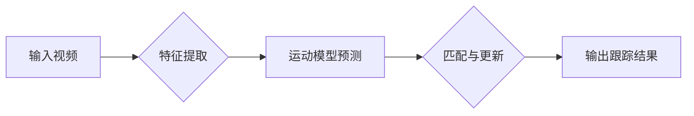

# Object Tracking 原理与代码实战案例讲解

> 关键词：目标跟踪，跟踪算法，卡尔曼滤波，深度学习，特征匹配，多目标跟踪，跟踪框架

## 1. 背景介绍

目标跟踪是计算机视觉领域的一个重要研究方向，旨在视频序列中对移动对象进行实时、准确地检测和跟踪。在自动驾驶、视频监控、运动分析等领域，目标跟踪技术发挥着至关重要的作用。本文将深入探讨目标跟踪的原理，并通过代码实战案例讲解如何实现高效的目标跟踪系统。

### 1.1 问题的由来

随着视频监控的普及和智能视频分析的需求增长，如何从视频中实时准确地跟踪移动对象成为了一个重要的研究课题。传统的目标跟踪方法主要包括基于模型的方法和基于测量的方法。然而，这些方法在复杂场景下往往难以满足实际需求。

### 1.2 研究现状

近年来，随着深度学习技术的快速发展，基于深度学习的目标跟踪方法取得了显著的成果。这些方法利用深度神经网络从视频帧中提取特征，并结合运动模型进行跟踪。此外，多目标跟踪、长期跟踪、遮挡处理等也是目标跟踪研究的热点问题。

### 1.3 研究意义

研究高效、准确的目标跟踪方法，对于推动视频分析技术的发展具有重要意义。它可以提高视频监控的智能化水平，为自动驾驶、人机交互等领域提供技术支持。

### 1.4 本文结构

本文将分为以下几个部分：

- 第2部分，介绍目标跟踪的核心概念与联系。
- 第3部分，讲解目标跟踪算法的原理和具体操作步骤。
- 第4部分，分析目标跟踪的数学模型和公式。
- 第5部分，通过代码实战案例展示目标跟踪的实现过程。
- 第6部分，探讨目标跟踪的实际应用场景。
- 第7部分，展望目标跟踪技术的未来发展趋势和挑战。
- 第8部分，总结全文，并给出常见问题与解答。

## 2. 核心概念与联系

### 2.1 核心概念

- 目标跟踪：在视频序列中，连续地检测和跟踪移动对象的过程。
- 特征提取：从视频帧中提取描述目标特征的向量。
- 运动模型：描述目标运动轨迹的数学模型。
- 跟踪算法：根据特征提取和运动模型进行目标跟踪的算法。
- 多目标跟踪：同时跟踪多个目标。

### 2.2 核心概念原理和架构的 Mermaid 流程图



## 3. 核心算法原理 & 具体操作步骤

### 3.1 算法原理概述

目标跟踪算法通常包括以下步骤：

1. 特征提取：从视频帧中提取目标特征。
2. 运动模型预测：根据目标的历史位置和速度等信息预测下一帧目标的位置。
3. 匹配与更新：将预测位置与当前帧中的目标进行匹配，并更新目标的位置和状态。
4. 输出跟踪结果：输出目标的位置、速度等信息。

### 3.2 算法步骤详解

**3.2.1 特征提取**

特征提取是目标跟踪的基础。常用的特征提取方法包括：

- HOG (Histogram of Oriented Gradients)：直方图方向梯度，用于描述图像的纹理信息。
- SIFT (Scale-Invariant Feature Transform)：尺度不变特征变换，用于提取图像的关键点。
- SURF (Speeded Up Robust Features)：快速鲁棒特征，是SIFT的改进版本。

**3.2.2 运动模型预测**

运动模型用于预测目标在下一帧的位置。常见的运动模型包括：

- 卡尔曼滤波：一种线性滤波器，用于预测和更新状态变量。
- 基于深度学习的运动模型：利用深度神经网络预测目标的位置和速度。

**3.2.3 匹配与更新**

匹配与更新是目标跟踪的关键步骤。常见的匹配方法包括：

- 基于特征的匹配：利用特征相似度进行匹配。
- 基于距离的匹配：利用目标位置的距离进行匹配。

**3.2.4 输出跟踪结果**

输出跟踪结果包括目标的位置、速度、置信度等信息。

### 3.3 算法优缺点

**优点**：

- 高效：实时性强，适用于实时视频监控。
- 准确：在大多数场景下能取得较好的跟踪效果。

**缺点**：

- 对光照、遮挡等因素敏感。
- 需要大量的训练数据。
- 特征提取和运动模型的选择对跟踪效果有很大影响。

### 3.4 算法应用领域

目标跟踪算法在以下领域有广泛的应用：

- 视频监控：实时监控视频中的移动对象，如异常行为检测。
- 自动驾驶：辅助自动驾驶系统识别和跟踪道路上的车辆和行人。
- 运动分析：分析运动员的运动轨迹和动作。
- 人机交互：实现人机交互中的跟踪和手势识别。

## 4. 数学模型和公式 & 详细讲解 & 举例说明

### 4.1 数学模型构建

目标跟踪的数学模型通常包括以下部分：

- 状态空间：描述目标状态的变量，如位置、速度、加速度等。
- 观测模型：描述如何从状态空间中观测到目标。
- 运动模型：描述目标状态如何随时间变化。

### 4.2 公式推导过程

以卡尔曼滤波为例，其观测模型和运动模型如下：

$$
x_k = F_{k-1}x_{k-1} + B_kw_k
$$

$$
y_k = H_kx_k + v_k
$$

其中，$x_k$ 为状态向量，$y_k$ 为观测向量，$F_k$ 为状态转移矩阵，$B_k$ 为控制输入矩阵，$w_k$ 和 $v_k$ 分别为过程噪声和观测噪声。

### 4.3 案例分析与讲解

以下是一个简单的目标跟踪案例：

假设有一个视频序列，其中目标在水平方向上匀速运动。初始时刻，目标的位置为 $(0,0)$，速度为 $(v,0)$。

根据运动模型，下一帧目标的位置为：

$$
x_k = (0,0) + (v,0) = (v,0)
$$

根据观测模型，观测到的目标位置为：

$$
y_k = (v,0)
$$

使用卡尔曼滤波进行跟踪，可以估计目标在下一帧的位置和速度。

## 5. 项目实践：代码实例和详细解释说明

### 5.1 开发环境搭建

以下是使用Python进行目标跟踪项目开发的步骤：

1. 安装Python环境。
2. 安装OpenCV库：`pip install opencv-python`。
3. 安装其他必要的库，如NumPy、SciPy等。

### 5.2 源代码详细实现

以下是一个简单的目标跟踪代码示例：

```python
import cv2

# 加载视频文件
cap = cv2.VideoCapture('example.mp4')

# 初始化跟踪器
tracker = cv2.TrackerKCF_create()

# 读取第一帧图像
ret, frame = cap.read()
if not ret:
    raise ValueError("无法加载视频")

# 设置跟踪器初始位置
bbox = (50, 50, 100, 100)
tracker.init(frame, bbox)

while True:
    # 读取下一帧
    ret, frame = cap.read()
    if not ret:
        break

    # 跟踪目标
    success, bbox = tracker.update(frame)

    if success:
        # 绘制跟踪框
        cv2.rectangle(frame, (bbox[0], bbox[1]), (bbox[0]+bbox[2], bbox[1]+bbox[3]), (0, 255, 0), 2)
    else:
        # 跟踪失败，重新初始化
        tracker = cv2.TrackerKCF_create()
        ret, frame = cap.read()
        bbox = (50, 50, 100, 100)
        tracker.init(frame, bbox)

    # 显示结果
    cv2.imshow('Tracking', frame)
    if cv2.waitKey(1) & 0xFF == ord('q'):
        break

# 释放资源
cap.release()
cv2.destroyAllWindows()
```

### 5.3 代码解读与分析

- 加载视频文件。
- 创建并初始化跟踪器。
- 读取视频的第一帧，并设置跟踪器的初始位置。
- 循环读取下一帧，并使用跟踪器进行跟踪。
- 如果跟踪成功，则在图像上绘制跟踪框；如果跟踪失败，则重新初始化跟踪器。
- 显示结果，并等待用户按键退出。

### 5.4 运行结果展示

运行上述代码，将显示视频中的目标跟踪结果。

## 6. 实际应用场景

目标跟踪技术在实际应用场景中具有广泛的应用，以下是一些常见的应用场景：

- 视频监控：实时监控视频中的移动对象，如异常行为检测。
- 自动驾驶：辅助自动驾驶系统识别和跟踪道路上的车辆和行人。
- 运动分析：分析运动员的运动轨迹和动作。
- 人机交互：实现人机交互中的跟踪和手势识别。

## 7. 工具和资源推荐

### 7.1 学习资源推荐

- 《计算机视觉：算法与应用》
- 《目标跟踪：原理与实践》
- OpenCV官方文档

### 7.2 开发工具推荐

- OpenCV：开源计算机视觉库。
- Dlib：包含多种机器学习算法的库。
- TensorFlow：开源深度学习框架。

### 7.3 相关论文推荐

- "Deep Learning for Real-Time Multi-Object Tracking" by J. Redmon et al.
- "You Only Look Once: Unified, Real-Time Object Detection" by J. Redmon et al.
- "Simple Online and Realtime Tracking with a Deep Association Metric" by M. Brown et al.

## 8. 总结：未来发展趋势与挑战

### 8.1 研究成果总结

本文介绍了目标跟踪的原理、算法和代码实战案例。通过学习本文，读者可以了解目标跟踪的基本概念、常用算法和实现方法。

### 8.2 未来发展趋势

- 深度学习在目标跟踪中的应用将更加深入，包括目标检测、实例分割等任务的融合。
- 多目标跟踪和长期跟踪技术将得到进一步发展，提高跟踪的准确性和鲁棒性。
- 基于强化学习的目标跟踪方法将得到更多关注，实现更加智能的跟踪策略。

### 8.3 面临的挑战

- 在复杂场景下，如何提高跟踪的鲁棒性和准确性是一个挑战。
- 如何处理遮挡、尺度变化等难以建模的场景是一个挑战。
- 如何实现实时、低延迟的跟踪是一个挑战。

### 8.4 研究展望

目标跟踪技术在未来的发展中，将不断融合新的技术和算法，提高跟踪的效率和准确性。同时，随着人工智能技术的不断进步，目标跟踪技术将在更多领域得到应用，为人类社会带来更多便利。

## 9. 附录：常见问题与解答

**Q1：什么是目标跟踪？**

A：目标跟踪是在视频序列中，连续地检测和跟踪移动对象的过程。

**Q2：什么是卡尔曼滤波？**

A：卡尔曼滤波是一种线性滤波器，用于预测和更新状态变量。

**Q3：什么是特征提取？**

A：特征提取是从视频帧中提取描述目标特征的向量。

**Q4：什么是运动模型？**

A：运动模型是描述目标运动轨迹的数学模型。

**Q5：如何提高目标跟踪的鲁棒性？**

A：可以通过以下方法提高目标跟踪的鲁棒性：

- 选择合适的特征提取方法。
- 选择合适的运动模型。
- 使用数据增强技术。
- 使用多尺度跟踪技术。
- 使用多目标跟踪技术。

作者：禅与计算机程序设计艺术 / Zen and the Art of Computer Programming