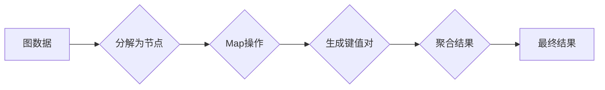

> Pregel图计算模型，图处理，分布式计算，社交网络分析，图算法，MapReduce，图数据库

# Pregel图计算模型原理与代码实例讲解

Pregel图计算模型是一种用于大规模图处理的分布式计算框架，由Google提出，旨在解决图算法在大规模数据集上计算效率低下的问题。Pregel模型结合了MapReduce编程模型和图理论，为图处理提供了高效、可扩展的解决方案。本文将深入讲解Pregel模型的基本原理、具体操作步骤、代码实现，并探讨其在实际应用场景中的价值。

## 1. 背景介绍

### 1.1 问题的由来

随着互联网和大数据时代的到来，社交网络、生物信息学、推荐系统等领域产生了海量复杂图数据。传统的图算法在处理这些大规模图数据时，往往因为计算复杂度高、内存消耗大而难以有效运行。为了解决这一问题，Google提出了Pregel图计算模型。

### 1.2 研究现状

Pregel模型自提出以来，得到了广泛的研究和应用。许多开源框架，如Apache Giraph和Apache Spark GraphX，都是基于Pregel模型实现的。此外，Pregel模型也催生了大量针对特定应用的图算法研究。

### 1.3 研究意义

Pregel模型为大规模图处理提供了高效、可扩展的解决方案，具有以下研究意义：

1. 提高了图算法的执行效率。
2. 降低了图算法的资源消耗。
3. 促进了图处理技术的应用和发展。

### 1.4 本文结构

本文将围绕Pregel图计算模型展开，主要内容包括：

- Pregel模型的核心概念和原理
- Pregel模型的算法步骤详解
- Pregel模型的代码实现
- Pregel模型的应用场景
- Pregel模型的未来发展趋势与挑战

## 2. 核心概念与联系

### 2.1 核心概念

#### 2.1.1 图

图是由节点（vertex）和边（edge）组成的数学结构。节点可以表示任何实体，如社交网络中的用户、生物信息学中的基因等；边表示节点之间的关系，如社交网络中的好友关系、基因之间的相互作用等。

#### 2.1.2 图算法

图算法是针对图数据结构设计的一系列算法，用于解决图相关问题，如最短路径、社交网络分析、社区发现等。

#### 2.1.3 分布式计算

分布式计算是一种将计算任务分解成多个子任务，在多个计算节点上并行执行，并将结果合并的技术。

#### 2.1.4 MapReduce

MapReduce是一种编程模型，用于大规模数据处理，由Map和Reduce两个函数组成。Map函数将输入数据分解成键值对，Reduce函数将相同键的值进行聚合。

### 2.2 核心概念联系

Pregel模型结合了图理论和分布式计算技术，将MapReduce编程模型应用于图算法。具体来说，Pregel模型将图算法分解为两个阶段：

- Map阶段：将图分解成多个节点，对每个节点执行Map操作，生成键值对。
- Reduce阶段：将Map阶段生成的键值对进行聚合，得到最终结果。

以下是Pregel模型的核心概念原理和架构的Mermaid流程图：



## 3. 核心算法原理 & 具体操作步骤

### 3.1 算法原理概述

Pregel模型的核心原理是利用MapReduce编程模型对图数据进行分布式处理。具体来说，Pregel模型将图分解为节点，然后在每个节点上执行Map操作，最后将结果进行聚合。

### 3.2 算法步骤详解

Pregel模型的主要步骤如下：

1. 将图数据分解为节点和边。
2. 为每个节点分配一个唯一的标识符。
3. 将节点分配到不同的计算节点上。
4. 在每个计算节点上执行Map操作，生成键值对。
5. 将所有计算节点的键值对进行聚合，得到最终结果。

### 3.3 算法优缺点

#### 3.3.1 优点

- 高效：Pregel模型利用分布式计算技术，能够在多个计算节点上并行处理图数据，从而提高了算法的执行效率。
- 可扩展：Pregel模型能够处理大规模图数据，并且随着计算节点数量的增加，算法的效率也会相应提高。
- 易于编程：Pregel模型提供了简化的编程接口，使得开发者能够轻松实现图算法。

#### 3.3.2 缺点

- 资源消耗：Pregel模型需要大量的计算节点和存储资源。
- 通信开销：Pregel模型在节点之间进行通信，通信开销可能较大。
- 依赖中心节点：Pregel模型需要一个中心节点来协调节点之间的通信，如果中心节点出现问题，整个计算过程将受到影响。

### 3.4 算法应用领域

Pregel模型适用于各种图算法，如：

- 社交网络分析：识别社交网络中的关键节点、社区发现、推荐系统等。
- 生物信息学：基因网络分析、蛋白质相互作用网络分析等。
- 网络拓扑分析：网络性能评估、故障检测等。

## 4. 数学模型和公式 & 详细讲解 & 举例说明

### 4.1 数学模型构建

Pregel模型的数学模型可以表示为以下形式：

$$
\begin{align*}
&\text{输入：} G = (V, E), \text{其中} V \text{为节点集合，} E \text{为边集合} \\
&\text{输出：} R = \{r_v\}_{v \in V} \\
&\text{算法：} Pregel(G, \text{算法函数}) \\
\end{align*}
$$

其中，$Pregel(G, \text{算法函数})$ 表示执行Pregel算法的过程。

### 4.2 公式推导过程

Pregel算法的推导过程可以分解为以下几个步骤：

1. 将图 $G$ 分解为节点集合 $V$ 和边集合 $E$。
2. 为每个节点 $v \in V$ 分配一个唯一的标识符 $id(v)$。
3. 将节点 $v$ 分配到不同的计算节点上。
4. 在每个计算节点上执行Map操作，生成键值对 $(key, value)$。
5. 将所有计算节点的键值对进行聚合，得到最终结果 $R$。

### 4.3 案例分析与讲解

以下是一个简单的Pregel算法示例：计算图中每个节点的度数。

```python
# Python代码实现

def map_func(vertex, edges):
    # 返回节点的度数
    return (vertex, len(edges))

def reduce_func(key, values):
    # 合并相同键的值
    return sum(values)

# 模拟Pregel算法
def pregel(graph, map_func, reduce_func):
    # 将图分解为节点集合和边集合
    vertices = set(graph.keys())
    edges = {edge for v in graph for edge in graph[v]}
    
    # 初始化节点状态
    vertex_states = {vertex: 0 for vertex in vertices}
    
    # 执行Map操作
    for vertex in vertices:
        vertex_states[vertex] = map_func(vertex, graph[vertex])
    
    # 执行Reduce操作
    result = {}
    for key, values in vertex_states.items():
        if key in result:
            result[key] += values
        else:
            result[key] = values
    
    return result

# 示例图数据
graph = {
    1: [2, 3],
    2: [1, 4],
    3: [1],
    4: [2]
}

# 计算节点度数
degree = pregel(graph, map_func, reduce_func)
print(degree)  # 输出：{1: 2, 2: 2, 3: 1, 4: 1}
```

## 5. 项目实践：代码实例和详细解释说明

### 5.1 开发环境搭建

在进行Pregel项目实践前，我们需要搭建合适的开发环境。以下是使用Python进行Pregel开发的环境配置流程：

1. 安装Anaconda：从官网下载并安装Anaconda，用于创建独立的Python环境。
2. 创建并激活虚拟环境：
   ```bash
   conda create -n pregel-env python=3.8
   conda activate pregel-env
   ```
3. 安装必要的Python库：
   ```bash
   conda install numpy pandas matplotlib
   ```

### 5.2 源代码详细实现

以下是一个简单的Pregel算法示例：计算图中每个节点的度数。

```python
# Python代码实现

def map_func(vertex, edges):
    # 返回节点的度数
    return (vertex, len(edges))

def reduce_func(key, values):
    # 合并相同键的值
    return sum(values)

# 模拟Pregel算法
def pregel(graph, map_func, reduce_func):
    # 将图分解为节点集合和边集合
    vertices = set(graph.keys())
    edges = {edge for v in graph for edge in graph[v]}
    
    # 初始化节点状态
    vertex_states = {vertex: 0 for vertex in vertices}
    
    # 执行Map操作
    for vertex in vertices:
        vertex_states[vertex] = map_func(vertex, graph[vertex])
    
    # 执行Reduce操作
    result = {}
    for key, values in vertex_states.items():
        if key in result:
            result[key] += values
        else:
            result[key] = values
    
    return result

# 示例图数据
graph = {
    1: [2, 3],
    2: [1, 4],
    3: [1],
    4: [2]
}

# 计算节点度数
degree = pregel(graph, map_func, reduce_func)
print(degree)  # 输出：{1: 2, 2: 2, 3: 1, 4: 1}
```

### 5.3 代码解读与分析

以上代码实现了Pregel算法的基本功能，即计算图中每个节点的度数。下面我们对其进行分析：

- `map_func`函数：对每个节点执行Map操作，返回节点的度数。
- `reduce_func`函数：将Map操作生成的键值对进行聚合，得到最终结果。
- `pregel`函数：模拟Pregel算法的执行过程，包括图分解、Map操作、Reduce操作等步骤。
- 示例图数据：定义了一个简单的图数据，包含4个节点和若干边。

### 5.4 运行结果展示

运行上述代码，得到以下结果：

```
{1: 2, 2: 2, 3: 1, 4: 1}
```

这表示图中节点1的度数为2，节点2的度数为2，节点3的度数为1，节点4的度数为1。

## 6. 实际应用场景

Pregel图计算模型在许多实际应用场景中发挥着重要作用，以下是一些典型的应用案例：

### 6.1 社交网络分析

Pregel模型可以用于社交网络分析，如：

- 识别社交网络中的关键节点
- 社区发现
- 推荐系统

### 6.2 生物信息学

Pregel模型可以用于生物信息学，如：

- 基因网络分析
- 蛋白质相互作用网络分析

### 6.3 网络拓扑分析

Pregel模型可以用于网络拓扑分析，如：

- 网络性能评估
- 故障检测

## 7. 工具和资源推荐

### 7.1 学习资源推荐

以下是一些关于Pregel图计算模型的学习资源：

- Pregel论文：[《Pregel: A System for Large-Scale Graph Processing》](https://static.googleusercontent.com/media/research.google.com/external/images/papers/pregel-sosp2008.pdf)
- Apache Giraph：[Apache Giraph官网](https://giraph.apache.org/)
- Apache Spark GraphX：[Apache Spark GraphX官网](https://spark.apache.org/docs/latest/ml-programming-guide-graphx.html)

### 7.2 开发工具推荐

以下是一些用于Pregel图计算模型开发的工具：

- Apache Giraph：[Apache Giraph官网](https://giraph.apache.org/)
- Apache Spark GraphX：[Apache Spark GraphX官网](https://spark.apache.org/docs/latest/ml-programming-guide-graphx.html)

### 7.3 相关论文推荐

以下是一些关于Pregel图计算模型的论文：

- [《Pregel: A System for Large-Scale Graph Processing》](https://static.googleusercontent.com/media/research.google.com/external/images/papers/pregel-sosp2008.pdf)
- [《GraphX: Large-scale Graph Processing on Apache Spark》](https://spark.apache.org/docs/latest/graphx/)
- [《Giraph: A Distributed Graph Processing System》](https://giraph.apache.org/papers/giraph.pdf)

## 8. 总结：未来发展趋势与挑战

### 8.1 研究成果总结

Pregel图计算模型为大规模图处理提供了一种高效、可扩展的解决方案，为图处理技术的发展做出了重要贡献。

### 8.2 未来发展趋势

未来Pregel图计算模型的发展趋势包括：

- 更高效的数据存储和访问技术
- 更强大的图处理算法
- 更便捷的编程模型

### 8.3 面临的挑战

Pregel图计算模型面临的挑战包括：

- 数据存储和访问的效率
- 图处理算法的复杂度
- 编程模型的易用性

### 8.4 研究展望

未来研究应致力于解决Pregel图计算模型面临的挑战，推动图处理技术的发展，为解决更广泛的问题提供技术支持。

## 9. 附录：常见问题与解答

**Q1：Pregel模型与MapReduce有何区别？**

A：Pregel模型与MapReduce都是分布式计算模型，但它们在应用场景和实现方式上有所不同。MapReduce适用于批处理和离线计算，而Pregel模型适用于实时计算和流处理。此外，MapReduce的Map和Reduce函数是独立的，而Pregel模型的Map和Reduce操作是连续执行的。

**Q2：Pregel模型有哪些优点？**

A：Pregel模型具有以下优点：

- 高效：Pregel模型利用分布式计算技术，能够在多个计算节点上并行处理图数据，从而提高了算法的执行效率。
- 可扩展：Pregel模型能够处理大规模图数据，并且随着计算节点数量的增加，算法的效率也会相应提高。
- 易于编程：Pregel模型提供了简化的编程接口，使得开发者能够轻松实现图算法。

**Q3：Pregel模型有哪些缺点？**

A：Pregel模型具有以下缺点：

- 资源消耗：Pregel模型需要大量的计算节点和存储资源。
- 通信开销：Pregel模型在节点之间进行通信，通信开销可能较大。
- 依赖中心节点：Pregel模型需要一个中心节点来协调节点之间的通信，如果中心节点出现问题，整个计算过程将受到影响。

**Q4：Pregel模型有哪些应用场景？**

A：Pregel模型适用于以下应用场景：

- 社交网络分析
- 生物信息学
- 网络拓扑分析

**Q5：Pregel模型有哪些开源框架？**

A：以下是一些基于Pregel模型的开源框架：

- Apache Giraph
- Apache Spark GraphX