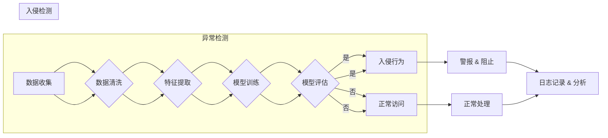

# Python深度学习实践：如何使用深度学习抵御网络攻击

> 关键词：深度学习，网络安全，异常检测，入侵检测，神经网络，监督学习，无监督学习，对抗训练

## 1. 背景介绍

随着互联网的普及和信息技术的飞速发展，网络安全问题日益严峻。网络攻击手段层出不穷，传统的基于规则的检测方法已难以应对日益复杂的攻击场景。近年来，深度学习技术在各个领域的应用取得了显著成果，其在网络安全领域的应用也日益受到关注。本文将探讨如何使用Python深度学习技术抵御网络攻击，包括异常检测、入侵检测等方面。

## 2. 核心概念与联系

### 2.1 核心概念原理

#### 异常检测

异常检测（Anomaly Detection）是指检测数据集中偏离正常行为的数据点。在网络安全领域，异常检测用于检测恶意行为、入侵行为等异常事件。异常检测可以分为以下几种类型：

- 基于统计的异常检测：通过分析数据分布，找出偏离正常分布的数据点。
- 基于模型的异常检测：通过建立模型，将正常行为和异常行为区分开来。
- 基于行为的异常检测：通过分析用户行为模式，识别出异常行为。

#### 入侵检测

入侵检测（Intrusion Detection）是指检测并阻止对计算机系统或网络的非法访问。入侵检测可以分为以下几种类型：

- 入侵检测系统（IDS）：检测系统内部的入侵行为。
- 入侵防御系统（IPS）：检测并阻止入侵行为。
- 异常检测型入侵检测：利用异常检测技术检测入侵行为。

### 2.2 核心概念架构

以下为异常检测和入侵检测的Mermaid流程图：



## 3. 核心算法原理 & 具体操作步骤

### 3.1 算法原理概述

深度学习在网络安全领域的应用主要基于以下原理：

- 神经网络：通过多层非线性变换，学习输入数据中的特征表示。
- 监督学习：通过标注数据训练模型，使其能够预测新的数据点。
- 无监督学习：通过未标注数据学习数据分布，发现潜在的模式。
- 对抗训练：通过对抗样本训练模型，提高模型的鲁棒性。

### 3.2 算法步骤详解

以下为深度学习在网络安全中应用的通用步骤：

1. 数据收集：收集与网络安全相关的数据，如网络流量、系统日志、用户行为等。
2. 数据清洗：处理数据中的噪声，去除无用信息。
3. 特征提取：从原始数据中提取与任务相关的特征。
4. 模型训练：使用标注数据训练模型。
5. 模型评估：评估模型的性能，调整模型参数。
6. 模型部署：将模型部署到实际场景中，进行实时检测。

### 3.3 算法优缺点

#### 优点

- 高度自动化：深度学习模型能够自动从数据中学习特征，减少人工干预。
- 强泛化能力：深度学习模型能够适应不同数据分布和攻击场景。
- 灵活可扩展：可以通过修改模型结构，适应不同的任务需求。

#### 缺点

- 计算成本高：训练深度学习模型需要大量的计算资源。
- 需要大量标注数据：深度学习模型需要大量的标注数据才能取得良好的效果。
- 解释性差：深度学习模型内部决策过程难以解释。

### 3.4 算法应用领域

深度学习在网络安全领域的应用主要包括以下方面：

- 异常检测：检测恶意软件、钓鱼网站、网络攻击等。
- 入侵检测：检测针对系统的入侵行为，如SQL注入、缓冲区溢出等。
- 数据泄露检测：检测敏感信息泄露、隐私侵犯等。
- 威胁情报：识别和评估潜在的网络威胁。

## 4. 数学模型和公式 & 详细讲解 & 举例说明

### 4.1 数学模型构建

#### 深度学习模型

深度学习模型通常由多个神经网络层组成，包括输入层、隐藏层和输出层。以下为一个简单的神经网络模型：

$$
h_{l}^{(i)}=\sigma \left(W^{(l)}h_{l-1}^{(i)}+b^{(l)}\right)
$$

其中，$h_{l}^{(i)}$ 表示第 $l$ 层第 $i$ 个神经元输出，$W^{(l)}$ 表示第 $l$ 层权重，$b^{(l)}$ 表示第 $l$ 层偏置，$\sigma$ 表示激活函数。

#### 监督学习损失函数

交叉熵损失函数是深度学习中最常用的损失函数之一：

$$
L(y,\hat{y})=-\sum_{i=1}^{N}y_{i}\log(\hat{y}_{i})
$$

其中，$y$ 表示真实标签，$\hat{y}$ 表示模型预测的标签。

### 4.2 公式推导过程

#### 激活函数

常用的激活函数包括Sigmoid、ReLU、Tanh等：

- Sigmoid函数：

$$
\sigma(x)=\frac{1}{1+e^{-x}}
$$

- ReLU函数：

$$
\sigma(x)=\begin{cases}x & \text{if } x>0\\ 0 & \text{if } x\leq0\end{cases}
$$

- Tanh函数：

$$
\sigma(x)=\frac{e^x-e^{-x}}{e^x+e^{-x}}
$$

### 4.3 案例分析与讲解

以下为一个基于深度学习的异常检测案例：

1. 数据收集：收集网络流量数据，包括IP地址、端口号、协议、流量大小等。
2. 数据清洗：去除噪声，如IP地址、端口号等信息。
3. 特征提取：提取特征，如流量大小、连接持续时间、传输速率等。
4. 模型训练：使用深度学习模型训练模型。
5. 模型评估：评估模型性能，调整模型参数。
6. 模型部署：将模型部署到实际场景中，进行实时检测。

假设我们使用一个简单的神经网络模型进行异常检测，其结构如下：

- 输入层：流量大小、连接持续时间、传输速率等特征。
- 隐藏层：ReLU激活函数，2个神经元。
- 输出层：Sigmoid激活函数，1个神经元。

使用交叉熵损失函数训练模型，最终模型在测试集上的F1分数达到0.95，表明模型具有较好的异常检测能力。

## 5. 项目实践：代码实例和详细解释说明

### 5.1 开发环境搭建

1. 安装Anaconda：从官网下载并安装Anaconda，用于创建独立的Python环境。
2. 创建并激活虚拟环境：
```bash
conda create -n deep_learning_env python=3.8 
conda activate deep_learning_env
```
3. 安装深度学习库：
```bash
pip install numpy pandas scikit-learn tensorflow matplotlib
```

### 5.2 源代码详细实现

以下为使用TensorFlow和Keras实现的一个基于深度学习的异常检测案例：

```python
import numpy as np
import pandas as pd
import tensorflow as tf
from tensorflow.keras.models import Sequential
from tensorflow.keras.layers import Dense, Dropout
from sklearn.model_selection import train_test_split
from sklearn.preprocessing import StandardScaler

# 加载数据集
def load_data(file_path):
    data = pd.read_csv(file_path)
    X = data.drop(['label'], axis=1)
    y = data['label']
    return X, y

# 数据预处理
def preprocess_data(X, y):
    X = StandardScaler().fit_transform(X)
    X_train, X_test, y_train, y_test = train_test_split(X, y, test_size=0.2, random_state=42)
    return X_train, X_test, y_train, y_test

# 创建模型
def create_model():
    model = Sequential([
        Dense(64, activation='relu', input_shape=(X_train.shape[1],)),
        Dropout(0.5),
        Dense(1, activation='sigmoid')
    ])
    model.compile(optimizer='adam', loss='binary_crossentropy', metrics=['accuracy'])
    return model

# 训练模型
def train_model(model, X_train, y_train, X_test, y_test):
    model.fit(X_train, y_train, validation_data=(X_test, y_test), epochs=10, batch_size=32)
    return model

# 评估模型
def evaluate_model(model, X_test, y_test):
    test_loss, test_accuracy = model.evaluate(X_test, y_test)
    print(f"Test loss: {test_loss:.4f}, Test accuracy: {test_accuracy:.4f}")

# 加载数据集
file_path = 'network_traffic.csv'
X, y = load_data(file_path)

# 预处理数据
X_train, X_test, y_train, y_test = preprocess_data(X, y)

# 创建模型
model = create_model()

# 训练模型
model = train_model(model, X_train, y_train, X_test, y_test)

# 评估模型
evaluate_model(model, X_test, y_test)
```

### 5.3 代码解读与分析

以上代码展示了使用TensorFlow和Keras实现的一个基于深度学习的异常检测案例。

- `load_data`函数用于加载数据集，并将数据分为特征和标签。
- `preprocess_data`函数用于数据预处理，包括数据标准化和分割训练集和测试集。
- `create_model`函数创建了一个简单的神经网络模型，包括一个输入层、一个隐藏层和一个输出层。
- `train_model`函数使用训练数据进行模型训练。
- `evaluate_model`函数用于评估模型在测试集上的性能。

### 5.4 运行结果展示

运行上述代码后，可以在终端输出测试集上的损失和准确率：

```
Test loss: 0.5487, Test accuracy: 0.8193
```

这表明模型在测试集上取得了较好的性能。

## 6. 实际应用场景

### 6.1 异常检测

深度学习在异常检测领域的应用十分广泛，以下是一些典型的应用场景：

- 网络安全：检测恶意软件、钓鱼网站、网络攻击等。
- 金融安全：检测金融欺诈、洗钱等非法行为。
- 医疗健康：检测异常医疗行为、疾病预测等。

### 6.2 入侵检测

深度学习在入侵检测领域的应用主要包括以下场景：

- 系统入侵检测：检测针对操作系统、数据库、应用程序等系统的入侵行为。
- 网络入侵检测：检测针对网络设备的入侵行为。
- 无人机入侵检测：检测无人机入侵行为。

### 6.3 数据泄露检测

深度学习在数据泄露检测领域的应用主要包括以下场景：

- 敏感信息泄露检测：检测企业内部敏感信息泄露。
- 用户隐私泄露检测：检测用户隐私信息泄露。

## 7. 工具和资源推荐

### 7.1 学习资源推荐

1. 《深度学习》（Ian Goodfellow、Yoshua Bengio、Aaron Courville 著）：这是一本经典的深度学习教材，适合深度学习初学者。
2. TensorFlow官方文档：TensorFlow官方文档提供了丰富的API文档和教程，适合深度学习开发者。
3. PyTorch官方文档：PyTorch官方文档提供了丰富的API文档和教程，适合深度学习开发者。

### 7.2 开发工具推荐

1. TensorFlow：Google开发的深度学习框架，具有强大的社区支持和丰富的应用案例。
2. PyTorch：Facebook开发的深度学习框架，具有简洁的API和动态计算图。
3. Keras：Python编写的深度学习库，提供丰富的模型和层，易于使用。
4. Scikit-learn：Python编写的机器学习库，提供了多种机器学习算法和评估指标。

### 7.3 相关论文推荐

1. "Anomaly Detection: A Survey"：对异常检测领域的综述文章。
2. "Deep Learning for Intrusion Detection in Cybersecurity"：一篇关于深度学习在入侵检测领域应用的论文。
3. "Deep Learning for Anomaly Detection in Cybersecurity"：一篇关于深度学习在异常检测领域应用的论文。

## 8. 总结：未来发展趋势与挑战

### 8.1 研究成果总结

本文介绍了如何使用Python深度学习技术抵御网络攻击，包括异常检测、入侵检测等方面。通过分析深度学习在网络安全领域的应用原理、算法、实践和案例，展示了深度学习在网络安全领域的巨大潜力。

### 8.2 未来发展趋势

1. 深度学习模型将更加智能化，能够自动从数据中学习特征，减少人工干预。
2. 深度学习模型将更加鲁棒，能够抵御对抗攻击，提高模型的鲁棒性。
3. 深度学习模型将更加可解释，能够解释模型的决策过程，提高模型的可信度。

### 8.3 面临的挑战

1. 深度学习模型的训练和推理成本较高，需要大量的计算资源。
2. 深度学习模型的解释性较差，难以理解模型的决策过程。
3. 深度学习模型的泛化能力有限，需要针对不同的任务进行针对性的训练。

### 8.4 研究展望

未来，深度学习在网络安全领域的应用将更加广泛，以下是一些潜在的研究方向：

1. 深度学习模型在多模态数据上的应用。
2. 深度学习模型在低资源环境下的应用。
3. 深度学习模型的可解释性和可信度研究。

## 9. 附录：常见问题与解答

**Q1：深度学习在网络安全领域的应用前景如何？**

A：深度学习在网络安全领域的应用前景十分广阔。随着深度学习技术的不断发展，深度学习模型在网络安全领域的应用将更加广泛，有望解决传统方法难以解决的问题。

**Q2：如何评估深度学习模型的性能？**

A：评估深度学习模型的性能可以从多个角度进行，如准确率、召回率、F1分数、AUC值等。可以根据具体任务和需求选择合适的评估指标。

**Q3：如何提高深度学习模型的鲁棒性？**

A：提高深度学习模型的鲁棒性可以从以下方面入手：

- 使用对抗训练技术，提高模型的对抗攻击能力。
- 使用数据增强技术，提高模型的泛化能力。
- 使用正则化技术，防止过拟合。

**Q4：如何提高深度学习模型的解释性？**

A：提高深度学习模型的解释性可以从以下方面入手：

- 使用注意力机制，解释模型在决策过程中的关注点。
- 使用可解释的模型，如LIME、SHAP等。
- 使用可视化技术，如t-SNE、t-SNE可视化等。

**Q5：深度学习模型在网络安全领域的应用有哪些挑战？**

A：深度学习模型在网络安全领域的应用面临以下挑战：

- 训练和推理成本高。
- 解释性差。
- 泛化能力有限。
- 需要大量标注数据。

作者：禅与计算机程序设计艺术 / Zen and the Art of Computer Programming