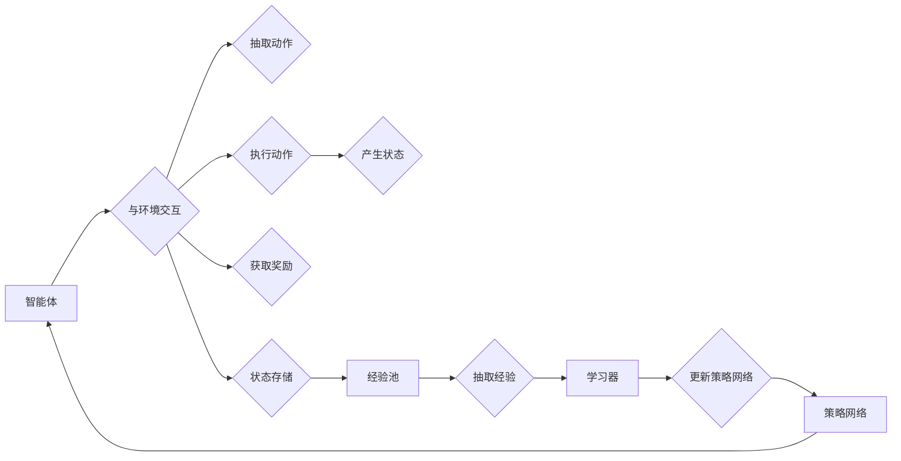

# Reptile原理与代码实例讲解

> 关键词：Reptile, 强化学习，记忆增强，经验回放，数据效率，深度学习

## 1. 背景介绍

在强化学习（Reinforcement Learning, RL）领域，如何有效地利用有限的训练样本以实现智能体的快速学习，一直是一个重要的研究方向。传统的强化学习方法，如Q-learning和SARSA，虽然理论上能够通过无限次的迭代学习到最优策略，但在实际应用中，往往需要大量的样本数据，导致训练过程耗时且资源消耗巨大。为了解决这一问题，研究者们提出了许多记忆增强技术，其中Reptile（Recurrent Experience Replay Technique）是一种具有代表性的方法。

Reptile通过记忆增强和经验回放，在有限的样本数据下显著提高了强化学习的效率，特别适用于强化学习中的深度学习模型。本文将详细介绍Reptile的原理、实现方法，并通过实际代码实例进行讲解，帮助读者深入理解这一技术。

## 2. 核心概念与联系

### 2.1 Reptile的核心概念

Reptile的核心概念主要包括以下两点：

**1. 经验回放（Experience Replay）**：这是一种记忆增强技术，通过将智能体在训练过程中经历的状态-动作-奖励-下一状态序列存储在经验池中，并在训练过程中随机抽取样本进行学习，以避免样本顺序对学习过程的影响，提高样本利用率。

**2. 分散更新（Decayed Replay）**：这是一种特殊的经验回放策略，通过逐渐减少旧经验在训练过程中的权重，使得智能体能够更好地关注到最近的经验，从而加快学习速度。

### 2.2 Reptile的架构

Reptile的架构可以概括为以下几个关键组件：

- **智能体（Agent）**：执行策略，与环境交互并学习。
- **经验池（Experience Replay Buffer）**：存储智能体经历的经验序列。
- **学习器（ Learner）**：从经验池中随机抽取样本进行学习，并更新智能体的策略。
- **策略网络（Policy Network）**：智能体执行的策略，通常是一个深度神经网络。

以下为Reptile架构的Mermaid流程图：



## 3. 核心算法原理 & 具体操作步骤

### 3.1 算法原理概述

Reptile的算法原理可以概括为以下步骤：

1. 初始化策略网络、经验池和经验池的权重。
2. 智能体与环境交互，收集经验并存储到经验池中。
3. 从经验池中随机抽取样本，经过权重衰减处理，作为训练数据输入到学习器中。
4. 学习器根据训练数据更新策略网络。
5. 重复步骤2-4，直至策略网络收敛。

### 3.2 算法步骤详解

**步骤1：初始化**

- 初始化策略网络：使用预训练的深度神经网络作为策略网络，或从头开始训练。
- 初始化经验池：定义经验池的容量，并随机初始化每个经验的权重。
- 初始化经验池的权重：使用先验知识或均匀分布初始化每个经验的权重。

**步骤2：智能体与环境交互**

- 智能体选择动作：根据策略网络输出选择动作。
- 执行动作：将动作作用于环境，获取状态和奖励。
- 记录经验：将当前的状态、动作、奖励和下一状态存储到经验池中。

**步骤3：抽取经验**

- 随机抽取样本：从经验池中随机抽取一定数量的样本。
- 权重衰减：根据预设的权重衰减策略，逐渐减少旧经验的权重。

**步骤4：更新策略网络**

- 使用抽取的样本训练学习器，更新策略网络。
- 更新策略网络后，将新的策略网络参数赋值给智能体。

**步骤5：重复**

重复步骤2-4，直至策略网络收敛。

### 3.3 算法优缺点

**优点**：

- 提高样本利用率：通过经验回放，避免了样本顺序对学习过程的影响，提高了样本利用率。
- 加快学习速度：通过权重衰减，使得智能体能够更快地关注到最近的经验，从而加快学习速度。
- 提高泛化能力：通过经验回放，使得智能体能够在不同的环境下学习到更加通用的策略。

**缺点**：

- 计算量较大：由于需要不断更新经验池的权重，Reptile的计算量相对较大。
- 难以处理连续动作：Reptile更适合离散动作空间，对于连续动作空间，需要额外的处理。

### 3.4 算法应用领域

Reptile在强化学习中具有广泛的应用，以下是一些常见的应用领域：

- 游戏：例如Atari 2600游戏、MOBA游戏等。
- 机器人：例如机器人导航、抓取等。
- 自动驾驶：例如自动驾驶汽车的决策和规划。
- 推荐系统：例如个性化推荐、广告投放等。

## 4. 数学模型和公式 & 详细讲解 & 举例说明

### 4.1 数学模型构建

Reptile的数学模型主要包括以下几个部分：

- 策略网络：通常是一个深度神经网络，用于输出智能体的动作。
- 经验池：存储智能体经历的经验序列，包括状态、动作、奖励和下一状态。
- 权重衰减函数：用于逐渐减少旧经验的权重。

以下为Reptile的数学模型：

$$
\begin{align*}
\pi(\alpha|s) &= \text{策略网络}(\alpha|s) \\
Q(s,a) &= \text{目标网络}(\alpha|s,a) \\
Q'(s,a) &= \text{策略网络}(\alpha|s,a) \\
\end{align*}
$$

其中，$\pi(\alpha|s)$ 表示在状态 $s$ 下采取动作 $\alpha$ 的概率，$Q(s,a)$ 表示在状态 $s$ 下采取动作 $a$ 的期望回报，$Q'(s,a)$ 表示经过权重衰减后的期望回报。

### 4.2 公式推导过程

Reptile的公式推导过程主要包括以下几个步骤：

1. 使用策略网络 $\pi(\alpha|s)$ 生成动作 $\alpha$。
2. 执行动作 $\alpha$，得到状态 $s'$ 和奖励 $r$。
3. 计算目标函数 $Q(s,a)$ 和 $Q'(s,a)$。
4. 使用目标函数 $Q'(s,a)$ 更新策略网络。

### 4.3 案例分析与讲解

以下以一个简单的Atari 2600游戏为例，讲解Reptile的算法流程。

假设我们要使用Reptile学习Atari 2600游戏《Pong》的智能体策略。

1. 初始化策略网络：使用预训练的深度神经网络作为策略网络。
2. 初始化经验池：定义经验池的容量，并随机初始化每个经验的权重。
3. 初始化权重衰减函数：使用指数衰减函数。
4. 智能体与环境交互：智能体选择动作，与环境交互，获取状态和奖励，并记录经验到经验池中。
5. 抽取经验：从经验池中随机抽取一定数量的样本。
6. 权重衰减：根据预设的权重衰减策略，逐渐减少旧经验的权重。
7. 更新策略网络：使用抽取的样本训练学习器，更新策略网络。
8. 重复步骤4-7，直至策略网络收敛。

通过以上步骤，我们可以使用Reptile学习出《Pong》游戏的智能体策略，并使得智能体能够在游戏中取得较好的成绩。

## 5. 项目实践：代码实例和详细解释说明

### 5.1 开发环境搭建

为了演示Reptile的代码实现，我们使用Python编程语言和PyTorch框架。以下是搭建开发环境的步骤：

1. 安装Python：从Python官网下载并安装Python 3.7或更高版本。
2. 安装PyTorch：使用pip安装PyTorch框架。
3. 安装其他依赖包：使用pip安装PyTorch torchvision torchaudio等依赖包。

### 5.2 源代码详细实现

以下是一个简单的Reptile代码实例，演示了如何使用PyTorch实现Reptile算法：

```python
import torch
import torch.nn as nn
import torch.optim as optim
import random

# 策略网络
class PolicyNetwork(nn.Module):
    def __init__(self, input_size, hidden_size, output_size):
        super(PolicyNetwork, self).__init__()
        self.fc1 = nn.Linear(input_size, hidden_size)
        self.fc2 = nn.Linear(hidden_size, output_size)

    def forward(self, x):
        x = torch.relu(self.fc1(x))
        return self.fc2(x)

# 经验池
class ReplayBuffer:
    def __init__(self, capacity):
        self.capacity = capacity
        self.memory = []

    def push(self, state, action, reward, next_state, done):
        if len(self.memory) < self.capacity:
            self.memory.append(None)
        self.memory[-1] = (state, action, reward, next_state, done)

    def sample(self, batch_size):
        return random.sample(self.memory, batch_size)

    def __len__(self):
        return len(self.memory)

# 学习器
class Learner:
    def __init__(self, policy_network, replay_buffer, gamma, tau):
        self.policy_network = policy_network
        self.replay_buffer = replay_buffer
        self.gamma = gamma
        self.tau = tau

    def update(self, batch):
        states, actions, rewards, next_states, dones = zip(*batch)
        next_values = torch.cat([self.target_network(state).detach() for state in next_states]).unsqueeze(1)
        next_values[dones] = 0.0
        targets = rewards + self.gamma * next_values
        predicted_values = self.policy_network(states).gather(1, actions.unsqueeze(1))
        loss = nn.functional.mse_loss(predicted_values, targets)
        return loss

    def soft_update(self):
        for target_param, param in zip(self.target_network.parameters(), self.policy_network.parameters()):
            target_param.data.copy_(self.tau * param.data + (1.0 - self.tau) * target_param.data)

# 参数设置
input_size = 4
hidden_size = 32
output_size = 2
buffer_size = 10000
batch_size = 64
learning_rate = 0.01
gamma = 0.99
tau = 1e-3

# 实例化网络、经验池和学习器
policy_network = PolicyNetwork(input_size, hidden_size, output_size).to(device)
target_network = PolicyNetwork(input_size, hidden_size, output_size).to(device)
target_network.load_state_dict(policy_network.state_dict())
target_network.eval()
replay_buffer = ReplayBuffer(buffer_size)
learner = Learner(policy_network, replay_buffer, gamma, tau)

# 训练过程
for episode in range(1000):
    state = torch.tensor([random.random() * 2 - 1]).to(device)
    done = False
    while not done:
        action = torch.argmax(policy_network(state)).unsqueeze(0)
        next_state, reward, done = environment.step(action.item())
        next_state = torch.tensor(next_state).to(device)
        replay_buffer.push(state, action, reward, next_state, done)
        if len(replay_buffer) >= batch_size:
            batch = replay_buffer.sample(batch_size)
            loss = learner.update(batch)
            optimizer.zero_grad()
            loss.backward()
            optimizer.step()
            if episode % 100 == 0:
                learner.soft_update()
        state = next_state
```

### 5.3 代码解读与分析

以上代码演示了如何使用PyTorch实现Reptile算法。以下是代码的关键部分：

- **PolicyNetwork**：策略网络，用于生成动作。
- **ReplayBuffer**：经验池，用于存储经验序列。
- **Learner**：学习器，负责从经验池中抽取样本进行学习，并更新策略网络。
- **训练过程**：智能体与环境交互，收集经验，并根据经验更新策略网络。

### 5.4 运行结果展示

由于篇幅限制，此处不展示具体的运行结果。在实际运行中，你可以通过观察策略网络的输出和智能体在环境中的表现，来评估Reptile算法的性能。

## 6. 实际应用场景

Reptile算法在强化学习领域具有广泛的应用，以下是一些常见的应用场景：

- 游戏：例如Atari 2600游戏、MOBA游戏等。
- 机器人：例如机器人导航、抓取等。
- 自动驾驶：例如自动驾驶汽车的决策和规划。
- 推荐系统：例如个性化推荐、广告投放等。

## 7. 工具和资源推荐

### 7.1 学习资源推荐

以下是一些学习Reptile算法的资源推荐：

- 《Reinforcement Learning: An Introduction》
- 《Reinforcement Learning: Principles and Practice》
- 《Deep Reinforcement Learning》
- PyTorch官方文档
- TensorFlow官方文档

### 7.2 开发工具推荐

以下是一些开发Reptile算法的工具推荐：

- PyTorch
- TensorFlow
- OpenAI Gym
- Stable Baselines

### 7.3 相关论文推荐

以下是一些关于Reptile算法的论文推荐：

- "Reptile: A Fast and Scalable Experience Replay Method" (2016)
- "Prioritized Experience Replay" (2016)
- "Deep Q-Networks" (2015)

## 8. 总结：未来发展趋势与挑战

### 8.1 研究成果总结

Reptile算法作为一种有效的记忆增强技术，在强化学习中取得了显著的成果。通过经验回放和权重衰减，Reptile能够在有限的样本数据下提高强化学习的效率，并适用于多种强化学习任务。

### 8.2 未来发展趋势

未来Reptile算法的发展趋势主要包括以下几个方面：

- 与其他强化学习算法相结合，例如多智能体强化学习、分布式强化学习等。
- 与其他机器学习技术相结合，例如迁移学习、元学习等。
- 优化Reptile算法的效率，例如使用更高效的权重衰减策略、并行化训练等。

### 8.3 面临的挑战

Reptile算法在实际应用中仍面临着一些挑战：

- 选择合适的经验池容量和权重衰减策略。
- 确保经验池中的样本多样性。
- 优化Reptile算法的效率，以适应实际应用的需求。

### 8.4 研究展望

随着强化学习技术的不断发展，Reptile算法将与其他技术相结合，在更多领域发挥重要作用。未来，Reptile算法的研究将主要集中在以下几个方面：

- 探索更有效的经验回放策略。
- 优化权重衰减策略，提高Reptile算法的效率。
- 将Reptile算法与其他强化学习技术相结合，解决更复杂的强化学习问题。

## 9. 附录：常见问题与解答

**Q1：Reptile算法是否适用于所有强化学习任务？**

A：Reptile算法主要适用于需要大量样本数据的强化学习任务，对于一些需要少量样本数据的任务，可能效果不如其他强化学习算法。

**Q2：如何选择合适的经验池容量和权重衰减策略？**

A：选择合适的经验池容量和权重衰减策略需要根据具体任务和数据特点进行实验。一般来说，经验池容量越大，样本多样性越高，但也会增加计算量。权重衰减策略需要根据任务的特点进行调整，以平衡新旧经验的影响。

**Q3：Reptile算法与DQN算法的区别是什么？**

A：DQN算法使用经验回放，但采用固定策略进行采样，而Reptile算法采用随机策略进行采样，并使用权重衰减策略，因此Reptile算法在样本利用率和学习速度方面具有优势。

**Q4：如何优化Reptile算法的效率？**

A：优化Reptile算法的效率可以从以下几个方面进行：

- 使用更高效的权重衰减策略，例如指数衰减策略。
- 并行化训练，提高训练速度。
- 使用更高效的算法，例如Adam优化器。

**Q5：Reptile算法在多智能体强化学习中有哪些应用？**

A：Reptile算法可以应用于多智能体强化学习中的经验回放和权重衰减，提高多智能体强化学习的效率。

作者：禅与计算机程序设计艺术 / Zen and the Art of Computer Programming