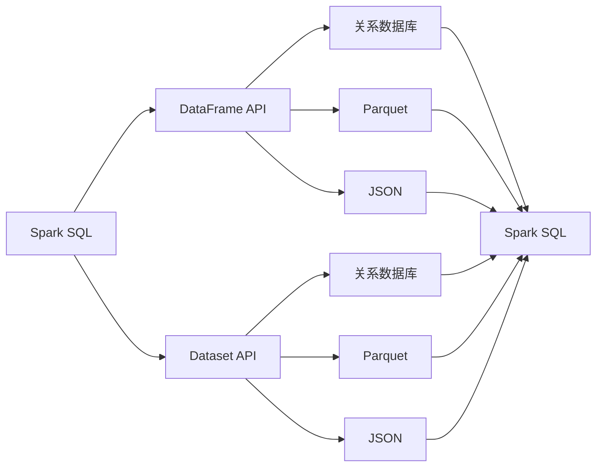

> 关键词：Spark SQL, 分布式计算, Apache Spark, 关系数据库, 数据仓库, 查询优化, 执行引擎, 数据处理

# Spark SQL原理与代码实例讲解

Apache Spark SQL是Apache Spark项目的一个模块，它提供了一种在Spark中处理结构化数据的方法，支持多种数据源和格式，并且能够与Spark的其他组件如Spark Streaming和MLlib无缝集成。本文将深入探讨Spark SQL的原理，并通过代码实例展示其应用。

## 1. 背景介绍

随着大数据时代的到来，对海量数据的处理和分析变得越来越重要。传统的批处理系统如MapReduce在处理这些任务时存在效率低下的问题。Apache Spark作为一个快速、通用的大数据处理引擎，以其高性能、易用性、强大的数据处理能力而受到广泛关注。Spark SQL是Spark的核心组件之一，它提供了对结构化数据的处理能力，使得Spark能够与关系数据库进行交互。

### 1.1 问题的由来

在处理结构化数据时，传统的批处理系统往往需要进行数据转换和格式化，这增加了复杂性和开发成本。Spark SQL的出现解决了这些问题，它允许开发者以类似SQL的方式查询数据，同时提供高效的分布式计算能力。

### 1.2 研究现状

Spark SQL支持多种数据源，包括关系数据库、Hive表、Parquet和JSON文件等。它提供了丰富的API，包括Spark SQL DataFrame和Dataset API，使得数据处理和查询更加直观和灵活。

### 1.3 研究意义

Spark SQL的研究和开发对于以下方面具有重要意义：

- 提高数据处理效率，特别是在分布式环境中。
- 简化数据查询和处理的开发流程。
- 与其他Spark组件无缝集成，提供端到端的数据处理解决方案。

### 1.4 本文结构

本文将分为以下几个部分：

- 核心概念与联系
- 核心算法原理与具体操作步骤
- 数学模型和公式
- 项目实践
- 实际应用场景
- 工具和资源推荐
- 总结：未来发展趋势与挑战
- 附录：常见问题与解答

## 2. 核心概念与联系

### 2.1 Mermaid 流程图

以下是基于Spark SQL的核心概念原理和架构的Mermaid流程图：



### 2.2 核心概念

- **DataFrame API**：提供类似SQL的数据抽象，支持丰富的操作，如过滤、连接、聚合等。
- **Dataset API**：提供RDD的类似抽象，支持惰性求值和优化。
- **关系数据库**：Spark SQL可以与关系数据库进行交互，查询和插入数据。
- **Parquet**：一种列式存储格式，适合大数据处理。
- **JSON**：一种轻量级的数据交换格式，广泛用于Web应用程序。
- **Spark SQL**：整合了这些概念，提供统一的数据处理框架。

## 3. 核心算法原理 & 具体操作步骤

### 3.1 算法原理概述

Spark SQL的核心是Catalyst查询优化器，它负责将SQL查询转换为高效的执行计划。Catalyst优化器使用多阶段优化流程，包括解析、分析、重写和物理规划。

### 3.2 算法步骤详解

1. **解析**：将SQL语句解析成抽象语法树(AST)。
2. **分析**：分析AST，提取统计信息和优化机会。
3. **重写**：根据分析结果对AST进行重写，以简化查询。
4. **物理规划**：将优化后的AST转换为物理执行计划，包括数据分区、shuffle等。

### 3.3 算法优缺点

**优点**：

- 高效：通过查询优化器生成高效的执行计划。
- 易用：提供类似SQL的查询语言。
- 强大的数据源支持：支持多种数据源。

**缺点**：

- 复杂：Catalyst查询优化器本身比较复杂。
- 资源消耗：查询优化过程可能消耗一定资源。

### 3.4 算法应用领域

- 大数据分析
- 数据仓库
- 数据湖

## 4. 数学模型和公式 & 详细讲解 & 举例说明

### 4.1 数学模型构建

Spark SQL在处理查询时，会构建一系列的数学模型来表示查询操作，例如：

- **笛卡尔积**：表示两个DataFrame之间的连接操作。
- **哈希表连接**：一种高效的连接算法。

### 4.2 公式推导过程

以笛卡尔积为例，其数学公式为：

$$
R \times S = \{(r_1, s_1), (r_1, s_2), \ldots, (r_1, s_n), (r_2, s_1), \ldots, (r_m, s_n)\}
$$

其中，$R$ 和 $S$ 分别是两个DataFrame，$r_i$ 和 $s_j$ 是DataFrame中的行。

### 4.3 案例分析与讲解

假设我们有两个DataFrame，一个是用户表，另一个是订单表，我们需要查询每个用户的订单总数。

```sql
SELECT user_id, COUNT(order_id) AS total_orders
FROM user_orders
GROUP BY user_id;
```

Spark SQL会将其转换为相应的数学模型和执行计划，并最终计算出结果。

## 5. 项目实践：代码实例和详细解释说明

### 5.1 开发环境搭建

- 安装Java开发环境
- 安装Scala开发环境
- 安装Apache Spark
- 安装IDE，如IntelliJ IDEA或Eclipse

### 5.2 源代码详细实现

以下是一个简单的Spark SQL代码实例：

```scala
import org.apache.spark.sql.{SparkSession, DataFrame}

val spark = SparkSession.builder()
  .appName("Spark SQL Example")
  .master("local[*]")
  .getOrCreate()

// 创建DataFrame
val orders = spark.read
  .option("header", "true")
  .option("inferSchema", "true")
  .csv("path/to/orders.csv")

// 创建临时视图
orders.createOrReplaceTempView("orders")

// 查询每个用户的订单总数
val userOrderCounts = spark.sql("SELECT user_id, COUNT(order_id) AS total_orders FROM orders GROUP BY user_id")

// 显示结果
userOrderCounts.show()

// 关闭Spark会话
spark.stop()
```

### 5.3 代码解读与分析

- 创建Spark会话
- 读取CSV文件，创建DataFrame
- 创建临时视图
- 执行SQL查询
- 显示结果
- 关闭Spark会话

### 5.4 运行结果展示

运行上述代码后，会在控制台输出每个用户的订单总数。

## 6. 实际应用场景

Spark SQL在以下场景中非常有用：

- 数据湖：存储和管理大规模数据
- 数据仓库：支持复杂的数据查询和分析
- ETL（提取、转换、加载）：从各种数据源提取数据，进行转换和加载

### 6.4 未来应用展望

未来，Spark SQL可能会：

- 支持更多的数据源和格式
- 提供更丰富的查询功能
- 与其他大数据技术更紧密集成

## 7. 工具和资源推荐

### 7.1 学习资源推荐

- Spark官方文档：[https://spark.apache.org/docs/latest/sql/index.html](https://spark.apache.org/docs/latest/sql/index.html)
- 《Learning Spark》书籍：[https://learning-spark.org/](https://learning-spark.org/)
- Apache Spark社区论坛：[https://spark.apache.org/community.html](https://spark.apache.org/community.html)

### 7.2 开发工具推荐

- IntelliJ IDEA：[https://www.jetbrains.com/idea/](https://www.jetbrains.com/idea/)
- Eclipse：[https://www.eclipse.org/](https://www.eclipse.org/)

### 7.3 相关论文推荐

- "Catalyst: A New Execution Engine for Spark"：介绍Spark SQL的查询优化器Catalyst。
- "Spark SQL: A Query Language and Data Processing Engine for Big Data"：介绍Spark SQL的基本原理和设计。

## 8. 总结：未来发展趋势与挑战

### 8.1 研究成果总结

Spark SQL作为Apache Spark的重要组成部分，为大数据处理提供了强大的SQL支持。它通过Catalyst查询优化器提供了高效的查询执行，并支持多种数据源。

### 8.2 未来发展趋势

- 更多的数据源支持
- 更丰富的查询功能
- 更好的性能优化

### 8.3 面临的挑战

- 复杂的查询优化
- 大规模数据处理的性能挑战
- 与其他大数据技术的集成

### 8.4 研究展望

- 开发更智能的查询优化器
- 提高数据处理的性能
- 开发更易用的API

## 9. 附录：常见问题与解答

**Q1：Spark SQL与Hive有什么区别？**

A: Spark SQL和Hive都是用于大数据处理的技术，但它们在架构和功能上有所不同。Spark SQL直接在Spark上运行，提供了更快的查询速度和更丰富的查询功能。Hive则构建在Hadoop之上，主要用于批处理查询。

**Q2：Spark SQL如何与其他Spark组件集成？**

A: Spark SQL可以与其他Spark组件如Spark Streaming和MLlib无缝集成。例如，可以使用Spark SQL读取数据，然后使用Spark Streaming进行实时处理，最后使用MLlib进行机器学习。

**Q3：Spark SQL适用于哪些场景？**

A: Spark SQL适用于需要高效处理结构化数据的大数据场景，如数据仓库、数据湖、ETL等。

**Q4：Spark SQL如何处理大数据量？**

A: Spark SQL通过分布式计算的方式处理大数据量，它可以利用集群中的多个节点并行处理数据。

作者：禅与计算机程序设计艺术 / Zen and the Art of Computer Programming