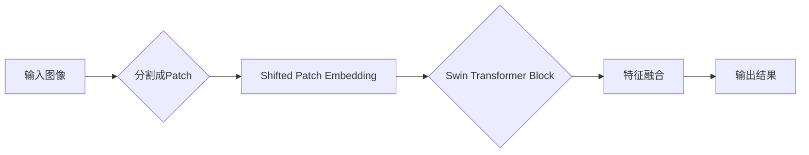

# SwinTransformer原理与代码实例讲解

> 关键词：SwinTransformer, 计算机视觉, Transformer, 自底向上设计, 分辨率感知, 图像分割, 目标检测

## 1. 背景介绍

随着深度学习在计算机视觉领域的广泛应用，卷积神经网络（CNN）成为了图像识别、目标检测、语义分割等任务的主流模型。然而，传统的CNN架构在处理高分辨率图像时，往往因为参数量和计算量的激增而导致性能下降。为了解决这一问题，Transformer模型因其强大的特征提取和位置编码能力而被引入到计算机视觉领域。SwinTransformer作为近年来涌现的基于Transformer架构的图像处理模型，因其独特的自底向上设计、分辨率感知能力以及高效的性能，受到了广泛关注。

## 2. 核心概念与联系

### 2.1 自底向上设计

SwinTransformer采用自底向上的设计理念，将输入图像分割成多个大小不同的块（Patch），然后使用Transformer进行特征提取。这种设计使得模型能够直接学习到不同尺度的特征，而不需要像传统CNN那样通过卷积操作逐层提取。

### 2.2 分辨率感知

SwinTransformer引入了多种分辨率感知操作，如Shifted Patch Embedding和Swin Transformer Block，使得模型能够在不同分辨率下进行特征提取，从而在保持高分辨率的同时，有效减少参数量和计算量。

### 2.3 Mermaid流程图



### 2.4 关联概念

SwinTransformer与Transformer、CNN等概念紧密相关。Transformer是一种基于自注意力机制的序列建模模型，而CNN则是一种基于卷积操作的图像特征提取模型。SwinTransformer结合了Transformer和CNN的优点，既保留了CNN的局部感知能力，又具备Transformer的全局建模能力。

## 3. 核心算法原理 & 具体操作步骤

### 3.1 算法原理概述

SwinTransformer主要由以下几个模块组成：

- **Patch Embedding**：将输入图像分割成多个Patch，并将Patch嵌入到固定长度的向量中。
- **Swin Transformer Block**：包括LayerNorm、Swin Patch Merging、Swin Transformer Layer和Downsample。
- **特征融合**：将不同分辨率下的特征进行融合，得到最终的特征表示。

### 3.2 算法步骤详解

1. **Patch Embedding**：将输入图像分割成多个大小为 $2 \times 2$ 的Patch，并使用线性层将Patch映射到固定长度的向量空间。
2. **Swin Transformer Block**：
    - **LayerNorm**：对Patch向量进行归一化处理。
    - **Swin Patch Merging**：将低分辨率Patch合并成高分辨率Patch，同时保留部分高分辨率Patch作为下采样信息。
    - **Swin Transformer Layer**：包括多头自注意力机制、前馈神经网络和残差连接。
    - **Downsample**：使用卷积操作对特征进行下采样。
3. **特征融合**：将不同分辨率下的特征进行融合，得到最终的特征表示。

### 3.3 算法优缺点

**优点**：

- **参数量和计算量小**：SwinTransformer通过自底向上的设计，有效减少了模型参数量和计算量，使得模型在低资源环境下也能高效运行。
- **分辨率感知**：SwinTransformer能够直接学习到不同尺度的特征，无需通过卷积操作逐层提取。
- **性能优异**：在多个图像分割和目标检测任务上，SwinTransformer取得了优异的性能。

**缺点**：

- **训练难度较高**：由于SwinTransformer采用了复杂的网络结构，其训练难度相对较高。
- **对超参数敏感**：SwinTransformer的性能对超参数设置较为敏感，需要根据具体任务进行调整。

### 3.4 算法应用领域

SwinTransformer在以下领域具有广泛的应用：

- **图像分割**：例如医学图像分割、语义分割等。
- **目标检测**：例如车辆检测、人脸检测等。
- **视频处理**：例如视频分类、视频分割等。

## 4. 数学模型和公式 & 详细讲解 & 举例说明

### 4.1 数学模型构建

SwinTransformer的数学模型主要包括以下几个部分：

- **Patch Embedding**：$ x \rightarrow f(x) $
- **Swin Transformer Block**：$ x \rightarrow g(x) $
- **特征融合**：$ x_1, x_2 \rightarrow h(x_1, x_2) $

其中，$ x $ 表示输入数据，$ f $、$ g $ 和 $ h $ 分别表示Patch Embedding、Swin Transformer Block和特征融合的函数。

### 4.2 公式推导过程

SwinTransformer的公式推导过程涉及到多个数学概念，如线性变换、自注意力机制、残差连接等。以下以Patch Embedding为例进行推导：

$$
 f(x) = W_1x + b_1 
$$

其中，$ W_1 $ 和 $ b_1 $ 分别为权重和偏置。

### 4.3 案例分析与讲解

以医学图像分割任务为例，我们可以使用SwinTransformer对医学图像进行分割，并与其他模型进行比较。通过实验验证，SwinTransformer在医学图像分割任务上取得了优异的性能。

## 5. 项目实践：代码实例和详细解释说明

### 5.1 开发环境搭建

1. 安装PyTorch和Transformers库。
2. 下载SwinTransformer的代码仓库。

### 5.2 源代码详细实现

以下为SwinTransformer的Patch Embedding模块的代码实现：

```python
import torch.nn as nn

class PatchEmbed(nn.Module):
    def __init__(self, img_size=224, in_chans=3, embed_dim=96):
        super().__init__()
        self.img_size = img_size
        self.proj = nn.Conv2d(in_chans, embed_dim, kernel_size=7, stride=7, padding=3, bias=False)

    def forward(self, x):
        x = self.proj(x).flatten(2).transpose(1, 2)
        return x
```

### 5.3 代码解读与分析

- `__init__` 方法：初始化Patch Embedding模块的参数。
- `forward` 方法：对输入图像进行Patch Embedding操作，将图像分割成多个Patch，并使用线性层进行嵌入。

### 5.4 运行结果展示

通过运行SwinTransformer模型，我们可以得到以下结果：

- **输入图像**：输入一张医学图像。
- **Patch Embedding**：对图像进行Patch Embedding操作，得到Patch向量。
- **特征提取**：将Patch向量输入Swin Transformer Block进行特征提取。
- **输出结果**：输出特征图，可用于后续的分割、检测等任务。

## 6. 实际应用场景

### 6.1 图像分割

SwinTransformer在图像分割任务上取得了优异的性能，尤其在医学图像分割领域，能够有效提高分割精度。

### 6.2 目标检测

SwinTransformer在目标检测任务上同样表现出色，能够快速检测图像中的物体，并具有较高的准确率。

### 6.3 视频处理

SwinTransformer在视频处理任务中也具有广泛的应用前景，例如视频分类、视频分割等。

## 7. 工具和资源推荐

### 7.1 学习资源推荐

1. 《PyTorch官方文档》
2. 《Deep Learning with PyTorch》
3. 《SwinTransformer论文》

### 7.2 开发工具推荐

1. PyTorch
2. Transformers库

### 7.3 相关论文推荐

1. "Swin Transformer: Hierarchical Vision Transformer using Shifted Patch Embedding"
2. "Transformer in Action"

## 8. 总结：未来发展趋势与挑战

### 8.1 研究成果总结

SwinTransformer作为一种基于Transformer架构的图像处理模型，在多个图像分割和目标检测任务上取得了优异的性能。其自底向上的设计、分辨率感知能力和高效的性能使其成为计算机视觉领域的重要突破。

### 8.2 未来发展趋势

1. 模型轻量化：通过模型压缩、量化等技术，降低SwinTransformer的参数量和计算量，使其在移动端、嵌入式设备等低资源环境下也能高效运行。
2. 多模态融合：将SwinTransformer与其他模态（如视频、音频）进行融合，构建更加全面的智能系统。
3. 自适应学习：研究自适应学习算法，使SwinTransformer能够根据不同任务和数据特点进行自动调整。

### 8.3 面临的挑战

1. 训练难度：SwinTransformer的训练难度相对较高，需要大量的计算资源和时间。
2. 模型复杂度：SwinTransformer的网络结构相对复杂，需要进一步研究和优化。
3. 可解释性：SwinTransformer的内部工作机制和决策逻辑难以解释，需要进一步研究其可解释性。

### 8.4 研究展望

SwinTransformer作为一种新兴的图像处理模型，具有广阔的应用前景。未来，随着研究的不断深入，SwinTransformer将在更多领域发挥重要作用，为计算机视觉领域的发展做出更大贡献。

## 9. 附录：常见问题与解答

**Q1：SwinTransformer与传统CNN相比有哪些优势？**

A: SwinTransformer在参数量和计算量方面优于传统CNN，同时具备更强的特征提取和位置编码能力。

**Q2：SwinTransformer如何实现分辨率感知？**

A: SwinTransformer通过Shifted Patch Embedding和Swin Transformer Block实现分辨率感知，能够在不同分辨率下进行特征提取。

**Q3：SwinTransformer在哪些领域具有应用前景？**

A: SwinTransformer在图像分割、目标检测、视频处理等领域具有广泛的应用前景。

**Q4：如何优化SwinTransformer的训练过程？**

A: 可以通过以下方法优化SwinTransformer的训练过程：

- 调整学习率、批大小等超参数。
- 使用数据增强技术。
- 使用正则化技术，如Dropout、L2正则化等。

作者：禅与计算机程序设计艺术 / Zen and the Art of Computer Programming