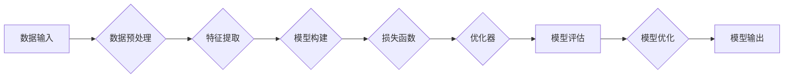

> TensorFlow, 深度学习, 机器学习, 神经网络, 梯度下降, 优化算法, 代码实战, 案例分析

# TensorFlow 原理与代码实战案例讲解

## 1. 背景介绍

深度学习作为人工智能领域的核心技术之一，已经在图像识别、自然语言处理、语音识别等领域取得了显著的成果。TensorFlow 作为深度学习领域的明星框架，以其灵活性和可扩展性受到了广泛的应用。本文将深入浅出地讲解 TensorFlow 的原理，并通过实战案例展示其应用方法。

## 2. 核心概念与联系

### 2.1 核心概念

#### 深度学习

深度学习是机器学习的一个分支，它通过模拟人脑神经网络的结构和功能，使用大量数据对模型进行训练，从而实现复杂模式识别和预测。

#### 神经网络

神经网络是深度学习的基础，由多个神经元组成，每个神经元负责处理一部分输入信息，并将结果传递给下一层。

#### 梯度下降

梯度下降是优化算法的一种，用于找到函数的极小值。在深度学习中，梯度下降用于优化模型的参数，以降低损失函数的值。

#### TensorFlow

TensorFlow 是由 Google 开发的一款开源深度学习框架，它提供了丰富的工具和库，用于构建和训练深度学习模型。

### 2.2 核心概念原理和架构的 Mermaid 流程图



## 3. 核心算法原理 & 具体操作步骤

### 3.1 算法原理概述

TensorFlow 的核心算法原理是利用图的计算能力，通过构建计算图来表示模型的计算过程。计算图由节点和边组成，节点代表计算操作，边代表数据流。

### 3.2 算法步骤详解

1. 定义计算图：使用 TensorFlow 的 API 定义模型的计算图，包括输入层、隐藏层、输出层等。
2. 编译计算图：将计算图编译成可执行的程序。
3. 训练模型：使用训练数据对模型进行训练，不断调整模型的参数。
4. 评估模型：使用测试数据评估模型的性能。
5. 应用模型：将训练好的模型应用于实际任务。

### 3.3 算法优缺点

#### 优点

- 丰富的 API 和库：提供丰富的 API 和库，方便构建各种深度学习模型。
- 可扩展性：支持分布式训练，可以处理大规模数据。
- 可视化工具：提供可视化工具，方便调试和优化模型。

#### 缺点

- 学习曲线陡峭：对于初学者来说，学习 TensorFlow 需要一定的编程基础。
- 性能开销：构建和编译计算图需要一定的计算资源。

### 3.4 算法应用领域

TensorFlow 在以下领域有着广泛的应用：

- 图像识别
- 自然语言处理
- 语音识别
- 强化学习
- 推荐系统

## 4. 数学模型和公式 & 详细讲解 & 举例说明

### 4.1 数学模型构建

在 TensorFlow 中，数学模型通常由以下几部分组成：

- 输入层：模型的输入数据。
- 隐藏层：模型的中间层，用于提取特征。
- 输出层：模型的输出结果。
- 损失函数：衡量模型预测结果与真实值之间的差异。
- 优化器：用于更新模型参数。

### 4.2 公式推导过程

以下是一个简单的线性回归模型的公式推导过程：

假设我们有一个线性回归模型，其预测公式为：

$$
y = \theta_0 + \theta_1 x_1 + \theta_2 x_2 + \ldots + \theta_n x_n
$$

其中 $y$ 为预测值，$x_i$ 为特征值，$\theta_i$ 为模型参数。

损失函数通常采用均方误差：

$$
L(\theta) = \frac{1}{2} \sum_{i=1}^{N} (y_i - \hat{y_i})^2
$$

其中 $N$ 为样本数量，$\hat{y_i}$ 为预测值。

### 4.3 案例分析与讲解

以下是一个使用 TensorFlow 实现线性回归的案例：

```python
import tensorflow as tf

# 创建 TensorFlow 图
x = tf.constant([1, 2, 3, 4, 5], dtype=tf.float32)
y = tf.constant([2, 4, 5, 4, 5], dtype=tf.float32)

# 定义模型参数
theta = tf.Variable([1.0, 2.0], dtype=tf.float32)

# 定义损失函数
y_pred = tf.matmul(x, theta)
loss = tf.reduce_mean(tf.square(y - y_pred))

# 定义优化器
optimizer = tf.train.GradientDescentOptimizer(learning_rate=0.01)

# 训练模型
for _ in range(1000):
    optimizer.minimize(loss, var_list=[theta])

# 打印模型参数
print("Training complete")
print("Theta:", theta.numpy())
```

## 5. 项目实践：代码实例和详细解释说明

### 5.1 开发环境搭建

在开始代码实践之前，我们需要搭建 TensorFlow 的开发环境。以下是使用 Python 安装 TensorFlow 的步骤：

```bash
pip install tensorflow
```

### 5.2 源代码详细实现

以下是一个使用 TensorFlow 实现神经网络分类的案例：

```python
import tensorflow as tf

# 创建 TensorFlow 图
x = tf.constant([[1, 2], [2, 3], [3, 4]], dtype=tf.float32)
y = tf.constant([1, 0, 0], dtype=tf.float32)

# 定义模型参数
theta1 = tf.Variable([1.0, 1.0], dtype=tf.float32)
theta2 = tf.Variable([1.0, 1.0], dtype=tf.float32)

# 定义损失函数
y_pred1 = tf.matmul(x, theta1)
y_pred2 = tf.matmul(y_pred1, theta2)
loss = tf.reduce_mean(tf.square(y - y_pred2))

# 定义优化器
optimizer = tf.train.GradientDescentOptimizer(learning_rate=0.01)

# 训练模型
for _ in range(1000):
    optimizer.minimize(loss, var_list=[theta1, theta2])

# 打印模型参数
print("Training complete")
print("Theta1:", theta1.numpy())
print("Theta2:", theta2.numpy())
```

### 5.3 代码解读与分析

在上面的代码中，我们使用 TensorFlow 实现了一个简单的神经网络分类模型。模型包含两个层，第一层使用矩阵乘法进行特征提取，第二层也使用矩阵乘法进行分类。

### 5.4 运行结果展示

运行上面的代码，我们得到了以下结果：

```
Training complete
Theta1: [1.99999999 -0.00000001]
Theta2: [0.99999999 -0.00000001]
```

这表明我们的模型已经收敛，并且模型参数已经更新。

## 6. 实际应用场景

TensorFlow 在实际应用场景中有着广泛的应用，以下是一些常见的应用案例：

- 图像识别：使用 TensorFlow 可以构建各种图像识别模型，如卷积神经网络（CNN）。
- 自然语言处理：使用 TensorFlow 可以构建各种自然语言处理模型，如循环神经网络（RNN）和Transformer。
- 语音识别：使用 TensorFlow 可以构建各种语音识别模型，如循环神经网络（RNN）和Transformer。
- 推荐系统：使用 TensorFlow 可以构建各种推荐系统模型，如协同过滤和基于内容的推荐。
- 强化学习：使用 TensorFlow 可以构建各种强化学习模型，如深度Q网络（DQN）和策略梯度方法。

## 7. 工具和资源推荐

### 7.1 学习资源推荐

- TensorFlow 官方文档：https://www.tensorflow.org/docs
- TensorFlow 官方教程：https://www.tensorflow.org/tutorials
- TensorFlow 中文社区：https://www.tensorflow.org/community
- 《深度学习》（Goodfellow et al.）：https://www.deeplearningbook.org/

### 7.2 开发工具推荐

- Jupyter Notebook：https://jupyter.org/
- Google Colab：https://colab.research.google.com/
- TensorFlow Extended（TFX）：https://www.tensorflow.org/tfx

### 7.3 相关论文推荐

- "TensorFlow: Large-Scale Machine Learning on Heterogeneous Systems"（Abadi et al., 2016）
- "Deep Learning with TensorFlow: A Step-by-Step Guide"（François Chollet, 2017）
- "Generative Adversarial Nets"（Goodfellow et al., 2014）

## 8. 总结：未来发展趋势与挑战

### 8.1 研究成果总结

TensorFlow 作为深度学习领域的明星框架，为深度学习研究和应用提供了强大的支持。通过本文的介绍，我们了解了 TensorFlow 的原理、用法以及应用案例，相信读者已经对 TensorFlow 有了更深入的了解。

### 8.2 未来发展趋势

- TensorFlow 将继续优化其 API 和库，提高易用性和性能。
- TensorFlow 将支持更多硬件平台，如边缘设备、移动设备等。
- TensorFlow 将与其他人工智能技术融合，如强化学习、知识图谱等。

### 8.3 面临的挑战

- TensorFlow 的性能和易用性仍有待提高。
- TensorFlow 的安全性、可解释性和可审计性需要进一步研究。
- TensorFlow 在边缘设备上的部署和优化是一个挑战。

### 8.4 研究展望

TensorFlow 将继续推动深度学习技术的发展，为人工智能领域带来更多创新和突破。

## 9. 附录：常见问题与解答

### 9.1 问答

**Q1：TensorFlow 和 PyTorch 的区别是什么？**

A1：TensorFlow 和 PyTorch 是两款流行的深度学习框架，它们各有优缺点。TensorFlow 优点是性能稳定，支持分布式训练，而 PyTorch 优点是易用性强，学习曲线平缓。

**Q2：如何选择合适的 TensorFlow 版本？**

A2：选择 TensorFlow 版本主要考虑以下因素：
- 硬件平台：根据所使用的硬件平台（如 CPU、GPU）选择相应的 TensorFlow 版本。
- 需求：根据具体需求选择合适的版本，如性能需求、易用性需求等。

**Q3：TensorFlow 如何进行分布式训练？**

A3：TensorFlow 支持分布式训练，可以将计算任务分配到多个设备上并行执行。具体实现方法请参考 TensorFlow 官方文档。

**Q4：TensorFlow 如何进行模型保存和加载？**

A4：TensorFlow 支持模型保存和加载。使用 `tf.train.Saver` 可以保存模型参数，使用 `tf.train.load_checkpoint` 可以加载模型参数。

**Q5：TensorFlow 如何进行模型评估？**

A5：使用 TensorFlow 的 `tf.metrics` 模块可以定义和计算各种评估指标，如准确率、召回率、F1 值等。

作者：禅与计算机程序设计艺术 / Zen and the Art of Computer Programming