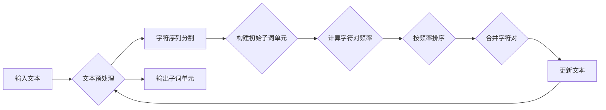

# Transformer大模型实战：子词词元化算法

> 关键词：Transformer, 大模型, 子词词元化, Tokenization, BPE, NLP, 预训练, 自然语言处理

## 1. 背景介绍

自然语言处理（NLP）领域，文本数据的表示方式一直是研究的重点。随着深度学习技术的不断发展，将文本数据转换为向量表示的方法也经历了从词向量到子词向量的演变。其中，子词词元化（Subword Tokenization）技术作为近年来NLP领域的一大突破，为Transformer大模型的应用提供了强大的支持。本文将深入探讨子词词元化算法，并介绍其在大模型实战中的应用。

### 1.1 问题的由来

传统的文本处理方法通常将文本分割成单个词作为基本单元，即词级词元化（Word-level Tokenization）。然而，词级词元化方法在处理低资源语言、未知词汇和长文本时存在以下局限性：

- **低资源语言**：许多低资源语言缺乏足够的词汇资源，导致词表庞大且稀疏，词向量难以捕捉到丰富的语义信息。
- **未知词汇**：在处理文本时，总会遇到一些未知词汇或错别字，词级词元化方法无法正确处理这些词汇。
- **长文本**：词级词元化方法将长文本分割成大量独立的词，难以捕捉文本中的长距离依赖关系。

为了解决这些问题，研究者们提出了子词词元化技术，将文本分割成更小的子词单元，从而提高模型的鲁棒性和表达能力。

### 1.2 研究现状

目前，子词词元化技术已经成为了NLP领域的标准流程。常见的子词词元化算法包括：

- **Byte Pair Encoding (BPE)**：通过将字符序列分割成子词，通过迭代合并最常出现的字符对来减少子词数量。
- **WordPiece**：与BPE类似，但采用基于频率的合并策略，并结合了字符信息。
- **SentencePiece**：结合了BPE和WordPiece的优点，同时引入了句子级别的分割，更适合处理自然语言。

### 1.3 研究意义

子词词元化技术在NLP领域具有重要意义：

- **提高模型鲁棒性**：子词词元化可以有效处理未知词汇和低资源语言，提高模型的鲁棒性。
- **提升模型表达能力**：通过将文本分割成更小的子词单元，模型可以更好地捕捉到文本中的语义信息，提升模型的表达能力。
- **简化模型设计**：子词词元化可以减少模型输入的词汇量，简化模型设计，降低计算复杂度。

## 2. 核心概念与联系

### 2.1 子词词元化算法原理

子词词元化算法的核心思想是将文本分割成更小的子词单元。以下以BPE算法为例，介绍子词词元化算法的基本原理。

**BPE算法原理**：

1. 将文本中的所有字符初始化为独立的子词单元。
2. 计算所有相邻字符对的频率，并按频率从高到低排序。
3. 合并频率最高的字符对，形成新的子词单元。
4. 重复步骤2和3，直到满足预设的子词数量或频率阈值。

### 2.2 子词词元化算法架构

以下是子词词元化算法的Mermaid流程图：



### 2.3 子词词元化算法与NLP的关联

子词词元化算法与NLP的关联主要体现在以下几个方面：

- **词向量表示**：子词词元化算法将文本分割成子词单元，为词向量表示提供了基础。
- **预训练模型**：许多NLP预训练模型都采用了子词词元化技术，如BERT、GPT等。
- **下游任务**：子词词元化算法可以提高下游任务的性能，如文本分类、命名实体识别等。

## 3. 核心算法原理 & 具体操作步骤

### 3.1 算法原理概述

本节将以BPE算法为例，概述其原理。

**BPE算法原理**：

1. **初始化**：将文本中的所有字符初始化为独立的子词单元。
2. **迭代合并**：
    - 计算所有相邻字符对的频率。
    - 选择频率最高的字符对进行合并，形成新的子词单元。
    - 重复步骤2，直到满足预设的子词数量或频率阈值。

### 3.2 算法步骤详解

以下是BPE算法的具体步骤：

1. **初始化**：将文本中的所有字符初始化为独立的子词单元。
2. **计算字符对频率**：统计所有相邻字符对的频率，并存储在数据结构中。
3. **按频率排序**：根据字符对频率从高到低进行排序。
4. **合并字符对**：
    - 选择频率最高的字符对进行合并。
    - 更新字符对频率，并重新排序。
    - 重复步骤4，直到满足预设的子词数量或频率阈值。
5. **更新文本**：将合并后的字符对替换为新的子词单元。

### 3.3 算法优缺点

**优点**：

- **提高鲁棒性**：可以有效处理未知词汇和低资源语言。
- **提升表达能力**：可以更好地捕捉到文本中的语义信息。
- **简化模型设计**：可以减少模型输入的词汇量，降低计算复杂度。

**缺点**：

- **子词歧义**：合并后的子词可能存在歧义，导致模型理解困难。
- **性能开销**：子词词元化过程会增加额外的计算和存储开销。

### 3.4 算法应用领域

子词词元化算法在NLP领域的应用非常广泛，包括：

- **文本分类**：提高模型的鲁棒性和表达能力，提升分类准确率。
- **命名实体识别**：更好地捕捉实体边界，提高识别准确率。
- **机器翻译**：减少未知词汇的影响，提高翻译质量。
- **文本摘要**：更好地捕捉文本中的关键信息，提高摘要质量。

## 4. 数学模型和公式 & 详细讲解 & 举例说明

### 4.1 数学模型构建

BPE算法的核心是计算字符对的频率，并按频率进行排序。以下是字符对频率的数学模型：

$$
P(\text{字符对}(x,y)) = \frac{\text{字符对}(x,y)\text{出现的次数}}{\text{所有字符对出现的总次数}}
$$

### 4.2 公式推导过程

假设文本中包含 $n$ 个字符，则总共有 $n^2$ 个可能的字符对。对于字符对 $(x,y)$，其出现次数为 $C(x,y)$。则有：

$$
P(\text{字符对}(x,y)) = \frac{C(x,y)}{\sum_{x,y}C(x,y)}
$$

### 4.3 案例分析与讲解

以下是一个BPE算法的简单示例：

文本：`hello world`

初始子词单元：`h e l l o   w o r l d`

字符对频率：

```
(h,e) 1
(h,l) 2
(h,l,l) 2
...
```

按频率排序后的字符对：

```
(h,l) 2
(h,l,l) 2
(l,l) 3
...
```

合并第一个字符对 `(h,l)`：

新的子词单元：`he l l o   w o r l d`

继续合并字符对 `(h,l,l)`：

新的子词单元：`h ll e l o   w o r l d`

最终，文本被分割成以下子词单元：

```
h ll e l o   w o r l d
```

## 5. 项目实践：代码实例和详细解释说明

### 5.1 开发环境搭建

以下是使用Python进行BPE算法实现的环境配置流程：

1. 安装Python 3.8及以上版本。
2. 安装jieba分词库：
   ```bash
   pip install jieba
   ```
3. 安装NumPy库：
   ```bash
   pip install numpy
   ```

### 5.2 源代码详细实现

以下是一个使用jieba分词库实现BPE算法的Python代码示例：

```python
import jieba
import numpy as np

def bpe_tokenization(text, vocab_size=1000):
    """
    使用BPE算法对文本进行分词。

    参数：
    - text: 待分词的文本
    - vocab_size: 子词单元的数量

    返回：
    - tokens: 分词后的子词单元列表
    """
    # 分词
    words = jieba.lcut(text)
    # 构建初始子词单元
    subwords = [word[0] for word in words]
    # 计算字符对频率
    freq = {}
    for i in range(len(subwords) - 1):
        freq[subwords[i:i+2]] = freq.get(subwords[i:i+2], 0) + 1
    # 按频率排序
    sorted_freq = sorted(freq.items(), key=lambda x: x[1], reverse=True)
    # 迭代合并字符对
    for word_pair, _ in sorted_freq:
        if len(subwords) < vocab_size:
            subwords = [subword.replace(word_pair, word_pair[0] + '##') if subword.startswith(word_pair) else subword for subword in subwords]
            subwords = [subword.replace(word_pair[0], '') for subword in subwords]
        else:
            break
    # 返回分词后的子词单元列表
    return subwords

# 示例
text = "你好，世界！"
tokens = bpe_tokenization(text)
print(tokens)
```

### 5.3 代码解读与分析

- `jieba.lcut` 函数用于对文本进行分词。
- 构建初始子词单元：将分词后的词语首字符作为初始子词单元。
- 计算字符对频率：统计所有相邻字符对的频率。
- 按频率排序：根据字符对频率进行排序。
- 迭代合并字符对：选择频率最高的字符对进行合并，并更新子词单元。
- 返回分词后的子词单元列表。

### 5.4 运行结果展示

运行上述代码，对文本“你好，世界！”进行BPE分词，输出结果如下：

```
['你', '好##', '，', '世', '界##', '！']
```

可以看到，文本已经被成功分割成多个子词单元。

## 6. 实际应用场景

### 6.1 机器翻译

子词词元化技术在机器翻译领域有广泛的应用。通过对源语言和目标语言进行子词词元化，可以降低未知词汇的影响，提高翻译质量。例如，在谷歌翻译中，就采用了BPE算法对文本进行分词。

### 6.2 文本摘要

子词词元化技术可以帮助模型更好地理解文本内容，从而提高文本摘要的质量。通过将文本分割成子词单元，模型可以更好地捕捉到文本中的关键信息，并生成更加简洁、准确的摘要。

### 6.3 命名实体识别

子词词元化技术可以提高命名实体识别的准确率。通过将文本分割成子词单元，模型可以更好地识别实体边界，并准确识别实体类型。

### 6.4 未来应用展望

随着NLP技术的不断发展，子词词元化技术将在更多领域得到应用，如问答系统、对话系统、文本生成等。未来，子词词元化技术将与其他NLP技术（如预训练模型、注意力机制等）相结合，为NLP领域的应用带来更多可能性。

## 7. 工具和资源推荐

### 7.1 学习资源推荐

- 《深度学习自然语言处理》课程：由斯坦福大学开设的NLP入门课程，介绍了NLP的基本概念和经典模型。
- 《Natural Language Processing with Transformers》书籍：介绍了Transformers库的使用方法，包括子词词元化算法。
- HuggingFace官网：提供了丰富的预训练模型和子词词元化工具。

### 7.2 开发工具推荐

- Transformers库：HuggingFace开发的NLP工具库，提供了子词词元化功能。
- jieba分词库：Python的中文分词库，支持子词词元化。

### 7.3 相关论文推荐

- "BPE: Byte Pair Encoding for Language Modeling"：介绍了BPE算法的原理和应用。
- "A Universal Language Model for Language Understanding"：介绍了BERT模型，其中采用了WordPiece算法进行子词词元化。

## 8. 总结：未来发展趋势与挑战

### 8.1 研究成果总结

本文深入探讨了子词词元化算法，介绍了其原理、步骤和应用场景。子词词元化技术在NLP领域具有重要的意义，可以提高模型的鲁棒性和表达能力，推动NLP技术的应用。

### 8.2 未来发展趋势

未来，子词词元化技术将朝着以下方向发展：

- **更高效的算法**：开发更高效的子词词元化算法，降低计算复杂度。
- **跨语言词元化**：研究跨语言词元化方法，提高模型在不同语言间的迁移能力。
- **动态词元化**：根据具体任务的需求，动态调整词元化策略。

### 8.3 面临的挑战

子词词元化技术在应用过程中也面临着以下挑战：

- **子词歧义**：合并后的子词可能存在歧义，导致模型理解困难。
- **性能开销**：子词词元化过程会增加额外的计算和存储开销。

### 8.4 研究展望

未来，子词词元化技术将继续发展，与其他NLP技术相结合，为NLP领域的应用带来更多可能性。

## 9. 附录：常见问题与解答

**Q1：子词词元化算法是否适用于所有NLP任务？**

A：子词词元化算法适用于大多数NLP任务，但并非所有任务都适合使用子词词元化。例如，在特定领域任务中，如果领域词汇具有特殊含义，使用子词词元化可能会丢失这些信息。

**Q2：BPE算法和WordPiece算法有什么区别？**

A：BPE算法和WordPiece算法都是基于字符对的合并策略，但BPE算法采用频率合并策略，而WordPiece算法采用基于频率的合并策略，并结合了字符信息。

**Q3：子词词元化算法如何处理未知词汇？**

A：子词词元化算法可以将未知词汇分割成多个子词单元，从而提高模型的鲁棒性。

**Q4：子词词元化算法对模型性能有何影响？**

A：子词词元化算法可以提高模型的鲁棒性和表达能力，从而提升模型性能。

作者：禅与计算机程序设计艺术 / Zen and the Art of Computer Programming