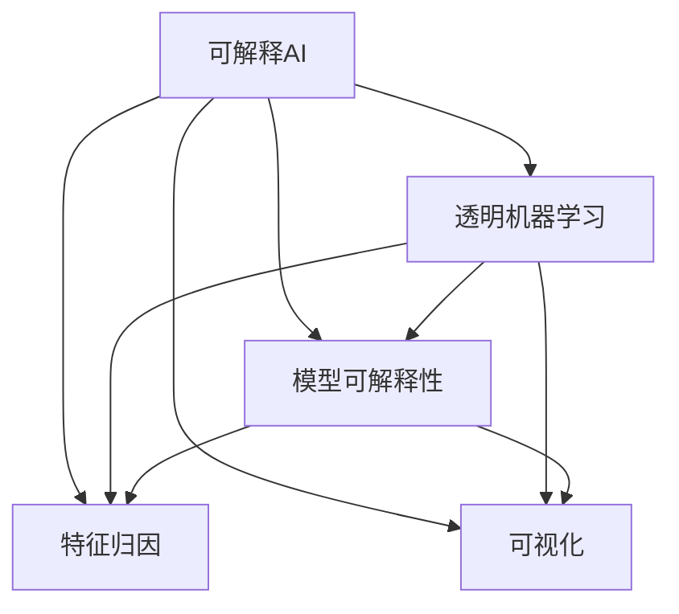
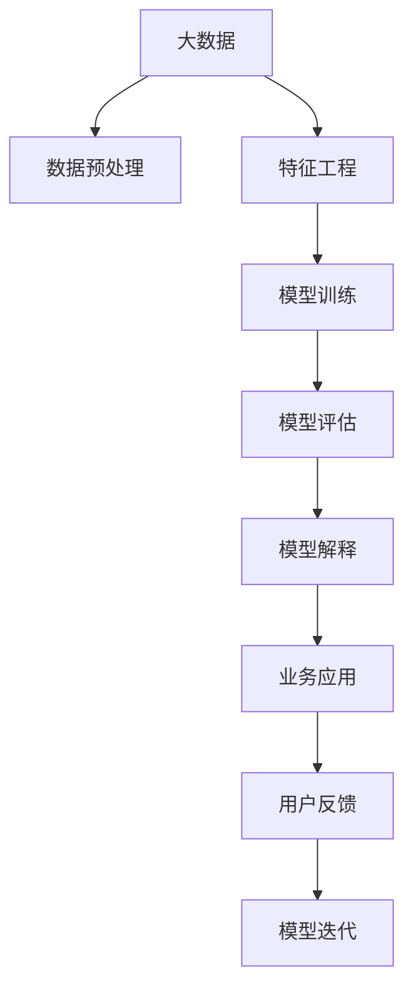

                 

# 可解释人工智能原理与代码实战案例讲解

> 关键词：可解释AI, 透明机器学习, 模型可解释性, 代码实践, 可解释算法, 数据可视化

## 1. 背景介绍

### 1.1 问题由来
随着人工智能技术的快速发展，机器学习模型在医疗、金融、法律等领域得到了广泛应用，但其“黑盒”特性也引发了人们对模型决策透明度的关注。缺乏透明性的模型往往难以被广泛接受，尤其是在与人类利益攸关的领域。为解决这一问题，可解释人工智能（Explainable Artificial Intelligence, XAI）成为近年来研究的热点。XAI旨在提升模型的可解释性，使其不仅能够准确预测，还能提供清晰的推理逻辑，让模型决策过程可解释、可理解。

### 1.2 问题核心关键点
可解释人工智能的核心目标是通过改进模型结构、算法或后处理技术，使其输出具备更好的可解释性。常见的可解释方法包括：

- 模型可视化：通过绘制热图、特征重要性图等方式，直观展示模型在不同特征上的关注度。
- 特征归因：通过LIME、SHAP等技术，逐层分析模型的决策路径，解释模型的预测结果。
- 解释型模型：设计特定的模型结构，如决策树、逻辑回归等，便于理解和解释。

此外，可解释性还涉及到数据收集、模型训练和部署等多个环节，需综合考虑模型的准确性和可解释性之间的平衡。

### 1.3 问题研究意义
提升机器学习模型的可解释性，对于构建可信、透明的AI系统具有重要意义：

1. **增强用户信任**：让决策过程可解释，有助于提高用户对AI系统的信任度。
2. **提升决策质量**：通过可视化和归因分析，可以发现模型存在的偏置或错误，优化模型性能。
3. **促进法规合规**：可解释性符合越来越多国家和地区对AI的法规要求，如欧盟的《通用数据保护条例》（GDPR）等。
4. **支持模型迭代**：通过解释模型输出，帮助数据科学家更好地理解模型行为，优化模型训练过程。
5. **推动AI普及**：易于解释的模型更容易被理解和接受，有助于加速AI技术在各领域的落地应用。

## 2. 核心概念与联系

### 2.1 核心概念概述

为更好地理解可解释人工智能的原理和实践，本节将介绍几个关键概念：

- 可解释人工智能（Explainable AI, XAI）：旨在使机器学习模型的决策过程透明可解释，便于理解和审查。
- 透明机器学习（Transparent Machine Learning）：通过改进模型设计或后处理技术，提升模型的可解释性。
- 模型可解释性（Model Interpretability）：指模型输出能够被解释，即用户可以理解模型如何得出某一预测结果。
- 特征归因（Feature Attribution）：通过分析模型在不同特征上的影响，解释模型的决策过程。
- 可视化（Visualization）：通过图形化展示模型的关键信息，帮助用户理解模型行为。

### 2.2 概念间的关系

这些核心概念之间的关系可以通过以下Mermaid流程图来展示：



这个流程图展示了几者之间的关系：

- 可解释AI的目标是通过透明机器学习提升模型可解释性。
- 透明机器学习可以通过特征归因和可视化等方法提升模型可解释性。
- 特征归因和可视化是实现可解释性的具体手段。

### 2.3 核心概念的整体架构

最后，我们用一个综合的流程图来展示这些核心概念在大数据中的应用：



这个综合流程图展示了从数据预处理到业务应用的全过程，其中每个环节都可能涉及模型的可解释性提升：

1. 数据预处理：清洗和处理数据，减少噪音干扰，提升模型性能。
2. 特征工程：选择和构建特征，优化模型输入。
3. 模型训练：训练并优化模型，提升预测准确性。
4. 模型评估：评估模型性能，发现潜在问题。
5. 模型解释：通过可视化、特征归因等方法，提升模型可解释性。
6. 业务应用：将模型应用于实际业务场景。
7. 用户反馈：收集用户反馈，进一步优化模型。
8. 模型迭代：根据反馈持续优化模型，提升性能和可解释性。

通过这个流程图，我们可以更清晰地理解可解释AI在大数据应用中的全流程，从而系统地提升模型性能和可解释性。

## 3. 核心算法原理 & 具体操作步骤
### 3.1 算法原理概述

可解释AI的原理是通过改进模型结构和算法，使其输出具备更好的可解释性。常见的方法包括特征归因、可视化等。

以LIME（Local Interpretable Model-agnostic Explanations）为例，LIME旨在通过局部线性模型拟合原始模型，从而解释模型的预测结果。LIME的原理是：

1. 在每个样本附近构建线性模型，拟合原始模型预测。
2. 通过对比模型输出与局部线性模型输出，计算特征的重要性。
3. 利用这些特征重要性图，解释模型的预测。

### 3.2 算法步骤详解

以下我们将详细介绍LIME算法的详细步骤：

1. **数据准备**：选择样本，将输入数据标准化，设置预测目标。

2. **局部拟合**：对于每个样本，构建一个局部线性模型，拟合原始模型预测。使用随机梯度下降或拟牛顿法求解线性模型参数。

3. **特征重要性计算**：通过对比原始模型和局部线性模型的输出，计算每个特征的重要性。LIME使用Poisson回归和L1正则化来估计特征重要性。

4. **可视化展示**：将特征重要性可视化，生成特征归因图。

5. **结果解释**：根据特征归因图，解释模型对每个样本的预测结果。

### 3.3 算法优缺点

LIME算法的主要优点包括：

- 模型无关性：适用于多种机器学习模型，不限于线性模型。
- 局部解释性：通过局部线性模型，提供逐点解释。
- 可解释性强：生成的特征重要性图直观易懂。

其缺点包括：

- 计算成本高：需要构建多个局部模型，计算开销大。
- 依赖数据分布：局部模型的拟合效果依赖数据分布，分布不一致可能导致解释偏差。

### 3.4 算法应用领域

LIME算法广泛应用于金融风险评估、医疗诊断、法律决策等需要高透明度的领域。例如：

- 金融风控：通过LIME解释模型，金融机构可以理解模型如何评估贷款违约风险，优化风控策略。
- 医疗诊断：医生可以使用LIME解释模型，理解诊断系统如何识别癌症等疾病，提高诊断准确性。
- 法律诉讼：法律工作者可以使用LIME解释模型，理解预测系统如何判断案件结果，优化法律策略。

此外，LIME还在自然语言处理（NLP）任务中得到了应用，如情感分析、文本分类等，解释模型预测结果，提高模型透明度。

## 4. 数学模型和公式 & 详细讲解  
### 4.1 数学模型构建

假设有一个二分类模型 $M$，输入为 $x \in \mathbb{R}^n$，输出为 $y \in \{0,1\}$。设 $M(x)$ 为模型对输入 $x$ 的预测，$f(x)$ 为实际标签，则模型的损失函数为：

$$
L(M(x), f(x)) = \mathbb{I}(M(x) \neq f(x))
$$

其中 $\mathbb{I}$ 为示性函数，表示预测结果与实际标签不一致。

### 4.2 公式推导过程

对于每个样本 $x_i$，LIME算法构建局部线性模型 $M_L(x)$，使得 $M_L(x_i) \approx M(x_i)$。假设局部线性模型为：

$$
M_L(x) = w^T \varphi(x) + b
$$

其中 $w \in \mathbb{R}^m$ 为权重向量，$\varphi(x)$ 为特征映射，$b$ 为偏差项。

通过对比 $M(x_i)$ 和 $M_L(x_i)$，可以估计特征 $x_i$ 的重要性 $w_i$：

$$
w_i = \text{argmin}_{w} \sum_{x \in \mathcal{N}(x_i)} L(M(x), M_L(x)) + \lambda ||w||_1
$$

其中 $\mathcal{N}(x_i)$ 为 $x_i$ 的邻域，$\lambda$ 为L1正则化系数。

### 4.3 案例分析与讲解

以一个简单的线性回归模型为例，假设模型为 $M(x) = wx + b$，其中 $w \in \mathbb{R}^n$，$b \in \mathbb{R}$。设 $x_1 = [1,2]$，$y_1 = 5$。设 $M(x_1) = 5$，$M_L(x_1) = w^T\varphi(x_1) + b$。

1. **数据准备**：选择样本 $x_1$，将输入数据标准化，设置预测目标。
2. **局部拟合**：构建局部线性模型 $M_L(x_1)$，拟合原始模型预测。使用随机梯度下降或拟牛顿法求解线性模型参数。
3. **特征重要性计算**：通过对比 $M(x_1)$ 和 $M_L(x_1)$，计算每个特征的重要性。
4. **可视化展示**：将特征重要性可视化，生成特征归因图。
5. **结果解释**：根据特征归因图，解释模型对每个样本的预测结果。

## 5. 项目实践：代码实例和详细解释说明
### 5.1 开发环境搭建

在进行可解释AI的实践前，我们需要准备好开发环境。以下是使用Python进行Scikit-learn开发的环境配置流程：

1. 安装Anaconda：从官网下载并安装Anaconda，用于创建独立的Python环境。

2. 创建并激活虚拟环境：
```bash
conda create -n xai-env python=3.8 
conda activate xai-env
```

3. 安装Scikit-learn、TensorFlow等工具包：
```bash
pip install scikit-learn tensorflow
```

4. 安装LIME库：
```bash
pip install lime
```

5. 安装可视化工具：
```bash
pip install matplotlib seaborn
```

完成上述步骤后，即可在`xai-env`环境中开始可解释AI实践。

### 5.2 源代码详细实现

这里我们以一个简单的线性回归模型为例，展示如何使用LIME算法进行可解释性分析。

首先，导入所需的库和数据：

```python
import numpy as np
import matplotlib.pyplot as plt
from sklearn.linear_model import LinearRegression
from sklearn.datasets import make_regression
from sklearn.metrics import r2_score
from sklearn.model_selection import train_test_split
from lime import lime_tabular
from sklearn.preprocessing import StandardScaler
import seaborn as sns

# 创建数据集
X, y = make_regression(n_samples=1000, n_features=5, n_informative=3, noise=0.1, random_state=42)
X_train, X_test, y_train, y_test = train_test_split(X, y, test_size=0.2, random_state=42)

# 标准化数据
scaler = StandardScaler()
X_train = scaler.fit_transform(X_train)
X_test = scaler.transform(X_test)

# 训练模型
model = LinearRegression()
model.fit(X_train, y_train)

# 预测并评估模型
y_pred = model.predict(X_test)
print("R^2 score:", r2_score(y_test, y_pred))
```

接下来，构建LIME模型，并计算特征重要性：

```python
# 创建LIME解释器
explainer = lime_tabular.LimeTabularExplainer(X_train, feature_names=['x1', 'x2', 'x3', 'x4', 'x5'], 
                                           class_names=['class 0', 'class 1'], 
                                           verbose=False, 
                                           random_state=42)

# 计算特征重要性
imp = explainer.explain_instance(X_test[0], model.predict_proba, 
                                n_features=3, # 选择3个特征进行解释
                                num_samples=100, # 随机选择100个样本进行局部拟合
                                num_pairs=5) # 构建5个局部模型

# 可视化特征重要性
sns.pairplot(X_test, hue=imp['label'], diag_kind='kde')
plt.show()
```

最后，展示特征重要性图：

```python
# 绘制特征重要性图
plt.figure(figsize=(10, 6))
plt.plot(imp['feature_importances'], marker='o', linestyle='-', color='blue')
plt.xlabel('Feature Index')
plt.ylabel('Impact')
plt.title('Feature Importance')
plt.show()
```

### 5.3 代码解读与分析

让我们再详细解读一下关键代码的实现细节：

**数据集创建**：
- `make_regression`函数创建了一个包含5个特征的回归数据集，其中3个特征为有用的特征，1个为噪声特征。

**模型训练**：
- 使用`LinearRegression`模型对训练集进行训练，并输出R^2分数，评估模型性能。

**LIME解释器创建**：
- `LimeTabularExplainer`类用于创建LIME解释器，需要指定训练数据、特征名、类别名等参数。

**特征重要性计算**：
- `explain_instance`方法用于解释模型对特定样本的预测结果，`model.predict_proba`为模型预测概率，`n_features`为选择解释的特征数量，`num_samples`为随机选择样本数量，`num_pairs`为构建的局部模型数量。

**特征重要性可视化**：
- 使用`pairplot`函数可视化特征间的相关性，并通过绘制曲线图展示每个特征的重要性。

通过上述代码，我们可以看到LIME算法如何通过局部拟合来解释模型预测结果，从而提升模型的可解释性。LIME算法的优点在于其模型无关性和局部解释性，适用于多种机器学习模型。然而，LIME的计算成本较高，可能不适用于大规模数据集。

## 6. 实际应用场景
### 6.1 智能推荐系统

智能推荐系统是典型的应用场景之一。在推荐系统中，用户的行为数据（如浏览历史、购买记录）可以被用来训练预测模型，预测用户可能感兴趣的商品。然而，用户的行为数据往往是高维稀疏的，模型难以解释其背后的原因。通过引入LIME等可解释技术，推荐系统可以生成特征重要性图，帮助用户理解推荐结果背后的原因，提升用户信任和满意度。

### 6.2 金融风险评估

金融风险评估是另一个重要应用场景。金融机构使用各种模型来预测贷款违约、信用评分等，但这些模型往往是“黑盒”的，难以解释其决策依据。通过引入LIME等可解释技术，金融机构可以生成特征重要性图，帮助风险评估师理解模型的预测结果，优化风险控制策略。

### 6.3 医疗诊断系统

医疗诊断系统也是LIME等可解释技术的典型应用场景。医生使用各种模型来预测疾病的发生概率，但这些模型往往是“黑盒”的，难以解释其决策依据。通过引入LIME等可解释技术，医生可以生成特征重要性图，帮助理解诊断系统如何识别疾病，提高诊断准确性和可信度。

### 6.4 未来应用展望

随着可解释AI技术的发展，其在各个领域的应用前景将更加广阔。未来，可解释AI将广泛应用于：

- **自动驾驶**：帮助解释自动驾驶决策，提升用户信任度。
- **智能制造**：解释生产过程和预测结果，优化生产管理。
- **环境保护**：解释环境监测数据，提高环境治理的透明度。
- **公共安全**：解释司法判决，提升司法公正性。

此外，可解释AI技术将不断融合其他AI技术，如因果推理、强化学习等，提升AI系统的整体性能和透明度。未来，随着技术的不断进步，可解释AI将成为AI系统不可或缺的一部分，推动AI技术的普及和应用。

## 7. 工具和资源推荐
### 7.1 学习资源推荐

为了帮助开发者系统掌握可解释AI的理论基础和实践技巧，这里推荐一些优质的学习资源：

1. 《可解释机器学习》（Interpretable Machine Learning）书籍：由Rachel Thomas和Peter Warden编写，系统介绍了可解释机器学习的理论基础和实践方法，适合初学者和进阶者。

2. LIME官方文档：LIME的官方文档提供了详细的API文档和示例代码，是学习和实践LIME的重要资源。

3. Scikit-learn官方文档：Scikit-learn的官方文档详细介绍了各种机器学习算法，包括可解释AI的相关内容。

4. Kaggle竞赛：Kaggle上有许多与可解释AI相关的竞赛，可以参与实践并学习其他开发者的经验。

5. AI博文（博客）：如 Towards Data Science、Machine Learning Mastery等博客，定期分享最新的AI技术进展和案例分析。

通过这些资源的学习和实践，相信你一定能够快速掌握可解释AI的精髓，并用于解决实际的AI问题。

### 7.2 开发工具推荐

高效的开发离不开优秀的工具支持。以下是几款用于可解释AI开发的常用工具：

1. Scikit-learn：基于Python的开源机器学习库，提供了各种机器学习算法和评估指标，是进行可解释AI开发的基础工具。

2. TensorFlow：由Google主导开发的开源深度学习框架，提供了丰富的工具和库，支持各种机器学习任务，包括可解释AI。

3. Jupyter Notebook：一种交互式的Jupyter笔记本，支持代码、注释、数学公式等混合展示，适合进行可解释AI的实验和研究。

4. Visual Studio Code：一种流行的IDE，支持Python开发环境，集成了各种插件和扩展，方便开发和调试。

5. R IDE：如RStudio等，是专门用于R语言开发的IDE，适合进行可解释AI的相关开发和分析。

合理利用这些工具，可以显著提升可解释AI的开发效率，加快创新迭代的步伐。

### 7.3 相关论文推荐

可解释AI的发展源于学界的持续研究。以下是几篇奠基性的相关论文，推荐阅读：

1. "A Unified Approach to Interpreting Model Predictions"（Interpretable Machine Learning的论文）：提出了一种统一的模型解释方法，适用于多种机器学习模型。

2. "Explainable Artificial Intelligence: Potential and Hurdles"：探讨了可解释AI在各个领域的应用潜力及其面临的挑战。

3. "Towards Explainable Deep Learning"：提出了一种基于模型结构的可解释方法，适用于深度学习模型。

4. "LIME: A Toolkit for Explaining the Predictions of Any Classifier"：介绍了LIME算法的原理和实现细节。

5. "Leveraging Explanations for Model Selection and Interpretation"：探讨了如何利用解释提升模型的选择和理解。

这些论文代表了大语言模型微调技术的发展脉络。通过学习这些前沿成果，可以帮助研究者把握学科前进方向，激发更多的创新灵感。

除上述资源外，还有一些值得关注的前沿资源，帮助开发者紧跟可解释AI技术的最新进展，例如：

1. arXiv论文预印本：人工智能领域最新研究成果的发布平台，包括大量尚未发表的前沿工作，学习前沿技术的必读资源。

2. 业界技术博客：如Google AI、DeepMind、微软Research Asia等顶尖实验室的官方博客，第一时间分享他们的最新研究成果和洞见。

3. 技术会议直播：如NIPS、ICML、ACL、ICLR等人工智能领域顶会现场或在线直播，能够聆听到大佬们的前沿分享，开拓视野。

4. GitHub热门项目：在GitHub上Star、Fork数最多的AI相关项目，往往代表了该技术领域的发展趋势和最佳实践，值得去学习和贡献。

5. 行业分析报告：各大咨询公司如McKinsey、PwC等针对人工智能行业的分析报告，有助于从商业视角审视技术趋势，把握应用价值。

总之，对于可解释AI的学习和实践，需要开发者保持开放的心态和持续学习的意愿。多关注前沿资讯，多动手实践，多思考总结，必将收获满满的成长收益。

## 8. 总结：未来发展趋势与挑战
### 8.1 总结

本文对可解释人工智能原理与代码实战案例进行了全面系统的介绍。首先阐述了可解释AI的背景、核心概念和应用意义，明确了可解释AI在提升模型透明度、用户信任和决策质量方面的独特价值。其次，从原理到实践，详细讲解了LIME算法的数学原理和关键步骤，给出了可解释AI任务开发的完整代码实例。同时，本文还广泛探讨了可解释AI在推荐系统、金融风险评估、医疗诊断等各个领域的应用前景，展示了可解释AI技术的巨大潜力。此外，本文精选了可解释AI技术的学习资源、开发工具和相关论文，力求为读者提供全方位的技术指引。

通过本文的系统梳理，可以看到，可解释AI技术正在成为机器学习应用的重要范式，极大地提升了模型的透明度和可信度，为AI系统的落地应用提供了重要保障。未来，随着可解释AI技术的发展，其在各个领域的应用将更加广泛，推动人工智能技术的普及和深入应用。

### 8.2 未来发展趋势

展望未来，可解释AI技术将呈现以下几个发展趋势：

1. **模型无关性**：未来可解释AI技术将更加模型无关，适用于各种类型的机器学习模型。

2. **多模态解释**：未来可解释AI将能够融合多种数据模态，如文本、图像、语音等，提供多模态的解释方式。

3. **因果解释**：通过引入因果推理技术，提供更加可靠的解释，避免误导性的解释。

4. **主动学习**：通过主动学习技术，提高特征选择和解释的效率。

5. **知识图谱集成**：将知识图谱与机器学习模型结合，提升模型的解释能力和知识整合能力。

6. **AI伦理**：可解释AI技术将进一步融入AI伦理体系，确保模型的透明性和公正性。

以上趋势凸显了可解释AI技术的广阔前景。这些方向的探索发展，必将进一步提升AI系统的性能和可解释性，为构建透明可信的AI系统奠定坚实基础。

### 8.3 面临的挑战

尽管可解释AI技术已经取得了一定的进展，但在迈向更加智能化、普适化应用的过程中，它仍面临着诸多挑战：

1. **计算成本高**：构建和解释模型的计算成本高，难以在实际应用中快速部署。

2. **解释质量不稳定**：特征重要性图等解释方法依赖于局部模型的拟合效果，解释质量不稳定。

3. **数据隐私保护**：解释过程中需要处理和分析大量敏感数据，数据隐私保护成为重要问题。

4. **解释复杂性**：高维稀疏数据的解释难度大，解释复杂性增加。

5. **解释信任度**：解释方法的效果和可靠性不足，用户难以信任模型的解释。

6. **跨领域可解释性**：不同领域的数据和模型结构差异大，难以进行跨领域的解释。

正视可解释AI面临的这些挑战，积极应对并寻求突破，将是可解释AI技术走向成熟的重要路径。相信随着学界和产业界的共同努力，这些挑战终将一一被克服，可解释AI必将在构建透明可信的AI系统中扮演越来越重要的角色。

### 8.4 研究展望

面对可解释AI技术面临的挑战，未来的研究需要在以下几个方面寻求新的突破：

1. **高效解释技术**：开发更高效的解释方法，如基于树模型的解释、因果解释等，提升解释质量和效率。

2. **跨模态解释**：融合多种数据模态，提升解释的全面性和可靠性。

3. **数据隐私保护**：引入差分隐私等技术，保护数据隐私，确保解释过程中的数据安全。

4. **多领域解释**：发展跨领域的解释方法，提升模型的泛化性和解释效果。

5. **用户信任机制**：设计可信的解释方式，增强用户对AI系统的信任度。

6. **解释效果评估**：建立评估指标，量化解释方法的准确性和可靠性，推动解释技术的发展。

这些研究方向的探索，必将引领可解释AI技术迈向更高的台阶，为构建透明可信的AI系统铺平道路。面向未来，可解释AI技术还需要与其他人工智能技术进行更深入的融合，如因果推理、强化学习等，多路径协同发力，共同推动自然语言理解和智能交互系统的进步。只有勇于创新、敢于突破，才能不断拓展AI系统的边界，让智能技术更好地造福人类社会。

## 9. 附录：常见问题与解答
----------------------------------------------------------------
> 关键词：

**Q1: 可解释AI和透明机器学习有什么区别？**

A: 可解释AI（Explainable AI, XAI）旨在使机器学习模型的决策过程透明可解释，便于理解和审查。透明机器学习（Transparent Machine Learning）是可解释AI的一个子领域，通过改进模型结构和算法，提升模型的可解释性。

**Q2: 可解释AI在哪些应用场景中效果最好？**

A: 可解释AI在金融风险评估、医疗诊断、法律决策等需要高透明度的领域效果最好。在这些领域，模型的决策过程需要向人类解释，以提高信任度和公正性。

**Q3: 如何选择可解释AI的方法？**

A: 选择可解释AI的方法需要考虑数据类型、

