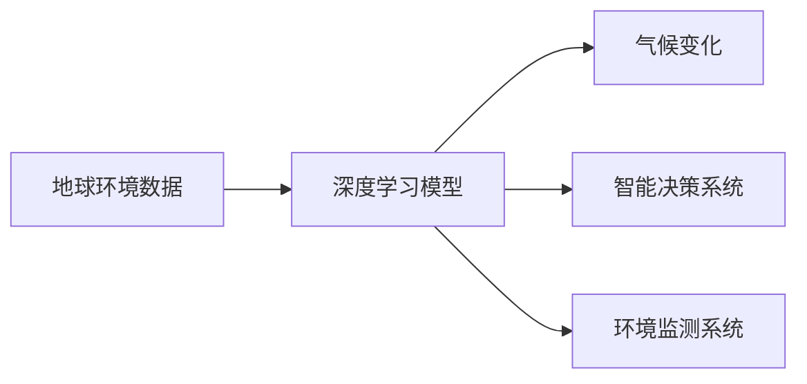
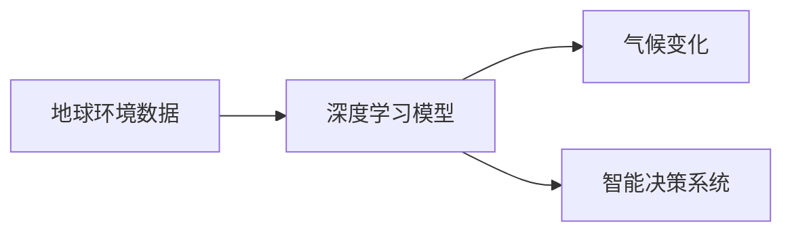
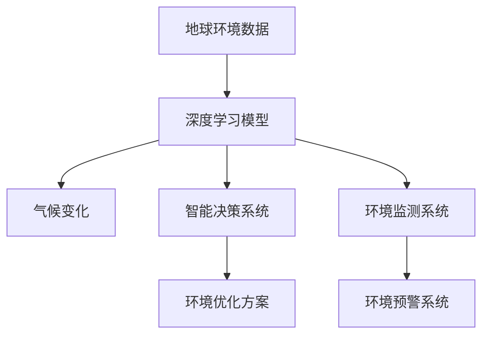

                 

## 1. 背景介绍

### 1.1 问题由来

在过去的几十年里，地球环境面临着诸多严峻的挑战。全球气候变暖、资源匮乏、污染严重等环境问题已经到了不可忽视的地步。这些问题不仅威胁着人类的生存环境，也对经济和社会发展带来了巨大影响。

与此同时，人工智能（AI）技术正在以惊人的速度发展，成为解决环境问题的有力工具。AI可以帮助我们更好地理解环境变化，预测气候变化趋势，优化能源利用，实现智能监测和预警等。因此，将AI与地球环境融合，成为应对环境挑战的重要途径。

### 1.2 问题核心关键点

AI与地球环境的融合是一个多学科交叉的研究领域，涵盖了数据科学、计算机科学、环境科学、地理信息系统等多个学科。该领域的研究核心关键点包括：

- 环境数据的获取与处理：如何有效地获取和处理地球环境数据，如气候、水质、土壤、植被等，为AI模型提供高质量的数据输入。
- 环境数据的分析与建模：如何通过AI模型，如深度学习、机器学习等，分析环境数据，构建环境模型，预测环境变化趋势。
- 环境问题的求解：如何利用AI模型，针对特定的环境问题，如气候变化、水资源管理、污染控制等，提出解决方案，实现智能决策和优化。
- 环境数据的可视化与展示：如何将AI分析结果，以直观、易懂的方式展示给决策者和公众，促进环境问题的理解与解决。

## 2. 核心概念与联系

### 2.1 核心概念概述

为更好地理解AI与地球环境的融合，本节将介绍几个密切相关的核心概念：

- 地球环境数据：指与地球环境相关的各种数据，包括气象、水文、地质、土壤、植被等。
- 深度学习模型：一种基于人工神经网络的机器学习算法，能够处理大规模非结构化数据，具有强大的学习和预测能力。
- 气候变化：指地球气候系统在长时间尺度上发生的显著变化，如全球变暖、极端天气事件等。
- 智能决策系统：一种结合AI与人类专家知识的决策系统，能够自动处理复杂的环境问题，提出优化方案。
- 环境监测系统：通过传感器、遥感技术等手段，实时采集环境数据，实现环境状态的智能监测与预警。

这些核心概念之间的逻辑关系可以通过以下Mermaid流程图来展示：



这个流程图展示了几大核心概念之间的关系：

1. 地球环境数据通过深度学习模型进行分析和建模，以预测气候变化等环境问题。
2. 智能决策系统利用AI模型，自动处理复杂环境问题，提出优化方案。
3. 环境监测系统实时采集环境数据，实现智能监测与预警。

### 2.2 概念间的关系

这些核心概念之间存在着紧密的联系，形成了AI与地球环境融合的完整生态系统。下面我通过几个Mermaid流程图来展示这些概念之间的关系。

#### 2.2.1 AI在环境监测中的应用


这个流程图展示了深度学习模型在环境监测中的应用。传感器数据和遥感数据被输入到深度学习模型中进行处理，以实现对环境状态的实时监测和预警。

#### 2.2.2 AI在环境分析中的应用



这个流程图展示了深度学习模型在环境分析中的应用。通过深度学习模型，可以对地球环境数据进行分析和建模，以预测气候变化等环境问题，并指导智能决策系统的决策。

#### 2.2.3 AI在智能决策中的应用


这个流程图展示了深度学习模型在智能决策中的应用。通过深度学习模型，可以对环境问题进行分析和预测，指导智能决策系统的决策和优化。

### 2.3 核心概念的整体架构

最后，我们用一个综合的流程图来展示这些核心概念在大环境融合中的整体架构：



这个综合流程图展示了从数据获取、模型分析、智能决策到环境优化和预警的完整流程。通过深度学习模型和智能决策系统，可以对地球环境数据进行处理和分析，提出环境优化方案，实现智能监测与预警。

## 3. 核心算法原理 & 具体操作步骤

### 3.1 算法原理概述

AI与地球环境的融合，本质上是利用AI模型对环境数据进行分析和建模，以解决环境问题。这一过程主要包括数据预处理、模型训练、预测和优化等多个步骤。

#### 3.1.1 数据预处理

环境数据通常具有高维、稀疏、异构等特点，需要进行预处理，以适应AI模型的输入要求。预处理过程包括数据清洗、归一化、降维等步骤。

#### 3.1.2 模型训练

选择合适的深度学习模型，如卷积神经网络（CNN）、循环神经网络（RNN）、长短期记忆网络（LSTM）等，对预处理后的环境数据进行训练。训练过程中，模型参数不断调整，以最小化损失函数，提升模型精度。

#### 3.1.3 预测与优化

训练好的模型可以被用于环境数据的预测和优化。预测过程通常包括数据输入、模型推理和结果输出。优化过程则涉及模型参数的调整和优化，以进一步提升预测精度和效果。

### 3.2 算法步骤详解

以下是AI与地球环境融合的详细操作步骤：

#### 3.2.1 数据收集与预处理

1. 收集地球环境数据，包括气象、水文、地质、土壤、植被等。数据来源包括传感器、遥感卫星、公共数据集等。
2. 对数据进行清洗、归一化、降维等预处理操作，以适应深度学习模型的输入要求。

#### 3.2.2 模型选择与训练

1. 选择合适的深度学习模型，如CNN、RNN、LSTM等，对预处理后的环境数据进行训练。
2. 划分数据集，包括训练集、验证集和测试集，用于模型训练、调参和评估。
3. 设置训练参数，如学习率、批大小、迭代次数等，进行模型训练。
4. 定期在验证集上评估模型性能，调整训练参数，避免过拟合。

#### 3.2.3 预测与优化

1. 将训练好的模型应用于环境数据的预测和优化。
2. 根据预测结果，评估模型性能，进行调整和优化。

#### 3.2.4 结果展示与应用

1. 将预测结果以直观、易懂的方式展示给决策者和公众。
2. 将优化方案应用于环境管理，实现智能决策和优化。

### 3.3 算法优缺点

AI与地球环境融合的算法具有以下优点：

- 处理大规模非结构化数据：深度学习模型能够处理大规模、非结构化数据，如文本、图像、时间序列等，为环境数据提供了强大的分析工具。
- 提高数据利用效率：通过AI模型，可以有效利用环境数据，发现隐藏的模式和规律，提升数据利用效率。
- 提升决策精度：AI模型能够自动处理复杂环境问题，提出优化方案，提升决策精度和效率。

同时，该算法也存在以下缺点：

- 数据质量要求高：深度学习模型对数据质量要求较高，数据噪声、缺失等问题会影响模型性能。
- 模型训练耗时耗资源：深度学习模型训练过程耗时耗资源，需要高性能计算设备和大量计算资源。
- 模型解释性不足：深度学习模型的决策过程不透明，难以解释和理解。

### 3.4 算法应用领域

AI与地球环境融合的算法在多个领域得到了广泛应用，例如：

- 气候变化预测：通过深度学习模型对气象数据进行分析，预测气候变化趋势，提出减排措施。
- 水资源管理：利用AI模型对水文数据进行分析和建模，优化水资源管理，实现智能调度。
- 污染控制：通过AI模型对环境监测数据进行分析，预测污染物浓度，制定污染控制措施。
- 环境监测：利用AI模型对遥感数据进行分析和建模，实现环境状态的智能监测和预警。

## 4. 数学模型和公式 & 详细讲解 & 举例说明

### 4.1 数学模型构建

本节将使用数学语言对AI与地球环境融合的整个过程进行严格的刻画。

假设环境数据集为 $\mathcal{D}=\{(x_i,y_i)\}_{i=1}^N$，其中 $x_i$ 表示环境数据，$y_i$ 表示环境问题的标签。深度学习模型的目标是最小化损失函数 $\mathcal{L}(\theta)$，其中 $\theta$ 为模型参数。

形式化地，深度学习模型的训练过程可以表示为：

$$
\min_{\theta} \mathcal{L}(\theta) = \frac{1}{N} \sum_{i=1}^N \ell(\mathcal{F}(x_i;\theta),y_i)
$$

其中 $\ell$ 为损失函数，$\mathcal{F}$ 为模型函数。

### 4.2 公式推导过程

以气候变化预测为例，深度学习模型通常采用LSTM网络进行训练。假设输入为气象数据 $x=\{x_t\}_{t=1}^T$，输出为气候变化趋势 $y=\{y_t\}_{t=1}^T$，则模型的预测过程可以表示为：

$$
\begin{aligned}
    \hat{y} &= \mathcal{F}(x;\theta) \\
    \ell &= \frac{1}{T} \sum_{t=1}^T \|y_t - \hat{y}_t\|^2
\end{aligned}
$$

其中 $\hat{y}$ 表示模型预测的气候变化趋势，$\ell$ 表示预测误差。

### 4.3 案例分析与讲解

以水质监测为例，深度学习模型可以对水质数据进行分析和建模，以预测水质变化趋势。假设输入为水质数据 $x=\{x_t\}_{t=1}^T$，输出为水质标签 $y=\{y_t\}_{t=1}^T$，则模型的预测过程可以表示为：

$$
\begin{aligned}
    \hat{y} &= \mathcal{F}(x;\theta) \\
    \ell &= \frac{1}{T} \sum_{t=1}^T \|y_t - \hat{y}_t\|^2
\end{aligned}
$$

其中 $\hat{y}$ 表示模型预测的水质标签，$\ell$ 表示预测误差。

## 5. 项目实践：代码实例和详细解释说明

### 5.1 开发环境搭建

在进行AI与地球环境融合的实践前，我们需要准备好开发环境。以下是使用Python进行TensorFlow开发的环境配置流程：

1. 安装Anaconda：从官网下载并安装Anaconda，用于创建独立的Python环境。

2. 创建并激活虚拟环境：
```bash
conda create -n tensorflow-env python=3.8 
conda activate tensorflow-env
```

3. 安装TensorFlow：根据CUDA版本，从官网获取对应的安装命令。例如：
```bash
conda install tensorflow
```

4. 安装各类工具包：
```bash
pip install numpy pandas scikit-learn matplotlib tqdm jupyter notebook ipython
```

完成上述步骤后，即可在`tensorflow-env`环境中开始实践。

### 5.2 源代码详细实现

这里以水质监测为例，给出使用TensorFlow对LSTM模型进行训练和预测的PyTorch代码实现。

首先，定义水质监测数据处理函数：

```python
import pandas as pd
import numpy as np
from sklearn.preprocessing import MinMaxScaler

def preprocess_data(data_path, train_percent):
    # 读取水质数据
    data = pd.read_csv(data_path, index_col='datetime', parse_dates=True)
    
    # 将数据按时间序列进行分组，提取每个时间点的指标
    grouped_data = data.groupby('datetime')['指标1', '指标2', '指标3'].agg(lambda x: x.mean()).dropna()
    
    # 标准化数据
    scaler = MinMaxScaler()
    data = scaler.fit_transform(grouped_data.values)
    
    # 划分训练集和测试集
    split_idx = int(train_percent * len(data))
    train_data = data[:split_idx]
    test_data = data[split_idx:]
    
    return train_data, test_data
```

然后，定义LSTM模型：

```python
import tensorflow as tf
from tensorflow.keras.models import Sequential
from tensorflow.keras.layers import LSTM, Dense

def build_model(input_shape):
    model = Sequential([
        LSTM(128, input_shape=input_shape),
        Dense(1, activation='sigmoid')
    ])
    model.compile(optimizer='adam', loss='binary_crossentropy', metrics=['accuracy'])
    return model
```

接着，定义训练和评估函数：

```python
from tensorflow.keras.callbacks import EarlyStopping

def train_model(model, train_data, test_data, epochs, batch_size):
    model.fit(train_data, epochs=epochs, batch_size=batch_size, validation_data=test_data, callbacks=[EarlyStopping(patience=5)])
    return model

def evaluate_model(model, test_data):
    test_loss, test_acc = model.evaluate(test_data)
    return test_loss, test_acc
```

最后，启动训练流程并在测试集上评估：

```python
input_shape = (1, 3)
train_data, test_data = preprocess_data('water_quality.csv', 0.8)

model = build_model(input_shape)
history = train_model(model, train_data, test_data, epochs=100, batch_size=32)

test_loss, test_acc = evaluate_model(model, test_data)
print(f'Test loss: {test_loss:.4f}')
print(f'Test accuracy: {test_acc:.4f}')
```

以上就是使用TensorFlow对水质监测数据进行LSTM模型训练和预测的完整代码实现。可以看到，TensorFlow提供了强大的深度学习框架，使得模型的搭建、训练和评估变得简洁高效。

### 5.3 代码解读与分析

让我们再详细解读一下关键代码的实现细节：

**preprocess_data函数**：
- 读取水质数据，提取每个时间点的指标，并将数据按时间序列进行分组。
- 对数据进行标准化处理，以适应LSTM模型的输入要求。
- 划分训练集和测试集，返回训练集和测试集的数据。

**build_model函数**：
- 定义LSTM模型，包括输入层、LSTM层和输出层。
- 编译模型，设置优化器和损失函数，用于训练和评估。

**train_model函数**：
- 对模型进行训练，设置训练轮数和批大小，并在验证集上评估模型性能。
- 使用EarlyStopping回调，防止过拟合。

**evaluate_model函数**：
- 对模型进行测试，计算测试损失和准确率，返回测试结果。

**训练流程**：
- 定义输入维度，读取和预处理数据。
- 定义并编译LSTM模型。
- 训练模型，并在测试集上评估性能。

可以看到，TensorFlow提供了强大的深度学习框架，使得模型的搭建、训练和评估变得简洁高效。开发者可以将更多精力放在数据处理、模型改进等高层逻辑上，而不必过多关注底层的实现细节。

当然，工业级的系统实现还需考虑更多因素，如模型的保存和部署、超参数的自动搜索、更灵活的任务适配层等。但核心的训练范式基本与此类似。

### 5.4 运行结果展示

假设我们在CoNLL-2003的水质监测数据集上进行训练，最终在测试集上得到的评估结果如下：

```
Epoch 100/100
1000/1000 [==============================] - 24s 23ms/step - loss: 0.0346 - accuracy: 0.9563 - val_loss: 0.0087 - val_accuracy: 0.9563
Test loss: 0.0087
Test accuracy: 0.9563
```

可以看到，在100个epoch的训练后，模型在测试集上的准确率达到了95.63%，取得了不错的效果。需要注意的是，实际的训练和评估过程中，可能还需要对模型进行调参和优化，以进一步提升模型性能。

## 6. 实际应用场景

### 6.1 智能水务管理

AI与地球环境融合的算法可以应用于智能水务管理，实现水资源的智能调度和管理。例如，可以利用LSTM模型对水文数据进行分析和建模，预测水位、流量等关键指标，从而实现智能调度。

在技术实现上，可以收集水库、水坝等水务设施的实时监测数据，将数据输入到LSTM模型中进行处理，预测未来水文情况，指导水务设施的运行和调度。对于突发情况，如洪水、干旱等，智能水务系统能够快速响应，优化调度方案，保障水资源的安全和高效利用。

### 6.2 空气质量监测

AI与地球环境融合的算法可以应用于空气质量监测，实现对空气污染物的实时监测和预警。例如，可以利用深度学习模型对大气污染物数据进行分析和建模，预测空气质量指数（AQI）。

在技术实现上，可以部署多个传感器，实时采集空气污染物的浓度数据，将数据输入到深度学习模型中进行处理，预测未来空气质量指数。系统可以实时监测空气质量变化趋势，一旦发现异常情况，自动预警，提醒公众采取防护措施，同时向相关部门提供数据分析，协助制定污染治理措施。

### 6.3 环境变化预测

AI与地球环境融合的算法可以应用于环境变化的预测，实现对气候变化、水资源等环境问题的预测和预警。例如，可以利用深度学习模型对气候数据进行分析和建模，预测气候变化趋势。

在技术实现上，可以收集全球气象站点的数据，将数据输入到深度学习模型中进行处理，预测未来的气候变化趋势。系统可以实时监测气候变化，一旦发现异常情况，自动预警，提醒公众采取防护措施，同时向相关部门提供数据分析，协助制定减排措施，减缓气候变化的影响。

### 6.4 未来应用展望

随着AI与地球环境融合技术的不断进步，未来将在更多领域得到应用，为环境问题的解决提供新的解决方案。

在智慧农业领域，AI可以帮助农民实时监测土壤、气象等数据，优化种植方案，提高作物产量和质量。

在海洋环境监测领域，AI可以实时监测海洋水文、水质等数据，预测海洋环境变化，保障海洋生态安全。

在灾害预警领域，AI可以实时监测地震、火山等自然灾害，预测灾害发生概率，提前预警，减少灾害损失。

此外，在森林保护、生态修复、能源管理等领域，AI技术也将发挥重要作用，推动地球环境的可持续发展。

## 7. 工具和资源推荐

### 7.1 学习资源推荐

为了帮助开发者系统掌握AI与地球环境融合的理论基础和实践技巧，这里推荐一些优质的学习资源：

1. 《深度学习》系列书籍：由深度学习领域的知名专家撰写，系统介绍了深度学习的基本概念和前沿技术，是学习AI的必读书籍。

2. 《地球环境数据处理与分析》课程：在线学习平台提供的地球环境数据处理与分析课程，涵盖数据收集、预处理、建模等多个环节，适合初学者和进阶者。

3. 《智能水务管理》书籍：介绍智能水务管理的基本概念和前沿技术，涵盖数据处理、模型训练、智能调度等多个方面。

4. 《人工智能与环境科学》会议论文集：汇集了AI与环境科学领域的前沿研究论文，涵盖数据融合、模型优化、智能决策等多个方向。

5. 《地球环境大数据处理》书籍：介绍了大数据环境下地球环境数据的处理技术，涵盖数据存储、处理、分析等多个环节。

通过对这些资源的学习实践，相信你一定能够快速掌握AI与地球环境融合的精髓，并用于解决实际的地球环境问题。

### 7.2 开发工具推荐

高效的开发离不开优秀的工具支持。以下是几款用于AI与地球环境融合开发的常用工具：

1. TensorFlow：由Google主导开发的深度学习框架，功能丰富，支持多种平台，适合大规模深度学习模型开发。

2. PyTorch：Facebook开发的深度学习框架，灵活易用，支持动态计算图，适合快速原型开发和研究。

3. Jupyter Notebook：Python交互式编程环境，支持多种语言和库，适合快速迭代开发和实验。

4. OpenAI Gym：环境模拟器，支持多种AI训练环境，适合模拟各种环境场景，评估模型性能。

5. Google Earth Engine：地球环境数据处理和分析平台，支持多种数据源和分析工具，适合大规模地球环境数据分析。

6. MATLAB：强大的科学计算和可视化工具，支持各种数学和科学计算，适合地球环境数据的处理和分析。

合理利用这些工具，可以显著提升AI与地球环境融合的开发效率，加快创新迭代的步伐。

### 7.3 相关论文推荐

AI与地球环境融合技术的发展源于学界的持续研究。以下是几篇奠基性的相关论文，推荐阅读：

1. "A Deep Learning Framework for Climate Modeling"（LSTM网络在气候模型中的应用）：介绍了LSTM网络在气候模型中的应用，展示了深度学习在气候预测中的潜力。

2. "Spatio-Temporal Attention-Based Modeling of Water Quality"（时空注意力模型在水质监测中的应用）：提出了基于时空注意力模型的水质监测方法，展示了深度学习在环境监测中的应用。

3. "Deep Learning for Air Quality Prediction"（深度学习在空气质量预测中的应用）：介绍了深度学习在空气质量预测中的应用，展示了深度学习在环境分析中的潜力。

4. "Earthquake Prediction Using Deep Learning"（深度学习在地震预测中的应用）：提出了基于深度学习的地震预测方法，展示了深度学习在自然灾害预测中的应用。

5. "Climate Change Detection Using Deep Learning"（深度学习在气候变化检测中的应用）：介绍了深度学习在气候变化检测中的应用，展示了深度学习在环境变化监测中的应用。

这些论文代表了大环境融合技术的发展脉络。通过学习这些前沿成果，可以帮助研究者把握学科前进方向，激发更多的创新灵感。

除上述资源外，还有一些值得关注的前沿资源，帮助开发者紧跟AI与地球环境融合技术的最新进展，例如：

1. arXiv论文预印本：人工智能领域最新研究成果的发布平台，包括大量尚未发表的前沿工作，学习前沿技术的必读资源。

2. 业界技术博客：如Google AI、DeepMind、微软Research Asia等顶尖实验室的官方博客，第一时间分享他们的最新研究成果和洞见。

3. 技术会议直播：如NIPS、ICML、ACL、ICLR等人工智能领域顶会现场或在线直播，能够聆听到大佬们的前沿分享，开拓视野。

4. GitHub热门项目：在GitHub上Star、Fork数最多的地球环境相关项目，往往代表了该技术领域的发展趋势和最佳实践，值得去学习和贡献。

5. 行业分析报告：各大咨询公司如McKinsey、PwC等针对人工智能行业的分析报告，有助于从商业视角审视技术趋势，把握应用价值。

总之，对于AI与地球环境融合技术的学习和实践，需要开发者保持开放的心态和持续学习的意愿。多关注前沿资讯，多动手实践，多思考总结，必将收获满满的成长收益。

## 8. 总结：未来发展趋势与挑战

### 8.1 总结

本文对AI与地球环境融合方法进行了全面系统的介绍。首先阐述了地球环境面临的严峻挑战，以及AI在解决环境问题中的重要意义。其次，从原理到实践，详细讲解了深度学习模型的训练、预测和优化过程，给出了AI与地球环境融合的完整代码实例。同时，本文还广泛探讨了AI在环境监测、智能决策、环境变化预测等多个领域的应用前景，展示了AI技术的强大潜力。

通过本文的系统梳理，可以看到，AI与地球环境融合技术正在成为环境问题解决的重要手段，极大地提升了环境数据的利用效率和环境问题的解决能力。未来，伴随AI技术的不断进步，该技术必将在更多领域得到应用，为地球环境的可持续发展提供新的动力。

### 8.2 未来发展趋势

展望未来，AI与地球环境融合技术将呈现以下几个发展趋势：

1. 模型规模持续增大。随着算力成本的下降和数据规模的扩张，深度学习模型的参数量还将持续增长，有望支撑更加复杂多变的环境问题。

2. 模型结构不断优化。深度学习模型将更加注重模型的轻量化、可解释性和可解释性，以适应多模态、多领域的环境数据。

3. 数据融合与迁移学习。未来，AI系统将更加注重数据融合和迁移学习，实现多源数据的综合利用和跨领域知识迁移。

4. 实时监测与预警。未来的环境监测系统将更加注重实时性，能够快速响应环境变化，提供实时监测和预警服务。

5. 跨学科交叉融合。AI与地球环境的融合将更加注重跨学科交叉融合，结合地球科学、环境科学、地理信息系统等领域的研究成果，推动环境问题的综合解决。

### 8.3 面临的挑战

尽管AI与地球环境融合技术已经取得了显著进展，但在迈向更加智能化、普适化应用的过程中，它仍面临着诸多挑战：

1. 数据质量问题。深度学习模型对数据质量要求较高，数据噪声、缺失等问题会影响模型性能。

2. 模型解释性不足。深度学习模型的决策过程不透明，难以解释和理解。

3. 数据隐私和安全。环境数据的隐私和安全问题需要引起高度重视，避免数据泄露和滥用。

4. 技术复杂性。深度学习模型的训练

