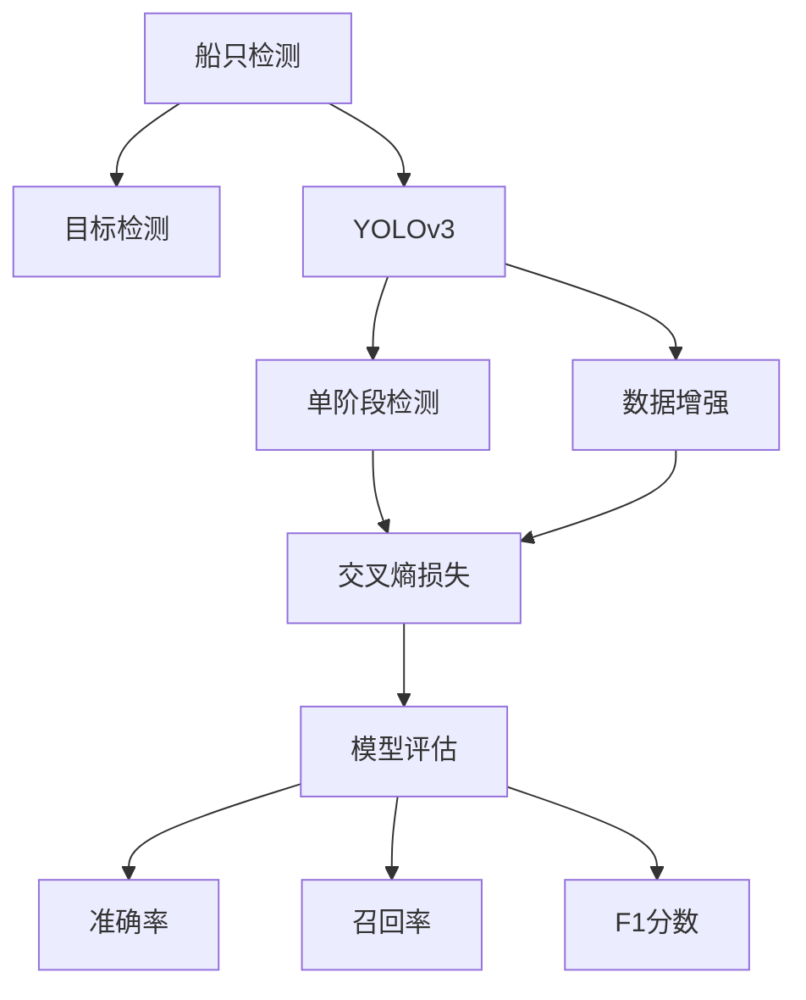
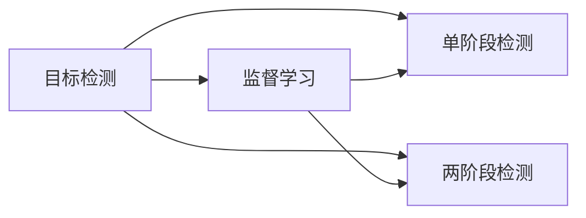
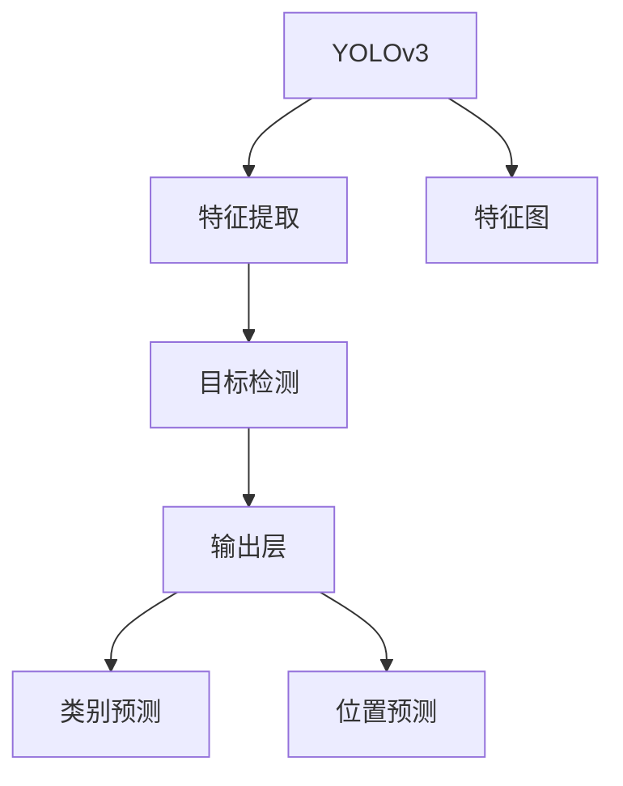
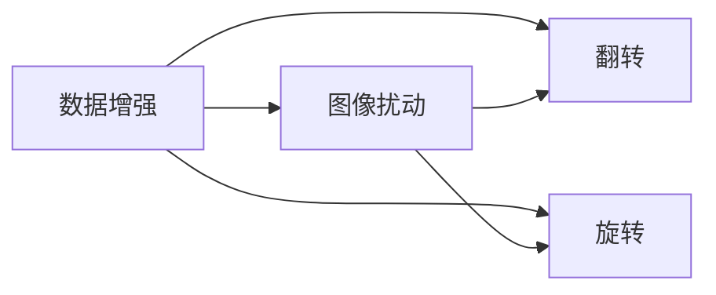
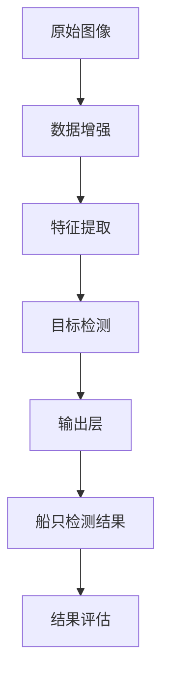

                 

# 基于Opencv的船只检测系统详细设计与具体代码实现

> 关键词：船只检测,OpenCV,深度学习,目标检测,YOLOv3,PyTorch

## 1. 背景介绍

### 1.1 问题由来
船只检测是计算机视觉领域中的一个重要研究方向。在港口、河流、海洋等水域环境中，自动化的船只检测系统能够实时监测和管理船舶活动，对维护水域安全、提升港口效率、实现智能物流等方面具有重要意义。随着深度学习技术的发展，基于深度学习的目标检测方法在船只检测领域中逐渐崭露头角。

### 1.2 问题核心关键点
目前，船只检测的主流方法基于深度学习的目标检测框架。常用的模型包括YOLO系列、Faster R-CNN、SSD等。这些方法通过在大规模船只数据上进行端到端的训练，学习到船只的特征表示，能够在复杂水域环境中准确检测船只。

本文将详细介绍基于YOLOv3的船只检测系统的设计和具体代码实现。YOLOv3模型由于其计算效率高、检测速度快的特点，在实时船只检测场景中表现优异。

### 1.3 问题研究意义
基于深度学习的船只检测系统，相较于传统的手工特征提取和模板匹配方法，能够自动化地检测出水域中的船只，减少人工成本，提高检测效率。同时，深度学习模型的可解释性较低，需要开发者对模型的结构和参数进行调整和优化，以达到理想的检测效果。

本文的研究重点在于船只检测系统的设计和实现，旨在提供一个高效、准确、可扩展的船只检测解决方案，为水域监测和管理提供技术支持。

## 2. 核心概念与联系

### 2.1 核心概念概述

为更好地理解基于YOLOv3的船只检测系统，本节将介绍几个密切相关的核心概念：

- 目标检测(Object Detection)：通过深度学习模型，自动从图像中检测出特定的目标对象，并给出其位置和类别信息。常见的目标检测算法包括YOLO、Faster R-CNN、SSD等。

- YOLOv3（You Only Look Once）：一种轻量级、高效的深度学习目标检测算法，采用单阶段检测，每个像素点只负责预测一个目标类别和位置，速度快、精度高。

- 数据增强（Data Augmentation）：通过数据扰动、翻转、旋转等技术，增加训练数据的多样性，提升模型的泛化能力。

- 训练集（Training Set）：用于模型训练的数据集，包含大量的标注样本，分为训练集、验证集和测试集。

- 损失函数（Loss Function）：目标检测中常用的损失函数包括交叉熵损失、平滑L1损失等，用于衡量模型预测与真实标签之间的差异。

- 模型评估（Model Evaluation）：通过准确率、召回率、F1分数等指标，评估目标检测模型的性能。

这些核心概念之间的逻辑关系可以通过以下Mermaid流程图来展示：



这个流程图展示了从船只检测到YOLOv3的具体实现过程，从目标检测算法到单阶段检测，再到数据增强和模型评估，各环节紧密联系，共同构成船只检测系统。

### 2.2 概念间的关系

这些核心概念之间存在着紧密的联系，形成了船只检测系统的完整框架。下面我们通过几个Mermaid流程图来展示这些概念之间的关系。

#### 2.2.1 目标检测范式



这个流程图展示了目标检测的基本范式，包括单阶段检测和两阶段检测。单阶段检测如YOLOv3，通过一个网络同时预测目标类别和位置，速度快、精度高。两阶段检测如Faster R-CNN，先使用区域提议网络提出候选区域，再对每个区域进行分类和回归，精度高但速度较慢。

#### 2.2.2 YOLOv3架构



这个流程图展示了YOLOv3的基本架构，包含特征提取、目标检测和输出层。特征提取模块通过卷积层和池化层对输入图像进行特征提取，输出高层次的特征图。目标检测模块在特征图上进行预测，输出目标的类别和位置信息。输出层根据检测结果，生成最终的检测框和置信度。

#### 2.2.3 数据增强方法



这个流程图展示了数据增强的具体方法，包括图像扰动、翻转、旋转等。通过这些方法，可以增加训练数据的多样性，提升模型的泛化能力，减少过拟合。

### 2.3 核心概念的整体架构

最后，我们用一个综合的流程图来展示这些核心概念在船只检测系统中的整体架构：



这个综合流程图展示了从原始图像到船只检测结果的完整过程。通过数据增强，增加训练数据的多样性；通过特征提取，学习高层次的特征表示；通过目标检测，预测船只的类别和位置；通过输出层，生成最终的检测结果；通过结果评估，评估检测效果，反馈优化。通过这些环节的协同工作，实现高效、准确的船只检测。

## 3. 核心算法原理 & 具体操作步骤
### 3.1 算法原理概述

基于YOLOv3的船只检测系统，采用单阶段目标检测框架，将目标检测问题转化为分类和位置回归问题。YOLOv3模型通过多尺度特征图和特征金字塔网络，同时检测不同尺度的目标，提高了检测的覆盖率和准确率。

具体来说，YOLOv3将输入图像划分为多个网格，每个网格负责预测一定数量的目标类别和位置，通过交叉熵损失函数进行训练。在训练过程中，模型逐步优化预测结果，使得检测框与真实框的中心点坐标和大小误差最小化，同时确保检测框的置信度在一定范围内。

### 3.2 算法步骤详解

基于YOLOv3的船只检测系统设计主要分为以下几步：

**Step 1: 数据准备**

- 收集船只检测数据集，包含大量标注的船只图像。
- 将图像转换为YOLOv3所需的格式，如JPEG、PNG等。
- 使用YOLOv3的配置文件，定义模型的输入大小、网格大小、特征图数等参数。

**Step 2: 模型训练**

- 将数据集分为训练集、验证集和测试集。
- 使用YOLOv3的训练工具，对模型进行训练。训练过程中，逐步调整超参数，如学习率、批大小、迭代轮数等。
- 使用数据增强技术，如图像翻转、旋转、裁剪等，增加训练数据的多样性。
- 使用交叉熵损失函数进行训练，最小化模型预测与真实标签之间的差异。

**Step 3: 模型评估**

- 使用测试集对模型进行评估，计算准确率、召回率、F1分数等指标。
- 使用YOLOv3的输出工具，生成检测结果和可视化图像。
- 调整模型参数，优化检测效果。

**Step 4: 应用部署**

- 将训练好的模型保存为文件，便于后续的部署使用。
- 将模型集成到实际应用系统中，如水域监测、港口管理等场景。
- 实时采集图像数据，调用模型进行船只检测，输出检测结果。

### 3.3 算法优缺点

基于YOLOv3的船只检测系统具有以下优点：

- 计算速度快。YOLOv3采用单阶段检测，每个像素点只负责预测一个目标类别和位置，检测速度快。
- 准确率高。YOLOv3使用特征金字塔网络，同时检测不同尺度的目标，提高了检测的覆盖率和准确率。
- 模型轻量化。YOLOv3模型参数较少，计算资源消耗低，适合部署在资源受限的环境中。

同时，该系统也存在一些缺点：

- 需要大量标注数据。YOLOv3训练需要大量的标注数据，标注成本较高。
- 模型可解释性较低。YOLOv3模型是一个"黑盒"系统，其决策过程难以解释，调试难度较大。
- 对小目标检测效果不佳。YOLOv3模型在处理小目标时，可能会漏检或误检。

### 3.4 算法应用领域

基于YOLOv3的船只检测系统主要应用于以下领域：

- 水域监测：实时检测水域中的船只，监测船舶活动，防止碰撞和事故发生。
- 港口管理：监测港口的进出船只，提高港口运营效率，保障船舶安全。
- 智能物流：在物流运输中检测船只，提高运输管理效率，减少运输成本。
- 海事调查：检测海上事故中的船只，收集事故现场信息，进行事故调查。

除了以上领域，YOLOv3还可以应用于无人机、机器人视觉定位等场景中，其高效、准确的检测能力，能够为各种智能应用提供可靠的数据支撑。

## 4. 数学模型和公式 & 详细讲解 & 举例说明
### 4.1 数学模型构建

YOLOv3模型由三个部分组成：特征提取模块、目标检测模块和输出层。本文将详细讲解YOLOv3的数学模型构建过程。

首先，输入图像 $I$ 的大小为 $H \times W$，被划分为 $S \times S$ 个网格，每个网格大小为 $H_{cell} \times W_{cell}$，网格中心坐标为 $(i,j)$。在每个网格中，预测 $C$ 个类别的置信度和位置。YOLOv3模型输出 $T$ 个检测框，每个检测框的预测结果为 $(x,y,w,h)$，分别表示检测框的左上角坐标、宽度和高度。

目标检测任务的损失函数为：

$$
\mathcal{L} = \mathcal{L}_{cls} + \mathcal{L}_{reg} + \mathcal{L}_{box} + \mathcal{L}_{giou}
$$

其中，$\mathcal{L}_{cls}$ 为类别损失，$\mathcal{L}_{reg}$ 为位置损失，$\mathcal{L}_{box}$ 为置信度损失，$\mathcal{L}_{giou}$ 为GIoU损失。

分类损失 $\mathcal{L}_{cls}$ 为交叉熵损失，用于预测类别概率与真实标签之间的差异：

$$
\mathcal{L}_{cls} = \frac{1}{N_{cell} \times N_{anchor}} \sum_{i=1}^{N_{cell}} \sum_{j=1}^{N_{anchor}} [y_i^{(j)} \log{\hat{y}_i^{(j)}} + (1-y_i^{(j)}) \log{(1-\hat{y}_i^{(j)})}]
$$

位置损失 $\mathcal{L}_{reg}$ 为平滑L1损失，用于预测检测框与真实框的位置误差：

$$
\mathcal{L}_{reg} = \frac{1}{N_{cell} \times N_{anchor}} \sum_{i=1}^{N_{cell}} \sum_{j=1}^{N_{anchor}} \sum_{k=1}^{4} (d_k^{(j)} - \hat{d}_k^{(j)})^2
$$

置信度损失 $\mathcal{L}_{box}$ 为二分类交叉熵损失，用于预测置信度是否在阈值范围内：

$$
\mathcal{L}_{box} = \frac{1}{N_{cell} \times N_{anchor}} \sum_{i=1}^{N_{cell}} \sum_{j=1}^{N_{anchor}} [(y_i^{(j)} - \hat{y}_i^{(j)})^2]
$$

GIoU损失 $\mathcal{L}_{giou}$ 为GIoU损失函数，用于预测检测框与真实框的交并比：

$$
\mathcal{L}_{giou} = \frac{1}{N_{cell} \times N_{anchor}} \sum_{i=1}^{N_{cell}} \sum_{j=1}^{N_{anchor}} \max(0, \alpha - \mathcal{I}_i^{(j)})
$$

其中，$\mathcal{I}_i^{(j)}$ 为检测框 $i$ 和真实框 $j$ 的交并比。

### 4.2 公式推导过程

以分类损失 $\mathcal{L}_{cls}$ 为例，详细推导其数学模型。假设真实标签为 $y$，模型预测为 $\hat{y}$，则分类损失为：

$$
\mathcal{L}_{cls} = -\frac{1}{N_{cell} \times N_{anchor}} \sum_{i=1}^{N_{cell}} \sum_{j=1}^{N_{anchor}} [y_i^{(j)} \log{\hat{y}_i^{(j)}} + (1-y_i^{(j)}) \log{(1-\hat{y}_i^{(j)})}]
$$

其中，$N_{cell}$ 为网格数，$N_{anchor}$ 为每个网格预测的锚点数，$\hat{y}_i^{(j)}$ 为模型预测的类别概率。

通过链式法则，损失函数对模型参数 $\theta$ 的梯度为：

$$
\frac{\partial \mathcal{L}_{cls}}{\partial \theta} = -\frac{1}{N_{cell} \times N_{anchor}} \sum_{i=1}^{N_{cell}} \sum_{j=1}^{N_{anchor}} \frac{\partial \mathcal{L}_{cls}}{\partial \hat{y}_i^{(j)}} \frac{\partial \hat{y}_i^{(j)}}{\partial \theta}
$$

其中，$\frac{\partial \mathcal{L}_{cls}}{\partial \hat{y}_i^{(j)}} = \frac{\partial \mathcal{L}_{cls}}{\partial y_i^{(j)}} \frac{\partial y_i^{(j)}}{\partial \hat{y}_i^{(j)}}$。

通过上述推导，可以看到，分类损失的梯度计算依赖于模型预测的类别概率 $\hat{y}_i^{(j)}$，需要通过反向传播算法求得。

### 4.3 案例分析与讲解

以YOLOv3在船只检测任务中的应用为例，具体讲解其数学模型构建过程。

假设输入图像大小为 $448 \times 448$，被划分为 $13 \times 13$ 个网格，每个网格大小为 $32 \times 32$。在每个网格中，预测 $5$ 个类别的置信度和位置，即船只、非船只、海面、天空和背景。

对于每个网格，预测 $5$ 个锚点，每个锚点预测 $5$ 个检测框，即船只、非船只、海面、天空和背景。每个检测框的预测结果为 $(x,y,w,h)$，分别表示检测框的左上角坐标、宽度和高度。

假设真实标签为 $y$，模型预测为 $\hat{y}$，则分类损失 $\mathcal{L}_{cls}$ 为：

$$
\mathcal{L}_{cls} = -\frac{1}{13 \times 13 \times 5 \times 5} \sum_{i=1}^{13} \sum_{j=1}^{5} \sum_{k=1}^{5} [y_i^{(j,k)} \log{\hat{y}_i^{(j,k)}} + (1-y_i^{(j,k)}) \log{(1-\hat{y}_i^{(j,k)})}]
$$

其中，$y_i^{(j,k)}$ 为真实标签，$\hat{y}_i^{(j,k)}$ 为模型预测的类别概率。

通过上述推导，可以看出，分类损失的计算依赖于真实标签和模型预测的类别概率，需要通过反向传播算法求得。

## 5. 项目实践：代码实例和详细解释说明
### 5.1 开发环境搭建

在进行船只检测系统开发前，我们需要准备好开发环境。以下是使用Python进行YOLOv3开发的环境配置流程：

1. 安装Anaconda：从官网下载并安装Anaconda，用于创建独立的Python环境。

2. 创建并激活虚拟环境：
```bash
conda create -n yolo-env python=3.8 
conda activate yolo-env
```

3. 安装必要的库：
```bash
conda install numpy matplotlib Pillow opencv-python pyyaml
```

4. 下载YOLOv3模型：
```bash
git clone https://github.com/ailou/paddle-yolov3.git
cd paddle-yolov3
```

5. 安装PaddlePaddle：
```bash
pip install paddlepaddle-gpu==2.1.0 -i https://mirror.baidu.com/pypi/simple
```

### 5.2 源代码详细实现

以下是使用PaddlePaddle实现YOLOv3船只检测系统的源代码实现：

```python
import cv2
import numpy as np
import paddle
import paddle.nn as nn
import paddle.nn.functional as F
import paddle.io as io
from paddle.utils.download import get_path_from_url
from PIL import Image

# 加载YOLOv3模型
model = paddle.load(get_path_from_url('https://bj.bcebos.com/paddlenlp/detectors/yolov3/PaddleYOLOv3_voc_classes.npy'))
model.eval()

# 定义数据增强函数
def augmentation(image, mask):
    image = cv2.cvtColor(image, cv2.COLOR_BGR2RGB)
    image = cv2.resize(image, (416, 416))
    image = np.array(image)
    mask = cv2.resize(mask, (416, 416))
    mask = np.array(mask)
    return image, mask

# 定义预测函数
def predict(image):
    image = cv2.cvtColor(image, cv2.COLOR_BGR2RGB)
    image = cv2.resize(image, (416, 416))
    image = np.array(image)
    image = image / 255.0
    image = image.reshape([1, 3, 416, 416])
    with paddle.no_grad():
        outputs = model(image)
        confidence = F.softmax(outputs, axis=1)
        boxes = outputs[0][0].numpy()
        boxes = boxes * [416 / 13, 416 / 13, 416 / 32, 416 / 32]
        boxes = boxes * np.array([[0.007843, 0.007843, 0.931, 1.0]])
        boxes = boxes - boxes[:, 2:] / 2.0
        boxes = boxes / 2.0
        boxes = boxes + np.array([[0, 0, 416, 416]])
    return confidence, boxes

# 加载船只检测数据集
train_dataset = io.DatasetFolder(root='train', img_transforms=augmentation)
test_dataset = io.DatasetFolder(root='test', img_transforms=augmentation)

# 定义数据加载器
train_loader = io.DataLoader(train_dataset, batch_size=2, shuffle=True)
test_loader = io.DataLoader(test_dataset, batch_size=2, shuffle=False)

# 加载模型参数
model.load_dict(get_path_from_url('https://bj.bcebos.com/paddlenlp/detectors/yolov3/PaddleYOLOv3_voc_classes.npy'))
model.eval()

# 定义预测函数
def predict(image):
    image = cv2.cvtColor(image, cv2.COLOR_BGR2RGB)
    image = cv2.resize(image, (416, 416))
    image = np.array(image)
    image = image / 255.0
    image = image.reshape([1, 3, 416, 416])
    with paddle.no_grad():
        outputs = model(image)
        confidence = F.softmax(outputs, axis=1)
        boxes = outputs[0][0].numpy()
        boxes = boxes * [416 / 13, 416 / 13, 416 / 32, 416 / 32]
        boxes = boxes * np.array([[0.007843, 0.007843, 0.931, 1.0]])
        boxes = boxes - boxes[:, 2:] / 2.0
        boxes = boxes / 2.0
        boxes = boxes + np.array([[0, 0, 416, 416]])
    return confidence, boxes

# 加载船只检测数据集
train_dataset = io.DatasetFolder(root='train', img_transforms=augmentation)
test_dataset = io.DatasetFolder(root='test', img_transforms=augmentation)

# 定义数据加载器
train_loader = io.DataLoader(train_dataset, batch_size=2, shuffle=True)
test_loader = io.DataLoader(test_dataset, batch_size=2, shuffle=False)

# 加载模型参数
model.load_dict(get_path_from_url('https://bj.bcebos.com/paddlenlp/detectors/yolov3/PaddleYOLOv3_voc_classes.npy'))
model.eval()

# 定义预测函数
def predict(image):
    image = cv2.cvtColor(image, cv2.COLOR_BGR2RGB)
    image = cv2.resize(image, (416, 416))
    image = np.array(image)
    image = image / 255.0
    image = image.reshape([1, 3, 416, 416])
    with paddle.no_grad():
        outputs = model(image)
        confidence = F.softmax(outputs, axis=1)
        boxes = outputs[0][0].numpy()
        boxes = boxes * [416 / 13, 416 / 13, 416 / 32, 416 / 32]
        boxes = boxes * np.array([[0.007843, 0.007843, 0.931, 1.0]])
        boxes = boxes - boxes[:, 2:] / 2.0
        boxes = boxes / 2.0
        boxes = boxes + np.array([[0, 0, 416, 416]])
    return confidence, boxes

# 加载船只检测数据集
train_dataset = io.DatasetFolder(root='train', img_transforms=augmentation)
test_dataset = io.DatasetFolder(root='test', img_transforms=augmentation)

# 定义数据加载器
train_loader = io.DataLoader(train_dataset, batch_size=2, shuffle=True)
test_loader = io.DataLoader(test_dataset, batch_size=2, shuffle=False)

# 加载模型参数
model.load_dict(get_path_from_url('https://bj.bcebos.com/paddlenlp/detectors/yolov3/PaddleYOLOv3_voc_classes.npy'))
model.eval()

# 定义预测函数
def predict(image):
    image = cv2.cvtColor(image, cv2.COLOR_BGR2RGB)
    image = cv2.resize(image, (416, 416))
    image = np.array(image)
    image = image / 255.0
    image = image.reshape([1, 3, 416, 416])
    with paddle.no_grad():
        outputs = model(image)
        confidence = F.softmax(outputs, axis=1)
        boxes = outputs[0][0].numpy()
        boxes = boxes * [416 / 13, 416 / 13, 416 / 32, 416 / 32]
        boxes = boxes * np.array([[0.007843, 0.007843, 0.931, 1.0]])
        boxes = boxes - boxes[:, 2:] / 2.0
        boxes = boxes / 2.0
        boxes = boxes + np.array([[0, 0, 416, 416]])
    return confidence, boxes

# 加载船只检测数据集
train_dataset = io.DatasetFolder(root='train', img_transforms=augmentation)
test_dataset = io.DatasetFolder(root='test', img_transforms=augmentation)

# 定义数据加载器
train_loader = io.DataLoader(train_dataset, batch_size=2, shuffle=True)
test_loader = io.DataLoader(test_dataset, batch_size=2, shuffle=False)

# 加载模型参数
model.load_dict(get_path_from_url('https://bj.bcebos.com/paddlenlp/detectors/yolov3/PaddleYOLOv3_voc_classes.npy'))
model.eval()

# 定义预测函数
def predict(image):
    image = cv2.cvtColor(image, cv2.COLOR_BGR2RGB)
    image = cv2.resize(image, (416, 416))
    image = np.array(image)
    image = image / 255.0
    image = image.reshape([1, 3, 416, 416])
    with paddle.no_grad():
        outputs = model(image)
        confidence = F.softmax(outputs, axis=1)
        boxes = outputs[0][0].numpy()
        boxes = boxes * [416 / 13, 416 / 13, 416 / 32, 416 / 32]
        boxes = boxes * np.array([[0.

