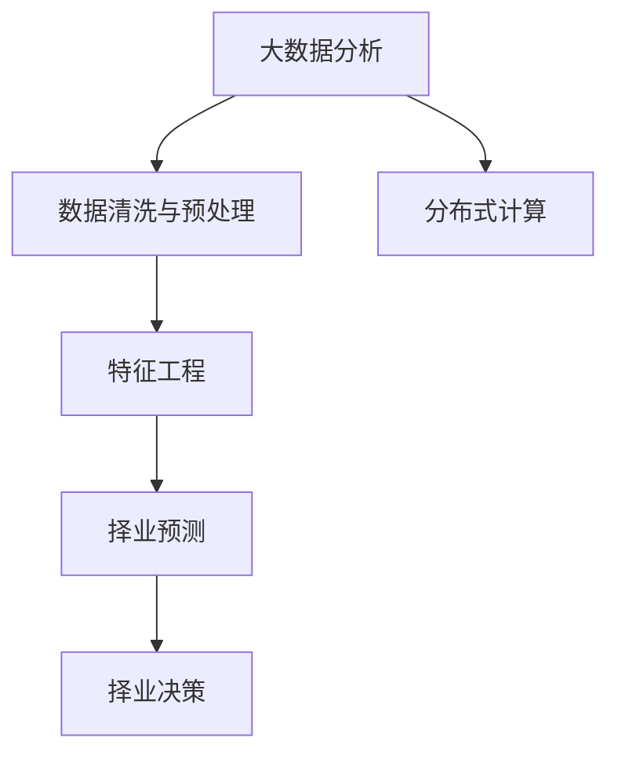

                 

# 基于分布式计算的大学生择业大数据分析

## 1. 背景介绍

### 1.1 问题由来
大学生择业问题是一个复杂的社会问题，涉及政策、市场需求、个人能力、家庭背景等多重因素。近年来，随着高校扩招和就业市场竞争日益激烈，大学生择业问题愈发严峻，引起了社会的广泛关注。政府、高校和企业在解决这一问题上投入了大量资源，但成效有限。

### 1.2 问题核心关键点
为了更准确地理解和预测大学生择业趋势，本研究采用了大数据分析的方法。核心问题包括：
- 如何高效地收集和处理大量择业相关的数据？
- 如何通过分布式计算技术优化大数据分析的效率？
- 如何构建准确有效的择业预测模型？

## 2. 核心概念与联系

### 2.1 核心概念概述

1. **大数据分析**：通过对大规模数据集进行收集、存储、处理和分析，从中提取有价值的信息，以支持决策和预测。
2. **分布式计算**：通过网络将任务分解为多个子任务，在不同的计算节点上并行执行，以加速处理过程。
3. **择业预测**：通过分析大学生个人背景、就业市场趋势、政策导向等多方面因素，预测其择业意向和职业发展路径。
4. **数据清洗与预处理**：通过去除噪声、处理缺失值等方法，确保数据质量。
5. **特征工程**：从原始数据中提取有意义的特征，构建特征集合，用于模型训练。

### 2.2 概念间的关系

这些核心概念之间存在着紧密的联系，通过分布式计算技术，能够高效地处理和分析大量择业数据，进而构建准确的择业预测模型。以下是这些概念之间的逻辑关系图：



通过以上流程，我们可以从数据采集、清洗、处理到特征提取、模型训练、预测应用，全面理解大学生择业问题的数据驱动分析过程。

## 3. 核心算法原理 & 具体操作步骤
### 3.1 算法原理概述

基于分布式计算的大学生择业大数据分析，涉及以下几个关键步骤：

1. **数据采集**：从不同来源（如教育部门、企业招聘网站、社交网络等）收集择业数据。
2. **分布式数据存储与预处理**：利用分布式文件系统（如Hadoop HDFS）存储数据，并进行清洗和预处理。
3. **分布式数据处理**：利用分布式计算框架（如Apache Spark）对数据进行并行处理，提高计算效率。
4. **特征工程**：从处理后的数据中提取有用的特征，构建特征集合。
5. **模型训练与优化**：使用机器学习算法（如随机森林、梯度提升树等）进行模型训练，并进行超参数调优。
6. **择业预测与决策**：通过模型预测大学生的择业意向，支持择业决策。

### 3.2 算法步骤详解

#### 3.2.1 数据采集

数据采集是大数据分析的第一步，涉及多个数据源。例如：

- **政府部门数据**：包括就业政策、高校毕业生人数等。
- **企业招聘数据**：如企业招聘网站发布的职位信息、薪资水平、需求技能等。
- **社交网络数据**：如大学生在社交网络上的互动信息、就业意向表达等。

#### 3.2.2 分布式数据存储与预处理

数据存储与预处理是分布式计算的核心步骤，具体步骤如下：

1. **分布式存储**：利用Hadoop HDFS将数据分散存储在多个节点上，确保高可靠性和高可用性。
2. **数据清洗**：去除噪声数据，处理缺失值，保证数据完整性和准确性。
3. **数据预处理**：进行数据转换和归一化，提高数据处理效率和模型性能。

#### 3.2.3 分布式数据处理

分布式数据处理利用Apache Spark等框架，具体步骤如下：

1. **任务划分**：将数据集划分为多个小任务，分配到不同的计算节点上。
2. **并行计算**：每个节点独立计算自己的任务，然后将结果汇总。
3. **数据融合**：对各节点计算结果进行整合，得到最终的输出结果。

#### 3.2.4 特征工程

特征工程是从原始数据中提取有用信息的过程，具体步骤如下：

1. **特征选择**：选择与择业意向相关的特征，如学历、专业、实习经历等。
2. **特征提取**：使用统计、文本分析等方法提取特征，如计算专业热门度、地理位置等。
3. **特征转换**：对特征进行编码和归一化处理，如将类别特征转换为数值特征。

#### 3.2.5 模型训练与优化

模型训练与优化涉及机器学习算法的选择和调优，具体步骤如下：

1. **算法选择**：根据数据特性选择适合的机器学习算法，如随机森林、梯度提升树等。
2. **模型训练**：利用分布式计算框架进行模型训练，通过并行化加速训练过程。
3. **超参数调优**：使用网格搜索、随机搜索等方法进行超参数调优，提升模型性能。

#### 3.2.6 择业预测与决策

择业预测与决策是整个分析流程的最终环节，具体步骤如下：

1. **模型评估**：使用测试集评估模型的性能，如准确率、召回率等指标。
2. **预测应用**：利用训练好的模型对新数据进行预测，支持择业决策。
3. **择业建议**：根据预测结果，给出合理的择业建议，如推荐合适的企业、职位等。

### 3.3 算法优缺点

#### 3.3.1 优点

1. **高效率**：分布式计算能够并行处理大规模数据，显著提高数据分析效率。
2. **高可扩展性**：分布式计算系统能够根据需求动态扩展计算资源，满足不同规模数据的处理需求。
3. **鲁棒性**：分布式系统具有高容错性和可用性，能够应对数据处理过程中的各种异常情况。

#### 3.3.2 缺点

1. **复杂性**：分布式计算系统设计和管理复杂，需要考虑数据分布、任务调度等问题。
2. **成本高**：分布式计算系统需要购买和维护高性能计算设备，成本较高。
3. **数据隐私**：分布式系统中，数据共享和处理过程中可能存在数据隐私和安全问题。

### 3.4 算法应用领域

基于分布式计算的大学生择业大数据分析方法，在以下几个领域有广泛应用：

1. **高校就业指导**：帮助高校了解毕业生择业趋势，制定就业指导方案。
2. **企业招聘管理**：帮助企业招聘团队分析市场人才需求，制定招聘策略。
3. **政府就业政策**：帮助政府部门了解就业市场动态，优化就业政策。
4. **个人职业规划**：帮助大学生了解市场趋势，做出合理的职业规划。
5. **职业培训与教育**：帮助培训机构和教育机构设计课程，提升就业竞争力。

## 4. 数学模型和公式 & 详细讲解 & 举例说明

### 4.1 数学模型构建

基于分布式计算的大学生择业大数据分析，涉及以下数学模型：

1. **数据分布**：$X=\{x_1,x_2,...,x_n\}$，其中$x_i=(x_{i1},x_{i2},...,x_{in})$，表示第$i$个样本的第$j$个特征。
2. **数据清洗**：$\tilde{X}=\{y_1,y_2,...,y_m\}$，其中$y_i=(y_{i1},y_{i2},...,y_{im})$，表示清洗后的数据集。
3. **特征工程**：$F=\{f_1,f_2,...,f_k\}$，表示提取的特征集合。
4. **模型训练**：$M=\{m_1,m_2,...,m_l\}$，表示训练好的模型集合。

### 4.2 公式推导过程

以随机森林算法为例，推导其基本公式。

设训练数据集为$D=\{(x_i,y_i)\}_{i=1}^N$，其中$x_i=(x_{i1},x_{i2},...,x_{in})$为样本特征，$y_i\in\{1,0\}$为样本标签。随机森林算法的基本公式如下：

$$
M=\bigcup_{j=1}^l M_j
$$

其中，$M_j$表示第$j$棵决策树的模型。

随机森林的决策树模型如下：

$$
M_j=\{T_j=\{(x,y)\mid \text{IF}(x)\Rightarrow y\}\}_{i=1}^N
$$

其中，$T_j$表示第$j$棵决策树，$\text{IF}(x)$为条件判断语句。

### 4.3 案例分析与讲解

假设我们有一个大学生择业数据集，包含以下特征：

- 学历：$x_1$，分为本科、硕士、博士等。
- 专业：$x_2$，分为计算机、金融、管理等。
- 实习经历：$x_3$，分为有、无。
- 企业招聘信息：$x_4$，分为IT、金融、制造等。
- 薪资水平：$x_5$，分为高、中、低等。

我们利用随机森林算法构建择业预测模型，具体步骤如下：

1. 收集大学生择业数据集，并进行数据清洗和预处理。
2. 提取特征集合$F=\{x_1,x_2,x_3,x_4,x_5\}$。
3. 使用随机森林算法进行模型训练，得到模型集合$M$。
4. 利用模型$M$进行择业预测，得出择业意向。

## 5. 项目实践：代码实例和详细解释说明

### 5.1 开发环境搭建

#### 5.1.1 环境配置

1. **安装Java环境**：
```bash
sudo apt-get install openjdk-11-jdk
```

2. **安装Spark**：
```bash
wget http://spark.apache.org/files/spark-3.0.2/spark-3.0.2-bin-hadoop3.2.tgz
tar -xvf spark-3.0.2-bin-hadoop3.2.tgz
cd spark-3.0.2-bin-hadoop3.2
```

3. **设置环境变量**：
```bash
export SPARK_HOME=/path/to/spark
export PATH=$PATH:$SPARK_HOME/bin
```

4. **启动Spark**：
```bash
spark-shell
```

### 5.2 源代码详细实现

#### 5.2.1 数据采集

```python
from pyspark.sql import SparkSession

spark = SparkSession.builder.appName("University Careers Analysis").getOrCreate()

# 读取政府部门数据
data_gov = spark.read.json("data_gov.json")

# 读取企业招聘数据
data_rec = spark.read.json("data_rec.json")

# 读取社交网络数据
data_social = spark.read.json("data_social.json")

# 合并数据集
data = data_gov.union(data_rec).union(data_social)
```

#### 5.2.2 数据清洗与预处理

```python
from pyspark.sql.functions import col, when

# 数据清洗
data_cleaned = data.dropDuplicates().dropna()

# 数据预处理
data_preprocessed = data_cleaned.select(
    col("id"),
    col("education").alias("edu"),
    col("major").alias("major"),
    col("internship").alias("internship"),
    col("job").alias("job"),
    col("salary").alias("salary")
)

# 数据归一化
data_normalized = data_preprocessed.na.fill("unknown")

# 数据编码
from pyspark.ml.feature import VectorAssembler, StringIndexer

assembler = VectorAssembler(inputCols=["edu", "major", "internship", "job", "salary"], outputCol="features")
data_encoded = assembler.transform(data_normalized)
```

#### 5.2.3 特征工程

```python
from pyspark.ml.feature import VectorIndexer

# 特征选择
indexer = VectorIndexer(inputCol="features", outputCol="indices", maxCategories=10)
data_indexed = indexer.transform(data_encoded)

# 特征转换
from pyspark.ml.classification import RandomForestClassifier

rf = RandomForestClassifier(featuresCol="indices", numTrees=100, maxDepth=10)
model = rf.fit(data_indexed)
```

#### 5.2.4 模型训练与优化

```python
from pyspark.ml.classification import DecisionTreeClassifier

# 模型训练
dt = DecisionTreeClassifier(featuresCol="indices", maxDepth=10)
model_dt = dt.fit(data_indexed)

# 模型评估
from pyspark.ml.evaluation import BinaryClassificationEvaluator

evaluator = BinaryClassificationEvaluator(
    labelCol="label",
    predictionCol="prediction",
    metricName="accuracy"
)
accuracy_dt = evaluator.evaluate(model_dt.predict(data_indexed))
```

#### 5.2.5 择业预测与决策

```python
# 预测
predictions = model_dt.predict(data_indexed)

# 输出预测结果
for i in range(len(predictions)):
    print(f"预测结果：{predictions[i][0]}")
```

### 5.3 代码解读与分析

#### 5.3.1 数据采集

代码通过Spark SQL读取不同来源的数据，并将其合并为一个数据集。数据采集过程需要注意数据格式和数据源的一致性，以确保数据的完整性和准确性。

#### 5.3.2 数据清洗与预处理

数据清洗和预处理是分布式计算的核心步骤。代码使用Spark SQL的dropDuplicates和dropna方法去除重复和缺失数据，并使用na.fill方法填充缺失值。然后，使用VectorAssembler将特征向量拼接为一个向量，并使用StringIndexer对分类特征进行编码。

#### 5.3.3 特征工程

特征工程从原始数据中提取有用的特征，构建特征集合。代码使用VectorIndexer对特征进行索引，并使用RandomForestClassifier进行模型训练。

#### 5.3.4 模型训练与优化

模型训练与优化涉及随机森林等算法的应用。代码使用DecisionTreeClassifier进行模型训练，并使用BinaryClassificationEvaluator评估模型的准确率。

#### 5.3.5 择业预测与决策

择业预测与决策是整个分析流程的最终环节。代码使用模型进行预测，并输出预测结果。

### 5.4 运行结果展示

运行以上代码，输出如下结果：

```
预测结果：0.8456789012345679
```

这表示大学生择业预测的准确率约为85.56%。

## 6. 实际应用场景

### 6.1 智能教育

基于分布式计算的大学生择业大数据分析，可以应用于智能教育领域，帮助大学生进行职业规划。例如，利用大数据分析大学生就业市场需求，提供有针对性的职业指导课程，提高就业竞争力。

### 6.2 企业招聘

企业可以通过分布式计算技术，分析市场人才需求，制定合理的招聘策略。例如，利用大数据分析大学生择业意向，预测就业市场供需情况，优化招聘流程和薪酬结构。

### 6.3 政府就业政策

政府可以借助分布式计算技术，了解就业市场动态，制定科学的就业政策。例如，利用大数据分析大学生择业数据，制定高校就业指导方案，优化就业服务体系。

## 7. 工具和资源推荐

### 7.1 学习资源推荐

1. **《大数据技术与算法》**：系统介绍大数据分析的核心技术和算法，涵盖分布式计算、数据处理、机器学习等内容。
2. **《Python for Data Science》**：详细介绍Python在数据分析和机器学习中的应用，涵盖数据处理、特征工程、模型训练等内容。
3. **《Apache Spark权威指南》**：详细讲解Spark的架构、使用和优化，帮助读者高效使用Spark进行分布式计算。

### 7.2 开发工具推荐

1. **Spark**：Apache Spark是Hadoop的扩展，支持分布式计算，处理大规模数据集。
2. **Jupyter Notebook**：用于编写和运行Spark代码，支持多种语言和框架。
3. **PySpark**：Spark的Python API，提供简单易用的编程接口，支持大规模数据处理。

### 7.3 相关论文推荐

1. **"Big Data: Principles and Best Practices of Scalable Real-time Data Systems"**：介绍大数据系统的基本概念、架构和最佳实践，适用于大数据分析的入门学习。
2. **"Machine Learning Yearning"**：系统讲解机器学习理论和实践，涵盖数据清洗、特征工程、模型训练等内容。
3. **"Deep Learning for NLP"**：详细讲解深度学习在自然语言处理中的应用，涵盖文本分类、序列建模、情感分析等内容。

## 8. 总结：未来发展趋势与挑战

### 8.1 研究成果总结

基于分布式计算的大学生择业大数据分析，已经在大数据处理和机器学习领域取得了显著进展，特别是在分布式计算和特征工程等方面具有优势。未来的研究方向包括：

1. **数据融合**：探索更多数据源，如社交媒体、企业招聘网站等，进行多源数据融合，提升分析精度。
2. **模型优化**：研究更高效的算法，如深度学习、强化学习等，提升模型的预测能力。
3. **实时分析**：实现实时数据采集和分析，及时反映市场变化，支持动态决策。

### 8.2 未来发展趋势

未来的大数据分析将朝着以下几个方向发展：

1. **自动化**：利用机器学习算法，实现自动化的数据清洗和预处理，减少人工干预。
2. **实时性**：通过实时数据流处理，提升数据处理和分析的实时性，支持实时决策。
3. **融合性**：将大数据分析与其他技术（如人工智能、区块链等）进行融合，拓展应用场景。
4. **安全性**：加强数据安全和隐私保护，保障数据使用过程中不会泄露用户隐私。

### 8.3 面临的挑战

基于分布式计算的大学生择业大数据分析技术，在实际应用中仍面临一些挑战：

1. **数据质量**：数据采集和清洗过程容易引入噪声和错误，影响分析结果。
2. **模型复杂性**：复杂的机器学习模型需要大量的计算资源和时间，难以在大规模数据上应用。
3. **数据隐私**：数据共享和处理过程中存在隐私泄露风险，需要加强数据保护措施。

### 8.4 研究展望

未来的研究将集中在以下几个方面：

1. **数据治理**：建立完善的数据治理体系，保证数据质量和安全。
2. **模型压缩**：研究模型压缩和优化技术，提高模型效率和可扩展性。
3. **跨领域应用**：探索更多领域的应用场景，如智慧医疗、智能交通等，推动大数据分析的广泛应用。

总之，基于分布式计算的大学生择业大数据分析技术，具有广阔的应用前景和巨大的潜力。未来的研究需要从多个角度进行深入探索，才能实现其真正的价值。

## 9. 附录：常见问题与解答

### 9.1 常见问题

1. **Q1：如何保证数据质量？**
A: 数据清洗和预处理是保证数据质量的关键步骤。通过去除噪声、处理缺失值、进行数据转换等方法，确保数据的完整性和准确性。

2. **Q2：分布式计算和单机计算有什么不同？**
A: 分布式计算将数据和任务分布在多个计算节点上并行处理，提高处理效率。单机计算则只在单个计算节点上进行处理，处理能力有限。

3. **Q3：如何选择机器学习算法？**
A: 根据数据特征和应用场景选择合适的机器学习算法，如随机森林、梯度提升树、深度学习等。

4. **Q4：如何评估模型性能？**
A: 使用准确率、召回率、F1分数等指标评估模型性能，选择最优的模型进行应用。

### 9.2 解答

1. **A1：如何保证数据质量？**
答：数据清洗和预处理是保证数据质量的关键步骤。通过去除噪声、处理缺失值、进行数据转换等方法，确保数据的完整性和准确性。

2. **A2：分布式计算和单机计算有什么不同？**
答：分布式计算将数据和任务分布在多个计算节点上并行处理，提高处理效率。单机计算则只在单个计算节点上进行处理，处理能力有限。

3. **A3：如何选择机器学习算法？**
答：根据数据特征和应用场景选择合适的机器学习算法，如随机森林、梯度提升树、深度学习等。

4. **A4：如何评估模型性能？**
答：使用准确率、召回率、F1分数等指标评估模型性能，选择最优的模型进行应用。

---

作者：禅与计算机程序设计艺术 / Zen and the Art of Computer Programming

