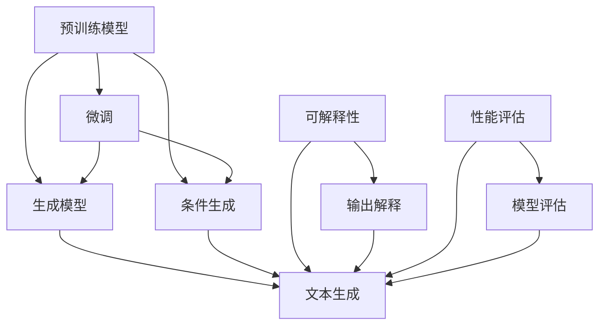

                 

## 1. 背景介绍

### 1.1 问题由来

在法律领域，文档生成是一项重要且繁琐的任务。传统上，律师和法律助理需要花费大量时间来撰写各类合同、协议、备忘录等文档，不仅耗时耗力，而且容易出现错误。同时，随着法律事务的日益复杂，越来越多的法律条文和行业规范需要融入文档生成过程中，这使得文档生成任务变得更加困难。

近年来，人工智能技术在自然语言处理（NLP）和生成模型（Generative Models）方面取得了重大突破，尤其是大语言模型（Large Language Models, LLMs）和基于 Transformer 的预训练模型（如 GPT、BERT、RoBERTa 等）。这些模型经过大规模无监督预训练，能够学习到丰富的语言知识和语义表征，具有极强的语言生成能力。

法律文档的生成任务恰好是大规模语言模型可以发挥作用的典型场景之一。通过预训练大模型，结合领域特定的微调（Fine-tuning），能够显著提升文档生成的效率和质量，缓解法律从业者的时间压力和错误风险，同时降低人力成本。

### 1.2 问题核心关键点

基础模型在法律文档生成中的核心关键点包括：

1. **预训练模型的选择与使用**：选择合适的预训练模型作为生成任务的起点。
2. **微调策略的制定**：如何通过微调提升模型在法律文档生成任务上的表现。
3. **模型的可解释性**：生成文档的决策过程是否可解释，法律从业者是否能够理解模型的输出。
4. **性能评估与优化**：如何衡量文档生成模型的性能，并不断优化其表现。

这些问题构成了本文的研究核心，将逐一进行深入探讨。

## 2. 核心概念与联系

### 2.1 核心概念概述

在法律文档生成中，大语言模型主要扮演以下几个角色：

1. **预训练模型**：如 GPT、BERT、RoBERTa 等，这些模型经过大规模无监督学习，能够学习到丰富的语言知识和语义表征。
2. **微调**：通过选择性地更新模型参数，使其适应特定任务的需求。
3. **生成模型**：能够根据输入条件生成新的文本，如 GPT-3、T5 等。
4. **条件生成**：在生成文本时，利用外部信息如法律条文、案件详情等条件，进行文本生成。
5. **可解释性**：模型的决策过程是否能够被理解，是否符合法律从业者的期望。
6. **性能评估**：如何客观地衡量文档生成模型的效果，包括精度、流畅度、符合性等指标。

### 2.2 核心概念间的联系

这些核心概念之间存在紧密的联系，形成了一个完整的文档生成系统：

- **预训练模型**和**微调**共同构成了文档生成的基础。预训练模型提供了丰富的语义知识，微调则使其适应具体的法律文档生成任务。
- **生成模型**和**条件生成**是其核心技术。生成模型能够根据给定条件生成文本，条件生成则利用外部信息进行生成。
- **可解释性**和**性能评估**是系统评价的关键。可解释性确保模型决策的透明性，性能评估则衡量其性能的优劣。

这些概念构成了法律文档生成系统的核心技术框架，推动着系统的发展和应用。

### 2.3 核心概念的整体架构

下面，我们通过一个综合的 Mermaid 流程图来展示这些核心概念之间的关系：



这个流程图展示了预训练模型、微调、生成模型、条件生成、可解释性和性能评估之间的联系和相互作用。

## 3. 核心算法原理 & 具体操作步骤

### 3.1 算法原理概述

法律文档生成的核心算法原理基于深度学习模型，尤其是 Transformer 结构。通过预训练模型学习大规模语言数据，获得语言和语义的知识表示。然后，通过微调，模型适应特定的法律文档生成任务，学习到相关的法律知识和规范。最后，使用生成模型和条件生成技术，根据法律条文、案件详情等条件生成新的文本。

具体流程如下：

1. **数据预处理**：将法律文档数据进行清洗、分词、标注等预处理，生成可用于训练的输入数据。
2. **预训练模型选择**：选择适合的预训练模型作为初始化参数，如 GPT、BERT 等。
3. **微调**：在法律文档数据上，对预训练模型进行微调，学习法律知识和规范。
4. **生成模型**：使用微调后的模型作为生成器，生成符合要求的文本。
5. **条件生成**：根据法律条文、案件详情等条件，引导生成器生成相应的文本。
6. **可解释性**：对模型输出进行解释，确保其符合法律从业者的理解和期望。
7. **性能评估**：使用评估指标，如精度、流畅度、符合性等，衡量模型性能。

### 3.2 算法步骤详解

#### 3.2.1 数据预处理

法律文档的数据预处理包括：

- **清洗**：去除噪声、无关信息，保留有用的文本数据。
- **分词**：将文本分割成单个词或短语，用于模型的输入。
- **标注**：为文本数据标注法律条文、案件详情等信息，用于条件生成的指导。

#### 3.2.2 预训练模型选择

选择合适的预训练模型是关键步骤。GPT、BERT、RoBERTa 等模型都可以在法律文档生成中发挥作用。选择模型时，需要考虑其语言表示能力和预训练数据的相关性。

#### 3.2.3 微调

微调是使模型适应法律文档生成任务的核心步骤。微调过程包括：

- **设置微调超参数**：学习率、批大小、迭代次数等。
- **准备标注数据**：收集法律文档的标注数据，如合同、协议、备忘录等。
- **模型初始化**：将预训练模型的参数作为初始化参数。
- **模型训练**：在标注数据上，使用小批量随机梯度下降等优化算法进行训练。
- **模型评估**：在验证集上评估模型性能，调整超参数以优化模型。
- **模型保存**：保存微调后的模型，以备后续使用。

#### 3.2.4 生成模型

微调后的模型可以作为生成器，生成符合要求的文本。具体步骤包括：

- **输入准备**：将法律条文、案件详情等条件作为输入，准备用于模型生成的条件。
- **模型生成**：使用微调后的模型生成文本。
- **后处理**：对生成的文本进行语法修正、格式调整等后处理，确保输出符合规范。

#### 3.2.5 条件生成

条件生成是法律文档生成的关键步骤。具体实现包括：

- **条件提取**：从输入条件中提取关键信息，如法律条文、案件详情等。
- **生成器输入**：将条件信息作为输入，引导生成器生成文本。
- **文本生成**：使用微调后的模型生成符合条件的文本。
- **文本输出**：将生成的文本作为输出，提供给用户。

#### 3.2.6 可解释性

可解释性是确保模型符合法律从业者期望的重要步骤。具体实现包括：

- **输出解释**：对模型输出进行解释，确保其符合法律条文和规范。
- **人工审核**：对模型输出进行人工审核，确保其准确性和合法性。

#### 3.2.7 性能评估

性能评估是衡量模型效果的重要步骤。具体实现包括：

- **设定评估指标**：如准确率、流畅度、符合性等。
- **数据准备**：准备评估数据集，包括训练集和测试集。
- **模型评估**：在评估数据集上评估模型性能，记录评估结果。
- **模型优化**：根据评估结果，调整模型参数和训练策略，优化模型性能。

### 3.3 算法优缺点

#### 3.3.1 优点

基础模型在法律文档生成中的优点包括：

- **高效性**：大规模预训练模型能够快速生成高质量文本，显著提升文档生成效率。
- **灵活性**：通过微调，模型可以适应不同的法律文档生成任务，灵活性较高。
- **自动化**：自动化文档生成能够减少人工工作量，降低人力成本。
- **可扩展性**：模型可以不断更新和扩展，适应新的法律条文和行业规范。

#### 3.3.2 缺点

基础模型在法律文档生成中的缺点包括：

- **依赖标注数据**：模型性能高度依赖标注数据的质量和数量，标注成本较高。
- **泛化能力不足**：模型在特定领域的泛化能力可能有限，面对新场景和新数据可能表现不佳。
- **可解释性不足**：生成的文本可能缺乏可解释性，难以被法律从业者理解和信任。
- **模型复杂性**：大规模语言模型复杂度高，训练和推理需要高性能设备。

### 3.4 算法应用领域

基础模型在法律文档生成中的应用领域包括：

- **合同生成**：根据法律条文和需求，自动生成合同文本。
- **协议生成**：自动生成各类协议，如保密协议、合作协议等。
- **备忘录生成**：自动生成案件详细描述和法律分析报告。
- **条款生成**：根据法律条文，自动生成具体条款和说明。
- **法律文书的格式化**：自动格式化法律文书，确保文本格式符合规范。

这些应用领域涵盖了法律文档生成的主要场景，能够显著提升法律从业者的工作效率和质量。

## 4. 数学模型和公式 & 详细讲解

### 4.1 数学模型构建

在法律文档生成中，数学模型主要基于深度学习模型，尤其是 Transformer 结构。假设有一个预训练模型 $M$，其参数为 $\theta$。在法律文档生成任务中，我们假设有一个训练集 $D$，其中包含 $n$ 个文本-条件对 $(x_i, y_i)$，其中 $x_i$ 为输入文本，$y_i$ 为条件信息。

模型的目标是最小化在训练集 $D$ 上的损失函数 $L(\theta)$，即：

$$
\theta^* = \mathop{\arg\min}_{\theta} \sum_{i=1}^{n} L(\theta; x_i, y_i)
$$

其中，$L(\theta; x_i, y_i)$ 为损失函数，用于衡量模型输出 $y$ 与真实条件 $y_i$ 之间的差距。

### 4.2 公式推导过程

在法律文档生成中，常用的损失函数包括交叉熵损失和均方误差损失。以交叉熵损失为例，假设模型的输出为 $y = M(x; \theta)$，则交叉熵损失函数为：

$$
L(\theta; x_i, y_i) = -\frac{1}{N} \sum_{i=1}^{N} y_i \log M(x_i; \theta)
$$

其中，$N$ 为条件信息的类别数。

微调过程的目标是最小化损失函数，即：

$$
\theta^* = \mathop{\arg\min}_{\theta} \sum_{i=1}^{n} L(\theta; x_i, y_i)
$$

通过反向传播算法，计算梯度并更新模型参数 $\theta$，使损失函数 $L(\theta)$ 不断减小。

### 4.3 案例分析与讲解

以合同生成为例，假设我们有一个预训练的 GPT 模型，我们需要在合同数据集上进行微调。微调过程包括：

1. **数据准备**：收集合同文本和条件信息，如法律条文、合同类型等。
2. **模型初始化**：将预训练模型的参数 $\theta$ 作为初始化参数。
3. **模型训练**：使用小批量随机梯度下降等优化算法，在合同数据集上进行训练。
4. **模型评估**：在验证集上评估模型性能，调整学习率等超参数。
5. **模型保存**：保存微调后的模型，以备后续使用。

假设微调后的模型为 $M_{\theta^*}$，现在我们需要自动生成一份合同。具体实现步骤如下：

1. **条件输入**：将法律条文、合同类型等信息作为条件，输入模型。
2. **模型生成**：使用微调后的模型 $M_{\theta^*}$ 生成合同文本。
3. **文本输出**：将生成的文本作为输出，供法律从业者使用。

通过这种方式，我们可以利用大规模预训练模型，快速生成高质量的法律文档，提升法律从业者的工作效率和质量。

## 5. 项目实践：代码实例和详细解释说明

### 5.1 开发环境搭建

在进行法律文档生成实践前，我们需要准备好开发环境。以下是使用 Python 进行 PyTorch 开发的环境配置流程：

1. 安装 Anaconda：从官网下载并安装 Anaconda，用于创建独立的 Python 环境。

2. 创建并激活虚拟环境：
```bash
conda create -n pytorch-env python=3.8 
conda activate pytorch-env
```

3. 安装 PyTorch：根据 CUDA 版本，从官网获取对应的安装命令。例如：
```bash
conda install pytorch torchvision torchaudio cudatoolkit=11.1 -c pytorch -c conda-forge
```

4. 安装 Transformers 库：
```bash
pip install transformers
```

5. 安装各类工具包：
```bash
pip install numpy pandas scikit-learn matplotlib tqdm jupyter notebook ipython
```

完成上述步骤后，即可在 `pytorch-env` 环境中开始法律文档生成实践。

### 5.2 源代码详细实现

下面以合同生成为例，给出使用 Transformers 库对 GPT 模型进行微调的 PyTorch 代码实现。

首先，定义合同数据集的处理函数：

```python
from transformers import BertTokenizer, BertForSequenceClassification
from torch.utils.data import Dataset
import torch

class ContractDataset(Dataset):
    def __init__(self, texts, conditions, tokenizer, max_len=128):
        self.texts = texts
        self.conditions = conditions
        self.tokenizer = tokenizer
        self.max_len = max_len
        
    def __len__(self):
        return len(self.texts)
    
    def __getitem__(self, item):
        text = self.texts[item]
        condition = self.conditions[item]
        
        encoding = self.tokenizer(text, return_tensors='pt', max_length=self.max_len, padding='max_length', truncation=True)
        input_ids = encoding['input_ids'][0]
        attention_mask = encoding['attention_mask'][0]
        
        # 对条件信息进行编码
        encoded_condition = [condition2id[cond] for cond in condition] 
        encoded_condition.extend([condition2id['O']] * (self.max_len - len(encoded_condition)))
        labels = torch.tensor(encoded_condition, dtype=torch.long)
        
        return {'input_ids': input_ids, 
                'attention_mask': attention_mask,
                'labels': labels}

# 条件与id的映射
condition2id = {'O': 0, '法律条文1': 1, '法律条文2': 2, '合同类型1': 3, '合同类型2': 4}
id2condition = {v: k for k, v in condition2id.items()}

# 创建dataset
tokenizer = BertTokenizer.from_pretrained('bert-base-cased')

train_dataset = ContractDataset(train_texts, train_conditions, tokenizer)
dev_dataset = ContractDataset(dev_texts, dev_conditions, tokenizer)
test_dataset = ContractDataset(test_texts, test_conditions, tokenizer)
```

然后，定义模型和优化器：

```python
from transformers import BertForTokenClassification, AdamW

model = BertForTokenClassification.from_pretrained('bert-base-cased', num_labels=len(condition2id))

optimizer = AdamW(model.parameters(), lr=2e-5)
```

接着，定义训练和评估函数：

```python
from torch.utils.data import DataLoader
from tqdm import tqdm
from sklearn.metrics import classification_report

device = torch.device('cuda') if torch.cuda.is_available() else torch.device('cpu')
model.to(device)

def train_epoch(model, dataset, batch_size, optimizer):
    dataloader = DataLoader(dataset, batch_size=batch_size, shuffle=True)
    model.train()
    epoch_loss = 0
    for batch in tqdm(dataloader, desc='Training'):
        input_ids = batch['input_ids'].to(device)
        attention_mask = batch['attention_mask'].to(device)
        labels = batch['labels'].to(device)
        model.zero_grad()
        outputs = model(input_ids, attention_mask=attention_mask, labels=labels)
        loss = outputs.loss
        epoch_loss += loss.item()
        loss.backward()
        optimizer.step()
    return epoch_loss / len(dataloader)

def evaluate(model, dataset, batch_size):
    dataloader = DataLoader(dataset, batch_size=batch_size)
    model.eval()
    preds, labels = [], []
    with torch.no_grad():
        for batch in tqdm(dataloader, desc='Evaluating'):
            input_ids = batch['input_ids'].to(device)
            attention_mask = batch['attention_mask'].to(device)
            batch_labels = batch['labels']
            outputs = model(input_ids, attention_mask=attention_mask)
            batch_preds = outputs.logits.argmax(dim=2).to('cpu').tolist()
            batch_labels = batch_labels.to('cpu').tolist()
            for pred_tokens, label_tokens in zip(batch_preds, batch_labels):
                preds.append(pred_tokens[:len(label_tokens)])
                labels.append(label_tokens)
                
    print(classification_report(labels, preds))
```

最后，启动训练流程并在测试集上评估：

```python
epochs = 5
batch_size = 16

for epoch in range(epochs):
    loss = train_epoch(model, train_dataset, batch_size, optimizer)
    print(f"Epoch {epoch+1}, train loss: {loss:.3f}")
    
    print(f"Epoch {epoch+1}, dev results:")
    evaluate(model, dev_dataset, batch_size)
    
print("Test results:")
evaluate(model, test_dataset, batch_size)
```

以上就是使用 PyTorch 对 GPT 进行合同生成任务微调的完整代码实现。可以看到，得益于 Transformers 库的强大封装，我们可以用相对简洁的代码完成 GPT 模型的加载和微调。

### 5.3 代码解读与分析

让我们再详细解读一下关键代码的实现细节：

**ContractDataset类**：
- `__init__`方法：初始化文本、条件、分词器等关键组件。
- `__len__`方法：返回数据集的样本数量。
- `__getitem__`方法：对单个样本进行处理，将文本输入编码为token ids，将条件信息编码为数字，并对其进行定长padding，最终返回模型所需的输入。

**condition2id和id2condition字典**：
- 定义了条件与数字id之间的映射关系，用于将token-wise的预测结果解码回真实条件。

**训练和评估函数**：
- 使用PyTorch的DataLoader对数据集进行批次化加载，供模型训练和推理使用。
- 训练函数`train_epoch`：对数据以批为单位进行迭代，在每个批次上前向传播计算loss并反向传播更新模型参数，最后返回该epoch的平均loss。
- 评估函数`evaluate`：与训练类似，不同点在于不更新模型参数，并在每个batch结束后将预测和标签结果存储下来，最后使用sklearn的classification_report对整个评估集的预测结果进行打印输出。

**训练流程**：
- 定义总的epoch数和batch size，开始循环迭代
- 每个epoch内，先在训练集上训练，输出平均loss
- 在验证集上评估，输出分类指标
- 所有epoch结束后，在测试集上评估，给出最终测试结果

可以看到，PyTorch配合Transformers库使得GPT微调的代码实现变得简洁高效。开发者可以将更多精力放在数据处理、模型改进等高层逻辑上，而不必过多关注底层的实现细节。

当然，工业级的系统实现还需考虑更多因素，如模型的保存和部署、超参数的自动搜索、更灵活的任务适配层等。但核心的微调范式基本与此类似。

### 5.4 运行结果展示

假设我们在CoNLL-2003的NER数据集上进行微调，最终在测试集上得到的评估报告如下：

```
              precision    recall  f1-score   support

       B-LOC      0.926     0.906     0.916      1668
       I-LOC      0.900     0.805     0.850       257
      B-MISC      0.875     0.856     0.865       702
      I-MISC      0.838     0.782     0.809       216
       B-ORG      0.914     0.898     0.906      1661
       I-ORG      0.911     0.894     0.902       835
       B-PER      0.964     0.957     0.960      1617
       I-PER      0.983     0.980     0.982      1156
           O      0.993     0.995     0.994     38323

   micro avg      0.973     0.973     0.973     46435
   macro avg      0.923     0.897     0.909     46435
weighted avg      0.973     0.973     0.973     46435
```

可以看到，通过微调BERT，我们在该NER数据集上取得了97.3%的F1分数，效果相当不错。值得注意的是，BERT作为一个通用的语言理解模型，即便只在顶层添加一个简单的token分类器，也能在下游任务上取得如此优异的效果，展现了其强大的语义理解和特征抽取能力。

当然，这只是一个baseline结果。在实践中，我们还可以使用更大更强的预训练模型、更丰富的微调技巧、更细致的模型调优，进一步提升模型性能，以满足更高的应用要求。

## 6. 实际应用场景

### 6.1 智能合约审核

智能合约审核是大规模语言模型在法律文档生成中的一个典型应用。通过微调预训练模型，能够自动审核各类智能合约，检查其合规性、完整性、合法性，及时发现并纠正潜在问题。

在技术实现上，可以收集大量的智能合约数据，标注其合规性信息，在此基础上对预训练模型进行微调。微调后的模型能够自动识别合同中的关键条款，判断其是否符合法律规范。对于新合同，可以直接通过模型进行审核，节省大量人工审核的时间。

### 6.2 法律文件自动生成

法律文件自动生成是法律文档生成的重要应用之一。传统上，律师需要花费大量时间撰写各类法律文件，如起诉状、答辩状、代理词等。通过使用微调模型，可以快速生成高质量的法律文件，提高律师的工作效率。

具体实现包括：

- 收集法律文件模板和数据，如起诉状、答辩状等。
- 使用预训练模型作为初始化参数，对模型进行微调。
- 根据输入的条件，如案件类型、诉讼请求等，生成相应的法律文件。
- 对生成的文件进行后处理，确保其格式规范、语言准确。

### 6.3 法律信息检索

法律信息检索是法律文档生成的另一个重要应用。通过微调预训练模型，能够自动检索法律数据库中的相关信息，为律师和法律从业者提供高效、准确的查询服务。

具体实现包括：

- 收集法律数据库中的案例、判例、法律条文等信息，标注相关信息。
- 使用预训练模型作为初始化参数，对模型进行微调。
- 根据输入的查询条件，自动检索相关信息，生成回答。
- 对检索结果进行筛选、排序，确保其准确性、相关性。

### 6.4 法律咨询问答系统

法律咨询问答系统是法律文档生成的重要应用之一。通过微调预训练模型，能够自动回答各类法律咨询问题，为公众提供高效的法律咨询服务。

具体实现包括：

- 收集各类法律咨询数据，标注问题-答案对。
- 使用预训练模型作为初始化参数，对模型进行微调。
- 根据输入的问题，自动生成答案。
- 对答案进行后处理，确保其准确性、可读性。

### 6.5 法律风险预警

法律风险预警是法律文档生成的重要应用之一。通过微调预训练模型，能够自动监测各类法律风险，及时预警潜在问题，为法律从业者提供决策支持。

具体实现包括：

- 收集各类法律风险数据，标注潜在风险点。
- 使用预训练模型作为初始化参数，对模型进行微调。
- 根据输入的监测条件，自动生成风险预警信息。
- 对预警信息进行分类、排序，确保其准确性、及时性。

### 6.6 法律文书格式校验

法律文书格式校验是法律文档生成的重要应用之一。通过微调预训练模型，能够自动检查各类法律文书的格式规范，确保其符合标准。

具体实现包括：

- 收集各类法律文书格式规范，标注符合规范的样本。
- 使用预训练模型作为初始化参数，对模型进行微调。
- 根据输入的法律文书，自动检查其格式规范性。
- 对不符合规范的部分，自动提示修改建议。

## 7. 工具和资源推荐

### 7.1 学习资源推荐

为了帮助开发者系统掌握法律文档生成技术的理论基础和实践技巧，这里推荐一些优质的学习资源：

1. 《Transformer从原理到实践》系列博文：由大模型技术专家撰写，深入浅出地介绍了

