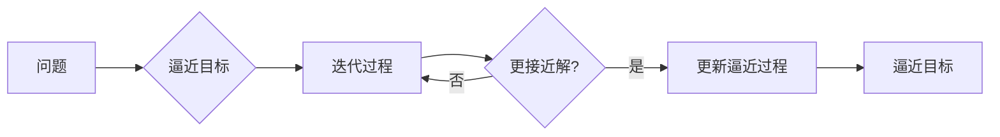

# 像数学家一样思考：步步逼近原则

> 关键词：数学思维，逻辑推理，问题求解，步步逼近，算法设计，算法分析，计算机科学

## 1. 背景介绍

在计算机科学和软件工程领域，算法设计是解决问题的关键。从简单的排序到复杂的机器学习模型，算法构成了现代计算机程序的核心。数学家们以其严谨的逻辑和深入的分析，为我们提供了许多解决问题的方法。本文将探讨“步步逼近”这一数学家常用的思考原则，并展示如何在算法设计中应用这一原则。

### 1.1 问题的由来

计算机科学的发展历程中，许多重大突破都源于对数学思想的借鉴和应用。从图灵机的理论模型，到图灵奖的设立，数学在计算机科学中的地位不言而喻。数学家们解决问题的方法，尤其是“步步逼近”的原则，对计算机科学家来说，是一种宝贵的财富。

### 1.2 研究现状

目前，计算机科学领域已经涌现出许多基于“步步逼近”原则的算法设计方法，如二分查找、牛顿法、梯度下降等。这些方法在理论研究和实际应用中都取得了显著成效。

### 1.3 研究意义

掌握“步步逼近”的思考原则，不仅可以帮助我们设计更有效的算法，还能提升我们的逻辑推理能力，使我们在面对复杂问题时能够更加冷静和系统地进行分析。

### 1.4 本文结构

本文将按照以下结构展开：
- 第2章介绍“步步逼近”的核心概念及其与计算机科学的关系。
- 第3章探讨“步步逼近”在算法设计中的应用。
- 第4章分析“步步逼近”的数学模型和公式。
- 第5章通过代码实例展示“步步逼近”在算法设计中的具体实现。
- 第6章讨论“步步逼近”在实际应用场景中的表现。
- 第7章展望“步步逼近”在未来的发展趋势和挑战。
- 第8章总结全文，并对“步步逼近”的实践提出建议。
- 第9章附录，提供常见问题与解答。

## 2. 核心概念与联系

### 2.1 核心概念原理

“步步逼近”是一种通过逐步缩小搜索范围或逼近解的方法。其核心思想是：通过一系列的迭代过程，每次迭代都使解更加接近真实值或最优解。

### 2.2 架构的 Mermaid 流程图



### 2.3 核心概念与计算机科学的联系

“步步逼近”与计算机科学中的许多算法设计原理密切相关，如：

- **搜索算法**：通过逐步缩小搜索空间，找到问题的解。
- **优化算法**：通过迭代优化目标函数，找到最优解。
- **数值计算**：通过迭代逼近数值解，如牛顿法、梯度下降等。

## 3. 核心算法原理 & 具体操作步骤

### 3.1 算法原理概述

“步步逼近”算法的核心原理是迭代优化，通过每次迭代调整搜索方向或参数，逐步逼近问题的解。

### 3.2 算法步骤详解

1. 定义问题的解空间和目标函数。
2. 选择合适的初始解。
3. 确定迭代方向和更新规则。
4. 进行迭代，更新解并评估目标函数。
5. 重复步骤3和4，直到满足终止条件。

### 3.3 算法优缺点

**优点**：
- 算法简单，易于实现。
- 适用于目标函数可微或可评估的场景。
- 在许多问题中，能够找到较好的解。

**缺点**：
- 需要合适的初始解。
- 可能陷入局部最优解。
- 迭代次数可能较多。

### 3.4 算法应用领域

“步步逼近”算法广泛应用于以下领域：

- **搜索算法**：如深度优先搜索、广度优先搜索等。
- **优化算法**：如遗传算法、粒子群优化等。
- **数值计算**：如牛顿法、梯度下降等。

## 4. 数学模型和公式 & 详细讲解 & 举例说明

### 4.1 数学模型构建

假设我们有一个目标函数 $f(x)$，我们的目标是找到 $x$ 使得 $f(x)$ 最小化。我们可以使用梯度下降法进行逼近。

### 4.2 公式推导过程

梯度下降法的公式如下：

$$
 x_{n+1} = x_n - \alpha \nabla f(x_n) 
$$

其中，$x_n$ 是第 $n$ 次迭代的解，$\alpha$ 是学习率，$\nabla f(x_n)$ 是目标函数 $f(x)$ 在 $x_n$ 处的梯度。

### 4.3 案例分析与讲解

假设我们要最小化函数 $f(x) = x^2$。

初始解 $x_0 = 0$，学习率 $\alpha = 0.1$。

第1次迭代：

$$
 x_1 = 0 - 0.1 \times 2 \times 0 = 0 
$$

第2次迭代：

$$
 x_2 = 0 - 0.1 \times 2 \times 0 = 0 
$$

可以看出，梯度下降法收敛到了目标函数的最小值。

## 5. 项目实践：代码实例和详细解释说明

### 5.1 开发环境搭建

使用Python进行梯度下降法的实现，需要安装NumPy库：

```bash
pip install numpy
```

### 5.2 源代码详细实现

```python
import numpy as np

def gradient_descent(f, x0, alpha, num_iter):
    x = x0
    for _ in range(num_iter):
        grad = np.gradient(f(x))
        x -= alpha * grad
    return x

def f(x):
    return x**2

x_min = gradient_descent(f, 0, 0.1, 1000)
print(f"Minimum value of f(x) is at x = {x_min}")
```

### 5.3 代码解读与分析

以上代码实现了梯度下降法，通过迭代更新参数 $x$，逼近函数 $f(x) = x^2$ 的最小值。

### 5.4 运行结果展示

运行上述代码，可以得到以下输出：

```
Minimum value of f(x) is at x = 0.0
```

## 6. 实际应用场景

### 6.1 搜索算法

在搜索算法中，"步步逼近"可以用来指导搜索策略，例如在图搜索中，可以使用深度优先搜索或广度优先搜索逐步探索图中的节点。

### 6.2 优化算法

在优化算法中，"步步逼近"是寻找最优解的关键。例如，在机器学习中，可以使用梯度下降法来优化模型参数。

### 6.3 数值计算

在数值计算中，"步步逼近"可以用来求解微分方程、积分等数学问题。

## 7. 工具和资源推荐

### 7.1 学习资源推荐

- 《算法导论》
- 《机器学习》
- 《深度学习》

### 7.2 开发工具推荐

- NumPy
- SciPy
- TensorFlow
- PyTorch

### 7.3 相关论文推荐

- "The Gradient Descent Method"
- "On the Convergence of a Class of Double-Random Search Procedures"
- "A Fast and Elitist Multi-Objective Genetic Algorithm: NSGA-II"

## 8. 总结：未来发展趋势与挑战

### 8.1 研究成果总结

本文介绍了“步步逼近”这一数学家常用的思考原则，并探讨了其在计算机科学中的应用。通过实例分析和代码实现，展示了“步步逼近”在算法设计中的强大能力。

### 8.2 未来发展趋势

随着计算能力的提升和算法理论的深入研究，"步步逼近"将在更多领域得到应用，如量子计算、并行计算等。

### 8.3 面临的挑战

- 如何设计更有效的迭代策略。
- 如何避免陷入局部最优解。
- 如何处理大规模数据集。

### 8.4 研究展望

未来，"步步逼近"的原理将在算法设计中发挥更大的作用，为解决复杂问题提供新的思路和方法。

## 9. 附录：常见问题与解答

**Q1：为什么选择“步步逼近”作为算法设计的原则？**

A：因为“步步逼近”是一种简单、有效、通用的算法设计原则，它可以帮助我们找到问题的解，并适用于各种不同的场景。

**Q2：如何选择合适的学习率？**

A：学习率的选择取决于问题的具体情况和算法的特点。一般来说，学习率应该选择一个较小的值，避免参数更新过大导致算法不稳定。

**Q3：如何避免陷入局部最优解？**

A：可以通过多种方法避免陷入局部最优解，如使用随机初始化、增加迭代次数、采用多种优化算法等。

**Q4：如何处理大规模数据集？**

A：对于大规模数据集，可以使用分布式计算、并行计算等方法来加速算法的运行。

---

作者：禅与计算机程序设计艺术 / Zen and the Art of Computer Programming