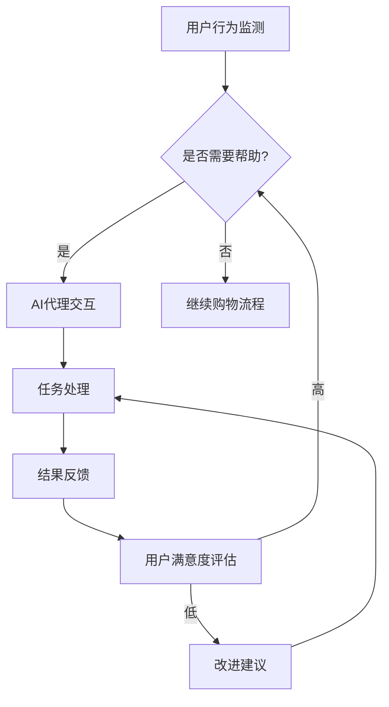

# 在电子商务中部署AI代理工作流的实战指南

> 关键词：电子商务，AI代理，工作流自动化，机器学习，自然语言处理，客户服务，个性化推荐

## 1. 背景介绍

电子商务的快速发展推动了在线购物体验的革新。消费者对个性化、便捷性、高效性的需求不断增长，企业也纷纷寻求利用先进技术提升客户满意度和服务效率。人工智能（AI）技术在电子商务领域的应用日益广泛，其中AI代理工作流是实现自动化、智能化的关键。本文将深入探讨在电子商务中部署AI代理工作流的实战指南，包括核心概念、算法原理、项目实践、应用场景以及未来发展趋势。

## 2. 核心概念与联系

### 2.1 AI代理

AI代理（AI Agent）是一种软件程序，它能够在没有人类干预的情况下执行任务。在电子商务中，AI代理可以通过自然语言处理（NLP）、机器学习（ML）和知识图谱等技术，模拟人类用户的行为，与客户进行交互，并执行复杂的业务逻辑。

### 2.2 工作流

工作流（Workflow）是一系列任务和步骤，这些任务和步骤按照特定的顺序执行，以完成一个业务流程。在电子商务中，工作流可以包括订单处理、客户服务、库存管理、个性化推荐等。

### 2.3 Mermaid 流程图

以下是一个Mermaid流程图，展示了AI代理在工作流中的角色和互动：



### 2.4 关联概念

AI代理与工作流之间的联系在于，AI代理是实现工作流自动化和智能化的关键工具。通过AI代理，企业可以自动化处理大量重复性任务，提高效率，降低成本，并提供更加个性化的客户体验。

## 3. 核心算法原理 & 具体操作步骤

### 3.1 算法原理概述

AI代理工作流的核心算法通常包括以下几个部分：

- **NLP技术**：用于理解和生成自然语言，与用户进行交互。
- **ML算法**：用于从数据中学习模式，进行预测和决策。
- **知识图谱**：用于存储和查询领域知识，支持智能推荐和决策。

### 3.2 算法步骤详解

1. **数据收集与预处理**：收集用户行为数据、产品信息、市场数据等，并进行清洗、转换和格式化。
2. **模型训练**：使用NLP和ML技术训练模型，使其能够理解和生成自然语言，以及从数据中学习模式。
3. **AI代理部署**：将训练好的模型部署到服务器上，使其能够实时响应用户请求。
4. **工作流设计**：设计工作流，定义任务和步骤，以及AI代理在其中的角色。
5. **系统集成**：将AI代理集成到电子商务平台中，与现有系统集成。
6. **性能监控与优化**：监控系统性能，收集用户反馈，持续优化AI代理和工作流。

### 3.3 算法优缺点

**优点**：

- 提高效率：自动化处理大量重复性任务，提高运营效率。
- 个性化体验：根据用户行为和偏好提供个性化推荐和服务。
- 24/7在线服务：AI代理可以24小时在线，提供全天候服务。

**缺点**：

- 需要大量数据：训练有效的AI代理需要大量的数据。
- 算法复杂：需要复杂的算法和模型来支持AI代理的功能。
- 可解释性差：AI代理的决策过程可能难以解释。

### 3.4 算法应用领域

AI代理工作流在电子商务中的应用领域包括：

- 客户服务：自动回答常见问题，提供客户支持。
- 个性化推荐：根据用户行为和偏好推荐产品。
- 库存管理：预测需求，优化库存水平。
- 售后服务：处理退货和换货请求。

## 4. 数学模型和公式 & 详细讲解 & 举例说明

### 4.1 数学模型构建

AI代理工作流中的数学模型通常包括以下几个部分：

- **NLP模型**：如循环神经网络（RNN）、长短期记忆网络（LSTM）、Transformer等。
- **ML模型**：如决策树、随机森林、支持向量机（SVM）、神经网络等。
- **优化模型**：如线性规划、动态规划等。

### 4.2 公式推导过程

以RNN模型为例，其基本公式如下：

$$
h_t = f(W_xh_{t-1} + W_yx_t + b)
$$

其中，$h_t$ 是t时刻的隐藏状态，$x_t$ 是t时刻的输入，$W_x$ 和 $W_y$ 是权重矩阵，$b$ 是偏置项，$f$ 是激活函数。

### 4.3 案例分析与讲解

假设我们要开发一个基于RNN的聊天机器人，用于自动回答客户常见问题。

1. **数据收集**：收集常见问题和对应的回答，以及一些无标签的对话数据。
2. **数据预处理**：对文本数据进行分词、去停用词等处理。
3. **模型训练**：使用RNN模型对预处理后的数据进行训练。
4. **模型评估**：使用测试集评估模型性能，调整模型参数。
5. **模型部署**：将训练好的模型部署到服务器上，用于实际应用。

## 5. 项目实践：代码实例和详细解释说明

### 5.1 开发环境搭建

1. 安装Python环境。
2. 安装必要的库，如TensorFlow、Keras、NLTK等。
3. 准备数据集。

### 5.2 源代码详细实现

以下是一个使用TensorFlow和Keras构建RNN聊天机器人的简单示例：

```python
import tensorflow as tf
from tensorflow.keras.models import Sequential
from tensorflow.keras.layers import Embedding, SimpleRNN, Dense

# 定义模型
model = Sequential([
    Embedding(input_dim=vocab_size, output_dim=embedding_dim, input_length=max_length),
    SimpleRNN(units=rnn_units),
    Dense(units=output_dim, activation='softmax')
])

# 编译模型
model.compile(optimizer='adam', loss='sparse_categorical_crossentropy', metrics=['accuracy'])

# 训练模型
model.fit(x_train, y_train, epochs=epochs, validation_data=(x_test, y_test))
```

### 5.3 代码解读与分析

上述代码定义了一个简单的RNN模型，用于预测文本序列的下一个词。模型由一个嵌入层、一个RNN层和一个密集层组成。嵌入层将单词转换为向量表示，RNN层用于处理序列数据，密集层用于输出概率分布。

### 5.4 运行结果展示

运行上述代码后，模型会在训练集上进行训练，并在测试集上进行评估。输出结果包括训练集和测试集的准确率。

## 6. 实际应用场景

### 6.1 个性化推荐

AI代理可以根据用户的历史购买记录、浏览行为和搜索历史，推荐相关的产品和服务。例如，一个电商平台可以使用AI代理来向用户推荐他们可能感兴趣的商品，从而提高转化率。

### 6.2 客户服务

AI代理可以自动回答客户的常见问题，如订单状态、退换货政策等，从而减轻客服人员的负担，提高客户满意度。

### 6.3 库存管理

AI代理可以预测产品的需求量，帮助企业优化库存水平，减少库存积压，降低运营成本。

## 7. 工具和资源推荐

### 7.1 学习资源推荐

- 《深度学习》（Goodfellow, Bengio, Courville）
- 《自然语言处理综合教程》（Speech and Language Processing）
- 《机器学习实战》（Python机器学习）

### 7.2 开发工具推荐

- TensorFlow
- Keras
- NLTK
- scikit-learn

### 7.3 相关论文推荐

- "Deep Learning for Natural Language Understanding"
- "The Unreasonable Effectiveness of Recurrent Neural Networks"
- "Attention Is All You Need"

## 8. 总结：未来发展趋势与挑战

### 8.1 研究成果总结

AI代理工作流在电子商务中的应用取得了显著成果，提高了运营效率，改善了客户体验。

### 8.2 未来发展趋势

- AI代理将更加智能化，能够处理更加复杂的任务。
- AI代理将与人类专家进行协同工作，提供更加优质的服务。
- AI代理将与物联网（IoT）技术结合，实现更加智能的电子商务体验。

### 8.3 面临的挑战

- 隐私保护：确保用户数据的安全和隐私。
- 可解释性：提高AI代理决策过程的透明度和可解释性。
- 数据质量：保证训练数据的质量和多样性。

### 8.4 研究展望

未来，AI代理工作流将在电子商务领域发挥更大的作用，推动电子商务的智能化发展。

## 9. 附录：常见问题与解答

**Q1：AI代理是否会取代人类客服？**

A：AI代理可以处理大量重复性任务，但不能完全取代人类客服。人类客服可以处理更加复杂和情感化的问题，并提供个性化的服务。

**Q2：如何保证AI代理的隐私保护？**

A：通过数据脱敏、差分隐私等技术，可以保护用户数据的安全和隐私。

**Q3：如何提高AI代理的可解释性？**

A：通过可解释AI技术，如注意力机制可视化、决策路径追踪等，可以提高AI代理的可解释性。

**Q4：AI代理是否会带来失业问题？**

A：AI代理可以自动化处理重复性任务，但也会创造新的工作岗位，如AI工程师、数据科学家等。

作者：禅与计算机程序设计艺术 / Zen and the Art of Computer Programming