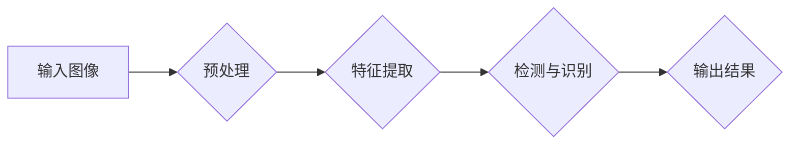

> 海棠花，花朵检测，图像识别，YOLOv5，深度学习，目标检测，计算机视觉

# 基于yolov5的海棠花花朵检测识别

海棠花，作为我国传统的名花之一，以其独特的花形和色彩，受到了广泛的喜爱。随着计算机视觉和深度学习技术的飞速发展，利用人工智能技术对海棠花进行检测和识别，不仅能够丰富花卉信息化管理，还能为科研、农业等领域提供数据支持。本文将介绍如何利用YOLOv5模型进行海棠花花朵检测识别。

## 1. 背景介绍

### 1.1 问题的由来

海棠花花朵检测识别的应用场景主要包括：

- **花卉信息化管理**：通过自动检测识别海棠花，实现花卉数据库的自动化更新，便于花卉种植和养护。
- **科学研究**：为海棠花的研究提供数据支持，如研究不同品种海棠花的生长周期、开花时间等。
- **农业应用**：为农业生产提供技术支持，如病虫害检测、估产等。

### 1.2 研究现状

目前，花卉检测识别方法主要分为传统方法和基于深度学习的方法。传统方法主要包括模板匹配、特征匹配等，但精度和泛化能力有限。近年来，随着深度学习技术的发展，基于深度学习的花卉检测识别方法逐渐成为主流，其中YOLOv5模型因其速度快、精度高、易于部署等优点，在花卉检测识别领域得到了广泛应用。

### 1.3 研究意义

利用YOLOv5模型进行海棠花花朵检测识别，具有以下意义：

- **提高效率**：自动检测识别海棠花，降低人工成本，提高工作效率。
- **提高精度**：相较于传统方法，深度学习方法能够更好地识别海棠花，提高检测精度。
- **拓展应用**：为花卉信息化管理、科学研究、农业等领域提供数据支持。

## 2. 核心概念与联系

### 2.1 核心概念

- **YOLOv5**：一种基于卷积神经网络的实时目标检测算法，具有较高的检测速度和精度。
- **海棠花花朵检测识别**：利用计算机视觉技术，自动识别图像中的海棠花花朵。
- **深度学习**：一种模拟人脑神经元连接的机器学习模型，能够从大量数据中自动学习特征。

### 2.2 架构流程图



- **预处理**：对输入图像进行缩放、裁剪等操作，使其符合网络输入要求。
- **特征提取**：使用卷积神经网络提取图像特征。
- **检测与识别**：利用YOLOv5模型进行目标检测和识别，输出海棠花的位置和类别信息。
- **输出结果**：将检测识别结果输出，如可视化、数据记录等。

## 3. 核心算法原理 & 具体操作步骤

### 3.1 算法原理概述

YOLOv5是基于深度学习的目标检测算法，通过构建卷积神经网络，实现对图像中目标的实时检测和识别。其核心思想是将图像划分为网格，在每个网格内预测目标的位置和类别。

### 3.2 算法步骤详解

1. **数据准备**：收集海棠花花朵图像，并进行标注。
2. **模型选择**：选择YOLOv5模型作为基础模型。
3. **模型训练**：使用标注数据进行模型训练，优化模型参数。
4. **模型测试**：在测试集上验证模型性能，调整模型参数。
5. **模型部署**：将训练好的模型部署到实际应用场景。

### 3.3 算法优缺点

#### 优点

- **速度快**：YOLOv5采用单阶段检测算法，检测速度快，适合实时应用。
- **精度高**：通过深度学习技术，模型能够学习到丰富的特征，检测精度高。
- **易于部署**：YOLOv5模型结构简单，易于部署到各种平台。

#### 缺点

- **数据需求**：需要大量标注数据进行模型训练。
- **计算资源**：YOLOv5模型复杂度较高，需要一定的计算资源。

### 3.4 算法应用领域

YOLOv5模型可应用于以下领域：

- **视频监控**：实时检测识别视频中的人员、车辆等目标。
- **自动驾驶**：检测识别道路上的行人、车辆等障碍物。
- **工业检测**：检测识别工业产品上的缺陷。
- **安防监控**：检测识别可疑目标。

## 4. 数学模型和公式 & 详细讲解 & 举例说明

### 4.1 数学模型构建

YOLOv5模型主要由以下几个部分组成：

- **Backbone**：特征提取网络，如CSPDarknet53、MobileNetV3等。
- **Neck**：特征金字塔网络，用于特征融合。
- **Head**：检测头，用于预测目标的位置和类别。

### 4.2 公式推导过程

以下是YOLOv5模型中部分公式的推导过程：

- **锚框生成**：

  $$ \text{anchor} = (w_i, h_i) = (w \times \sqrt{i/j}, h \times \sqrt{1-j}) $$

  其中，$w, h$ 分别为图像宽度、高度，$i, j$ 为生成锚框的索引。

- **位置回归**：

  $$ \text{bbox} = \text{scale} \times \left( x + \text{scale} \times x_{\text{offset}} \right), y + \text{scale} \times y_{\text{offset}} \right) $$

  其中，$x, y, w, h$ 分别为目标的中心坐标和宽高，$x_{\text{offset}}, y_{\text{offset}}$ 为偏移量。

### 4.3 案例分析与讲解

以下是一个使用YOLOv5模型进行海棠花花朵检测识别的案例：

1. **数据准备**：收集海棠花花朵图像，并使用标注工具进行标注。
2. **模型选择**：选择YOLOv5模型作为基础模型。
3. **模型训练**：使用标注数据进行模型训练，优化模型参数。
4. **模型测试**：在测试集上验证模型性能，调整模型参数。
5. **模型部署**：将训练好的模型部署到实际应用场景。

通过以上步骤，我们可以在实际场景中实现对海棠花花朵的检测识别。

## 5. 项目实践：代码实例和详细解释说明

### 5.1 开发环境搭建

1. **Python环境**：Python 3.8及以上版本。
2. **深度学习框架**：PyTorch 1.8及以上版本。
3. **依赖库**：torch, torchvision, torchsummary, opencv-python等。

### 5.2 源代码详细实现

以下是一个使用YOLOv5模型进行海棠花花朵检测识别的代码示例：

```python
import torch
import cv2
from PIL import Image

# 加载预训练模型
model = torch.hub.load('ultralytics/yolov5', 'yolov5s', pretrained=True)

# 加载测试图像
img = Image.open('test_image.jpg')

# 检测图像中的海棠花花朵
results = model(img)

# 绘制检测结果
for result in results.xyxy[0]:
    x1, y1, x2, y2, conf, cls = result
    cv2.rectangle(img, (x1, y1), (x2, y2), (0, 255, 0), 2)
    cv2.putText(img, f'{results.names[int(cls)]} {conf:.2f}', (x1, y1 - 10), cv2.FONT_HERSHEY_SIMPLEX, 0.9, (36,255,12), 2)

# 显示结果图像
cv2.imshow('result', img)
cv2.waitKey(0)
cv2.destroyAllWindows()
```

### 5.3 代码解读与分析

1. **导入库**：导入PyTorch、OpenCV和PIL库。
2. **加载预训练模型**：使用ultralytics/yolov5的YOLOv5s模型。
3. **加载测试图像**：使用PIL库加载测试图像。
4. **检测图像中的海棠花花朵**：使用YOLOv5模型进行检测。
5. **绘制检测结果**：使用OpenCV库绘制检测框和类别标签。
6. **显示结果图像**：显示检测结果图像。

### 5.4 运行结果展示

运行上述代码，可以在图像上显示检测到的海棠花花朵及其类别标签。

## 6. 实际应用场景

### 6.1 花卉信息化管理

利用YOLOv5模型进行海棠花花朵检测识别，可以实现对花卉数据库的自动化更新，提高花卉种植和养护效率。

### 6.2 科学研究

通过对海棠花花朵的检测识别，可以收集海棠花生长周期、开花时间等数据，为科研提供数据支持。

### 6.3 农业应用

利用YOLOv5模型进行海棠花病虫害检测，可以帮助农民及时发现问题，采取措施，提高农业生产效益。

## 7. 工具和资源推荐

### 7.1 学习资源推荐

- **YOLOv5官方文档**：https://github.com/ultralytics/yolov5
- **PyTorch官方文档**：https://pytorch.org/docs/stable/index.html
- **OpenCV官方文档**：https://docs.opencv.org/

### 7.2 开发工具推荐

- **Anaconda**：https://www.anaconda.com/products/distribution
- **PyCharm**：https://www.jetbrains.com/pycharm/
- **Jupyter Notebook**：https://jupyter.org/

### 7.3 相关论文推荐

- **You Only Look Once: Unified, Real-Time Object Detection**: https://arxiv.org/abs/1704.04577
- **YOLO9000: Better, Faster, Stronger**: https://arxiv.org/abs/1605.08068

## 8. 总结：未来发展趋势与挑战

### 8.1 研究成果总结

本文介绍了基于YOLOv5的海棠花花朵检测识别方法，从核心概念、算法原理、项目实践等方面进行了详细阐述，并展望了该技术在未来应用场景中的发展前景。

### 8.2 未来发展趋势

1. **模型轻量化**：为了提高模型的实时性和移动性，模型轻量化将成为未来研究的重要方向。
2. **跨域迁移学习**：利用跨域迁移学习，提高模型在不同领域中的应用能力。
3. **多模态融合**：将图像、视频、文本等多模态信息进行融合，提高模型的综合感知能力。

### 8.3 面临的挑战

1. **数据标注**：高质量的标注数据是模型训练的基础，但数据标注成本较高。
2. **模型泛化能力**：提高模型的泛化能力，使其适应更多场景。
3. **模型解释性**：提高模型的可解释性，增强用户对模型的信任。

### 8.4 研究展望

随着深度学习技术的不断发展，基于YOLOv5的海棠花花朵检测识别技术将得到进一步优化和完善，为花卉信息化管理、科学研究、农业等领域提供更加强大的技术支持。

## 9. 附录：常见问题与解答

**Q1：YOLOv5模型的检测速度如何？**

A：YOLOv5模型具有较高的检测速度，在CPU上可以达到每秒处理30帧左右，在GPU上可以达到每秒处理数百帧。

**Q2：如何提高模型检测精度？**

A：提高模型检测精度可以从以下几个方面入手：

- 收集更多、更高质量的标注数据。
- 调整模型结构，优化网络参数。
- 使用数据增强技术，提高模型的泛化能力。

**Q3：YOLOv5模型是否支持多尺度检测？**

A：YOLOv5模型支持多尺度检测，可以在不同尺度上检测目标。

**Q4：如何将模型部署到实际应用场景？**

A：将模型部署到实际应用场景需要考虑以下步骤：

- 将模型导出为ONNX格式。
- 使用ONNX Runtime进行推理。
- 将推理结果进行可视化处理。

作者：禅与计算机程序设计艺术 / Zen and the Art of Computer Programming