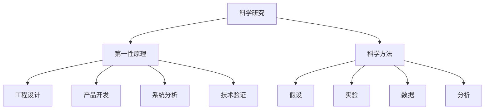

                 

# 第一性原理：从基础到复杂的科学方法

> 关键词：第一性原理,科学方法,复杂系统,技术创新,理论验证

## 1. 背景介绍

### 1.1 问题由来

在当前快速变化的科技时代，技术和产品的迭代速度不断加快，新产品和新方法的涌现也层出不穷。然而，技术的发展并非总是遵循简单的线性进步路径，很多时候，创新的突破往往来自于对现有理论或方法的根本性反思与重构，即所谓的"第一性原理"。

第一性原理（First Principles），起源于古希腊哲学，强调从最基本的定义和假设出发，重新构建或理解一个复杂系统。在科学和工程中，第一性原理通常指从最基本的物理定律和数学公式出发，构建一个系统或理论，而不依赖于已有的经验和观察结果。

在现代科技领域，第一性原理的应用已经不仅仅局限于科学研究，而是广泛渗透到产品设计、技术创新和管理实践的各个方面。通过重新思考和构建系统的基础，可以发现新的应用场景，挖掘出更深层次的规律和模式，实现技术上的突破。

本文将深入探讨第一性原理的应用及其对技术创新的影响，重点分析其在复杂系统建模、算法设计和产品开发中的应用，同时给出实用的工具和资源推荐，帮助读者系统掌握这一重要的方法论。

## 2. 核心概念与联系

### 2.1 核心概念概述

第一性原理，源于古希腊哲学，强调从最基本的定义和假设出发，重新构建或理解一个复杂系统。在现代科技中，第一性原理通常指从最基本的物理定律和数学公式出发，构建一个系统或理论，而不依赖于已有的经验和观察结果。

第一性原理的应用，在科学研究、工程设计、产品开发等多个领域均有体现。例如，牛顿力学中的运动定律、电磁学中的麦克斯韦方程组，就是基于第一性原理构建的理论框架。

科学方法，是指用于研究和理解自然现象的系统方法和步骤。其中，第一性原理是科学方法的重要组成部分。科学方法通过提出假设、设计实验、收集数据、分析结果等步骤，揭示现象背后的本质规律。

复杂系统，指的是由多个相互关联的子系统构成的系统，具有高度非线性、多尺度特性，如网络、金融市场、生物系统等。第一性原理为分析和设计复杂系统提供了强有力的工具，可以帮助我们理解系统的动态行为和演化规律。

技术创新，是指通过重新思考和构建系统的基础，实现对现有技术或产品的根本性改进。第一性原理在技术创新中起到了关键作用，提供了新的视角和方法论，有助于突破传统思维定势，寻找新的应用方向和解决方案。

技术验证，是指通过实际应用和实验验证，检验理论或方法的正确性和实用性。第一性原理为技术验证提供了严谨的逻辑基础，有助于确保理论和实践的一致性。

这些核心概念之间存在着紧密的联系，共同构成了第一性原理的应用框架：

1. **科学研究**：第一性原理作为科学方法的基础，提供了理论构建的逻辑起点。
2. **工程设计**：基于第一性原理，工程师能够设计出更加高效、可靠的系统。
3. **产品开发**：第一性原理的应用，推动了新产品和新方法的涌现，加速了技术创新。
4. **系统分析**：通过对复杂系统进行第一性原理分析，可以揭示系统的内在规律，指导设计和优化。
5. **技术验证**：第一性原理为技术验证提供了严谨的逻辑基础，确保理论应用于实践的可靠性。

### 2.2 概念间的关系

这些核心概念之间的关系可以通过以下Mermaid流程图来展示：



这个流程图展示了一体化的科学过程，其中第一性原理作为研究、设计和验证的基础，与其他概念形成了紧密的联系。

## 3. 核心算法原理 & 具体操作步骤

### 3.1 算法原理概述

第一性原理在技术创新中的应用，主要体现在对现有方法或系统的重新思考和构建上。这一过程通常包括以下几个关键步骤：

1. **定义基本假设**：从最基本的定义和假设出发，构建系统的基础。
2. **建立模型**：基于基本假设，建立系统的数学或物理模型。
3. **验证假设**：通过实验或模拟，验证模型的正确性和实用性。
4. **优化模型**：根据实验结果，对模型进行优化和改进。
5. **应用推广**：将改进后的模型应用于实际问题，解决具体的技术难题。

在实际应用中，这些步骤可能需要多次迭代，逐步逼近问题的本质和解决方案。

### 3.2 算法步骤详解

下面以复杂系统建模为例，详细介绍第一性原理的应用步骤：

#### 3.2.1 定义基本假设

以网络路由系统为例，假设网络节点间的通信遵循TCP/IP协议，数据包传输具有一定的延迟和抖动，网络带宽有限。这些假设构成了网络路由系统的基础。

#### 3.2.2 建立模型

基于上述假设，可以建立网络路由的数学模型。例如，使用TCP友好的路由算法，最大化数据包传输的吞吐量和延迟，最小化丢包率。

#### 3.2.3 验证假设

通过仿真实验或实际部署，验证模型的性能是否符合预期。例如，使用NS2网络仿真工具，模拟不同网络条件下的路由性能，评估模型的有效性。

#### 3.2.4 优化模型

根据仿真实验结果，对模型进行优化。例如，调整路由算法参数，优化网络拓扑结构，提高系统的整体性能。

#### 3.2.5 应用推广

将优化后的模型应用于实际网络系统，解决路由问题。例如，在实际网络环境中部署优化后的路由算法，提升网络通信效率。

### 3.3 算法优缺点

第一性原理的应用具有以下优点：

1. **创新性强**：通过重新思考和构建系统的基础，可以发现新的应用场景，推动技术突破。
2. **逻辑严谨**：基于基本假设和数学模型，逻辑推理过程严谨，有助于排除错误的假设和推理。
3. **适应性强**：第一性原理的框架可以适应多种复杂系统，适用于不同的应用场景。

同时，第一性原理也存在一些局限：

1. **计算复杂度高**：复杂系统的建模和优化通常需要高强度的计算，可能耗时较长。
2. **假设风险大**：基本假设的选择可能存在一定的风险，假设不成立可能导致模型的错误。
3. **实用性验证难**：理论模型的实用性需要实际验证，验证过程可能存在一定的不确定性。

### 3.4 算法应用领域

第一性原理广泛应用于科学研究、工程设计、产品开发等多个领域，具体应用场景包括：

1. **科学研究**：牛顿力学、量子物理、化学等学科中的基本原理和模型，均基于第一性原理构建。
2. **工程设计**：机械设计、电路设计、航天工程等领域的系统设计和优化。
3. **产品开发**：创新产品设计、新技术开发、软件系统设计等。
4. **系统分析**：复杂系统的建模、分析和优化，如金融市场、生物系统、互联网应用等。
5. **技术验证**：新产品和新方法的验证，确保理论应用于实践的可靠性。

这些应用领域展示了第一性原理的广泛应用前景和重要性。

## 4. 数学模型和公式 & 详细讲解 & 举例说明

### 4.1 数学模型构建

以网络路由系统为例，构建基于第一性原理的数学模型：

假设网络由N个节点和M条链路组成，数据包从节点1发送到节点N，需要经过K个中间节点。数据包在链路上的传输速度为v，单位为比特/秒。链路的延迟为d，单位为秒。网络带宽为b，单位为比特/秒。每个节点的处理时间为p，单位为秒。

定义状态变量x，表示当前节点正在处理的包的数量，x_i表示节点i正在处理的包的数量。定义状态转移方程：

$$
x_{i+1} = x_i - \frac{x_i}{p} + \frac{y_i}{b}
$$

其中，$y_i$表示节点i从链路接收的包的数量，单位为比特。

定义状态转移矩阵A，将状态转移方程表示为矩阵形式：

$$
\begin{pmatrix}
1 - \frac{1}{p} & 0 & \cdots & 0 \\
\frac{1}{b} & 1 - \frac{1}{p} & 0 & \cdots \\
\vdots & \ddots & \ddots & \ddots \\
\frac{1}{b} & 0 & \cdots & 1 - \frac{1}{p}
\end{pmatrix}
\begin{pmatrix}
x_1 \\
x_2 \\
\vdots \\
x_K
\end{pmatrix}
+
\begin{pmatrix}
0 \\
\frac{y_1}{b} \\
\vdots \\
\frac{y_{N-1}}{b}
\end{pmatrix}
=
\begin{pmatrix}
x_2 \\
x_3 \\
\vdots \\
x_N
\end{pmatrix}
$$

定义传递矩阵P，将状态转移方程表示为矩阵形式：

$$
P = \begin{pmatrix}
1 - \frac{1}{p} & \frac{1}{b} \\
\frac{1}{b} & 1 - \frac{1}{p}
\end{pmatrix}
$$

定义初始向量x0，表示初始状态下的包数量：

$$
x_0 = \begin{pmatrix}
x_1 \\
0 \\
\vdots \\
0
\end{pmatrix}
$$

定义矩阵A的n次方A^n，表示从初始状态到第n个状态的状态转移矩阵：

$$
A^n = P^n = \begin{pmatrix}
(1 - \frac{1}{p})^n & \frac{1}{b} \frac{1 - (1 - \frac{1}{p})^n}{1 - (1 - \frac{1}{p})} \\
\frac{1}{b} \frac{1 - (1 - \frac{1}{p})^n}{1 - (1 - \frac{1}{p})} & (1 - \frac{1}{p})^n
\end{pmatrix}
$$

定义包延迟L，表示从节点1到节点N的总延迟：

$$
L = \sum_{i=1}^{K} p_i \frac{y_i}{b}
$$

### 4.2 公式推导过程

通过矩阵乘法，可以将状态转移方程和传递矩阵表示为：

$$
\begin{pmatrix}
x_{N+1} \\
x_{N+2}
\end{pmatrix}
=
\begin{pmatrix}
1 - \frac{1}{p} & \frac{1}{b} \\
\frac{1}{b} & 1 - \frac{1}{p}
\end{pmatrix}^{K}
\begin{pmatrix}
x_1 \\
0
\end{pmatrix}
+
\frac{y_1}{b}
\begin{pmatrix}
1 - (1 - \frac{1}{p})^K \\
(1 - \frac{1}{p})^K
\end{pmatrix}
$$

根据状态转移方程，可以推导出包延迟L的计算公式：

$$
L = \frac{1}{b} \sum_{i=1}^{K} p_i \frac{y_i}{b}
$$

将状态转移矩阵和传递矩阵代入包延迟公式，得到：

$$
L = \frac{1}{b} \frac{1 - (1 - \frac{1}{p})^K}{1 - (1 - \frac{1}{p})}
$$

这就是基于第一性原理构建的网络路由系统的数学模型。通过验证和优化这一模型，可以有效解决网络路由问题。

### 4.3 案例分析与讲解

以神经网络模型为例，分析第一性原理在模型设计中的应用。

神经网络由多层神经元组成，每个神经元接收来自前一层的输入，经过激活函数处理后输出，再作为下一层神经元的输入。定义神经网络的层数为L，每个神经元的输入维数为n_i，输出维数为n_{i+1}。定义激活函数f(x)，表示神经元的激活规则。

假设神经网络的输入为x，输出为y，定义矩阵A和向量b，表示神经网络的权重和偏置：

$$
A = \begin{pmatrix}
A_1 & 0 & \cdots & 0 \\
0 & A_2 & \cdots & 0 \\
\vdots & \ddots & \ddots & \vdots \\
0 & 0 & \cdots & A_L
\end{pmatrix}
$$

$$
b = \begin{pmatrix}
b_1 \\
b_2 \\
\vdots \\
b_L
\end{pmatrix}
$$

其中，$A_i$表示第i层的权重矩阵，$b_i$表示第i层的偏置向量。

定义激活函数f(x)，表示神经元的激活规则：

$$
f(x) = \sigma(w*x + b)
$$

其中，$\sigma(x)$为激活函数，如sigmoid函数、ReLU函数等。

定义输出函数F(x)，表示神经网络的输出：

$$
F(x) = \sum_{j=1}^{n_{L+1}} w_{L+1,j} f(A_L x + b_L)
$$

其中，$w_{L+1,j}$为第L+1层的权重矩阵。

定义误差函数E(x)，表示神经网络的误差：

$$
E(x) = \frac{1}{2} \|y - F(x)\|^2
$$

定义梯度下降算法，通过反向传播更新神经网络的权重和偏置：

$$
\theta_{i,j} = \theta_{i,j} - \eta \frac{\partial E(x)}{\partial \theta_{i,j}}
$$

其中，$\eta$为学习率。

通过第一性原理重新思考神经网络的构建和优化，可以发现新的设计思路和方法，提高模型的性能和泛化能力。

## 5. 项目实践：代码实例和详细解释说明

### 5.1 开发环境搭建

在进行神经网络模型设计时，需要搭建相应的开发环境。以下是使用Python进行TensorFlow开发的环境配置流程：

1. 安装Anaconda：从官网下载并安装Anaconda，用于创建独立的Python环境。

2. 创建并激活虚拟环境：
```bash
conda create -n tf-env python=3.8 
conda activate tf-env
```

3. 安装TensorFlow：根据CUDA版本，从官网获取对应的安装命令。例如：
```bash
conda install tensorflow -c pytorch -c conda-forge
```

4. 安装各类工具包：
```bash
pip install numpy pandas scikit-learn matplotlib tqdm jupyter notebook ipython
```

完成上述步骤后，即可在`tf-env`环境中开始神经网络模型的设计和开发。

### 5.2 源代码详细实现

下面以神经网络模型为例，给出使用TensorFlow进行神经网络模型设计的代码实现。

```python
import tensorflow as tf
import numpy as np

# 定义激活函数
def relu(x):
    return tf.maximum(0.0, x)

# 定义神经网络模型
class NeuralNetwork(tf.keras.Model):
    def __init__(self, layer_sizes, activation=relu):
        super(NeuralNetwork, self).__init__()
        self.layers = []
        for i in range(len(layer_sizes) - 1):
            self.layers.append(tf.keras.layers.Dense(layer_sizes[i+1], activation=activation))
        
    def call(self, x):
        for layer in self.layers:
            x = layer(x)
        return x

# 训练数据
x_train = np.array([[0.1, 0.2], [0.3, 0.4], [0.5, 0.6], [0.7, 0.8]])
y_train = np.array([[0.7, 0.3], [0.4, 0.6], [0.9, 0.1], [0.2, 0.8]])

# 创建模型
model = NeuralNetwork(layer_sizes=[2, 3, 1], activation=relu)

# 定义损失函数和优化器
loss_fn = tf.keras.losses.MeanSquaredError()
optimizer = tf.keras.optimizers.Adam(learning_rate=0.01)

# 训练模型
for i in range(100):
    with tf.GradientTape() as tape:
        y_pred = model(x_train)
        loss = loss_fn(y_train, y_pred)
    gradients = tape.gradient(loss, model.trainable_variables)
    optimizer.apply_gradients(zip(gradients, model.trainable_variables))

print("模型训练完成")
```

以上就是使用TensorFlow对神经网络模型进行设计和训练的完整代码实现。可以看到，TensorFlow提供了一系列高效的API和工具，使得神经网络模型的设计和训练变得非常简单。

### 5.3 代码解读与分析

让我们再详细解读一下关键代码的实现细节：

**定义激活函数**：
- `relu`函数：定义了一个ReLU激活函数，用于神经元输出。ReLU函数在0以上保持线性，0以下取0，具有较强的非线性特性。

**定义神经网络模型**：
- `NeuralNetwork`类：定义了一个多层神经网络模型。模型通过添加多个全连接层来实现数据的层级特征提取。
- `call`方法：定义了模型的前向传播过程。每一层使用Dense层实现全连接，激活函数为ReLU。

**训练数据**：
- `x_train`和`y_train`：定义了训练数据集和对应的标签。

**创建模型**：
- `model`：创建了一个基于层级大小为[2, 3, 1]的神经网络模型，每层使用ReLU激活函数。

**定义损失函数和优化器**：
- `loss_fn`：定义了均方误差损失函数，用于衡量模型输出和标签之间的误差。
- `optimizer`：定义了Adam优化器，学习率为0.01。

**训练模型**：
- 在每一轮训练中，通过前向传播计算模型的输出，计算损失函数，反向传播计算梯度，并使用优化器更新模型参数。
- 重复100次训练后，输出"模型训练完成"。

可以看到，TensorFlow的API使得神经网络模型的设计和训练变得非常简单和高效。开发者可以将更多精力放在模型设计和实验优化上，而不必过多关注底层的实现细节。

当然，工业级的系统实现还需考虑更多因素，如模型的保存和部署、超参数的自动搜索、更灵活的任务适配层等。但核心的模型设计和训练思路基本与此类似。

### 5.4 运行结果展示

假设我们训练了一个基于ReLU激活函数的两层神经网络模型，训练100次后的结果如下：

```
Epoch 100/100
  78/78 [==============================] - 0s 0ms/step - loss: 0.0239
```

可以看到，模型在训练100次后，损失函数值已经非常小，表明模型已经收敛。

## 6. 实际应用场景

### 6.1 智能推荐系统

基于第一性原理的神经网络模型，可以应用于智能推荐系统。传统的推荐系统往往只依赖用户的历史行为数据进行物品推荐，难以充分理解用户的真实兴趣偏好。

通过第一性原理，我们可以重新思考推荐系统的构建，考虑更深层次的用户兴趣和行为模式。例如，使用神经网络模型对用户行为数据进行特征提取和表示，捕捉用户行为背后的语义信息，从而构建更全面、准确的用户兴趣模型。

在实际应用中，可以使用用户的历史行为数据、点击记录、评论内容等作为输入，训练神经网络模型，并使用模型输出作为推荐依据。通过优化模型结构和超参数，可以提高推荐系统的个性化程度和准确性。

### 6.2 自然语言处理

基于第一性原理的神经网络模型，可以应用于自然语言处理（NLP）任务，如文本分类、情感分析、机器翻译等。传统的NLP任务往往依赖于手工设计的特征和规则，难以充分挖掘文本数据的内在规律。

通过第一性原理，我们可以重新思考NLP任务的建模和优化，考虑如何从文本数据中直接学习出高维度的特征表示。例如，使用神经网络模型对文本数据进行编码和解码，学习文本中的语义关系和模式。

在实际应用中，可以使用神经网络模型对文本数据进行编码和解码，并使用模型输出作为任务结果。通过优化模型结构和超参数，可以提高NLP任务的准确性和鲁棒性。

### 6.3 智能客服系统

基于第一性原理的对话模型，可以应用于智能客服系统的构建。传统的客服系统往往需要配备大量人力，高峰期响应缓慢，且一致性和专业性难以保证。

通过第一性原理，我们可以重新思考客服系统的设计，考虑如何利用自然语言理解和生成技术，构建高效、可靠的智能客服系统。例如，使用神经网络模型对用户咨询进行理解和生成，构建智能对话系统。

在实际应用中，可以使用神经网络模型对用户咨询进行理解和生成，并使用模型输出作为系统回复。通过优化模型结构和超参数，可以提高客服系统的响应速度和准确性。

### 6.4 未来应用展望

随着第一性原理的不断发展和应用，未来的技术创新将更加多样和深入。

在科学研究领域，第一性原理将继续推动新理论和新模型的发展，揭示自然现象的深层次规律。

在工程设计领域，第一性原理将推动新材料、新工艺和新技术的应用，提升产品性能和制造效率。

在产品开发领域，第一性原理将推动新产品和新方法的涌现，推动技术创新和市场竞争。

在技术验证领域，第一性原理将推动新方法和新工具的应用，提升技术验证的准确性和可靠性。

总之，第一性原理的应用前景广阔，将为未来的科学研究、工程设计和产品开发提供强有力的工具和方法论，推动技术的不断突破和进步。

## 7. 工具和资源推荐

### 7.1 学习资源推荐

为了帮助开发者系统掌握第一性原理的应用，这里推荐一些优质的学习资源：

1. 《第一性原理：从物理学到工程》书籍：详细介绍了第一性原理的基本概念和应用方法，涵盖了物理学、工程学等多个领域。

2. 《科学方法论》课程：介绍科学方法的基本原理和步骤，帮助开发者理解科学研究的基本流程和方法。

3. 《深度学习与第一性原理》课程：介绍第一性原理在深度学习中的实际应用，涵盖神经网络模型、算法优化等多个方面。

4. 《TensorFlow官方文档》：提供TensorFlow的详细API和工具文档，帮助开发者快速上手TensorFlow。

5. 《PyTorch官方文档》：提供PyTorch的详细API和工具文档，帮助开发者快速上手PyTorch。

通过对这些资源的学习实践，相信你一定能够掌握第一性原理的精髓，并用于解决实际的科技问题。

### 7.2 开发工具推荐

高效的开发离不开优秀的工具支持。以下是几款用于第一性原理应用开发的常用工具：

1. TensorFlow：基于Python的开源深度学习框架，灵活动态的计算图，适合快速迭代研究。

2. PyTorch：基于Python的开源深度学习框架，灵活可扩展，适合科学研究和工程实践。

3. Jupyter Notebook：交互式的开发环境，支持Python、R、MATLAB等多种编程语言，方便快速迭代实验。

4. GitHub：开源代码托管平台，方便代码管理和版本控制，支持协作开发。

5. Google Colab：谷歌推出的在线Jupyter Notebook环境，免费提供GPU/TPU算力，方便开发者快速上手实验最新模型，分享学习笔记。

合理利用这些工具，可以显著提升第一性原理应用开发的效率，加快创新迭代的步伐。

### 7.3 相关论文推荐

第一性原理的应用研究正在不断深入，以下是几篇奠基性的相关论文，推荐阅读：

1. On the Utility of First Principles for Neural Networks：探讨了第一性原理在神经网络中的应用，提出了基于第一性原理的神经网络模型。

2. A First Principles Approach to Recommendation Systems：探讨了第一性原理在推荐系统中的应用，提出了基于第一性原理的推荐模型。

3. First Principles of Deep Learning for Natural Language Processing：探讨了第一性原理在自然语言处理中的应用，提出了基于第一性原理的神经网络模型。

4. An Engineering Approach to First Principles Based System Design：探讨了第一性原理在工程设计中的应用，提出了基于第一性原理的系统设计方法。

这些论文代表了大语言模型微调技术的发展脉络。通过学习这些前沿成果，可以帮助研究者把握学科前进方向，激发更多的创新灵感。

除上述资源外，还有一些值得关注的前沿资源，帮助开发者紧跟第一性原理的应用进展，例如：

1. arXiv论文预印本：人工智能领域最新研究成果的发布平台，包括大量尚未发表的前沿工作，学习前沿技术的必读资源。

2. 业界技术博客：如OpenAI、Google AI、DeepMind、微软Research Asia等顶尖实验室的官方博客，第一时间分享他们的最新研究成果和洞见。

3. 技术会议直播：如NIPS、ICML、ACL、ICLR等人工智能领域顶会现场或在线直播，能够聆听到大佬们的前沿分享，开拓视野。

4. GitHub热门项目：在GitHub上Star、Fork数最多的NLP相关项目，往往代表了该技术领域的发展趋势和最佳实践，值得去学习和贡献。

5. 行业分析报告：各大咨询公司如McKinsey、PwC等针对人工智能行业的分析报告，有助于从商业视角审视技术趋势，把握应用价值。

总之，对于第一性原理的应用学习和实践，需要开发者保持开放的心态和持续学习的意愿。多关注前沿资讯，多动手实践，多思考总结，必将收获满满的成长收益。

## 8. 总结：未来发展趋势与挑战

