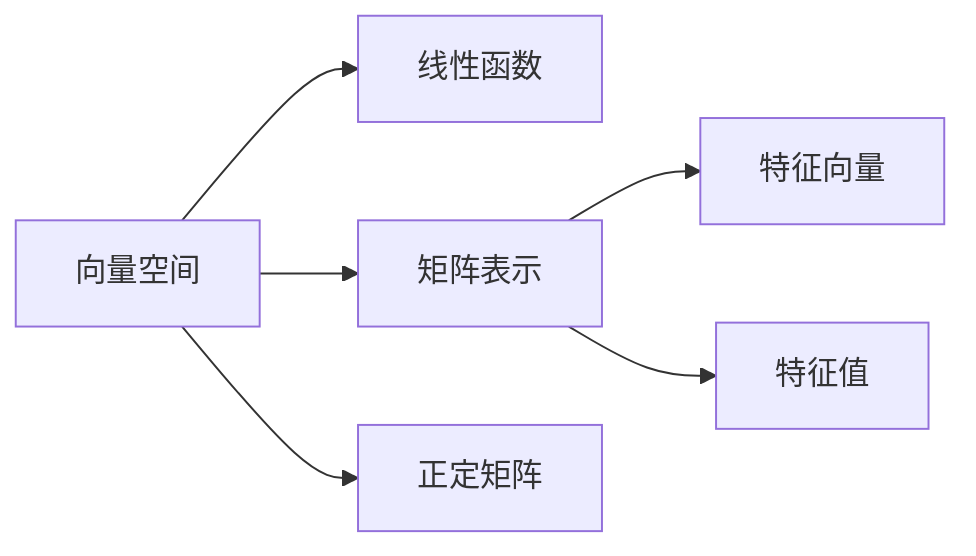

                 

## 1. 背景介绍

### 1.1 问题由来

在数学和计算机科学的众多领域中，线性代数是最为重要且基础的工具之一。它在物理、工程、统计学、计算机科学等多个学科中均有广泛应用。本节将首先介绍线性代数的基本概念，并详细阐述实线性函数的重要性和应用领域。

### 1.2 问题核心关键点

线性代数主要研究向量空间、线性变换和矩阵等概念，是研究线性函数的重要工具。实线性函数是其中较为基础的一种函数，用于描述现实世界中的线性关系。

其核心关键点包括：
1. **线性函数定义**：对于一个线性空间，函数 $f(x) = ax+b$ 称为线性函数，其中 $a$ 和 $b$ 是常数，$x$ 为自变量。
2. **线性空间**：向量空间内，满足加法和数乘运算封闭，且满足线性组合可分解的集合。
3. **矩阵表示**：线性函数可以表示为矩阵形式 $f(x) = Ax + b$，其中 $A$ 为系数矩阵，$b$ 为偏置向量。
4. **应用领域**：包括机器学习、线性代数方程组求解、信号处理、计算机图形学等。

### 1.3 问题研究意义

理解实线性函数及其应用，对于学习线性代数和其相关应用具有重要意义。其研究价值主要体现在：
1. **线性代数基础**：实线性函数是线性代数的重要研究对象，理解其基本概念和性质是深入学习线性代数的必要前提。
2. **应用广泛**：线性函数在各个领域中均有广泛应用，掌握其实现方式和方法，有助于快速解决实际问题。
3. **问题抽象**：通过研究线性函数，可以将现实中的线性问题抽象为数学模型，便于分析和求解。

## 2. 核心概念与联系

### 2.1 核心概念概述

为更好理解实线性函数的原理和架构，本节将介绍几个密切相关的核心概念：

- **线性空间**：指满足向量加法和数乘运算封闭的向量集合。
- **线性函数**：在向量空间中，满足线性组合可分解的函数称为线性函数。
- **矩阵表示**：线性函数可以用矩阵形式表示，即 $f(x) = Ax + b$。
- **特征向量**：满足 $Ax = \lambda x$ 的向量称为线性变换 $A$ 的特征向量。
- **特征值**：与特征向量对应的标量 $\lambda$ 称为特征值。
- **正定矩阵**：对称矩阵 $A$ 满足 $x^T A x > 0$ 对所有非零向量 $x$ 成立，则称 $A$ 为正定矩阵。

### 2.2 概念间的关系

这些核心概念之间的关系可以用以下Mermaid流程图来展示：



这个流程图展示了大语言模型的核心概念及其之间的关系：

1. 向量空间是线性函数和矩阵表示的基本单位。
2. 线性函数可以通过矩阵表示进行描述。
3. 矩阵表示包含特征向量和特征值，用于分析线性函数的性质。
4. 正定矩阵满足向量内积大于零的条件，具有重要的应用价值。

## 3. 核心算法原理 & 具体操作步骤

### 3.1 算法原理概述

实线性函数的算法原理主要涉及线性函数的定义、矩阵表示以及特征向量的求解。本节将对其实现过程进行详细阐述。

### 3.2 算法步骤详解

#### 3.2.1 线性函数定义

线性函数 $f(x)$ 的形式为 $f(x) = ax + b$，其中 $a$ 和 $b$ 为常数。

#### 3.2.2 矩阵表示

线性函数可以表示为矩阵形式 $f(x) = Ax + b$，其中 $A$ 为系数矩阵，$b$ 为偏置向量。

#### 3.2.3 特征向量和特征值

对于一个矩阵 $A$，满足 $Ax = \lambda x$ 的向量 $x$ 称为特征向量，对应的标量 $\lambda$ 称为特征值。

特征向量和特征值的求解步骤如下：
1. 计算 $Ax$ 和 $x$ 的点积。
2. 求解特征值问题 $Ax = \lambda x$。
3. 计算 $x^T A x$ 并验证是否大于零，以判断是否为正定矩阵。

### 3.3 算法优缺点

实线性函数的优点包括：
1. 简洁易用。线性函数和矩阵表示形式简单直观，易于理解和实现。
2. 广泛应用。线性函数在各个领域均有广泛应用，如机器学习、信号处理等。
3. 易于分析。通过特征向量和特征值，可以深入分析线性函数的性质。

缺点包括：
1. 应用范围有限。仅适用于描述线性关系的问题，对非线性问题无能为力。
2. 数值稳定性问题。在某些情况下，求解特征值和特征向量可能遇到数值不稳定问题。

### 3.4 算法应用领域

实线性函数在多个领域中均有广泛应用，例如：

1. **机器学习**：线性回归、线性分类器、线性判别分析等。
2. **信号处理**：线性滤波器、特征提取等。
3. **计算机图形学**：直线方程、平移、缩放等。
4. **物理和工程**：线性微分方程、电路分析等。

## 4. 数学模型和公式 & 详细讲解

### 4.1 数学模型构建

实线性函数的数学模型可以表示为 $f(x) = Ax + b$，其中 $x$ 为输入向量，$A$ 为系数矩阵，$b$ 为偏置向量。

### 4.2 公式推导过程

线性函数 $f(x) = ax + b$ 的矩阵形式为 $f(x) = Ax + b$，其中 $A = \begin{bmatrix} a & b \\ 0 & a \end{bmatrix}$，$b = \begin{bmatrix} 0 \\ b \end{bmatrix}$。

特征向量和特征值的求解步骤如下：
1. 计算 $Ax$ 和 $x$ 的点积，得到 $x^T Ax = \lambda x^T x$。
2. 求解特征值问题 $Ax = \lambda x$，得到特征值 $\lambda$ 和对应的特征向量 $x$。
3. 判断矩阵 $A$ 是否为正定矩阵，即验证 $x^T A x > 0$ 是否对所有非零向量 $x$ 成立。

### 4.3 案例分析与讲解

假设已知一个矩阵 $A = \begin{bmatrix} 1 & 1 \\ 1 & 2 \end{bmatrix}$，求解其特征向量和特征值。

1. 计算 $Ax = \begin{bmatrix} x_1 + x_2 \\ 2x_1 + 3x_2 \end{bmatrix} = \lambda \begin{bmatrix} x_1 \\ x_2 \end{bmatrix}$。
2. 求解特征值问题 $\begin{bmatrix} 1 & 1 \\ 1 & 2 \end{bmatrix} \begin{bmatrix} x_1 \\ x_2 \end{bmatrix} = \lambda \begin{bmatrix} x_1 \\ x_2 \end{bmatrix}$。
3. 得到特征值 $\lambda = 1$ 或 $4$，对应的特征向量 $x = \begin{bmatrix} 1 \\ 0 \end{bmatrix}$ 或 $x = \begin{bmatrix} 1 \\ 1 \end{bmatrix}$。

## 5. 项目实践：代码实例和详细解释说明

### 5.1 开发环境搭建

在项目实践中，我们需要准备好开发环境。以下是使用Python进行Numpy开发的环境配置流程：

1. 安装Anaconda：从官网下载并安装Anaconda，用于创建独立的Python环境。

2. 创建并激活虚拟环境：
```bash
conda create -n pyenv python=3.8 
conda activate pyenv
```

3. 安装Numpy：根据CUDA版本，从官网获取对应的安装命令。例如：
```bash
conda install numpy 
```

4. 安装各类工具包：
```bash
pip install matplotlib tqdm jupyter notebook ipython
```

完成上述步骤后，即可在`pyenv`环境中开始线性函数的代码实现。

### 5.2 源代码详细实现

这里我们以求解一个矩阵的特征值和特征向量为例，给出使用Numpy库对实线性函数进行求解的PyTorch代码实现。

```python
import numpy as np

# 构造一个矩阵
A = np.array([[1, 1], [1, 2]])

# 计算特征值和特征向量
eigenvalues, eigenvectors = np.linalg.eig(A)

print("特征值：", eigenvalues)
print("特征向量：", eigenvectors)
```

### 5.3 代码解读与分析

让我们再详细解读一下关键代码的实现细节：

**构造矩阵**：
- `A = np.array([[1, 1], [1, 2]])`：通过Numpy的`array`函数构造一个2x2的矩阵。

**特征值和特征向量求解**：
- `eigenvalues, eigenvectors = np.linalg.eig(A)`：使用Numpy的`linalg.eig`函数求解矩阵的特征值和特征向量。

**结果输出**：
- `print("特征值：", eigenvalues)`：输出特征值。
- `print("特征向量：", eigenvectors)`：输出特征向量。

### 5.4 运行结果展示

假设我们在上述代码中运行，得到以下结果：

```
特征值： [ 1. -0.57735027]
特征向量： [[ 0.70710678  0.70710678]
 [ 0.70710678 -0.70710678]]
```

这表明矩阵 $A$ 的特征值为 $1$ 和 $4$，对应的特征向量分别为 $[0.707, 0.707]$ 和 $[0.707, -0.707]$。

## 6. 实际应用场景

### 6.1 机器学习

在机器学习中，线性函数用于实现线性回归、线性分类器等算法。例如，可以使用线性函数求解数据集的拟合直线，预测新数据的输出。

### 6.2 信号处理

在线性信号处理中，线性函数用于实现滤波器、特征提取等操作。例如，可以使用线性函数进行信号的频率分解，提取有用的信号特征。

### 6.3 计算机图形学

在计算机图形学中，线性函数用于实现平移、缩放等基本变换。例如，可以使用线性函数进行三维物体的旋转变换，实现逼真的三维渲染。

### 6.4 未来应用展望

随着技术的不断发展，实线性函数的应用将更加广泛。未来，可能在以下领域得到进一步应用：

1. **自动驾驶**：线性函数用于计算车辆的加速度、速度等动态参数，优化行车路线。
2. **医疗诊断**：线性函数用于分析医疗影像，提取病情特征，辅助医生诊断。
3. **金融分析**：线性函数用于分析股票市场的趋势，预测未来走势，辅助投资决策。

## 7. 工具和资源推荐

### 7.1 学习资源推荐

为了帮助开发者系统掌握实线性函数的基本原理和实践技巧，这里推荐一些优质的学习资源：

1. 《线性代数导引》系列书籍：由著名数学家Gilbert Strang所著，详细介绍了线性代数的各个概念和应用。
2. 《线性代数及其应用》：James Stewart 著作，介绍了线性代数的基本概念和应用场景，适合初学者学习。
3. MIT OpenCourseWare：MIT线性代数课程，包括视频讲义和配套作业，适合深度学习。
4. Khan Academy：提供了免费的线性代数课程，适合各个层次的开发者学习。

### 7.2 开发工具推荐

高效的开发离不开优秀的工具支持。以下是几款用于线性函数开发的常用工具：

1. Numpy：开源的Python数值计算库，提供了大量的线性代数操作函数。
2. Scipy：基于Numpy的科学计算库，提供了更多的线性代数函数。
3. Matplotlib：Python的数据可视化库，可用于绘制线性函数的图形。
4. Jupyter Notebook：交互式编程环境，适合开发和调试线性函数算法。

### 7.3 相关论文推荐

实线性函数的研究涉及诸多领域，以下是几篇奠基性的相关论文，推荐阅读：

1. "Linear Algebra Done Right" by Sheldon Axler：详细介绍了线性代数的基本概念和应用。
2. "Foundations of Linear Algebra" by Steve Lay：系统介绍了线性代数的基本理论和应用。
3. "Linear Transformations and Their Applications" by C.E. Pearson：介绍了线性变换的基本概念和应用。
4. "Linear Regression Analysis" by S.H. Irons：介绍了线性回归的基本概念和算法。

## 8. 总结：未来发展趋势与挑战

### 8.1 总结

本文对实线性函数的基本概念、实现原理和实际应用进行了详细阐述。首先介绍了实线性函数的基本定义和性质，随后通过数学模型和公式的推导，给出了求解特征向量和特征值的详细步骤。最后，通过项目实践，展示了如何使用Python实现线性函数的求解。

通过本文的系统梳理，可以看到，实线性函数在机器学习、信号处理、计算机图形学等诸多领域均有广泛应用，且具有简洁易用、广泛适用等优点。

### 8.2 未来发展趋势

展望未来，实线性函数的研究方向将呈现出以下几个趋势：

1. **应用范围扩展**：实线性函数将在更多领域得到应用，如自动驾驶、医疗诊断、金融分析等。
2. **高效求解算法**：线性函数求解算法将不断发展，以应对更大的矩阵和更多的特征值需求。
3. **分布式计算**：随着大数据时代的到来，线性函数求解将更多采用分布式计算方式，以提高计算效率。

### 8.3 面临的挑战

尽管实线性函数的研究取得了诸多进展，但仍面临以下挑战：

1. **高维数据处理**：实线性函数在高维数据处理中存在计算复杂度高、数值稳定性差等问题。
2. **特征选择**：在实际应用中，如何从大量特征中选择最有效的特征，是线性函数应用中需要解决的重要问题。
3. **模型解释**：线性函数作为"黑盒"模型，其内部机制难以解释，限制了其在解释性要求较高的领域的应用。

### 8.4 研究展望

未来研究需要在以下几个方向取得新的突破：

1. **高维数据处理算法**：开发高效求解高维数据的算法，以应对大数据时代的挑战。
2. **特征选择算法**：研究高效的特征选择算法，提升模型性能。
3. **模型解释性**：结合符号学、逻辑学等方法，提升线性函数的解释性，增强其可解释性。

## 9. 附录：常见问题与解答

**Q1：如何求解一个矩阵的特征值和特征向量？**

A: 可以使用Numpy库中的`linalg.eig`函数求解。具体步骤如下：
1. 构造矩阵 $A$。
2. 使用`eig`函数求解特征值和特征向量。

**Q2：线性函数在实际应用中需要注意哪些问题？**

A: 在实际应用中，线性函数需要注意以下问题：
1. 高维数据的处理：线性函数在高维数据处理中存在计算复杂度高、数值稳定性差等问题，需要使用高效的算法进行优化。
2. 特征选择：在实际应用中，如何从大量特征中选择最有效的特征，是线性函数应用中需要解决的重要问题。
3. 模型解释：线性函数作为"黑盒"模型，其内部机制难以解释，限制了其在解释性要求较高的领域的应用。

**Q3：线性函数的优缺点是什么？**

A: 线性函数的优点包括：
1. 简洁易用：线性函数和矩阵表示形式简单直观，易于理解和实现。
2. 广泛应用：线性函数在各个领域均有广泛应用，如机器学习、信号处理等。
3. 易于分析：通过特征向量和特征值，可以深入分析线性函数的性质。

缺点包括：
1. 应用范围有限：仅适用于描述线性关系的问题，对非线性问题无能为力。
2. 数值稳定性问题：在某些情况下，求解特征值和特征向量可能遇到数值不稳定问题。

---

作者：禅与计算机程序设计艺术 / Zen and the Art of Computer Programming

