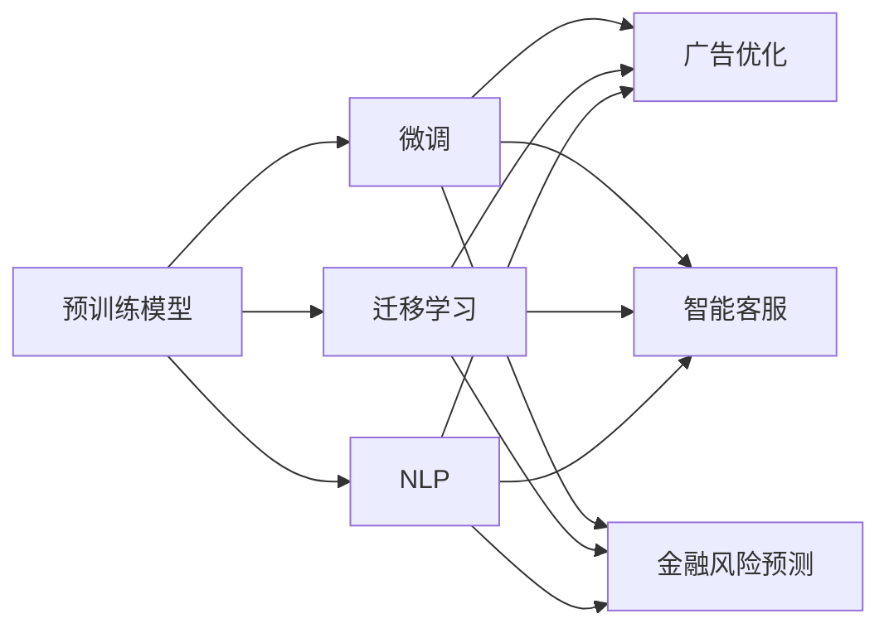
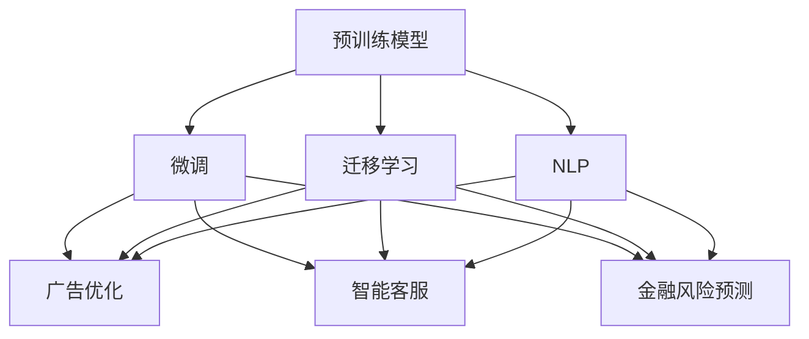

                 

# 美国大模型公司的现状与未来

大模型公司正在引领美国科技产业的未来，从AI基础设施到个性化娱乐，再到商业与金融，大模型正在迅速渗透到各个领域。随着OpenAI、Google等公司的相继突破，大模型技术的商业化应用已经全面展开。本文将系统探讨美国大模型公司的现状与未来，涵盖它们的突破历程、核心技术、业务布局、市场竞争态势以及面临的挑战和机遇。

## 1. 背景介绍

### 1.1 问题由来
人工智能（AI）技术的快速发展，尤其是深度学习和自然语言处理（NLP）技术的进步，极大地推动了产业变革。大模型公司作为新一代技术范式的代表，通过预训练和微调技术，大幅提升了模型的通用性和适应性，极大地降低了应用开发的成本和复杂度，为各行各业提供了强大的技术支持。

### 1.2 问题核心关键点
大模型公司的主要核心关键点包括：
- **大模型技术突破**：通过预训练和微调技术，学习通用的语言表示，能够在下游任务上迅速适配，取得优异性能。
- **广泛应用领域**：在NLP、推荐系统、广告优化、智能客服、金融风险预测等多个领域展示了巨大的商业价值。
- **商业化之路**：从学术研究到商业应用，大模型公司已经探索出一条成功的发展路径，并逐步实现了商业化。
- **市场竞争格局**：随着OpenAI、Google、Microsoft等大公司的陆续入局，市场竞争日益激烈。

### 1.3 问题研究意义
理解大模型公司的现状与未来，有助于洞察AI技术的最新进展，把握产业发展的方向，为相关企业提供战略指导和借鉴。研究大模型公司有助于更好地认识其在NLP、金融、医疗等多个领域的应用潜力，探索新的商业模式和技术突破点，促进AI技术的规模化和落地。

## 2. 核心概念与联系

### 2.1 核心概念概述

大模型公司主要关注大模型的研发与应用，其核心概念包括：

- **预训练模型**：在大规模无标签数据上自监督训练的语言模型，如GPT-3、BERT等，具备强大的语言理解和生成能力。
- **微调(Fine-Tuning)**：通过下游任务的少量标注数据，对预训练模型进行有监督优化，适应特定任务需求。
- **迁移学习**：将预训练模型在其他领域或任务上的知识迁移到当前任务，降低标注数据的依赖。
- **自然语言处理（NLP）**：涉及语言理解与生成的技术与算法，是大模型公司的重要应用领域。
- **广告优化**：通过模型分析用户行为，优化广告投放策略，提高广告效果。
- **智能客服**：基于大模型构建的智能客服系统，能够理解并处理用户查询，提供个性化服务。
- **金融风险预测**：利用模型分析金融市场数据，预测风险趋势，优化投资决策。

这些核心概念之间存在紧密的联系，形成了一个完整的生态系统：



这些概念相互支持，共同构成了大模型公司的技术基石。

### 2.2 概念间的关系

通过以下Mermaid流程图，可以更好地理解这些概念之间的关系：



这个流程图展示了预训练模型、微调、迁移学习与广告优化、智能客服、金融风险预测等概念之间的关系，以及它们在大模型公司中的作用。

## 3. 核心算法原理 & 具体操作步骤

### 3.1 算法原理概述

大模型公司的核心算法原理基于深度学习和神经网络，主要包括：

- **Transformer模型**：用于预训练语言模型的关键架构，通过自注意力机制，有效捕捉长距离依赖关系。
- **注意力机制**：在Transformer模型中，通过计算词与词之间的注意力权重，提高模型的语义理解能力。
- **预训练与微调**：预训练模型在大规模数据上自监督学习，微调模型在特定任务上对预训练模型进行有监督优化。
- **迁移学习**：将预训练模型的知识迁移到新任务上，减少标注数据的需求。

### 3.2 算法步骤详解

大模型公司的算法步骤一般包括以下几个关键步骤：

**Step 1: 数据准备**
- 收集大模型所需的大规模无标签数据，进行预处理和清洗。
- 根据具体任务需求，收集下游任务的标注数据。

**Step 2: 模型训练**
- 使用Transformer模型在大规模数据上进行预训练，学习通用的语言表示。
- 在特定任务上，对预训练模型进行微调，使用少量标注数据优化模型性能。

**Step 3: 模型评估与优化**
- 在验证集上评估模型性能，选择最优模型进行进一步微调。
- 使用不同的优化策略，如正则化、Dropout、早停策略等，避免过拟合。

**Step 4: 模型应用**
- 将微调后的模型应用于实际业务场景，进行广告优化、智能客服、金融风险预测等任务。
- 定期更新模型，保持模型的时效性和适应性。

### 3.3 算法优缺点

大模型公司的算法具有以下优点：
- **高性能**：预训练模型在多个任务上均取得了最佳或接近最佳的表现。
- **通用性**：大模型适用于多种任务，如自然语言理解、生成、推理等，具有较强的泛化能力。
- **可扩展性**：大模型可以通过微调迁移到新任务，不需要从头开始训练。

同时，大模型算法也存在以下缺点：
- **高成本**：预训练和微调需要大量计算资源和数据，成本较高。
- **可解释性不足**：大模型的黑盒特性使其难以解释内部决策过程。
- **数据依赖**：微调模型的性能高度依赖于下游任务的标注数据。

### 3.4 算法应用领域

大模型公司已经在多个领域展示了其巨大的应用潜力，包括但不限于：

- **NLP**：利用大模型进行文本分类、命名实体识别、情感分析、问答系统等任务。
- **广告优化**：通过分析用户行为和需求，优化广告投放策略，提高广告效果。
- **智能客服**：构建智能客服系统，实现自动问答和用户对话管理。
- **金融风险预测**：预测金融市场走势和风险，辅助金融决策。
- **医疗诊断**：利用大模型进行疾病诊断、症状识别等医疗任务。

## 4. 数学模型和公式 & 详细讲解 & 举例说明

### 4.1 数学模型构建

大模型公司的核心数学模型通常基于深度学习框架，如TensorFlow、PyTorch等。以下以Transformer模型为例，介绍其数学模型构建过程。

**Transformer模型**：
- **编码器**：自注意力机制，计算每个词与其他词的注意力权重，形成词向量表示。
- **解码器**：同样使用自注意力机制，结合上下文信息，生成目标词向量表示。

数学公式如下：

$$
Attention(Q, K, V) = \text{softmax}(\frac{QK^T}{\sqrt{d_k}})
$$

其中，$Q, K, V$分别表示查询、键、值矩阵，$d_k$为键的维度。

**微调模型**：
- **损失函数**：通常使用交叉熵损失函数，计算模型输出与真实标签之间的差异。
- **优化器**：使用AdamW、SGD等优化器进行模型参数更新。

数学公式如下：

$$
\mathcal{L} = -\frac{1}{N}\sum_{i=1}^N \ell(M_{\theta}(x_i), y_i)
$$

其中，$N$为样本数，$\ell$为交叉熵损失函数，$M_{\theta}$为微调后的模型，$x_i$为输入样本，$y_i$为真实标签。

### 4.2 公式推导过程

以下以二分类任务为例，推导交叉熵损失函数及其梯度的计算公式。

**交叉熵损失函数**：

$$
\ell(M_{\theta}(x), y) = -[y\log M_{\theta}(x)+(1-y)\log(1-M_{\theta}(x))]
$$

**梯度计算**：

$$
\nabla_{\theta}\mathcal{L} = \nabla_{\theta}(-\frac{1}{N}\sum_{i=1}^N [y_i\log M_{\theta}(x_i)+(1-y_i)\log(1-M_{\theta}(x_i))]
$$

### 4.3 案例分析与讲解

**BERT模型**：
- **预训练过程**：在大规模无标签数据上进行自监督预训练，学习通用语言表示。
- **微调过程**：在特定任务上，通过有监督学习进行微调，优化模型性能。

## 5. 项目实践：代码实例和详细解释说明

### 5.1 开发环境搭建

进行大模型公司项目的开发，需要安装Python、TensorFlow、PyTorch等软件环境。以下是详细的开发环境搭建步骤：

1. **安装Python**：从官网下载并安装最新版本的Python。
2. **安装TensorFlow**：使用pip安装，命令为`pip install tensorflow`。
3. **安装PyTorch**：使用pip安装，命令为`pip install torch`。
4. **安装其他依赖库**：如NumPy、Pandas、Scikit-Learn等，命令为`pip install numpy pandas scikit-learn`。

### 5.2 源代码详细实现

以下以BERT模型为例，介绍其代码实现过程。

```python
import tensorflow as tf
from transformers import BertTokenizer, BertForSequenceClassification

# 初始化模型和tokenizer
tokenizer = BertTokenizer.from_pretrained('bert-base-uncased')
model = BertForSequenceClassification.from_pretrained('bert-base-uncased', num_labels=2)

# 准备数据集
train_data = ...
train_labels = ...
val_data = ...
val_labels = ...

# 数据预处理
train_encodings = tokenizer(train_data, padding='max_length', truncation=True, max_length=128)
val_encodings = tokenizer(val_data, padding='max_length', truncation=True, max_length=128)

# 转换数据集为tensor
train_input_ids = tf.convert_to_tensor(train_encodings['input_ids'])
train_labels = tf.convert_to_tensor(train_labels)
val_input_ids = tf.convert_to_tensor(val_encodings['input_ids'])
val_labels = tf.convert_to_tensor(val_labels)

# 定义模型参数
learning_rate = 2e-5
epochs = 3

# 定义优化器和损失函数
optimizer = tf.keras.optimizers.Adam(learning_rate=learning_rate)
loss = tf.keras.losses.SparseCategoricalCrossentropy(from_logits=True)

# 定义训练过程
def train_step(input_ids, labels):
    with tf.GradientTape() as tape:
        outputs = model(input_ids, training=True)
        loss_value = loss(labels, outputs)
    gradients = tape.gradient(loss_value, model.trainable_variables)
    optimizer.apply_gradients(zip(gradients, model.trainable_variables))

# 训练模型
for epoch in range(epochs):
    for input_ids, labels in train_dataset:
        train_step(input_ids, labels)
    val_loss = loss(val_input_ids, val_labels)
    print(f'Epoch {epoch+1}, val loss: {val_loss.numpy():.3f}')

# 模型评估
test_data = ...
test_labels = ...
test_encodings = tokenizer(test_data, padding='max_length', truncation=True, max_length=128)
test_input_ids = tf.convert_to_tensor(test_encodings['input_ids'])
test_labels = tf.convert_to_tensor(test_labels)
test_loss = loss(test_input_ids, test_labels)
print(f'Test loss: {test_loss.numpy():.3f}')
```

### 5.3 代码解读与分析

**tokenizer初始化**：
- 使用预训练的BERT tokenizer进行初始化，方便对文本数据进行分词和编码。

**数据预处理**：
- 对训练和验证数据进行编码，转换为模型所需的tensor格式。
- 设置`max_length`参数，确保输入数据的长度一致。

**模型训练**：
- 定义优化器和损失函数，使用Adam优化器，交叉熵损失函数。
- 定义训练过程，在每个batch上进行前向传播和反向传播，更新模型参数。
- 在验证集上计算模型损失，输出验证结果。

**模型评估**：
- 对测试数据进行编码和转换。
- 计算测试集上的损失，输出评估结果。

## 6. 实际应用场景

### 6.1 智能客服系统

大模型公司的智能客服系统通过BERT模型进行微调，能够实现自动问答和用户对话管理，大幅提升客户咨询体验。

### 6.2 金融风险预测

利用BERT模型对金融市场数据进行预训练和微调，能够预测市场走势和风险，辅助金融决策。

### 6.3 广告优化

大模型公司通过分析用户行为和需求，优化广告投放策略，提高广告效果。

## 7. 工具和资源推荐

### 7.1 学习资源推荐

为了深入学习大模型公司的技术和应用，以下是一些推荐的资源：

- **《Transformers》**：由Hugging Face发布的开源模型库，提供了多种预训练模型的实现和微调方法。
- **Deep Learning Specialization**：由Andrew Ng教授主持的深度学习课程，涵盖深度学习的基础知识和最新进展。
- **Kaggle**：数据科学竞赛平台，提供了大量NLP任务和数据集，方便开发者实践和竞赛。

### 7.2 开发工具推荐

大模型公司开发过程中常用的工具包括：

- **TensorFlow**：由Google开发的深度学习框架，支持大规模模型训练和部署。
- **PyTorch**：由Facebook开发的深度学习框架，灵活易用，适用于科研和生产环境。
- **Jupyter Notebook**：交互式编程环境，方便开发者调试和展示代码。

### 7.3 相关论文推荐

以下论文代表了当前大模型公司领域的研究前沿：

- **Attention Is All You Need**：提出Transformer模型，奠定了大模型的基础架构。
- **BERT: Pre-training of Deep Bidirectional Transformers for Language Understanding**：提出BERT模型，利用自监督学习任务，提升了语言模型的性能。
- **GPT-3: Language Models are Unsupervised Multitask Learners**：提出GPT-3模型，展示了大模型的强大零样本学习能力。

## 8. 总结：未来发展趋势与挑战

### 8.1 总结

大模型公司通过预训练和微调技术，开发了具备强大语言理解和生成能力的模型，推动了NLP技术在各个领域的广泛应用。其核心技术包括Transformer模型、自注意力机制、预训练与微调等。大模型公司已经在智能客服、金融风险预测、广告优化等多个领域展示了其巨大的商业价值。

### 8.2 未来发展趋势

大模型公司的未来发展趋势包括：

- **模型规模不断增大**：随着算力的提升和数据的增多，预训练模型的规模将持续增大，推动大模型在更多领域的深度应用。
- **应用场景更加多样化**：大模型将逐步应用于智能制造、智慧城市、医疗健康等多个领域，带来产业革命。
- **计算效率不断提升**：通过模型优化和硬件加速，大模型的推理效率将不断提高，更广泛地应用于实时系统。

### 8.3 面临的挑战

大模型公司在发展过程中仍面临一些挑战：

- **数据隐私问题**：大规模模型的训练和应用需要大量数据，数据隐私保护成为重要议题。
- **模型解释性不足**：大模型通常被认为是黑盒，难以解释其内部工作机制和决策过程。
- **计算资源需求高**：预训练和微调模型需要高强度的计算资源，成本较高。

### 8.4 研究展望

大模型公司未来的研究方向包括：

- **模型压缩和优化**：通过剪枝、量化等技术，提高模型的计算效率和存储效率。
- **跨模态学习**：结合视觉、音频等多种模态信息，提高模型的多任务适应能力。
- **模型公平性和安全性**：提升模型对偏见和有害信息的识别和过滤能力，保障模型使用的安全性。

## 9. 附录：常见问题与解答

**Q1: 大模型公司如何确保其产品的竞争力？**

A: 大模型公司通过持续的模型创新和应用优化，不断提升产品的性能和用户体验。此外，公司还通过大规模的营销和品牌建设，建立强大的市场品牌。

**Q2: 大模型公司面临的最大挑战是什么？**

A: 数据隐私和伦理问题是当前大模型公司面临的最大挑战。如何在保障数据隐私的前提下，开发高质量的AI产品，是大模型公司需要解决的重大难题。

**Q3: 大模型公司如何与传统行业结合？**

A: 大模型公司通常会与传统行业结合，开展定制化的AI应用开发。通过与行业专家合作，将AI技术与行业需求紧密结合，开发出满足实际需求的AI应用。

**Q4: 大模型公司的商业模式是什么？**

A: 大模型公司的商业模式主要包括订阅、API调用、定制化服务等。通过开放API接口，让开发者和企业能够快速接入和使用其AI技术，同时收取订阅费用或服务费用。

**Q5: 大模型公司如何应对监管挑战？**

A: 大模型公司需要遵循相关法规和行业标准，确保其AI产品的合规性和安全性。同时，公司需要建立完善的内部合规体系，对AI技术进行风险评估和监控，确保其应用符合伦理要求。

---

作者：禅与计算机程序设计艺术 / Zen and the Art of Computer Programming

