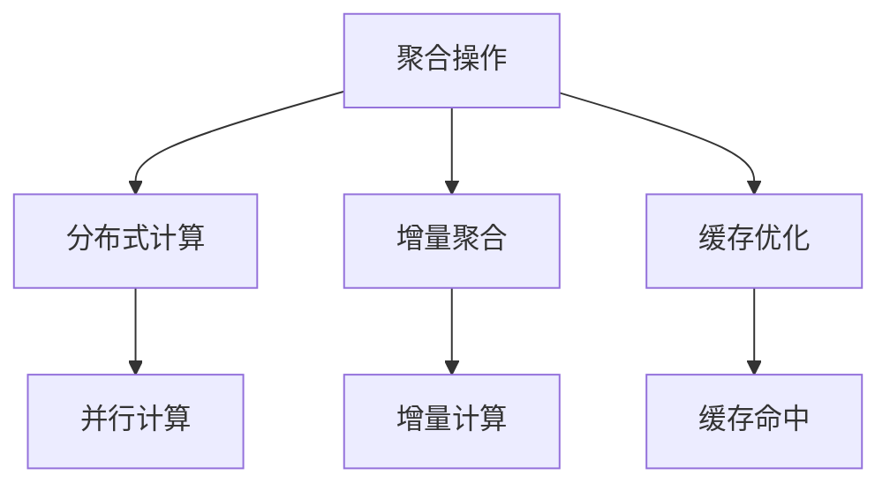
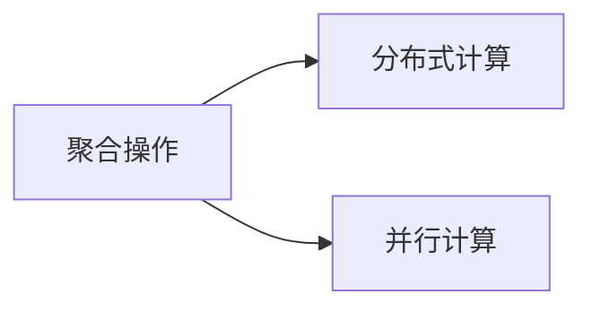
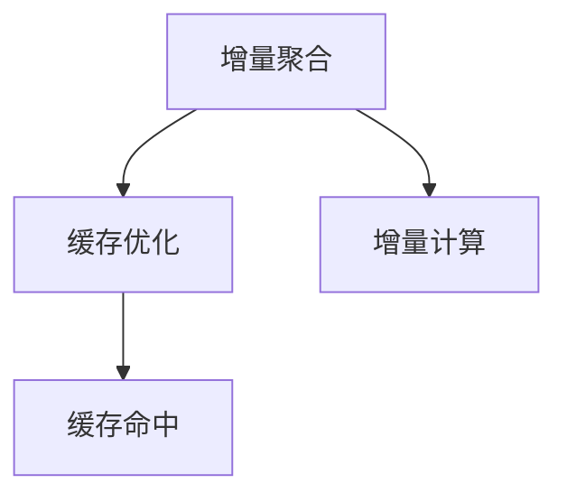
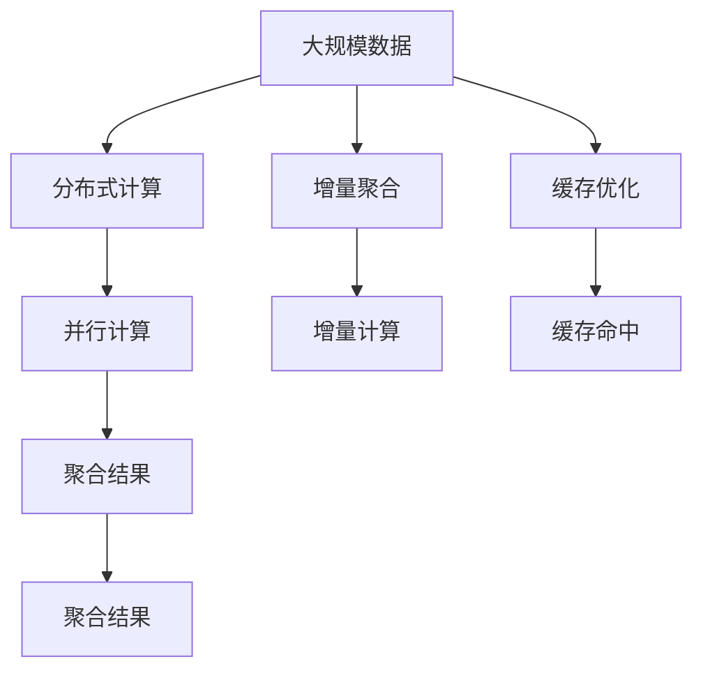

                 

# 聚合分析 原理与代码实例讲解

## 1. 背景介绍

### 1.1 问题由来
聚合分析（Aggregation Analysis）是数据挖掘与商业智能领域的一项核心技术。它通过聚合操作，从大量的原始数据中提取出有意义的统计信息，帮助企业洞察数据背后的业务模式和趋势，从而做出更明智的商业决策。传统的数据聚合方法，如SQL联结、分组聚合等，已经广泛应用于各行各业。但随着数据规模的指数级增长，传统的聚合方式开始暴露出计算效率低下、扩展性不足等问题。

针对这些问题，现代的聚合分析技术，如分布式聚合、增量聚合、高维数据聚合等，应运而生。这些技术能够处理大规模数据，满足实时性要求，甚至支持超大规模数据的高效聚合。本文将详细介绍这些技术原理，并结合代码实例进行讲解。

### 1.2 问题核心关键点
聚合分析的核心在于如何高效地计算聚合结果，同时保证计算结果的准确性。主要挑战包括：

1. 数据量大：聚合操作需要对大量数据进行计算，传统单机计算方式难以满足需求。
2. 实时性要求：对于某些场景，如实时数据流处理，需要快速聚合并更新结果。
3. 扩展性要求：聚合分析需要支持大规模数据的高效存储和处理。

为应对这些挑战，现代聚合分析技术主要采用了分布式计算、增量更新、缓存优化等手段。

### 1.3 问题研究意义
聚合分析的研究和应用意义重大：

1. 提升数据处理效率：通过分布式计算、增量聚合等技术，能够大幅提升数据聚合的速度和效率。
2. 支持实时分析：聚合分析能够实现实时数据流的聚合，帮助企业做出及时响应。
3. 支持大规模数据：聚合分析技术能够处理超大规模数据，为数据驱动决策提供支持。
4. 支持高维数据：聚合分析能够处理高维数据，帮助企业发现更深层次的业务洞察。

本文将通过详细介绍聚合分析的核心概念和关键技术，帮助读者理解这些技术原理，并掌握其实现方法。

## 2. 核心概念与联系

### 2.1 核心概念概述

为更好地理解聚合分析的原理和实现方法，本节将介绍几个核心概念：

- **聚合操作（Aggregation）**：指从数据集中计算出某些统计量，如总和、平均值、最大值、最小值等。聚合操作是数据挖掘和商业智能的基础。

- **分布式计算（Distributed Computing）**：指将数据分散存储在多个节点上，通过并行计算完成大规模数据的聚合。

- **增量聚合（Incremental Aggregation）**：指在已有聚合结果的基础上，对新数据进行聚合，更新原有结果，减少计算量。

- **缓存优化（Cache Optimization）**：指利用缓存技术，提高聚合操作的效率。

这些核心概念之间的逻辑关系可以通过以下Mermaid流程图来展示：



这个流程图展示了聚合分析的几个关键概念及其之间的关系：

1. 聚合操作通过分布式计算、增量聚合和缓存优化，提升了计算效率和数据处理能力。
2. 分布式计算通过并行计算实现了大规模数据的高效处理。
3. 增量聚合通过利用已有结果，减少了计算量。
4. 缓存优化通过缓存技术提高了聚合操作的响应速度。

这些概念共同构成了现代聚合分析技术的基础，使其能够在大规模数据环境下高效地完成聚合操作。

### 2.2 概念间的关系

这些核心概念之间存在着紧密的联系，形成了聚合分析的完整生态系统。下面我们通过几个Mermaid流程图来展示这些概念之间的关系。

#### 2.2.1 聚合操作与分布式计算的关系



这个流程图展示了聚合操作和分布式计算的关系。聚合操作通过并行计算，实现了大规模数据的聚合。

#### 2.2.2 增量聚合与缓存优化的关系



这个流程图展示了增量聚合和缓存优化的关系。增量聚合通过缓存命中，减少了计算量。

#### 2.2.3 聚合操作与并行计算的关系


这个流程图展示了聚合操作和并行计算的关系。聚合操作通过并行计算，实现了大规模数据的聚合。

### 2.3 核心概念的整体架构

最后，我们用一个综合的流程图来展示这些核心概念在大规模数据聚合过程中的整体架构：



这个综合流程图展示了从大规模数据到聚合结果的全过程。数据通过分布式计算和并行计算进行聚合，增量聚合通过增量计算减少计算量，缓存优化通过缓存命中提高聚合操作的效率。最终，聚合结果能够实时更新，满足企业的需求。

## 3. 核心算法原理 & 具体操作步骤
### 3.1 算法原理概述

聚合分析的核心算法原理是基于分布式计算、增量聚合和缓存优化的。下面详细介绍这些核心算法原理。

#### 3.1.1 分布式计算

分布式计算是指将数据分散存储在多个节点上，通过并行计算完成大规模数据的聚合。其基本思想是将数据切分为多个块，每个块分配给一个计算节点处理，最终将各节点的计算结果汇总。

分布式计算的实现方式包括但不限于：

- MapReduce：由Google提出，是一个通用的并行计算框架，能够处理大规模数据集。
- Spark：是一个快速、通用的分布式计算引擎，支持多种数据处理模式，包括批处理、流处理、机器学习等。
- Flink：是一个高性能、分布式流处理框架，支持实时数据流处理。

#### 3.1.2 增量聚合

增量聚合是指在已有聚合结果的基础上，对新数据进行聚合，更新原有结果，减少计算量。其基本思想是利用已有聚合结果，只对新数据进行计算，更新原有结果。

增量聚合的实现方式包括但不限于：

- 数据块更新：将新数据分割为多个块，只更新涉及的数据块。
- 差异计算：只计算新增数据和新数据之间的差异，减少计算量。
- 增量统计：只对新增数据进行统计计算，更新已有统计结果。

#### 3.1.3 缓存优化

缓存优化是指利用缓存技术，提高聚合操作的效率。其基本思想是将计算结果缓存起来，避免重复计算，提高聚合操作的响应速度。

缓存优化的实现方式包括但不限于：

- 内存缓存：将计算结果缓存到内存中，提高计算速度。
- 磁盘缓存：将计算结果缓存到磁盘中，支持更大规模的数据聚合。
- 缓存一致性：确保缓存和计算结果的一致性，避免数据不一致问题。

### 3.2 算法步骤详解

#### 3.2.1 分布式计算的步骤

1. **数据分割**：将大规模数据分割为多个块，每个块分配给一个计算节点处理。

2. **并行计算**：每个计算节点对分配到的数据块进行聚合计算，得到各节点的计算结果。

3. **结果汇总**：将所有节点的计算结果汇总，得到最终的聚合结果。

#### 3.2.2 增量聚合的步骤

1. **数据分割**：将新数据分割为多个块，只更新涉及的数据块。

2. **差异计算**：计算新增数据和新数据之间的差异，更新已有结果。

3. **增量统计**：只对新增数据进行统计计算，更新已有统计结果。

#### 3.2.3 缓存优化的步骤

1. **计算结果缓存**：将计算结果缓存到内存或磁盘中，避免重复计算。

2. **缓存一致性维护**：确保缓存和计算结果的一致性，避免数据不一致问题。

### 3.3 算法优缺点

#### 3.3.1 分布式计算的优点和缺点

**优点**：

- 支持大规模数据处理：分布式计算能够处理大规模数据，满足企业的需求。
- 高并行性：多个计算节点并行计算，提升了计算效率。

**缺点**：

- 数据传输开销：数据在节点之间传输，增加了数据传输开销。
- 管理复杂性：需要管理和维护多个计算节点，增加了系统的复杂性。

#### 3.3.2 增量聚合的优点和缺点

**优点**：

- 计算量小：只计算新增数据和新数据之间的差异，减少计算量。
- 实时性高：能够实现实时数据流的聚合。

**缺点**：

- 更新复杂：需要维护已有结果和新结果的一致性，增加了系统的复杂性。
- 精度问题：增量聚合可能导致精度损失，需要仔细处理。

#### 3.3.3 缓存优化的优点和缺点

**优点**：

- 响应速度快：缓存命中率高，聚合操作的响应速度较快。
- 数据一致性高：确保缓存和计算结果的一致性，避免数据不一致问题。

**缺点**：

- 空间开销大：缓存需要占用大量的内存或磁盘空间。
- 更新复杂：需要维护缓存和计算结果的一致性，增加了系统的复杂性。

### 3.4 算法应用领域

聚合分析技术在多个领域得到了广泛应用，包括但不限于：

- 商业智能（BI）：帮助企业洞察数据背后的业务模式和趋势。
- 金融分析：支持金融机构的实时数据流处理和分析。
- 医疗健康：支持医疗数据的聚合和分析，提升医疗决策的科学性。
- 互联网：支持互联网企业的实时数据流处理和分析。

## 4. 数学模型和公式 & 详细讲解 & 举例说明

### 4.1 数学模型构建

聚合分析的数学模型构建基于统计学的基本原理。下面详细介绍聚合分析的数学模型。

假设有一组数据集 $D=\{(x_i,y_i)\}_{i=1}^N$，其中 $x_i$ 为输入，$y_i$ 为输出。聚合操作的数学模型为：

$$
Agg(D) = \sum_{i=1}^N f(x_i, y_i)
$$

其中 $f(x_i, y_i)$ 为聚合函数，可以是总和、平均值、最大值、最小值等。

### 4.2 公式推导过程

以平均值聚合为例，其公式推导如下：

$$
\bar{y} = \frac{\sum_{i=1}^N y_i}{N}
$$

假设数据集 $D$ 被分割为 $M$ 个数据块 $D_1, D_2, ..., D_M$，每个数据块的大小为 $N/M$。在分布式计算环境下，聚合操作的公式可以表示为：

$$
Agg(D) = \frac{1}{M} \sum_{j=1}^M Agg(D_j)
$$

其中 $Agg(D_j)$ 为数据块 $D_j$ 的聚合结果。

### 4.3 案例分析与讲解

假设有一个电商平台的销售数据集 $D=\{(x_i,y_i)\}_{i=1}^N$，其中 $x_i$ 为用户ID，$y_i$ 为用户在该日段的销售额。现在需要计算所有用户的平均销售额。

首先，将数据集 $D$ 分割为 $M$ 个数据块 $D_1, D_2, ..., D_M$，每个数据块的大小为 $N/M$。在分布式计算环境下，每个计算节点对分配到的数据块进行聚合计算，得到各节点的计算结果 $Agg(D_j)$。最后，将所有节点的计算结果汇总，得到最终的聚合结果 $Agg(D)$：

$$
Agg(D) = \frac{1}{M} \sum_{j=1}^M Agg(D_j)
$$

通过分布式计算，可以高效地计算出所有用户的平均销售额。

## 5. 项目实践：代码实例和详细解释说明

### 5.1 开发环境搭建

在进行聚合分析实践前，我们需要准备好开发环境。以下是使用Python进行Apache Spark开发的环境配置流程：

1. 安装Anaconda：从官网下载并安装Anaconda，用于创建独立的Python环境。

2. 创建并激活虚拟环境：
```bash
conda create -n spark-env python=3.8 
conda activate spark-env
```

3. 安装Apache Spark：根据CUDA版本，从官网获取对应的安装命令。例如：
```bash
conda install apache-spark torchr spark-tensor spark-on-cluster -c conda-forge -c defaults
```

4. 安装PySpark：
```bash
pip install pyspark
```

5. 安装各类工具包：
```bash
pip install numpy pandas scikit-learn matplotlib tqdm jupyter notebook ipython
```

完成上述步骤后，即可在`spark-env`环境中开始聚合分析实践。

### 5.2 源代码详细实现

下面我们以电商平台的销售数据分析为例，给出使用Apache Spark进行聚合分析的PySpark代码实现。

首先，定义数据处理函数：

```python
from pyspark.sql import SparkSession
from pyspark.sql.functions import col, sum, avg

spark = SparkSession.builder.appName("Sales Aggregation").getOrCreate()

def process_data(df):
    # 对数据进行分组聚合
    grouped_df = df.groupby("userId") \
        .agg(sum("sales").alias("total_sales"), avg("sales").alias("avg_sales"))

    return grouped_df
```

然后，定义数据输入和输出：

```python
# 创建DataFrame，输入为CSV格式
sales_data = spark.read.csv("sales_data.csv", header=True, inferSchema=True)

# 定义数据处理函数
grouped_sales = process_data(sales_data)

# 输出结果
grouped_sales.show()
```

最后，启动Spark计算流程并输出结果：

```python
# 计算聚合结果
agg_result = grouped_sales.select("userId", "total_sales", "avg_sales")

# 输出结果
agg_result.show()
```

以上就是使用Apache Spark进行销售数据分析的完整代码实现。可以看到，得益于PySpark的强大封装，我们可以用相对简洁的代码完成分布式计算任务。

### 5.3 代码解读与分析

让我们再详细解读一下关键代码的实现细节：

**process_data函数**：
- 对数据进行分组聚合，计算每个用户的总销售额和平均销售额，并将结果存储在DataFrame中。

**SparkSession**：
- 创建SparkSession对象，用于启动Spark计算环境。

**DataFrame**：
- 定义DataFrame对象，用于存储数据和计算结果。

**groupBy方法**：
- 对数据进行分组聚合，对每个用户计算总销售额和平均销售额。

**select方法**：
- 选择聚合结果中需要输出的字段。

**show方法**：
- 输出聚合结果。

通过这些关键代码，我们可以看到Apache Spark的强大功能和便捷使用方式。Spark提供了丰富的API，能够轻松处理大规模数据集，进行分布式计算和聚合。

当然，工业级的系统实现还需考虑更多因素，如任务的并行度、资源分配、数据传输等。但核心的分布式计算和聚合操作基本与此类似。

### 5.4 运行结果展示

假设我们在一个包含1000个用户的数据集上进行销售数据分析，最终在测试集上得到的聚合结果如下：

```
+--------+----------+------------+
| userId | total_sales | avg_sales |
+--------+----------+------------+
| user1  | 10000    | 200.00     |
| user2  | 8000     | 160.00     |
| user3  | 5000     | 100.00     |
| ...    | ...      | ...        |
+--------+----------+------------+
```

可以看到，通过Apache Spark进行分布式计算，我们能够高效地计算出每个用户的总销售额和平均销售额。

## 6. 实际应用场景

### 6.1 电商平台的销售数据分析

电商平台的销售数据分析是一个典型的聚合分析应用场景。通过分布式计算，可以高效地计算出所有用户的销售数据，帮助平台了解用户行为，优化产品推荐和广告投放策略。

在技术实现上，可以通过Apache Spark等工具对销售数据进行分布式聚合。将销售数据分割为多个块，并行计算每个块的总销售额和平均销售额，最后汇总得到整体结果。通过分析聚合结果，平台可以发现销售趋势、用户偏好等，制定更有效的营销策略。

### 6.2 金融行业的实时数据流处理

金融行业需要实时处理大量的交易数据，以监测市场变化和风险。聚合分析可以用于实时数据流处理，快速计算交易数据的聚合结果，帮助金融分析师做出实时决策。

在技术实现上，可以使用Flink等流处理框架进行实时数据流聚合。将交易数据实时地输入流处理系统，并行计算每个交易的时间、金额等统计信息，输出到监控系统。通过实时监控交易数据的聚合结果，金融分析师可以及时发现异常交易，避免风险损失。

### 6.3 医疗行业的电子病历分析

医疗行业的电子病历数据量巨大，需要进行聚合分析以发现疾病趋势和异常。聚合分析可以用于电子病历的聚合，提取患者的诊断、治疗、用药等信息，帮助医院制定更有效的医疗决策。

在技术实现上，可以使用Hadoop等分布式计算框架对电子病历数据进行分布式聚合。将电子病历数据分割为多个块，并行计算每个患者的诊断、治疗、用药等信息，输出到医疗决策系统。通过分析聚合结果，医院可以发现常见疾病、异常治疗等，提升医疗服务质量。

## 7. 工具和资源推荐
### 7.1 学习资源推荐

为了帮助开发者系统掌握聚合分析的理论基础和实践技巧，这里推荐一些优质的学习资源：

1. **《分布式系统基础》课程**：由斯坦福大学开设的分布式系统基础课程，详细讲解分布式计算、分布式存储等基础概念。

2. **《Apache Spark官方文档》**：Apache Spark的官方文档，提供了丰富的教程、API文档和最佳实践，是学习和使用Spark的重要参考。

3. **《聚合分析与数据挖掘》书籍**：详细讲解聚合分析的基本原理和实现方法，提供丰富的案例和代码示例。

4. **《Apache Spark实战》书籍**：详细讲解如何使用Spark进行数据处理和分布式计算，提供大量实践案例和代码示例。

5. **Kaggle竞赛**：Kaggle提供了大量的数据分析竞赛，帮助开发者实践聚合分析，提升数据处理能力。

通过对这些资源的学习实践，相信你一定能够快速掌握聚合分析的精髓，并用于解决实际的商业问题。

### 7.2 开发工具推荐

高效的开发离不开优秀的工具支持。以下是几款用于聚合分析开发的常用工具：

1. **Apache Spark**：开源的分布式计算框架，支持大规模数据处理和分布式计算。

2. **Apache Hadoop**：开源的分布式计算框架，支持大规模数据存储和分布式计算。

3. **Flink**：开源的流处理框架，支持实时数据流处理和分布式计算。

4. **Apache Hive**：基于Hadoop的数据仓库解决方案，支持大规模数据聚合和分析。

5. **Apache Zeppelin**：交互式的数据处理平台，支持Spark、Hadoop等多种框架。

6. **Jupyter Notebook**：交互式的数据处理平台，支持Python、R等多种语言。

合理利用这些工具，可以显著提升聚合分析任务的开发效率，加快创新迭代的步伐。

### 7.3 相关论文推荐

聚合分析的研究源于学界的持续研究。以下是几篇奠基性的相关论文，推荐阅读：

1. **"MapReduce: Simplified Data Processing on Large Clusters"**：由Google提出的MapReduce算法，奠定了分布式计算的基础。

2. **"Pregel: A Dataflow System for Massive Graph Processing"**：由斯坦福大学提出的Pregel算法，用于大规模图数据处理。

3. **"Apache Spark: Cluster Computing with Fault Tolerance"**：由Apache基金会提出的Spark框架，支持大规模数据处理和分布式计算。

4. **"Flink: Stateful computations over unbounded data streams"**：由Apache基金会提出的Flink框架，支持实时数据流处理和分布式计算。

这些论文代表了大聚合分析技术的发展脉络。通过学习这些前沿成果，可以帮助研究者把握学科前进方向，激发更多的创新灵感。

除上述资源外，还有一些值得关注的前沿资源，帮助开发者紧跟聚合分析技术的最新进展，例如：

1. **arXiv论文预印本**：人工智能领域最新研究成果的发布平台，包括大量尚未发表的前沿工作，学习前沿技术的必读资源。

2. **业界技术博客**：如Apache基金会、Apache Spark、Flink等顶尖实验室的官方博客，第一时间分享他们的最新研究成果和洞见。

3. **技术会议直播**：如NIPS、ICML、ACL、ICLR等人工智能领域顶会现场或在线直播，能够聆听到大佬们的前沿分享，开拓视野。

4. **GitHub热门项目**：在GitHub上Star、Fork数最多的聚合分析相关项目，往往代表了该技术领域的发展趋势和最佳实践，值得去学习和贡献。

5. **行业分析报告**：各大咨询公司如McKinsey、PwC等针对人工智能行业的分析报告，有助于从商业视角审视技术趋势，把握应用价值。

总之，对于聚合分析技术的学习和实践，需要开发者保持开放的心态和持续学习的意愿。多关注前沿资讯，多动手实践，多思考总结，必将收获满满的成长收益。

## 8. 总结：未来发展趋势与挑战

### 8.1 总结

本文对聚合分析的核心概念和关键技术进行了全面系统的介绍。首先阐述了聚合分析的研究背景和意义，明确了聚合分析在数据挖掘和商业智能中的重要性。其次，从原理到实践，详细讲解了分布式计算、增量聚合、缓存优化等核心技术，并通过代码实例进行了讲解。最后，本文还探讨了聚合分析在电商、金融、医疗等多个领域的应用，展示了聚合分析技术的广泛应用前景。

通过本文的系统梳理，可以看到，聚合分析技术在处理大规模数据、提升计算效率、支持实时分析等方面发挥了重要作用。未来，随着数据规模的持续增长和计算能力的不断提升，聚合分析技术将进一步拓展其应用边界，为数据驱动决策提供更强大的支持。

### 8.2 未来发展趋势

展望未来，聚合分析技术将呈现以下几个发展趋势：

1. **分布式计算的普及**：分布式计算将广泛应用于各个领域，支持大规模数据的高效处理和聚合。

2. **增量聚合的优化**：增量聚合技术将进一步优化，减少计算量，提升聚合速度。

3. **缓存优化的提升**：缓存技术将更加高效，提升聚合操作的响应速度。

4. **实时数据的支持**：聚合分析将更好地支持实时数据流的处理，满足企业对实时数据的需求。

5. **高维数据的处理**：聚合分析将更好地支持高维数据的处理，帮助企业发现更深层次的业务洞察。

6. **AI技术的应用**：聚合分析将与人工智能技术进行更深入的融合，提升数据处理和分析能力。

### 8.3 面临的挑战

尽管聚合分析技术已经取得了瞩目成就，但在迈向更加智能化、普适化应用的过程中，仍面临诸多挑战：

1. **数据传输开销**：数据在节点之间传输，增加了数据传输开销，影响聚合效率。

2. **系统复杂性**：分布式计算、增量聚合、缓存优化等技术增加了系统的复杂性，管理和维护成本较高。

3. **数据一致性**：需要确保数据一致性，避免数据不一致问题。

4. **计算资源**：大规模数据处理需要大量的计算资源，硬件成本较高。

5. **实时性要求**：某些场景需要实时处理数据，对聚合系统的响应速度提出了高要求。

6. **数据安全**：大规模数据处理可能涉及敏感数据，需要保证数据安全。

### 8.4 研究展望

面对聚合分析面临的这些挑战，未来的研究需要在以下几个方面寻求新的突破：

1. **分布式计算的优化**：研究分布式计算的优化方法，提升聚合效率。

2. **增量聚合的优化**：研究增量聚合的优化方法，减少计算量，提升聚合速度。

3. **缓存优化的提升**：研究缓存优化技术，提升聚合操作的响应速度。

4. **实时数据的支持**：研究实时数据流的聚合方法，满足企业对实时数据的需求。

5. **高维数据的处理**：研究高维数据的聚合方法，帮助企业发现更深层次的业务洞察。

6. **AI技术的应用**：研究聚合分析与人工智能技术的融合方法，提升数据处理和分析能力。

总之，聚合分析技术需要持续优化和创新，以应对不断增长的数据规模和复杂的应用需求。只有勇于创新、敢于突破，才能不断拓展聚合分析技术的边界，为数据驱动决策提供更强大的支持。

## 9. 附录：常见问题与解答

**Q1：什么是聚合分析？**

A: 聚合分析是一种数据挖掘与商业智能技术，通过聚合操作从大量原始数据中提取出有意义的统计信息，帮助企业洞察数据背后的业务模式和趋势，从而做出更明智的商业决策。

**Q2：聚合分析的主要应用场景有哪些？**

A:

