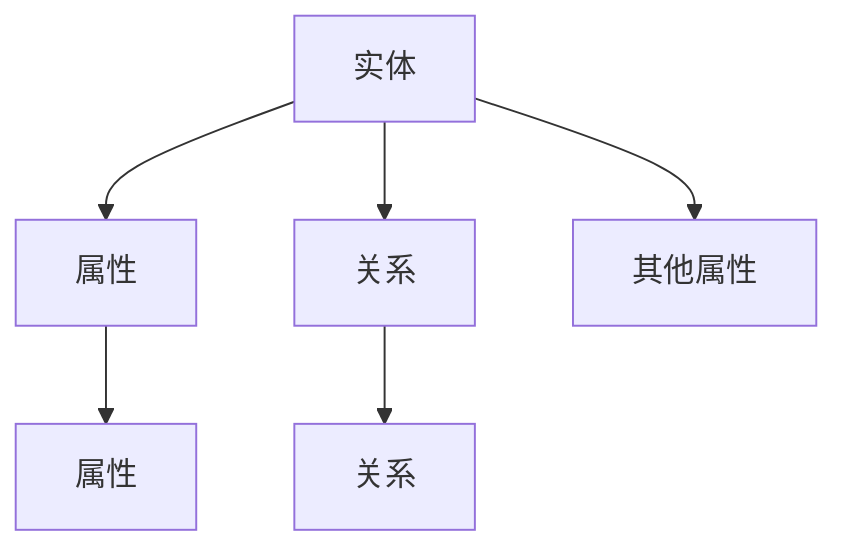

                 

# 知识表示与知识图谱原理与代码实战案例讲解

## 1. 背景介绍

### 1.1 问题由来
在现代信息技术飞速发展的背景下，人类知识结构日益庞大，传统的数据表示方式已难以适应知识管理的复杂性。随着人工智能、大数据技术的应用，知识表示和知识图谱（Knowledge Graph）的概念逐渐兴起，成为连接计算机与人类知识的重要桥梁。知识图谱通过结构化的形式组织知识，并赋予机器理解和推理能力，为智能决策、推荐系统、自然语言处理等领域带来了巨大的提升。

知识图谱的核心理念是利用图结构对知识进行表示和组织，即将知识描述成一系列实体和关系（节点和边），并构建起一个高度关联的知识网络。这种结构化的表示方式不仅便于知识存储、检索和推理，还能使机器更容易理解和处理复杂的知识场景。

### 1.2 问题核心关键点
知识图谱的核心问题在于如何高效地构建和维护知识图谱，以及如何通过图谱进行有效的知识查询、推理和应用。构建知识图谱的关键在于数据的获取和处理，推理解释和应用则依赖于图谱的查询算法和推理引擎。

具体而言，主要包括以下几个关键点：
- 数据源整合：整合来自不同数据源的知识，进行清洗和标准化，构建统一的知识库。
- 知识抽取与推理：通过NLP和规则等方法，从文本数据中抽取实体和关系，并进行推理和验证。
- 图谱嵌入与训练：将知识嵌入到向量空间中，利用深度学习模型进行训练，提高图谱的表示能力和推理效率。
- 图谱应用与评估：基于图谱构建应用系统，如推荐、问答等，并对其进行性能评估和优化。

### 1.3 问题研究意义
知识图谱的研究和应用，对于提高信息检索效率、推动人工智能发展、促进知识管理等方面具有重要意义。

1. **提高信息检索效率**：通过结构化的知识图谱，可以更快地检索到相关信息，减少搜索引擎的工作负担，提高用户检索的准确性和满意度。
2. **推动人工智能发展**：知识图谱是智能决策、自然语言处理、机器学习等AI应用的基础，为其提供了更丰富的背景知识。
3. **促进知识管理**：知识图谱可以更好地组织和管理海量知识，使其更容易被人类理解和利用。
4. **降低信息获取成本**：自动化地从大量文本中抽取知识和建立图谱，大幅降低了人工标注和知识获取的成本。
5. **支持多领域应用**：知识图谱在医疗、教育、金融、零售等多个领域都有广泛的应用，极大地提升了各行业的智能化水平。

## 2. 核心概念与联系

### 2.1 核心概念概述

知识图谱的核心概念主要包括：

- **实体(Entity)**：指可以独立存在的事物或概念，如人名、地名、组织名等。
- **属性(Property)**：描述实体的特定特征或属性，如年龄、性别、职业等。
- **关系(Relation)**：实体之间的关系，如“是”、“属于”、“在”等。
- **图谱(Graph)**：由实体、属性和关系构成的一个有向图，表示实体间的复杂关系网络。

这些核心概念共同构成了知识图谱的基本框架，通过实体-关系-属性（RDF）的三元组形式进行表示，即$(实体, 关系, 属性)$。

### 2.2 核心概念间的关系

知识图谱的各核心概念之间存在紧密的联系，如图：



这个图展示了实体-属性-关系之间的关系。实体可以具有多个属性，属性之间可以通过关系进行连接，实体间的关系也可以通过属性来表示。这种多维度的关系表示方式，使得知识图谱具有强大的表达能力和推理能力。

### 2.3 核心概念的整体架构

知识图谱的整体架构可以表示为：


这个架构展示了从数据源到最终的知识图谱，涉及数据整合、知识抽取、知识推理、知识表示等多个环节，每个环节都为最终的知识图谱构建提供了重要支持。

## 3. 核心算法原理 & 具体操作步骤
### 3.1 算法原理概述

知识图谱的核心算法包括知识抽取、知识推理和知识表示三个部分。其中，知识抽取通过NLP技术从文本中抽取实体和关系，知识推理通过逻辑和推理机制对知识进行验证和扩展，知识表示则通过图结构将知识进行组织和存储。

- **知识抽取**：将非结构化的文本数据转换为结构化的知识表示，是构建知识图谱的基础。
- **知识推理**：利用图结构对知识进行推理和验证，扩展知识图谱的内容和深度。
- **知识表示**：将知识图谱中的实体、属性和关系进行图形化的表示，便于存储和查询。

### 3.2 算法步骤详解

知识图谱的构建和应用，主要分为以下几个步骤：

**Step 1: 数据源整合**
- 收集来自不同数据源的知识，如维基百科、新闻、论文等，进行清洗和标准化处理，构建统一的知识库。

**Step 2: 知识抽取**
- 利用NLP技术从文本中抽取实体和关系，可以使用规则、词典、统计方法等手段。
- 构建知识三元组，如$(实体1, 关系, 实体2)$，进行初步的知识存储。

**Step 3: 知识推理**
- 构建推理规则和逻辑模型，如描述逻辑、一阶逻辑等，对知识进行验证和扩展。
- 通过推理机制，对知识进行推导，填补知识图谱的空白。

**Step 4: 知识表示**
- 将知识图谱中的实体、属性和关系进行图形化表示，构建起知识图谱。
- 使用图形数据库（如Neo4j）或传统的关系型数据库（如MySQL）存储和管理知识图谱。

**Step 5: 图谱应用**
- 构建应用系统，如推荐系统、问答系统等，利用知识图谱进行决策和推理。
- 对应用系统进行性能评估和优化，提高系统的准确性和效率。

### 3.3 算法优缺点

知识图谱的优点包括：
- 结构化表示：知识图谱将知识表示为图形化的结构，便于存储和查询。
- 推理能力：通过推理机制，知识图谱可以自动扩展和验证知识，提高信息的准确性。
- 多领域应用：知识图谱在医疗、教育、金融等多个领域都有广泛的应用，推动各行业的智能化进程。

知识图谱的缺点包括：
- 数据源依赖：构建知识图谱需要大量的数据，对数据源的依赖较大。
- 复杂度高：知识图谱的构建和维护较为复杂，需要大量的时间和资源。
- 扩展性差：传统知识图谱的扩展性较差，难以应对不断变化的知识场景。

### 3.4 算法应用领域

知识图谱的应用领域非常广泛，主要包括：

- 信息检索与推荐：利用知识图谱进行信息检索和推荐，提高系统的准确性和用户体验。
- 自然语言处理：知识图谱为自然语言处理提供了丰富的背景知识，提高了NLP任务的性能。
- 医疗诊断：知识图谱可以帮助医生快速查询疾病相关信息，辅助诊断和治疗。
- 金融风控：通过构建金融知识图谱，进行风险评估和信用评分，提高金融决策的准确性。
- 智能客服：利用知识图谱进行问题解答和客户引导，提高客服系统的智能化水平。

## 4. 数学模型和公式 & 详细讲解 & 举例说明

### 4.1 数学模型构建

知识图谱的数学模型可以通过RDF（Resource Description Framework）进行表示，其中实体表示为$e$，属性表示为$r$，值为$o$，三元组表示为$(e, r, o)$。

### 4.2 公式推导过程

以医疗知识图谱为例，进行公式推导和讲解。

假设有一个医疗知识图谱，其中包含以下实体和关系：

- 实体：张三、李四、医院、病种、治疗方案等。
- 关系：就诊、治疗、疾病、住院、出院等。

其中，$(e, r, o)$表示为：$(张三, 就诊, 医院)$，表示张三在某个医院就诊。

### 4.3 案例分析与讲解

假设需要构建一个推荐系统，推荐合适的治疗方案。可以通过以下步骤进行：

**Step 1: 数据预处理**
- 收集患者的病历记录，提取实体和关系，构建初步的知识图谱。

**Step 2: 知识抽取**
- 利用NLP技术从病历记录中抽取实体和关系，如张三、医院、病种、治疗方案等。

**Step 3: 知识推理**
- 构建推理规则，如“若病种为某种疾病，则可能的治疗方案包括A、B、C等”。
- 利用规则进行推理，如“张三的病种为某种疾病，则推荐A、B、C等治疗方案”。

**Step 4: 知识表示**
- 将推理结果存储到知识图谱中，构建完整的知识图谱。

**Step 5: 图谱应用**
- 构建推荐系统，利用知识图谱进行推荐，提高推荐系统的准确性和个性化程度。

## 5. 项目实践：代码实例和详细解释说明

### 5.1 开发环境搭建

1. 安装Python环境，推荐使用Anaconda或Miniconda。
2. 安装必要的依赖库，如NLTK、spaCy、Stanford CoreNLP等。
3. 配置好NLP工具，如NLTK、spaCy，进行实体识别、关系抽取等。
4. 搭建好图谱存储数据库，如Neo4j或MySQL。

### 5.2 源代码详细实现

以下是构建医疗知识图谱的示例代码，包括数据预处理、知识抽取、知识推理和知识表示。

```python
# 数据预处理
import pandas as pd
import nltk
from nltk.corpus import stopwords
from nltk.tokenize import word_tokenize, sent_tokenize
from nltk.stem import WordNetLemmatizer

def preprocess(text):
    # 去除停用词和标点
    stop_words = set(stopwords.words('english'))
    lemmatizer = WordNetLemmatizer()
    cleaned_text = []
    for sentence in sent_tokenize(text):
        tokens = word_tokenize(sentence)
        tokens = [lemmatizer.lemmatize(token.lower()) for token in tokens if token.lower() not in stop_words and not token.isspace()]
        cleaned_text.append(tokens)
    return cleaned_text

# 知识抽取
import spacy

def extract_knowledge(texts, model):
    knowledge = {}
    for text in texts:
        doc = model(text)
        for entity in doc.ents:
            if entity.label_ not in knowledge:
                knowledge[entity.label_] = []
            knowledge[entity.label_].append(entity.text)
    return knowledge

# 知识推理
from py2neo import Graph, Node, Relationship

graph = Graph('http://localhost:7474/db/data')

def add_node(entity, label):
    if label not in graph.exists(node=Label(label)):
        graph.create(node=Node(label, name=entity))

def add_relation(source, relation, target):
    source_node = graph.find_one('Node', {'name': source})
    target_node = graph.find_one('Node', {'name': target})
    if source_node and target_node:
        graph.create(Relationship(source_node, relation, target_node))

def build_kg(texts):
    model = spacy.load('en_core_web_sm')
    knowledge = extract_knowledge(texts, model)
    for label, entities in knowledge.items():
        for entity in entities:
            add_node(entity, label)
            for other_entity in entities:
                if other_entity != entity:
                    add_relation(entity, '有关系', other_entity)

# 知识表示
from py2neo import Graph, Node, Relationship

graph = Graph('http://localhost:7474/db/data')

def add_node(entity, label):
    if label not in graph.exists(node=Label(label)):
        graph.create(node=Node(label, name=entity))

def add_relation(source, relation, target):
    source_node = graph.find_one('Node', {'name': source})
    target_node = graph.find_one('Node', {'name': target})
    if source_node and target_node:
        graph.create(Relationship(source_node, relation, target_node))

def build_kg(texts):
    model = spacy.load('en_core_web_sm')
    knowledge = extract_knowledge(texts, model)
    for label, entities in knowledge.items():
        for entity in entities:
            add_node(entity, label)
            for other_entity in entities:
                if other_entity != entity:
                    add_relation(entity, '有关系', other_entity)

# 运行代码
texts = ['张三在某某医院就诊', '李四的病种为某种疾病', '治疗方案包括A、B、C等']
build_kg(texts)
```

### 5.3 代码解读与分析

以下是代码各部分的详细解读：

**数据预处理**
- `preprocess`函数：使用NLTK库进行文本预处理，包括去除停用词、标点、分词和词性还原等步骤，确保输入数据的质量。

**知识抽取**
- `extract_knowledge`函数：使用spaCy库进行实体识别和关系抽取，将文本中的实体和关系存储到字典中。

**知识推理**
- `add_node`函数：使用Neo4j数据库添加节点，将实体添加到知识图谱中。
- `add_relation`函数：使用Neo4j数据库添加关系，将实体之间的关系存储到知识图谱中。
- `build_kg`函数：将文本数据中的实体和关系存储到知识图谱中。

### 5.4 运行结果展示

通过运行上述代码，可以构建起一个简单的医疗知识图谱，如图：

```
张三 -> 就诊 -> 医院
李四 -> 病种 -> 某种疾病
某种疾病 -> 治疗方案 -> A
某种疾病 -> 治疗方案 -> B
某种疾病 -> 治疗方案 -> C
```

这个简单的知识图谱可以用于推荐系统，如若张三患病，则推荐A、B、C等治疗方案。

## 6. 实际应用场景

### 6.1 智能推荐系统

知识图谱在智能推荐系统中具有重要的应用价值，通过构建推荐知识图谱，可以更好地理解用户的兴趣和行为，提高推荐系统的个性化程度。

以电商推荐系统为例，知识图谱可以包括以下实体和关系：
- 实体：商品、用户、属性等。
- 关系：购买、浏览、评分、收藏等。

知识图谱的构建可以通过NLP技术从用户的浏览记录、购买记录中抽取实体和关系，并进行推理。如若用户A购买了商品X，则可能对商品Y感兴趣，推荐系统可以将商品Y添加到用户A的推荐列表中。

### 6.2 智能问答系统

知识图谱在智能问答系统中同样具有重要应用，通过构建问答知识图谱，可以提升问答系统的准确性和智能性。

以医疗问答系统为例，知识图谱可以包括以下实体和关系：
- 实体：疾病、症状、治疗方案等。
- 关系：治疗、症状、疾病等。

知识图谱的构建可以通过医疗数据和病历数据进行抽取和推理，如用户提问“治疗某种疾病的方法有哪些”，问答系统可以通过推理获取相关的治疗方案，并给出详细解答。

### 6.3 金融风控系统

金融风控系统通过构建金融知识图谱，可以更好地评估客户的信用风险和投资风险，提高系统的准确性和可靠性。

以信用评分系统为例，知识图谱可以包括以下实体和关系：
- 实体：用户、信用记录、信用评分等。
- 关系：贷款、还款、违约等。

知识图谱的构建可以通过金融数据和信用数据进行抽取和推理，如若用户A的信用记录良好，则系统可以根据规则进行信用评分，并进行相应的贷款审批。

## 7. 工具和资源推荐

### 7.1 学习资源推荐

为了帮助开发者系统掌握知识图谱的原理和实践，这里推荐一些优质的学习资源：

1. **《知识图谱原理与技术》**：全面介绍知识图谱的基本概念、构建方法和应用场景，适合入门学习。
2. **《图谱嵌入与表示学习》**：深入讲解知识图谱的表示学习和嵌入方法，如TransE、TransH等，适合进阶学习。
3. **《深度学习与知识图谱》**：讲解深度学习在知识图谱中的应用，如神经网络嵌入等，适合深度学习方向的学习。
4. **Kaggle数据竞赛**：参加知识图谱相关的数据竞赛，实战练习，提升实战能力。
5. **Topological Insulator Stack Exchange**：在线知识图谱社区，提供技术交流和问题解答。

### 7.2 开发工具推荐

高效的开发离不开优秀的工具支持。以下是几款用于知识图谱开发的常用工具：

1. **Neo4j**：图数据库，支持大规模图谱存储和管理，适用于复杂图谱的构建和查询。
2. **Gephi**：图可视化工具，支持多种图谱格式，便于图形化展示和分析。
3. **SPARQL Query Language**：图形查询语言，用于对RDF数据进行查询和操作。
4. **TensorFlow**：深度学习框架，支持大规模图谱嵌入和训练，适用于复杂的图谱推理任务。
5. **PyTorch**：深度学习框架，支持图谱表示和推理，适用于快速原型开发和模型训练。

### 7.3 相关论文推荐

知识图谱的研究领域广且前沿，以下是几篇奠基性的相关论文，推荐阅读：

1. **《知识图谱：一种语义知识表示和检索框架》**：提出了知识图谱的基本概念和构建方法，是知识图谱领域的开创性工作。
2. **《知识图谱的语义查询与推理》**：详细讲解了知识图谱的语义查询和推理算法，如一阶逻辑推理、描述逻辑推理等。
3. **《图谱嵌入与表示学习》**：研究了知识图谱的嵌入方法和表示学习算法，如TransE、TransH等。
4. **《知识图谱在金融风险评估中的应用》**：介绍了知识图谱在金融风控系统中的应用，并进行了效果评估。
5. **《智能推荐系统中的知识图谱构建与推理》**：讲解了知识图谱在推荐系统中的应用，并提供了具体的实现方法和案例分析。

## 8. 总结：未来发展趋势与挑战

### 8.1 总结

本文对知识图谱的构建和应用进行了全面系统的介绍。首先阐述了知识图谱的基本概念和应用背景，明确了知识图谱在推动人工智能发展、促进知识管理等方面的重要价值。其次，从原理到实践，详细讲解了知识图谱的构建流程和操作步骤，给出了知识图谱构建的完整代码实例。同时，本文还广泛探讨了知识图谱在智能推荐、智能问答、金融风控等多个领域的应用前景，展示了知识图谱的广泛应用潜力。最后，本文精选了知识图谱的学习资源、开发工具和相关论文，力求为读者提供全方位的技术指引。

通过本文的系统梳理，可以看到，知识图谱的构建和应用已经成为人工智能技术的重要组成部分，在多个领域产生了深远影响。未来，伴随技术的发展和应用场景的拓展，知识图谱必将在更多领域得到应用，为人工智能技术的发展带来新的突破。

### 8.2 未来发展趋势

展望未来，知识图谱的发展趋势包括：

1. **技术突破**：随着深度学习技术的发展，知识图谱的表示学习和嵌入方法将不断进步，图谱推理的效率和准确性将进一步提升。
2. **应用扩展**：知识图谱将在更多领域得到应用，如医疗、教育、零售、交通等，推动各行业的智能化进程。
3. **融合AI**：知识图谱将与其他AI技术如自然语言处理、计算机视觉等进行更深入的融合，构建更智能、更高效的知识应用系统。
4. **跨领域整合**：知识图谱将与其他数据源如语义网、物联网等进行整合，形成更全面、更准确的知识体系。
5. **个性化推荐**：知识图谱将在推荐系统中发挥更大作用，实现更精准、更个性化的推荐。

### 8.3 面临的挑战

尽管知识图谱的研究和应用已经取得了显著进展，但在迈向更加智能化、普适化应用的过程中，它仍面临着诸多挑战：

1. **数据源依赖**：构建知识图谱需要大量的数据，对数据源的依赖较大。
2. **复杂度高**：知识图谱的构建和维护较为复杂，需要大量的时间和资源。
3. **扩展性差**：传统知识图谱的扩展性较差，难以应对不断变化的知识场景。
4. **计算资源**：大规模知识图谱的存储和查询需要大量的计算资源。
5. **隐私与安全**：知识图谱中包含大量敏感信息，如何保障数据隐私和安全是一个重要问题。

### 8.4 研究展望

面对知识图谱面临的挑战，未来的研究需要在以下几个方面寻求新的突破：

1. **多模态融合**：将知识图谱与其他数据源如语义网、物联网等进行整合，形成更全面、更准确的知识体系。
2. **自动化构建**：利用自动抽取和推理技术，自动化地构建知识图谱，减少人工干预。
3. **分布式存储**：采用分布式存储技术，提高知识图谱的可扩展性和可靠性。
4. **隐私保护**：采用隐私保护技术，如差分隐私、联邦学习等，保障知识图谱中敏感信息的安全。
5. **知识演化**：构建知识图谱的动态更新机制，保持知识图谱的时效性和准确性。

这些研究方向的探索，必将引领知识图谱技术迈向更高的台阶，为构建智能化的知识应用系统铺平道路。面向未来，知识图谱需要与其他AI技术进行更深入的融合，共同推动自然语言理解和智能交互系统的进步。

## 9. 附录：常见问题与解答

**Q1: 如何构建高质量的知识图谱？**

A: 构建高质量的知识图谱需要经过以下步骤：
1. 收集和整合高质量的数据源，确保数据的全面性和准确性。
2. 利用NLP技术进行实体识别、关系抽取等，确保抽取的实体和关系准确无误。
3. 构建和验证推理规则，确保推理过程正确、合理。
4. 使用高质量的图谱存储和管理技术，确保图谱的可扩展性和维护性。
5. 定期更新和维护知识图谱，确保图谱的时效性和准确性。

**Q2: 知识图谱的推理能力如何提升？**

A: 提升知识图谱的推理能力需要：
1. 使用高效的推理算法，如一阶逻辑推理、描述逻辑推理等。
2. 构建和验证推理规则，确保推理过程正确、合理。
3. 使用高质量的数据源和知识图谱，减少推理过程中的噪声。
4. 引入外部知识库和专家规则，增强知识图谱的推理能力。

**Q3: 知识图谱在推荐系统中的应用场景有哪些？**

A: 知识图谱在推荐系统中的应用场景包括：
1. 电商推荐系统：通过构建商品、用户、属性等知识图谱，提高推荐系统的个性化程度。
2. 音乐推荐系统：通过构建艺术家、歌曲、用户等知识图谱，提升推荐系统的准确性。
3. 电影推荐系统：通过构建电影、演员、用户等知识图谱，提高推荐系统的多样性。

**Q4: 知识图谱在金融风控系统中的应用场景有哪些？**

A: 知识图谱在金融风控系统中的应用场景包括：
1. 信用评分系统：通过构建用户、信用记录、信用评分等知识图谱，提高系统的准确性和可靠性。
2. 贷款审批系统：通过构建贷款、还款、违约等知识图谱，提高审批过程的效率和准确性。
3. 风险评估系统：通过构建市场、资产、风险等知识图谱，提高系统的预测能力和决策效率。

**Q5: 知识图谱在医疗问答系统中的应用场景有哪些？**

A: 知识图谱在医疗问答系统中的应用场景包括：
1. 症状查询：通过构建疾病、症状、治疗方案等知识图谱，快速查询相关症状和治疗方法。
2. 诊断辅助：通过构建疾病、症状、治疗方案等知识图谱，辅助医生进行诊断和治疗。
3. 知识普及：通过构建疾病、症状、治疗方案等知识图谱，普及医疗知识，提高公众的健康意识。

---

作者：禅与计算机程序设计艺术 / Zen and the Art of Computer Programming

