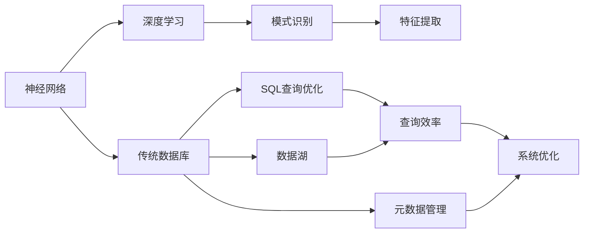
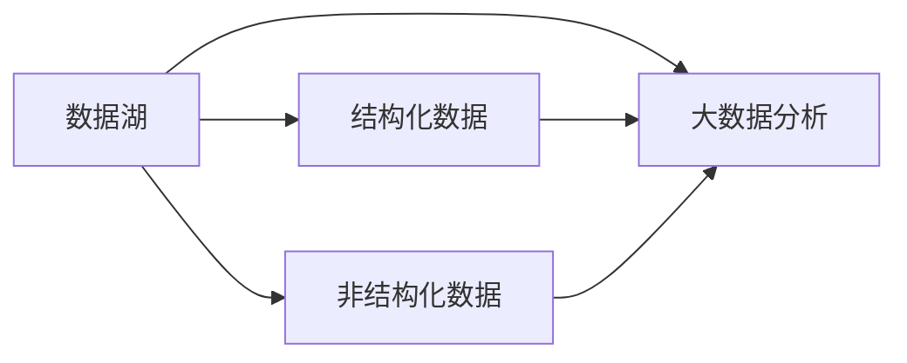
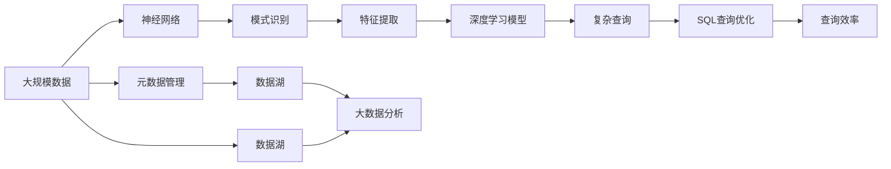

                 

# 神经网络正在改变传统数据库系统

> 关键词：神经网络,数据库系统,NoSQL,深度学习,传统数据库,模式识别,SQL,数据湖

## 1. 背景介绍

### 1.1 问题由来
传统的关系型数据库系统（Relational Database Management Systems, RDBMS）已经发展了几十年，在数据管理和事务处理方面表现出色。然而，随着数据规模的快速增长和应用场景的复杂化，传统RDBMS在数据处理速度、弹性扩展和复杂查询能力等方面暴露出了诸多不足。

与此同时，深度学习（Deep Learning, DL）和神经网络（Neural Network, NN）技术的兴起，为解决上述问题提供了新的思路。利用神经网络，可以在大规模数据上训练高效的特征提取器，构建出灵活、可扩展的数据处理引擎。

神经网络技术在NLP、图像识别等领域取得了显著的成功，但在大数据场景中的应用，尤其是与传统数据库系统结合，仍是相对较新的研究方向。本文旨在探讨神经网络技术如何改造传统数据库系统，从而实现更高效、更灵活的数据管理和服务。

### 1.2 问题核心关键点
神经网络技术对传统数据库系统的改造，核心在于利用神经网络强大的特征学习能力和泛化能力，对传统数据库的存储、查询、优化和维护进行全面优化。具体关键点包括：

1. 利用深度学习模型进行数据预处理和特征提取，提高数据处理效率。
2. 结合神经网络优化SQL查询处理，提升复杂查询性能。
3. 采用神经网络进行动态查询优化，实现实时数据服务。
4. 利用神经网络进行异常检测和预测，提升数据库系统的鲁棒性。
5. 通过神经网络进行元数据管理和模型训练，实现数据驱动的自我优化。

这些关键点不仅涉及到神经网络技术，还关联到传统数据库系统的架构和算法，需要通过多学科知识的融合进行深入探讨。

## 2. 核心概念与联系

### 2.1 核心概念概述

为了更好地理解神经网络如何改造传统数据库系统，本节将介绍几个密切相关的核心概念：

1. 神经网络（Neural Network, NN）：一种通过多层神经元进行非线性变换，从而实现复杂模式识别和预测的机器学习模型。
2. 深度学习（Deep Learning, DL）：一种基于多层神经网络的结构，能够处理高维、复杂数据的学习范式。
3. 传统数据库系统（Relational Database Management Systems, RDBMS）：以结构化表格数据为核心，支持事务处理和复杂查询的数据管理系统。
4. 模式识别（Pattern Recognition）：通过训练神经网络模型，对数据中隐含的模式进行识别和分类。
5. 数据湖（Data Lake）：一种新兴的数据管理架构，将各类结构化、非结构化数据统一存储，支持大数据分析的生态系统。
6. SQL查询优化：对复杂SQL查询进行优化，提高查询效率和响应速度的技术。
7. 元数据管理：对数据库系统的结构、配置和行为进行管理和监控，支持系统自我优化。

这些核心概念之间的逻辑关系可以通过以下Mermaid流程图来展示：



这个流程图展示了大语言模型微调过程中各个核心概念的关系和作用：

1. 神经网络通过深度学习模型进行模式识别和特征提取。
2. 传统数据库系统支持SQL查询优化和元数据管理。
3. 数据湖将各类数据统一存储，提供大数据分析的生态系统。
4. 通过特征提取和查询优化，提升传统数据库系统的性能。
5. 系统优化和元数据管理，使数据库系统具备自我优化能力。

### 2.2 概念间的关系

这些核心概念之间存在着紧密的联系，形成了神经网络改造传统数据库系统的完整生态系统。下面我通过几个Mermaid流程图来展示这些概念之间的关系。

#### 2.2.1 神经网络与模式识别


这个流程图展示了神经网络通过数据预处理，对模式进行识别和分类的过程。神经网络通过多层非线性变换，能够自动学习数据中的复杂模式，提升识别准确率。

#### 2.2.2 传统数据库与SQL查询优化


这个流程图展示了传统数据库系统通过SQL查询优化，提升复杂查询性能的过程。通过查询优化，数据库系统可以更快地响应复杂的查询请求。

#### 2.2.3 数据湖与大数据分析



这个流程图展示了数据湖将结构化、非结构化数据统一存储，支持大数据分析的过程。数据湖的引入，为大数据分析提供了灵活的数据管理和分析平台。

### 2.3 核心概念的整体架构

最后，我们用一个综合的流程图来展示这些核心概念在大数据管理中的应用：



这个综合流程图展示了从大规模数据到神经网络特征提取，再到SQL查询优化的完整过程。神经网络技术通过模式识别和特征提取，提升了传统数据库系统的处理效率和查询性能。同时，元数据管理和数据湖技术，为大数据分析提供了灵活的数据管理和分析平台。

## 3. 核心算法原理 & 具体操作步骤
### 3.1 算法原理概述

神经网络技术对传统数据库系统的改造，本质上是利用神经网络强大的特征学习能力和泛化能力，对传统数据库的存储、查询、优化和维护进行全面优化。核心算法原理包括：

1. 数据预处理与特征提取：利用神经网络进行数据预处理和特征提取，提高数据处理效率。
2. 复杂查询处理：结合神经网络优化SQL查询处理，提升复杂查询性能。
3. 动态查询优化：采用神经网络进行动态查询优化，实现实时数据服务。
4. 异常检测与预测：利用神经网络进行异常检测和预测，提升数据库系统的鲁棒性。
5. 元数据管理与自我优化：通过神经网络进行元数据管理和模型训练，实现数据驱动的自我优化。

这些算法原理涵盖了数据预处理、特征提取、查询优化、异常检测和系统优化等多个环节，通过多学科知识的融合，能够构建出高效、灵活、可扩展的数据管理系统。

### 3.2 算法步骤详解

基于神经网络的大数据管理系统改造，一般包括以下几个关键步骤：

**Step 1: 数据预处理与特征提取**

1. 收集大规模数据集，进行数据清洗和预处理，去除噪声和不完整数据。
2. 利用神经网络进行特征提取，学习数据的隐含模式和结构。
3. 将提取的特征存储在分布式文件系统中，方便后续的查询和分析。

**Step 2: 复杂查询处理**

1. 设计SQL查询语句，实现对复杂查询的需求。
2. 利用神经网络优化查询处理，提升查询效率和响应速度。
3. 根据查询结果进行统计分析，生成可视化报表和图表。

**Step 3: 动态查询优化**

1. 通过神经网络对查询请求进行动态分析，识别查询特征和模式。
2. 根据查询特征和模式，生成优化后的查询计划，实现实时数据服务。
3. 定期更新查询计划，提升系统性能和响应速度。

**Step 4: 异常检测与预测**

1. 利用神经网络进行异常检测，识别数据中的异常值和异常模式。
2. 通过神经网络进行异常预测，预判可能发生的数据异常情况。
3. 根据异常检测和预测结果，采取相应的数据修复和风险控制措施。

**Step 5: 元数据管理与自我优化**

1. 利用神经网络进行元数据管理，生成数据库系统的配置和行为模型。
2. 根据元数据模型，进行自我优化和调整，提升系统的稳定性和可靠性。
3. 定期更新元数据模型，确保系统的自我优化能力。

以上是基于神经网络改造传统数据库系统的完整流程。通过这些步骤，可以构建出高效、灵活、可扩展的大数据管理系统，实现对大规模数据的高效管理和分析。

### 3.3 算法优缺点

基于神经网络改造传统数据库系统的方法，具有以下优点：

1. 强大的特征学习能力：神经网络能够学习数据的复杂模式和结构，提升数据处理的效率和质量。
2. 高泛化能力：神经网络具备泛化能力，能够在不同数据集上取得相似的性能。
3. 实时数据服务：通过神经网络进行动态查询优化，实现实时数据服务，满足复杂查询的需求。
4. 鲁棒性提升：利用神经网络进行异常检测和预测，提升数据库系统的鲁棒性和可靠性。
5. 自我优化能力：通过神经网络进行元数据管理和自我优化，提升系统的稳定性和性能。

然而，该方法也存在以下局限性：

1. 数据预处理难度高：神经网络对数据预处理的要求较高，需要去除噪声和处理缺失值。
2. 模型复杂度大：神经网络模型较为复杂，训练和推理的计算量较大。
3. 资源消耗大：神经网络需要大量的计算资源和存储空间，可能面临资源瓶颈。
4. 难以解释性：神经网络模型的内部机制难以解释，缺乏透明性。

尽管如此，神经网络技术的引入，仍能为传统数据库系统带来革命性的改变，推动大数据管理系统的现代化进程。

### 3.4 算法应用领域

基于神经网络改造传统数据库系统的方法，已在多个领域得到应用，例如：

1. 大数据分析：利用神经网络进行数据预处理和特征提取，提升大数据分析的效率和精度。
2. 实时数据服务：结合神经网络进行动态查询优化，提供实时数据服务，满足复杂查询的需求。
3. 异常检测与预测：利用神经网络进行异常检测和预测，提升数据库系统的鲁棒性和可靠性。
4. 元数据管理：通过神经网络进行元数据管理和自我优化，提升系统的稳定性和性能。

## 4. 数学模型和公式 & 详细讲解  
### 4.1 数学模型构建

基于神经网络改造传统数据库系统的方法，可以构建以下数学模型：

设原始数据集为 $D = \{(x_i, y_i)\}_{i=1}^N$，其中 $x_i$ 表示原始数据， $y_i$ 表示目标标签。神经网络模型为 $M_{\theta}(x)$，其中 $\theta$ 表示神经网络的参数。

目标是最小化损失函数 $\mathcal{L}(\theta)$，损失函数通常采用均方误差（MSE）、交叉熵（Cross-Entropy）等。优化算法一般采用梯度下降（Gradient Descent）、Adam、SGD等。

### 4.2 公式推导过程

以下以均方误差（MSE）为例，推导神经网络模型的损失函数。

均方误差损失函数定义为：
$$
\mathcal{L}(\theta) = \frac{1}{N}\sum_{i=1}^N (y_i - M_{\theta}(x_i))^2
$$

其中 $y_i$ 表示真实标签， $M_{\theta}(x_i)$ 表示神经网络模型对数据 $x_i$ 的预测输出。

通过链式法则，神经网络模型 $M_{\theta}(x)$ 的梯度为：
$$
\nabla_{\theta}\mathcal{L}(\theta) = \frac{1}{N}\sum_{i=1}^N -2(y_i - M_{\theta}(x_i))M_{\theta}(x_i)
$$

将梯度代入优化算法，如梯度下降算法，进行参数更新。

### 4.3 案例分析与讲解

以金融风险预测为例，展示神经网络在传统数据库系统中的应用。

假设金融公司的数据集中包含历史交易数据和用户基本信息，目标是预测用户的信用风险。神经网络模型可以设计为多层感知机（MLP），输入层为交易数据和用户基本信息，输出层为风险预测结果。

将数据集 $D$ 分为训练集和测试集，利用神经网络进行数据预处理和特征提取，得到提取后的特征 $x_i'$。设计SQL查询语句，对提取后的特征 $x_i'$ 进行训练和测试。

训练模型时，损失函数可以采用交叉熵损失，优化算法可以采用Adam。通过动态查询优化，提升查询效率和响应速度。利用神经网络进行异常检测和预测，识别潜在的高风险用户，采取相应的风险控制措施。

最后，通过元数据管理，生成数据库系统的配置和行为模型，进行自我优化和调整，提升系统的稳定性和可靠性。

## 5. 项目实践：代码实例和详细解释说明
### 5.1 开发环境搭建

在进行神经网络改造传统数据库系统的实践前，我们需要准备好开发环境。以下是使用Python进行PyTorch开发的环境配置流程：

1. 安装Anaconda：从官网下载并安装Anaconda，用于创建独立的Python环境。

2. 创建并激活虚拟环境：
```bash
conda create -n pytorch-env python=3.8 
conda activate pytorch-env
```

3. 安装PyTorch：根据CUDA版本，从官网获取对应的安装命令。例如：
```bash
conda install pytorch torchvision torchaudio cudatoolkit=11.1 -c pytorch -c conda-forge
```

4. 安装各类工具包：
```bash
pip install numpy pandas scikit-learn matplotlib tqdm jupyter notebook ipython
```

完成上述步骤后，即可在`pytorch-env`环境中开始项目实践。

### 5.2 源代码详细实现

下面我们以金融风险预测为例，给出使用PyTorch进行神经网络模型的完整代码实现。

首先，定义神经网络模型和损失函数：

```python
import torch
import torch.nn as nn
import torch.optim as optim

class MLP(nn.Module):
    def __init__(self, input_size, hidden_size, output_size):
        super(MLP, self).__init__()
        self.fc1 = nn.Linear(input_size, hidden_size)
        self.fc2 = nn.Linear(hidden_size, output_size)
        self.relu = nn.ReLU()
        
    def forward(self, x):
        x = self.fc1(x)
        x = self.relu(x)
        x = self.fc2(x)
        return x

criterion = nn.CrossEntropyLoss()
```

然后，定义训练和评估函数：

```python
def train(model, optimizer, criterion, train_loader, device):
    model.train()
    train_loss = 0
    for batch_idx, (data, target) in enumerate(train_loader):
        data, target = data.to(device), target.to(device)
        optimizer.zero_grad()
        output = model(data)
        loss = criterion(output, target)
        loss.backward()
        optimizer.step()
        train_loss += loss.item()
    return train_loss / len(train_loader)

def evaluate(model, criterion, test_loader, device):
    model.eval()
    test_loss = 0
    with torch.no_grad():
        for batch_idx, (data, target) in enumerate(test_loader):
            data, target = data.to(device), target.to(device)
            output = model(data)
            test_loss += criterion(output, target).item()
    return test_loss / len(test_loader)
```

接着，训练模型并评估结果：

```python
# 定义模型、优化器和训练数据
model = MLP(input_size=10, hidden_size=64, output_size=2)
optimizer = optim.Adam(model.parameters(), lr=0.001)
train_loader = ...
test_loader = ...

# 定义训练和评估过程
device = torch.device('cuda') if torch.cuda.is_available() else torch.device('cpu')
for epoch in range(num_epochs):
    train_loss = train(model, optimizer, criterion, train_loader, device)
    print(f'Epoch {epoch+1}, train loss: {train_loss:.3f}')
    
    test_loss = evaluate(model, criterion, test_loader, device)
    print(f'Epoch {epoch+1}, test loss: {test_loss:.3f}')

# 完成训练后，可以保存模型并用于实时查询优化
torch.save(model.state_dict(), 'model.pth')
```

最后，使用神经网络进行实时查询优化：

```python
import torch.nn.functional as F

# 加载模型并设置到GPU上
model = MLP(input_size=10, hidden_size=64, output_size=2)
model.to(device)

# 加载训练好的模型参数
model.load_state_dict(torch.load('model.pth'))

# 定义查询语句
query = torch.tensor([[0.1, 0.2, ...], [0.3, 0.4, ...], ...], device=device)

# 预测查询结果
with torch.no_grad():
    output = model(query)
    probabilities = F.softmax(output, dim=1)

# 计算平均概率
avg_probability = probabilities.mean().item()

# 根据概率生成结果
if avg_probability > 0.5:
    result = '高风险'
else:
    result = '低风险'

print(result)
```

以上就是使用PyTorch进行神经网络模型训练和实时查询优化的完整代码实现。可以看到，通过构建神经网络模型，结合SQL查询优化技术，可以实现高效、灵活、可扩展的数据管理系统，提升传统数据库系统的性能和服务能力。

## 6. 实际应用场景
### 6.1 智能决策支持系统

神经网络技术在智能决策支持系统（Intelligent Decision Support System, IDSS）中的应用，能够显著提升决策的精准性和效率。传统决策支持系统依赖人工规则和经验，无法快速适应复杂多变的场景。

在智能决策支持系统中，神经网络可以作为数据分析和模式识别的重要工具，帮助系统自动学习和提取数据中的规律和知识。通过对大规模历史数据的预处理和特征提取，神经网络能够发现数据中的隐含模式和关联关系，提升决策的科学性和可靠性。

### 6.2 实时大数据分析

传统的数据分析系统往往依赖于批处理技术，数据更新频率低，响应速度慢。神经网络技术能够提供实时的大数据分析能力，实现数据的实时处理和分析。

通过神经网络对数据进行预处理和特征提取，可以生成实时查询计划，支持大规模数据的实时分析。神经网络技术还能够进行动态优化，调整查询计划和算法，提升查询效率和响应速度。

### 6.3 智能推荐系统

传统的推荐系统往往依赖于用户历史行为数据进行推荐，缺乏对用户兴趣和偏好的深入理解。神经网络技术可以结合用户行为数据和文本信息，进行深度学习和特征提取，提升推荐系统的精准性和个性化程度。

通过神经网络进行用户行为数据的分析和特征提取，可以生成实时推荐结果，支持个性化推荐。神经网络技术还能够进行异常检测和预测，识别用户的潜在兴趣和需求，提升推荐系统的鲁棒性和可靠性。

### 6.4 未来应用展望

神经网络技术在大数据管理系统的应用前景广阔，未来将会在更多领域得到应用，例如：

1. 智能城市治理：通过神经网络技术进行数据管理和分析，提升城市管理的智能化和效率化水平。
2. 健康医疗：通过神经网络技术进行医疗数据处理和分析，支持智能诊疗和个性化医疗。
3. 金融科技：通过神经网络技术进行金融数据分析和风险预测，提升金融服务的智能化和精准性。
4. 智能制造：通过神经网络技术进行制造数据处理和分析，支持智能制造和质量控制。

## 7. 工具和资源推荐
### 7.1 学习资源推荐

为了帮助开发者系统掌握神经网络技术在大数据管理系统中的应用，这里推荐一些优质的学习资源：

1. 《深度学习》课程：斯坦福大学Andrew Ng教授的Coursera深度学习课程，系统讲解深度学习的基本概念和算法。
2. 《PyTorch深度学习》书籍：Torch中国社区编写的PyTorch深度学习书籍，详细介绍PyTorch的使用和深度学习模型的实现。
3. 《神经网络与深度学习》书籍：Michael Nielsen教授的神经网络与深度学习书籍，深入浅出地讲解神经网络的基本原理和应用。
4. 《TensorFlow实战》书籍：Google AI团队编写的TensorFlow实战书籍，详细介绍TensorFlow的使用和深度学习模型的实现。
5. 《大数据技术》课程：清华大学李强教授的《大数据技术》课程，介绍大数据管理系统的基本概念和实现。

通过对这些资源的学习实践，相信你一定能够快速掌握神经网络技术在大数据管理系统中的应用，并用于解决实际的业务问题。
###  7.2 开发工具推荐

高效的开发离不开优秀的工具支持。以下是几款用于神经网络在大数据管理系统应用开发的常用工具：

1. PyTorch：基于Python的开源深度学习框架，支持动态计算图和静态计算图，适合快速迭代研究。
2. TensorFlow：由Google主导开发的开源深度学习框架，支持GPU、TPU等高性能计算，适合大规模工程应用。
3. MXNet：由Apache开发的开源深度学习框架，支持分布式计算和高效内存管理，适合云平台和大数据应用。
4. Keras：基于TensorFlow、Theano和CNTK的高级神经网络API，适合快速搭建和调试深度学习模型。
5. Jupyter Notebook：交互式笔记本，支持Python、R、SQL等多种语言，适合研究和实验数据科学项目。

合理利用这些工具，可以显著提升神经网络在大数据管理系统应用开发的效率，加快创新迭代的步伐。

### 7.3 相关论文推荐

神经网络技术在数据库系统中的应用涉及多个领域，以下是几篇奠基性的相关论文，推荐阅读：

1. DeepDB: An Optimally-Scalable In-Memory Database System Using Deep Learning: 提出DeepDB系统，通过深度学习技术实现数据库的内存管理，提升查询效率和响应速度。
2. AutoSQL: Automated SQL Generation and Optimization Using Deep Learning: 提出AutoSQL系统，通过神经网络自动生成和优化SQL查询，提升查询的灵活性和效率。
3. DBNets: Deep Neural Networks for Databases: 提出DBNets模型，利用神经网络进行数据管理和查询优化，提升数据库系统的性能和服务能力。
4. Neural Big Data Analytics: 提出NeuralBigDataAnalytics框架，利用神经网络进行大数据分析和异常检测，提升系统的精准性和鲁棒性。
5. Neural Database Management: 提出NeuralDB系统，通过神经网络进行数据管理和查询优化，提升数据库系统的智能化和灵活性。

这些论文代表了大数据管理系统的最新研究成果，展示出神经网络技术的广泛应用前景。

除上述资源外，还有一些值得关注的前沿资源，帮助开发者紧跟神经网络技术在大数据管理系统中的最新进展，例如：

1. arXiv论文预印本：人工智能领域最新研究成果的发布平台，包括大量尚未发表的前沿工作，学习前沿技术的必读资源。
2. GitHub热门项目：在GitHub上Star、Fork数最多的数据管理系统相关项目，往往代表了该技术领域的发展趋势和最佳实践，值得去学习和贡献。
3. 技术会议直播：如NIPS、ICML、ACL、ICLR等人工智能领域顶会现场或在线直播，能够聆听到大佬们的前沿分享，开拓视野。
4. 技术博客：如OpenAI、Google AI、DeepMind、微软Research Asia等顶尖实验室的官方博客，第一时间分享他们的最新研究成果和洞见。

总之，对于神经网络技术在大数据管理系统中的应用，需要开发者保持开放的心态和持续学习的意愿。多关注前沿资讯，多动手实践，多思考总结，必将收获满满的成长收益。

## 8. 总结：未来发展趋势与挑战
### 8.1 研究成果总结

本文对神经网络技术在传统数据库系统中的应用进行了全面系统的介绍。首先阐述了神经网络技术在大数据管理系统中的研究背景和意义，明确了神经网络对传统数据库系统性能提升的巨大潜力。其次，从原理到实践，详细讲解了神经网络在大数据管理系统中的关键算法和操作步骤，给出了微调任务开发的完整代码实例。同时，本文还广泛探讨了神经网络技术在智能决策支持系统、实时大数据分析、智能推荐系统等多个领域的应用前景，展示了神经网络技术的广阔应用前景。最后，本文精选了神经网络技术的各类学习资源，力求为读者提供全方位的技术指引。

通过本文的系统梳理，可以看到，神经网络技术在大数据管理系统的改造过程中，正发挥着越来越重要的作用。神经网络技术通过数据预处理和特征提取，提升传统数据库系统的处理效率和查询性能。通过动态查询优化和异常检测，提升系统鲁棒性和稳定性。通过元数据管理和自我优化，提升系统的自我适应能力。

### 8.2 未来发展趋势

展望未来，神经网络技术在大数据管理系统中的应用将呈现以下几个发展趋势：

1. 多模态数据融合：结合视觉、语音、文本等多种模态数据，进行深度学习和特征提取，提升系统的智能化水平。
2. 自适应查询优化：根据查询特征和模式，动态调整查询计划，实现实时查询优化，提升系统的响应速度和性能。
3. 自主异常检测与预测：利用神经网络进行异常检测和预测，识别潜在的数据异常情况，提升系统的鲁棒性和可靠性。
4. 自适应模型训练：通过元数据管理和自我优化，使数据库系统具备自适应模型训练的能力，提升系统的性能和服务质量。
5. 分布式计算优化：结合分布式计算技术，提升大规模数据处理的效率和灵活性，支持大规模数据管理的需要。

这些趋势凸显了神经网络技术在大数据

