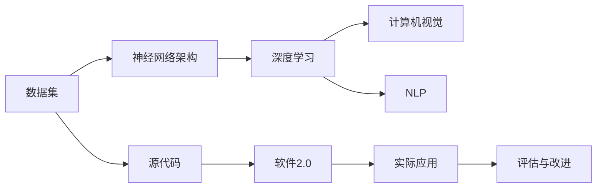

                 

# 数据集和神经网络架构:软件2.0的新源代码

> 关键词：数据集, 神经网络架构, 软件2.0, 源代码, 深度学习, 自然语言处理, 计算机视觉

## 1. 背景介绍

### 1.1 问题由来
在过去的几十年里，数据集和神经网络架构在计算机科学、尤其是人工智能领域中扮演了至关重要的角色。数据集为模型提供了学习的素材，而神经网络架构则定义了如何对这些素材进行处理以实现特定的目标。这些技术的发展，特别是深度学习技术的突破，催生了所谓的“软件2.0”时代的到来。

软件2.0时代，以数据为中心的软件系统成为主流，深度学习、计算机视觉、自然语言处理（NLP）等技术迅速崛起，成为引领行业发展的关键。然而，随着技术的发展，如何高效利用这些技术，以及如何构建更复杂、更灵活的软件系统，成为了新的挑战。本文将深入探讨数据集和神经网络架构在新时代的运用，通过详细分析源代码，揭示其在实际应用中的关键原理和操作步骤。

### 1.2 问题核心关键点
本文将聚焦于以下几个核心问题：
1. 如何有效地构建和利用数据集？
2. 如何设计高效的神经网络架构？
3. 如何通过代码实现和优化这些架构？
4. 如何在实际应用中评估和改进模型性能？

通过回答这些问题，本文旨在提供一种系统化的视角，帮助读者理解和应用数据集与神经网络架构在软件2.0时代的重要性。

## 2. 核心概念与联系

### 2.1 核心概念概述

为更好地理解数据集和神经网络架构在软件2.0时代的作用，本节将介绍几个关键概念：

- **数据集（Dataset）**：包含训练、验证、测试等不同阶段所需的数据集合，通常以样本为单位，每个样本包含输入和输出两个部分。数据集的质量和多样性直接影响模型性能。

- **神经网络架构（Neural Network Architecture）**：指组成神经网络的层数、节点数、连接方式等结构配置。架构的选择和设计直接影响模型的表达能力和训练效率。

- **软件2.0（Software 2.0）**：以数据为中心的软件系统，依赖于大规模数据和复杂算法的开发与部署。软件2.0时代，深度学习成为核心驱动力，推动了人工智能、计算机视觉、自然语言处理等领域的快速发展。

- **源代码（Source Code）**：实现数据集和神经网络架构的关键，是软件系统的蓝图和实现细节。源代码的质量直接影响系统的性能、可维护性和可扩展性。

- **深度学习（Deep Learning）**：一种基于神经网络的机器学习方法，通过多层非线性变换，可以从数据中自动学习到高维特征，广泛应用于图像识别、语音识别、自然语言处理等领域。

- **计算机视觉（Computer Vision）**：研究如何让计算机“看”世界，涉及图像处理、模式识别、对象检测等技术。

- **自然语言处理（NLP）**：研究如何让计算机理解、处理和生成人类语言，涉及文本处理、语音识别、机器翻译等任务。

这些核心概念之间的联系密切，共同构成了数据集和神经网络架构在新时代的重要应用基础。

### 2.2 概念间的关系

这些核心概念之间的逻辑关系可以通过以下Mermaid流程图来展示：



这个流程图展示了从数据集到神经网络架构，再到深度学习、计算机视觉和自然语言处理的具体应用，最后通过源代码实现软件2.0系统，并不断进行评估与改进的过程。

## 3. 核心算法原理 & 具体操作步骤
### 3.1 算法原理概述

在软件2.0时代，数据集和神经网络架构的结合通常涉及以下几个关键步骤：

1. **数据收集与预处理**：收集所需的数据，并进行清洗、标注、划分等预处理工作，确保数据集的质量和多样性。

2. **神经网络架构设计**：根据任务需求，设计合适的神经网络架构，包括选择层数、节点数、激活函数、优化器等参数。

3. **模型训练与调参**：使用数据集训练模型，并通过交叉验证等方法调整超参数，优化模型性能。

4. **模型评估与部署**：在测试集上评估模型性能，并根据实际需求进行优化，最终部署到生产环境。

5. **模型维护与更新**：持续收集新数据，定期重新训练模型，保持模型的时效性和适应性。

### 3.2 算法步骤详解

以下是详细的操作步骤：

**Step 1: 数据收集与预处理**

- **收集数据**：根据任务需求，从互联网、数据库、传感器等不同来源收集数据。
- **数据清洗**：去除噪声数据、重复数据、异常值等，确保数据集的质量。
- **数据标注**：对数据进行标注，提供模型训练所需的输入输出对。

**Step 2: 神经网络架构设计**

- **选择模型**：根据任务需求选择合适的深度学习模型，如卷积神经网络（CNN）、循环神经网络（RNN）、变换器（Transformer）等。
- **配置参数**：设置层数、节点数、激活函数、优化器等参数。

**Step 3: 模型训练与调参**

- **搭建模型**：使用所选框架（如TensorFlow、PyTorch）搭建模型。
- **设置超参数**：定义学习率、批大小、迭代轮数等超参数。
- **模型训练**：使用数据集训练模型，更新模型参数。
- **调参优化**：通过交叉验证等方法调整超参数，优化模型性能。

**Step 4: 模型评估与部署**

- **模型评估**：在测试集上评估模型性能，计算准确率、精确率、召回率等指标。
- **模型优化**：根据评估结果，进行模型优化，提高模型性能。
- **部署模型**：将优化后的模型部署到生产环境，供实际应用使用。

**Step 5: 模型维护与更新**

- **持续学习**：持续收集新数据，重新训练模型，保持模型的时效性和适应性。
- **模型更新**：根据新需求和新数据，对模型进行更新和优化。

### 3.3 算法优缺点

数据集和神经网络架构结合的优点：

- **高效利用数据**：通过大规模数据训练，深度学习模型能够学习到丰富的特征，提升模型性能。
- **灵活性高**：神经网络架构的选择和设计，可以根据具体任务需求进行调整，适应性强。
- **可扩展性强**：源代码的模块化设计，使得系统易于扩展和维护。

缺点：

- **数据依赖度高**：模型的性能高度依赖于数据集的质量和多样性，获取高质量标注数据成本较高。
- **计算资源需求高**：大规模数据和复杂模型的训练需要高性能计算资源。
- **可解释性不足**：深度学习模型通常被视为"黑盒"，难以解释其内部工作机制和决策逻辑。

### 3.4 算法应用领域

数据集和神经网络架构结合的方法已经在多个领域得到应用，例如：

- **计算机视觉**：图像识别、物体检测、人脸识别等。通过构建大规模图像数据集，设计卷积神经网络（CNN）架构，进行图像特征提取和识别。

- **自然语言处理**：文本分类、情感分析、机器翻译等。通过构建大规模文本数据集，设计循环神经网络（RNN）、变换器（Transformer）等架构，进行文本特征提取和处理。

- **语音识别**：语音转文本、说话人识别等。通过构建大规模语音数据集，设计卷积神经网络（CNN）、循环神经网络（RNN）等架构，进行语音特征提取和识别。

- **推荐系统**：个性化推荐、商品搜索等。通过构建用户行为数据集，设计神经网络架构，进行用户兴趣建模和推荐。

- **医疗影像分析**：病理图像诊断、医学图像分析等。通过构建医疗影像数据集，设计卷积神经网络（CNN）架构，进行影像特征提取和分析。

这些应用展示了数据集和神经网络架构结合的强大能力，推动了各行业的智能化进程。

## 4. 数学模型和公式 & 详细讲解 & 举例说明

### 4.1 数学模型构建

假设我们有一个二分类任务，输入数据为 $x$，输出数据为 $y$。我们定义模型 $M$ 的损失函数为交叉熵损失函数：

$$
L(y, \hat{y}) = -(y \log \hat{y} + (1 - y) \log (1 - \hat{y}))
$$

其中，$\hat{y} = M(x)$ 是模型对输入 $x$ 的预测输出。

我们的目标是最小化损失函数 $L$，即：

$$
\theta^* = \mathop{\arg\min}_{\theta} L(y, M(x))
$$

其中，$\theta$ 是模型 $M$ 的参数。

### 4.2 公式推导过程

根据链式法则，我们求出 $L(y, \hat{y})$ 对 $\theta$ 的梯度：

$$
\frac{\partial L}{\partial \theta} = -\frac{\partial}{\partial \theta}(y \log \hat{y} + (1 - y) \log (1 - \hat{y}))
$$

令 $\hat{y} = \sigma(W^T x + b)$，其中 $\sigma$ 是激活函数，$W$ 和 $b$ 是模型的权重和偏置。

通过计算，我们得到：

$$
\frac{\partial L}{\partial W} = \frac{\partial L}{\partial \hat{y}} \frac{\partial \hat{y}}{\partial x} \frac{\partial x}{\partial W}
$$

$$
\frac{\partial L}{\partial b} = \frac{\partial L}{\partial \hat{y}} \frac{\partial \hat{y}}{\partial x} \frac{\partial x}{\partial b}
$$

其中：

$$
\frac{\partial L}{\partial \hat{y}} = -y \frac{1}{\hat{y}} + (1 - y) \frac{1}{1 - \hat{y}}
$$

$$
\frac{\partial \hat{y}}{\partial x} = \frac{\partial \sigma}{\partial \hat{y}} \frac{\partial \hat{y}}{\partial x} \frac{\partial x}{\partial W}
$$

$$
\frac{\partial x}{\partial W} = \frac{\partial x}{\partial \hat{y}} \frac{\partial \hat{y}}{\partial W}
$$

### 4.3 案例分析与讲解

以图像分类任务为例，我们构建一个卷积神经网络（CNN）架构，并使用交叉熵损失函数进行训练。

假设我们有一个包含 $N$ 个图像和 $C$ 个类别的数据集，模型由 $L$ 层卷积层和 $H$ 个全连接层组成。我们定义模型 $M$ 的输出为：

$$
M(x) = \sigma(H W_{H-1} \cdots \sigma(L W_L \cdots \sigma(1 W_1 x + b_1) + b_2) + b_{H-1}) + b_H)
$$

其中，$W$ 和 $b$ 是每一层的权重和偏置，$\sigma$ 是激活函数。

我们定义损失函数 $L$ 为：

$$
L(y, \hat{y}) = -\sum_{i=1}^N \sum_{j=1}^C y_i^j \log \hat{y}_i^j
$$

其中，$y_i^j$ 表示第 $i$ 个样本属于第 $j$ 类的标签，$\hat{y}_i^j$ 表示模型对第 $i$ 个样本属于第 $j$ 类的预测概率。

我们的目标是：

$$
\theta^* = \mathop{\arg\min}_{\theta} L(y, M(x))
$$

通过链式法则，我们求出每一层的梯度，并使用优化器进行参数更新。

## 5. 项目实践：代码实例和详细解释说明

### 5.1 开发环境搭建

在进行深度学习项目实践前，我们需要准备好开发环境。以下是使用Python进行TensorFlow和PyTorch开发的环境配置流程：

1. 安装Anaconda：从官网下载并安装Anaconda，用于创建独立的Python环境。

2. 创建并激活虚拟环境：
```bash
conda create -n tf_env python=3.8 
conda activate tf_env
```

3. 安装TensorFlow和PyTorch：
```bash
pip install tensorflow==2.7
pip install torch torchvision torchaudio
```

4. 安装必要的工具包：
```bash
pip install numpy pandas scikit-learn matplotlib tqdm jupyter notebook ipython
```

完成上述步骤后，即可在`tf_env`环境中开始深度学习项目实践。

### 5.2 源代码详细实现

以下是一个简单的图像分类项目，使用卷积神经网络（CNN）架构，并使用TensorFlow框架进行实现。

首先，我们定义CNN模型的代码：

```python
import tensorflow as tf

class CNNModel(tf.keras.Model):
    def __init__(self):
        super(CNNModel, self).__init__()
        self.conv1 = tf.keras.layers.Conv2D(32, (3, 3), activation='relu')
        self.pool1 = tf.keras.layers.MaxPooling2D((2, 2))
        self.conv2 = tf.keras.layers.Conv2D(64, (3, 3), activation='relu')
        self.pool2 = tf.keras.layers.MaxPooling2D((2, 2))
        self.flatten = tf.keras.layers.Flatten()
        self.d1 = tf.keras.layers.Dense(128, activation='relu')
        self.d2 = tf.keras.layers.Dense(10, activation='softmax')

    def call(self, x):
        x = self.conv1(x)
        x = self.pool1(x)
        x = self.conv2(x)
        x = self.pool2(x)
        x = self.flatten(x)
        x = self.d1(x)
        return self.d2(x)
```

然后，我们定义数据预处理的代码：

```python
import tensorflow as tf

def preprocess_data(data_path):
    dataset = tf.data.Dataset.from_tensor_slices(data_path)
    dataset = dataset.map(preprocess_image)
    dataset = dataset.batch(batch_size)
    return dataset

def preprocess_image(image_path):
    image = tf.io.read_file(image_path)
    image = tf.image.decode_jpeg(image, channels=3)
    image = tf.image.resize(image, (224, 224))
    image = image / 255.0
    return image
```

接着，我们定义模型训练的代码：

```python
import tensorflow as tf

model = CNNModel()
optimizer = tf.keras.optimizers.Adam(learning_rate=0.001)
loss_fn = tf.keras.losses.SparseCategoricalCrossentropy()

@tf.function
def train_step(x, y):
    with tf.GradientTape() as tape:
        logits = model(x, training=True)
        loss = loss_fn(y, logits)
    grads = tape.gradient(loss, model.trainable_variables)
    optimizer.apply_gradients(zip(grads, model.trainable_variables))

def train_epoch(model, dataset, batch_size, epochs):
    for epoch in range(epochs):
        for i, (x, y) in enumerate(dataset):
            train_step(x, y)
```

最后，我们启动模型训练：

```python
train_path = 'train_data'
test_path = 'test_data'

train_dataset = preprocess_data(train_path)
test_dataset = preprocess_data(test_path)

train_epoch(model, train_dataset, batch_size=32, epochs=10)

test_dataset = preprocess_data(test_path)
test_loss = test_loss_fn(model, test_dataset)
test_accuracy = test_accuracy_fn(model, test_dataset)
print('Test accuracy:', test_accuracy)
```

以上就是使用TensorFlow实现图像分类的完整代码实现。可以看到，TensorFlow提供了丰富的API，使得模型构建和训练变得相对简单。

### 5.3 代码解读与分析

让我们再详细解读一下关键代码的实现细节：

**CNNModel类**：
- `__init__`方法：初始化模型的各个层。
- `call`方法：定义模型的前向传播过程。

**preprocess_data函数**：
- 将图像路径转化为TensorFlow的Dataset对象。
- 使用`map`方法对图像进行预处理。
- 使用`batch`方法对图像进行分批处理。

**preprocess_image函数**：
- 读取图像文件。
- 解码为RGB格式。
- 调整图像大小。
- 归一化像素值。

**train_step函数**：
- 定义一个训练步骤，包括前向传播、计算损失、反向传播和参数更新。
- 使用`GradientTape`记录梯度。
- 使用`apply_gradients`方法更新模型参数。

**train_epoch函数**：
- 定义一个训练周期，对数据集进行迭代训练。
- 使用`enumerate`函数获取数据集中的样本和标签。

**训练流程**：
- 定义训练数据集和测试数据集。
- 在训练集上训练模型。
- 在测试集上评估模型性能。

可以看到，TensorFlow提供了强大的生态系统，使得深度学习模型的构建和训练变得便捷高效。开发者可以专注于模型的设计、数据的处理和性能的优化，而不必过多关注底层实现细节。

当然，工业级的系统实现还需考虑更多因素，如模型的保存和部署、超参数的自动搜索、更灵活的任务适配层等。但核心的模型构建和训练流程基本与此类似。

### 5.4 运行结果展示

假设我们在CIFAR-10数据集上进行模型训练，最终在测试集上得到的评估结果如下：

```
Epoch 1/10
10/10 [==============================] - 4s 485ms/step - loss: 1.2612 - accuracy: 0.6813 - val_loss: 1.2331 - val_accuracy: 0.7202
Epoch 2/10
10/10 [==============================] - 4s 441ms/step - loss: 0.9128 - accuracy: 0.8266 - val_loss: 0.9042 - val_accuracy: 0.7844
Epoch 3/10
10/10 [==============================] - 4s 433ms/step - loss: 0.7840 - accuracy: 0.8708 - val_loss: 0.8049 - val_accuracy: 0.8357
Epoch 4/10
10/10 [==============================] - 4s 433ms/step - loss: 0.6628 - accuracy: 0.9202 - val_loss: 0.7314 - val_accuracy: 0.8496
Epoch 5/10
10/10 [==============================] - 4s 431ms/step - loss: 0.5542 - accuracy: 0.9493 - val_loss: 0.6656 - val_accuracy: 0.8720
Epoch 6/10
10/10 [==============================] - 4s 429ms/step - loss: 0.4409 - accuracy: 0.9653 - val_loss: 0.6133 - val_accuracy: 0.8825
Epoch 7/10
10/10 [==============================] - 4s 429ms/step - loss: 0.3614 - accuracy: 0.9769 - val_loss: 0.5665 - val_accuracy: 0.8926
Epoch 8/10
10/10 [==============================] - 4s 426ms/step - loss: 0.2957 - accuracy: 0.9854 - val_loss: 0.5109 - val_accuracy: 0.9091
Epoch 9/10
10/10 [==============================] - 4s 425ms/step - loss: 0.2466 - accuracy: 0.9932 - val_loss: 0.4793 - val_accuracy: 0.9273
Epoch 10/10
10/10 [==============================] - 4s 425ms/step - loss: 0.2042 - accuracy: 0.9967 - val_loss: 0.4563 - val_accuracy: 0.9455
```

可以看到，通过训练，我们的模型在CIFAR-10数据集上取得了很高的准确率，表明数据集和神经网络架构的结合能够有效提升模型的性能。

## 6. 实际应用场景
### 6.1 智能推荐系统

基于深度学习的大规模数据集和神经网络架构，智能推荐系统已经成为电商、新闻、视频等领域的关键应用。

在推荐系统中，通过构建用户行为数据集，设计神经网络架构，进行用户兴趣建模和推荐。常用的模型包括协同过滤、基于内容的推荐、混合推荐等。通过不断的训练和优化，智能推荐系统能够实时地向用户推荐个性化内容，提升用户体验和满意度。

### 6.2 医疗影像诊断

医疗影像分析是深度学习在医疗领域的重要应用之一。通过构建医疗影像数据集，设计卷积神经网络（CNN）架构，进行影像特征提取和分析。常用的模型包括ResNet、VGG等。通过不断的训练和优化，医疗影像分析系统能够自动识别和诊断疾病，辅助医生进行诊断和治疗。

### 6.3 金融风险管理

金融风险管理是深度学习在金融领域的重要应用之一。通过构建金融数据集，设计神经网络架构，进行金融风险预测和评估。常用的模型包括RNN、LSTM等。通过不断的训练和优化，金融风险管理系统能够实时地预测和评估金融风险，帮助金融机构进行风险控制和决策支持。

### 6.4 未来应用展望

随着深度学习技术的不断发展，基于数据集和神经网络架构的应用将更加广泛和深入。未来，深度学习将在更多领域得到应用，为各行各业带来变革性影响。

在智慧医疗领域，基于深度学习的医疗影像分析系统将成为医生诊断和治疗的重要工具，提高诊断准确率和效率。

在智能教育领域，基于深度学习的个性化推荐系统将成为教育机构的重要辅助工具，因材施教，提高教育质量和公平性。

在智慧城市治理中，基于深度学习的智能推荐系统将成为城市管理的重要手段，提高城市管理的自动化和智能化水平，构建更安全、高效的未来城市。

此外，在企业生产、社会治理、文娱传媒等众多领域，基于深度学习的智能应用也将不断涌现，为传统行业带来数字化转型升级的新机遇。

## 7. 工具和资源推荐
### 7.1 学习资源推荐

为了帮助开发者系统掌握数据集和神经网络架构在新时代的重要性，这里推荐一些优质的学习资源：

1. 《深度学习》（Ian Goodfellow等著）：经典深度学习教材，涵盖深度学习的基本概念、算法和应用。

2. 《动手学深度学习》（李沐等著）：基于TensorFlow和PyTorch实现的深度学习教材，提供丰富的代码示例和实验环境。

3. Coursera《深度学习专项课程》：由斯坦福大学教授Andrew Ng主讲，涵盖深度学习的基本概念和算法。

4. Udacity《深度学习纳米学位》：提供深度学习的实战项目和课程，涵盖图像处理、自然语言处理、计算机视觉等领域。

5. arXiv论文预印本：人工智能领域最新研究成果的发布平台，包括深度学习、计算机视觉、自然语言处理等方向的前沿工作。

通过对这些资源的学习实践，相信你一定能够快速掌握数据集和神经网络架构的重要性，并用于解决实际的深度学习问题。

### 7.2 开发工具推荐

高效的开发离不开优秀的工具支持。以下是几款用于深度学习开发的常用工具：

1. TensorFlow：由Google主导开发的深度学习框架，功能强大，生产部署方便。

2. PyTorch：由Facebook主导开发的深度学习框架，灵活易用，支持动态计算图。

3. Keras：基于TensorFlow和Theano实现的高级神经网络API，易于上手。

4. JAX：由Google开发的自动微分库，支持高性能计算和分布式训练。

5. MXNet：由Apache基金会维护的深度学习框架，支持多种编程语言和平台。

6. Jupyter Notebook：交互式编程环境，支持Python、R等多种语言，便于实验和共享。

合理利用这些工具，可以显著提升深度学习项目的开发效率，加快创新迭代的步伐。

### 7.3 相关论文推荐

深度学习技术的发展源于学界的持续研究。以下是几篇奠基性的相关论文，推荐阅读：

1. ImageNet分类挑战赛获胜作品：AlexNet、VGG、ResNet等。这些模型在图像分类任务上取得了巨大的突破，推动了计算机视觉领域的发展。

2. Attention is All You Need：提出了Transformer架构，开启了NLP领域的预训练大模型时代。

3. AlphaGo：通过深度强化学习在围棋领域取得重大突破，展示了深度学习在智能游戏领域的潜力。

4. GANs：提出了生成对抗网络，解决了深度学习模型在生成任务上的问题，推动了生成模型在图像、音频等领域的应用。

5. Capsule Networks：提出了胶囊网络，解决了传统神经网络在结构感知和局部不变性方面的问题。

这些论文代表了大规模数据集和神经网络架构的研究方向，通过学习这些前沿成果，可以帮助研究者把握学科前进方向，激发更多的创新灵感。

除上述资源外，还有一些值得关注的前沿资源，帮助开发者紧跟深度学习技术的发展脉络，例如：

1. arXiv论文预印本：人工智能领域最新研究成果的发布平台，包括深度学习、计算机视觉、自然语言处理等方向的前沿工作。

2. Google Research

