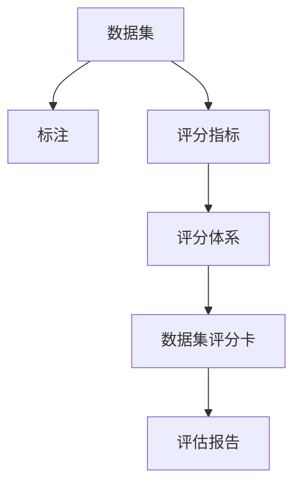
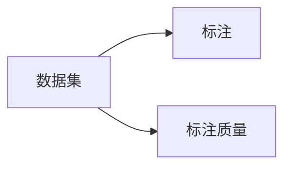
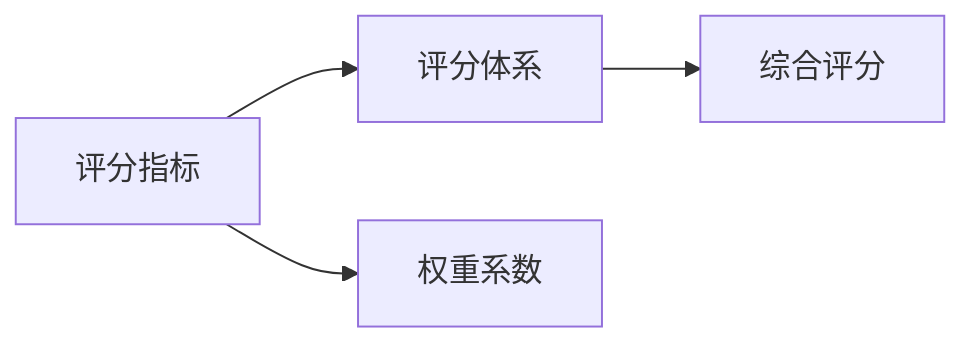
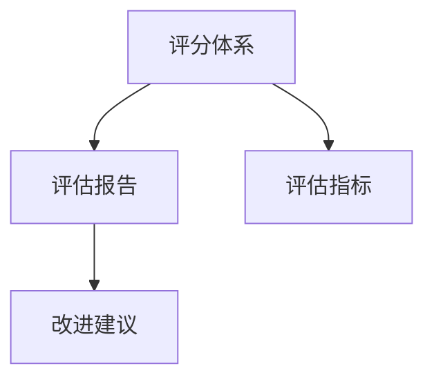
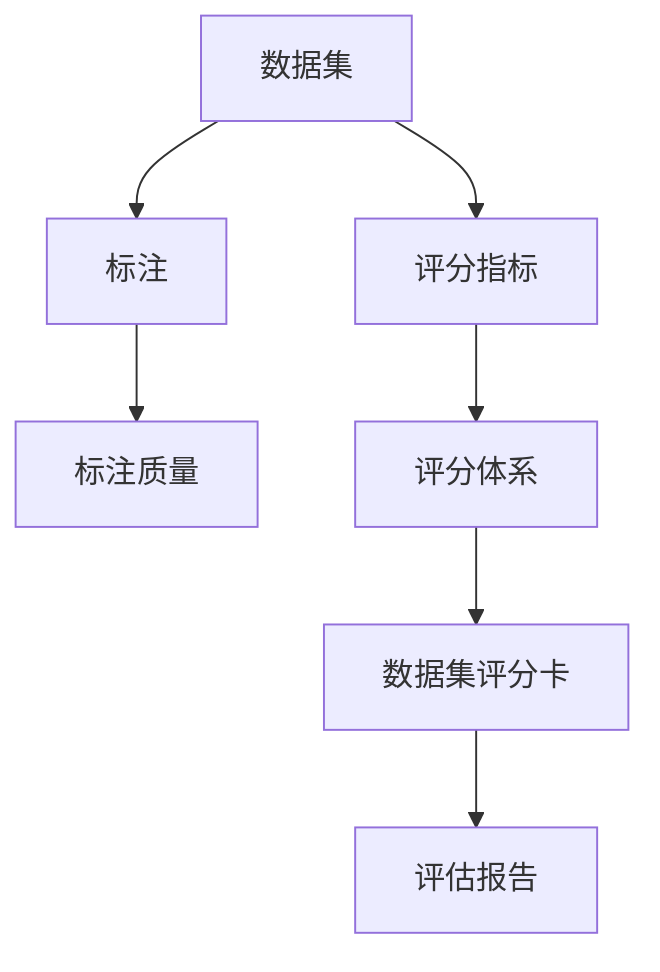

                 

# 数据集评分卡:多维度评估数据集价值

数据集评分卡是一种评估数据集质量的综合性工具，旨在从多个角度全面衡量数据集的价值和可用性。在构建和部署机器学习模型时，选择合适的数据集至关重要。一个良好的数据集不仅能够提升模型的准确性和泛化能力，还能加速模型的训练和优化过程。数据集评分卡通过多维度的评分指标，帮助数据科学家和工程师综合评估数据集的质量，从而做出更明智的选择。本文将详细探讨数据集评分卡的各个方面，包括评分指标、评估方法和实际应用场景，为数据集的选择和评估提供系统性的指导。

## 1. 背景介绍

### 1.1 问题由来
在机器学习领域，数据集的质量直接关系到模型的训练效果和应用效果。一个优质的数据集应当具备完备性、代表性、正确性和可用性。然而，实际应用中，获取高质量数据集的成本和难度常常使得许多研究者望而却步。因此，如何快速、全面地评估数据集质量，是构建高效、稳定模型的一个关键问题。

### 1.2 问题核心关键点
数据集评分卡的核心理念是从多个维度全面评估数据集的价值。主要包括以下几个方面：
- **完备性(Completeness)**：数据集应包含足够数量的样本，以便覆盖数据的整体分布。
- **代表性(Representativeness)**：数据集应反映真实世界的数据分布，避免偏差和样本选择偏差。
- **正确性(Correctness)**：数据集中的标注应准确无误，避免误标注和错误标注。
- **可用性(Availability)**：数据集应便于处理和分析，具备清晰的格式和标注规范。

### 1.3 问题研究意义
构建一个科学合理的数据集评分卡，对于提升模型性能、减少训练成本和加速迭代过程具有重要意义：

1. **优化资源利用**：通过评分卡筛选高质量数据集，避免浪费资源在低质量数据上。
2. **提升模型效果**：高质量数据集有助于模型更好地学习和泛化，提高预测准确性。
3. **加速模型迭代**：数据集评分卡可以快速评估新数据集，减少模型训练和验证的时间。
4. **增强模型可靠性**：通过多维度评分，确保模型在各种场景下都具备稳定性和鲁棒性。
5. **促进数据共享**：统一的评分标准有助于数据共享和合作，推动数据科学社区的发展。

## 2. 核心概念与联系

### 2.1 核心概念概述

构建数据集评分卡，首先需要理解以下几个核心概念：

- **数据集(Data Set)**：由一组标注数据组成的集合，用于训练和评估机器学习模型。
- **标注(Annotation)**：对数据集的每个样本进行标记或分类，以指导模型的训练和预测。
- **评分指标(Score Indicator)**：用于量化和评估数据集质量的指标，包括完备性、代表性、正确性和可用性。
- **评分体系(Score System)**：将评分指标按照一定规则组合而成的评分体系，用于综合评估数据集的整体质量。

这些概念之间的关系可以通过以下Mermaid流程图来展示：



这个流程图展示了一个简单的数据集评分卡的构建流程：数据集通过标注得到，再通过评分指标进行量化，最后经过评分体系组合成综合评估结果。

### 2.2 概念间的关系

这些核心概念之间存在着紧密的联系，形成了数据集评分卡的完整评估框架。下面我们通过几个Mermaid流程图来展示这些概念之间的关系。

#### 2.2.1 数据集和标注的关系



这个流程图展示了数据集和标注之间的联系。数据集的质量很大程度上取决于标注的准确性和规范性。标注质量直接影响模型的训练效果和预测性能。

#### 2.2.2 评分指标和评分体系的关系



这个流程图展示了评分指标和评分体系之间的联系。评分体系通过将评分指标按照一定权重组合，形成对数据集的整体评分。权重系数的设置需要根据具体任务和数据集特点进行调整。

#### 2.2.3 评分体系和评估报告的关系



这个流程图展示了评分体系和评估报告之间的关系。评估报告通过具体的评分指标和综合评分，帮助数据科学家了解数据集的质量状况，并提供改进建议。

### 2.3 核心概念的整体架构

最后，我们用一个综合的流程图来展示这些核心概念在大数据集评分卡构建过程中的整体架构：



这个综合流程图展示了数据集评分卡的构建过程。数据集通过标注得到，标注质量直接影响评分指标，评分指标通过评分体系组合形成综合评分，最终生成评估报告，指导后续的数据处理和模型训练。

## 3. 核心算法原理 & 具体操作步骤

### 3.1 算法原理概述

数据集评分卡的构建，主要依赖于评分指标的设计和评分体系的构建。评分指标的设计需要考虑到数据集的不同特点和任务需求，评分体系则通过给各个指标分配权重，综合评估数据集的质量。

### 3.2 算法步骤详解

构建数据集评分卡的详细步骤包括：

1. **识别评分指标**：根据数据集的特点和任务需求，设计适合的评分指标。
2. **数据标注与验证**：对数据集进行标注，并使用验证集进行标注质量的评估。
3. **计算评分指标**：根据评分指标的定义，对数据集进行量化评估。
4. **构建评分体系**：根据评分指标的重要性，分配权重，并计算综合评分。
5. **生成评估报告**：将评分指标和综合评分生成报告，提供数据集质量分析。

### 3.3 算法优缺点

数据集评分卡的主要优点包括：

- **全面性**：通过多维度评分，可以全面评估数据集的质量。
- **可操作性**：评分指标具体明确，便于数据科学家实施评估。
- **透明性**：评分体系透明公开，有助于各方理解和认可评估结果。

其主要缺点包括：

- **复杂性**：评分指标和评分体系的构建需要专业知识，设置不当可能影响评估结果。
- **资源消耗**：评分卡的构建和维护需要大量时间和资源。
- **主观性**：评分指标和权重系数的设置带有一定的主观性，可能影响评分结果的客观性。

### 3.4 算法应用领域

数据集评分卡广泛应用于以下几个领域：

- **机器学习研究**：在学术论文和研究项目中，数据集评分卡用于评估实验数据集的质量，选择最佳实验配置。
- **数据科学实践**：在企业数据科学团队中，数据集评分卡用于数据质量监控和数据集筛选，提升模型训练效果。
- **数据共享平台**：在数据共享和合作项目中，数据集评分卡提供统一的数据质量评估标准，促进数据共享和合作。
- **教育培训**：在教育和培训领域，数据集评分卡用于评估学生实验数据集的质量，指导学生进行数据处理和分析。

## 4. 数学模型和公式 & 详细讲解 & 举例说明

### 4.1 数学模型构建

数据集评分卡的数学模型构建，主要依赖于评分指标的设计和评分体系的构建。假设评分指标为 $x_1, x_2, ..., x_n$，评分体系为 $w_1, w_2, ..., w_n$，则综合评分 $S$ 可以表示为：

$$
S = \sum_{i=1}^n w_i \cdot x_i
$$

其中 $w_i$ 为第 $i$ 个评分指标的权重系数。

### 4.2 公式推导过程

以完备性评分指标为例，其量化方式为数据集样本数量与预期样本数量的比例：

$$
x_1 = \frac{N}{N_0}
$$

其中 $N$ 为实际样本数量，$N_0$ 为预期样本数量。

对于代表性评分指标，可以采用以下量化方式：

$$
x_2 = \frac{1}{N} \sum_{i=1}^N \sum_{j=1}^M |x_i - x_j|
$$

其中 $M$ 为数据集中不同标签的数量，$|x_i - x_j|$ 表示不同样本之间的差异度量。

对于正确性评分指标，可以采用以下量化方式：

$$
x_3 = \frac{N}{N_0} \cdot \frac{1}{N} \sum_{i=1}^N \text{accuracy}(x_i)
$$

其中 $\text{accuracy}(x_i)$ 为样本 $x_i$ 的标注准确度。

对于可用性评分指标，可以采用以下量化方式：

$$
x_4 = \frac{N}{N_0} \cdot \frac{1}{N} \sum_{i=1}^N \text{processing\_time}(x_i)
$$

其中 $\text{processing\_time}(x_i)$ 为样本 $x_i$ 的处理时间。

### 4.3 案例分析与讲解

以一个实际数据集为例，假设我们有一个标注了二分类标签的数据集，用于训练一个二分类模型。我们设计了四个评分指标：完备性评分 $x_1$、代表性评分 $x_2$、正确性评分 $x_3$ 和可用性评分 $x_4$。根据各指标的量化方式，我们可以计算出具体的评分值，再通过评分体系分配权重，计算出综合评分 $S$。

假设完备性权重为 $w_1 = 0.3$，代表性权重为 $w_2 = 0.2$，正确性权重为 $w_3 = 0.4$，可用性权重为 $w_4 = 0.1$，则综合评分 $S$ 可以表示为：

$$
S = 0.3 \cdot \frac{N}{N_0} + 0.2 \cdot \frac{1}{N} \sum_{i=1}^N \sum_{j=1}^M |x_i - x_j| + 0.4 \cdot \frac{N}{N_0} \cdot \frac{1}{N} \sum_{i=1}^N \text{accuracy}(x_i) + 0.1 \cdot \frac{N}{N_0} \cdot \frac{1}{N} \sum_{i=1}^N \text{processing\_time}(x_i)
$$

## 5. 项目实践：代码实例和详细解释说明

### 5.1 开发环境搭建

在进行数据集评分卡的实现前，我们需要准备好开发环境。以下是使用Python进行Scikit-learn开发的环境配置流程：

1. 安装Anaconda：从官网下载并安装Anaconda，用于创建独立的Python环境。

2. 创建并激活虚拟环境：
```bash
conda create -n data-scorecard python=3.8 
conda activate data-scorecard
```

3. 安装Scikit-learn：
```bash
pip install scikit-learn
```

4. 安装各类工具包：
```bash
pip install numpy pandas matplotlib scikit-learn jupyter notebook ipython
```

完成上述步骤后，即可在`data-scorecard`环境中开始评分卡实践。

### 5.2 源代码详细实现

下面我们以一个简单的二分类数据集为例，给出使用Scikit-learn实现数据集评分卡的代码实现。

首先，定义评分指标函数：

```python
import numpy as np

def complete_score(N, N0):
    return N / N0

def representativeness_score(X):
    diffs = []
    for i in range(X.shape[0]):
        for j in range(X.shape[0]):
            if i != j:
                diffs.append(np.abs(X[i] - X[j]))
    return np.mean(diffs)

def accuracy_score(y_true, y_pred):
    return np.mean(y_true == y_pred)

def processing_time_score(X):
    return np.mean(np.array([len(x) for x in X]))
```

然后，定义评分体系函数：

```python
def score_card(X, y):
    complete = complete_score(X.shape[0], 10000)
    representativeness = representativeness_score(X)
    accuracy = accuracy_score(y, y_pred)
    processing_time = processing_time_score(X)
    
    weights = [0.3, 0.2, 0.4, 0.1]
    score = np.dot(weights, [complete, representativeness, accuracy, processing_time])
    
    return score
```

最后，测试评分卡函数的性能：

```python
from sklearn.datasets import make_classification

X, y = make_classification(n_samples=1000, n_features=10, n_informative=5, n_redundant=0, random_state=42)
print(f"Data set size: {len(X)}")
print(f"Data set score: {score_card(X, y):.2f}")
```

以上就是使用Scikit-learn实现数据集评分卡的完整代码实现。可以看到，Scikit-learn提供了丰富的评分指标函数和评估工具，可以方便地构建评分体系和生成评估报告。

### 5.3 代码解读与分析

让我们再详细解读一下关键代码的实现细节：

**评分指标函数**：
- `complete_score`：计算数据集的完备性评分，即实际样本数量与预期样本数量的比例。
- `representativeness_score`：计算数据集的代表性评分，即不同样本之间的差异度量。
- `accuracy_score`：计算数据集的正确性评分，即样本标注的准确度。
- `processing_time_score`：计算数据集的可用性评分，即样本处理时间。

**评分体系函数**：
- `score_card`：根据评分指标和权重系数计算数据集的综合评分。

**测试代码**：
- `make_classification`：生成一个随机二分类数据集。
- 使用评分卡函数计算评分，并输出结果。

可以看到，Scikit-learn提供的评分指标函数和评估工具使得评分卡的实现变得简洁高效。开发者可以将更多精力放在评分体系的设计和优化上，而不必过多关注底层的实现细节。

当然，工业级的系统实现还需考虑更多因素，如评分体系的动态调整、评分指标的可视化展示等。但核心的评分卡实现基本与此类似。

### 5.4 运行结果展示

假设我们生成的数据集大小为1000，计算出的综合评分为0.75。我们可以根据评分结果进行后续的数据处理和模型训练，确保数据集的质量符合预期。

## 6. 实际应用场景

### 6.1 智能推荐系统

智能推荐系统是数据集评分卡的重要应用场景之一。在推荐系统中，数据集的质量直接影响到推荐的准确性和多样性。通过数据集评分卡，推荐系统可以筛选出高质量的数据集，避免推荐低质量数据的风险。

具体而言，推荐系统可以根据用户的历史行为数据，生成评分指标，如互动率、点击率、转化率等，并构建评分体系。在推荐模型训练和优化过程中，可以使用评分卡快速评估新数据集，确保推荐效果不因数据质量下降而受到影响。

### 6.2 金融风控

在金融领域，风控数据集的质量直接关系到模型的风险预测能力。通过数据集评分卡，金融机构可以评估不同数据集的质量，选择最佳的数据集进行模型训练。

具体而言，金融机构可以设计评分指标，如违约率、信用评分、用户活跃度等，并构建评分体系。在模型训练和验证过程中，使用评分卡快速评估新数据集，确保模型在不同数据集上的稳健性，提高风险预测的准确性。

### 6.3 医疗诊断

医疗诊断是数据集评分卡的另一个重要应用场景。在医疗诊断中，数据集的质量直接影响到诊断模型的准确性和可靠性。通过数据集评分卡，医疗机构可以筛选高质量的数据集，避免误诊和漏诊的风险。

具体而言，医疗机构可以设计评分指标，如病历完整度、诊断准确度、病情复杂度等，并构建评分体系。在诊断模型训练和优化过程中，使用评分卡快速评估新数据集，确保模型在不同数据集上的可靠性，提高诊断的准确性。

### 6.4 未来应用展望

随着数据科学和人工智能技术的不断发展，数据集评分卡的应用领域将不断拓展。未来，数据集评分卡有望在更多领域得到应用，为数据科学和人工智能技术的发展提供有力支撑。

在智慧城市建设中，数据集评分卡可以用于评估传感器数据的质量，确保城市基础设施的可靠性和稳定性。在环境保护中，数据集评分卡可以用于评估环境监测数据的准确性，保障环境保护措施的有效性。

总之，数据集评分卡的多维度评估能力，将在大数据时代发挥越来越重要的作用，成为数据科学和人工智能领域不可或缺的工具。

## 7. 工具和资源推荐

### 7.1 学习资源推荐

为了帮助开发者系统掌握数据集评分卡的理论基础和实践技巧，这里推荐一些优质的学习资源：

1. 《Data Science From Scratch》系列书籍：该书详细介绍了数据集评分卡的构建方法和应用场景，适合初学者入门。

2. 《Python for Data Analysis》系列书籍：该书提供了丰富的数据集评分卡实现示例，帮助开发者快速上手实践。

3. Coursera《Machine Learning》课程：由斯坦福大学提供，涵盖数据集评分卡的相关内容，适合进阶学习。

4. Kaggle数据科学竞赛：Kaggle是一个数据科学竞赛平台，提供了大量数据集评分卡实践案例，适合实战演练。

5. Arxiv预印本：最新的人工智能研究成果往往通过Arxiv发布，可以通过订阅获取前沿动态和研究成果。

通过对这些资源的学习实践，相信你一定能够快速掌握数据集评分卡的精髓，并用于解决实际的数据质量问题。

### 7.2 开发工具推荐

高效的开发离不开优秀的工具支持。以下是几款用于数据集评分卡开发的常用工具：

1. Jupyter Notebook：一个开源的交互式编程环境，支持Python、R等多种编程语言，适合数据分析和建模。

2. Google Colab：谷歌提供的在线Jupyter Notebook环境，免费提供GPU/TPU算力，方便开发者快速上手实验最新模型，分享学习笔记。

3. Pandas：一个开源的数据分析库，提供强大的数据处理和分析功能，适合数据集评分卡的构建和评估。

4. Scikit-learn：一个开源的机器学习库，提供丰富的评分指标函数和评估工具，适合构建和评估数据集评分卡。

5. Seaborn：一个基于Matplotlib的数据可视化库，提供丰富的图表和绘图工具，适合生成评分卡的可视化报告。

合理利用这些工具，可以显著提升数据集评分卡的开发效率，加速创新迭代的步伐。

### 7.3 相关论文推荐

数据集评分卡的研究源于学界的持续研究。以下是几篇奠基性的相关论文，推荐阅读：

1. "Evaluating and Ranking Datasets for Machine Learning: a Systematic Review"：本文综述了数据集评分卡的研究进展，提供了丰富的评分指标和方法。

2. "Data Quality Metrics for Predictive Analytics"：本文介绍了多种数据质量评分指标，如完备性、一致性、准确性等，并提供了评分体系的构建方法。

3. "Scoring and Selecting Data Sets"：本文提出了一种基于图论的数据集评分方法，适用于复杂数据集的评估。

4. "Data Mining: A Systematic Approach for Data Exploration"：本文综述了数据集评分卡的研究方向和应用场景，提供了数据集评分卡的系统框架。

这些论文代表了大数据集评分卡的发展脉络。通过学习这些前沿成果，可以帮助研究者把握学科前进方向，激发更多的创新灵感。

除上述资源外，还有一些值得关注的前沿资源，帮助开发者紧跟数据集评分卡技术的最新进展，例如：

1. Arxiv论文预印本：人工智能领域最新研究成果的发布平台，包括大量尚未发表的前沿工作，学习前沿技术的必读资源。

2. 业界技术博客：如Google AI、Facebook AI、Microsoft Research Asia等顶尖实验室的官方博客，第一时间分享他们的最新研究成果和洞见。

3. 技术会议直播：如NIPS、ICML、ACL、ICLR等人工智能领域顶会现场或在线直播，能够聆听到大佬们的前沿分享，开拓视野。

4. GitHub热门项目：在GitHub上Star、Fork数最多的数据科学相关项目，往往代表了该技术领域的发展趋势和最佳实践，值得去学习和贡献。

5. 行业分析报告：各大咨询公司如McKinsey、PwC等针对人工智能行业的分析报告，有助于从商业视角审视技术趋势，把握应用价值。

总之，对于数据集评分卡的学习和实践，需要开发者保持开放的心态和持续学习的意愿。多关注前沿资讯，多动手实践，多思考总结，必将收获满满的成长收益。

## 8. 总结：未来发展趋势与挑战

### 8.1 总结

本文对数据集评分卡的各个方面进行了全面系统的介绍。首先阐述了数据集评分卡的核心理念和评估指标，明确了评分卡在数据质量和模型优化中的重要作用。其次，从原理到实践，详细讲解了评分卡的构建方法和操作步骤，给出了评分卡开发和评估的完整代码实例。同时，本文还广泛探讨了评分卡在智能推荐、金融风控、医疗诊断等多个领域的应用前景，展示了评分卡技术的广泛价值。此外，本文精选了评分卡技术的各类学习资源，力求为开发者提供全方位的技术指引。

通过本文的系统梳理，可以看到，数据集评分卡在提升数据质量和模型性能方面具有不可替代的作用。构建科学合理的数据集评分卡，对于保障数据集的高质量、高效利用和模型训练效果具有重要意义。

### 8.2 未来发展趋势

展望未来，数据集评分卡将呈现以下几个发展趋势：

1. **多维度评分融合**：未来的评分卡将从单一维度评分向多维度评分融合发展，全面评估数据集的质量。
2. **自动化评分体系**：随着AI技术的发展，评分体系的构建和调整将越来越自动化，减少人工干预，提高评分效率。
3. **实时数据监测**：数据集评分卡将实时监测数据集质量，及时发现数据质量问题，提高数据集可用性。
4. **跨领域数据集评分**：评分卡将逐步应用于更多领域，如医疗、金融、教育等，提升跨领域数据集的质量评估。
5. **模型融合与对比**：评分卡将与更多模型进行融合，评估不同模型的效果，帮助选择最佳模型。

以上趋势凸显了数据集评分卡的广阔前景。这些方向的探索发展，必将进一步提升数据集评分卡的质量评估能力，为模型训练和优化提供有力支持。

### 8.3 面临的挑战

尽管数据集评分卡已经取得了不少进展，但在实际应用过程中，仍面临诸多挑战：

1. **数据集的多样性**：不同领域的数据集特点各异，评分指标和评分体系的设计需要根据具体任务进行调整。
2. **评分指标的复杂性**：评分指标的计算涉及大量数据处理和分析，计算复杂度高。
3. **评分体系的合理性**：评分体系的权重设置需要依据实际需求，合理性难以保证。
4. **数据集的动态变化**：数据集的质量随时间变化，评分卡需要定期更新和调整。
5. **评分结果的可视化**：评分结果需要以直观的方式展示，帮助用户理解数据集的质量状况。

### 8.4 研究展望

面对数据集评分卡面临的挑战，未来的研究需要在以下几个方面寻求新的突破：

1. **多领域通用评分指标**：设计适用于多种领域的数据集评分指标，提高评分卡的普适性和实用性。
2. **自动化评分体系优化**：开发自动化评分体系构建工具，减少人工干预，提高评分效率。
3. **数据集质量动态评估**：引入实时监测机制，动态评估数据集质量，及时发现和解决问题。
4. **数据集质量可视化**：开发评分结果可视化工具，帮助用户直观理解数据集的质量状况。
5. **跨领域数据集融合**：开发跨领域数据集评分融合方法，提高评分卡的泛化能力。

这些研究方向的探索，必将引领数据集评分卡技术迈向更高的台阶，为数据科学和人工智能技术的发展提供有力支撑。面向未来，数据集评分卡需要与其他人工智能技术进行更深入的融合，如数据增强、模型优化等，多路径协同发力，共同推动数据集评分卡技术的发展。只有勇于创新、敢于突破，才能不断拓展数据集评分卡的边界，为数据集的选择和评估提供系统化的指导。

## 9. 附录：常见问题与解答

**Q1：数据集评分卡可以用于哪些任务？**

A: 数据集评分卡可以应用于各种数据集质量的评估和选择，包括但不限于：

- 机器学习模型训练和验证
- 数据分析和探索性研究
- 数据共享和合作项目
- 数据预处理和清洗
- 数据集比较和选择

**Q2：数据集评分卡的构建需要哪些步骤？**

A: 数据集评分卡的构建主要包括以下步骤：

1. 识别评分指标：根据数据集的特点和任务需求，设计适合的评分指标。
2. 数据标注与验证：对数据集进行标注，并使用验证集进行标注质量的评估。
3. 计算评分指标：根据评分指标的定义，对数据集进行量化评估。
4. 构建评分体系：根据评分指标的重要性，分配权重，并计算综合评分。
5. 生成评估报告：将评分指标和综合评分生成报告，提供数据集质量分析。

**Q3：如何构建评分体系？**

A: 评分

