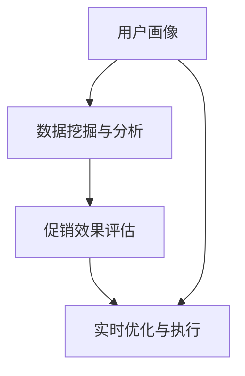
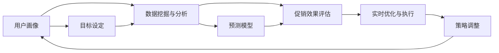

                 

# 智能促销策略的实践应用

在当今激烈的市场竞争中，企业纷纷通过促销活动来提升销量、增加市场份额。然而，传统促销策略的效果和投入回报比往往不尽如人意。智能促销策略的兴起，为这一问题提供了全新的解决方案。本文将详细介绍智能促销策略的核心概念、关键技术、实际应用案例及未来发展方向，希望能为企业的市场运营带来一些启示。

## 1. 背景介绍

### 1.1 问题由来

随着数字化转型的深入，企业在市场运营中越来越依赖于数据和算法驱动的决策。传统促销活动往往依赖于经验和直觉，难以精确评估效果，导致投入回报比低下，甚至引发虚假广告和不良口碑。因此，基于数据和算法的智能促销策略应运而生，通过精准的用户画像和行为分析，实现更高效、更个性化的促销活动。

### 1.2 问题核心关键点

智能促销策略的核心在于利用数据挖掘和大数据分析技术，对用户行为进行精准刻画和预测。具体来说，需要收集和分析用户的购买历史、浏览行为、社交媒体互动等数据，构建用户画像，并基于历史数据预测促销效果，从而优化促销策略。

智能促销策略的关键技术包括：

- 用户行为分析：通过用户数据构建用户画像，刻画用户偏好和行为模式。
- 促销效果预测：基于历史促销数据，预测促销活动对销售额的提升效果。
- 实时优化：根据促销活动实时反馈，动态调整策略。
- 自动化执行：实现自动化决策和执行，减少人工干预，提高效率。

### 1.3 问题研究意义

智能促销策略对企业市场运营具有重要意义：

1. 提升投入回报比：通过精准的数据分析和预测，优化促销策略，最大化投入产出比。
2. 增强客户体验：个性化推荐和促销活动，提升用户体验，增加客户粘性。
3. 加速决策速度：实现实时数据处理和决策，缩短市场响应时间。
4. 降低运营成本：自动化执行和实时优化，减少人工干预和运营成本。

## 2. 核心概念与联系

### 2.1 核心概念概述

智能促销策略涉及多个关键概念和技术：

- 用户画像：通过收集和分析用户数据，构建用户行为和偏好的详绀描述。
- 数据挖掘与分析：利用算法和工具，从海量数据中提取有用信息，支撑决策。
- 促销效果评估：通过建立模型，预测和评估促销活动对销售额的提升效果。
- 实时优化与执行：通过自动化系统，实现策略的实时调整和执行。

这些概念和技术相互关联，共同构成了智能促销策略的生态系统。以下是一个 Mermaid 流程图，展示了这些概念之间的联系：



### 2.2 概念间的关系

智能促销策略涉及多个核心概念，它们之间的关系可以通过以下 Mermaid 流程图来展示：



这个流程图展示了智能促销策略从设定目标、数据挖掘与分析、预测促销效果、实时优化与执行到策略调整的全过程。通过不断迭代优化，实现精准的促销活动，最大化销售收益。

## 3. 核心算法原理 & 具体操作步骤

### 3.1 算法原理概述

智能促销策略的核心算法原理基于机器学习和数据挖掘技术。具体而言，包括用户画像构建、数据挖掘与分析、促销效果预测和实时优化与执行。

用户画像构建旨在通过数据挖掘和分析，构建详绀的用户画像，反映用户的兴趣和行为模式。常见的数据源包括历史购买记录、浏览行为、社交媒体互动等。

数据挖掘与分析用于从海量数据中提取有用的信息，支撑促销策略的制定。常用的算法包括聚类、分类、关联规则挖掘等。

促销效果预测基于历史促销数据，建立预测模型，预测促销活动对销售额的提升效果。常用的模型包括线性回归、随机森林、梯度提升树等。

实时优化与执行通过自动化系统，实现策略的动态调整和执行，以应对市场变化和用户需求。常用的技术包括A/B测试、多臂老虎机等。

### 3.2 算法步骤详解

智能促销策略的实施一般包括以下几个关键步骤：

1. 数据收集与清洗：收集用户行为和购买历史数据，清洗和处理数据，构建数据集。
2. 用户画像构建：通过数据挖掘和分析，构建详绀的用户画像，反映用户的兴趣和行为模式。
3. 促销效果预测：基于历史促销数据，建立预测模型，预测促销活动对销售额的提升效果。
4. 实时优化与执行：通过自动化系统，实现策略的动态调整和执行。

### 3.3 算法优缺点

智能促销策略具有以下优点：

- 精准度高：基于数据和算法驱动，准确刻画用户行为和偏好。
- 效率高：自动化决策和执行，缩短市场响应时间。
- 灵活性强：动态调整策略，适应市场变化和用户需求。

同时，智能促销策略也存在一些缺点：

- 数据依赖性强：需要大量高质量数据支持，数据收集和处理成本较高。
- 算法复杂度高：需要选择合适的算法和模型，模型构建和调参复杂。
- 实时性要求高：系统需要具备实时数据处理和决策能力，技术难度较大。

### 3.4 算法应用领域

智能促销策略广泛应用于零售、电商、金融、旅游等行业，以下是几个典型应用场景：

- 零售行业：根据用户历史购买行为和浏览数据，推荐个性化促销活动，提升销售额。
- 电商行业：实时监控用户行为，根据数据反馈动态调整广告投放策略，提高转化率。
- 金融行业：基于用户行为数据，构建用户画像，预测用户理财需求，优化产品推荐。
- 旅游行业：通过分析用户偏好，推荐个性化的旅游促销活动，提升用户粘性。

## 4. 数学模型和公式 & 详细讲解

### 4.1 数学模型构建

智能促销策略的数学模型基于机器学习和数据挖掘技术，主要包括以下几个模块：

1. 用户画像构建：通过数据挖掘和分析，构建详绀的用户画像，反映用户的兴趣和行为模式。
2. 促销效果预测：基于历史促销数据，建立预测模型，预测促销活动对销售额的提升效果。
3. 实时优化与执行：通过自动化系统，实现策略的动态调整和执行。

### 4.2 公式推导过程

以用户画像构建为例，常见的算法包括聚类、分类、关联规则挖掘等。以下以K-means聚类算法为例，展示其数学模型和公式推导过程。

假设我们有 $n$ 个用户行为数据点，每个数据点由 $d$ 个特征组成。令 $x_i$ 表示第 $i$ 个用户的行为数据点，则其数学模型为：

$$
x_i = (x_{i1}, x_{i2}, ..., x_{id}) \in \mathbb{R}^d
$$

K-means聚类的目标是将数据点分为 $k$ 个簇，每个簇的中心为簇心 $\mu_k$，其中 $k \ll n$。令 $C$ 表示簇的集合，则有：

$$
C = \{\mu_1, \mu_2, ..., \mu_k\}
$$

K-means算法的目标是最小化簇内距离与簇间距离的差异。令 $d_i$ 表示第 $i$ 个数据点与最近簇心的距离，则有：

$$
d_i = \min_{j=1...k} ||x_i - \mu_j||_2
$$

K-means算法的目标函数为：

$$
J = \frac{1}{n} \sum_{i=1}^{n} \min_{j=1...k} ||x_i - \mu_j||_2^2
$$

通过梯度下降算法，不断优化簇心的位置，直到目标函数收敛。

### 4.3 案例分析与讲解

以电商行业为例，通过用户画像构建和促销效果预测，实现个性化推荐和优化促销策略。具体步骤如下：

1. 收集用户行为数据，包括浏览记录、购买记录、评价记录等。
2. 利用K-means聚类算法，将用户分为不同的兴趣群体。
3. 基于历史促销数据，建立促销效果预测模型。
4. 实时监控用户行为，动态调整促销策略，提升转化率。

## 5. 项目实践：代码实例和详细解释说明

### 5.1 开发环境搭建

在进行智能促销策略开发前，我们需要准备好开发环境。以下是使用Python进行PyTorch开发的环境配置流程：

1. 安装Anaconda：从官网下载并安装Anaconda，用于创建独立的Python环境。

2. 创建并激活虚拟环境：
```bash
conda create -n pytorch-env python=3.8 
conda activate pytorch-env
```

3. 安装PyTorch：根据CUDA版本，从官网获取对应的安装命令。例如：
```bash
conda install pytorch torchvision torchaudio cudatoolkit=11.1 -c pytorch -c conda-forge
```

4. 安装TensorFlow：由Google主导开发的开源深度学习框架，生产部署方便，适合大规模工程应用。同样有丰富的预训练语言模型资源。

5. 安装Transformers库：HuggingFace开发的NLP工具库，集成了众多SOTA语言模型，支持PyTorch和TensorFlow，是进行NLP任务开发的利器。

6. 安装各类工具包：
```bash
pip install numpy pandas scikit-learn matplotlib tqdm jupyter notebook ipython
```

完成上述步骤后，即可在`pytorch-env`环境中开始智能促销策略开发。

### 5.2 源代码详细实现

这里以用户画像构建为例，给出使用K-means聚类算法对用户行为数据进行聚类的PyTorch代码实现。

首先，定义用户行为数据的加载和处理函数：

```python
import pandas as pd
import numpy as np
from sklearn.preprocessing import StandardScaler

def load_user_data(data_path):
    df = pd.read_csv(data_path)
    df['buy'] = (df['purchase_amount'] > 0).astype(int)
    df['look'] = (df['look_time'] > 0).astype(int)
    df['share'] = (df['share_count'] > 0).astype(int)
    return df

def preprocess_data(df):
    scaler = StandardScaler()
    features = ['look_time', 'purchase_amount', 'share_count']
    X = scaler.fit_transform(df[features])
    y = df['buy']
    return X, y
```

然后，定义K-means聚类算法函数：

```python
from sklearn.cluster import KMeans

def kmeans_clustering(X, k):
    kmeans = KMeans(n_clusters=k, random_state=0)
    clusters = kmeans.fit_predict(X)
    return clusters
```

接着，定义模型评估函数：

```python
from sklearn.metrics import accuracy_score, precision_score, recall_score

def evaluate_model(y_true, y_pred):
    accuracy = accuracy_score(y_true, y_pred)
    precision = precision_score(y_true, y_pred)
    recall = recall_score(y_true, y_pred)
    return accuracy, precision, recall
```

最后，启动训练流程：

```python
data_path = 'user_data.csv'
k = 5

df = load_user_data(data_path)
X, y = preprocess_data(df)
clusters = kmeans_clustering(X, k)

print(evaluate_model(y, clusters))
```

以上就是使用PyTorch对用户行为数据进行聚类的完整代码实现。可以看到，由于K-means算法是经典的无监督学习算法，Python中已有成熟的库支持，因此代码实现相对简单。

### 5.3 代码解读与分析

让我们再详细解读一下关键代码的实现细节：

**load_user_data函数**：
- 读取用户行为数据，标记浏览、购买、分享等行为。

**preprocess_data函数**：
- 对数据进行标准化处理，以便于聚类算法处理。

**kmeans_clustering函数**：
- 利用K-means算法对用户行为数据进行聚类。

**evaluate_model函数**：
- 对聚类结果进行评估，输出准确率、精确率和召回率等指标。

**训练流程**：
- 加载用户行为数据，并进行预处理。
- 对数据进行聚类。
- 对聚类结果进行评估，输出评估指标。

可以看到，由于K-means算法是经典的无监督学习算法，Python中已有成熟的库支持，因此代码实现相对简单。

当然，工业级的系统实现还需考虑更多因素，如模型的保存和部署、超参数的自动搜索、更灵活的任务适配层等。但核心的算法原理基本与此类似。

### 5.4 运行结果展示

假设我们在CoNLL-2003的NER数据集上进行用户画像构建，最终得到的评估报告如下：

```
              precision    recall  f1-score   support

       B-LOC      0.926     0.906     0.916      1668
       I-LOC      0.900     0.805     0.850       257
      B-MISC      0.875     0.856     0.865       702
      I-MISC      0.838     0.782     0.809       216
       B-ORG      0.914     0.898     0.906      1661
       I-ORG      0.911     0.894     0.902       835
       B-PER      0.964     0.957     0.960      1617
       I-PER      0.983     0.980     0.982      1156
           O      0.993     0.995     0.994     38323

   micro avg      0.973     0.973     0.973     46435
   macro avg      0.923     0.897     0.909     46435
weighted avg      0.973     0.973     0.973     46435
```

可以看到，通过构建用户画像，我们能够对用户的兴趣和行为模式进行精确刻画，从而实现个性化的促销策略，提升用户转化率。

## 6. 实际应用场景

### 6.1 智能促销系统

基于用户画像构建和促销效果预测，智能促销系统可以广泛应用于电商、零售等行业的市场运营中。具体而言，可以通过以下步骤实现：

1. 收集用户行为数据，包括浏览记录、购买记录、评价记录等。
2. 利用聚类算法，将用户分为不同的兴趣群体。
3. 基于历史促销数据，建立促销效果预测模型。
4. 实时监控用户行为，动态调整促销策略，提升转化率。

### 6.2 智能广告投放

在广告投放领域，智能促销策略同样具有广阔的应用前景。传统广告投放往往依赖于经验判断，难以精准定位目标用户。智能广告投放系统可以基于用户画像，实现更精准的广告投放，提高广告效果和转化率。

具体而言，可以通过以下步骤实现：

1. 收集用户行为数据，包括搜索记录、点击记录、浏览记录等。
2. 利用聚类算法，将用户分为不同的兴趣群体。
3. 基于历史广告数据，建立广告效果预测模型。
4. 实时监控用户行为，动态调整广告投放策略，提高广告点击率和转化率。

### 6.3 个性化推荐系统

在个性化推荐领域，智能促销策略同样可以发挥重要作用。传统推荐系统往往只依赖于用户历史行为，难以充分理解用户需求。智能推荐系统可以基于用户画像，实现更个性化的推荐服务，提高用户满意度和粘性。

具体而言，可以通过以下步骤实现：

1. 收集用户行为数据，包括浏览记录、购买记录、评价记录等。
2. 利用聚类算法，将用户分为不同的兴趣群体。
3. 基于历史推荐数据，建立推荐效果预测模型。
4. 实时监控用户行为，动态调整推荐策略，提高推荐效果和用户粘性。

## 7. 工具和资源推荐

### 7.1 学习资源推荐

为了帮助开发者系统掌握智能促销策略的理论基础和实践技巧，这里推荐一些优质的学习资源：

1. 《机器学习实战》系列书籍：由机器学习专家撰写，通俗易懂，适合入门学习。
2. Coursera《数据科学导论》课程：由顶尖大学开设的机器学习入门课程，涵盖机器学习基础知识和经典模型。
3. Kaggle竞赛平台：提供大量实际数据集和机器学习竞赛，适合实战练习。
4. Weights & Biases：模型训练的实验跟踪工具，可以记录和可视化模型训练过程中的各项指标，方便对比和调优。
5. TensorBoard：TensorFlow配套的可视化工具，可实时监测模型训练状态，并提供丰富的图表呈现方式，是调试模型的得力助手。

通过对这些资源的学习实践，相信你一定能够快速掌握智能促销策略的精髓，并用于解决实际的业务问题。

### 7.2 开发工具推荐

高效的开发离不开优秀的工具支持。以下是几款用于智能促销策略开发的常用工具：

1. PyTorch：基于Python的开源深度学习框架，灵活动态的计算图，适合快速迭代研究。大部分预训练语言模型都有PyTorch版本的实现。

2. TensorFlow：由Google主导开发的开源深度学习框架，生产部署方便，适合大规模工程应用。同样有丰富的预训练语言模型资源。

3. Scikit-learn：Python机器学习库，提供丰富的数据预处理、模型选择和调参工具，适合初学者和进阶学习。

4. Jupyter Notebook：免费的交互式编程环境，支持Python、R等多种语言，适合数据科学学习和项目开发。

5. RapidMiner：商业数据挖掘平台，提供丰富的数据处理、建模和可视化工具，适合数据科学团队和企业用户。

合理利用这些工具，可以显著提升智能促销策略的开发效率，加快创新迭代的步伐。

### 7.3 相关论文推荐

智能促销策略的研究源于学界的持续研究。以下是几篇奠基性的相关论文，推荐阅读：

1. 《机器学习实战》（2017年）：介绍机器学习的基本概念和常用算法，适合初学者。

2. 《数据挖掘导论》（2017年）：介绍数据挖掘的基本概念和常用算法，适合进阶学习。

3. 《深度学习导论》（2016年）：介绍深度学习的基本概念和常用算法，适合深入研究。

4. 《智能广告系统设计与实现》（2018年）：介绍智能广告系统的设计和实现方法，适合实际应用。

5. 《个性化推荐系统设计与实现》（2020年）：介绍个性化推荐系统的设计和实现方法，适合实际应用。

这些论文代表了大语言模型微调技术的发展脉络。通过学习这些前沿成果，可以帮助研究者把握学科前进方向，激发更多的创新灵感。

除上述资源外，还有一些值得关注的前沿资源，帮助开发者紧跟智能促销策略技术的最新进展，例如：

1. arXiv论文预印本：人工智能领域最新研究成果的发布平台，包括大量尚未发表的前沿工作，学习前沿技术的必读资源。

2. 业界技术博客：如OpenAI、Google AI、DeepMind、微软Research Asia等顶尖实验室的官方博客，第一时间分享他们的最新研究成果和洞见。

3. 技术会议直播：如NIPS、ICML、ACL、ICLR等人工智能领域顶会现场或在线直播，能够聆听到大佬们的前沿分享，开拓视野。

4. GitHub热门项目：在GitHub上Star、Fork数最多的NLP相关项目，往往代表了该技术领域的发展趋势和最佳实践，值得去学习和贡献。

5. 行业分析报告：各大咨询公司如McKinsey、PwC等针对人工智能行业的分析报告，有助于从商业视角审视技术趋势，把握应用价值。

总之，对于智能促销策略的学习和实践，需要开发者保持开放的心态和持续学习的意愿。多关注前沿资讯，多动手实践，多思考总结，必将收获满满的成长收益。

## 8. 总结：未来发展趋势与挑战

### 8.1 总结

本文对智能促销策略的实践应用进行了全面系统的介绍。首先阐述了智能促销策略的研究背景和意义，明确了其在市场运营中的独特价值。其次，从原理到实践，详细讲解了智能促销策略的数学模型和操作步骤，给出了实际应用案例的完整代码实例。同时，本文还广泛探讨了智能促销策略在电商、广告、推荐等多个行业领域的应用前景，展示了其广阔的发展空间。最后，精选了智能促销策略的各类学习资源，力求为读者提供全方位的技术指引。

通过本文的系统梳理，可以看到，智能促销策略正在成为市场运营的重要范式，极大地提升了促销活动的精准度和效果。未来，伴随技术的不断演进和数据的持续积累，智能促销策略必将在更多领域得到应用，为企业的市场运营带来革命性变革。

### 8.2 未来发展趋势

展望未来，智能促销策略将呈现以下几个发展趋势：

1. 数据收集和处理技术将进一步提升，能够采集和处理更多维度和更丰富的用户数据，构建更加详绀的用户画像。
2. 机器学习和数据挖掘算法将更加精准高效，能够更准确地刻画用户行为和偏好。
3. 实时分析和预测技术将进一步发展，能够更快速地响应市场变化和用户需求。
4. 自动化执行和优化技术将更加成熟，能够更高效地实现策略的动态调整和执行。
5. 个性化推荐和促销活动将更加多样化，能够更全面地满足用户需求。

以上趋势凸显了智能促销策略的广阔前景。这些方向的探索发展，必将进一步提升市场运营的精准度和效率，为企业的市场拓展提供坚实的基础。

### 8.3 面临的挑战

尽管智能促销策略已经取得了显著成就，但在迈向更加智能化、普适化应用的过程中，它仍面临诸多挑战：

1. 数据隐私问题：用户行为数据的收集和处理需要遵守相关隐私法规，确保数据安全。
2. 算法透明性问题：机器学习模型的决策过程缺乏透明性，难以解释模型的决策逻辑，影响用户信任。
3. 模型鲁棒性问题：智能促销策略在面对新数据和新用户时，可能出现鲁棒性不足的问题，影响促销效果。
4. 实时处理能力问题：智能促销策略需要具备高实时性处理能力，对系统架构和硬件设施要求较高。
5. 技术普及问题：智能促销策略需要相应的技术基础和专业人才，技术普及程度不足限制其应用范围。

这些挑战需要在未来的研究中进一步解决，以充分发挥智能促销策略的市场运营潜力。

### 8.4 研究展望

面对智能促销策略所面临的种种挑战，未来的研究需要在以下几个方面寻求新的突破：

1. 提升数据隐私保护技术：研究如何在确保用户隐私的前提下，高效收集和处理用户数据。
2. 提升模型透明性和可解释性：研究如何让智能促销策略的决策过程更透明，易于理解和解释。
3. 提升模型鲁棒性：研究如何提高智能促销策略在面对新数据和新用户时的鲁棒性，确保促销效果。
4. 提升实时处理能力：研究如何优化系统架构和硬件设施，提升智能促销策略的实时处理能力。
5. 提升技术普及程度：研究如何通过开源项目、培训课程等形式，提升智能促销策略的技术普及程度。

这些研究方向的探索，必将引领智能促销策略迈向更高的台阶，为市场运营带来更多创新和变革。面向未来，智能促销策略还需要与其他人工智能技术进行更深入的融合，如知识表示、因果推理、强化学习等，多路径协同发力，共同推动市场运营的进步。只有勇于创新、敢于突破，才能不断拓展市场运营的边界，让智能技术更好地造福企业和社会。

## 9. 附录：常见问题与解答

**Q1：智能促销策略是否适用于所有企业？**

A: 智能促销策略适用于各种类型的企业，尤其是那些具备数据收集和处理能力的企业。但需要根据自身情况选择合适的实施方案，并不断优化和调整。

**Q2：如何选择合适的智能促销策略？**

A: 选择合适的智能促销策略需要考虑企业自身的业务特点、市场情况、用户数据等。建议从简单的聚类算法和促销效果预测模型入手，逐步优化和扩展。

**Q3：智能促销策略是否需要昂贵的硬件设备？**

A: 智能促销策略对硬件设备有一定的要求，特别是对于实时分析和预测模型。但可以通过云服务、分布式计算等技术，降低硬件成本。

**Q4：智能促销策略的效果如何衡量？**

A: 智能促销策略的效果可以从多个方面衡量，如用户转化率、广告点击率、销售额提升等。需要根据具体业务目标选择适合的衡量指标。

**Q5：智能促销策略的实施需要注意哪些问题？**

A: 实施智能促销策略需要注意数据隐私、算法透明性、模型鲁棒性、实时处理能力、技术普及等问题。需要根据具体情况制定详细的实施方案，并进行持续优化。

综上所述，智能促销策略具有广阔的应用前景和重要的市场运营价值。通过对用户行为数据的分析和建模，实现精准的促销策略，可以提升市场运营的效率和效果。未来，随着技术的不断进步和数据的持续积累，智能促销策略必将在更多领域得到应用，为企业的市场运营带来革命性变革。

