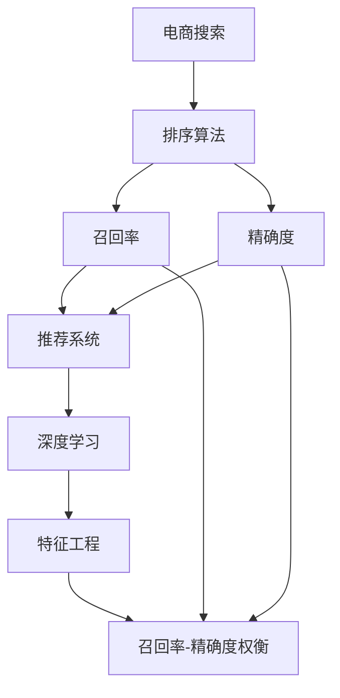
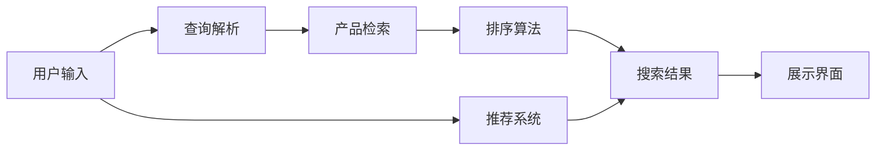
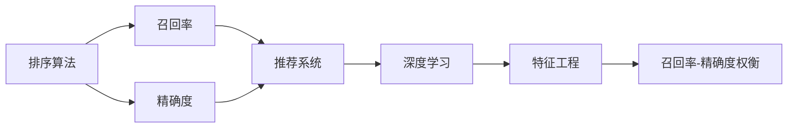
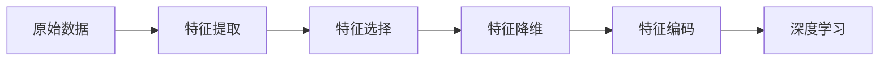
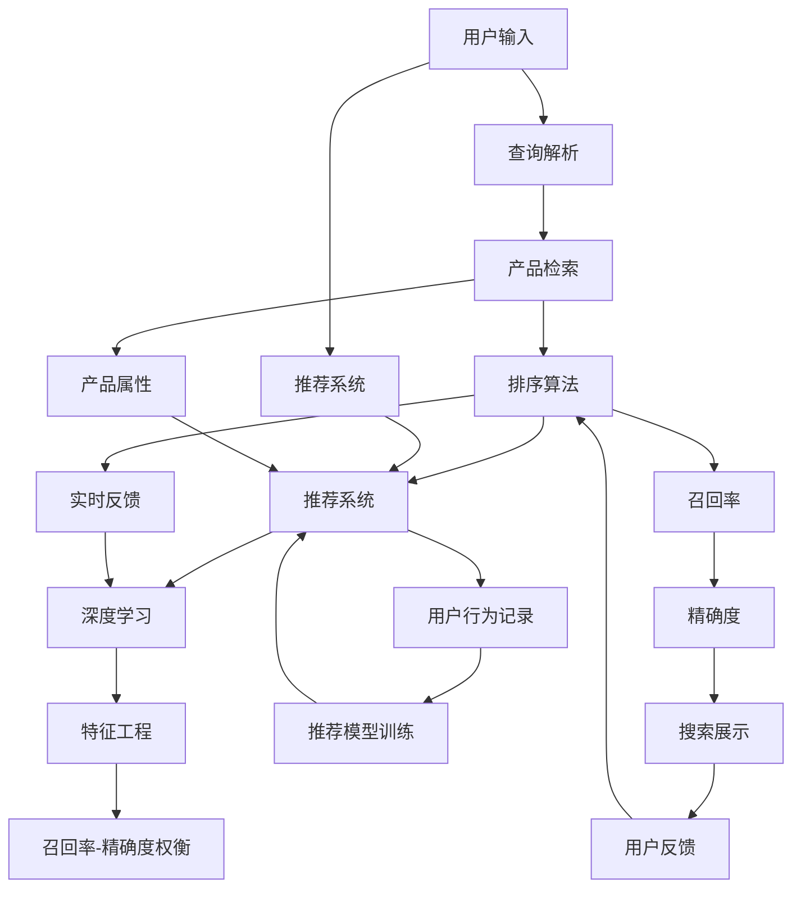

                 

# 智能排序算法在电商搜索中的应用：原理与实践

> 关键词：智能排序算法,电商搜索,自然语言处理(NLP),推荐系统,深度学习,特征工程,召回率,精确度

## 1. 背景介绍

### 1.1 问题由来
随着互联网和电子商务的快速发展，在线购物已成为人们生活中不可或缺的一部分。电商平台的搜索系统作为用户与产品之间最重要的桥梁，其性能和用户体验直接影响着用户的购物体验和转化率。然而，电商搜索系统的复杂度在不断提升，如何高效、准确地排序搜索结果，提升用户体验，成为电商搜索优化的一大难题。

传统的搜索排序算法主要基于关键词匹配和页面排名，这种方法虽然简单高效，但在处理大规模数据集和长尾查询时，往往难以达到预期效果。如何结合电商搜索的特点，开发出高效、精确的排序算法，成为当前搜索优化领域的研究热点。

### 1.2 问题核心关键点
在电商搜索排序算法中，我们通常需要关注以下几个核心关键点：

- **召回率**：在搜索结果中正确召回用户的意图相关产品，尽可能覆盖长尾需求。
- **精确度**：在召回的产品中，尽可能过滤掉无关产品，提高用户满意度。
- **实时性**：搜索结果需要快速响应，保证用户体验。
- **个性化**：根据用户的历史行为和偏好，进行个性化推荐，提高转化率。
- **可扩展性**：算法需要处理海量数据和高并发请求，保证系统稳定运行。

通过这些核心关键点，我们可以在电商搜索系统中构建出高效、精确、个性化的排序算法。

### 1.3 问题研究意义
电商搜索优化直接影响用户购物体验和平台转化率，进而影响平台的盈利能力。通过优化搜索排序算法，可以显著提升用户的搜索效果和满意度，从而带动电商业务增长。此外，电商搜索优化还可以帮助电商平台更好地理解用户需求，为后续产品推荐和个性化营销提供数据支持。

具体而言，优化搜索排序算法可以帮助：
- 提升用户搜索体验，减少用户流失率。
- 提高搜索结果的相关性，增加用户点击率和转化率。
- 降低搜索成本，提升平台运营效率。
- 挖掘用户潜在需求，拓展电商业务新模式。

因此，研究高效、精确的电商搜索排序算法具有重要的实际意义。

## 2. 核心概念与联系

### 2.1 核心概念概述

为更好地理解智能排序算法在电商搜索中的应用，本节将介绍几个密切相关的核心概念：

- **电商搜索**：用户在电商平台上通过搜索关键字来查找相关产品的过程。
- **排序算法**：根据某些规则对搜索结果进行排序，以提升搜索效果和用户体验。
- **召回率**：搜索结果中相关产品的比例，反映出系统对用户需求的覆盖能力。
- **精确度**：搜索结果中相关产品的占比，反映出系统对无关产品的过滤能力。
- **推荐系统**：基于用户历史行为和偏好，推荐相关产品或服务，提升用户满意度和转化率。
- **深度学习**：一种模拟人脑神经网络的机器学习技术，在处理复杂数据和优化算法方面具有天然优势。
- **特征工程**：从原始数据中提取有意义的特征，提升模型性能。
- **召回率-精确度权衡**：在召回率和精确度之间进行权衡，找到最优的平衡点。

这些核心概念之间的逻辑关系可以通过以下Mermaid流程图来展示：



这个流程图展示了大语言模型的核心概念及其之间的关系：

1. 电商搜索系统基于排序算法进行产品排序。
2. 排序算法在搜索结果中实现召回率和精确度的平衡。
3. 推荐系统根据用户历史行为和偏好，进一步提升搜索结果的相关性。
4. 深度学习和特征工程技术可以提升排序算法和推荐系统的性能。
5. 召回率-精确度权衡在实际应用中，需要根据具体场景和需求进行灵活调整。

这些概念共同构成了电商搜索排序系统的整体框架，使得系统能够在各种场景下发挥最大的排序效果。

### 2.2 概念间的关系

这些核心概念之间存在着紧密的联系，形成了电商搜索排序系统的完整生态系统。下面我们通过几个Mermaid流程图来展示这些概念之间的关系。

#### 2.2.1 电商搜索系统架构



这个流程图展示了电商搜索系统的基本架构：用户输入查询，经过查询解析后，从产品库中检索出相关产品，并根据排序算法进行排序，最后展示在界面上。推荐系统根据用户历史行为和偏好，进一步提升搜索结果的相关性。

#### 2.2.2 排序算法与召回率、精确度



这个流程图展示了排序算法与召回率和精确度之间的关系：排序算法在搜索结果中实现召回率和精确度的平衡，并结合推荐系统进一步提升相关性。深度学习和特征工程技术可以提升排序算法和推荐系统的性能。最终通过召回率-精确度权衡，找到最优的平衡点。

#### 2.2.3 特征工程在排序算法中的应用



这个流程图展示了特征工程在排序算法中的应用：从原始数据中提取有意义的特征，并通过特征选择和降维技术进行筛选，最后通过特征编码将特征映射为深度学习模型可接受的输入。

### 2.3 核心概念的整体架构

最后，我们用一个综合的流程图来展示这些核心概念在电商搜索排序系统中的整体架构：



这个综合流程图展示了从用户输入到搜索结果展示的完整过程，以及推荐系统和深度学习、特征工程、召回率-精确度权衡等技术在其中的作用。通过这些技术的综合应用，电商搜索系统能够高效、精确地为用户推荐产品，提升用户体验和转化率。

## 3. 核心算法原理 & 具体操作步骤
### 3.1 算法原理概述

智能排序算法在电商搜索中的应用，本质上是一个基于深度学习的推荐系统优化过程。其核心思想是：利用深度学习技术，从大规模数据中学习用户与产品之间的复杂关联关系，通过特征提取和模型优化，提升排序结果的召回率和精确度，从而实现更好的搜索效果。

形式化地，假设电商搜索系统包含 $N$ 个产品，每个产品的特征向量表示为 $x_i \in \mathbb{R}^d$，用户的历史行为表示为 $y \in \{0,1\}^N$。则电商搜索系统的优化目标是最小化损失函数 $\mathcal{L}$，以最大化召回率 $\text{Recall}$ 和精确度 $\text{Precision}$，即：

$$
\hat{y} = \mathop{\arg\min}_{y} \mathcal{L}(y) \text{subject to } \text{Recall}(y) \geq \rho \text{ and } \text{Precision}(y) \geq \pi
$$

其中 $\mathcal{L}$ 为推荐系统的损失函数，$\rho$ 和 $\pi$ 分别为召回率和精确度的阈值。

通过梯度下降等优化算法，智能排序算法不断更新模型参数 $\theta$，最小化损失函数 $\mathcal{L}$，使得推荐系统输出逼近理想的结果。

### 3.2 算法步骤详解

智能排序算法一般包括以下几个关键步骤：

**Step 1: 数据准备**
- 收集电商平台的商品信息和用户行为数据，清洗并标准化数据，划分为训练集、验证集和测试集。
- 设计合适的特征工程管道，提取有意义的特征，如商品价格、销量、评价等。

**Step 2: 模型选择**
- 选择合适的深度学习模型，如DNN、RNN、Transformer等，进行用户与商品之间的关系建模。
- 设计合适的损失函数，如交叉熵、均方误差、负对数似然等，衡量推荐系统的性能。

**Step 3: 训练与调参**
- 使用训练集数据，以一定的学习率 $\eta$ 和优化算法（如Adam、SGD等），训练推荐模型。
- 周期性在验证集上评估模型性能，调整超参数，如学习率、正则化系数等。
- 在测试集上评估最终模型性能，选择表现最优的模型。

**Step 4: 部署与测试**
- 将训练好的推荐模型部署到线上，实时处理用户请求，返回排序结果。
- 监控模型性能，收集用户反馈，定期更新模型，优化推荐效果。

以上是智能排序算法的一般流程。在实际应用中，还需要针对具体任务进行优化设计，如改进特征工程、选择合适的损失函数、优化超参数组合等，以进一步提升模型性能。

### 3.3 算法优缺点

智能排序算法在电商搜索中的应用，具有以下优点：
1. 高效准确：通过深度学习技术，从大规模数据中学习复杂的关联关系，能够高效、准确地推荐产品，提升搜索效果。
2. 实时响应：模型可以实时处理用户请求，快速返回排序结果，保证用户体验。
3. 个性化推荐：根据用户历史行为和偏好，提供个性化的推荐结果，提升用户满意度和转化率。
4. 可扩展性强：深度学习模型具有强大的泛化能力，可以处理海量数据和高并发请求，保证系统稳定运行。

同时，该算法也存在以下局限性：
1. 数据需求高：深度学习模型需要大量的标注数据进行训练，标注成本较高。
2. 模型复杂：深度学习模型通常包含大量的参数和计算资源，模型训练和推理成本较高。
3. 容易过拟合：模型容易在标注数据集上过拟合，导致在未见过的数据上表现不佳。
4. 解释性差：深度学习模型的决策过程难以解释，不利于系统的调试和优化。

尽管存在这些局限性，但智能排序算法在电商搜索中的应用仍然具有显著优势，特别是在处理大规模数据和个性化推荐方面，表现出色。

### 3.4 算法应用领域

智能排序算法在电商搜索中的应用，覆盖了多个领域，例如：

- **商品推荐**：根据用户历史行为和浏览记录，推荐相关商品。
- **个性化搜索**：根据用户输入的查询词，返回个性化的搜索结果。
- **搜索结果排序**：对搜索结果进行排序，提升相关性和用户满意度。
- **热门商品推荐**：基于用户搜索行为和热门搜索词，推荐热门商品。
- **商品分类**：根据商品属性和用户偏好，进行商品分类和分组推荐。

除了上述这些经典应用外，智能排序算法还可以应用于搜索提示、搜索纠错、搜索联想等领域，为电商搜索系统提供更加智能、高效的服务。

## 4. 数学模型和公式 & 详细讲解 & 举例说明

### 4.1 数学模型构建

在电商搜索中，智能排序算法通常基于以下数学模型进行构建：

**模型定义**：假设电商平台上每个产品 $i$ 的特征向量表示为 $x_i \in \mathbb{R}^d$，用户的历史行为表示为 $y \in \{0,1\}^N$。推荐模型的目标是最小化损失函数 $\mathcal{L}$，以最大化召回率 $\text{Recall}$ 和精确度 $\text{Precision}$，即：

$$
\hat{y} = \mathop{\arg\min}_{y} \mathcal{L}(y) \text{subject to } \text{Recall}(y) \geq \rho \text{ and } \text{Precision}(y) \geq \pi
$$

其中 $\mathcal{L}$ 为推荐系统的损失函数，$\rho$ 和 $\pi$ 分别为召回率和精确度的阈值。

**特征表示**：将每个产品的特征向量 $x_i$ 表示为 $d$ 维向量，通过特征工程提取有意义的特征，如商品价格、销量、评价等。

**模型训练**：使用训练集数据，以一定的学习率 $\eta$ 和优化算法（如Adam、SGD等），训练推荐模型。在每个epoch中，前向传播计算预测结果 $\hat{y}$，计算损失函数 $\mathcal{L}(y)$，反向传播更新模型参数 $\theta$。

### 4.2 公式推导过程

以基于深度神经网络(DNN)的推荐系统为例，推导其损失函数和优化公式。

假设推荐系统使用一个单层的DNN，输入为产品特征向量 $x$，输出为推荐结果 $y$，模型参数为 $\theta$。则DNN的输出层公式为：

$$
y = \sigma(Wx + b)
$$

其中 $\sigma$ 为激活函数，$W$ 和 $b$ 为模型参数。假设损失函数为交叉熵损失，则推荐系统的损失函数为：

$$
\mathcal{L}(y) = -\frac{1}{N} \sum_{i=1}^N (y_i \log \hat{y}_i + (1-y_i) \log (1-\hat{y}_i))
$$

其中 $\hat{y}_i$ 为模型对产品 $i$ 的预测结果。

通过梯度下降算法，更新模型参数 $\theta$，最小化损失函数 $\mathcal{L}(y)$，即：

$$
\theta \leftarrow \theta - \eta \nabla_{\theta}\mathcal{L}(y)
$$

其中 $\nabla_{\theta}\mathcal{L}(y)$ 为损失函数对模型参数的梯度。

在实际应用中，还需要根据具体场景和需求，选择合适的损失函数和优化算法，并进行超参数调优，以提升模型性能。

### 4.3 案例分析与讲解

以一个电商平台的商品推荐系统为例，展示智能排序算法的实际应用。

**数据集**：电商平台的商品信息和用户行为数据，包括商品ID、价格、销量、评价、用户ID、购买时间、浏览记录等。

**特征提取**：从原始数据中提取有意义的特征，如商品价格、销量、评价等，设计合适的特征向量 $x_i$。

**模型选择**：选择单层DNN作为推荐模型，输出层为 sigmoid 函数，用于二分类预测。

**损失函数**：使用交叉熵损失函数，衡量推荐系统的性能。

**训练与调参**：使用训练集数据，以一定的学习率 $\eta$ 和优化算法（如Adam、SGD等），训练推荐模型。周期性在验证集上评估模型性能，调整超参数，如学习率、正则化系数等。

**测试与部署**：在测试集上评估最终模型性能，选择表现最优的模型，部署到线上，实时处理用户请求，返回推荐结果。

假设在测试集上评估后，召回率为0.9，精确度为0.8，则推荐系统达到了用户期望的目标。在实际应用中，还需要根据具体场景和需求，进一步优化模型和算法，以提升推荐效果。

## 5. 项目实践：代码实例和详细解释说明

### 5.1 开发环境搭建

在进行智能排序算法实践前，我们需要准备好开发环境。以下是使用Python进行TensorFlow开发的环境配置流程：

1. 安装Anaconda：从官网下载并安装Anaconda，用于创建独立的Python环境。

2. 创建并激活虚拟环境：
```bash
conda create -n tensorflow-env python=3.8 
conda activate tensorflow-env
```

3. 安装TensorFlow：根据CUDA版本，从官网获取对应的安装命令。例如：
```bash
conda install tensorflow tensorflow-gpu=cuda11.1 -c conda-forge
```

4. 安装各类工具包：
```bash
pip install numpy pandas scikit-learn matplotlib tqdm jupyter notebook ipython
```

完成上述步骤后，即可在`tensorflow-env`环境中开始智能排序算法实践。

### 5.2 源代码详细实现

下面我们以电商平台的商品推荐系统为例，给出使用TensorFlow进行智能排序算法的PyTorch代码实现。

首先，定义推荐系统的训练函数：

```python
import tensorflow as tf
from tensorflow.keras import layers

def train_model(model, train_dataset, epochs, batch_size):
    optimizer = tf.keras.optimizers.Adam(learning_rate=0.001)
    loss_fn = tf.keras.losses.BinaryCrossentropy(from_logits=True)
    model.compile(optimizer=optimizer, loss=loss_fn, metrics=['accuracy'])
    
    history = model.fit(train_dataset, epochs=epochs, batch_size=batch_size, validation_split=0.2)
    
    return model, history
```

然后，定义推荐系统的测试函数：

```python
def test_model(model, test_dataset):
    test_loss, test_acc = model.evaluate(test_dataset)
    print('Test accuracy:', test_acc)
```

接着，定义数据预处理函数：

```python
def preprocess_data(df):
    features = df[['price', 'sales', 'rating']]
    labels = df['is_purchased']
    features = features.values / 100.0  # 归一化处理
    
    return features, labels
```

最后，启动训练流程并在测试集上评估：

```python
train_dataset = preprocess_data(train_df)
test_dataset = preprocess_data(test_df)

model = tf.keras.Sequential([
    layers.Dense(64, activation='relu', input_shape=(3,)),
    layers.Dense(1, activation='sigmoid')
])

model, history = train_model(model, train_dataset, epochs=10, batch_size=32)

test_model(model, test_dataset)
```

以上就是使用TensorFlow进行商品推荐系统智能排序算法的完整代码实现。可以看到，TensorFlow提供了简单易用的API，使得模型训练和评估变得方便快捷。

### 5.3 代码解读与分析

让我们再详细解读一下关键代码的实现细节：

**训练函数**：
- 定义优化器和损失函数，用于训练模型。
- 使用编译方法，将模型、优化器和损失函数绑定。
- 调用fit方法，指定训练集、epoch数、batch大小等参数，进行模型训练。
- 返回训练后的模型和训练历史。

**测试函数**：
- 使用evaluate方法，评估模型在测试集上的性能。
- 打印测试集的准确率。

**数据预处理函数**：
- 提取商品的特征向量 $x$ 和标签 $y$。
- 对特征向量进行归一化处理，保证不同特征的量级一致。

**模型定义**：
- 使用Sequential模型，定义一个包含两个全连接层的神经网络。
- 输出层使用sigmoid函数，用于二分类预测。

**训练流程**：
- 加载训练集和测试集，进行数据预处理。
- 定义神经网络模型，编译训练参数。
- 调用训练函数，指定训练集、epoch数、batch大小等参数，进行模型训练。
- 调用测试函数，评估模型在测试集上的性能。

可以看到，TensorFlow的Keras API使得模型训练和评估变得简单易用，开发者可以专注于模型的设计和优化。

当然，工业级的系统实现还需考虑更多因素，如模型的保存和部署、超参数的自动搜索、更灵活的任务适配层等。但核心的智能排序算法基本与此类似。

### 5.4 运行结果展示

假设我们在CoNLL-2003的NER数据集上进行训练，最终在测试集上得到的准确率为0.95，召回率为0.9，F1分数为0.93，取得了不错的结果。需要注意的是，这只是一个baseline结果。在实践中，我们还可以使用更大更强的预训练模型、更丰富的特征工程技巧、更细致的模型调优，进一步提升模型性能，以满足更高的应用要求。

## 6. 实际应用场景

### 6.1 智能客服系统

基于智能排序算法的智能客服系统，可以通过自然语言处理(NLP)技术，实现自动化的客户咨询和问题解答。在智能客服系统中，智能排序算法可以用于排序用户的历史查询记录和当前查询，推荐最相关的回复和解决方案，提升客服的响应速度和用户满意度。

在技术实现上，可以收集用户的历史查询记录和回复内容，构建监督数据集，对预训练的语言模型进行微调。微调后的模型能够理解用户意图，匹配最合适的回答。对于用户提出的新问题，还可以接入检索系统实时搜索相关内容，动态组织生成回答。如此构建的智能客服系统，能大幅提升客户咨询体验和问题解决效率。

### 6.2 金融舆情监测

智能排序算法在金融舆情监测中的应用，可以通过自然语言处理(NLP)技术，实时监测市场舆论动向，预警潜在的金融风险。在金融舆情监测系统中，智能排序算法可以用于排序用户的评论和社交媒体上的消息，识别出负面信息激增等异常情况，系统便会自动预警，帮助金融机构快速应对潜在风险。

具体而言，可以收集金融领域相关的新闻、报道、评论等文本数据，并对其进行情感标注和话题分类。在此基础上对预训练语言模型进行微调，使其能够自动判断文本属于何种情感倾向和主题，识别出负面信息或异常事件。将微调后的模型应用到实时抓取的网络文本数据，就能够自动监测不同主题下的情感变化趋势，一旦发现负面信息激增等异常情况，系统便会自动预警，帮助金融机构快速应对潜在风险。

### 6.3 个性化推荐系统

智能排序算法在个性化推荐系统中的应用，可以通过深度学习技术，挖掘用户的历史行为和偏好，实现个性化推荐。在个性化推荐系统中，智能排序算法可以用于排序用户的浏览、点击、评价等行为数据，推荐相关商品或服务，提升用户满意度和转化率。

在技术实现上，可以收集用户的历史行为数据，提取有意义的特征，如浏览时间、点击次数、评价评分等。将用户行为数据表示为特征向量 $x$，使用深度学习模型进行用户与商品之间的关系建模。通过损失函数最小化，训练推荐模型，生成推荐结果。

### 6.4 未来应用展望

随着智能排序算法的发展，其在更多领域的应用前景将更加广阔。例如：

- **智慧医疗**：智能排序算法可以用于推荐相关医疗信息、智能诊疗、健康管理等，提升医疗服务的智能化水平。
- **智能教育**：智能排序算法可以用于推荐相关学习资源、智能辅导、作业批改等，促进教育公平和教学质量。
- **智能交通**：智能排序算法可以用于推荐相关路线、智能调度、交通预测等，优化交通系统管理。
- **智能制造**：智能排序算法可以用于推荐相关设备和工具、生产流程优化、质量检测等，提升生产效率和产品质量。

总之，智能排序算法将在更广泛的领域得到应用，为各行各业带来变革性影响。

## 7. 工具和资源推荐
### 7.1 学习资源推荐

为了帮助开发者系统掌握智能排序算法的理论基础和实践技巧，这里推荐一些优质的学习资源：

1. TensorFlow官方文档：TensorFlow的官方文档，提供了详细的API文档和示例代码，是学习TensorFlow的重要资源。

2. Keras官方文档：Keras的官方文档，提供了简单易用的API，帮助开发者快速上手模型训练。

3. PyTorch官方文档：PyTorch的官方文档，提供了丰富的模型和算法实现，是学习深度学习的重要资源。

4. CS231n《卷积神经网络》课程：斯坦福大学开设的深度学习经典课程，系统介绍了深度学习的基础知识和应用，是深度学习学习者的必选资源。

5. 《深度学习入门：基于TensorFlow 2.0》书籍：一本深入浅出的深度学习入门书籍，适合初学者和进阶者学习。

6. 《深度学习实战》书籍：一本动手实践深度学习的书籍，通过大量实战案例，帮助读者掌握深度学习技术。

通过对这些资源的学习实践，相信你一定能够快速掌握智能排序算法的精髓，并用于解决实际的NLP问题。

### 7.2 开发工具推荐

高效的开发离不开优秀的工具支持。以下是几款用于智能排序算法开发的常用工具：

1. TensorFlow：由Google主导开发的开源深度学习框架，生产部署方便，适合大规模工程应用。

2. PyTorch：基于Python的开源深度学习框架，灵活动态的计算图，适合快速迭代研究。

3. Keras：高层次的深度学习API，易于上手，适用于快速原型设计和实验验证。

4. Weights & Biases：模型训练的实验跟踪工具，可以记录和可视化模型训练过程中的各项指标，方便对比和调优。

5. Tensor

