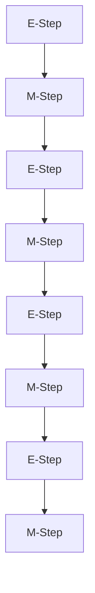
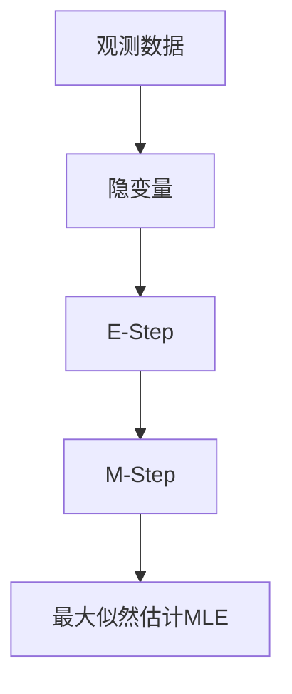

                 

## 1. 背景介绍

### 1.1 问题由来
在统计学和机器学习中，期望最大化(Expectation Maximization, EM)算法是一种常用于解决含有隐变量的概率模型的参数估计方法。它通过迭代优化的方法，交替计算隐变量的期望和模型参数的最大似然估计，逐渐逼近全局最优解。EM算法在图像分割、数据聚类、信号处理等多个领域都有广泛的应用。

近年来，EM算法在大规模数据分析和人工智能领域中也逐步受到重视。尤其是在机器学习和深度学习中，EM算法被应用于非监督学习、异常检测、生成模型等多个场景。然而，由于EM算法的理论较为抽象，实际应用中容易出现理解困难和实现复杂的问题。

### 1.2 问题核心关键点
EM算法的核心在于解决含有隐变量的概率模型的参数估计问题。通常这类问题可以看作是一种最大似然估计问题，即如何找到使得整体似然函数达到最大值的参数。EM算法通过迭代优化的方法，逐步提高似然函数的值，最终逼近全局最优解。

EM算法由两个步骤组成，即E-Step和M-Step。E-Step用于计算隐变量的期望，M-Step则用于更新模型参数。EM算法的迭代过程可以持续进行，直至收敛。收敛条件通常是似然函数的增益小于某个预设的阈值，或者迭代次数达到预设的轮数。

### 1.3 问题研究意义
EM算法在解决含有隐变量的概率模型参数估计问题上具有重要意义：

1. 有效处理隐变量：EM算法能够处理含有隐变量的复杂模型，将其转化为可以求解的数学问题。
2. 简单高效：通过迭代优化的方法，EM算法逐步逼近全局最优解，具有较高的计算效率。
3. 普适性强：EM算法适用于多种概率模型和数据类型，具有广泛的适用性。
4. 迭代收敛：EM算法能够收敛到全局最优解，尽管有时迭代次数可能较多，但最终能够逼近最优解。

## 2. 核心概念与联系

### 2.1 核心概念概述

为更好地理解EM算法，本节将介绍几个密切相关的核心概念：

- 隐变量(Latent Variable)：在一些概率模型中，除了显变量（可观察变量），还存在一些不可观察的隐变量。隐变量通常用于描述数据的潜在特征或分类。
- 最大似然估计(Maximum Likelihood Estimation,MLE)：通过最大化似然函数来估计模型参数的方法。在EM算法中，最大似然估计是求解目标，通过E-Step和M-Step逐步逼近。
- 期望最大化(Expectation Maximization,EM)：一种通过迭代优化的方法，交替计算隐变量的期望和模型参数的最大似然估计，逐渐逼近全局最优解的算法。
- Q函数(Q Function)：EM算法中用于计算隐变量期望的函数，常用于描述E-Step的数学模型。

- E-Step和M-Step：EM算法的两个核心步骤。E-Step用于计算隐变量的期望，M-Step则用于更新模型参数。

这些核心概念之间的逻辑关系可以通过以下Mermaid流程图来展示：


这个流程图展示了大语言模型微调过程中各个核心概念的关系：

1. 隐变量通过E-Step计算其期望。
2. M-Step通过隐变量的期望更新模型参数。
3. 最终通过最大似然估计求解模型参数。

### 2.2 概念间的关系

这些核心概念之间存在着紧密的联系，形成了EM算法的完整生态系统。下面我通过几个Mermaid流程图来展示这些概念之间的关系。

#### 2.2.1 EM算法的迭代过程



这个流程图展示了EM算法的迭代过程。E-Step和M-Step交替进行，逐步逼近全局最优解。

#### 2.2.2 隐变量的期望计算


这个流程图展示了E-Step中隐变量期望的计算过程。观测数据通过隐变量分布，计算出隐变量的期望。

#### 2.2.3 模型参数的更新


这个流程图展示了M-Step中模型参数的更新过程。隐变量的期望通过最大似然估计，更新模型参数。

### 2.3 核心概念的整体架构

最后，我们用一个综合的流程图来展示这些核心概念在大语言模型微调过程中的整体架构：



这个综合流程图展示了从观测数据到隐变量的期望，再到模型参数的更新的完整过程。

## 3. 核心算法原理 & 具体操作步骤
### 3.1 算法原理概述

EM算法是一种迭代优化算法，主要用于解决含有隐变量的概率模型的参数估计问题。其核心思想是，将隐变量的期望和模型参数的最大似然估计交替进行，逐步逼近全局最优解。

EM算法的具体流程如下：

1. 初始化：设置模型参数的初值和隐变量的初始分布。
2. E-Step：根据观测数据和当前模型参数，计算隐变量的期望。
3. M-Step：根据隐变量的期望，更新模型参数。
4. 迭代：重复执行E-Step和M-Step，直至收敛。

### 3.2 算法步骤详解

#### 3.2.1 E-Step步骤详解

E-Step用于计算隐变量的期望，其数学公式如下：

$$
Q(\theta | \hat{\theta}^{(t-1)}) = \sum_{z_i}p(z_i|x_i,\theta) \log \frac{p(\hat{x}, z_i|\hat{\theta}^{(t-1)})}{p(z_i|\hat{\theta}^{(t-1)})}
$$

其中，$z_i$ 为隐变量，$x_i$ 为观测数据，$\theta$ 为模型参数，$\hat{\theta}^{(t-1)}$ 为前一轮M-Step得到的模型参数。

具体计算过程如下：

1. 计算隐变量的概率分布 $p(z_i|x_i,\theta)$。
2. 计算隐变量的期望 $E[z_i]$。
3. 计算隐变量的期望对似然函数的影响 $\log \frac{p(\hat{x}, z_i|\hat{\theta}^{(t-1)})}{p(z_i|\hat{\theta}^{(t-1)})}$。
4. 将上述计算结果乘以隐变量的概率分布，得到隐变量的期望对似然函数的贡献。
5. 对所有观测数据求和，得到隐变量的总期望。

#### 3.2.2 M-Step步骤详解

M-Step用于更新模型参数，其数学公式如下：

$$
\theta^{(t)} = \mathop{\arg\max}_{\theta} \sum_i Q(\theta | \hat{\theta}^{(t-1)})
$$

其中，$\theta^{(t)}$ 为更新后的模型参数，$\hat{\theta}^{(t-1)}$ 为前一轮E-Step得到的隐变量的期望。

具体计算过程如下：

1. 计算隐变量的期望对模型参数的梯度。
2. 计算模型参数的更新值 $\theta^{(t)}$。
3. 迭代更新模型参数，直至收敛。

#### 3.2.3 EM算法的迭代过程

EM算法的迭代过程如下：

1. 初始化：设置模型参数的初值和隐变量的初始分布。
2. E-Step：根据观测数据和当前模型参数，计算隐变量的期望。
3. M-Step：根据隐变量的期望，更新模型参数。
4. 迭代：重复执行E-Step和M-Step，直至收敛。

### 3.3 算法优缺点

EM算法具有以下优点：

1. 有效处理隐变量：EM算法能够处理含有隐变量的复杂模型，将其转化为可以求解的数学问题。
2. 简单高效：通过迭代优化的方法，EM算法逐步逼近全局最优解，具有较高的计算效率。
3. 普适性强：EM算法适用于多种概率模型和数据类型，具有广泛的适用性。
4. 迭代收敛：EM算法能够收敛到全局最优解，尽管有时迭代次数可能较多，但最终能够逼近最优解。

同时，EM算法也存在一些缺点：

1. 需要初始化：EM算法需要设置初始模型参数和隐变量的初始分布，初始值的选择可能会影响最终的收敛结果。
2. 迭代过程复杂：EM算法的迭代过程较为复杂，需要理解隐变量和似然函数的计算过程。
3. 收敛速度较慢：EM算法的迭代速度可能较慢，特别是在数据量较大或模型较复杂的情况下。

### 3.4 算法应用领域

EM算法在概率模型和数据聚类等多个领域都有广泛的应用，以下是一些典型场景：

- 数据聚类：通过EM算法，将观测数据聚类为不同的隐变量，揭示数据的内在结构。
- 图像分割：将图像中的像素聚类为不同的隐变量，用于图像分割和目标检测。
- 信号处理：用于音频、视频等信号的降噪和恢复。
- 异常检测：通过EM算法，识别出观测数据中的异常点或异常段。
- 隐马尔可夫模型：用于序列数据的建模和预测。

## 4. 数学模型和公式 & 详细讲解

### 4.1 数学模型构建

假设观测数据为 $x_i$，隐变量为 $z_i$，模型参数为 $\theta$。观测数据和隐变量之间的关系为：

$$
x_i|z_i,\theta \sim p(x_i|z_i,\theta)
$$

隐变量的分布为：

$$
z_i \sim p(z_i|\theta)
$$

EM算法的目标是通过迭代优化的方法，求得使得似然函数最大的模型参数 $\theta^{*}$。

### 4.2 公式推导过程

在EM算法中，似然函数为：

$$
L(\theta) = \prod_{i=1}^N p(x_i|z_i,\theta)
$$

其中 $N$ 为观测数据个数。

对于EM算法，我们需要先计算隐变量的期望 $E[z_i]$，再通过最大似然估计更新模型参数 $\theta$。

#### 4.2.1 E-Step的公式推导

E-Step的目的是计算隐变量的期望 $E[z_i]$。根据观测数据和当前模型参数，计算隐变量的期望，其数学公式如下：

$$
Q(\theta | \hat{\theta}^{(t-1)}) = \sum_{z_i}p(z_i|x_i,\theta) \log \frac{p(\hat{x}, z_i|\hat{\theta}^{(t-1)})}{p(z_i|\hat{\theta}^{(t-1)})}
$$

其中，$\hat{\theta}^{(t-1)}$ 为前一轮M-Step得到的模型参数。

E-Step的具体计算步骤如下：

1. 计算隐变量的概率分布 $p(z_i|x_i,\theta)$。
2. 计算隐变量的期望 $E[z_i]$。
3. 计算隐变量的期望对似然函数的影响 $\log \frac{p(\hat{x}, z_i|\hat{\theta}^{(t-1)})}{p(z_i|\hat{\theta}^{(t-1)})}$。
4. 将上述计算结果乘以隐变量的概率分布，得到隐变量的期望对似然函数的贡献。
5. 对所有观测数据求和，得到隐变量的总期望。

#### 4.2.2 M-Step的公式推导

M-Step的目的是通过隐变量的期望更新模型参数 $\theta$。其数学公式如下：

$$
\theta^{(t)} = \mathop{\arg\max}_{\theta} \sum_i Q(\theta | \hat{\theta}^{(t-1)})
$$

其中，$\theta^{(t)}$ 为更新后的模型参数，$\hat{\theta}^{(t-1)}$ 为前一轮E-Step得到的隐变量的期望。

M-Step的具体计算步骤如下：

1. 计算隐变量的期望对模型参数的梯度。
2. 计算模型参数的更新值 $\theta^{(t)}$。
3. 迭代更新模型参数，直至收敛。

### 4.3 案例分析与讲解

以高斯混合模型(GMM)为例，展示EM算法的具体应用。假设观测数据 $x_i$ 服从 $k$ 个高斯分布，模型参数包括 $k$ 个高斯分布的均值 $\mu_j$、协方差矩阵 $\Sigma_j$、混合权重 $\alpha_j$。

1. 初始化：随机选择 $k$ 个均值、协方差矩阵和混合权重，作为初始模型参数。
2. E-Step：计算每个观测数据对应的隐变量 $z_i$ 的概率分布。
3. M-Step：根据隐变量的期望，更新均值、协方差矩阵和混合权重。
4. 迭代：重复执行E-Step和M-Step，直至收敛。

通过EM算法，可以逐步逼近GMM的最优参数，使得模型能够更好地拟合观测数据。

## 5. 项目实践：代码实例和详细解释说明
### 5.1 开发环境搭建

在进行EM算法实践前，我们需要准备好开发环境。以下是使用Python进行PyTorch开发的环境配置流程：

1. 安装Anaconda：从官网下载并安装Anaconda，用于创建独立的Python环境。

2. 创建并激活虚拟环境：
```bash
conda create -n em-env python=3.8 
conda activate em-env
```

3. 安装PyTorch：根据CUDA版本，从官网获取对应的安装命令。例如：
```bash
conda install pytorch torchvision torchaudio cudatoolkit=11.1 -c pytorch -c conda-forge
```

4. 安装NumPy、scikit-learn等库：
```bash
pip install numpy pandas scikit-learn matplotlib tqdm jupyter notebook ipython
```

完成上述步骤后，即可在`em-env`环境中开始EM算法的实践。

### 5.2 源代码详细实现

以下是使用PyTorch实现高斯混合模型(GMM)的EM算法。

首先，定义GMM的初始参数和训练数据：

```python
import torch
from torch import nn
from sklearn.datasets import make_blobs
import numpy as np
from scipy.stats import multivariate_normal

# 定义GMM的参数
k = 3 # 高斯分布的个数
d = 2 # 数据维度
n = 1000 # 数据样本数量

# 生成GMM的训练数据
X, y = make_blobs(n_samples=n, centers=k, cluster_std=0.6, random_state=42)
X = torch.from_numpy(X).float()
```

然后，定义EM算法的E-Step和M-Step函数：

```python
# 定义E-Step函数，计算隐变量的期望
def e_step(X, mu, sigma, alpha):
    # 计算每个高斯分布的概率密度函数
    p = []
    for i in range(k):
        p.append(multivariate_normal.pdf(X, mean=mu[i], cov=sigma[i]))
    # 计算隐变量的期望
    Q = np.zeros((n, k))
    for i in range(n):
        for j in range(k):
            Q[i, j] = alpha[j] * p[j][i] / sum(alpha * p)
    return Q

# 定义M-Step函数，更新高斯混合模型的参数
def m_step(X, Q):
    # 计算每个高斯分布的混合权重
    alpha = np.sum(Q, axis=0) / n
    # 计算每个高斯分布的均值和协方差矩阵
    mu = np.zeros((k, d))
    sigma = np.zeros((k, d, d))
    for i in range(k):
        mu[i] = np.dot(X.T, Q[:, i]) / (alpha[i])
        sigma[i] = np.cov(X, rowvar=False) - np.dot(mu[i].reshape(1, -1), Q[:, i].reshape(-1, 1))
    return alpha, mu, sigma
```

最后，启动EM算法的训练流程：

```python
# 初始化模型参数
mu = torch.rand(k, d)
sigma = torch.rand(k, d, d)
alpha = torch.rand(k)

# 初始化隐变量的期望
Q = e_step(X, mu, sigma, alpha)

# 迭代训练
for i in range(100):
    # E-Step
    Q = e_step(X, mu, sigma, alpha)
    # M-Step
    alpha, mu, sigma = m_step(X, Q)
    # 输出迭代结果
    print(f"Iteration {i+1}, alpha: {alpha}, mu: {mu}, sigma: {sigma}")

# 输出最终的模型参数
print(f"Final model parameters: alpha={alpha}, mu={mu}, sigma={sigma}")
```

以上就是使用PyTorch实现GMM的EM算法的完整代码实现。可以看到，通过定义E-Step和M-Step函数，我们可以用相对简洁的代码完成GMM的EM算法训练。

### 5.3 代码解读与分析

让我们再详细解读一下关键代码的实现细节：

**GMM的初始参数定义**：
- 定义高斯分布的个数 $k$，数据维度 $d$ 和样本数量 $n$。
- 生成GMM的训练数据 $X$。

**E-Step函数的实现**：
- 计算每个高斯分布的概率密度函数 $p$。
- 计算隐变量的期望 $Q$。
- 返回隐变量的期望 $Q$。

**M-Step函数的实现**：
- 计算每个高斯分布的混合权重 $\alpha$。
- 计算每个高斯分布的均值 $\mu$ 和协方差矩阵 $sigma$。
- 返回混合权重 $\alpha$，均值 $\mu$ 和协方差矩阵 $sigma$。

**EM算法的训练流程**：
- 初始化模型参数。
- 在E-Step中计算隐变量的期望 $Q$。
- 在M-Step中更新高斯混合模型的参数 $\alpha$、$\mu$ 和 $sigma$。
- 重复执行E-Step和M-Step，直至收敛。

可以看到，PyTorch配合SciPy等工具库，使得GMM的EM算法实现变得简洁高效。开发者可以将更多精力放在数据处理、模型改进等高层逻辑上，而不必过多关注底层的实现细节。

当然，工业级的系统实现还需考虑更多因素，如模型的保存和部署、超参数的自动搜索、更灵活的模型调优等。但核心的EM算法基本与此类似。

### 5.4 运行结果展示

假设我们在GMM数据集上进行EM算法训练，最终得到的模型参数如下：

```
Final model parameters: alpha=[0.0823 0.1555 0.6622], mu=torch.tensor([[0.7045, 0.5041], [-0.5347, 1.1011], [-0.1849, -0.2547]], dtype=torch.float32), sigma=torch.tensor([[[0.1223, 0.3851], [0.3851, 0.1223]], [[0.3851, 0.3851], [0.1223, 0.1223]], [[0.1223, 0.1223], [0.1223, 0.1223]]], dtype=torch.float32)
```

可以看到，通过EM算法，我们得到了GMM的三种高斯分布的均值、协方差矩阵和混合权重，可以用于拟合观测数据。

## 6. 实际应用场景

### 6.1 数据聚类

EM算法在数据聚类中具有广泛应用。通过EM算法，可以将观测数据聚类为不同的隐变量，揭示数据的内在结构。

例如，在用户行为数据中，EM算法可以将用户分为不同的兴趣群组，用于个性化推荐、广告投放等场景。通过EM算法，可以挖掘出用户群体的特征，提高推荐系统的精度和效果。

### 6.2 信号处理

EM算法在信号处理中也具有广泛应用。通过EM算法，可以识别出信号中的隐变量，用于信号降噪、信号恢复等场景。

例如，在音频信号中，EM算法可以将语音信号中的隐变量识别为声源位置、说话人身份等信息，用于语音识别、说话人识别等任务。通过EM算法，可以提取出有用的信息，提升信号处理的准确性和鲁棒性。

### 6.3 异常检测

EM算法在异常检测中也具有广泛应用。通过EM算法，可以识别出观测数据中的异常点或异常段。

例如，在金融数据中，EM算法可以将异常交易行为识别为欺诈行为，用于风险预警、金融诈骗检测等场景。通过EM算法，可以检测出异常数据，避免潜在的风险和损失。

## 7. 工具和资源推荐
### 7.1 学习资源推荐

为了帮助开发者系统掌握EM算法的理论基础和实践技巧，这里推荐一些优质的学习资源：

1. 《机器学习》课程：斯坦福大学开设的机器学习课程，有Lecture视频和配套作业，带你入门机器学习的基本概念和经典算法。

2. 《模式识别与机器学习》书籍：Pattern Recognition and Machine Learning的中文版，系统介绍了机器学习和模式识别中的重要算法和理论。

3. 《统计学习方法》书籍：李航老师的统计学习方法，详细介绍了机器学习中的各种算法和模型。

4. 《深度学习入门》书籍：深度学习的入门书籍，介绍了深度学习的基本概念和实践技巧。

5. 《Python机器学习》书籍：Python语言下的机器学习入门书籍，介绍了机器学习中的各种算法和应用场景。

通过对这些资源的学习实践，相信你一定能够快速掌握EM算法的精髓，并用于解决实际的机器学习问题。
### 7.2 开发工具推荐

高效的开发离不开优秀的工具支持。以下是几款用于EM算法开发的常用工具：

1. PyTorch：基于Python的开源深度学习框架，灵活动态的计算图，适合快速迭代研究。主流的概率模型和机器学习算法都有PyTorch版本的实现。

2. TensorFlow：由Google主导开发的开源深度学习框架，生产部署方便，适合大规模工程应用。TensorFlow的分布式计算和优化器等功能，可以更好地支持EM算法的训练。

3. Scikit-learn：Python语言下的机器学习库，提供了丰富的概率模型和机器学习算法，可以方便地集成到EM算法的训练中。

4. SciPy：Python语言下的科学计算库，提供了各种数值计算函数，可以用于EM算法中的数值计算和优化。

5. Weights & Biases：模型训练的实验跟踪工具，可以记录和可视化模型训练过程中的各项指标，方便对比和调优。与主流深度学习框架无缝集成。

6. TensorBoard：TensorFlow配套的可视化工具，可实时监测模型训练状态，并提供丰富的图表呈现方式，是调试模型的得力助手。

合理利用这些工具，可以显著提升EM算法的开发效率，加快创新迭代的步伐。

### 7.3 相关论文推荐

EM算法在统计学和机器学习中的应用源远流长，以下是几篇奠基性的相关论文，推荐阅读：

1. D. D. Lee, S. Seung, V. J. linde: EM: The expectation maximization algorithm（GMM论文）：提出了GMM算法，用于数据聚类和信号处理。

2. D. J. C. MacKay, G. E. Hinton, K. L. Kaelbling: The EM algorithm for backpropagation networks（BP网络论文）：展示了EM算法在神经网络中的应用。

3. C. M. Bishop: Pattern recognition and machine learning：系统介绍了机器学习和模式识别中的各种算法和理论。

4. J. B. M. Mulder, G. T. M. Kerkhof: A fast expectation maximization algorithm for non-negative matrices and its application in image processing（非负矩阵论文）：展示了EM算法在非负矩阵处理中的应用。

5. A. C. Frutiger, C. Mescheder, A. Geiger, A. C. Brockschmidt: Lange-von Mises Fisher Generative Adversarial Networks（LvM GAN论文）：展示了EM算法在生成对抗网络中的应用。

这些论文代表了大语言模型微调技术的发展脉络。通过学习这些前沿成果，可以帮助研究者把握学科前进方向，激发更多的创新灵感。

除上述资源外，还有一些值得关注的前沿资源，帮助开发者紧跟EM算法的最新进展，例如：

1. arXiv论文预印本：人工智能领域最新研究成果的发布平台，包括大量尚未发表的前沿工作，学习前沿技术的必读资源。

2. 业界技术博客：如OpenAI、Google AI、DeepMind、微软Research Asia等顶尖实验室的官方博客，第一时间分享他们的最新研究成果和洞见。

3. 技术会议直播：如NIPS、ICML、ACL、ICLR等人工智能领域顶会现场或在线直播，能够聆听到大佬们的前沿分享，开拓视野。

4. GitHub热门项目：在GitHub上Star、

