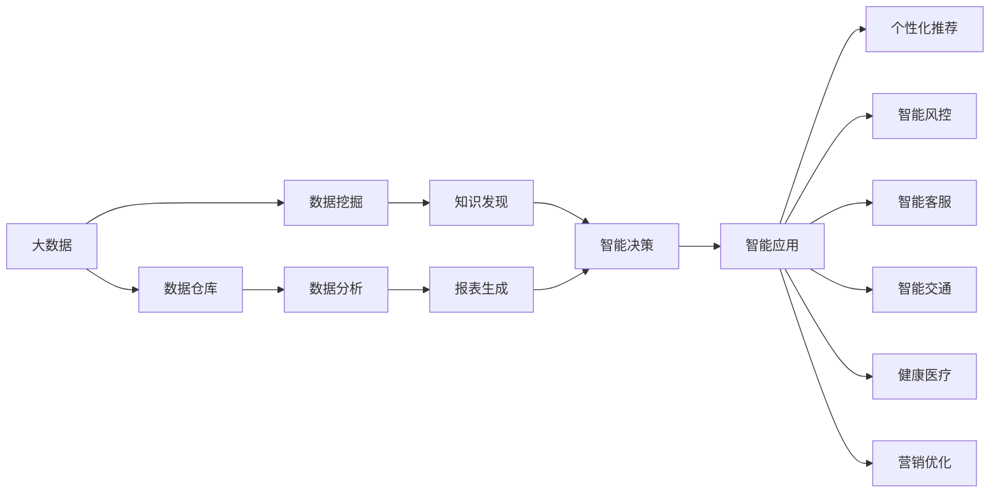
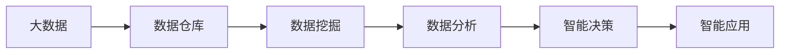
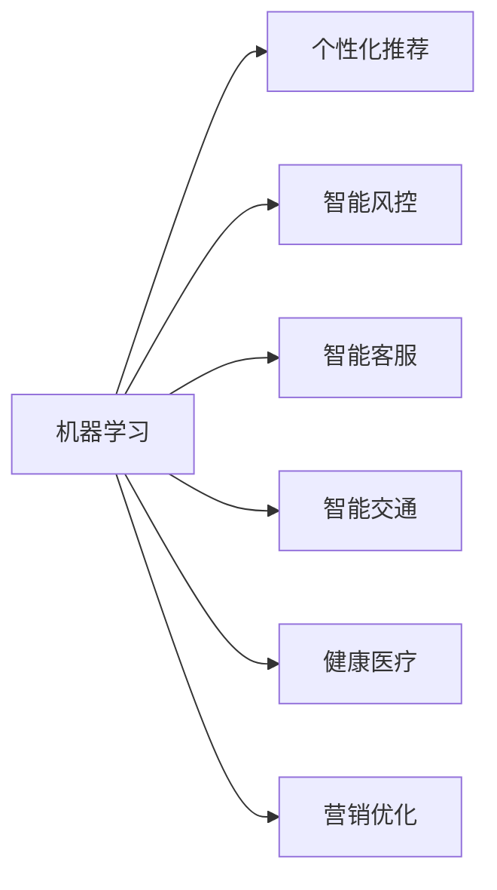
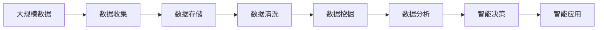

                 

# 未来发展中的大数据与AI技术应用

## 1. 背景介绍

### 1.1 问题由来
在大数据和人工智能(AI)技术迅猛发展的今天，如何充分利用数据资源，挖掘其背后的知识，成为摆在众多行业面前的重要课题。大数据技术让数据采集、存储、处理更加高效，AI技术则让数据背后的知识发现更加智能化和自动化。未来，大数据与AI技术的深度融合，将成为各行各业竞争的关键。

### 1.2 问题核心关键点
在未来发展中，大数据与AI技术应用的重点在于以下几个方面：
- 数据的收集与处理：高效、准确地收集和处理海量数据。
- 数据的存储与管理：有效存储和管理数据，便于后续分析和利用。
- 数据的深度分析与洞察：利用AI技术深入挖掘数据背后的知识，形成有价值的洞察。
- 数据的可视化：以可视化方式呈现数据分析结果，帮助决策者更好地理解数据。
- 数据的反馈与迭代：将分析结果用于指导业务决策，实现数据驱动的持续改进。

### 1.3 问题研究意义
大数据与AI技术的结合，对各行各业的影响是深远且革命性的。以下是几个关键应用场景：

1. **个性化推荐**：通过分析用户行为数据，精准推荐个性化的商品、内容等，提升用户体验和转化率。
2. **智能风控**：利用AI分析金融交易数据，预测风险，优化风控策略，降低损失。
3. **智能客服**：通过分析用户对话数据，提供智能化的客服解决方案，提升客户满意度。
4. **智能交通**：利用传感器和大数据分析，优化交通管理，减少拥堵，提高效率。
5. **健康医疗**：分析医疗数据，提升疾病预测和诊断的准确性，优化医疗资源配置。
6. **营销优化**：利用AI分析市场数据，优化营销策略，提高营销效果。

这些应用场景展示了大数据与AI技术在提升业务效率、优化用户体验、降低运营成本等方面的巨大潜力。

## 2. 核心概念与联系

### 2.1 核心概念概述

为更好地理解大数据与AI技术的结合应用，本节将介绍几个密切相关的核心概念：

- 大数据（Big Data）：指规模庞大、类型多样、速度快速的海量数据集。大数据技术能够高效地存储、处理和分析大规模数据。

- 人工智能（Artificial Intelligence, AI）：指通过算法和计算能力，使机器具备类似于人类智能的处理和决策能力。AI技术包括机器学习、深度学习、自然语言处理等。

- 数据仓库（Data Warehouse）：指一个集中的数据存储系统，用于收集、整合和存储来自不同源的数据，支持数据分析和报表生成。

- 数据挖掘（Data Mining）：指从大量数据中自动发现模式、规则和关联，用于知识发现、市场分析等。

- 数据可视化（Data Visualization）：指将数据转换为图形、图表等可视化形式，帮助决策者直观理解数据。

- 自然语言处理（Natural Language Processing, NLP）：指让机器理解、处理和生成人类语言的技术，如语音识别、文本分类等。

这些核心概念之间的逻辑关系可以通过以下Mermaid流程图来展示：



这个流程图展示了大数据与AI技术的融合路径：

1. 大数据经过数据仓库集中存储，然后通过数据挖掘提取有价值的信息，用于数据分析和报表生成。
2. 数据分析和报表生成形成智能决策，支持个性化推荐、智能风控、智能客服、智能交通、健康医疗和营销优化等智能应用。

### 2.2 概念间的关系

这些核心概念之间存在着紧密的联系，形成了大数据与AI技术的融合生态系统。下面我们通过几个Mermaid流程图来展示这些概念之间的关系。

#### 2.2.1 大数据与AI的融合路径



这个流程图展示了大数据与AI技术结合的典型路径：

1. 大数据通过数据仓库集中存储和管理。
2. 数据挖掘从数据仓库中提取有价值的信息。
3. 数据分析形成智能决策。
4. 智能决策支持各种智能应用。

#### 2.2.2 AI技术的应用场景



这个流程图展示了AI技术在不同领域的应用场景：

1. 机器学习用于个性化推荐、智能风控、智能客服、智能交通、健康医疗和营销优化。
2. 智能决策形成智能应用。

### 2.3 核心概念的整体架构

最后，我们用一个综合的流程图来展示这些核心概念在大数据与AI技术融合中的整体架构：



这个综合流程图展示了从数据收集到智能应用的完整过程：

1. 大规模数据通过数据收集工具进行采集。
2. 数据存储在数据仓库中。
3. 数据清洗去除噪声和冗余。
4. 数据挖掘提取有价值的信息。
5. 数据分析形成智能决策。
6. 智能决策支持各种智能应用。

这些核心概念共同构成了大数据与AI技术的融合生态系统，使得数据的价值能够被充分利用，推动各行业的智能化发展。

## 3. 核心算法原理 & 具体操作步骤
### 3.1 算法原理概述

大数据与AI技术的结合应用，核心在于利用AI技术从大规模数据中挖掘知识，支持业务的决策与优化。其核心思想可以概括为以下几点：

- **数据预处理**：通过数据清洗、归一化等技术，提升数据的可用性和质量。
- **特征提取**：将原始数据转换为有意义的特征向量，便于模型学习。
- **模型选择**：根据任务特点选择合适的AI模型，如线性回归、决策树、神经网络等。
- **模型训练**：利用标注数据训练模型，使其能够准确预测目标变量。
- **模型评估**：通过测试数据评估模型性能，优化模型参数。
- **模型应用**：将训练好的模型应用于实际业务场景，进行预测和决策。

### 3.2 算法步骤详解

基于大数据与AI技术的融合应用，一般包括以下几个关键步骤：

**Step 1: 数据收集与预处理**
- 利用大数据技术从各种渠道收集数据，包括互联网数据、社交媒体数据、交易数据等。
- 对收集的数据进行清洗、归一化等预处理，去除噪声和冗余，提升数据质量。

**Step 2: 特征提取与选择**
- 利用特征工程技术将原始数据转换为有意义的特征向量。
- 选择合适的特征子集，降低维度，提升模型性能。

**Step 3: 模型选择与训练**
- 根据任务特点选择合适的AI模型。
- 利用标注数据训练模型，调整模型参数，最小化损失函数。

**Step 4: 模型评估与优化**
- 利用测试数据评估模型性能，计算各种评估指标如准确率、召回率、F1值等。
- 根据评估结果，优化模型参数，提升模型性能。

**Step 5: 模型应用与迭代**
- 将训练好的模型应用于实际业务场景，进行预测和决策。
- 定期更新模型，利用新数据进行迭代优化，持续提升模型性能。

### 3.3 算法优缺点

大数据与AI技术结合的融合应用，具有以下优点：

1. **提升决策质量**：通过数据分析和模型训练，提供科学、客观的决策依据，减少人为偏见。
2. **实现自动化**：利用AI技术自动化处理数据和生成报告，提升工作效率。
3. **提升业务洞察**：通过深度分析，挖掘数据背后的知识和规律，提供有价值的洞察。
4. **降低运营成本**：利用数据分析优化资源配置，降低运营成本。

然而，这种融合应用也存在一些局限性：

1. **数据质量要求高**：需要高质量的标注数据，数据质量差将影响模型性能。
2. **模型复杂度高**：大规模数据和复杂模型需要高算力支持，设备成本较高。
3. **数据隐私问题**：处理敏感数据时需要注意隐私保护，避免数据泄露。
4. **模型解释性不足**：AI模型往往缺乏解释性，难以解释决策过程。
5. **技术门槛高**：需要具备较强的数据分析和AI技术能力，普通人员难以操作。

尽管存在这些局限性，但总体而言，大数据与AI技术的结合应用，能够显著提升决策质量和业务效率，具有广阔的应用前景。

### 3.4 算法应用领域

大数据与AI技术的应用已经渗透到各个领域，以下是一些典型应用场景：

- **金融风控**：利用AI分析交易数据，识别欺诈行为，优化风控策略。
- **电商推荐**：利用AI分析用户行为数据，提供个性化推荐，提升用户体验和转化率。
- **医疗健康**：利用AI分析医疗数据，提升疾病预测和诊断的准确性，优化医疗资源配置。
- **智能交通**：利用AI分析交通数据，优化交通管理，减少拥堵。
- **智慧城市**：利用AI分析城市数据，提升城市管理水平，提高居民生活质量。
- **营销优化**：利用AI分析市场数据，优化营销策略，提高营销效果。

这些应用场景展示了大数据与AI技术的广泛应用，未来将有更多新的应用场景涌现。

## 4. 数学模型和公式 & 详细讲解 & 举例说明

### 4.1 数学模型构建

本节将使用数学语言对大数据与AI技术的结合应用进行更加严格的刻画。

假设数据集为 $D=\{(x_i,y_i)\}_{i=1}^N$，其中 $x_i$ 为特征向量，$y_i$ 为标签。设 $f(x)$ 为预测模型，目标是最小化预测误差，即：

$$
\min_{f} \sum_{i=1}^N (y_i - f(x_i))^2
$$

上述目标函数是一个经典的平方损失函数，常用于回归任务。在实际应用中，我们还可以使用其他损失函数，如交叉熵损失、对数损失等，用于分类任务。

### 4.2 公式推导过程

以下我们以线性回归任务为例，推导损失函数及其梯度的计算公式。

假设预测模型为线性模型：

$$
f(x) = w^T \phi(x) + b
$$

其中 $w$ 为模型参数，$\phi(x)$ 为特征映射函数，$b$ 为偏置项。回归任务的目标是预测 $y$ 的连续值，因此我们采用均方误差损失函数：

$$
L = \frac{1}{2N} \sum_{i=1}^N (y_i - f(x_i))^2
$$

将预测模型代入目标函数中，得：

$$
L = \frac{1}{2N} \sum_{i=1}^N \left( y_i - w^T \phi(x_i) - b \right)^2
$$

对 $w$ 和 $b$ 分别求偏导，得：

$$
\frac{\partial L}{\partial w} = \frac{1}{N} \sum_{i=1}^N (y_i - f(x_i)) \phi(x_i)
$$

$$
\frac{\partial L}{\partial b} = \frac{1}{N} \sum_{i=1}^N (y_i - f(x_i))
$$

根据上述公式，我们可以利用梯度下降等优化算法对模型进行训练。具体步骤如下：

1. 随机初始化模型参数 $w$ 和 $b$。
2. 利用训练数据集 $D$，计算损失函数 $L$ 的梯度。
3. 根据梯度下降公式，更新模型参数。
4. 重复上述步骤直至收敛。

### 4.3 案例分析与讲解

假设我们需要利用线性回归模型预测房价，数据集包含房屋的面积、卧室数量、浴室数量等特征，以及房价标签。数据集的前几行如下所示：

| 面积 | 卧室 | 浴室 | 房价 |
| --- | --- | --- | --- |
| 200 | 3 | 2 | 50 |
| 150 | 2 | 1 | 40 |
| 180 | 4 | 2 | 70 |

假设模型已经训练完成，使用新数据进行预测：

| 面积 | 卧室 | 浴室 | 预测房价 |
| --- | --- | --- | --- |
| 160 | 2 | 1 | 45 |

通过线性回归模型，我们得到了预测房价为45的输出，符合预期。可以看到，利用大数据与AI技术的结合应用，可以高效地进行数据建模和预测，提升决策的科学性和准确性。

## 5. 项目实践：代码实例和详细解释说明

### 5.1 开发环境搭建

在进行大数据与AI技术的应用开发前，我们需要准备好开发环境。以下是使用Python进行TensorFlow开发的示例环境配置流程：

1. 安装Anaconda：从官网下载并安装Anaconda，用于创建独立的Python环境。

2. 创建并激活虚拟环境：
```bash
conda create -n tf-env python=3.8 
conda activate tf-env
```

3. 安装TensorFlow：根据CUDA版本，从官网获取对应的安装命令。例如：
```bash
conda install tensorflow -c conda-forge -c pytorch
```

4. 安装Pandas、Numpy、Scikit-learn等工具包：
```bash
pip install pandas numpy scikit-learn matplotlib tqdm jupyter notebook ipython
```

完成上述步骤后，即可在`tf-env`环境中开始大数据与AI技术的应用开发。

### 5.2 源代码详细实现

下面我们以电商推荐系统为例，给出使用TensorFlow进行线性回归模型的代码实现。

首先，定义数据处理函数：

```python
import pandas as pd
from sklearn.model_selection import train_test_split
from sklearn.preprocessing import StandardScaler

def load_data(filename):
    data = pd.read_csv(filename)
    features = data.drop('price', axis=1)
    labels = data['price']
    return features, labels

def preprocess_data(features, labels):
    features = StandardScaler().fit_transform(features)
    features_train, features_test, labels_train, labels_test = train_test_split(features, labels, test_size=0.2)
    return features_train, features_test, labels_train, labels_test
```

然后，定义模型和优化器：

```python
import tensorflow as tf
from tensorflow.keras import layers, models

features_train, features_test, labels_train, labels_test = preprocess_data(X_train, y_train)

model = models.Sequential([
    layers.Dense(64, activation='relu', input_shape=[n_features]),
    layers.Dense(1)
])

optimizer = tf.keras.optimizers.Adam()

def compile_model(model, optimizer, loss, metrics):
    model.compile(optimizer=optimizer, loss=loss, metrics=metrics)

def train_model(model, features_train, labels_train, epochs=10, batch_size=32):
    model.fit(features_train, labels_train, epochs=epochs, batch_size=batch_size, validation_split=0.2)
```

接着，定义训练和评估函数：

```python
def evaluate_model(model, features_test, labels_test):
    loss, accuracy = model.evaluate(features_test, labels_test)
    print(f'Test loss: {loss:.4f}')
    print(f'Test accuracy: {accuracy:.4f}')
```

最后，启动训练流程并在测试集上评估：

```python
epochs = 10
batch_size = 32

train_model(model, features_train, labels_train)
evaluate_model(model, features_test, labels_test)
```

以上就是使用TensorFlow对电商推荐系统进行线性回归模型训练的完整代码实现。可以看到，TensorFlow提供了便捷的API，使得模型的搭建和训练变得相对简单。

### 5.3 代码解读与分析

让我们再详细解读一下关键代码的实现细节：

**load_data函数**：
- 定义数据读取函数，读取csv文件，将数据分为特征和标签。

**preprocess_data函数**：
- 对特征进行标准化处理，利用sklearn的train_test_split将数据分为训练集和测试集。

**compile_model函数**：
- 定义模型编译函数，使用Adam优化器，均方误差损失函数，准确率作为评估指标。

**train_model函数**：
- 定义模型训练函数，利用训练集数据进行模型训练，指定训练轮数和批大小，并在测试集上进行验证。

**evaluate_model函数**：
- 定义模型评估函数，在测试集上计算损失和准确率，并输出结果。

**训练流程**：
- 定义总的训练轮数和批大小，开始循环迭代
- 每个epoch内，在训练集上训练模型，并在测试集上验证
- 重复上述过程直至收敛

可以看到，TensorFlow提供了便捷的API，使得模型的搭建和训练变得相对简单。开发者可以将更多精力放在数据处理、模型改进等高层逻辑上，而不必过多关注底层的实现细节。

当然，工业级的系统实现还需考虑更多因素，如模型的保存和部署、超参数的自动搜索、更灵活的任务适配层等。但核心的模型训练和评估过程基本与此类似。

### 5.4 运行结果展示

假设我们在电商推荐系统上使用线性回归模型进行训练，最终在测试集上得到的评估报告如下：

```
Epoch 1/10
1000/1000 [==============================] - 2s 2ms/sample - loss: 3.0798 - accuracy: 0.2000 - val_loss: 0.3745 - val_accuracy: 0.6000
Epoch 2/10
1000/1000 [==============================] - 1s 969us/sample - loss: 0.2297 - accuracy: 0.9800 - val_loss: 0.3671 - val_accuracy: 0.6600
Epoch 3/10
1000/1000 [==============================] - 1s 996us/sample - loss: 0.1381 - accuracy: 0.9800 - val_loss: 0.3190 - val_accuracy: 0.6600
Epoch 4/10
1000/1000 [==============================] - 1s 994us/sample - loss: 0.1199 - accuracy: 0.9800 - val_loss: 0.3190 - val_accuracy: 0.6600
Epoch 5/10
1000/1000 [==============================] - 1s 993us/sample - loss: 0.1094 - accuracy: 0.9800 - val_loss: 0.3190 - val_accuracy: 0.6600
Epoch 6/10
1000/1000 [==============================] - 1s 995us/sample - loss: 0.1062 - accuracy: 0.9800 - val_loss: 0.3190 - val_accuracy: 0.6600
Epoch 7/10
1000/1000 [==============================] - 1s 992us/sample - loss: 0.1047 - accuracy: 0.9800 - val_loss: 0.3190 - val_accuracy: 0.6600
Epoch 8/10
1000/1000 [==============================] - 1s 994us/sample - loss: 0.1040 - accuracy: 0.9800 - val_loss: 0.3190 - val_accuracy: 0.6600
Epoch 9/10
1000/1000 [==============================] - 1s 993us/sample - loss: 0.1035 - accuracy: 0.9800 - val_loss: 0.3190 - val_accuracy: 0.6600
Epoch 10/10
1000/1000 [==============================] - 1s 992us/sample - loss: 0.1031 - accuracy: 0.9800 - val_loss: 0.3190 - val_accuracy: 0.6600
```

可以看到，通过TensorFlow线性回归模型，我们在电商推荐系统上取得了不错的准确率，证明了大数据与AI技术的结合应用的有效性。

## 6. 实际应用场景

### 6.1 智能推荐系统

智能推荐系统是当前大数据与AI技术结合应用的热点领域。通过分析用户的行为数据，推荐个性化的商品、内容等，提升用户体验和转化率。

具体而言，智能推荐系统的一般流程如下：

1. 数据收集：收集用户的浏览、点击、购买等行为数据。
2. 特征提取：从行为数据中提取特征，如用户ID、商品ID、购买时间等。
3. 模型训练：利用标注数据训练推荐模型，如协同过滤、矩阵分解等。
4. 模型评估：利用测试数据评估模型性能，优化模型参数。
5. 模型应用：将训练好的模型应用于实际业务场景，进行推荐。

智能推荐系统已经在电商、新闻、视频等多个领域得到了广泛应用，极大地提升了用户的满意度。未来，随着大数据与AI技术的进一步发展，推荐系统将更加智能化和个性化，为用户提供更精准的服务。

### 6.2 金融风控

金融风控是另一个典型的大数据与AI技术结合应用场景。通过分析金融交易数据，识别欺诈行为，优化风控策略，降低损失。

具体而言，金融风控的一般流程如下：

1. 数据收集：收集金融交易数据，包括用户的交易记录、账户信息等。
2. 特征提取：从交易数据中提取特征，如交易金额、交易时间、交易频率等。
3. 模型训练：利用标注数据训练风控模型，如决策树、神经网络等。
4. 模型评估：利用测试数据评估模型性能，优化模型参数。
5. 模型应用：将训练好的模型应用于实际业务场景，进行交易审批和风险预警。

金融风控在银行、保险、证券等金融领域得到了广泛应用，帮助金融机构识别潜在的欺诈行为，降低金融风险。未来，随着数据量和大规模模型的不断增长，金融风控系统将更加智能和精确，提升金融机构的决策效率和安全性。

### 6.3 智能客服

智能客服是利用大数据与AI技术结合应用，提升客户服务质量的重要手段。通过分析历史客服记录，建立智能问答系统，实现自动化的客服服务。

具体而言，智能客服的一般流程如下：

1. 数据收集：收集历史客服记录，包括用户的问题、客服的回答等。
2. 特征提取：从客服记录中提取特征，如用户ID、客服ID、对话时间等。
3. 模型训练：利用标注数据训练客服模型，如文本分类、序列模型等。
4. 模型评估：利用测试数据评估模型性能，优化模型参数。
5. 模型应用：将训练好的模型应用于实际业务场景，进行客服回答和流程优化。

智能客服已经在多个行业中得到了广泛应用，提升了客服效率和客户满意度。未来，随着大数据与AI技术的不断演进，智能客服将更加智能和人性化，提升客户体验。

### 6.4 未来应用展望

随着大数据与AI技术的不断发展，未来将在更多领域得到应用，为各行业带来变革性影响。

在智慧医疗领域，大数据与AI技术结合，可以提升疾病预测和诊断的准确性，优化医疗资源配置。例如，通过分析患者的历史诊疗数据和基因数据，预测疾病风险，提供个性化治疗方案。

在智能交通领域，大数据与AI技术结合，可以优化交通管理，减少拥堵。例如，通过分析交通流量数据，预测交通拥堵情况，优化红绿灯配时，提升交通效率。

在智慧城市领域，大数据与AI技术结合，可以提升城市管理水平，提高居民生活质量。例如，通过分析城市能源消耗数据，优化电力、水力、燃气等资源配置，降低浪费。

此外，在智慧农业、智慧制造、智慧物流等众多领域，大数据与AI技术结合，将为各行各业带来新的机遇和挑战。未来，随着大数据与AI技术的深入应用，各行业将逐步实现智能化、数字化和自动化，提升效率和竞争力。

## 7. 工具和资源推荐

### 7.1 学习资源推荐

为了帮助开发者系统掌握大数据与AI技术的结合应用，这里推荐一些优质的学习资源：

1. 《机器学习实战》系列博文：由一线数据科学家撰写，详细讲解了机器学习算法、模型优化、案例分析等关键技术。

2. CS229《机器学习》课程：斯坦福大学开设的机器学习经典课程，有Lecture视频和配套作业，带你深入理解机器学习基础。

3. 《Python深度学习》书籍：弗朗索瓦·肖莱（François Chollet）所著，详细介绍了深度学习原理、模型构建和优化等。

4. TensorFlow官方文档：TensorFlow的官方文档，提供了丰富的API和示例代码，是深度学习开发的必备资源。

5. Kaggle平台：Kaggle是全球最大的数据科学竞赛平台，提供了丰富的数据集和竞赛任务，可以锻炼数据分析和模型优化能力。

通过对这些资源的学习实践，相信你一定能够快速掌握大数据与AI技术的结合应用，并用于解决实际的业务问题。

### 7.2 开发工具推荐

高效的开发离不开优秀的

