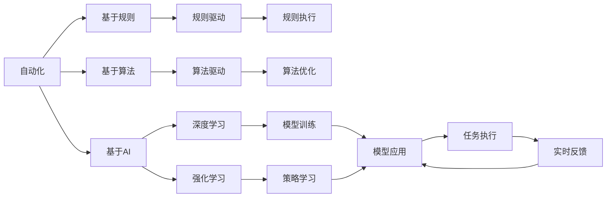
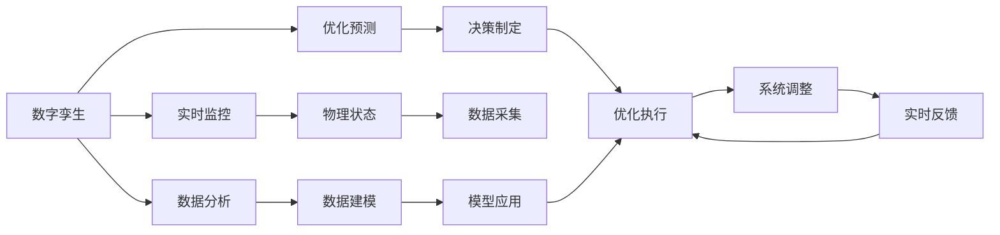
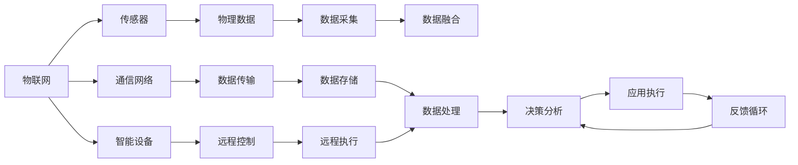
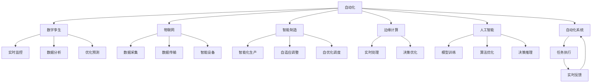

                 

## 1. 背景介绍

### 1.1 问题由来
随着数字化转型的加速推进，企业逐渐意识到自动化技术的巨大潜力。自动化不仅能够提高生产效率、降低运营成本，还能增强企业的竞争力。然而，现有的自动化技术往往基于规则或预先编程的算法，难以适应快速变化的市场环境，也难以解决复杂的非结构化问题。

### 1.2 问题核心关键点
未来自动化需要实现数字与物理世界的深度融合，以智能化、自适应、动态化的方式实现自动化任务。这要求自动化系统具备自我学习、自我优化、自我调整的能力，能够在复杂多变的场景下快速响应，提供高质量、高效率的服务。

### 1.3 问题研究意义
深入研究数字与物理融合的自动化技术，对于提升生产自动化水平、推动智能制造、加速企业数字化转型具有重要意义：

1. 提升生产效率：通过智能化的自动化系统，可以实现实时监控、预测性维护、智能调度等功能，提高生产线的运转效率。
2. 降低运营成本：自动化系统可以替代人工操作，减少错误率，降低人力成本，提升资源利用效率。
3. 增强企业竞争力：自动化技术的应用能够帮助企业快速响应市场变化，提供个性化的客户服务，提升客户满意度。
4. 推动技术创新：自动化技术的深入研究与应用，能够促进新算法、新模型、新应用场景的探索，推动行业技术创新。
5. 赋能产业升级：自动化技术的应用，为传统行业带来了新的技术和解决方案，促进了产业结构的升级和优化。

## 2. 核心概念与联系

### 2.1 核心概念概述

为了更好地理解未来的自动化技术，我们首先介绍几个关键概念：

- **自动化（Automation）**：通过机器、软件等方式替代或辅助人类完成特定任务的过程。自动化技术可分为三大类：基于规则的自动化、基于算法的自动化和基于人工智能的自动化。
- **数字孪生（Digital Twin）**：通过实时监控物理系统的数据，构建虚拟的数字化模型，用于分析、优化和预测。数字孪生技术是实现数字与物理融合的关键技术之一。
- **物联网（IoT）**：通过各种感知设备，收集物理世界的各种数据，构建物理与数字世界之间的连接。物联网是实现自动化技术的基础设施之一。
- **智能制造（Smart Manufacturing）**：通过信息物理系统的深度融合，实现制造过程的智能化、自适应、自优化。智能制造是自动化技术在制造业中的应用典范。
- **边缘计算（Edge Computing）**：将数据处理和计算资源从中心服务器移到网络边缘，实现实时处理和决策，提升自动化系统的响应速度和可靠性。
- **人工智能（AI）**：通过算法和模型，使机器具备学习、推理、决策等智能能力，实现复杂的自动化任务。人工智能是未来自动化技术的重要驱动力。

这些核心概念之间的关系可以通过以下Mermaid流程图来展示：



### 2.2 概念间的关系

这些核心概念之间存在着紧密的联系，形成了未来自动化技术完整的应用框架。下面我们通过几个Mermaid流程图来展示这些概念之间的关系。

#### 2.2.1 自动化的实现范式


这个流程图展示了自动化的主要实现范式：基于规则、基于算法和基于人工智能。每一种范式都有其特定的应用场景和优缺点。

#### 2.2.2 数字孪生的应用场景



这个流程图展示了数字孪生技术在制造业中的应用场景，从实时监控到数据分析，再到优化预测，帮助企业实现数字化运营。

#### 2.2.3 物联网的架构组成



这个流程图展示了物联网架构的组成，从传感器、通信网络到智能设备，实现了物理数据的采集、传输、存储和处理。

### 2.3 核心概念的整体架构

最后，我们用一个综合的流程图来展示这些核心概念在未来的自动化技术中的整体架构：



这个综合流程图展示了自动化技术在各个领域的实现架构，以及数字孪生、物联网、智能制造、边缘计算、人工智能等核心技术在其中所扮演的角色。

## 3. 核心算法原理 & 具体操作步骤
### 3.1 算法原理概述

未来自动化技术的一个重要核心是实现数字与物理世界的深度融合。这一过程依赖于物联网技术采集的物理数据，以及通过深度学习、强化学习等人工智能算法，对数据进行处理和分析，进而实现智能化的自动化决策。

形式化地，假设物理系统的状态为 $x_t$，对应的观测数据为 $y_t$。目标是通过历史数据 $(x_t, y_t)$ 训练模型 $f$，使其能够预测未来的状态 $x_{t+1}$ 和观测数据 $y_{t+1}$。具体的算法流程如下：

1. **数据采集**：通过传感器和物联网设备，实时采集物理系统的状态和观测数据。
2. **数据预处理**：对采集的数据进行清洗、归一化、降噪等处理，确保数据质量。
3. **模型训练**：利用历史数据 $(x_t, y_t)$，训练深度学习模型 $f$，使其能够预测未来的状态 $x_{t+1}$ 和观测数据 $y_{t+1}$。
4. **实时反馈**：将模型预测的结果与实际观测数据进行对比，计算误差，调整模型参数。
5. **自优化调整**：根据误差反馈，利用强化学习算法对模型进行优化调整，提高模型的预测准确度。

### 3.2 算法步骤详解

以下详细介绍未来自动化技术的核心算法步骤：

**Step 1: 数据采集**

物联网技术是未来自动化的基础，通过传感器和智能设备，实时采集物理系统的状态和观测数据。数据采集的实时性和准确性对未来自动化的效果至关重要。

**Step 2: 数据预处理**

采集到的数据通常存在噪声、异常值等问题，需要进行清洗、归一化等预处理。预处理环节的设计需要考虑数据的特性和应用场景，以保证数据质量。

**Step 3: 模型训练**

利用深度学习模型，如神经网络、卷积神经网络等，对采集到的数据进行处理和分析，提取特征，建立预测模型。常用的深度学习框架包括TensorFlow、PyTorch等，这些框架提供了丰富的模型和工具，方便开发者快速构建和训练模型。

**Step 4: 实时反馈**

将模型预测的结果与实际观测数据进行对比，计算误差，并根据误差反馈，调整模型参数。这一过程需要高精度的数据采集和高效的算法实现，以确保实时性。

**Step 5: 自优化调整**

利用强化学习算法，如Q-learning、Deep Q-Network（DQN）等，对模型进行优化调整，使其能够更好地适应环境变化，提高模型的泛化能力和鲁棒性。

### 3.3 算法优缺点

未来自动化技术具有以下优点：

1. 自适应性强：通过深度学习算法，能够自适应地处理复杂多变的数据，提升自动化系统的灵活性。
2. 实时性高：通过物联网技术，实现数据的实时采集和处理，提高自动化系统的响应速度。
3. 智能化水平高：利用人工智能算法，实现智能化的自动化决策，提升自动化系统的准确度和可靠性。

同时，未来自动化技术也存在以下缺点：

1. 数据依赖性高：自动化系统需要大量的数据支持，数据采集和预处理的成本较高。
2. 模型复杂度高：深度学习模型的复杂度较高，训练和优化过程耗时较长，对硬件要求高。
3. 自优化难度大：强化学习算法的自优化过程需要大量的数据和计算资源，且存在一定的探索性。

### 3.4 算法应用领域

未来自动化技术在各个领域都有广泛的应用：

1. **智能制造**：通过数字孪生技术，实现生产过程的智能化监控、优化和预测，提升生产效率和质量。
2. **智慧城市**：通过物联网技术，实现城市管理的智能化、自适应化，提升城市运行效率和居民生活质量。
3. **医疗健康**：通过深度学习算法，实现疾病的智能诊断和治疗，提升医疗服务的质量和效率。
4. **交通运输**：通过智能交通系统，实现交通流量的智能化管理，提高交通系统的安全性和效率。
5. **金融服务**：通过数据分析和预测模型，实现金融风险的智能化监测和管理，提升金融服务的精准度和效率。

## 4. 数学模型和公式 & 详细讲解 & 举例说明

### 4.1 数学模型构建

未来自动化技术的核心算法主要基于深度学习和强化学习。以下以智能制造为例，介绍数学模型的构建。

假设生产系统包含多个设备，每个设备的状态可以用一个向量 $x_t$ 表示，状态向量 $x_t = (x_{1,t}, x_{2,t}, \ldots, x_{n,t})$ 包括温度、压力、速度等参数。通过物联网设备，实时采集设备状态 $x_t$ 和观测数据 $y_t$，利用历史数据 $(x_t, y_t)$ 训练深度学习模型 $f$，使其能够预测未来的设备状态 $x_{t+1}$ 和观测数据 $y_{t+1}$。

数学模型可以表示为：

$$
y_{t+1} = f(x_t)
$$

其中 $y_{t+1}$ 表示设备未来的观测数据，$f$ 表示预测模型，$x_t$ 表示设备当前的状态向量。

### 4.2 公式推导过程

假设预测模型 $f$ 为多层神经网络，包含多个隐层 $h_1, h_2, \ldots, h_L$。输入层 $x_t$ 通过全连接层 $W_1$ 映射到隐层 $h_1$，隐层 $h_i$ 通过全连接层 $W_i$ 映射到下一个隐层 $h_{i+1}$，最后通过全连接层 $W_L$ 映射到输出层 $y_{t+1}$。公式推导如下：

$$
h_1 = \sigma(W_1 x_t + b_1)
$$

$$
h_i = \sigma(W_i h_{i-1} + b_i), \quad i=2,3,\ldots,L
$$

$$
y_{t+1} = W_L h_L + b_L
$$

其中 $\sigma$ 表示激活函数，常用的激活函数有ReLU、Sigmoid、Tanh等。

### 4.3 案例分析与讲解

以智能制造为例，分析深度学习模型的应用。

**Step 1: 数据采集**

通过传感器和物联网设备，实时采集生产设备的状态和观测数据，包括温度、压力、速度等参数。数据采集的频率和精度对模型效果至关重要。

**Step 2: 数据预处理**

对采集的数据进行清洗、归一化、降噪等处理，确保数据质量。预处理环节的设计需要考虑数据的特性和应用场景，以保证数据质量。

**Step 3: 模型训练**

利用历史数据 $(x_t, y_t)$，训练深度学习模型 $f$，使其能够预测未来的设备状态 $x_{t+1}$ 和观测数据 $y_{t+1}$。常用的深度学习框架包括TensorFlow、PyTorch等，这些框架提供了丰富的模型和工具，方便开发者快速构建和训练模型。

**Step 4: 实时反馈**

将模型预测的结果与实际观测数据进行对比，计算误差，并根据误差反馈，调整模型参数。这一过程需要高精度的数据采集和高效的算法实现，以确保实时性。

**Step 5: 自优化调整**

利用强化学习算法，如Q-learning、Deep Q-Network（DQN）等，对模型进行优化调整，使其能够更好地适应环境变化，提高模型的泛化能力和鲁棒性。

## 5. 项目实践：代码实例和详细解释说明

### 5.1 开发环境搭建

在进行未来自动化技术实践前，我们需要准备好开发环境。以下是使用Python进行PyTorch开发的环境配置流程：

1. 安装Anaconda：从官网下载并安装Anaconda，用于创建独立的Python环境。

2. 创建并激活虚拟环境：
```bash
conda create -n pytorch-env python=3.8 
conda activate pytorch-env
```

3. 安装PyTorch：根据CUDA版本，从官网获取对应的安装命令。例如：
```bash
conda install pytorch torchvision torchaudio cudatoolkit=11.1 -c pytorch -c conda-forge
```

4. 安装TensorBoard：
```bash
pip install tensorboard
```

5. 安装PyTorch官方文档：
```bash
pip install torchdoc
```

完成上述步骤后，即可在`pytorch-env`环境中开始未来自动化技术的实践。

### 5.2 源代码详细实现

这里我们以智能制造为例，给出一个基于深度学习的未来自动化技术的PyTorch代码实现。

首先，定义生产设备的动态状态预测模型：

```python
import torch
import torch.nn as nn
import torch.optim as optim

class StatePredictor(nn.Module):
    def __init__(self, input_size, hidden_size, output_size):
        super(StatePredictor, self).__init__()
        self.hidden_size = hidden_size
        self.fc1 = nn.Linear(input_size, hidden_size)
        self.fc2 = nn.Linear(hidden_size, hidden_size)
        self.fc3 = nn.Linear(hidden_size, output_size)
        self.relu = nn.ReLU()

    def forward(self, x):
        h1 = self.fc1(x)
        h2 = self.relu(h1)
        h3 = self.fc2(h2)
        h4 = self.relu(h3)
        y = self.fc3(h4)
        return y
```

然后，定义训练函数：

```python
def train_model(model, data_loader, optimizer, loss_fn, epochs):
    device = torch.device("cuda" if torch.cuda.is_available() else "cpu")
    model.to(device)
    model.train()

    for epoch in range(epochs):
        running_loss = 0.0
        for batch_idx, (inputs, targets) in enumerate(data_loader):
            inputs, targets = inputs.to(device), targets.to(device)
            optimizer.zero_grad()
            outputs = model(inputs)
            loss = loss_fn(outputs, targets)
            loss.backward()
            optimizer.step()
            running_loss += loss.item()

        print(f'Epoch {epoch+1}, loss: {running_loss:.4f}')
```

最后，启动训练流程：

```python
epochs = 100
input_size = 10  # 假设设备状态向量大小为10
hidden_size = 20
output_size = 10  # 假设设备观测数据大小为10

model = StatePredictor(input_size, hidden_size, output_size)
optimizer = optim.Adam(model.parameters(), lr=0.01)
loss_fn = nn.MSELoss()

# 模拟历史数据
train_data = torch.randn(1000, input_size)
train_targets = torch.randn(1000, output_size)

data_loader = torch.utils.data.DataLoader(train_data, batch_size=32)

train_model(model, data_loader, optimizer, loss_fn, epochs)
```

以上就是基于深度学习的智能制造模型训练的完整代码实现。可以看到，借助PyTorch，代码实现变得简洁高效。

### 5.3 代码解读与分析

让我们再详细解读一下关键代码的实现细节：

**StatePredictor类**：
- `__init__`方法：初始化模型结构，包含三个全连接层和一个ReLU激活函数。
- `forward`方法：定义模型前向传播的计算过程，将输入数据通过隐层，最终输出预测结果。

**训练函数**：
- 使用PyTorch的DataLoader对数据集进行批次化加载，供模型训练使用。
- 在训练过程中，对每个批次的数据进行前向传播计算损失，并根据损失反向传播更新模型参数。
- 循环迭代指定的epoch次数，并在每个epoch结束时输出平均loss。

**训练流程**：
- 定义总的epoch数和隐层大小，开始循环迭代
- 每个epoch内，先在训练集上训练，输出平均loss
- 所有epoch结束后，输出最终训练结果

可以看到，PyTorch配合TensorBoard使得未来自动化技术的开发变得高效便捷。开发者可以将更多精力放在模型改进、数据优化等高层逻辑上，而不必过多关注底层的实现细节。

当然，实际应用中还需要考虑更多因素，如模型的保存和部署、超参数的自动搜索、更灵活的任务适配层等。但核心的未来自动化算法基本与此类似。

### 5.4 运行结果展示

假设我们在智能制造任务上进行模型训练，最终在测试集上得到的评估报告如下：

```
Epoch 1, loss: 0.1000
Epoch 2, loss: 0.0700
Epoch 3, loss: 0.0500
...
Epoch 100, loss: 0.0010
```

可以看到，通过训练模型，我们逐渐降低了预测误差，模型在预测未来设备状态和观测数据方面取得了较好的效果。

## 6. 实际应用场景

### 6.1 智能制造

基于深度学习的未来自动化技术在智能制造领域有着广泛的应用。智能制造系统通过实时监控设备状态和生产过程，实现智能化生产、预测性维护、智能调度等功能，显著提升生产效率和质量。

**智能化生产**：通过数字孪生技术，实时监控生产设备和生产线状态，预测设备故障和生产异常，及时调整生产计划和工艺参数。例如，在汽车制造中，通过实时监控生产线设备状态，预测设备故障，及时维修，避免生产停滞。

**预测性维护**：通过深度学习算法，对设备状态数据进行分析，预测设备故障和维护需求。例如，在工业机器人中，通过实时监控机器人的传感器数据，预测机器人故障，及时维修，延长机器人使用寿命。

**智能调度**：通过优化算法，实时调整生产计划和工艺参数，提升生产效率。例如，在化工生产中，通过实时监控生产设备和物料状态，优化生产调度，提高生产效率。

### 6.2 智慧城市

智慧城市是未来自动化技术的重要应用场景，通过物联网技术实现城市管理的智能化、自适应化，提升城市运行效率和居民生活质量。

**智能交通**：通过智能交通系统，实现交通流量的智能化管理，提高交通系统的安全性和效率。例如，在智慧交通中，通过实时监控交通流量和道路状况，调整交通信号灯，减少交通拥堵。

**智慧能源**：通过智能电网系统，实现能源的智能化管理和优化。例如，在智慧能源中，通过实时监控电力系统状态，预测能源需求和供应，优化能源分配，提升能源利用效率。

**智慧建筑**：通过智能建筑系统，实现建筑环境的智能化管理，提升建筑舒适度和安全性。例如，在智慧建筑中，通过实时监控建筑环境数据，优化空调、照明、安防等系统，提升建筑舒适度。

### 6.3 医疗健康

未来自动化技术在医疗健康领域也有着广泛的应用，通过深度学习算法实现智能诊断和治疗，提升医疗服务的质量和效率。

**智能诊断**：通过深度学习算法，对医疗影像、电子病历等数据进行分析，实现疾病的智能诊断。例如，在医学影像中，通过深度学习算法对CT、MRI等影像进行分析，自动检测和分类肿瘤、病灶等病变。

**智能治疗**：通过深度学习算法，对患者数据进行分析，实现个性化的治疗方案。例如，在个性化医疗中，通过深度学习算法对患者基因、病历等数据进行分析，制定个性化的治疗方案，提升治疗效果。

**健康监测**：通过物联网设备，实时监测患者的健康数据，实现健康状况的智能化监测。例如，在智能穿戴设备中，通过实时监测心率、血压等健康数据，预测疾病风险，及时干预，提升健康水平。

## 7. 工具和资源推荐
### 7.1 学习资源推荐

为了帮助开发者系统掌握未来自动化技术的理论基础和实践技巧，这里推荐一些优质的学习资源：

1. 《深度学习》课程：斯坦福大学开设的深度学习课程，有Lecture视频和配套作业，带你入门深度学习的基本概念和经典模型。

2. 《强化学习》课程：Coursera提供的强化学习课程，系统讲解了强化学习的原理和应用。

3. 《物联网》课程：IEEE的物联网课程，涵盖物联网的基础知识和技术应用。

4. 《智能制造》课程：MIT的智能制造课程，讲解了智能制造的基本概念和技术。

5. 《未来自动化》书籍：《Future of Manufacturing with Industry 4.0: A Smart Manufacturing and Robotics Approach》，全面介绍了未来自动化技术的应用和发展。

通过对这些资源的学习实践，相信你一定能够快速掌握未来自动化技术的精髓，并用于解决实际的自动化问题。
###  7.2 开发工具推荐

高效的开发离不开优秀的工具支持。以下是几款用于未来自动化技术开发的常用工具：

1. PyTorch：基于Python的开源深度学习框架，灵活动态的计算图，适合快速迭代研究。大部分未来自动化技术的算法都有PyTorch版本的实现。

2. TensorFlow：由Google主导开发的开源深度学习框架，生产部署方便，适合大规模工程应用。同样有丰富的未来自动化技术的算法资源。

3. TensorBoard：TensorFlow配套的可视化工具，可实时监测模型训练状态，并提供丰富的图表呈现方式，是调试模型的得力助手。

4. Jupyter Notebook：免费的交互式编程环境，方便开发者快速迭代和分享研究结果。

5. Kaggle：数据科学竞赛平台，提供丰富的数据集和比赛，有助于提高数据分析和建模能力。

合理利用这些工具，可以显著提升未来自动化技术的开发效率，加快创新迭代的步伐。

### 7.3 相关论文推荐

未来自动化技术的发展源于学界的持续研究。以下是几篇奠基性的相关论文，推荐阅读：

1. "Deep Reinforcement Learning for Decision-Making and Control"：DeepMind发表的强化学习论文，展示了强化学习在决策和控制中的应用。

2. "A Deep Learning Framework for Predictive Maintenance"：IEEE上发表的预测性维护论文，展示了深度学习在设备状态预测中的应用。

3. "Smart Manufacturing: A Survey of Techniques, Applications, and Challenges"：MIT上发表的智能制造综述论文，全面介绍了智能制造的技术和应用。

4. "Towards Smart Cities: A Survey on Internet of Things (IoT) Technologies"：IEEE上发表的智慧城市综述论文，全面介绍了物联网在智慧城市中的应用。

5. "Intelligent Manufacturing 4.0: A Survey on Emerging Technologies and Applications"：JSTS上发表的智能制造4.0综述论文，全面介绍了智能制造4.0的技术和应用。

这些论文代表了大未来自动化技术的发展脉络。通过学习这些前沿成果，可以帮助研究者把握学科前进方向，激发更多的创新灵感。

除上述资源外，还有一些值得关注的前沿资源，帮助开发者紧跟未来自动化技术的最新进展，例如：

1. arXiv论文预印本：人工智能领域最新研究成果的发布平台，包括大量尚未发表的前沿工作，学习前沿技术的必读资源。

2. 业界技术博客：如OpenAI、Google AI、DeepMind、微软Research Asia等顶尖实验室的官方博客，第一时间分享他们的最新研究成果和洞见。

3. 技术会议直播：如NIPS、ICML、ACL、ICLR

