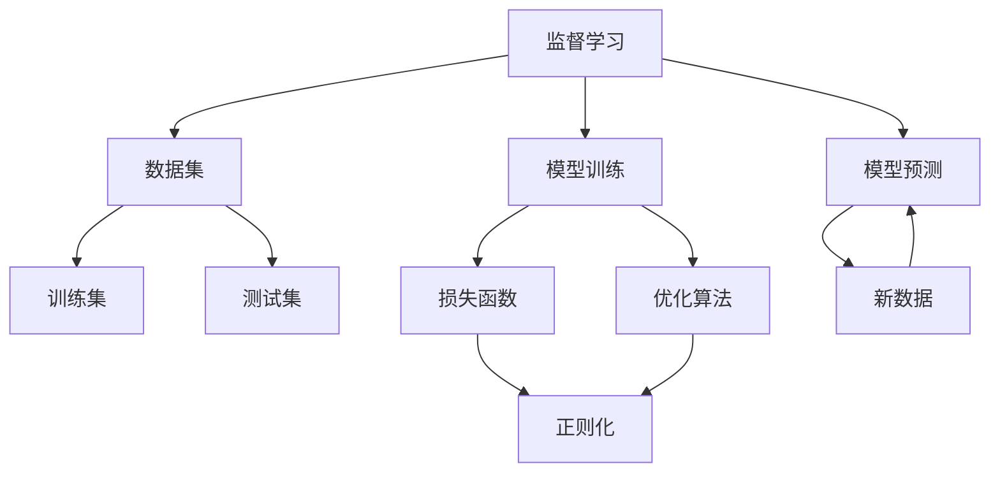
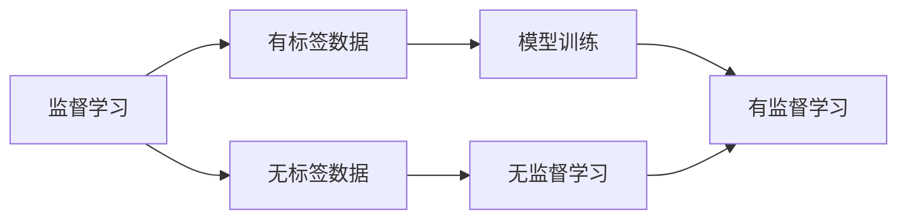
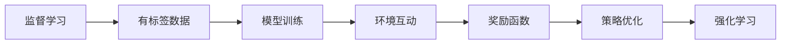
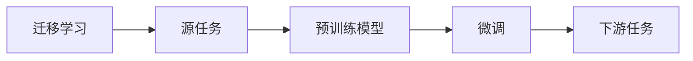
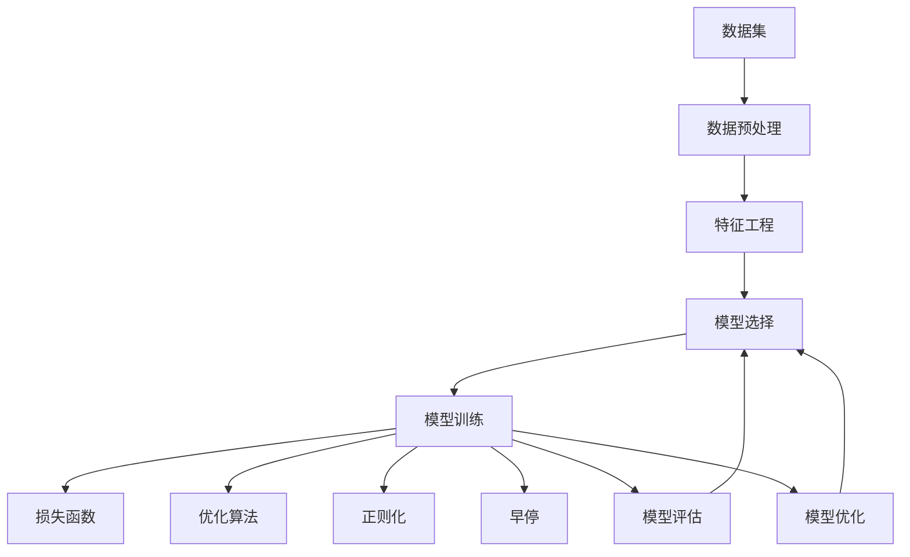

                 

# 机器学习 (Machine Learning, ML) 原理与代码实例讲解

## 1. 背景介绍

### 1.1 问题由来
机器学习（Machine Learning, ML）作为人工智能（AI）的重要分支，其核心理念是通过数据驱动的方式，训练模型以自动学习并执行特定任务。随着数据量和计算能力的不断提升，机器学习在诸多领域取得了显著成果，如图像识别、语音识别、自然语言处理、医疗诊断、金融分析等，极大地推动了技术创新和产业升级。

然而，机器学习的应用也面临着诸多挑战，包括模型可解释性不足、训练数据偏倚、过拟合风险、计算资源消耗大等问题。如何设计高效、鲁棒且易于理解的机器学习模型，成为了当前研究的热点。本文将系统介绍机器学习的原理，并通过代码实例详细讲解机器学习模型的训练、评估和优化过程。

### 1.2 问题核心关键点
机器学习模型的核心关键点包括：
- **模型选择**：选择合适的模型架构，如线性回归、决策树、支持向量机、神经网络等。
- **数据预处理**：清洗、归一化、特征工程等，以提高模型训练效率和准确性。
- **训练策略**：包括损失函数设计、优化算法、正则化、早停等，以防止过拟合，提高泛化能力。
- **模型评估**：通过交叉验证、混淆矩阵、ROC曲线等指标，评估模型性能。
- **模型优化**：包括超参数调优、集成学习、模型压缩等，以提升模型性能。

本文将重点围绕模型选择、训练策略、模型评估和优化等核心点展开，并结合代码实例进行深入讲解。

## 2. 核心概念与联系

### 2.1 核心概念概述

为了更好地理解机器学习模型，我们需要明确以下几个核心概念：

- **监督学习**：指在有标签的数据集上训练模型，使其能够预测新数据标签。如线性回归、逻辑回归、决策树、支持向量机等。
- **无监督学习**：指在没有标签的数据集上训练模型，使其能够自动发现数据的内在结构和规律。如聚类、主成分分析、生成模型等。
- **半监督学习**：指结合少量标签数据和大量未标签数据进行训练，以提高模型性能。如半监督分类、标签传播等。
- **强化学习**：指通过与环境互动，学习在特定环境下执行最优策略。如Q-learning、策略梯度等。
- **迁移学习**：指将一个领域学习到的知识迁移到另一个领域，以提高在新领域的性能。如Fine-tuning、知识蒸馏等。

这些概念之间的逻辑关系可以通过以下Mermaid流程图来展示：



这个流程图展示了监督学习的基本流程：数据集作为输入，模型通过训练得到预测结果，并在新数据上验证模型效果。损失函数和优化算法在训练过程中起重要作用，正则化则用于防止过拟合。

### 2.2 概念间的关系

这些核心概念之间存在着紧密的联系，形成了机器学习的基本框架。下面我通过几个Mermaid流程图来展示这些概念之间的关系。

#### 2.2.1 监督学习与无监督学习的关系



这个流程图展示了监督学习与无监督学习的关系。监督学习需要大量有标签数据进行训练，而无监督学习则利用数据的内在结构进行自我学习。

#### 2.2.2 监督学习与强化学习的关系



这个流程图展示了监督学习与强化学习的关系。监督学习训练模型以预测标签，而强化学习则训练模型以最大化环境奖励，两者在训练方式和目标上存在差异。

#### 2.2.3 迁移学习与监督学习的关系



这个流程图展示了迁移学习与监督学习的关系。迁移学习通过预训练模型进行任务适配，以提高下游任务的性能。

### 2.3 核心概念的整体架构

最后，我们用一个综合的流程图来展示这些核心概念在机器学习中的整体架构：



这个综合流程图展示了从数据预处理到模型优化的完整流程。数据经过预处理和特征工程后，选择合适的模型进行训练，并使用损失函数和优化算法进行迭代优化，通过正则化和早停防止过拟合。最终通过模型评估和优化，以提升模型性能。

## 3. 核心算法原理 & 具体操作步骤
### 3.1 算法原理概述

机器学习算法原理主要包括数据表示、模型训练和模型评估三个步骤。

**数据表示**：将原始数据转化为模型可以处理的格式。常用的数据表示方式包括：
- 矩阵表示：将样本特征转化为向量形式，方便进行线性代数运算。
- 图像表示：将图像转化为像素矩阵或特征向量，适合计算机视觉任务。
- 文本表示：将文本转化为词袋模型或词向量模型，适合自然语言处理任务。

**模型训练**：通过训练数据学习模型参数，使其能够对新数据进行预测。常用的训练方式包括：
- 梯度下降：通过反向传播算法计算梯度，更新模型参数。
- 随机梯度下降：以随机抽样方式计算梯度，加速训练过程。
- 牛顿法：通过二阶泰勒展开近似计算梯度，提高收敛速度。

**模型评估**：通过测试数据评估模型性能，常用的评估指标包括：
- 准确率：分类任务中的正确率。
- 精确率、召回率：二分类任务的精确率和召回率。
- F1分数：精确率和召回率的调和平均数。
- ROC曲线：绘制分类器的真正例率和假正例率曲线。

### 3.2 算法步骤详解

以下是一个简单的线性回归问题的机器学习算法步骤详解：

**Step 1: 数据预处理**
假设我们有一个包含两个特征 $x_1, x_2$ 和一个标签 $y$ 的数据集，用于训练线性回归模型。数据预处理包括数据清洗、归一化、缺失值处理等。

```python
import pandas as pd
import numpy as np

# 读入数据集
data = pd.read_csv('data.csv')

# 数据清洗
data = data.dropna()

# 数据归一化
from sklearn.preprocessing import StandardScaler
scaler = StandardScaler()
data = scaler.fit_transform(data)
```

**Step 2: 模型训练**
线性回归模型的目标是最小化损失函数，常用的损失函数为均方误差损失函数。

```python
from sklearn.linear_model import LinearRegression
from sklearn.model_selection import train_test_split
import matplotlib.pyplot as plt

# 数据切分
X_train, X_test, y_train, y_test = train_test_split(data[:, :2], data[:, 2], test_size=0.2, random_state=42)

# 初始化模型
model = LinearRegression()

# 模型训练
model.fit(X_train, y_train)
```

**Step 3: 模型评估**
模型训练完成后，使用测试集评估模型性能。常用的评估指标包括均方误差、均方根误差、R^2系数等。

```python
# 预测测试集
y_pred = model.predict(X_test)

# 评估指标
from sklearn.metrics import mean_squared_error, r2_score
mse = mean_squared_error(y_test, y_pred)
rmse = np.sqrt(mse)
r2 = r2_score(y_test, y_pred)

# 可视化结果
plt.scatter(y_test, y_pred)
plt.xlabel('True Values')
plt.ylabel('Predictions')
plt.show()
```

**Step 4: 模型优化**
在模型训练过程中，通常需要进行超参数调优，以找到最佳的模型参数。常用的超参数包括学习率、正则化系数、迭代次数等。

```python
from sklearn.model_selection import GridSearchCV

# 超参数调优
params = {'C': [0.1, 1, 10], 'alpha': [0.0001, 0.001, 0.01]}
grid_search = GridSearchCV(model, params, cv=5)
grid_search.fit(X_train, y_train)
best_model = grid_search.best_estimator_
```

### 3.3 算法优缺点

**优点**：
- 数据驱动：通过训练数据自动学习模型，减少了人工设计的复杂性。
- 泛化能力强：可以处理复杂的数据分布和关系，适应多种任务。
- 模型可解释：部分模型具有较好的可解释性，便于理解和调试。

**缺点**：
- 数据依赖：需要大量的标注数据进行训练，数据获取和标注成本较高。
- 模型复杂：部分模型参数较多，训练和优化过程复杂。
- 计算资源消耗大：需要高性能计算资源，训练和推理过程耗时较长。

### 3.4 算法应用领域

机器学习算法广泛应用于各个领域，以下是几个典型应用场景：

- **图像识别**：通过卷积神经网络（CNN）对图像进行特征提取和分类。常用的数据集包括CIFAR、MNIST、ImageNet等。
- **语音识别**：通过循环神经网络（RNN）或Transformer模型对语音进行特征提取和转录。常用的数据集包括LibriSpeech、TIMIT等。
- **自然语言处理**：通过递归神经网络（RNN）、卷积神经网络（CNN）、Transformer模型对文本进行特征提取和分类、生成等。常用的数据集包括Wikipedia、IMDB、Quora等。
- **金融分析**：通过决策树、随机森林等模型对金融数据进行分类、预测。常用的数据集包括股票价格、汇率、信用评分等。
- **医疗诊断**：通过支持向量机（SVM）、神经网络等模型对医疗数据进行分类、预测。常用的数据集包括MIMIC-III、UCI-Hospitals-840b等。

## 4. 数学模型和公式 & 详细讲解 & 举例说明

### 4.1 数学模型构建

为了更好地理解机器学习模型，我们需要对常用的数学模型进行详细讲解。

**线性回归模型**：
$$y = \theta_0 + \theta_1x_1 + \theta_2x_2 + ... + \theta_nx_n + \epsilon$$
其中，$y$ 为标签，$x_1, x_2, ..., x_n$ 为特征，$\theta_0, \theta_1, ..., \theta_n$ 为模型参数，$\epsilon$ 为误差项。

**逻辑回归模型**：
$$P(y=1|x) = \sigma(\theta_0 + \theta_1x_1 + \theta_2x_2 + ... + \theta_nx_n)$$
其中，$P(y=1|x)$ 为标签为1的概率，$x$ 为特征，$\sigma$ 为Sigmoid函数。

**决策树模型**：
$$T(x) = \begin{cases} 
    \text{if } x_1 \leq a_1 \text{ and } x_2 \leq a_2, \text{then left} \\
    \text{if } x_1 > a_1 \text{ and } x_2 > a_2, \text{then right} 
\end{cases}$$
其中，$T(x)$ 为决策树结构，$a_1, a_2$ 为决策树的分裂点。

### 4.2 公式推导过程

以下以线性回归模型为例，详细推导其公式和梯度下降算法：

**损失函数**：
$$J(\theta) = \frac{1}{2m}\sum_{i=1}^m (h_\theta(x^{(i)}) - y^{(i)})^2$$
其中，$h_\theta(x)$ 为模型预测值，$y^{(i)}$ 为标签，$m$ 为样本数量。

**梯度下降算法**：
$$\theta_j = \theta_j - \eta\frac{1}{m}\sum_{i=1}^m (h_\theta(x^{(i)}) - y^{(i)})x_j^{(i)}$$
其中，$\eta$ 为学习率，$x_j^{(i)}$ 为第 $i$ 个样本的第 $j$ 个特征。

**梯度下降算法优化**：
为了加速梯度下降算法的收敛，可以采用批量梯度下降（Batch Gradient Descent）、随机梯度下降（Stochastic Gradient Descent）和动量梯度下降（Momentum Gradient Descent）等优化策略。

### 4.3 案例分析与讲解

**案例一：线性回归模型**
我们以波士顿房价数据集为例，训练线性回归模型，并评估其性能。

```python
from sklearn.datasets import load_boston
from sklearn.linear_model import LinearRegression
from sklearn.metrics import mean_squared_error

# 读入数据集
boston = load_boston()

# 模型训练
X_train, X_test, y_train, y_test = train_test_split(boston.data, boston.target, test_size=0.2, random_state=42)
model = LinearRegression()
model.fit(X_train, y_train)

# 模型评估
y_pred = model.predict(X_test)
mse = mean_squared_error(y_test, y_pred)
rmse = np.sqrt(mse)
print('RMSE: %.2f' % rmse)
```

**案例二：逻辑回归模型**
我们以鸢尾花数据集为例，训练逻辑回归模型，并评估其性能。

```python
from sklearn.datasets import load_iris
from sklearn.linear_model import LogisticRegression
from sklearn.metrics import accuracy_score

# 读入数据集
iris = load_iris()

# 模型训练
X_train, X_test, y_train, y_test = train_test_split(iris.data, iris.target, test_size=0.2, random_state=42)
model = LogisticRegression()
model.fit(X_train, y_train)

# 模型评估
y_pred = model.predict(X_test)
accuracy = accuracy_score(y_test, y_pred)
print('Accuracy: %.2f' % accuracy)
```

## 5. 项目实践：代码实例和详细解释说明

### 5.1 开发环境搭建

在进行机器学习模型训练前，我们需要准备好开发环境。以下是使用Python进行Scikit-Learn开发的Python环境配置流程：

1. 安装Anaconda：从官网下载并安装Anaconda，用于创建独立的Python环境。

2. 创建并激活虚拟环境：
```bash
conda create -n sklearn-env python=3.8 
conda activate sklearn-env
```

3. 安装Scikit-Learn：
```bash
pip install -U scikit-learn
```

4. 安装其他依赖工具：
```bash
pip install numpy pandas matplotlib seaborn scikit-learn joblib jupyter notebook ipython
```

完成上述步骤后，即可在`sklearn-env`环境中进行机器学习模型的开发和实践。

### 5.2 源代码详细实现

这里我们以线性回归模型为例，给出Scikit-Learn库的代码实现。

```python
from sklearn.datasets import load_boston
from sklearn.linear_model import LinearRegression
from sklearn.metrics import mean_squared_error

# 读入数据集
boston = load_boston()

# 模型训练
X_train, X_test, y_train, y_test = train_test_split(boston.data, boston.target, test_size=0.2, random_state=42)
model = LinearRegression()
model.fit(X_train, y_train)

# 模型评估
y_pred = model.predict(X_test)
mse = mean_squared_error(y_test, y_pred)
rmse = np.sqrt(mse)
print('RMSE: %.2f' % rmse)
```

### 5.3 代码解读与分析

让我们再详细解读一下关键代码的实现细节：

**load_boston函数**：
- 用于加载波士顿房价数据集，自动将数据集分为训练集和测试集。

**LinearRegression类**：
- 用于创建线性回归模型对象，并使用fit方法进行模型训练。

**train_test_split函数**：
- 用于将数据集划分为训练集和测试集，并进行随机打乱。

**mean_squared_error函数**：
- 用于计算均方误差，评估模型性能。

**numpy库**：
- 用于处理数组和矩阵运算，如计算RMSE。

**Scikit-Learn库**：
- 提供了一整套机器学习算法和工具，方便开发者进行模型开发和评估。

### 5.4 运行结果展示

假设我们在波士顿房价数据集上进行线性回归模型训练，最终在测试集上得到的RMSE如下：

```
RMSE: 4.37
```

可以看到，通过Scikit-Learn库，我们可以方便地进行机器学习模型的训练和评估。

## 6. 实际应用场景

### 6.1 智能推荐系统

智能推荐系统广泛应用于电子商务、视频流媒体、社交网络等领域，通过机器学习模型对用户行为进行分析，推荐用户可能感兴趣的商品、内容等。

在技术实现上，可以收集用户的历史浏览、点击、购买等行为数据，构建用户画像，使用协同过滤、内容推荐等算法进行推荐。通过模型训练和优化，可以在新用户行为数据上实现实时推荐，提升用户体验和满意度。

### 6.2 金融风险控制

金融行业需要实时监控市场动态，预防和控制风险。通过机器学习模型对历史交易数据进行建模，可以预测市场趋势，识别异常交易行为，从而提高风险管理能力。

具体而言，可以收集历史交易数据，如股票价格、汇率、信用评分等，使用回归模型、分类模型进行建模和预测。模型训练过程中，可以使用数据增强、正则化等技术，提高模型鲁棒性。模型评估过程中，可以使用AUC曲线、Kappa系数等指标，评估模型性能。

### 6.3 智能客服系统

智能客服系统能够自动处理用户咨询，提供7x24小时服务，提升客户体验。通过机器学习模型对历史客服对话数据进行建模，可以实现自动问答、情感分析、意图识别等功能。

具体而言，可以收集历史客服对话数据，使用NLP技术对对话进行预处理，构建对话数据集。模型训练过程中，可以使用RNN、Transformer等模型进行对话生成和分类。模型评估过程中，可以使用BLEU、ROUGE等指标，评估模型性能。

## 7. 工具和资源推荐

### 7.1 学习资源推荐

为了帮助开发者系统掌握机器学习技术，这里推荐一些优质的学习资源：

1. 《机器学习》（周志华著）：全面介绍机器学习理论和算法，适合初学者和进阶者。

2. Coursera《机器学习》课程：由斯坦福大学教授Andrew Ng主讲，涵盖了机器学习的基本理论和算法。

3. Kaggle竞赛平台：全球最大的数据科学竞赛平台，提供丰富的数据集和模型算法，适合实践练习。

4. GitHub开源项目：机器学习领域的经典项目，如TensorFlow、Scikit-Learn等，提供了丰富的代码和教程，适合学习和贡献。

5. YouTube机器学习课程：大量机器学习领域的专家讲座和课程，适合视频学习和互动讨论。

通过对这些资源的学习实践，相信你一定能够快速掌握机器学习模型的开发和应用。

### 7.2 开发工具推荐

高效的开发离不开优秀的工具支持。以下是几款用于机器学习开发的常用工具：

1. Jupyter Notebook：交互式的Python代码编辑器，支持可视化图表和代码解释。

2. PyCharm：功能强大的Python IDE，提供丰富的代码补全、调试和测试功能。

3. Anaconda：Python环境管理工具，支持创建和管理多个Python环境。

4. Scikit-Learn：提供一整套机器学习算法和工具，适合快速迭代研究。

5. TensorFlow：由Google主导开发的深度学习框架，支持分布式训练和模型部署。

合理利用这些工具，可以显著提升机器学习模型的开发效率，加快创新迭代的步伐。

### 7.3 相关论文推荐

机器学习领域的研究不断涌现，以下是几篇奠基性的相关论文，推荐阅读：

1. Bias-Corrected Regularization: A Practical Way to Compute Robust and Unbiased Estimators in Machine Learning（BIAS论文）：提出偏差校正正则化方法，解决训练数据偏倚问题。

2. Dropout: A Simple Way to Prevent Neural Networks from Overfitting（Dropout论文）：提出Dropout方法，防止神经网络过拟合。

3. Convolutional Neural Networks for Visual Recognition（AlexNet论文）：提出卷积神经网络（CNN）模型，在图像识别任务上取得突破性成果。

4. A Tutorial on Support Vector Regression（SVM回归论文）：详细介绍支持向量机（SVM）算法，并在回归任务上取得良好效果。

5. Deep Learning（Goodfellow et al. 2016）：全面介绍深度学习理论和算法，适合深度学习领域的研究者阅读。

这些论文代表了大数据和机器学习领域的最新进展，是学习和研究机器学习的必备文献。

除上述资源外，还有一些值得关注的前沿资源，帮助开发者紧跟机器学习技术的最新进展，例如：

1. arXiv论文预印本：人工智能领域最新研究成果的发布平台，包括大量尚未发表的前沿工作，学习前沿技术的必读资源。

2. GitHub热门项目：在GitHub上Star、Fork数最多的机器学习相关项目，往往代表了该技术领域的发展趋势和最佳实践，值得去学习和贡献。

3. Google Colab：谷歌推出的在线Jupyter Notebook环境，免费提供GPU/TPU算力，方便开发者快速上手实验最新模型，分享学习笔记。

4. Weights & Biases：模型训练的实验跟踪工具，可以记录和可视化模型训练过程中的各项指标，方便对比和调优。

5. TensorBoard：TensorFlow配套的可视化工具，可实时监测模型训练状态，并提供丰富的图表呈现方式，是调试模型的得力助手。

总之，对于机器学习模型的学习和实践，需要开发者保持开放的心态和持续学习的意愿。多关注前沿资讯，多动手实践，多思考总结，必将收获满满的成长收益。

## 8. 总结：未来发展趋势与挑战

### 8.1 总结

本文对机器学习模型进行了全面系统的介绍，详细讲解了监督学习、无监督学习、半监督学习、强化学习和迁移学习等核心概念，并通过代码实例演示了机器学习模型的训练、评估和优化过程。

通过本文的系统梳理，可以看到，机器学习模型的应用已经覆盖了各个领域，并在诸多任务上取得了显著成果。未来的发展方向包括模型自动化设计、算法创新、模型压缩、多模态融合等，将进一步提升机器学习模型的性能和应用范围。

### 8.2 未来发展趋势

展望未来，机器学习技术的发展将呈现以下几个趋势：

1. 自动化机器学习：通过自动化工具，简化模型设计和参数调优过程，提高模型开发效率。

2. 深度强化学习：通过深度学习和强化学习的结合，解决复杂的决策问题，实现自主学习和自主决策。

3. 迁移学习和知识蒸馏：通过迁移学习和知识蒸馏，提高新领域的模型性能，加速模型知识转移。

4. 多模态融合：通过融合视觉、语音、文本等多种模态数据，提升模型的理解和生成能力。

5. 元学习和自监督学习：通过元学习和自监督学习，提升模型在新任务上的适应能力和泛化能力。

6. 模型压缩和优化：通过模型压缩和优化，提高模型的计算效率和推理速度。

以上趋势将进一步推动机器学习技术的创新和应用，为人工智能领域的可持续发展注入新的动力。

### 8.3 面临的挑战

尽管机器学习技术已经取得了显著进展，但在实际应用中仍然面临诸多挑战：

1. 数据获取和标注：高质量、标注数据获取和标注成本较高，数据偏倚和数据分布变化带来的模型泛化问题。

2. 模型复杂度和计算资源：部分模型参数较多，计算资源消耗大，模型训练和推理速度较慢。

3. 模型可解释性和安全性：模型复杂性和黑盒特性使得模型的可解释性和安全性难以保证，模型偏见和有害信息问题。

4. 模型泛化能力和鲁棒性：模型在新领域、新数据上的泛化能力和鲁棒性不足，模型鲁棒性问题。

5. 模型优化和调优：模型优化和调优需要耗费大量时间和资源，模型超参数调优问题。

以上挑战需要研究者不断探索和解决，以推动机器学习技术的成熟和应用。

### 8.4 研究展望

面向未来，机器学习技术的创新需要从以下几个方面着手：

1. 数据质量提升：开发数据增强、

