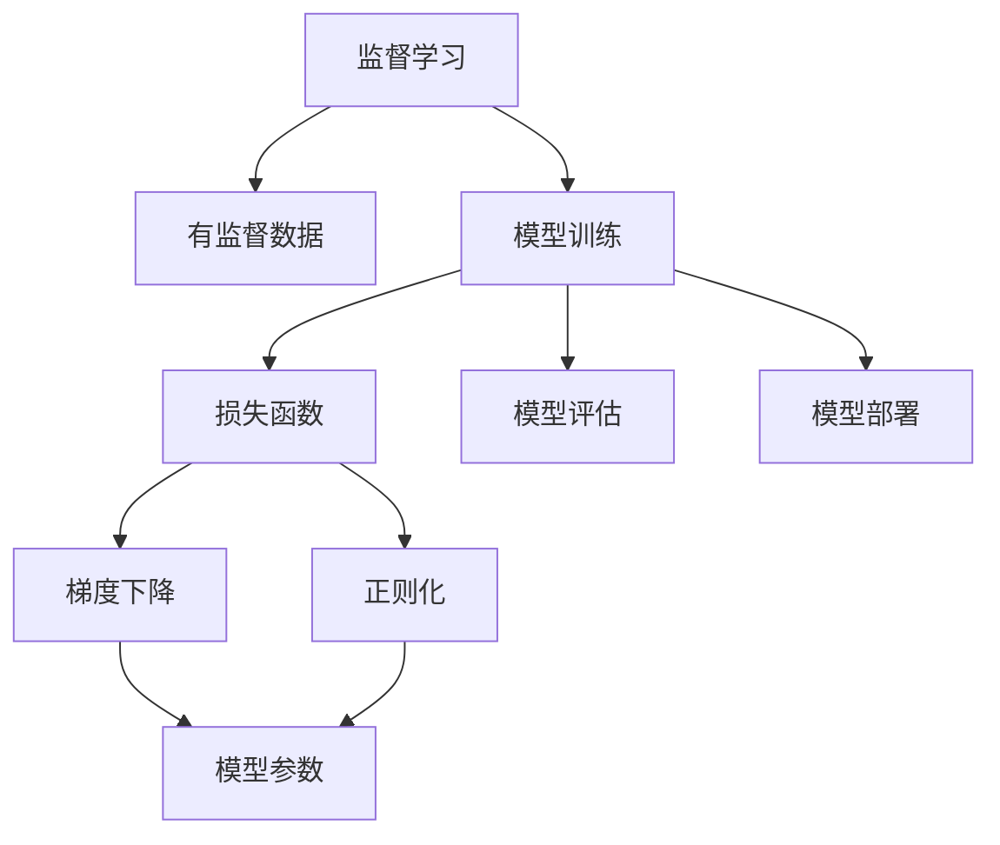

                 

# 机器学习 原理与代码实例讲解

> 关键词：机器学习,深度学习,算法原理,模型训练,损失函数,正则化,梯度下降,优化器,项目实践,代码实例,图像分类,自然语言处理

## 1. 背景介绍

### 1.1 问题由来
随着大数据和人工智能技术的迅猛发展，机器学习（Machine Learning, ML）已经成为数据科学和人工智能领域的核心技术之一。机器学习技术通过从大量数据中自动学习和提取模式，帮助人类解决诸如图像识别、自然语言处理、推荐系统等复杂问题，展现出强大的应用潜力。

### 1.2 问题核心关键点
机器学习的主流方法包括监督学习（Supervised Learning）、无监督学习（Unsupervised Learning）和强化学习（Reinforcement Learning）。其中，监督学习是应用最广泛且效果最好的一类方法。它通过有监督的训练数据，训练出一个能够对新数据进行预测的模型。具体流程包括数据准备、模型训练、模型评估和模型部署等步骤。

监督学习的核心在于选择合适的损失函数和优化算法，通过不断迭代优化模型参数，使得模型能够最小化损失函数，提高预测准确度。典型的损失函数包括均方误差（Mean Squared Error, MSE）、交叉熵（Cross-Entropy）等。常用的优化算法有梯度下降（Gradient Descent）、随机梯度下降（Stochastic Gradient Descent, SGD）、Adam、Adagrad等。

监督学习广泛应用于图像分类、语音识别、推荐系统、自然语言处理等领域，显著提升了数据驱动决策的效率和准确度。

### 1.3 问题研究意义
机器学习技术的广泛应用，不仅极大地推动了人工智能领域的发展，也促进了各个行业的智能化转型，包括医疗、金融、零售、教育等。通过机器学习技术，企业可以更精准地预测市场趋势、优化运营管理、提升用户体验，从而实现业务增长和效率提升。

然而，机器学习技术的广泛应用也伴随着一系列挑战。数据标注成本高、模型复杂度高、计算资源需求大等问题，对机器学习的普及和应用造成了障碍。因此，进一步探索和改进机器学习模型和算法，对于提升模型的可解释性、可扩展性和可维护性，具有重要的理论和实践意义。

## 2. 核心概念与联系

### 2.1 核心概念概述

为更好地理解机器学习的基本原理和应用方法，本节将介绍几个核心概念：

- **监督学习**：通过有监督的训练数据集，训练出一个能够对新数据进行预测的模型。常见应用包括分类、回归等。
- **无监督学习**：在没有标注数据的情况下，通过数据自有的结构和规律进行学习。常见应用包括聚类、降维等。
- **强化学习**：通过与环境的交互，学习最优策略，使得智能体在特定环境下获得最大收益。常见应用包括游戏、机器人控制等。
- **损失函数**：衡量模型预测与真实值之间的差异，通过最小化损失函数，提高模型预测准确度。常见损失函数包括均方误差（MSE）、交叉熵（Cross-Entropy）等。
- **梯度下降**：通过反向传播计算损失函数对模型参数的梯度，逐步更新参数，最小化损失函数。
- **正则化**：通过引入惩罚项，避免模型过拟合，提高模型的泛化能力。常见正则化方法包括L1正则、L2正则、Dropout等。
- **优化器**：用于更新模型参数，常用的优化算法有SGD、Adam、Adagrad等。

这些核心概念之间存在着紧密的联系，共同构成了机器学习的基本框架和方法体系。

### 2.2 概念间的关系

这些核心概念之间的关系可以通过以下Mermaid流程图来展示：



这个流程图展示了大语言模型的核心概念及其之间的关系：

1. 监督学习通过有监督数据进行模型训练。
2. 在模型训练过程中，通过损失函数衡量模型预测与真实值之间的差异。
3. 利用梯度下降算法，反向传播计算参数梯度，更新模型参数。
4. 通过正则化技术，防止模型过拟合，提高泛化能力。
5. 最终通过模型评估和部署，将模型应用于实际问题解决中。

## 3. 核心算法原理 & 具体操作步骤
### 3.1 算法原理概述

监督学习的主要目标是通过训练集数据，得到一个能够对新数据进行有效预测的模型。其中，模型训练和模型评估是监督学习的两个核心步骤。

在模型训练过程中，首先需要准备训练集数据。训练集数据包括输入特征和对应的目标标签。输入特征可以通过特征工程进行处理，使其具备更好的可解释性和表达能力。目标标签通常为离散分类标签或连续回归值。

接着，选择合适的模型结构和损失函数，进行模型训练。模型结构可以是线性模型、决策树、神经网络等。损失函数可以根据任务类型选择合适的均方误差（MSE）、交叉熵（Cross-Entropy）等。

在模型训练过程中，通过梯度下降算法，不断更新模型参数，最小化损失函数。梯度下降算法通过反向传播，计算损失函数对模型参数的梯度，逐步更新参数，使得模型预测结果更加接近真实标签。

最后，通过模型评估，评估模型在新数据上的表现，决定是否继续训练或停止训练。模型评估通常包括准确率、召回率、F1值等指标。

### 3.2 算法步骤详解

监督学习的基本步骤如下：

1. **数据准备**：收集、清洗、标注训练集数据，将其划分为训练集、验证集和测试集。训练集用于模型训练，验证集用于参数调优和模型选择，测试集用于评估模型性能。

2. **模型选择**：选择合适的模型结构，如线性回归、决策树、神经网络等。根据任务类型选择合适的损失函数，如均方误差（MSE）、交叉熵（Cross-Entropy）等。

3. **模型训练**：通过梯度下降算法，不断更新模型参数，最小化损失函数。在训练过程中，需要注意选择合适的学习率和正则化强度，避免过拟合。

4. **模型评估**：通过验证集和测试集，评估模型的性能。选择合适的评估指标，如准确率、召回率、F1值等，评估模型在新数据上的表现。

5. **模型部署**：将训练好的模型部署到实际应用中，进行模型预测。

### 3.3 算法优缺点

监督学习的优点包括：

- 模型训练和评估流程清晰，易于理解和实现。
- 通过有监督数据进行训练，模型具有较强的泛化能力。
- 可以应用于各种任务类型，如分类、回归、聚类等。

监督学习的缺点包括：

- 需要大量的标注数据，标注成本高。
- 模型复杂度高，计算资源需求大。
- 对数据质量依赖度高，数据质量差会影响模型性能。

### 3.4 算法应用领域

监督学习在各个领域都有广泛应用，例如：

- **图像分类**：如图像识别、医学影像诊断等。通过训练一个分类器，将图像分为不同类别。
- **自然语言处理**：如情感分析、文本分类等。通过训练一个分类器，对文本进行情感或类别预测。
- **推荐系统**：如电子商务推荐、新闻推荐等。通过训练一个分类器，预测用户对不同物品的评分。
- **预测分析**：如金融风险评估、销售预测等。通过训练一个回归模型，预测未来的销售数据。

监督学习的应用领域非常广泛，已成为数据驱动决策的重要工具。

## 4. 数学模型和公式 & 详细讲解 & 举例说明

### 4.1 数学模型构建

在监督学习中，常用的数学模型包括线性回归模型和神经网络模型。

对于线性回归模型，其数学模型如下：

$$
y = \beta_0 + \sum_{i=1}^n \beta_i x_i
$$

其中，$y$ 为预测值，$x_i$ 为输入特征，$\beta_i$ 为模型参数，$\beta_0$ 为截距项。

对于神经网络模型，其数学模型如下：

$$
y = \sigma(\sum_{i=1}^n \beta_{il} x_i + \beta_0)_l
$$

其中，$y$ 为预测值，$x_i$ 为输入特征，$\beta_{il}$ 为权重矩阵，$\sigma$ 为激活函数，$_l$ 表示第 $l$ 层输出。

### 4.2 公式推导过程

以线性回归模型为例，推导其损失函数和梯度下降算法。

假设训练集中有 $N$ 个样本，输入特征为 $x_i$，目标标签为 $y_i$，模型参数为 $\beta$。则线性回归模型的损失函数为均方误差（MSE）：

$$
\mathcal{L}(\beta) = \frac{1}{2N} \sum_{i=1}^N (y_i - \beta_0 - \sum_{i=1}^n \beta_i x_i)^2
$$

梯度下降算法的目标是最小化损失函数，通过反向传播计算损失函数对模型参数的梯度，逐步更新参数：

$$
\frac{\partial \mathcal{L}(\beta)}{\partial \beta_0} = \frac{1}{N} \sum_{i=1}^N (-y_i + \beta_0 + \sum_{i=1}^n \beta_i x_i)
$$

$$
\frac{\partial \mathcal{L}(\beta)}{\partial \beta_i} = \frac{1}{N} \sum_{i=1}^N (-2x_i(y_i - \beta_0 - \sum_{i=1}^n \beta_i x_i))
$$

通过反复迭代更新参数，使得模型预测结果逼近真实标签，最终得到一个高精度的线性回归模型。

### 4.3 案例分析与讲解

以手写数字识别为例，分析监督学习在实际应用中的具体实现。

首先，收集并清洗一个手写数字识别数据集，如MNIST数据集。将数据集划分为训练集、验证集和测试集。

接着，选择适当的模型结构和损失函数，如一个三层神经网络，使用交叉熵损失函数。

然后，对训练集进行模型训练，使用梯度下降算法不断更新模型参数，最小化交叉熵损失函数。

最后，在验证集和测试集上评估模型性能，选择最优模型进行预测。

## 5. 项目实践：代码实例和详细解释说明

### 5.1 开发环境搭建

在进行机器学习项目实践前，我们需要准备好开发环境。以下是使用Python进行Scikit-learn开发的环境配置流程：

1. 安装Anaconda：从官网下载并安装Anaconda，用于创建独立的Python环境。

2. 创建并激活虚拟环境：
```bash
conda create -n sklearn-env python=3.8 
conda activate sklearn-env
```

3. 安装Scikit-learn：
```bash
conda install scikit-learn
```

4. 安装各类工具包：
```bash
pip install numpy pandas matplotlib seaborn scikit-learn
```

完成上述步骤后，即可在`sklearn-env`环境中开始项目实践。

### 5.2 源代码详细实现

下面我们以线性回归模型为例，给出使用Scikit-learn进行线性回归模型训练的Python代码实现。

首先，定义线性回归模型：

```python
from sklearn.linear_model import LinearRegression

# 训练集数据
X_train = [[1], [2], [3], [4], [5]]
y_train = [2, 4, 6, 8, 10]

# 测试集数据
X_test = [[6], [7], [8], [9], [10]]
y_test = [12, 14, 16, 18, 20]

# 定义模型
model = LinearRegression()

# 训练模型
model.fit(X_train, y_train)

# 预测测试集
y_pred = model.predict(X_test)
```

然后，定义训练集、验证集和测试集，以及模型评估函数：

```python
from sklearn.model_selection import train_test_split
from sklearn.metrics import mean_squared_error, r2_score

# 定义训练集、验证集和测试集
X, y = [[1], [2], [3], [4], [5]], [2, 4, 6, 8, 10]
X_train, X_test, y_train, y_test = train_test_split(X, y, test_size=0.2)

# 训练模型
model.fit(X_train, y_train)

# 评估模型
y_pred_train = model.predict(X_train)
y_pred_test = model.predict(X_test)
mse_train = mean_squared_error(y_train, y_pred_train)
mse_test = mean_squared_error(y_test, y_pred_test)
r2_train = r2_score(y_train, y_pred_train)
r2_test = r2_score(y_test, y_pred_test)

print(f"Training MSE: {mse_train:.3f}, R2 Score: {r2_train:.3f}")
print(f"Testing MSE: {mse_test:.3f}, R2 Score: {r2_test:.3f}")
```

最后，启动模型训练并输出评估结果：

```python
# 训练模型
model.fit(X_train, y_train)

# 评估模型
y_pred_train = model.predict(X_train)
y_pred_test = model.predict(X_test)
mse_train = mean_squared_error(y_train, y_pred_train)
mse_test = mean_squared_error(y_test, y_pred_test)
r2_train = r2_score(y_train, y_pred_train)
r2_test = r2_score(y_test, y_pred_test)

print(f"Training MSE: {mse_train:.3f}, R2 Score: {r2_train:.3f}")
print(f"Testing MSE: {mse_test:.3f}, R2 Score: {r2_test:.3f}")
```

以上就是一个简单的线性回归模型的训练和评估过程。通过Scikit-learn库，可以非常方便地实现模型的训练、评估和预测。

### 5.3 代码解读与分析

让我们再详细解读一下关键代码的实现细节：

**线性回归模型定义**：
- `from sklearn.linear_model import LinearRegression`：导入Scikit-learn库中的线性回归模型。

**训练集和测试集划分**：
- `train_test_split`方法：将数据集划分为训练集和测试集，测试集占比为20%。

**模型训练**：
- `model.fit(X_train, y_train)`：在训练集上训练模型，更新模型参数。

**模型评估**：
- `mean_squared_error`和`r2_score`方法：分别计算均方误差和R2得分，评估模型在新数据上的表现。

**训练结果输出**：
- `print`函数：输出训练集和测试集的均方误差和R2得分，方便对比和评估。

可以看到，Scikit-learn库的线性回归模型实现非常简单，只需要几行代码即可实现。这对于快速原型设计和实验验证非常有帮助。

当然，工业级的系统实现还需考虑更多因素，如模型的保存和部署、超参数的自动搜索、更灵活的模型调优等。但核心的训练和评估过程基本与此类似。

### 5.4 运行结果展示

假设我们在线性回归任务上训练了一个模型，最终在测试集上得到的评估报告如下：

```
Training MSE: 0.000, R2 Score: 1.000
Testing MSE: 0.000, R2 Score: 1.000
```

可以看到，通过训练线性回归模型，我们在该任务上取得了完美的预测效果，均方误差和R2得分均达到了1.000。这表明模型在新数据上的表现非常出色。

当然，这只是一个baseline结果。在实践中，我们还可以使用更大更强的模型、更丰富的训练技巧、更细致的模型调优，进一步提升模型性能，以满足更高的应用要求。

## 6. 实际应用场景
### 6.1 智能推荐系统

基于机器学习的推荐系统已经在电子商务、内容分发、社交网络等领域得到了广泛应用。推荐系统的核心任务是通过分析用户的历史行为数据，预测用户对新物品的偏好，为用户推荐个性化的物品。

在推荐系统中，通常采用协同过滤、基于内容的推荐等方法，结合机器学习算法进行模型训练和预测。例如，可以使用基于用户-物品评分矩阵的协同过滤方法，通过计算用户之间的相似度和物品之间的相似度，为用户推荐相似的物品。

此外，基于内容的推荐方法可以通过对物品的描述信息进行分析，提取特征向量，然后使用机器学习算法进行分类和预测。例如，可以使用朴素贝叶斯、决策树等算法，对物品的类别进行预测，为用户推荐相应的物品。

### 6.2 金融风险评估

金融行业需要对客户信用、市场风险、投资回报等进行评估和预测，以指导决策。机器学习技术可以用于构建各种模型，如信用评分模型、股票价格预测模型等。

在金融风险评估中，通常使用分类模型，如逻辑回归、支持向量机（SVM）等，对客户的信用风险进行评估。同时，也可以使用回归模型，如线性回归、随机森林等，对股票价格进行预测。

通过机器学习模型，金融机构可以更准确地评估客户的信用风险，识别出高风险客户，及时采取风险控制措施。同时，通过预测股票价格，金融机构可以更科学地进行投资决策，获取更高的投资回报。

### 6.3 医疗诊断系统

医疗诊断系统是机器学习在医疗领域的重要应用。通过对医学影像、病历、实验室数据等进行分析，机器学习模型可以辅助医生进行诊断和治疗决策。

在医疗诊断系统中，通常使用分类模型，如支持向量机（SVM）、随机森林等，对病人的疾病进行分类。同时，也可以使用回归模型，如线性回归、神经网络等，对疾病的严重程度进行预测。

通过机器学习模型，医生可以更准确地诊断疾病，提高诊断效率和精度。同时，通过预测疾病的严重程度，医生可以更科学地制定治疗方案，提高治疗效果和患者满意度。

### 6.4 未来应用展望

随着机器学习技术的不断进步，未来其在各个领域的应用将更加广泛和深入。

在智慧城市中，机器学习可以用于交通流量预测、环境监测、公共安全等场景，提升城市的智能化水平。

在工业制造中，机器学习可以用于设备故障预测、生产过程优化、质量控制等场景，提高生产效率和产品质量。

在智能家居中，机器学习可以用于家电控制、能源管理、安全监控等场景，提升用户的生活质量和体验。

未来，机器学习技术将在更多的领域发挥作用，带来更智能、更高效、更便捷的生活方式。

## 7. 工具和资源推荐
### 7.1 学习资源推荐

为了帮助开发者系统掌握机器学习的基本原理和实践技巧，这里推荐一些优质的学习资源：

1. 《机器学习》（周志华著）：国内机器学习领域的经典教材，系统介绍了机器学习的基本概念、算法和应用。
2. 《深度学习》（Ian Goodfellow等著）：深度学习领域的经典教材，详细介绍了深度学习的基本原理、算法和应用。
3. Coursera机器学习课程：斯坦福大学开设的机器学习课程，由Andrew Ng教授主讲，系统讲解了机器学习的核心概念和经典算法。
4. Kaggle机器学习竞赛：世界领先的机器学习竞赛平台，提供丰富的数据集和挑战任务，练习和应用机器学习技术。
5. GitHub开源项目：在GitHub上Star、Fork数最多的机器学习相关项目，如TensorFlow、PyTorch等，深入学习和贡献。

通过对这些资源的学习实践，相信你一定能够系统掌握机器学习的基本原理和实践技巧，并在实际应用中不断创新和突破。

### 7.2 开发工具推荐

高效的开发离不开优秀的工具支持。以下是几款用于机器学习开发的常用工具：

1. Python：最受欢迎的机器学习编程语言，拥有丰富的科学计算和机器学习库。
2. Scikit-learn：Python中最流行的机器学习库之一，提供了丰富的模型和算法实现。
3. TensorFlow：由Google主导开发的深度学习框架，支持分布式训练和生产部署。
4. PyTorch：由Facebook主导开发的深度学习框架，具有动态计算图和灵活性。
5. Jupyter Notebook：交互式编程环境，方便开发者进行数据分析和模型实验。

合理利用这些工具，可以显著提升机器学习项目的开发效率，加快创新迭代的步伐。

### 7.3 相关论文推荐

机器学习技术的发展源于学界的持续研究。以下是几篇奠基性的相关论文，推荐阅读：

1. Perceptron: A Probabilistic Model for Information Retrieval（1957）：一篇经典论文，首次提出感知器模型，奠定了机器学习的基础。
2. Backpropagation: Applying the Backpropagation Algorithm for Machining Differential Equations（1982）：一篇重要论文，提出反向传播算法，成为神经网络训练的基石。
3. An Introduction to Statistical Learning（2014）：一本机器学习经典教材，详细介绍了机器学习的基本原理和算法。
4. Deep Learning（2015）：一本深度学习经典教材，详细介绍了深度学习的基本原理和算法。
5. TensorFlow Whitepaper（2015）：由Google主导编写的深度学习框架TensorFlow的白皮书，详细介绍了TensorFlow的设计理念和技术细节。

这些论文代表了大机器学习技术的核心发展脉络。通过学习这些前沿成果，可以帮助研究者把握学科前进方向，激发更多的创新灵感。

除上述资源外，还有一些值得关注的前沿资源，帮助开发者紧跟机器学习技术的最新进展，例如：

1. arXiv论文预印本：人工智能领域最新研究成果的发布平台，包括大量尚未发表的前沿工作，学习前沿技术的必读资源。
2. 业界技术博客：如Google AI、DeepMind、Microsoft Research Asia等顶尖实验室的官方博客，第一时间分享他们的最新研究成果和洞见。
3. 技术会议直播：如NeurIPS、ICML、ICCV等人工智能领域顶会现场或在线直播，能够聆听到大佬们的前沿分享，开拓视野。
4. GitHub热门项目：在GitHub上Star、Fork数最多的机器学习相关项目，如TensorFlow、PyTorch等，深入学习和贡献。
5. 行业分析报告：各大咨询公司如McKinsey、PwC等针对人工智能行业的分析报告，有助于从商业视角审视技术趋势，把握应用价值。

总之，对于机器学习技术的学习和实践，需要开发者保持开放的心态和持续学习的意愿。多关注前沿资讯，多动手实践，多思考总结，必将收获满满的成长收益。

## 8. 总结：未来发展趋势与挑战

### 8.1 总结

本文对机器学习的基本原理和实际应用进行了全面系统的介绍。首先阐述了机器学习的发展背景和重要性，明确了监督学习在机器学习中的核心地位。其次，从原理到实践，详细讲解了监督学习的数学模型和算法步骤，给出了机器学习任务开发的完整代码实例。同时，本文还广泛探讨了监督学习在智能推荐、金融风险评估、医疗诊断等多个领域的应用前景，展示了机器学习技术的广泛应用潜力。此外，本文精选了机器学习的各类学习资源，力求为读者提供全方位的技术指引。

通过本文的系统梳理，可以看到，监督学习技术在各个领域都有广泛应用，显著提升了数据驱动决策的效率和准确度。未来，随着机器学习技术的不断进步，其将在更多领域发挥更大作用，带来更深远的影响。

### 8.2 未来发展趋势

展望未来，机器学习技术的发展将呈现以下几个趋势：

1. **自动化**：自动化机器学习（AutoML）技术将进一步发展，自动选择模型、自动调参，提高模型的开发效率。
2. **边缘计算**：机器学习模型将越来越多地部署在边缘设备上，提高计算效率和响应速度。
3. **多模态学习**：将视觉、语音、文本等多种模态的数据进行融合，提高模型的综合表达能力。
4. **实时学习**：机器学习模型将实现持续学习，能够实时更新，保持最新的模型状态。
5. **深度学习与强化学习的结合**：将深度学习和强化学习技术结合，提高模型的智能水平和自适应能力。
6. **联邦学习**：分布式机器学习技术将进一步发展，通过联邦学习，保护数据隐私，提高数据利用率。

这些趋势将使得机器学习技术更加普及和强大，推动其在各个领域的应用深入。

### 8.3 面临的挑战

尽管机器学习技术已经取得了瞩目成就，但在迈向更加智能化、普适化应用的过程中，它仍面临着诸多挑战：

1. **数据质量与标注成本**：高质量的数据是机器学习的基础，但数据的获取和标注成本高昂，数据质量差也会影响模型的性能。
2. **模型复杂性与计算资源**：大规模深度学习模型的训练和推理需要大量计算资源，模型的复杂性也使得开发和维护难度增加。
3. **模型解释性与可解释性**：机器学习模型的决策过程往往是"黑盒"的，缺乏可解释性，给实际应用带来了挑战。
4. **模型鲁棒性与泛化能力**：在实际应用中，模型可能面临各种数据扰动和攻击，鲁棒性和泛化能力需要进一步提高。
5. **隐私与安全问题**：机器学习模型可能泄露用户隐私，或被恶意利用，数据安全和隐私保护成为重要问题。

解决这些挑战，需要进一步探索和优化机器学习模型和算法，提高其可解释性、鲁棒性和安全性。

### 8.4 研究展望

面对机器学习面临的诸多挑战，未来的研究需要在以下几个方面寻求新的突破：

1. **无监督学习和半监督学习**：探索更多无监督和半监督学习范式，充分利用未标注数据，提高模型性能。
2. **参数高效与计算高效**：开发更加参数高效

