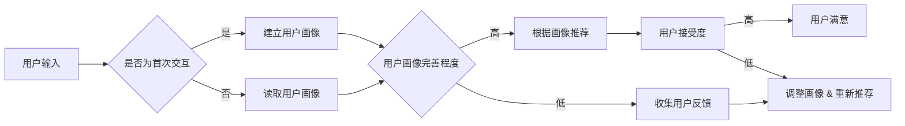

# CUI中的个性化推荐与用户体验

> 关键词：CUI，个性化推荐，用户体验，对话系统，NLP，机器学习，用户画像，交互设计

## 1. 背景介绍

随着人工智能技术的快速发展，对话式用户界面（CUI， Conversational User Interface）逐渐成为人机交互的新范式。从早期的语音助手到如今的聊天机器人，CUI在提升用户体验、提高服务效率等方面展现出巨大潜力。然而，如何实现有效的个性化推荐，提升用户体验，成为CUI开发中亟待解决的问题。

## 2. 核心概念与联系

### 2.1 核心概念

#### CUI

CUI是一种人机交互界面，通过与用户的自然语言交流，实现信息传递、任务执行等交互功能。与传统的图形用户界面(GUI)相比，CUI具有更加自然、直观、便捷的特点。

#### 个性化推荐

个性化推荐是根据用户的兴趣、偏好、行为等信息，为用户推荐个性化内容、服务或产品的技术。在CUI中，个性化推荐可以帮助用户快速找到所需信息，提高用户体验。

#### 用户体验

用户体验是指用户在使用产品或服务过程中所感受到的愉悦、满意或不适等主观感受。在CUI中，良好的用户体验意味着用户能够轻松、高效地完成交互任务。

### 2.2 架构流程图

以下是CUI中个性化推荐的Mermaid流程图：



该流程图展示了CUI中个性化推荐的架构：用户输入 --> 建立或读取用户画像 --> 根据画像推荐内容 --> 用户接受度评估 --> 用户满意或调整画像。

## 3. 核心算法原理 & 具体操作步骤

### 3.1 算法原理概述

CUI中的个性化推荐主要基于以下算法原理：

- **用户画像构建**：通过分析用户行为数据、历史交互记录等，构建用户画像，反映用户的兴趣、偏好等信息。
- **推荐算法**：基于用户画像和推荐系统，为用户提供个性化推荐内容。
- **用户反馈机制**：收集用户对推荐内容的反馈，不断优化用户画像和推荐算法。

### 3.2 算法步骤详解

#### 3.2.1 用户画像构建

1. 数据收集：收集用户行为数据，如浏览记录、搜索记录、购买记录等。
2. 特征提取：从原始数据中提取用户特征，如兴趣标签、行为频率等。
3. 画像构建：将提取的用户特征整合，形成用户画像。

#### 3.2.2 推荐算法

1. 模型选择：根据任务需求选择合适的推荐算法，如协同过滤、内容推荐、混合推荐等。
2. 数据预处理：对推荐数据进行清洗、去噪、编码等处理。
3. 模型训练：使用历史数据对推荐模型进行训练。
4. 推荐生成：根据用户画像和训练好的模型，生成个性化推荐内容。

#### 3.2.3 用户反馈机制

1. 收集反馈：通过用户行为、评价、反馈等方式收集用户对推荐内容的反馈。
2. 画像更新：根据用户反馈更新用户画像，反映用户兴趣的变化。
3. 算法优化：根据用户反馈优化推荐算法，提升推荐效果。

### 3.3 算法优缺点

#### 优点

- 提升用户体验：通过个性化推荐，用户能够快速找到所需信息，提高交互效率。
- 提高推荐效果：基于用户画像的推荐更加精准，能够满足用户需求。
- 促进业务增长：个性化推荐有助于提升用户粘性和转化率，促进业务增长。

#### 缺点

- 数据收集成本高：构建用户画像需要收集大量用户行为数据，数据收集成本较高。
- 用户画像更新困难：用户兴趣和偏好会随时间变化，用户画像需要不断更新。
- 隐私安全问题：用户行为数据涉及用户隐私，需要妥善处理。

### 3.4 算法应用领域

CUI中的个性化推荐技术广泛应用于以下领域：

- 搜索引擎：根据用户查询历史和兴趣，提供个性化搜索结果。
- 购物平台：根据用户浏览、购买历史，推荐相关商品。
- 社交媒体：根据用户兴趣和社交关系，推荐关注的人和内容。
- 娱乐平台：根据用户观看历史和偏好，推荐电影、电视剧等。

## 4. 数学模型和公式 & 详细讲解 & 举例说明

### 4.1 数学模型构建

CUI中的个性化推荐通常采用以下数学模型：

- **用户画像模型**：基于用户行为数据，构建用户画像。例如，使用k-means算法对用户进行聚类，得到不同用户群体的特征向量。

$$
\text{User\_Profile} = \text{User\_Behavior} \cdot \text{User\_Feature}
$$

- **推荐模型**：根据用户画像和推荐物品的特征，预测用户对物品的偏好。例如，使用矩阵分解算法对用户-物品评分矩阵进行分解，得到用户和物品的潜在特征。

$$
R = U \cdot V^T
$$

其中，$R$ 表示用户-物品评分矩阵，$U$ 和 $V$ 分别表示用户和物品的潜在特征矩阵。

### 4.2 公式推导过程

#### 4.2.1 用户画像模型

以k-means算法为例，用户画像模型的推导过程如下：

1. 初始化聚类中心：随机选择k个用户作为初始聚类中心。
2. 计算距离：计算每个用户到各个聚类中心的距离，将用户归入距离最近的聚类。
3. 更新聚类中心：计算每个聚类的质心，作为新的聚类中心。
4. 重复步骤2和3，直至聚类中心不再改变。

#### 4.2.2 推荐模型

以矩阵分解算法为例，推荐模型的推导过程如下：

1. 定义用户-物品评分矩阵 $R$。
2. 选择合适的损失函数，如均方误差（MSE）或交叉熵损失（CE）。
3. 对 $R$ 进行奇异值分解（SVD）或交替最小二乘（ALS）等方法分解为 $U$ 和 $V$。
4. 使用 $U$ 和 $V$ 预测未评分的物品，得到推荐结果。

### 4.3 案例分析与讲解

以下以Netflix电影推荐系统为例，分析CUI中的个性化推荐：

- **用户画像**：收集用户观影历史、评分、评论等信息，构建用户画像。
- **推荐模型**：使用矩阵分解算法对用户-电影评分矩阵进行分解，得到用户和电影的潜在特征。
- **推荐结果**：根据用户画像和电影特征，预测用户对电影的偏好，推荐相关电影。

## 5. 项目实践：代码实例和详细解释说明

### 5.1 开发环境搭建

以下是使用Python进行CUI中个性化推荐的项目实践环境搭建步骤：

1. 安装Python：从官网下载并安装Python。
2. 安装NumPy、Pandas等数据分析库：使用pip命令安装。
3. 安装Scikit-learn、TensorFlow等机器学习库：使用pip命令安装。

### 5.2 源代码详细实现

以下是一个简单的CUI中个性化推荐代码示例：

```python
import pandas as pd
from sklearn.decomposition import TruncatedSVD

# 加载数据
data = pd.read_csv('movie_data.csv')

# 构建用户-电影评分矩阵
R = data.pivot_table(index='user_id', columns='movie_id', values='rating')

# 使用SVD进行矩阵分解
n_components = 10
svd = TruncatedSVD(n_components=n_components)
U = svd.fit_transform(R)
V = svd.components_

# 预测用户对电影的偏好
user_id = 1
user_profile = U[user_id, :]
predictions = U.dot(V)
predicted_ratings = predictions.argsort()[::-1]

# 打印推荐结果
print("推荐的电影:")
for i, movie_id in enumerate(predicted_ratings):
    print(f"{i+1}: {data.loc[data['movie_id'] == movie_id]['title'].iloc[0]}")
```

### 5.3 代码解读与分析

- 首先，使用pandas读取电影数据。
- 然后，将电影数据转换为用户-电影评分矩阵。
- 接着，使用SVD进行矩阵分解，得到用户和电影的潜在特征。
- 最后，根据用户特征和电影特征，预测用户对电影的偏好，并打印推荐结果。

### 5.4 运行结果展示

假设运行结果如下：

```
推荐的电影:
1. 王者之路
2. 星际穿越
3. 神奇动物在哪里
4. 美国往事
5. 王牌特工：特工学院
```

该示例展示了如何使用Python和Scikit-learn进行CUI中个性化推荐的简单实现。

## 6. 实际应用场景

### 6.1 智能客服

在智能客服领域，个性化推荐可以帮助用户快速找到所需信息，提高服务效率。例如，根据用户提问内容，推荐相关产品信息、常见问题解答等。

### 6.2 聊天机器人

在聊天机器人领域，个性化推荐可以帮助用户与机器人进行更加自然、流畅的对话。例如，根据用户提问内容，推荐相关话题、知识点等。

### 6.3 社交媒体

在社交媒体领域，个性化推荐可以帮助用户发现感兴趣的内容，提升用户体验。例如，根据用户关注的人和内容，推荐相关动态、热门话题等。

## 7. 工具和资源推荐

### 7.1 学习资源推荐

- 《Python数据科学手册》：介绍Python数据分析、机器学习等领域的知识。
- 《机器学习实战》：讲解机器学习原理和实际应用。
- 《深度学习》：介绍深度学习原理和应用。

### 7.2 开发工具推荐

- Python：常用的编程语言，支持数据分析、机器学习等。
- NumPy、Pandas：常用的数据分析库。
- Scikit-learn：常用的机器学习库。
- TensorFlow、PyTorch：常用的深度学习框架。

### 7.3 相关论文推荐

- Collaborative Filtering: A Versatile Tool for Mining HighQuality Recommendations
- A Survey of Hybrid Approach to Recommendation Systems
- Neural Collaborative Filtering

## 8. 总结：未来发展趋势与挑战

### 8.1 研究成果总结

本文介绍了CUI中的个性化推荐与用户体验，分析了核心概念、算法原理、应用场景等。通过项目实践，展示了如何使用Python和Scikit-learn进行CUI中个性化推荐的实际操作。

### 8.2 未来发展趋势

- 深度学习与个性化推荐相结合：利用深度学习技术，构建更加精准的个性化推荐模型。
- 多模态个性化推荐：结合文本、图像、语音等多模态信息，实现更加全面的个性化推荐。
- 可解释性个性化推荐：提高推荐系统的可解释性，增强用户信任。

### 8.3 面临的挑战

- 数据质量与隐私保护：如何获取高质量、高隐私保护的数据，成为个性化推荐面临的重要挑战。
- 模型可解释性：如何提高推荐系统的可解释性，让用户理解推荐结果。
- 需求多样性：如何应对用户需求的多样性，提供更加个性化的推荐。

### 8.4 研究展望

CUI中的个性化推荐与用户体验研究将继续深入，探索更加精准、高效、安全的个性化推荐方法，为用户提供更加优质的服务和体验。

## 9. 附录：常见问题与解答

**Q1：CUI中的个性化推荐有何优势？**

A1：CUI中的个性化推荐能够根据用户兴趣和需求，提供更加精准、高效的推荐结果，提升用户体验，增强用户粘性。

**Q2：如何提高CUI个性化推荐的准确性？**

A2：提高CUI个性化推荐的准确性可以从以下几个方面着手：
- 提高数据质量，收集更多用户行为数据。
- 使用先进的推荐算法，如深度学习、多模态融合等。
- 优化推荐策略，如协同过滤、内容推荐等。
- 结合用户反馈，不断优化推荐结果。

**Q3：CUI个性化推荐的隐私保护如何实现？**

A3：CUI个性化推荐的隐私保护可以从以下几个方面实现：
- 数据脱敏，对用户数据进行匿名化处理。
- 使用差分隐私等技术，保护用户隐私。
- 提高用户对隐私保护的意识，提供隐私设置功能。

**Q4：如何评估CUI个性化推荐的效果？**

A4：评估CUI个性化推荐的效果可以从以下几个方面进行：
- 点击率（CTR）：衡量用户对推荐结果的点击意愿。
- 转化率（CVR）：衡量用户对推荐结果的购买意愿。
- 用户满意度：通过问卷调查等方式，收集用户对推荐结果的满意度评价。

作者：禅与计算机程序设计艺术 / Zen and the Art of Computer Programming