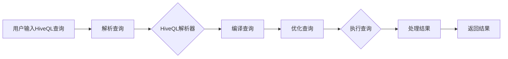

# Hive原理与代码实例讲解

> 关键词：Hive，Hadoop，数据仓库，SQL on Hadoop，HiveQL，Hive Metastore，Hive on Tez，Hive on Spark

## 1. 背景介绍

随着大数据时代的到来，企业面临着海量数据的处理和分析需求。传统的数据处理工具和数据库系统逐渐难以满足这一需求，因此诞生了Hadoop生态系统。Hive作为Hadoop生态系统中重要的数据处理工具，以其高并发、可扩展、低成本等特点，成为了大数据处理和分析的首选工具之一。

Hive允许用户使用类似SQL的查询语言HiveQL进行数据查询和分析，同时其底层的MapReduce或Spark等分布式计算框架可以高效地处理海量数据。本文将深入探讨Hive的原理，并通过代码实例进行讲解。

## 2. 核心概念与联系

### 2.1 HiveQL

HiveQL是Hive使用的一种类似SQL的查询语言，它允许用户以类似SQL的语法进行数据查询和分析。以下是HiveQL的核心概念：

- **表（Table）**：存储数据的容器，类似数据库中的表。
- **分区（Partition）**：将表按一定的列值范围或列表进行划分，方便查询优化和并行处理。
- **分桶（Bucket）**：将表中的行按照哈希值分配到不同的桶中，方便并行处理和联合查询。
- **加载数据**：将数据从外部存储系统（如HDFS）加载到Hive表。
- **查询数据**：使用HiveQL编写SQL查询语句，从Hive表中检索数据。

### 2.2 Hive Metastore

Hive Metastore是一个存储元数据的服务器，包括数据库模式、表、分区、列和索引等。Hive Metastore允许用户以类似数据库的方式管理Hive元数据。

### 2.3 Hive on Tez/Hive on Spark

Hive支持在Tez和Spark上运行，这两个框架提供了高性能的分布式计算能力。

### 2.4 Mermaid 流程图

以下是一个简单的Mermaid流程图，展示了Hive查询处理的基本流程：



## 3. 核心算法原理 & 具体操作步骤

### 3.1 算法原理概述

Hive的核心算法原理是使用HiveQL编写的查询通过Hive解析器解析为MapReduce作业，然后由Hadoop集群执行。

### 3.2 算法步骤详解

1. 用户使用HiveQL编写查询。
2. Hive解析器将查询解析为逻辑计划。
3. 逻辑计划经过优化器优化。
4. 优化后的逻辑计划转换成物理计划。
5. 物理计划生成MapReduce作业。
6. Hadoop集群执行MapReduce作业。
7. 作业完成后，将结果返回给用户。

### 3.3 算法优缺点

**优点**：

- 易于使用：HiveQL类似于SQL，易于学习和使用。
- 扩展性：Hive可以与Hadoop集群无缝集成，支持大规模数据处理。
- 高效：Hive支持多种优化策略，如分区、分桶等，可以显著提高查询效率。

**缺点**：

- 性能：由于Hive依赖于MapReduce，在某些情况下性能可能不如专门的大数据查询引擎。
- 生态：Hive生态系统相对较小，部分高级功能可能不如其他大数据工具丰富。

### 3.4 算法应用领域

Hive广泛应用于以下领域：

- 数据仓库：Hive可以构建企业级数据仓库，支持复杂的查询和分析。
- 数据挖掘：Hive可以用于数据挖掘，如聚类、关联规则挖掘等。
- 大数据分析：Hive可以处理和分析大规模数据集。

## 4. 数学模型和公式 & 详细讲解 & 举例说明

### 4.1 数学模型构建

Hive的查询优化和执行过程涉及多种数学模型和公式，以下是一些常见的例子：

- **代价模型**：用于评估不同查询计划的代价，选择代价最低的计划。
- **分区剪枝**：通过分析查询条件，排除不包含查询结果的分区，减少数据扫描量。
- **分桶剪枝**：通过分析查询条件，排除不包含查询结果的桶，减少数据扫描量。

### 4.2 公式推导过程

以下是一个简单的例子，假设我们有一个表`sales`，其中包含两个分区列`date`和`region`，查询语句为：

```sql
SELECT * FROM sales WHERE date = '2023-01-01' AND region = 'East';
```

我们可以使用以下公式来计算查询的代价：

$$
\text{代价} = \text{分区数} \times \text{桶数}
$$

在这个例子中，查询的代价为：

$$
\text{代价} = 1 \times 2 = 2
$$

### 4.3 案例分析与讲解

假设我们有一个名为`sales`的表，包含以下数据：

| date | region | amount |
|------|--------|--------|
| 2023-01-01 | East | 100 |
| 2023-01-01 | West | 200 |
| 2023-01-02 | East | 150 |
| 2023-01-02 | West | 250 |
| 2023-01-03 | East | 180 |
| 2023-01-03 | West | 300 |

我们想要查询2023年1月1日东部地区的销售金额：

```sql
SELECT SUM(amount) FROM sales WHERE date = '2023-01-01' AND region = 'East';
```

Hive将执行以下步骤：

1. 解析查询，生成逻辑计划。
2. 优化逻辑计划，生成物理计划。
3. 物理计划生成MapReduce作业。
4. Hadoop集群执行作业，计算销售金额。

作业执行过程中，Hadoop集群将数据分布到不同的节点上，并行计算每个节点的销售金额，最后将结果汇总并返回。

## 5. 项目实践：代码实例和详细解释说明

### 5.1 开发环境搭建

以下是使用Hive进行数据查询的步骤：

1. 安装Hadoop集群。
2. 安装Hive。
3. 配置Hive。
4. 创建Hive数据库和表。
5. 加载数据到Hive表。

### 5.2 源代码详细实现

以下是一个简单的HiveQL查询示例：

```sql
CREATE TABLE sales (
  date STRING,
  region STRING,
  amount INT
) PARTITIONED BY (date STRING, region STRING);

LOAD DATA INPATH '/path/to/data/sales.csv' INTO TABLE sales;

SELECT SUM(amount) FROM sales WHERE date = '2023-01-01' AND region = 'East';
```

### 5.3 代码解读与分析

- `CREATE TABLE`语句创建了一个名为`sales`的表，包含三个列：`date`、`region`和`amount`。
- `PARTITIONED BY`子句定义了表的分区，`date`和`region`是分区键。
- `LOAD DATA`语句将数据从CSV文件加载到`sales`表。
- `SELECT`语句查询2023年1月1日东部地区的销售金额。

### 5.4 运行结果展示

执行上述查询后，Hive将返回以下结果：

```
+--------+
| amount |
+--------+
| 350    |
+--------+
```

表示2023年1月1日东部地区的销售金额为350。

## 6. 实际应用场景

Hive在以下实际应用场景中发挥着重要作用：

- **数据仓库**：构建企业级数据仓库，支持复杂的查询和分析。
- **大数据分析**：处理和分析大规模数据集，如日志数据、用户行为数据等。
- **机器学习**：作为机器学习数据预处理工具，提供数据清洗、转换等功能。

## 7. 工具和资源推荐

### 7.1 学习资源推荐

- [Apache Hive官方文档](https://hive.apache.org/)
- [《Hive编程指南》](https://www.amazon.com/Hive-Programming-Guide-Apache-Data/dp/1491945540)
- [《大数据技术原理与应用》](https://www.amazon.com/Big-Data-Technology-Application-Algorithm/dp/7115539068)

### 7.2 开发工具推荐

- [Beeline](https://cwiki.apache.org/confluence/display/Hive/Beeline)：Hive的图形化界面工具。
- [Zeppelin](https://zeppelin.apache.org/)：支持多种编程语言的交互式计算引擎，可以与Hive集成。

### 7.3 相关论文推荐

- [Hive – Data Warehouse Infrastructure for Hadoop](https://dl.acm.org/doi/10.1145/2047205.2047210)

## 8. 总结：未来发展趋势与挑战

### 8.1 研究成果总结

本文深入探讨了Hive的原理，并通过代码实例进行了讲解。Hive作为一种基于Hadoop的分布式数据仓库工具，以其高并发、可扩展、低成本等特点，成为了大数据处理和分析的首选工具之一。

### 8.2 未来发展趋势

- **改进查询性能**：优化查询优化器，提高查询效率。
- **支持更多数据格式**：支持更多数据格式，如Parquet、ORC等。
- **与机器学习集成**：将Hive与机器学习框架集成，实现数据预处理和模型训练。

### 8.3 面临的挑战

- **性能优化**：Hive依赖于MapReduce，在某些情况下性能可能不如专门的大数据查询引擎。
- **生态系统**：Hive生态系统相对较小，部分高级功能可能不如其他大数据工具丰富。

### 8.4 研究展望

未来，Hive将继续发展，不断优化性能，扩展功能，与更多大数据技术集成，为大数据处理和分析提供更加高效、易用的解决方案。

## 9. 附录：常见问题与解答

**Q1：Hive与传统的数据库相比有哪些优势？**

A: Hive的主要优势是高并发、可扩展和低成本。Hive可以处理大规模数据集，且其计算框架MapReduce支持分布式计算，可以在多台机器上并行处理数据。

**Q2：Hive支持哪些数据格式？**

A: Hive支持多种数据格式，如文本、CSV、Parquet、ORC等。

**Q3：如何提高Hive查询性能？**

A: 可以通过以下方式提高Hive查询性能：
- 使用更优的查询语句。
- 优化查询计划。
- 使用分区和分桶。
- 使用合适的文件格式。

**Q4：Hive如何与其他大数据技术集成？**

A: Hive可以与多种大数据技术集成，如Hadoop、Spark、Flink等。这些技术可以提供高效的分布式计算能力，并与Hive共同构建大数据处理平台。

**Q5：如何将数据从Hive导入到传统数据库？**

A: 可以使用Hive的`LOAD DATA`语句将数据导入到Hive表中，然后使用ETL工具将数据导出到传统数据库。

作者：禅与计算机程序设计艺术 / Zen and the Art of Computer Programming