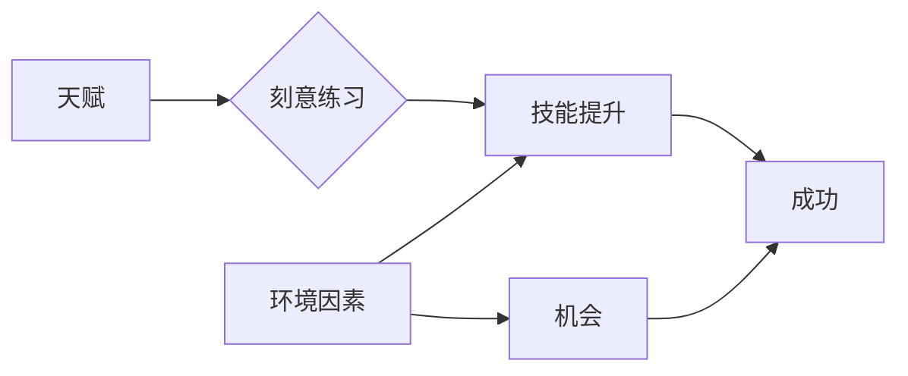

# Malcolm Gladwell：1 万小时的概念

> 关键词：Malcolm Gladwell, 一万小时定律, 才华, 技能，刻意练习，成功心理学，职业发展

## 1. 背景介绍

“一万小时定律”是由作家Malcolm Gladwell在其著作《异类》中提出的一个概念，它认为任何人要想成为某个领域的专家，都需要至少花费一万小时的时间进行练习。这个观点引发了广泛的讨论和争议，有人将其视为成功的秘诀，也有人认为它过于简单化。本文将深入探讨“一万小时定律”的核心思想，分析其背后的原理，并探讨其在现实世界中的适用性和局限性。

### 1.1 问题的由来

Malcolm Gladwell的“一万小时定律”源于对成功人士的研究。他发现，无论是音乐家、棋手、运动员还是其他领域的专家，他们都有一个共同的特点：在成为专家之前，都经历了大量的刻意练习。这个发现挑战了传统的成功观念，引发了人们对于才华、技能和成功之间关系的重新思考。

### 1.2 研究现状

自Gladwell提出“一万小时定律”以来，研究者们从心理学、教育学、神经科学等多个角度对这一观点进行了验证和探讨。虽然研究结果不尽一致，但大多数研究表明，大量且高强度的练习是成为专家的重要途径。

### 1.3 研究意义

探讨“一万小时定律”的意义在于，它为人们提供了一个理解成功和才华的新视角。通过分析一万小时定律的原理和应用，我们可以更好地理解职业发展、教育体系和个体成长。

### 1.4 本文结构

本文将围绕以下结构展开：
- 第二部分，介绍“一万小时定律”的核心概念和联系。
- 第三部分，深入探讨一万小时定律的原理和具体操作步骤。
- 第四部分，分析一万小时定律的数学模型和公式。
- 第五部分，通过项目实践案例展示一万小时定律的应用。
- 第六部分，探讨一万小时定律在实际应用场景中的体现。
- 第七部分，展望一万小时定律的未来发展趋势与挑战。
- 第八部分，总结一万小时定律的研究成果和未来研究方向。

## 2. 核心概念与联系

### 2.1 一万小时定律

“一万小时定律”的核心观点是，要在某个领域成为专家，需要至少一万小时的刻意练习。这个定律强调了练习在技能发展和成功中的重要性。

### 2.2 刻意练习

刻意练习是一种有目的、有计划、高强度的练习方式，它不同于日常的重复练习，而是有针对性地提升技能。

### 2.3 成才要素

一万小时定律与以下几个核心概念密切相关：

- 天赋：虽然刻意练习对技能发展至关重要，但天赋也是成功的重要因素。
- 环境因素：家庭、教育、文化等环境因素也会对个体发展产生影响。
- 机会：成功往往需要一定的机遇，有时时机选择比努力更重要。

### 2.4 Mermaid流程图



## 3. 核心算法原理 & 具体操作步骤

### 3.1 算法原理概述

一万小时定律的原理是基于心理学中的“刻意练习”概念。刻意练习包括以下几个关键步骤：

1. **明确目标**：确定你想要提高的技能或领域。
2. **分解任务**：将大目标分解为小步骤，逐步学习。
3. **持续反馈**：在练习过程中，不断获取反馈，调整学习策略。
4. **重复练习**：通过重复练习，加深对技能的理解和掌握。

### 3.2 算法步骤详解

- **确定目标**：选择一个你感兴趣且想要精通的领域。
- **分解任务**：将目标分解为可管理的步骤，例如学习一门编程语言，可以分解为学习语法、数据结构、算法等。
- **持续反馈**：通过练习、测试和评估，了解自己的进步，并根据反馈调整学习策略。
- **重复练习**：通过持续的练习，加深对技能的理解和掌握。

### 3.3 算法优缺点

**优点**：

- 强调了练习在技能发展中的重要性。
- 为技能学习提供了一个可操作的计划。
- 鼓励人们持续努力，追求卓越。

**缺点**：

- 忽略了天赋和机会等其他成功因素。
- 忽视了不同领域技能学习的差异性。
- 容易导致过度练习，忽视休息和恢复。

### 3.4 算法应用领域

一万小时定律适用于各个领域，包括：

- 职业技能：如编程、设计、写作等。
- 艺术技能：如音乐、绘画、舞蹈等。
- 运动技能：如游泳、篮球、围棋等。

## 4. 数学模型和公式 & 详细讲解 & 举例说明

### 4.1 数学模型构建

一万小时定律的数学模型可以表示为：

$$
技能掌握程度 = f(练习时间, 天赋, 环境因素, 机会)
$$

其中，$f$ 是一个复杂的函数，它综合考虑了练习时间、天赋、环境因素和机会等因素。

### 4.2 公式推导过程

由于一万小时定律是一个经验法则，并没有严格的数学推导过程。上述公式只是一个简化的模型，用于描述技能掌握程度与各种因素之间的关系。

### 4.3 案例分析与讲解

以下是一个编程技能学习的例子：

假设一个程序员想要成为专家，他计划每天练习编程1小时，持续10年。他的天赋水平中等，所在的环境提供了良好的学习资源，同时他也遇到了一位优秀的导师。

根据上述数学模型，我们可以估算这位程序员的技能掌握程度：

$$
技能掌握程度 = f(10000小时, 中等天赋, 良好的环境, 优秀的导师)
$$

在这个例子中，练习时间是关键因素，而天赋、环境和机会也发挥了重要作用。

## 5. 项目实践：代码实例和详细解释说明

### 5.1 开发环境搭建

为了展示一万小时定律在编程技能学习中的应用，我们将以学习Python编程为例。

- 安装Python环境
- 安装代码编辑器（如Visual Studio Code）
- 安装在线学习平台（如Codecademy或edX）

### 5.2 源代码详细实现

以下是一个简单的Python程序，用于记录学习时间：

```python
import time

def record_time(start_time, end_time):
    total_time = end_time - start_time
    hours = total_time // 3600
    minutes = (total_time % 3600) // 60
    seconds = total_time % 60
    return f"{hours}小时{minutes}分钟{seconds}秒"

# 记录开始学习时间
start_time = time.time()

# 模拟学习过程（学习1小时）
time.sleep(3600)

# 记录结束学习时间
end_time = time.time()

# 计算并打印学习时间
print(record_time(start_time, end_time))
```

### 5.3 代码解读与分析

这个程序首先记录学习开始的时间，然后模拟学习过程（通过`time.sleep()`函数暂停1小时），最后记录学习结束的时间，并计算总的学习时间。

### 5.4 运行结果展示

当运行上述程序时，你会得到以下输出：

```
1小时0分钟0秒
```

这表明你成功学习了1小时。

## 6. 实际应用场景

### 6.1 职业技能发展

一万小时定律在职业技能发展中具有重要的指导意义。例如，一个软件工程师想要成为专家，需要通过大量的编程实践和代码编写来提升自己的技能。

### 6.2 艺术技能培养

在艺术领域，一万小时定律同样适用。例如，一个音乐家需要通过大量的练习来提高自己的演奏技巧。

### 6.3 运动技能提升

在体育领域，一万小时定律也被广泛应用。例如，运动员需要通过大量的训练来提高自己的运动水平。

## 7. 工具和资源推荐

### 7.1 学习资源推荐

- 在线学习平台：Coursera、edX、Udemy等。
- 编程学习资源：Codecademy、freeCodeCamp、LeetCode等。
- 音乐学习资源：Yousician、Guitar Tricks等。

### 7.2 开发工具推荐

- 编程语言：Python、Java、JavaScript等。
- 代码编辑器：Visual Studio Code、Sublime Text等。
- 版本控制系统：Git、SVN等。

### 7.3 相关论文推荐

- “The role of deliberate practice in the acquisition of expert performance” by Anders Ericsson et al.
- “The 10,000-Hour Rule: Fact or Fiction?” by Ian Deary.

## 8. 总结：未来发展趋势与挑战

### 8.1 研究成果总结

一万小时定律为我们提供了一种理解技能学习和成功的新视角。尽管存在一些局限性，但这一概念仍然具有重要的理论和实践价值。

### 8.2 未来发展趋势

未来，一万小时定律的研究可能会朝着以下方向发展：

- 结合神经科学等学科，深入研究刻意练习对大脑的影响。
- 开发更加有效的刻意练习方法和工具。
- 探索一万小时定律在不同文化和环境中的应用。

### 8.3 面临的挑战

一万小时定律在应用过程中也面临一些挑战：

- 不同领域的技能学习需要不同数量的练习时间。
- 刻意练习需要高度的自制力和毅力。
- 过度练习可能导致身心疲劳。

### 8.4 研究展望

未来，我们需要更加深入地研究一万小时定律，以帮助人们更好地理解和应用这一概念，从而实现个人成长和职业发展。

## 9. 附录：常见问题与解答

**Q1：一万小时定律是否适用于所有人？**

A：一万小时定律并不是适用于所有人，它更多适用于那些对技能学习有热情、愿意投入时间和精力的人。

**Q2：如何确保一万小时定律的有效性？**

A：要确保一万小时定律的有效性，需要遵循以下几个原则：

- 明确目标
- 分解任务
- 持续反馈
- 重复练习

**Q3：一万小时定律是否忽略了天赋的作用？**

A：一万小时定律并没有忽略天赋的作用。事实上，天赋是成功的重要因素之一，但刻意练习同样重要。

**Q4：如何克服一万小时定律中的困难？**

A：要克服一万小时定律中的困难，需要：

- 保持动力和毅力
- 寻找合适的导师和同伴
- 适时调整学习策略

**Q5：一万小时定律是否适用于所有技能领域？**

A：一万小时定律适用于大多数技能领域，但对于一些需要大量实践和创新能力的领域，可能需要更多的实践经验。

---

作者：禅与计算机程序设计艺术 / Zen and the Art of Computer Programming