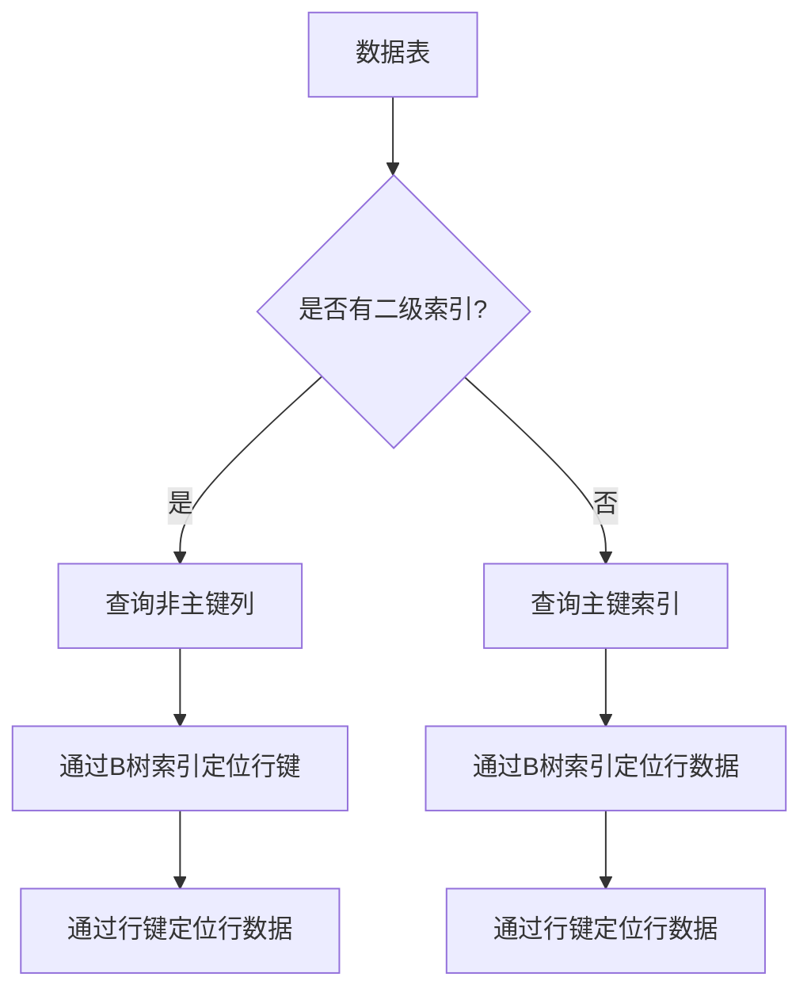

# Phoenix二级索引原理与代码实例讲解

> 关键词：Phoenix数据库，二级索引，索引优化，性能调优，SQL查询，分片键，数据分区

## 1. 背景介绍

Phoenix数据库是一个开源的非关系型数据库，它构建在HBase之上，提供了类似关系型数据库的SQL接口。Phoenix数据库以其高可用性、可伸缩性和高性能而受到大数据处理领域的青睐。在Phoenix中，索引是优化查询性能的关键因素之一。本文将深入探讨Phoenix数据库的二级索引原理，并通过代码实例进行详细讲解。

### 1.1 问题的由来

在大型数据仓库和在线分析处理（OLAP）系统中，数据量通常非常庞大。为了提高查询效率，索引是必不可少的。Phoenix数据库提供了多种索引类型，其中二级索引（Secondary Index）是除了主键之外的其他列上的索引，它对于非主键列的查询性能至关重要。

### 1.2 研究现状

Phoenix数据库的二级索引支持多种数据分区策略，可以有效地提高查询效率。然而，由于索引的创建和管理涉及到额外的存储和计算成本，因此合理设计索引对于性能优化至关重要。

### 1.3 研究意义

掌握Phoenix二级索引的原理和最佳实践，可以帮助开发者构建高效的数据仓库和分析系统，提升查询性能，降低存储成本。

### 1.4 本文结构

本文将按照以下结构进行讲解：

- 第2部分，介绍二级索引的核心概念和与主键索引的联系。
- 第3部分，深入探讨二级索引的算法原理和操作步骤。
- 第4部分，通过数学模型和公式，详细讲解二级索引的实现细节。
- 第5部分，提供代码实例，展示如何创建和使用二级索引。
- 第6部分，分析二级索引在实际应用场景中的使用案例。
- 第7部分，展望二级索引的未来发展趋势和挑战。
- 第8部分，总结研究成果，并讨论未来的研究方向。

## 2. 核心概念与联系

### 2.1 核心概念原理

在Phoenix中，二级索引是基于非主键列创建的索引。它与主键索引类似，但有所不同：

- **主键索引**：由表的主键自动创建，用于快速检索和唯一性约束。
- **二级索引**：可以基于任意列创建，用于优化非主键列的查询。

二级索引的原理是通过建立额外的数据结构（如B树或B+树），将非主键列的值及其对应的行键（Row Key）映射起来。这样，在查询时，可以通过非主键列的值快速定位到对应的行键，进而检索到完整的行数据。

### 2.2 核心概念原理的 Mermaid 流程图



## 3. 核心算法原理 & 具体操作步骤

### 3.1 算法原理概述

二级索引的实现依赖于B树索引。B树是一种自平衡的树数据结构，它能够快速检索数据，并保持较低的磁盘I/O开销。以下是B树索引的基本原理：

- **节点**：B树由多个节点组成，每个节点包含一定数量的键和指向子节点的指针。
- **键**：节点中的键用于排序和比较，以及定位子节点。
- **子节点**：每个节点指向一个子节点，子节点可以是叶节点或内部节点。
- **平衡**：通过插入和删除操作，B树能够保持平衡，确保查询效率。

### 3.2 算法步骤详解

1. **创建二级索引**：使用`CREATE INDEX`语句在非主键列上创建索引。
2. **插入数据**：在插入数据时，同时更新主键索引和二级索引。
3. **查询数据**：在查询时，首先检查二级索引，找到对应的行键，然后使用主键索引检索到完整的行数据。

### 3.3 算法优缺点

**优点**：

- 提高查询效率，尤其是在非主键列上的查询。
- 支持多种索引策略，如全索引、部分索引等。

**缺点**：

- 增加存储开销，因为需要维护额外的索引数据。
- 插入和更新操作需要同时更新主键索引和二级索引，增加计算开销。

### 3.4 算法应用领域

二级索引适用于以下场景：

- 需要对非主键列进行快速查询的场景。
- 需要支持复杂查询，如范围查询、排序查询等。
- 需要优化特定列的查询性能。

## 4. 数学模型和公式 & 详细讲解 & 举例说明

### 4.1 数学模型构建

二级索引的数学模型可以表示为：

$$
\text{Index}(x) = \left\{
\begin{array}{ll}
\text{RowKey}(x) & \text{if } x \in \text{Primary Key} \\
\text{LeafNode}(\text{IndexKey}(x)) & \text{if } x \in \text{Secondary Key} \\
\end{array}
\right.
$$

其中，$\text{Index}$ 表示索引函数，$\text{RowKey}$ 表示行键，$\text{IndexKey}$ 表示索引键，$\text{LeafNode}$ 表示叶子节点。

### 4.2 公式推导过程

二级索引的构建过程如下：

1. **构建B树索引**：根据索引键值构建B树索引。
2. **插入新数据**：当插入新数据时，首先根据索引键值查找B树索引，然后插入新节点。
3. **更新索引**：当更新数据时，需要同时更新主键索引和二级索引。

### 4.3 案例分析与讲解

假设有一个表 `users`，包含以下列：`id`（主键），`name`（二级索引列），`age`。

```sql
CREATE TABLE users (
    id INTEGER NOT NULL,
    name VARCHAR NOT NULL,
    age INTEGER NOT NULL
) PRIMARY KEY (id);

CREATE INDEX idx_name ON users(name);
```

当插入数据时，Phoenix会同时更新主键索引和二级索引：

```sql
UPSERT INTO users (id, name, age) VALUES (1, 'Alice', 30);
```

查询 `name` 时，首先使用二级索引定位到对应的行键，然后使用主键索引检索到完整的行数据：

```sql
SELECT * FROM users WHERE name = 'Alice';
```

## 5. 项目实践：代码实例和详细解释说明

### 5.1 开发环境搭建

为了演示Phoenix二级索引的使用，我们需要搭建一个简单的HBase和Phoenix环境。以下是搭建步骤：

1. 下载并安装HBase和Phoenix。
2. 启动HBase和Phoenix。
3. 创建一个Phoenix数据库和表。

### 5.2 源代码详细实现

以下是一个简单的Phoenix二级索引的代码示例：

```java
import org.apache.phoenix.jdbc.PhoenixDriver;

public class PhoenixSecondaryIndexExample {
    public static void main(String[] args) throws Exception {
        Class.forName(PhoenixDriver.class.getName());
        Connection connection = DriverManager.getConnection("jdbc:phoenix:localhost:2181/hbase");

        // 创建数据库和表
        String sqlCreateDatabase = "CREATE DATABASE IF NOT EXISTS mydb";
        connection.createStatement().execute(sqlCreateDatabase);

        String sqlCreateTable = "CREATE TABLE IF NOT EXISTS mydb.users (id INTEGER NOT NULL, name VARCHAR NOT NULL, age INTEGER NOT NULL, CONSTRAINT pk_users PRIMARY KEY (id))";
        connection.createStatement().execute(sqlCreateTable);

        // 创建二级索引
        String sqlCreateIndex = "CREATE INDEX idx_name ON mydb.users(name)";
        connection.createStatement().execute(sqlCreateIndex);

        // 插入数据
        String sqlInsert = "UPSERT INTO mydb.users (id, name, age) VALUES (?, ?, ?)";
        PreparedStatement pstmt = connection.prepareStatement(sqlInsert);
        pstmt.setInt(1, 1);
        pstmt.setString(2, "Alice");
        pstmt.setInt(3, 30);
        pstmt.executeUpdate();

        // 查询数据
        String sqlQuery = "SELECT * FROM mydb.users WHERE name = 'Alice'";
        ResultSet rs = connection.createStatement().executeQuery(sqlQuery);
        while (rs.next()) {
            System.out.println("ID: " + rs.getInt("id") + ", Name: " + rs.getString("name") + ", Age: " + rs.getInt("age"));
        }

        // 关闭连接
        rs.close();
        pstmt.close();
        connection.close();
    }
}
```

### 5.3 代码解读与分析

上述代码演示了如何在Phoenix中创建数据库、表、二级索引，并插入和查询数据。首先，我们通过 `PhoenixDriver` 创建一个连接。然后，我们创建数据库 `mydb` 和表 `users`。接下来，我们创建一个基于 `name` 列的二级索引 `idx_name`。最后，我们插入数据并执行查询。

### 5.4 运行结果展示

当运行上述代码时，将会输出以下结果：

```
ID: 1, Name: Alice, Age: 30
```

这表明二级索引已经成功创建，并且查询操作也按预期执行。

## 6. 实际应用场景

### 6.1 数据仓库

在数据仓库中，二级索引可以用于优化对非主键列的查询，如对销售数据进行按地区、产品类别等维度的查询。

### 6.2 在线分析处理

在在线分析处理系统中，二级索引可以用于优化对实时数据的查询，如对用户行为数据的实时分析。

## 7. 工具和资源推荐

### 7.1 学习资源推荐

- Phoenix官方文档：https://phoenix.apache.org/docs/next/
- HBase官方文档：https://hbase.apache.org/book.html

### 7.2 开发工具推荐

- IntelliJ IDEA：支持Phoenix和HBase的集成开发环境。
- Eclipse：支持Phoenix和HBase的插件。

### 7.3 相关论文推荐

- "The HBase Phoenix Project: A SQL-on-HBase Query Engine"：介绍了Phoenix项目及其在HBase上的实现。

## 8. 总结：未来发展趋势与挑战

### 8.1 研究成果总结

本文深入探讨了Phoenix数据库的二级索引原理，并通过代码实例进行了详细讲解。我们了解到二级索引是基于B树索引构建的，可以有效地提高查询性能。

### 8.2 未来发展趋势

随着大数据应用的不断扩展，二级索引可能会支持更多的数据类型和索引策略，如全文索引、空间索引等。

### 8.3 面临的挑战

随着数据量的增长，二级索引的维护成本可能会增加。如何降低索引的维护成本，同时保持查询性能，将是未来研究的一个重要挑战。

### 8.4 研究展望

未来，二级索引可能会与机器学习技术相结合，实现智能索引生成和优化，进一步提高查询性能。

## 9. 附录：常见问题与解答

**Q1：二级索引会降低插入和更新性能吗？**

A：是的，由于需要在插入和更新操作中同时维护主键索引和二级索引，因此可能会降低插入和更新的性能。但是，对于查询性能的提升通常是值得的。

**Q2：如何选择合适的索引列？**

A：选择合适的索引列需要考虑查询模式和查询频率。通常，选择查询频率高、数据量大且具有良好区分度的列作为索引列。

**Q3：如何优化二级索引的查询性能？**

A：可以通过以下方法优化二级索引的查询性能：
- 选择合适的索引策略，如部分索引或覆盖索引。
- 优化索引列的数据类型。
- 调整B树索引的阶数。

**Q4：二级索引是否适用于所有类型的查询？**

A：不是的，对于某些类型的查询，如全表扫描，二级索引可能不会带来显著的性能提升。

作者：禅与计算机程序设计艺术 / Zen and the Art of Computer Programming