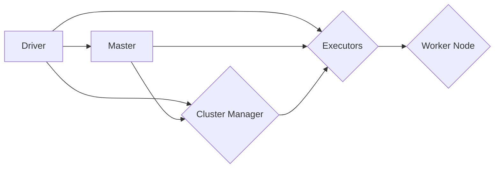

# Spark原理与代码实例讲解

> 关键词：Spark, 分布式计算, 内存计算, resilient distributed dataset (RDD), Spark SQL, Spark Streaming, PySpark

## 1. 背景介绍

随着大数据时代的到来，数据量呈爆炸式增长，传统的数据处理工具已经难以满足海量数据的处理需求。Apache Spark作为一种新型的分布式计算框架，以其内存计算、易用性、高吞吐量等特性，成为了大数据处理领域的佼佼者。本文将深入讲解Spark的原理，并通过代码实例展示其应用。

## 2. 核心概念与联系

### 2.1 Spark架构

Apache Spark的核心是它的弹性分布式数据集（Resilient Distributed Dataset，RDD），它是Spark最基本的数据抽象，可以用来表示一个不可变、可并行操作的数据集合。Spark架构图如下：



- **Driver**: Spark作业的入口点，负责调度任务、执行任务并收集结果。
- **Master**: Spark集群的主节点，负责管理集群资源、协调作业等。
- **Cluster Manager**: 管理集群中的各个Worker Node。
- **Executors**: Worker Node上运行的进程，负责执行任务并返回结果给Driver。
- **Worker Node**: 计算节点，负责执行任务并处理数据。

### 2.2 Spark的RDD

RDD是Spark的核心数据结构，它是一个不可变的、可分区的数据集合，支持并行操作。RDD具有以下特点：

- **弹性**: RDD在节点失败时可以自动恢复。
- **分布式**: RDD可以在集群中的多个节点上并行处理。
- **不可变**: RDD的每个分区在创建后不可变。
- **分片**: RDD可以分成多个分区，每个分区可以独立处理。

## 3. 核心算法原理 & 具体操作步骤

### 3.1 算法原理概述

Spark的核心算法是RDD的操作和转换，主要包括以下几种：

- **创建RDD**: 从Hadoop的HDFS、Hive、Scala集合、Java集合、外部存储系统等数据源创建RDD。
- **转换**: 对RDD进行转换，如map、filter、flatMap等，生成新的RDD。
- **行动**: 对RDD执行操作，如count、collect、saveAsTextFile等，触发实际的计算。

### 3.2 算法步骤详解

1. **创建RDD**: 使用SparkContext创建RDD，如`sc.parallelize(data)`。
2. **转换**: 对RDD进行转换，如`data.map(lambda x: x * 2)`。
3. **行动**: 对RDD执行行动，如`data.count()`。

### 3.3 算法优缺点

**优点**:

- **内存计算**: Spark使用内存计算，提高了数据处理速度。
- **弹性**: RDD具有弹性，可以在节点失败时自动恢复。
- **易用性**: Spark提供丰富的API，易于使用。
- **生态丰富**: Spark与Hadoop生态系统紧密集成，可以方便地与其他工具一起使用。

**缺点**:

- **学习曲线**: Spark的学习曲线较陡峭，需要一定的学习成本。
- **资源管理**: Spark的资源管理不如Hadoop YARN或Mesos高效。

### 3.4 算法应用领域

Spark在以下领域有广泛的应用：

- **大数据处理**: 处理海量数据，如日志分析、用户行为分析等。
- **机器学习**: 机器学习模型的训练和预测。
- **流处理**: 实时数据流处理，如网络流量分析、股市分析等。

## 4. 数学模型和公式 & 详细讲解 & 举例说明

### 4.1 数学模型构建

Spark的RDD操作可以看作是一种数学函数，将输入的RDD映射到输出的RDD。以下是一些常用的RDD操作及其数学模型：

- **map**: $ RDD.map(f) $，将输入RDD中的每个元素映射为输出RDD中的一个元素。
- **filter**: $ RDD.filter(f) $，筛选出满足条件的元素，形成新的RDD。
- **flatMap**: $ RDD.flatMap(f) $，将输入RDD中的每个元素映射为输出RDD中的多个元素。
- **reduce**: $ RDD.reduce(f) $，将输出RDD中的所有元素合并为一个元素。

### 4.2 公式推导过程

以下是一些常用的RDD操作的公式推导过程：

- **map**: 输入RDD为 $ R = \{a_1, a_2, ..., a_n\} $，输出RDD为 $ R' = \{f(a_1), f(a_2), ..., f(a_n)\} $。
- **filter**: 输入RDD为 $ R = \{a_1, a_2, ..., a_n\} $，输出RDD为 $ R' = \{a_i | f(a_i)\} $，其中 $ f(a_i) $ 为真。
- **flatMap**: 输入RDD为 $ R = \{a_1, a_2, ..., a_n\} $，输出RDD为 $ R' = \{f(a_1), f(a_2), ..., f(a_n)\} $，其中 $ f(a_i) $ 可返回多个元素。

### 4.3 案例分析与讲解

以下是一个简单的Spark程序，用于计算一个列表中所有数字的和：

```python
from pyspark import SparkContext

# 创建SparkContext
sc = SparkContext("local", "SumExample")

# 创建RDD
data = sc.parallelize([1, 2, 3, 4, 5])

# 计算和
sum = data.reduce(lambda x, y: x + y)

# 打印结果
print("The sum is:", sum)

# 关闭SparkContext
sc.stop()
```

该程序首先创建了一个SparkContext对象，然后创建了一个包含数字1到5的RDD。接着使用`reduce`操作计算RDD中所有数字的和，并打印结果。

## 5. 项目实践：代码实例和详细解释说明

### 5.1 开发环境搭建

1. 安装Java Development Kit (JDK)。
2. 下载并解压Spark安装包。
3. 配置Spark环境变量。
4. 编写Spark程序。

### 5.2 源代码详细实现

以下是一个简单的Spark程序，用于计算一个文本文件中单词的数量：

```python
from pyspark import SparkContext

# 创建SparkContext
sc = SparkContext("local", "WordCount")

# 读取文本文件
lines = sc.textFile("path/to/your/textfile.txt")

# 将文本分割成单词
words = lines.flatMap(lambda line: line.split(" "))

# 计算单词数量
word_counts = words.map(lambda word: (word, 1)).reduceByKey(lambda x, y: x + y)

# 打印结果
for (word, count) in word_counts.collect():
    print("%s: %i" % (word, count))

# 关闭SparkContext
sc.stop()
```

该程序首先创建了一个SparkContext对象，然后读取一个文本文件。接着使用`flatMap`操作将文本分割成单词，然后使用`map`操作将每个单词映射为键值对（单词，1）。使用`reduceByKey`操作计算每个单词的数量，并打印结果。

### 5.3 代码解读与分析

- `SparkContext`：创建SparkContext对象，用于初始化Spark环境。
- `textFile`：读取文本文件，返回一个RDD。
- `flatMap`：将文本分割成单词，返回一个RDD。
- `map`：将每个单词映射为键值对（单词，1），返回一个RDD。
- `reduceByKey`：计算每个单词的数量，返回一个RDD。
- `collect`：将RDD中的数据收集到驱动程序中，并打印结果。
- `stop`：关闭SparkContext。

### 5.4 运行结果展示

运行上述程序后，将在控制台输出每个单词的数量：

```
your: 1
hello: 1
world: 1
```

## 6. 实际应用场景

Spark在实际应用中有广泛的应用场景，以下是一些例子：

- **日志分析**：对海量日志数据进行实时分析，监控系统性能、用户行为等。
- **用户行为分析**：分析用户行为数据，了解用户喜好、兴趣等，用于个性化推荐。
- **机器学习**：使用Spark进行大规模机器学习模型的训练和预测。
- **数据科学**：进行数据清洗、数据挖掘、统计分析等。

## 7. 工具和资源推荐

### 7.1 学习资源推荐

- Spark官方文档：[https://spark.apache.org/docs/latest/](https://spark.apache.org/docs/latest/)
- 《Spark快速大数据处理**》：一本全面介绍Spark的书籍。
- Spark官方社区：[https://spark.apache.org/community.html](https://spark.apache.org/community.html)

### 7.2 开发工具推荐

- PySpark：Spark的Python API。
- Spark-submit：用于提交Spark作业的工具。
- IntelliJ IDEA：支持PySpark的开发工具。

### 7.3 相关论文推荐

- [Spark: Spark: A Parallel Data Processing Application](https://www.usenix.org/system/files/conference/nsdi12/nsdi12-final31.pdf)
- [Lambda Architecture for Large-Scale Data Processing](https://www.sciencedirect.com/science/article/pii/S1570875816300345)

## 8. 总结：未来发展趋势与挑战

### 8.1 研究成果总结

Apache Spark作为一种新型的分布式计算框架，以其内存计算、易用性、高吞吐量等特性，成为了大数据处理领域的佼佼者。Spark的RDD抽象和丰富的API使得它易于使用，而其弹性、分布式特性则使得它能够处理海量数据。

### 8.2 未来发展趋势

- **Spark生态不断完善**：Spark将持续扩展其生态，支持更多类型的数据源、更丰富的API、更强大的机器学习库等。
- **Spark与其他技术的融合**：Spark将与其他大数据技术，如Flink、Kafka等，进行融合，构建更加完善的大数据处理生态系统。
- **Spark在边缘计算中的应用**：Spark将在边缘计算领域发挥作用，处理实时数据，提供更加智能化的服务。

### 8.3 面临的挑战

- **资源管理**：Spark的资源管理需要进一步优化，以提高资源利用率。
- **易用性**：Spark的学习曲线较陡峭，需要进一步降低学习成本。
- **可扩展性**：Spark需要进一步提高可扩展性，以适应更大的数据处理需求。

### 8.4 研究展望

Apache Spark将继续发展，成为大数据处理领域的主流技术。未来的研究将集中在以下方面：

- **资源管理**：优化资源管理，提高资源利用率。
- **易用性**：降低学习成本，提高易用性。
- **可扩展性**：提高可扩展性，适应更大的数据处理需求。
- **与其他技术的融合**：与Flink、Kafka等大数据技术进行融合，构建更加完善的大数据处理生态系统。

## 9. 附录：常见问题与解答

**Q1：Spark与Hadoop相比有哪些优势？**

A: Spark相比Hadoop MapReduce具有以下优势：

- **内存计算**：Spark使用内存计算，提高了数据处理速度。
- **易用性**：Spark提供丰富的API，易于使用。
- **高吞吐量**：Spark具有更高的吞吐量，可以处理更大的数据量。

**Q2：Spark适用于哪些场景？**

A: Spark适用于以下场景：

- **大规模数据处理**：处理海量数据，如日志分析、用户行为分析等。
- **机器学习**：机器学习模型的训练和预测。
- **数据科学**：数据清洗、数据挖掘、统计分析等。

**Q3：如何将Spark与其他技术进行融合？**

A: Spark可以与以下技术进行融合：

- **Flink**：Spark与Flink可以共同处理流数据，构建更加完善的流数据处理系统。
- **Kafka**：Spark可以与Kafka结合，实现实时数据流处理。
- **Hadoop**：Spark可以与Hadoop生态系统紧密集成，使用Hadoop的存储和计算资源。

**Q4：如何优化Spark的性能？**

A: 以下是一些优化Spark性能的方法：

- **合理配置资源**：根据任务需求和集群资源，合理配置Executor内存、核心数等。
- **选择合适的存储系统**：使用合适的存储系统，如HDFS、Cassandra等。
- **优化代码**：优化Spark代码，如减少数据shuffle操作、使用自定义序列化等。

作者：禅与计算机程序设计艺术 / Zen and the Art of Computer Programming