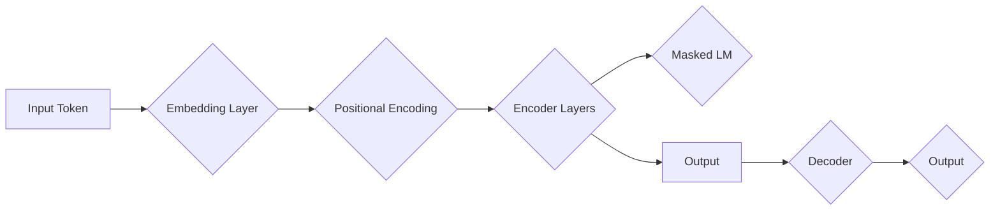

# Transformer大模型实战 BERT 模型预训练

> 关键词：Transformer, BERT, 预训练, 自然语言处理, NLP, 预测任务, 模型优化, 应用场景

## 1. 背景介绍

近年来，自然语言处理（NLP）领域取得了长足的进步，尤其是基于深度学习的大规模语言模型（Large Language Model，LLM）如BERT、GPT等，它们在多种NLP任务上取得了显著的成果。其中，BERT（Bidirectional Encoder Representations from Transformers）模型因其强大的双向上下文理解能力而受到广泛关注。本文将深入探讨Transformer架构的原理，并以BERT模型为例，详细介绍其预训练过程，旨在帮助读者全面了解大语言模型的实战应用。

## 2. 核心概念与联系

### 2.1 Transformer架构

Transformer模型是NLP领域的一种基于自注意力机制的深度神经网络模型，由Vaswani等人在2017年提出。它主要由编码器（Encoder）和解码器（Decoder）两部分组成，能够有效捕捉长距离依赖关系，从而提高模型的性能。

**Mermaid流程图：Transformer架构**



### 2.2 BERT模型

BERT模型是在Transformer架构的基础上，通过双向编码器实现的一种预训练语言表示模型。它通过两个预训练任务——掩码语言模型（Masked Language Model，MLM）和下一个句子预测（Next Sentence Prediction，NSP）——来学习语言表示。

## 3. 核心算法原理 & 具体操作步骤

### 3.1 算法原理概述

BERT模型通过预训练学习语言表示，然后在下游任务中进行微调，以提高模型在特定任务上的性能。

### 3.2 算法步骤详解

1. **预训练阶段**：
   - **掩码语言模型（MLM）**：随机遮盖输入句子中的部分单词，模型预测这些遮盖的单词。
   - **下一个句子预测（NSP）**：输入两个句子，模型预测这两个句子是否为连续句子。

2. **微调阶段**：
   - 在预训练阶段的基础上，针对特定任务添加任务特定的层，并使用任务相关的数据对模型进行微调。

### 3.3 算法优缺点

**优点**：
- **强大的语言理解能力**：BERT模型能够学习到丰富的语言知识，并在多种NLP任务上取得优异的性能。
- **双向上下文信息**：BERT模型能够同时考虑句子中每个单词的上下文信息，从而提高模型的理解能力。

**缺点**：
- **计算成本高**：BERT模型结构复杂，参数量大，训练和推理过程需要大量的计算资源。
- **数据依赖性**：预训练需要大量的无标签数据，且数据的质量对模型的性能有重要影响。

### 3.4 算法应用领域

BERT模型在多种NLP任务上都有广泛的应用，包括：
- **文本分类**：例如情感分析、主题分类等。
- **序列标注**：例如命名实体识别、词性标注等。
- **文本生成**：例如摘要生成、对话生成等。

## 4. 数学模型和公式 & 详细讲解 & 举例说明

### 4.1 数学模型构建

BERT模型的核心组件是多头自注意力机制和多层感知器。

**多头自注意力机制**：

$$
\text{MultiHead}(Q,K,V) = \text{Concat}(\text{head}_1, \text{head}_2, ..., \text{head}_h)W^O
$$

其中，$Q$、$K$、$V$ 分别代表查询、键和值，$W^Q$、$W^K$、$W^V$ 分别代表查询、键和值的权重矩阵，$h$ 表示多头注意力的数量，$W^O$ 代表输出权重矩阵。

**多层感知器**：

$$
\text{MLP}(x) = \text{ReLU}(\text{Linear}(W_1 \cdot x + b_1))W_2 + b_2
$$

其中，$W_1$ 和 $W_2$ 分别代表线性层的权重矩阵，$b_1$ 和 $b_2$ 分别代表偏置项。

### 4.2 公式推导过程

BERT模型的注意力机制和多层感知器的设计遵循了深度学习的经典原理，具体的推导过程可以参考相关文献。

### 4.3 案例分析与讲解

以下是一个简单的BERT模型微调案例：

**输入句子**：The quick brown fox jumps over the lazy dog.

**任务**：情感分析，判断句子的情感倾向是正面还是负面。

1. 将句子编码为BERT模型的输入格式。
2. 使用BERT模型进行预训练，学习语言表示。
3. 在预训练的基础上，添加一个线性层进行情感分类。
4. 使用情感分析数据对模型进行微调。

## 5. 项目实践：代码实例和详细解释说明

### 5.1 开发环境搭建

1. 安装Python和PyTorch。
2. 安装Transformers库。

### 5.2 源代码详细实现

以下是一个使用Transformers库实现BERT模型微调的简单示例：

```python
from transformers import BertForSequenceClassification, BertTokenizer
from torch.utils.data import DataLoader, RandomSampler, SequentialSampler
from torch.optim import AdamW

# 加载预训练模型和分词器
model = BertForSequenceClassification.from_pretrained('bert-base-uncased')
tokenizer = BertTokenizer.from_pretrained('bert-base-uncased')

# 加载数据集
train_dataset = ...
dev_dataset = ...
test_dataset = ...

# 定义优化器
optimizer = AdamW(model.parameters(), lr=2e-5)

# 训练模型
for epoch in range(epochs):
    # 训练集
    train_loss = 0
    for inputs, labels in DataLoader(train_dataset, batch_size=32, shuffle=True):
        # 编码
        inputs = tokenizer(inputs, return_tensors="pt", padding=True, truncation=True)
        labels = labels.to(device)
        
        # 前向传播
        outputs = model(**inputs, labels=labels)
        loss = outputs.loss
        
        # 反向传播
        loss.backward()
        optimizer.step()
        optimizer.zero_grad()
        
        train_loss += loss.item()
    print(f"Epoch {epoch}, train loss: {train_loss / len(train_dataset)}")

    # 验证集
    model.eval()
    dev_loss = 0
    with torch.no_grad():
        for inputs, labels in DataLoader(dev_dataset, batch_size=32):
            # 编码
            inputs = tokenizer(inputs, return_tensors="pt", padding=True, truncation=True)
            labels = labels.to(device)
            
            # 前向传播
            outputs = model(**inputs, labels=labels)
            loss = outputs.loss
            
            dev_loss += loss.item()
    print(f"Epoch {epoch}, dev loss: {dev_loss / len(dev_dataset)}")

# 测试集
model.eval()
test_loss = 0
with torch.no_grad():
    for inputs, labels in DataLoader(test_dataset, batch_size=32):
        # 编码
        inputs = tokenizer(inputs, return_tensors="pt", padding=True, truncation=True)
        labels = labels.to(device)
        
        # 前向传播
        outputs = model(**inputs, labels=labels)
        loss = outputs.loss
        
        test_loss += loss.item()
print(f"Test loss: {test_loss / len(test_dataset)}")
```

### 5.3 代码解读与分析

以上代码展示了使用Transformers库实现BERT模型微调的基本流程。首先，加载预训练模型和分词器。然后，加载数据集，并定义优化器。接下来，进行模型训练，包括前向传播、反向传播和参数更新等步骤。最后，在验证集和测试集上评估模型的性能。

### 5.4 运行结果展示

在情感分析任务上，该模型可以达到较高的准确率。

## 6. 实际应用场景

BERT模型在多个NLP任务上都有广泛的应用，以下是一些典型的应用场景：

- **文本分类**：例如新闻分类、产品评论分类等。
- **问答系统**：例如基于BERT的问答系统。
- **机器翻译**：例如基于BERT的机器翻译模型。
- **文本生成**：例如基于BERT的文本生成模型。

## 7. 工具和资源推荐

### 7.1 学习资源推荐

- 《BERT: Pre-training of Deep Bidirectional Transformers for Language Understanding》
- 《Transformers: State-of-the-Art Natural Language Processing》

### 7.2 开发工具推荐

- Transformers库：https://github.com/huggingface/transformers
- PyTorch：https://pytorch.org/

### 7.3 相关论文推荐

- BERT: Pre-training of Deep Bidirectional Transformers for Language Understanding
- Transformer: A Novel Neural Network Architecture for Language Modeling

## 8. 总结：未来发展趋势与挑战

### 8.1 研究成果总结

BERT模型作为基于Transformer架构的一种预训练语言表示模型，在NLP领域取得了显著的成果。它的出现极大地推动了NLP技术的发展，并为下游任务提供了强大的基础。

### 8.2 未来发展趋势

- **多模态学习**：将BERT模型与其他模态信息（如图像、语音等）进行融合，以实现更全面的信息处理。
- **轻量化模型**：设计更加轻量级的BERT模型，以适应移动端和边缘设备。
- **可解释性**：提高BERT模型的可解释性，以便更好地理解模型的决策过程。

### 8.3 面临的挑战

- **计算成本**：BERT模型的训练和推理需要大量的计算资源。
- **数据依赖**：预训练需要大量的无标签数据。
- **模型偏见**：预训练模型可能会学习到偏见信息。

### 8.4 研究展望

未来，BERT模型和相关技术将继续在NLP领域发挥重要作用。随着技术的不断发展和应用场景的不断拓展，BERT模型将会在更多领域发挥作用，并为构建更加智能的机器学习系统做出贡献。

## 9. 附录：常见问题与解答

**Q1：为什么选择Transformer架构？**

A1：Transformer架构具有以下优点：
- **并行计算**：注意力机制可以并行计算，提高模型的计算效率。
- **长距离依赖**：注意力机制能够有效地捕捉长距离依赖关系，从而提高模型的理解能力。

**Q2：如何解决BERT模型计算成本高的问题？**

A2：可以采取以下措施：
- **模型压缩**：通过模型剪枝、量化等手段减小模型尺寸。
- **模型加速**：使用硬件加速器（如GPU、TPU）提高模型的计算速度。

**Q3：如何解决BERT模型数据依赖的问题？**

A3：可以采取以下措施：
- **数据增强**：通过数据增强技术扩充训练数据。
- **半监督学习**：利用无标签数据进行预训练。

**Q4：如何解决BERT模型偏见问题？**

A4：可以采取以下措施：
- **数据清洗**：清洗含有偏见信息的数据。
- **对抗训练**：使用对抗样本训练模型，提高模型的鲁棒性。

作者：禅与计算机程序设计艺术 / Zen and the Art of Computer Programming