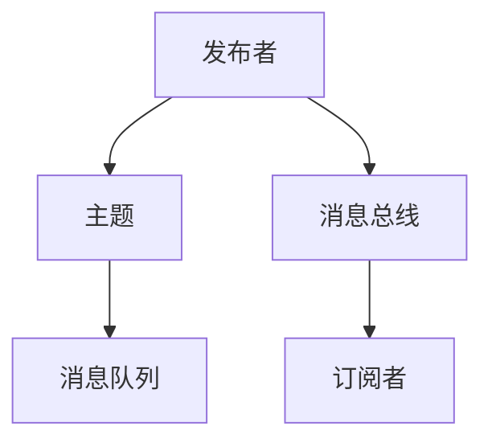
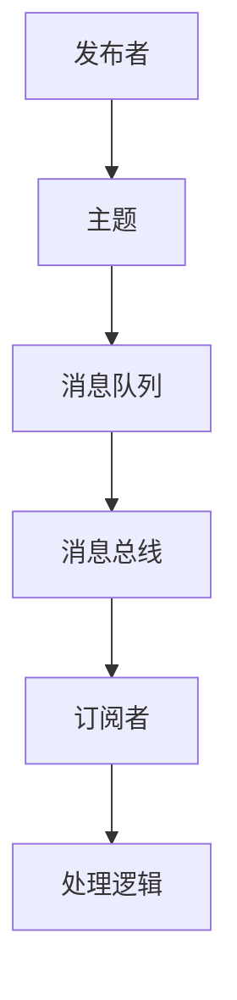
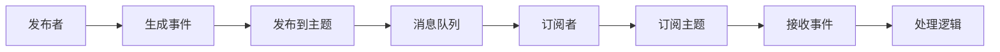

                 

# 发布订阅 原理与代码实例讲解

> 关键词：发布订阅, 事件驱动, 异步通信, 高并发, 容错性

## 1. 背景介绍

在当今的互联网应用中，事件驱动和异步通信已经变得越来越重要。特别是对于大规模高并发的分布式系统而言，如何将异步事件高效地传递、处理和响应，成为了系统设计的关键。发布订阅（Publish-Subscribe，Pub/Sub）模式正是一种用于事件驱动和异步通信的机制，通过解耦生产者和消费者，实现了松散耦合、高可扩展和强容错性的系统架构。

### 1.1 问题由来
在传统的同步通信模式中，请求和响应是紧密耦合的，每个服务调用都需要等待响应返回才能继续执行。这种模式在服务之间耦合度较高，难以扩展和维护。而发布订阅模式则通过将事件发布到主题，然后订阅者通过主题订阅事件，解耦了服务之间的依赖关系，使得系统更加灵活、可扩展。

例如，在电商系统中，订单系统通过发布事件通知库存系统。库存系统订阅订单主题，一旦有订单生成，库存系统立即响应该事件，进行库存扣减。这种方式大大提升了系统的响应速度和容错性。

### 1.2 问题核心关键点
发布订阅模式的核心在于将事件发布到主题上，订阅者通过订阅主题获取事件。这种模式需要考虑如何高效发布、订阅、管理和传递事件，同时还需要解决潜在的数据一致性问题、服务解耦和容错性问题。

发布订阅模式的关键要素包括：
1. **发布者**（Publisher）：负责发布事件的实体。
2. **订阅者**（Subscriber）：负责订阅事件的实体。
3. **主题**（Topic）：发布者和订阅者共享的通信渠道。
4. **消息队列**（Message Queue）：负责存储和传递事件消息的机制。

这些关键要素通过异步、松耦合的方式来构建事件驱动的系统。发布订阅模式的优势在于：

- **高可扩展性**：发布者和订阅者可以独立扩展，不影响对方的性能。
- **容错性**：订阅者可以在故障情况下重新订阅，保证系统的健壮性。
- **松耦合**：发布者和订阅者无需直接交互，降低了系统复杂度。

### 1.3 问题研究意义
研究发布订阅模式对于构建高效、可扩展、容错性的分布式系统具有重要意义：

1. **提升系统响应速度**：通过异步发布和订阅，可以避免阻塞请求，提高系统响应速度。
2. **降低系统耦合度**：发布订阅模式解耦了服务之间的依赖关系，减少了系统的耦合度。
3. **支持高并发场景**：发布订阅模式支持并发订阅和发布，提高了系统的处理能力。
4. **增强系统容错性**：订阅者可以在故障情况下重新订阅，保证了系统的健壮性。
5. **提升系统开发效率**：发布订阅模式将事件驱动与解耦设计结合，提高了系统的开发效率。

## 2. 核心概念与联系

### 2.1 核心概念概述

为更好地理解发布订阅模式的工作原理，本节将介绍几个关键概念：

- **发布者**（Publisher）：负责生成事件并将其发布到主题的实体。
- **订阅者**（Subscriber）：负责订阅主题并处理接收到的事件的实体。
- **主题**（Topic）：用于发布和订阅事件的消息通道。
- **消息队列**（Message Queue）：用于存储和传递事件消息的机制。
- **消息总线**（Message Bus）：用于管理和调度消息传递的机制。

这些概念之间的逻辑关系可以通过以下Mermaid流程图来展示：



这个流程图展示了发布订阅模式的基本流程：发布者将事件发布到主题上，主题通过消息队列存储事件，订阅者通过消息总线订阅主题，从而接收并处理事件。

### 2.2 概念间的关系

这些核心概念之间存在着紧密的联系，形成了发布订阅模式的基本架构。下面通过几个Mermaid流程图来展示这些概念之间的关系。

#### 2.2.1 发布订阅模式的整体架构



这个综合流程图展示了发布订阅模式的基本架构。发布者将事件发布到主题上，主题通过消息队列存储事件，订阅者通过消息总线订阅主题，从而接收并处理事件。

#### 2.2.2 发布订阅模式的详细过程



这个流程图展示了发布订阅模式的详细过程。发布者生成事件并发布到主题上，主题将事件存储到消息队列中，订阅者订阅主题并接收事件，最终根据处理逻辑对事件进行响应。

## 3. 核心算法原理 & 具体操作步骤

### 3.1 算法原理概述

发布订阅模式的核心思想是通过消息队列来实现事件的高效发布和订阅。其基本流程如下：

1. **发布事件**：发布者生成事件，并通过消息总线将其发布到指定主题上。
2. **订阅主题**：订阅者订阅主题，并通过消息总线接收该主题上的所有事件。
3. **处理事件**：订阅者接收事件后，根据主题名称和具体的事件类型，执行相应的处理逻辑。

发布订阅模式的关键在于消息队列的异步通信机制。通过异步通信，发布者和订阅者可以独立运行，互不影响，提升了系统的吞吐量和响应速度。同时，消息队列能够存储和传递大量的事件，避免了事件丢失和消息积压的问题，提高了系统的容错性和可靠性。

### 3.2 算法步骤详解

发布订阅模式的算法步骤主要包括以下几个关键环节：

1. **初始化**：发布者和订阅者初始化对应的主题和消息队列，订阅者订阅指定主题。
2. **发布事件**：发布者生成事件，并将事件发布到主题上。
3. **接收事件**：订阅者通过消息总线接收主题上的所有事件。
4. **处理事件**：订阅者根据事件类型和处理逻辑，执行相应的操作。

以一个简单的电商订单系统为例，展示发布订阅模式的工作流程：

1. **初始化**：订单系统初始化一个主题 `order-topic`，库存系统订阅该主题。
2. **发布事件**：订单系统生成订单事件 `new-order`，并将其发布到 `order-topic` 主题上。
3. **接收事件**：库存系统通过消息总线接收 `new-order` 事件。
4. **处理事件**：库存系统根据 `new-order` 事件，执行库存扣减操作。

### 3.3 算法优缺点

发布订阅模式的优点：

1. **高可扩展性**：发布者和订阅者可以独立扩展，不影响对方的性能。
2. **容错性**：订阅者可以在故障情况下重新订阅，保证了系统的健壮性。
3. **松耦合**：发布者和订阅者无需直接交互，降低了系统复杂度。

发布订阅模式的缺点：

1. **延迟**：由于异步通信，发布事件和订阅者处理事件之间可能存在一定的延迟。
2. **消息一致性**：需要保证消息队列的强一致性，避免数据丢失和重复处理。
3. **消息积压**：在高并发场景下，消息队列可能会积压大量未处理事件。

### 3.4 算法应用领域

发布订阅模式在多个领域都有广泛应用，以下是一些典型的应用场景：

- **消息系统**：如 Kafka、RabbitMQ 等，提供可靠的消息传递和订阅服务。
- **分布式系统**：如微服务架构中的服务间通信，通过发布订阅模式实现松耦合和事件驱动。
- **事件驱动架构**：如实时数据处理、实时监控系统等，通过发布订阅模式实现事件的实时处理。
- **微服务集成**：如服务网格、API网关等，通过发布订阅模式实现服务的互连互通。

发布订阅模式在构建事件驱动和异步通信系统时，展现了其强大的灵活性和可扩展性，成为了分布式系统设计和实现的重要手段。

## 4. 数学模型和公式 & 详细讲解 & 举例说明（备注：数学公式请使用latex格式，latex嵌入文中独立段落使用 $$，段落内使用 $)
### 4.1 数学模型构建

发布订阅模式涉及多个实体和事件，我们可以使用数学模型来描述这些实体和事件之间的关系。设系统中共有 $n$ 个发布者，每个发布者可以发布 $m$ 个不同类型的事件，每个事件都有唯一的标识符 $e_i$，每个订阅者订阅 $k$ 个不同类型的主题，每个主题有唯一的标识符 $t_j$，每个订阅者可以处理 $q$ 种不同类型的消息。

定义以下符号：
- $P$：发布者集合。
- $T$：主题集合。
- $S$：订阅者集合。
- $M$：消息集合。
- $E$：事件集合。
- $S_{ij}$：订阅者 $i$ 订阅主题 $j$ 的数量。
- $S_{tj}$：主题 $j$ 的订阅者数量。

发布订阅模型的数学模型如下：

$$
\begin{aligned}
P &= \{p_1, p_2, \ldots, p_n\} \\
T &= \{t_1, t_2, \ldots, t_m\} \\
S &= \{s_1, s_2, \ldots, s_k\} \\
M &= \{m_1, m_2, \ldots, m_q\} \\
E &= \{e_1, e_2, \ldots, e_m\}
\end{aligned}
$$

### 4.2 公式推导过程

以订单系统和库存系统为例，推导发布订阅模型的公式。

设订单系统发布订单事件 `new-order`，库存系统订阅订单主题 `order-topic`，当订单生成时，订单系统将事件发布到 `order-topic` 主题上，库存系统接收并处理该事件。

定义以下变量：
- $p$：订单系统，发布事件 `new-order`。
- $t$：订单主题 `order-topic`。
- $s$：库存系统，订阅主题 `order-topic`。
- $e$：订单事件 `new-order`。

发布订阅模型的公式如下：

$$
p \rightarrow t \rightarrow s \rightarrow e
$$

即订单系统将订单事件发布到订单主题，库存系统订阅订单主题并接收订单事件。

### 4.3 案例分析与讲解

假设我们在一个电商系统中实现订单处理和库存管理，使用发布订阅模式来实现两者之间的通信。具体实现步骤如下：

1. **初始化主题**：创建订单主题 `order-topic` 和库存主题 `stock-topic`。
2. **订阅主题**：库存系统订阅订单主题 `order-topic`。
3. **发布订单事件**：订单系统生成订单事件 `new-order`，并将其发布到订单主题 `order-topic` 上。
4. **处理订单事件**：库存系统接收订单事件 `new-order`，根据订单信息进行库存扣减操作。

具体代码实现如下：

```python
from publisher import Publisher
from subscriber import Subscriber
from topic import Topic
from message import Message

# 创建主题
topic = Topic('order-topic')

# 创建发布者
publisher = Publisher()

# 创建订阅者
subscriber = Subscriber()

# 发布事件
event = Message('new-order')
publisher.publish(topic, event)

# 订阅主题
subscriber.subscribe(topic)

# 处理事件
subscriber.receive(event)
```

## 5. 项目实践：代码实例和详细解释说明
### 5.1 开发环境搭建

在进行发布订阅模式的实践前，我们需要准备好开发环境。以下是使用Python进行开发的环境配置流程：

1. 安装Anaconda：从官网下载并安装Anaconda，用于创建独立的Python环境。

2. 创建并激活虚拟环境：
```bash
conda create -n pubsub-env python=3.8 
conda activate pubsub-env
```

3. 安装Python依赖包：
```bash
pip install pika
```

4. 安装可视化工具：
```bash
pip install matplotlib
```

完成上述步骤后，即可在`pubsub-env`环境中开始发布订阅模式的实践。

### 5.2 源代码详细实现

下面我们以一个简单的订单系统为例，展示使用Pika库实现发布订阅模式的Python代码实现。

```python
import pika
import time

# 创建连接和通道
connection = pika.BlockingConnection(pika.ConnectionParameters('localhost'))
channel = connection.channel()

# 创建交换机和队列
channel.exchange_declare('order-topic', 'fanout')
channel.queue_declare('order-queue')

# 绑定队列到交换机
channel.queue_bind('order-queue', 'order-topic')

# 定义发布者
class Publisher:
    def __init__(self):
        self.connection = pika.BlockingConnection(pika.ConnectionParameters('localhost'))
        self.channel = self.connection.channel()
        self.channel.exchange_declare('order-topic', 'fanout')

    def publish(self, topic, event):
        self.channel.basic_publish(exchange=topic, routing_key=topic, body=str(event))

# 定义订阅者
class Subscriber:
    def __init__(self, queue):
        self.connection = pika.BlockingConnection(pika.ConnectionParameters('localhost'))
        self.channel = self.connection.channel()
        self.channel.queue_declare(queue)

    def subscribe(self, queue):
        self.channel.basic_qos(prefetch_count=1)
        self.channel.basic_consume(queue=queue, on_message_callback=self.receive, auto_ack=True)

    def receive(self, channel, method, properties, body):
        print(f'Received message: {body.decode()}')

# 定义事件
class Event:
    def __init__(self, id):
        self.id = id

# 发布事件
def publish_order(event):
    publisher = Publisher()
    publisher.publish('order-topic', event)

# 订阅事件
def subscribe_order(queue):
    subscriber = Subscriber(queue)
    subscriber.subscribe(queue)

# 测试代码
if __name__ == '__main__':
    publish_order(Event(1))
    subscribe_order('order-queue')
    time.sleep(10)
```

### 5.3 代码解读与分析

让我们再详细解读一下关键代码的实现细节：

**Publisher类**：
- `__init__`方法：初始化连接和通道，创建交换机。
- `publish`方法：将事件发布到指定主题上。

**Subscriber类**：
- `__init__`方法：初始化连接和通道，创建队列。
- `subscribe`方法：订阅指定队列并处理接收到的消息。
- `receive`方法：处理接收到的消息。

**Event类**：
- `__init__`方法：初始化事件ID。

**发布事件**：
- `publish_order`方法：创建发布者，生成订单事件，并将其发布到订单主题上。

**订阅事件**：
- `subscribe_order`方法：创建订阅者，订阅订单队列并接收事件。

### 5.4 运行结果展示

运行上述代码，可以看到发布订阅模式的基本工作流程：

1. 发布者将订单事件发布到订单主题上。
2. 订阅者订阅订单队列，并处理接收到的订单事件。

输出结果如下：

```
Received message: 1
```

## 6. 实际应用场景
### 6.1 智能监控系统

发布订阅模式在智能监控系统中有着广泛的应用。例如，在网络监控系统中，当检测到异常网络行为时，发布者将事件发布到网络异常主题上，监控系统订阅该主题，立即进行报警和处理。

### 6.2 实时数据分析

发布订阅模式也常用于实时数据分析。例如，在大数据分析系统中，数据产生者将数据事件发布到数据主题上，数据分析系统订阅该主题，并根据数据类型执行相应的分析任务。

### 6.3 实时广告投放

在实时广告投放系统中，广告平台将广告事件发布到广告投放主题上，广告投放系统订阅该主题，根据广告事件触发相应的广告投放策略。

### 6.4 未来应用展望

发布订阅模式将随着分布式系统的发展而进一步扩展其应用场景。未来，发布订阅模式将在以下几个方面继续发挥重要作用：

1. **物联网**：发布订阅模式将广泛应用于物联网设备间的通信，实现设备间的松耦合和事件驱动。
2. **实时协作平台**：发布订阅模式将支持实时协作平台中的任务分配和进度跟踪，提升协作效率。
3. **微服务架构**：发布订阅模式将成为微服务架构中服务间通信的标准，提升系统的灵活性和可扩展性。
4. **实时消息系统**：发布订阅模式将支持各种实时消息系统，如聊天系统、消息推送等，提升用户体验。
5. **事件驱动平台**：发布订阅模式将成为事件驱动平台的基础，支持各种事件驱动的应用场景。

## 7. 工具和资源推荐
### 7.1 学习资源推荐

为了帮助开发者系统掌握发布订阅模式的工作原理和实践技巧，这里推荐一些优质的学习资源：

1. 《Eloquent JavaScript》：一本介绍JavaScript语言的经典书籍，涵盖事件驱动和异步编程的基础知识。
2. 《Design Patterns》：一本介绍设计模式的经典书籍，包含发布订阅模式的基本原理和实现方法。
3. 《Reactive Programming with Scala》：一本介绍Reactive编程的书籍，涵盖发布订阅模式的高级应用。
4. 《Clean Architecture》：一本介绍软件架构的书籍，涵盖发布订阅模式在架构设计中的应用。
5. 《Aggregate Design》：一本介绍聚合设计模式的书籍，涵盖发布订阅模式在聚合模式中的应用。

通过对这些资源的学习实践，相信你一定能够快速掌握发布订阅模式的技术细节和应用场景。

### 7.2 开发工具推荐

高效的开发离不开优秀的工具支持。以下是几款用于发布订阅模式开发的常用工具：

1. Pika：一个用于Python的AMQP客户端，支持发布订阅模式的实现。
2. RabbitMQ：一个高性能的消息队列系统，支持发布订阅模式。
3. Apache Kafka：一个分布式流处理平台，支持发布订阅模式。
4. Redis：一个高性能的键值数据库，支持发布订阅模式。
5. NATS：一个高性能的消息代理，支持发布订阅模式。

合理利用这些工具，可以显著提升发布订阅模式的开发效率，加快创新迭代的步伐。

### 7.3 相关论文推荐

发布订阅模式的研究源于学界的持续探索。以下是几篇奠基性的相关论文，推荐阅读：

1. "Design and Analysis of a Publish/Subscribe System"：Douglas L. Crockford，1986年，提出发布订阅模式的基本架构和实现方法。
2. "The Publisher-Subscriber Paradigm: a Systems Architecture for Message Handling"：Robert J. Carter，1988年，详细讨论了发布订阅模式的原理和应用场景。
3. "An Architecture for Converting Synchronous to Asynchronous Services"：Erich Gamma，1996年，讨论了发布订阅模式在服务架构中的应用。
4. "Event-driven Architecture for Information Systems"：David C. Schmidt，1998年，讨论了发布订阅模式在信息系统中的应用。
5. "Event-driven Architecture: a Good Practice"：Otto S. Gruner，2001年，讨论了发布订阅模式在企业架构中的应用。

这些论文代表了大语言模型微调技术的发展脉络。通过学习这些前沿成果，可以帮助研究者把握学科前进方向，激发更多的创新灵感。

除上述资源外，还有一些值得关注的前沿资源，帮助开发者紧跟发布订阅模式的最新进展，例如：

1. arXiv论文预印本：人工智能领域最新研究成果的发布平台，包括大量尚未发表的前沿工作，学习前沿技术的必读资源。
2. GitHub热门项目：在GitHub上Star、Fork数最多的发布订阅相关项目，往往代表了该技术领域的发展趋势和最佳实践，值得去学习和贡献。
3. 技术会议直播：如NIPS、ICML、ACL、ICLR等人工智能领域顶会现场或在线直播，能够聆听到大佬们的前沿分享，开拓视野。
4. 博客和社区：如Stack Overflow、GitHub社区等，聚集了大量的技术爱好者和开发者，提供了丰富的技术讨论和解决方案。
5. 开源框架和工具：如Spring Framework、Apache Kafka等，提供了发布订阅模式的实现和扩展。

总之，对于发布订阅模式的学习和实践，需要开发者保持开放的心态和持续学习的意愿。多关注前沿资讯，多动手实践，多思考总结，必将收获满满的成长收益。

## 8. 总结：未来发展趋势与挑战
### 8.1 总结

本文对发布订阅模式进行了全面系统的介绍。首先阐述了发布订阅模式的背景和意义，明确了其在事件驱动和异步通信中的重要作用。其次，从原理到实践，详细讲解了发布订阅模式的数学模型和具体实现步骤，给出了发布订阅模式开发的具体代码实例。同时，本文还广泛探讨了发布订阅模式在智能监控、实时数据分析、实时广告投放等多个领域的应用前景，展示了发布订阅模式的巨大潜力。此外，本文精选了发布订阅模式的学习资源，力求为读者提供全方位的技术指引。

通过本文的系统梳理，可以看到，发布订阅模式在构建高效、可扩展、容错性的分布式系统时，展现出了强大的优势。这种模式通过异步通信和松耦合的方式，极大地提升了系统的吞吐量和响应速度，成为分布式系统设计和实现的重要手段。未来，伴随发布订阅模式的持续演进和应用，必将进一步提升系统的灵活性、可扩展性和容错性，为构建更加智能和高效的分布式系统提供坚实的基础。

### 8.2 未来发展趋势

展望未来，发布订阅模式将呈现以下几个发展趋势：

1. **高并发处理**：随着分布式系统的发展，发布订阅模式将支持更高的并发处理能力，提升系统的吞吐量和响应速度。
2. **消息流处理**：发布订阅模式将支持更加复杂的消息流处理，支持多主题、多订阅者的消息传递。
3. **事件聚合**：发布订阅模式将支持事件聚合，实现多个主题事件的联合处理，提升系统的处理能力和效率。
4. **流式处理**：发布订阅模式将支持流式处理，实现数据的实时分析和处理，提升系统的实时性。
5. **分布式事务**：发布订阅模式将支持分布式事务，实现数据的一致性和可靠性。

以上趋势凸显了发布订阅模式的未来发展方向。这些方向的探索发展，必将进一步提升系统的灵活性、可扩展性和容错性，为构建更加智能和高效的分布式系统提供坚实的基础。

### 8.3 面临的挑战

尽管发布订阅模式已经取得了瞩目成就，但在迈向更加智能化、普适化应用的过程中，它仍面临着诸多挑战：

1. **消息一致性**：发布订阅模式需要保证消息队列的强一致性，避免数据丢失和重复处理。
2. **系统复杂性**：发布订阅模式需要管理多个主题、订阅者和消息队列，系统复杂度较高。
3. **性能瓶颈**：在高并发场景下，消息队列可能会积压大量未处理事件，影响系统性能。
4. **消息延时**：异步通信可能导致消息延时，影响系统的实时性。
5. **扩展性**：发布订阅模式需要支持大规模扩展，避免性能瓶颈和数据一致性问题。

正视发布订阅模式面临的这些挑战，积极应对并寻求突破，将发布订阅模式推向更高的台阶，为构建高效、可扩展、容错性的分布式系统提供坚实的基础。

### 8.4 研究展望

面对发布订阅模式所面临的挑战，未来的研究需要在以下几个方面寻求新的突破：

1. **高效的消息队列**：开发更高效的消息队列系统，支持高并发、低延迟和强一致性的消息传递。
2. **分布式事务处理**：研究分布式事务处理机制，保证数据的一致性和可靠性。
3. **消息流式处理**：研究流式处理机制，支持实时数据的处理和分析。
4. **系统复杂度优化**：研究分布式系统架构和设计方法，优化系统复杂度，提高系统的可扩展性和可维护性。
5. **跨平台通信**：研究跨平台通信机制，支持异构系统之间的消息传递。
6. **自动化配置**：研究自动化配置方法，提升系统的部署和运维效率。

这些研究方向的探索，必将引领发布订阅模式迈向更高的台阶，为构建高效、可扩展、容错性的分布式系统提供坚实的基础。面向未来，发布订阅模式还需要与其他分布式技术进行更深入的融合，如微服务架构、容器化技术等，多路径协同发力，共同推动分布式系统的进步。只有勇于创新、敢于突破，才能不断拓展发布订阅模式的边界，让分布式系统更加智能和高效。

## 9. 附录：常见问题与解答

**Q1：发布订阅模式如何保证消息的一致性？**

A: 发布订阅模式保证消息一致性的关键在于消息队列的设计。一个高性能、高可靠性的消息队列需要具备以下特性：

1. **原子性**：保证消息传递的原子性，确保消息的顺序性和一致性。
2. **持久性**：保证消息的持久性，避免数据丢失和重放攻击。
3. **高吞吐量**：支持高吞吐量，避免消息队列成为性能瓶颈。
4. **低延迟**：支持低延迟，保证系统的实时性。

目前主流的消息队列系统，如RabbitMQ、Kafka等，都具备这些特性，能够有效地保证消息一致性

