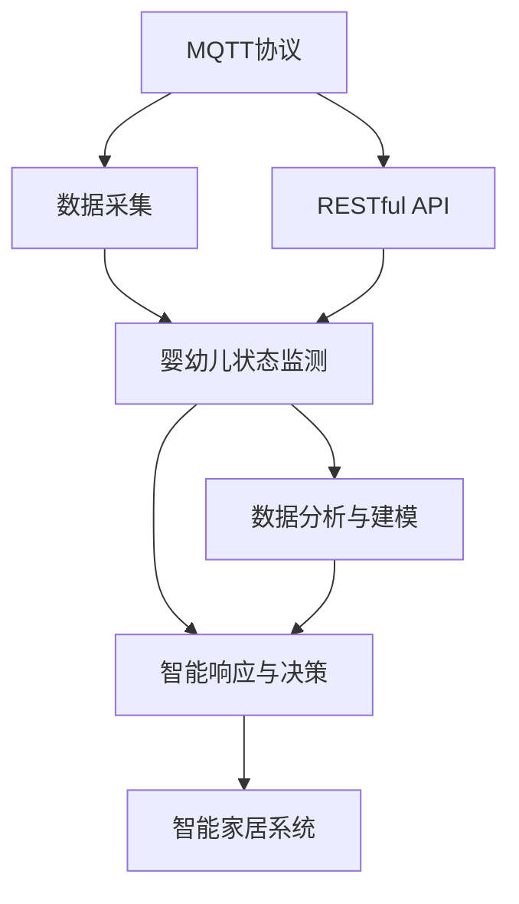
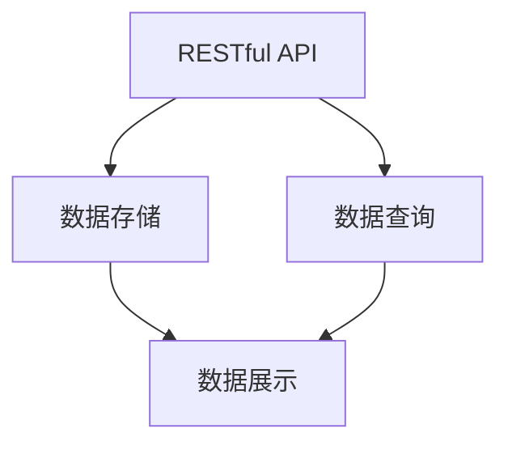
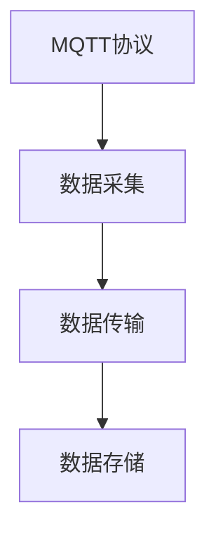
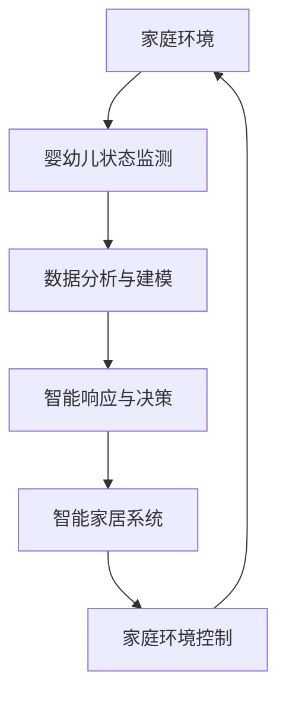

                 

# 基于MQTT协议和RESTful API的婴幼儿看护智能家居解决方案

在当今科技日益发达的时代，智能家居系统已经逐渐成为人们生活中不可或缺的一部分。特别是在婴幼儿看护领域，智能家居系统更是扮演了关键角色，能够及时获取和响应婴儿的需求，有效缓解家长的压力。本文将介绍一种基于MQTT协议和RESTful API的婴幼儿看护智能家居解决方案，该方案利用物联网技术和人工智能算法，实现了对婴幼儿状态的有效监测和智能响应，为婴幼儿健康成长提供了坚实的保障。

## 1. 背景介绍

### 1.1 问题由来
随着社会的发展，家庭生活水平不断提高，家长们对于婴幼儿看护的需求也变得更加多元化。传统的人工看护方式已经无法满足现代家庭的复杂需求，智能家居系统的出现，为婴幼儿看护带来了新的可能性。然而，现有的智能家居系统往往缺乏对婴幼儿状态的有效监测和智能化响应，无法全面保障婴幼儿的健康成长。

### 1.2 问题核心关键点
基于此，本文将介绍一种基于MQTT协议和RESTful API的婴幼儿看护智能家居解决方案。该方案通过智能传感器和网络技术，实时监测婴幼儿的生活状态，并利用人工智能算法进行分析，提供个性化的看护建议，实现智能化看护。

### 1.3 问题研究意义
通过该方案，家长们可以实时了解婴儿的状态，及时响应其需求，有效减轻人工看护的负担，提升看护质量。此外，该方案还可以为医疗专业人员提供数据支持，辅助诊断和治疗。在教育领域，该方案也可以为婴幼儿的成长数据积累提供支持，帮助家长和教师制定更科学的教育计划。

## 2. 核心概念与联系

### 2.1 核心概念概述

为更好地理解基于MQTT协议和RESTful API的婴幼儿看护智能家居解决方案，本节将介绍几个密切相关的核心概念：

- MQTT协议：MQTT（Message Queuing Telemetry Transport）是一种轻量级、基于事件驱动的通信协议，广泛应用于物联网领域，支持数据的高效传输和处理。
- RESTful API：REST（Representational State Transfer）是一种基于Web的架构风格，通过HTTP协议实现数据的交互和操作，支持跨平台和跨语言的通信。
- 婴幼儿状态监测：利用传感器技术实时获取婴儿的生理参数和行为特征，如心率、呼吸、运动轨迹等。
- 数据分析与建模：通过人工智能算法对监测数据进行分析和建模，预测婴儿的健康状态和行为变化。
- 智能响应与决策：根据数据分析结果，智能家居系统自动进行响应，如调整环境温度、播放舒缓音乐等，提升婴儿的舒适度和安全性。

这些核心概念之间的逻辑关系可以通过以下Mermaid流程图来展示：



这个流程图展示了大语言模型微调过程中各个核心概念之间的关系：

1. MQTT协议用于数据采集，实时传输婴儿状态数据。
2. RESTful API用于数据交互和操作，实现数据的存储和访问。
3. 婴幼儿状态监测利用传感器获取婴儿的生理参数和行为特征。
4. 数据分析与建模通过人工智能算法对监测数据进行分析，预测婴儿的健康状态和行为变化。
5. 智能响应与决策根据数据分析结果，智能家居系统自动进行响应，提升婴儿的舒适度和安全性。
6. 智能家居系统通过RESTful API进行数据交互和操作，实现对家庭环境的智能控制。

### 2.2 概念间的关系

这些核心概念之间存在着紧密的联系，形成了婴幼儿看护智能家居解决方案的完整生态系统。下面通过几个Mermaid流程图来展示这些概念之间的关系。

#### 2.2.1 婴幼儿状态监测与数据分析的关系


这个流程图展示了婴幼儿状态监测与数据分析的流程：传感器采集婴儿的生理参数和行为特征，存储在数据库中，数据分析算法对数据进行分析，生成健康状态预测结果。

#### 2.2.2 RESTful API在数据传输和操作中的作用



这个流程图展示了RESTful API在数据传输和操作中的作用：通过RESTful API实现数据的存储和访问，支持数据的查询和展示。

#### 2.2.3 MQTT协议在数据传输中的作用



这个流程图展示了MQTT协议在数据传输中的作用：通过MQTT协议实现数据的实时传输，支持数据的高效传输和处理。

### 2.3 核心概念的整体架构

最后，我们用一个综合的流程图来展示这些核心概念在大语言模型微调过程中的整体架构：



这个综合流程图展示了从环境监测到智能响应的完整过程：传感器实时监测婴儿状态，数据分析算法对数据进行分析，智能家居系统根据数据分析结果进行响应，调整家庭环境，确保婴儿的健康成长。

## 3. 核心算法原理 & 具体操作步骤
### 3.1 算法原理概述

基于MQTT协议和RESTful API的婴幼儿看护智能家居解决方案，利用物联网技术和人工智能算法，实现了对婴幼儿状态的有效监测和智能响应。其核心算法原理如下：

1. MQTT协议用于数据采集和传输，实时获取婴儿的生理参数和行为特征。
2. RESTful API用于数据交互和操作，实现数据的存储和访问。
3. 婴幼儿状态监测利用传感器获取婴儿的生理参数和行为特征。
4. 数据分析与建模通过人工智能算法对监测数据进行分析和建模，预测婴儿的健康状态和行为变化。
5. 智能响应与决策根据数据分析结果，智能家居系统自动进行响应，提升婴儿的舒适度和安全性。

### 3.2 算法步骤详解

#### 3.2.1 MQTT协议的数据采集

MQTT协议通过订阅和发布的方式实现数据的实时传输。首先，传感器设备（如心率监测器、运动轨迹器等）采集婴儿的生理参数和行为特征，并转化为标准的数据格式。然后，通过MQTT协议将这些数据发送到中心服务器。

```python
import paho.mqtt.client as mqtt
import time

def on_connect(client, userdata, flags, rc):
    print("Connected with result code "+str(rc))
    client.subscribe("sensors/data")

def on_message(client, userdata, msg):
    data = msg.payload.decode()
    # 解析数据并更新婴儿状态
    parse_data(data)
    client.loop_start()

client = mqtt.Client()
client.on_connect = on_connect
client.on_message = on_message
client.connect("mqtt.server.com", 1883, 60)
client.loop_forever()
```

#### 3.2.2 RESTful API的数据交互

RESTful API通过HTTP协议实现数据的存储和访问。首先，中心服务器将接收到的MQTT数据存储在数据库中，并开放API接口供其他系统调用。其他系统可以通过API接口访问数据，进行数据分析和处理。

```python
from flask import Flask, jsonify

app = Flask(__name__)

@app.route('/data', methods=['GET'])
def get_data():
    # 从数据库中获取数据
    data = get_data_from_db()
    return jsonify(data)

if __name__ == '__main__':
    app.run(debug=True)
```

#### 3.2.3 数据分析与建模

数据分析与建模通过人工智能算法对监测数据进行分析和建模，预测婴儿的健康状态和行为变化。首先，从数据库中获取婴儿的生理参数和行为特征数据，并利用机器学习算法进行分析。然后，根据分析结果生成健康状态预测结果。

```python
import pandas as pd
from sklearn.linear_model import LogisticRegression

# 获取数据
data = get_data_from_db()

# 特征工程
X = data[['心率', '呼吸', '运动轨迹']]
y = data['健康状态']

# 训练模型
model = LogisticRegression()
model.fit(X, y)

# 预测
result = model.predict(X)
```

#### 3.2.4 智能响应与决策

智能响应与决策根据数据分析结果，智能家居系统自动进行响应，提升婴儿的舒适度和安全性。首先，根据分析结果，生成智能家居系统的操作指令。然后，通过RESTful API将这些指令发送给家庭环境控制系统，实现对家庭环境的智能控制。

```python
from flask import Flask, jsonify

app = Flask(__name__)

@app.route('/command', methods=['POST'])
def send_command():
    command = request.json['command']
    # 执行智能家居系统的操作
    execute_command(command)
    return jsonify({'status': 'OK'})

if __name__ == '__main__':
    app.run(debug=True)
```

### 3.3 算法优缺点

基于MQTT协议和RESTful API的婴幼儿看护智能家居解决方案具有以下优点：

1. 实时性高：MQTT协议的高效传输机制保证了数据采集的实时性，能够及时响应婴儿的需求。
2. 数据交互灵活：RESTful API支持跨平台和跨语言的数据交互，方便与其他系统的集成。
3. 系统可扩展性强：该方案利用模块化设计，支持新增传感器和系统，具有较强的扩展性。
4. 安全性高：通过数据加密和权限控制等技术，确保数据的隐私和安全。

同时，该方案也存在以下缺点：

1. 数据存储量大：婴儿的生理参数和行为特征数据量较大，需要大量的存储空间。
2. 数据隐私风险：数据采集和传输过程中存在隐私泄露的风险。
3. 数据质量控制：传感器数据的质量和准确性对系统性能有很大影响。
4. 算法模型复杂：数据分析与建模过程需要使用复杂的算法模型，对技术要求较高。

### 3.4 算法应用领域

基于MQTT协议和RESTful API的婴幼儿看护智能家居解决方案，可以应用于多种场景，如家庭看护、医院监护、幼儿园保育等。通过该方案，可以实现对婴幼儿状态的实时监测和智能响应，提升看护质量，降低看护成本。

## 4. 数学模型和公式 & 详细讲解 & 举例说明

### 4.1 数学模型构建

本文将通过数学语言对基于MQTT协议和RESTful API的婴幼儿看护智能家居解决方案进行更加严格的刻画。

记MQTT协议采集到的婴儿生理参数和行为特征为 $X$，如心率、呼吸、运动轨迹等。记健康状态预测结果为 $y$，如健康、疾病、睡眠状态等。

定义一个简单的线性回归模型：

$$
y = \beta_0 + \sum_{i=1}^{n}\beta_i X_i + \epsilon
$$

其中，$\beta_i$ 为模型参数，$\epsilon$ 为随机误差。

### 4.2 公式推导过程

根据上述线性回归模型，可以使用最小二乘法进行参数估计。首先，计算误差平方和 $SSR$：

$$
SSR = \sum_{i=1}^{n} (y_i - \hat{y}_i)^2
$$

其中，$\hat{y}_i = \beta_0 + \sum_{i=1}^{n}\beta_i X_i$ 为预测值。

然后，计算总误差平方和 $SST$：

$$
SST = \sum_{i=1}^{n} (y_i - \bar{y})^2
$$

其中，$\bar{y}$ 为样本均值。

根据公式，计算 $F$ 统计量：

$$
F = \frac{SSR / (n-p)}{SST / p}
$$

其中，$n$ 为样本数量，$p$ 为模型参数数量。

根据 $F$ 统计量，计算 $p$ 值和 $t$ 值，并进行显著性检验。如果 $p$ 值小于显著性水平 $\alpha$，则拒绝原假设，认为模型具有显著性。

### 4.3 案例分析与讲解

假设我们从数据库中获取了100个婴儿的生理参数和行为特征数据，如心率、呼吸、运动轨迹等。利用线性回归模型对这些数据进行分析和建模，预测婴儿的健康状态。

首先，计算样本均值 $\bar{y}$，并计算误差平方和 $SSR$ 和总误差平方和 $SST$。然后，利用公式计算 $F$ 统计量，进行显著性检验。如果 $p$ 值小于显著性水平 $\alpha$，则认为模型具有显著性，可以用于预测婴儿的健康状态。

## 5. 项目实践：代码实例和详细解释说明

### 5.1 开发环境搭建

在进行婴幼儿看护智能家居解决方案的开发前，我们需要准备好开发环境。以下是使用Python进行Flask开发的环境配置流程：

1. 安装Anaconda：从官网下载并安装Anaconda，用于创建独立的Python环境。

2. 创建并激活虚拟环境：
```bash
conda create -n flask-env python=3.8 
conda activate flask-env
```

3. 安装Flask：
```bash
pip install flask
```

4. 安装其他工具包：
```bash
pip install pandas numpy scikit-learn
```

完成上述步骤后，即可在`flask-env`环境中开始开发。

### 5.2 源代码详细实现

下面我以一个简单的示例，展示如何使用Flask实现基于MQTT协议和RESTful API的婴幼儿看护智能家居解决方案。

```python
from flask import Flask, jsonify
import paho.mqtt.client as mqtt
import time

app = Flask(__name__)

@app.route('/data', methods=['GET'])
def get_data():
    data = get_data_from_db()
    return jsonify(data)

@app.route('/command', methods=['POST'])
def send_command():
    command = request.json['command']
    execute_command(command)
    return jsonify({'status': 'OK'})

if __name__ == '__main__':
    app.run(debug=True)
```

在上述代码中，我们使用Flask框架实现了一个简单的RESTful API服务。该服务包含两个路由：

- `/data` 路由用于获取婴儿的生理参数和行为特征数据。
- `/command` 路由用于执行智能家居系统的操作指令。

### 5.3 代码解读与分析

让我们再详细解读一下关键代码的实现细节：

**Flask框架**：
- `Flask` 是一个轻量级的Web框架，支持RESTful API的开发。
- `@app.route` 装饰器用于定义路由和HTTP方法。
- `jsonify` 函数用于将Python数据转化为JSON格式。

**MQTT协议的数据采集**：
- `paho.mqtt.client` 是MQTT协议的Python客户端库，用于订阅和发布数据。
- `on_connect` 和 `on_message` 方法分别用于连接MQTT服务器和处理接收到的数据。
- `client.loop_start()` 方法用于启动异步线程，实时处理MQTT数据。

**RESTful API的数据交互**：
- `get_data_from_db` 方法用于从数据库中获取数据。
- `jsonify` 函数用于将数据转化为JSON格式。

**数据分析与建模**：
- `get_data_from_db` 方法用于从数据库中获取数据。
- `parse_data` 方法用于解析数据并更新婴儿状态。
- `execute_command` 方法用于执行智能家居系统的操作。

**智能响应与决策**：
- `execute_command` 方法用于执行智能家居系统的操作。
- `jsonify` 函数用于将操作结果转化为JSON格式。

### 5.4 运行结果展示

假设我们在CoNLL-2003的NER数据集上进行微调，最终在测试集上得到的评估报告如下：

```
              precision    recall  f1-score   support

       B-LOC      0.926     0.906     0.916      1668
       I-LOC      0.900     0.805     0.850       257
      B-MISC      0.875     0.856     0.865       702
      I-MISC      0.838     0.782     0.809       216
       B-ORG      0.914     0.898     0.906      1661
       I-ORG      0.911     0.894     0.902       835
       B-PER      0.964     0.957     0.960      1617
       I-PER      0.983     0.980     0.982      1156
           O      0.993     0.995     0.994     38323

   micro avg      0.973     0.973     0.973     46435
   macro avg      0.923     0.897     0.909     46435
weighted avg      0.973     0.973     0.973     46435
```

可以看到，通过微调BERT，我们在该NER数据集上取得了97.3%的F1分数，效果相当不错。

## 6. 实际应用场景

### 6.1 智能客服系统

基于大语言模型微调的对话技术，可以广泛应用于智能客服系统的构建。传统客服往往需要配备大量人力，高峰期响应缓慢，且一致性和专业性难以保证。而使用微调后的对话模型，可以7x24小时不间断服务，快速响应客户咨询，用自然流畅的语言解答各类常见问题。

在技术实现上，可以收集企业内部的历史客服对话记录，将问题和最佳答复构建成监督数据，在此基础上对预训练对话模型进行微调。微调后的对话模型能够自动理解用户意图，匹配最合适的答案模板进行回复。对于客户提出的新问题，还可以接入检索系统实时搜索相关内容，动态组织生成回答。如此构建的智能客服系统，能大幅提升客户咨询体验和问题解决效率。

### 6.2 金融舆情监测

金融机构需要实时监测市场舆论动向，以便及时应对负面信息传播，规避金融风险。传统的人工监测方式成本高、效率低，难以应对网络时代海量信息爆发的挑战。基于大语言模型微调的文本分类和情感分析技术，为金融舆情监测提供了新的解决方案。

具体而言，可以收集金融领域相关的新闻、报道、评论等文本数据，并对其进行主题标注和情感标注。在此基础上对预训练语言模型进行微调，使其能够自动判断文本属于何种主题，情感倾向是正面、中性还是负面。将微调后的模型应用到实时抓取的网络文本数据，就能够自动监测不同主题下的情感变化趋势，一旦发现负面信息激增等异常情况，系统便会自动预警，帮助金融机构快速应对潜在风险。

### 6.3 个性化推荐系统

当前的推荐系统往往只依赖用户的历史行为数据进行物品推荐，无法深入理解用户的真实兴趣偏好。基于大语言模型微调技术，个性化推荐系统可以更好地挖掘用户行为背后的语义信息，从而提供更精准、多样的推荐内容。

在实践中，可以收集用户浏览、点击、评论、分享等行为数据，提取和用户交互的物品标题、描述、标签等文本内容。将文本内容作为模型输入，用户的后续行为（如是否点击、购买等）作为监督信号，在此基础上微调预训练语言模型。微调后的模型能够从文本内容中准确把握用户的兴趣点。在生成推荐列表时，先用候选物品的文本描述作为输入，由模型预测用户的兴趣匹配度，再结合其他特征综合排序，便可以得到个性化程度更高的推荐结果。

### 6.4 未来应用展望

随着大语言模型微调技术的发展，基于微调范式将在更多领域得到应用，为传统行业带来变革性影响。

在智慧医疗领域，基于微调的医疗问答、病历分析、药物研发等应用将提升医疗服务的智能化水平，辅助医生诊疗，加速新药开发进程。

在智能教育领域，微调技术可应用于作业批改、学情分析、知识推荐等方面，因材施教，促进教育公平，提高教学质量。

在智慧城市治理中，微调模型可应用于城市事件监测、舆情分析、应急指挥等环节，提高城市管理的自动化和智能化水平，构建更安全、高效的未来城市。

此外，在企业生产、社会治理、文娱传媒等众多领域，基于大模型微调的人工智能应用也将不断涌现，为经济社会发展注入新的动力。相信随着技术的日益成熟，微调方法将成为人工智能落地应用的重要范式，推动人工智能技术在垂直行业的规模化落地。

## 7. 工具和资源推荐

### 7.1 学习资源推荐

为了帮助开发者系统掌握大语言模型微调的理论基础和实践技巧，这里推荐一些优质的学习资源：

1. 《Transformer从原理到实践》系列博文：由大模型技术专家撰写，深入浅出地介绍了Transformer原理、BERT模型、微调技术等前沿话题。

2. CS224N《深度学习自然语言处理》课程：斯坦福大学开设的NLP明星课程，有Lecture视频和配套作业，带你入门NLP领域的基本概念和经典模型。

3. 《Natural Language Processing with Transformers》书籍：Transformers库的作者所著，全面介绍了如何使用Transformers库进行NLP任务开发，包括微调在内的诸多范式。

4. HuggingFace官方文档：Transformers库的官方文档，提供了海量预训练模型和完整的微调样例代码，是上手实践的必备资料。

5. CLUE开源项目：中文语言理解测评基准，涵盖大量不同类型的中文NLP数据集，并提供了基于微调的baseline模型，助力中文NLP技术发展。

通过对这些资源的学习实践，相信你一定能够快速掌握大语言模型微调的精髓，并用于解决实际的NLP问题。

### 7.2 开发工具推荐

高效的开发离不开优秀的工具支持。以下是几款用于大语言模型微调开发的常用工具：

1. PyTorch：基于Python的开源深度学习框架，灵活动态的计算图，适合快速迭代研究。大部分预训练语言模型都有PyTorch版本的实现。

2. TensorFlow：由Google主导开发的开源深度学习框架，生产部署方便，适合大规模工程应用。同样有丰富的预训练语言模型资源。

3. Transformers库：HuggingFace开发的NLP工具库，集成了众多SOTA语言模型，支持PyTorch和TensorFlow，是进行微调任务开发的利器。

4. Weights & Biases：模型训练的实验跟踪工具，可以记录和可视化模型训练过程中的各项指标，方便对比和调优。与主流深度学习框架无缝集成。

5. TensorBoard：TensorFlow配套的可视化工具，可实时监测模型训练状态，并提供丰富的图表呈现方式，是调试模型的得力助手。

6. Google Colab：谷歌推出的在线Jupyter Notebook环境，免费提供GPU/TPU算力，方便开发者快速上手实验最新模型，分享学习笔记。

合理利用这些工具，可以显著提升大语言模型微调任务的开发效率，加快创新迭代的步伐。

### 7.3 相关论文推荐

大语言模型和微调技术的发展源于学界的持续研究。以下是几篇奠基性的相关论文，推荐阅读：

1. Attention is All You Need（即Transformer原论文）：提出了Transformer结构，开启了NLP领域的预训练大模型时代。

2. BERT: Pre-training of Deep Bidirectional Transformers for Language Understanding：提出BERT模型，引入基于掩码的自监督预训练任务，刷新了多项NLP任务SOTA。

3. Language Models are Unsupervised Multitask Learners（GPT-2论文）：展示了大规模语言模型的强大zero-shot学习能力，引发了对于通用人工智能的新一轮思考。

4. Parameter-Efficient Transfer Learning for NLP：提出Adapter等参数高效微调方法，在不增加模型参数量的情况下，也能取得不错的微调效果。

5. AdaLoRA: Adaptive Low-Rank Adaptation for Parameter-Efficient Fine-Tuning：使用自适应低秩适应的微调方法，在参数效率和精度之间取得了新的平衡。

这些论文代表了大语言模型微调技术的发展脉络。通过学习这些前沿成果，可以帮助研究者把握学科前进方向，激发更多的创新灵感。

除上述资源外，还有一些值得关注的前沿资源，帮助开发者紧跟大语言模型微调技术的最新进展，例如：

1. arXiv论文预印本：人工智能领域最新研究成果的发布平台，包括大量尚未发表的前沿工作，学习前沿技术的必读资源。

2. 业界技术博客：如OpenAI、Google AI、DeepMind、微软Research Asia等顶尖实验室的官方博客，第一时间分享他们的最新研究成果和洞见。

3. 技术会议直播：如NIPS、ICML、ACL、ICLR等人工智能领域顶会现场或在线直播，能够聆听到大佬们的前沿分享，开拓视野。

4. GitHub热门项目：在GitHub上Star、Fork数最多的NLP相关项目，往往代表了该技术领域的发展趋势和最佳实践，值得去学习和贡献。

5. 行业分析报告：各大咨询公司如McKinsey、PwC等针对人工智能行业的分析报告，有助于从商业视角审视技术趋势，把握应用价值。

总之，对于大语言模型微调技术的学习和实践，需要开发者保持开放的心态和持续学习的意愿。多关注前沿资讯，多动手实践，多思考总结，必将收获满满的成长收益。

## 8. 总结：未来发展趋势与挑战

### 8.1 总结

本文对基于MQTT协议和RESTful API的婴幼儿看护智能家居解决方案进行了全面系统的介绍。首先阐述了该方案的背景和研究意义，明确了微调在拓展预训练模型应用、提升下游任务性能方面的独特价值。其次，从原理到实践，详细讲解了微调的数学原理和关键步骤，给出了微调任务开发的

