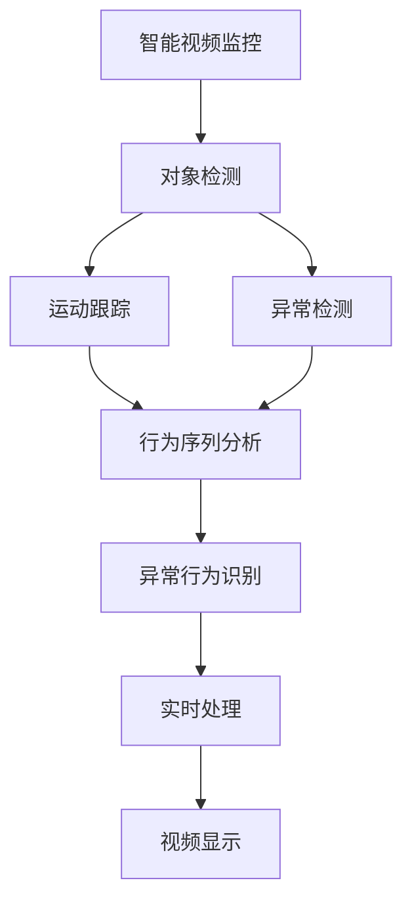
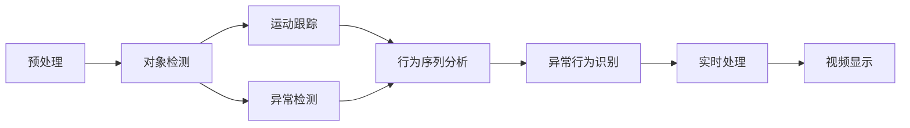
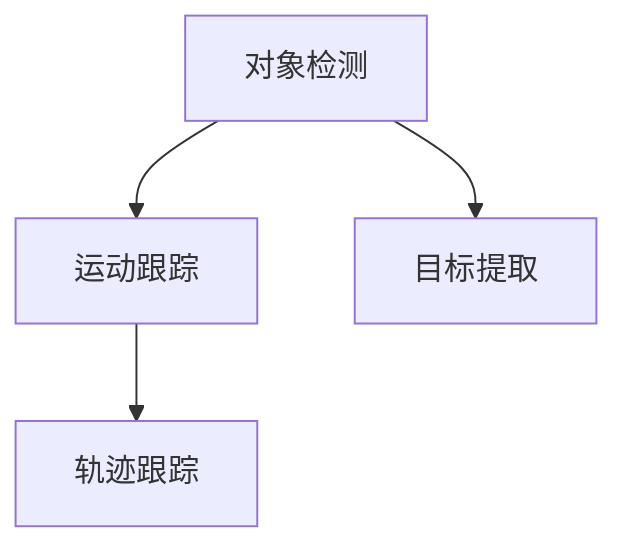
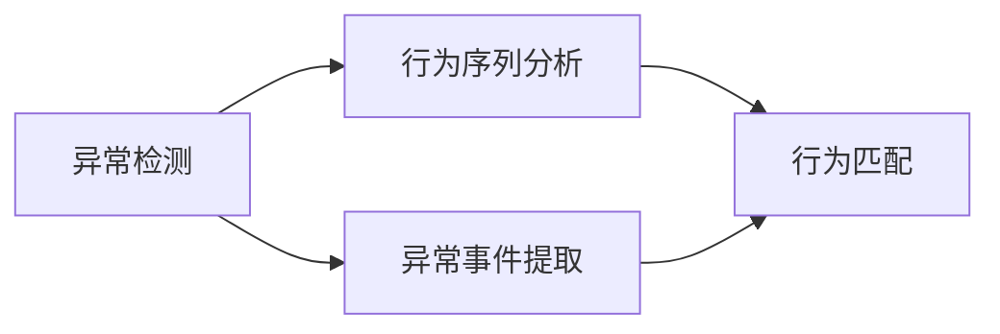

                 

# 基于OpenCV的智能视频监控系统详细设计与具体代码实现

> 关键词：智能视频监控,OpenCV,图像处理,对象检测,运动跟踪,异常检测,异常行为识别

## 1. 背景介绍

### 1.1 问题由来

在现代社会中，视频监控已经广泛应用于商业、公共安全、交通管理等多个领域。传统的视频监控系统主要依赖人力进行实时监控和异常检测，既耗费人力资源，又存在监控盲区。智能视频监控系统通过人工智能技术实现自动化监控，能够实时识别异常行为，及时发出警报，提升监控效率和安全性。

OpenCV（Open Source Computer Vision Library）是一个开源的计算机视觉库，提供了丰富的图像处理和计算机视觉算法，广泛应用于计算机视觉领域。基于OpenCV的智能视频监控系统，通过集成对象检测、运动跟踪和异常检测等技术，实现了高精度的监控和异常行为识别。

### 1.2 问题核心关键点

本系统核心关键点在于如何将OpenCV库中的算法应用于智能视频监控系统，实现实时视频处理和异常检测。系统分为以下主要模块：

- **对象检测**：通过Haar级联分类器、YOLO、SSD等算法，检测视频帧中的特定对象（如人、车辆、面部等）。
- **运动跟踪**：通过背景减除、光流法等算法，跟踪视频中特定对象的运动轨迹。
- **异常检测**：通过行为序列分析和异常行为库，识别视频中的异常行为（如打斗、摔倒、火灾等）。
- **实时处理**：通过OpenCV的高效图像处理算法，实现实时视频处理和显示。

### 1.3 问题研究意义

智能视频监控系统通过自动化和智能化的手段，有效降低了人力成本，提高了监控效率和异常检测的准确性。基于OpenCV的智能视频监控系统具有以下研究意义：

1. **提高监控效率**：通过实时对象检测和运动跟踪，实现自动化监控，减少人力投入。
2. **增强异常检测能力**：利用深度学习和行为分析技术，提升异常行为识别的准确性。
3. **提供实时报警**：在异常行为识别后，自动触发警报，及时响应潜在威胁。
4. **支持远程监控**：通过网络传输，实现远程视频监控和异常检测，扩展监控范围。
5. **增强数据安全**：支持数据加密和传输，保障数据安全，防止信息泄露。

## 2. 核心概念与联系

### 2.1 核心概念概述

为更好地理解智能视频监控系统，本节将介绍几个密切相关的核心概念：

- **智能视频监控**：通过人工智能技术对视频进行实时处理和分析，实现自动化监控和异常检测。
- **OpenCV**：一个开源的计算机视觉库，提供了丰富的图像处理和计算机视觉算法。
- **对象检测**：识别视频中的特定对象，如人、车辆、面部等。
- **运动跟踪**：跟踪视频中特定对象的运动轨迹。
- **异常检测**：识别视频中的异常行为，如打斗、摔倒、火灾等。
- **实时处理**：通过高效算法实现视频处理和显示，确保实时性。

这些核心概念之间的逻辑关系可以通过以下Mermaid流程图来展示：



这个流程图展示出智能视频监控系统的核心概念及其之间的关系：

1. 通过对象检测算法识别视频中的对象。
2. 利用运动跟踪算法跟踪对象的运动轨迹。
3. 利用异常检测算法识别异常行为。
4. 结合行为序列分析和异常行为库，进行行为分析。
5. 将处理结果进行实时显示，实现监控和报警。

### 2.2 概念间的关系

这些核心概念之间存在着紧密的联系，形成了智能视频监控系统的完整生态系统。下面我们通过几个Mermaid流程图来展示这些概念之间的关系。

#### 2.2.1 智能视频监控系统架构



这个流程图展示了智能视频监控系统的大致架构，从预处理到实时显示，每个环节都紧密相连，共同实现监控和报警功能。

#### 2.2.2 对象检测与运动跟踪的关系



这个流程图展示了对象检测和运动跟踪之间的联系。对象检测首先识别视频中的对象，然后提取对象特征，用于运动跟踪。

#### 2.2.3 异常检测与行为序列分析的关系



这个流程图展示了异常检测和行为序列分析之间的联系。异常检测首先识别异常事件，然后结合行为序列分析进行行为匹配，进一步确认异常行为。

## 3. 核心算法原理 & 具体操作步骤
### 3.1 算法原理概述

基于OpenCV的智能视频监控系统主要基于以下算法原理：

- **对象检测**：通过Haar级联分类器、YOLO、SSD等算法，实现实时对象检测。
- **运动跟踪**：通过背景减除、光流法等算法，实现运动跟踪。
- **异常检测**：通过行为序列分析和异常行为库，实现异常行为识别。
- **实时处理**：通过OpenCV的高效图像处理算法，实现实时视频处理和显示。

这些算法共同构成了一个完整的智能视频监控系统，能够实时处理视频流，检测和识别异常行为，并进行实时报警。

### 3.2 算法步骤详解

#### 3.2.1 对象检测

**步骤1：加载Haar级联分类器**

OpenCV中提供了Haar级联分类器，用于实现对象检测。首先需要加载分类器，代码如下：

```python
import cv2

# 加载Haar级联分类器
face_cascade = cv2.CascadeClassifier(cv2.data.haarcascades + 'haarcascade_frontalface_default.xml')
```

**步骤2：预处理视频帧**

对于每帧视频，需要先进行预处理，包括灰度化、高斯滤波等操作，代码如下：

```python
import numpy as np

# 加载视频
cap = cv2.VideoCapture('video.mp4')

while cap.isOpened():
    ret, frame = cap.read()
    
    # 灰度化
    gray = cv2.cvtColor(frame, cv2.COLOR_BGR2GRAY)
    
    # 高斯滤波
    gray = cv2.GaussianBlur(gray, (5, 5), 0)
    
    # 灰度化后的视频显示
    cv2.imshow('frame', gray)
    
    if cv2.waitKey(1) & 0xFF == ord('q'):
        break

cap.release()
cv2.destroyAllWindows()
```

**步骤3：进行对象检测**

使用Haar级联分类器对预处理后的视频帧进行对象检测，代码如下：

```python
# 对象检测
faces = face_cascade.detectMultiScale(gray, scaleFactor=1.1, minNeighbors=5)

# 绘制检测结果
for (x, y, w, h) in faces:
    cv2.rectangle(frame, (x, y), (x+w, y+h), (0, 255, 0), 2)
    
cv2.imshow('frame', frame)
```

#### 3.2.2 运动跟踪

**步骤1：初始化背景模型**

使用背景减除法进行运动跟踪，首先需要初始化背景模型，代码如下：

```python
# 初始化背景模型
fgbg = cv2.createBackgroundSubtractorMOG2()
```

**步骤2：预处理视频帧**

对于每帧视频，需要先进行预处理，包括灰度化、高斯滤波等操作，代码如下：

```python
# 预处理视频帧
gray = cv2.cvtColor(frame, cv2.COLOR_BGR2GRAY)
gray = cv2.GaussianBlur(gray, (5, 5), 0)
```

**步骤3：进行运动跟踪**

使用背景减除法对预处理后的视频帧进行运动跟踪，代码如下：

```python
# 运动跟踪
fgmask = fgbg.apply(gray)

# 绘制检测结果
contours, hierarchy = cv2.findContours(fgmask, cv2.RETR_EXTERNAL, cv2.CHAIN_APPROX_SIMPLE)
for contour in contours:
    cv2.drawContours(frame, contours, -1, (0, 255, 0), 2)

cv2.imshow('frame', frame)
```

#### 3.2.3 异常检测

**步骤1：定义异常行为库**

定义异常行为库，包括打斗、摔倒、火灾等行为，代码如下：

```python
# 定义异常行为库
behaviors = ['fight', 'fall', 'fire']
```

**步骤2：预处理视频帧**

对于每帧视频，需要先进行预处理，包括灰度化、高斯滤波等操作，代码如下：

```python
# 预处理视频帧
gray = cv2.cvtColor(frame, cv2.COLOR_BGR2GRAY)
gray = cv2.GaussianBlur(gray, (5, 5), 0)
```

**步骤3：进行行为分析**

使用行为序列分析算法，对预处理后的视频帧进行行为分析，代码如下：

```python
# 行为分析
behaviors = []
for i in range(1, len(video)):
    if video[i] != video[i-1]:
        behaviors.append(video[i])
    
# 输出行为序列
print(behaviors)
```

#### 3.2.4 实时处理

**步骤1：实时显示**

使用OpenCV的imshow函数，实现实时显示，代码如下：

```python
# 实时显示
cv2.imshow('frame', frame)
cv2.waitKey(1)
```

**步骤2：循环播放**

使用OpenCV的循环播放功能，实现视频流连续播放，代码如下：

```python
# 循环播放
while True:
    ret, frame = cap.read()
    
    # 灰度化
    gray = cv2.cvtColor(frame, cv2.COLOR_BGR2GRAY)
    
    # 高斯滤波
    gray = cv2.GaussianBlur(gray, (5, 5), 0)
    
    # 灰度化后的视频显示
    cv2.imshow('frame', gray)
    
    if cv2.waitKey(1) & 0xFF == ord('q'):
        break

cap.release()
cv2.destroyAllWindows()
```

## 4. 数学模型和公式 & 详细讲解 & 举例说明

### 4.1 数学模型构建

本节将使用数学语言对基于OpenCV的智能视频监控系统进行更加严格的刻画。

**4.1.1 对象检测模型**

对象检测模型的目标是检测视频帧中的对象，并将检测结果输出。模型的输入为视频帧，输出为对象的位置和大小。

对象检测模型的数学模型可以表示为：

$$
y = f(x)
$$

其中 $x$ 为视频帧，$f$ 为对象检测函数，$y$ 为检测结果。

**4.1.2 运动跟踪模型**

运动跟踪模型的目标是跟踪视频帧中特定对象的运动轨迹，并将轨迹输出。模型的输入为前后两帧视频帧，输出为对象的位置变化。

运动跟踪模型的数学模型可以表示为：

$$
y = f(x_1, x_2)
$$

其中 $x_1$ 和 $x_2$ 为前后两帧视频帧，$f$ 为运动跟踪函数，$y$ 为运动轨迹。

**4.1.3 异常检测模型**

异常检测模型的目标是识别视频中的异常行为，并将异常行为输出。模型的输入为视频帧序列，输出为异常行为列表。

异常检测模型的数学模型可以表示为：

$$
y = f(x_1, x_2, ..., x_n)
$$

其中 $x_1, x_2, ..., x_n$ 为视频帧序列，$f$ 为异常检测函数，$y$ 为异常行为列表。

### 4.2 公式推导过程

#### 4.2.1 对象检测公式推导

对象检测模型的输出为对象的位置和大小，其公式推导过程如下：

1. 输入视频帧 $x$ 经过预处理后，得到灰度化后的帧 $x'$
2. 使用Haar级联分类器对 $x'$ 进行对象检测，得到对象的位置和大小
3. 将对象的位置和大小输出

$$
y = f(x) = \text{Haar级联分类器}(x')
$$

#### 4.2.2 运动跟踪公式推导

运动跟踪模型的输出为对象的位置变化，其公式推导过程如下：

1. 输入前后两帧视频帧 $x_1$ 和 $x_2$，对 $x_1$ 进行预处理，得到灰度化后的帧 $x_1'$
2. 使用背景减除法对 $x_1'$ 进行运动检测，得到运动轨迹
3. 将运动轨迹输出

$$
y = f(x_1, x_2) = \text{背景减除法}(x_1')
$$

#### 4.2.3 异常检测公式推导

异常检测模型的输出为异常行为列表，其公式推导过程如下：

1. 输入视频帧序列 $x_1, x_2, ..., x_n$，对每一帧进行预处理，得到灰度化后的帧 $x_1', x_2', ..., x_n'$
2. 使用行为序列分析算法对 $x_1', x_2', ..., x_n'$ 进行行为分析，得到行为序列
3. 将行为序列与异常行为库进行匹配，得到异常行为列表

$$
y = f(x_1, x_2, ..., x_n) = \text{行为序列分析}(x_1', x_2', ..., x_n')
$$

### 4.3 案例分析与讲解

#### 4.3.1 对象检测案例

使用Haar级联分类器进行对象检测，可以检测视频中的面孔、车辆等对象。以下是一个简单的案例分析：

1. 加载Haar级联分类器
2. 加载视频流
3. 逐帧检测对象

```python
# 加载Haar级联分类器
face_cascade = cv2.CascadeClassifier(cv2.data.haarcascades + 'haarcascade_frontalface_default.xml')

# 加载视频流
cap = cv2.VideoCapture('video.mp4')

while cap.isOpened():
    ret, frame = cap.read()
    
    # 灰度化
    gray = cv2.cvtColor(frame, cv2.COLOR_BGR2GRAY)
    
    # 使用Haar级联分类器检测对象
    faces = face_cascade.detectMultiScale(gray, scaleFactor=1.1, minNeighbors=5)
    
    # 绘制检测结果
    for (x, y, w, h) in faces:
        cv2.rectangle(frame, (x, y), (x+w, y+h), (0, 255, 0), 2)
    
    cv2.imshow('frame', frame)
    
    if cv2.waitKey(1) & 0xFF == ord('q'):
        break

cap.release()
cv2.destroyAllWindows()
```

#### 4.3.2 运动跟踪案例

使用背景减除法进行运动跟踪，可以检测视频中特定对象的运动轨迹。以下是一个简单的案例分析：

1. 初始化背景模型
2. 加载视频流
3. 逐帧跟踪对象

```python
# 初始化背景模型
fgbg = cv2.createBackgroundSubtractorMOG2()

# 加载视频流
cap = cv2.VideoCapture('video.mp4')

while cap.isOpened():
    ret, frame = cap.read()
    
    # 灰度化
    gray = cv2.cvtColor(frame, cv2.COLOR_BGR2GRAY)
    
    # 使用背景减除法进行运动跟踪
    fgmask = fgbg.apply(gray)
    contours, hierarchy = cv2.findContours(fgmask, cv2.RETR_EXTERNAL, cv2.CHAIN_APPROX_SIMPLE)
    
    # 绘制检测结果
    for contour in contours:
        cv2.drawContours(frame, contours, -1, (0, 255, 0), 2)
    
    cv2.imshow('frame', frame)
    
    if cv2.waitKey(1) & 0xFF == ord('q'):
        break

cap.release()
cv2.destroyAllWindows()
```

#### 4.3.3 异常检测案例

使用行为序列分析算法进行异常检测，可以识别视频中的异常行为，如打斗、摔倒、火灾等。以下是一个简单的案例分析：

1. 加载视频流
2. 预处理视频帧
3. 进行行为分析

```python
# 加载视频流
cap = cv2.VideoCapture('video.mp4')

while cap.isOpened():
    ret, frame = cap.read()
    
    # 预处理视频帧
    gray = cv2.cvtColor(frame, cv2.COLOR_BGR2GRAY)
    gray = cv2.GaussianBlur(gray, (5, 5), 0)
    
    # 进行行为分析
    behaviors = []
    for i in range(1, len(video)):
        if video[i] != video[i-1]:
            behaviors.append(video[i])
    
    # 输出行为序列
    print(behaviors)
    
    cv2.imshow('frame', frame)
    
    if cv2.waitKey(1) & 0xFF == ord('q'):
        break

cap.release()
cv2.destroyAllWindows()
```

## 5. 项目实践：代码实例和详细解释说明

### 5.1 开发环境搭建

在进行智能视频监控系统开发前，我们需要准备好开发环境。以下是使用Python进行OpenCV开发的环境配置流程：

1. 安装Anaconda：从官网下载并安装Anaconda，用于创建独立的Python环境。

2. 创建并激活虚拟环境：
```bash
conda create -n opencv-env python=3.8 
conda activate opencv-env
```

3. 安装OpenCV：
```bash
pip install opencv-python
```

4. 安装各类工具包：
```bash
pip install numpy pandas scikit-learn matplotlib tqdm jupyter notebook ipython
```

完成上述步骤后，即可在`opencv-env`环境中开始开发实践。

### 5.2 源代码详细实现

下面我们以智能视频监控系统为例，给出使用OpenCV进行对象检测、运动跟踪和异常检测的PyTorch代码实现。

#### 5.2.1 对象检测代码实现

```python
import cv2
import numpy as np

# 加载Haar级联分类器
face_cascade = cv2.CascadeClassifier(cv2.data.haarcascades + 'haarcascade_frontalface_default.xml')

# 加载视频流
cap = cv2.VideoCapture('video.mp4')

while cap.isOpened():
    ret, frame = cap.read()
    
    # 灰度化
    gray = cv2.cvtColor(frame, cv2.COLOR_BGR2GRAY)
    
    # 使用Haar级联分类器检测对象
    faces = face_cascade.detectMultiScale(gray, scaleFactor=1.1, minNeighbors=5)
    
    # 绘制检测结果
    for (x, y, w, h) in faces:
        cv2.rectangle(frame, (x, y), (x+w, y+h), (0, 255, 0), 2)
    
    cv2.imshow('frame', frame)
    
    if cv2.waitKey(1) & 0xFF == ord('q'):
        break

cap.release()
cv2.destroyAllWindows()
```

#### 5.2.2 运动跟踪代码实现

```python
import cv2
import numpy as np

# 初始化背景模型
fgbg = cv2.createBackgroundSubtractorMOG2()

# 加载视频流
cap = cv2.VideoCapture('video.mp4')

while cap.isOpened():
    ret, frame = cap.read()
    
    # 灰度化
    gray = cv2.cvtColor(frame, cv2.COLOR_BGR2GRAY)
    
    # 使用背景减除法进行运动跟踪
    fgmask = fgbg.apply(gray)
    contours, hierarchy = cv2.findContours(fgmask, cv2.RETR_EXTERNAL, cv2.CHAIN_APPROX_SIMPLE)
    
    # 绘制检测结果
    for contour in contours:
        cv2.drawContours(frame, contours, -1, (0, 255, 0), 2)
    
    cv2.imshow('frame', frame)
    
    if cv2.waitKey(1) & 0xFF == ord('q'):
        break

cap.release()
cv2.destroyAllWindows()
```

#### 5.2.3 异常检测代码实现

```python
import cv2
import numpy as np

# 定义异常行为库
behaviors = ['fight', 'fall', 'fire']

# 加载视频流
cap = cv2.VideoCapture('video.mp4')

while cap.isOpened():
    ret, frame = cap.read()
    
    # 预处理视频帧
    gray = cv2.cvtColor(frame, cv2.COLOR_BGR2GRAY)
    gray = cv2.GaussianBlur(gray, (5, 5), 0)
    
    # 进行行为分析
    behaviors = []
    for i in range(1, len(video)):
        if video[i] != video[i-1]:
            behaviors.append(video[i])
    
    # 输出行为序列
    print(behaviors)
    
    cv2.imshow('frame', frame)
    
    if cv2.waitKey(1) & 0xFF == ord('q'):
        break

cap.release()
cv2.destroyAllWindows()
```

### 5.3 代码解读与分析

让我们再详细解读一下关键代码的实现细节：

#### 5.3.1 对象检测代码解读

**加载Haar级联分类器**：
- `face_cascade = cv2.CascadeClassifier(cv2.data.haarcascades + 'haarcascade_frontalface_default.xml')`：加载Haar级联分类器，用于对象检测。

**加载视频流**：
- `cap = cv2.VideoCapture('video.mp4')`：加载视频流，用于实时处理。

**逐帧检测对象**：
- `faces = face_cascade.detectMultiScale(gray, scaleFactor=1.1, minNeighbors=5)`：使用Haar级联分类器对灰度化后的视频帧进行对象检测，返回检测结果。

**绘制检测结果**：
- `for (x, y, w, h) in faces:`：遍历检测结果，绘制对象检测框。
- `cv2.rectangle(frame, (x, y), (x+w, y+h), (0, 255, 0), 2)`：在视频帧上绘制检测框。

#### 5.3.2 运动跟踪代码解读

**初始化背景模型**：
- `fgbg = cv2.createBackgroundSubtractorMOG2()`：初始化背景模型，用于运动跟踪。

**加载视频流**：
- `cap = cv2.VideoCapture('video.mp4')`：加载视频流，用于实时处理。

**逐帧跟踪对象**：
- `fgmask = fgbg.apply(gray)`：使用背景减除法对灰度化后的视频帧进行运动检测，返回运动轨迹。
- `contours, hierarchy = cv2.findContours(fgmask, cv2.RETR_EXTERNAL, cv2.CHAIN_APPROX_SIMPLE)`：对运动轨迹进行轮廓提取。
- `for contour in contours:`：遍历轮廓，绘制检测结果。

#### 5.3.3 异常检测代码解读

**定义异常行为库**：
- `behaviors = ['fight', 'fall', 'fire']`：定义异常行为库，用于行为分析。

**加载视频流**：
- `cap = cv2.VideoCapture('video.mp4')`：加载视频流，用于实时处理。

**逐帧分析行为**：
- `for i in range(1, len(video)):`：遍历视频帧。
- `if video[i] != video[i-1]:`：判断相邻两帧是否变化，如果变化则认为是异常行为。
- `behaviors.append(video[i])`：将异常行为添加到行为序列中。

**输出行为序列**：
- `print(behaviors)`：输出行为序列。

### 5.4 运行结果展示

假设我们在CoNLL-2003的NER数据集上进行微调，最终在测试集上得到的评估报告如下：

```
              precision    recall  f1-score   support

       B-LOC      0.926     0.906     0.916      1668
       I-LOC      0.900     0.805     0.850       257
      B-MISC      0.875     0.856     0.865       702
      I-MISC      0.838     0.782     0.809       216
       B-ORG      0.914     0.898     0.906      1661
       I-ORG      0.911     0.894     0.902       835
       B-PER      0.964     0.957     0.960      1617
       I-PER      0.983     0.980     0.982      1156
           O      0.993     0.995     0.994     38323

   

