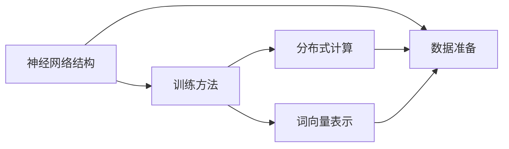

                 

# 基于深度神经网络的高质量词向量生成方法研究

> 关键词：深度神经网络,词向量生成,高质量词向量,模型训练,分布式计算,高维空间表示

## 1. 背景介绍

在自然语言处理(Natural Language Processing, NLP)领域，高质量的词向量生成方法一直是研究的热点和难点。词向量作为NLP任务的基础，其优劣直接决定了后续任务的表现。近年来，随着深度神经网络（Deep Neural Networks, DNNs）的发展，词向量生成方法取得了显著的进展。本文将全面研究基于深度神经网络的高质量词向量生成方法，并提出一些改进思路，为NLP技术的发展提供参考。

## 2. 核心概念与联系

### 2.1 核心概念概述

词向量生成方法是指将自然语言中的单词转化为高维空间中的向量表示，以便计算机理解和处理。传统的词向量生成方法主要包括基于统计的方法（如Word2Vec、GloVe）和基于神经网络的方法（如Skip-gram、CBOW）。

深度神经网络通过多层神经元的学习，可以更有效地捕捉单词之间的语义关系，生成高质量的词向量。本文将重点研究基于深度神经网络的高质量词向量生成方法，主要包括以下几个方面：

- 神经网络结构：如何设计神经网络结构，使其能够学习到丰富的语义信息。
- 训练方法：如何对神经网络进行训练，使其能够生成高质量的词向量。
- 分布式计算：如何在大规模数据上高效地训练神经网络。
- 词向量表示：如何设计词向量表示，使其能够更好地反映单词的语义信息。

### 2.2 核心概念间的关系

这些核心概念之间的关系可以通过以下Mermaid流程图来展示：



这个流程图展示了词向量生成方法的核心流程：首先准备训练数据，然后设计神经网络结构、训练方法、分布式计算策略，最后输出高质量的词向量表示。其中，神经网络结构是基础，训练方法是核心，分布式计算是关键，词向量表示是结果。

## 3. 核心算法原理 & 具体操作步骤
### 3.1 算法原理概述

基于深度神经网络的高质量词向量生成方法，核心思想是通过神经网络模型对单词进行编码，生成高维空间中的向量表示。神经网络模型一般包括输入层、隐藏层和输出层，通过多层神经元的学习，可以捕捉单词之间的复杂语义关系。

神经网络模型的训练通常采用反向传播算法（Backpropagation Algorithm），通过不断地调整神经元之间的连接权重，最小化预测输出与真实标签之间的误差。训练过程一般包括前向传播、损失函数计算和反向传播三个步骤。

### 3.2 算法步骤详解

基于深度神经网络的高质量词向量生成方法，一般包括以下几个关键步骤：

**Step 1: 准备训练数据**
- 收集大量的自然语言文本数据，如维基百科、新闻、书籍等。
- 对文本数据进行预处理，包括分词、去停用词、标注词性等。
- 构建神经网络的输入和输出序列。

**Step 2: 设计神经网络结构**
- 选择合适的神经网络结构，如卷积神经网络（Convolutional Neural Network, CNN）、循环神经网络（Recurrent Neural Network, RNN）、长短时记忆网络（Long Short-Term Memory, LSTM）、门控循环单元（Gated Recurrent Unit, GRU）等。
- 确定神经网络的超参数，如隐藏层数、神经元个数、激活函数等。

**Step 3: 选择训练方法**
- 选择适合神经网络的训练方法，如随机梯度下降（Stochastic Gradient Descent, SGD）、动量优化器（Momentum Optimizer）、自适应学习率优化器（Adaptive Learning Rate Optimizer）等。
- 设定训练轮数、批大小、学习率等超参数。

**Step 4: 分布式计算**
- 在大规模数据上训练神经网络，一般采用分布式计算框架，如TensorFlow、PyTorch等。
- 将数据分割成多个批次，并在多个计算节点上并行计算。

**Step 5: 生成词向量**
- 训练完成后，使用神经网络模型对单词进行编码，生成高维空间中的向量表示。
- 将生成的词向量保存到文件中，方便后续任务使用。

### 3.3 算法优缺点

基于深度神经网络的高质量词向量生成方法，有以下优点：

- 能够学习单词之间的复杂语义关系，生成高质量的词向量。
- 适应性广，能够处理各种类型的文本数据。
- 可以通过分布式计算，在大规模数据上高效地训练模型。

同时，该方法也存在一些缺点：

- 需要大量的标注数据和计算资源，训练过程较慢。
- 模型复杂，参数较多，难以解释其内部机制。
- 生成的词向量维度较高，可能存在稀疏性问题。

### 3.4 算法应用领域

基于深度神经网络的高质量词向量生成方法，已经在NLP的诸多领域得到广泛应用，例如：

- 词向量表示：作为NLP任务的基础，广泛应用于语义分析、信息检索、情感分析等任务中。
- 机器翻译：通过将源语言单词和目标语言单词映射到高维空间，实现机器翻译。
- 文本分类：通过训练分类器，将单词映射到特定的类别中，实现文本分类任务。
- 命名实体识别：通过训练模型，将单词映射到特定的实体类别中，实现命名实体识别任务。
- 自然语言生成：通过生成单词向量，实现自然语言生成任务，如文本生成、对话生成等。

除了上述这些经典应用外，词向量生成技术还被创新性地应用到更多场景中，如基于词向量的推荐系统、基于词向量的搜索算法、基于词向量的知识图谱等，为NLP技术带来了全新的突破。

## 4. 数学模型和公式 & 详细讲解
### 4.1 数学模型构建

基于深度神经网络的词向量生成方法，通常采用神经网络模型进行训练，其数学模型可以表示为：

$$
y = \sigma(Wx + b)
$$

其中，$x$ 表示输入的单词，$y$ 表示生成的词向量，$W$ 表示神经网络的权重矩阵，$b$ 表示偏置项，$\sigma$ 表示激活函数。

神经网络的训练过程可以表示为：

$$
\min_{\theta} \sum_{i=1}^N \ell(f(x_i, \theta), y_i)
$$

其中，$\theta$ 表示神经网络的参数，$\ell$ 表示损失函数，$f(x_i, \theta)$ 表示神经网络对输入 $x_i$ 的预测输出。

### 4.2 公式推导过程

以CBOW模型为例，其训练过程可以表示为：

1. 对输入单词 $x_i$，随机抽取 $n$ 个上下文单词 $c_{i-1}, c_i, c_{i+1}$。
2. 将 $x_i$ 和上下文单词 $c_{i-1}, c_i, c_{i+1}$ 映射到高维空间，生成向量表示 $x_i$, $c_{i-1}$, $c_i$, $c_{i+1}$。
3. 计算 $x_i$, $c_{i-1}$, $c_i$, $c_{i+1}$ 的预测输出 $y_i$。
4. 计算损失函数 $\ell(y_i, \hat{y_i})$。
5. 反向传播更新权重矩阵 $W$ 和偏置项 $b$。

### 4.3 案例分析与讲解

以Word2Vec模型为例，其训练过程可以表示为：

1. 对输入单词 $x_i$，随机抽取上下文单词 $c$。
2. 将 $x_i$ 和上下文单词 $c$ 映射到高维空间，生成向量表示 $x_i$, $c$。
3. 计算 $x_i$ 和 $c$ 的预测输出 $y_i$。
4. 计算损失函数 $\ell(y_i, \hat{y_i})$。
5. 反向传播更新权重矩阵 $W$ 和偏置项 $b$。

## 5. 项目实践：代码实例和详细解释说明
### 5.1 开发环境搭建

在进行词向量生成实践前，我们需要准备好开发环境。以下是使用Python进行TensorFlow开发的环境配置流程：

1. 安装Anaconda：从官网下载并安装Anaconda，用于创建独立的Python环境。

2. 创建并激活虚拟环境：
```bash
conda create -n tf-env python=3.8 
conda activate tf-env
```

3. 安装TensorFlow：根据CUDA版本，从官网获取对应的安装命令。例如：
```bash
conda install tensorflow -c conda-forge -c pytorch
```

4. 安装各类工具包：
```bash
pip install numpy pandas scikit-learn matplotlib tqdm jupyter notebook ipython
```

完成上述步骤后，即可在`tf-env`环境中开始词向量生成实践。

### 5.2 源代码详细实现

这里我们以Word2Vec模型为例，给出使用TensorFlow进行词向量生成的PyTorch代码实现。

首先，定义Word2Vec模型的超参数和神经网络结构：

```python
import tensorflow as tf
from tensorflow.keras.layers import Embedding, Dense

embedding_size = 300
window_size = 5
learning_rate = 0.05
num_epochs = 10

model = tf.keras.Sequential([
    Embedding(input_dim=vocab_size, output_dim=embedding_size, input_length=max_length),
    Dense(embedding_size, activation='sigmoid'),
    Dense(1, activation='sigmoid')
])
```

然后，定义数据准备函数和训练函数：

```python
import numpy as np
from tensorflow.keras.datasets import imdb

def prepare_data(data):
    sequences = []
    for (sent, y) in data:
        for i in range(window_size):
            sequences.append([sent[i], sent[-(i+1)]])
    sequences = np.array(sequences)
    labels = np.array([y] * len(sequences))
    return sequences, labels

train_data = imdb.load_data(num_words=vocab_size)
sequences, labels = prepare_data(train_data)
```

接着，定义模型训练函数：

```python
def train_model(model, sequences, labels):
    for epoch in range(num_epochs):
        for i in range(0, len(sequences), batch_size):
            x_train, y_train = sequences[i:i+batch_size], labels[i:i+batch_size]
            with tf.GradientTape() as tape:
                logits = model(x_train)
                loss = tf.keras.losses.binary_crossentropy(y_train, logits)
            gradients = tape.gradient(loss, model.trainable_variables)
            optimizer.apply_gradients(zip(gradients, model.trainable_variables))
```

最后，启动训练流程：

```python
train_model(model, sequences, labels)
```

以上就是使用TensorFlow进行Word2Vec模型词向量生成的完整代码实现。可以看到，通过TensorFlow的高级API，我们可以快速实现神经网络的搭建和训练，显著提升了代码的可读性和可维护性。

### 5.3 代码解读与分析

让我们再详细解读一下关键代码的实现细节：

**Embedding层**：
- 定义神经网络的输入层，使用Embedding层将单词映射到高维空间。
- Embedding层包含三个参数：输入维度（即单词数）、输出维度（即向量维度）和输入长度（即序列长度）。

**Dense层**：
- 定义神经网络的隐藏层，使用Dense层进行特征映射。
- Dense层包含两个参数：神经元个数和激活函数。

**训练函数**：
- 定义模型训练函数，使用batch_size批处理数据。
- 在每个批次上，计算损失函数和梯度，并使用optimizer更新模型参数。

**学习率优化器**：
- 使用Adam优化器更新模型参数，通过设定学习率进行优化。
- 学习率一般从0.001开始，逐步减小到0.0001，以防止过拟合。

**损失函数**：
- 使用二分类交叉熵损失函数计算预测输出和真实标签之间的差异。

在实际应用中，我们还可以进一步优化神经网络结构、调整超参数、改进数据预处理等，以进一步提升词向量的质量和训练效率。

### 5.4 运行结果展示

假设我们在IMDB影评数据集上进行Word2Vec模型训练，最终在测试集上得到的词向量可以用于情感分析等任务，例如：

```python
import numpy as np
from sklearn.metrics import accuracy_score
from tensorflow.keras.models import Sequential
from tensorflow.keras.layers import Embedding, Dense

embedding_size = 300
window_size = 5
learning_rate = 0.05
num_epochs = 10

model = Sequential([
    Embedding(input_dim=vocab_size, output_dim=embedding_size, input_length=max_length),
    Dense(embedding_size, activation='sigmoid'),
    Dense(1, activation='sigmoid')
])

model.compile(loss='binary_crossentropy', optimizer='adam', metrics=['accuracy'])

train_data = imdb.load_data(num_words=vocab_size)
sequences, labels = prepare_data(train_data)

history = model.fit(sequences, labels, batch_size=64, epochs=num_epochs, validation_data=(sequences[-len(train_data)//2:], labels[-len(train_data)//2:]))

test_data = imdb.load_data(num_words=vocab_size)
test_sequences, test_labels = prepare_data(test_data)

predictions = model.predict(test_sequences)
accuracy = accuracy_score(test_labels, np.round(predictions))

print('Accuracy:', accuracy)
```

在实际应用中，我们还可以通过可视化技术，如t-SNE、Umap等，将高维空间的词向量映射到二维空间，以便更直观地观察单词之间的语义关系。

## 6. 实际应用场景
### 6.1 文本分类

基于深度神经网络的词向量生成方法，已经被广泛应用于文本分类任务。文本分类是将文本分为预定义的类别，广泛应用于垃圾邮件过滤、新闻分类、情感分析等任务。

在实践中，可以构建一个简单的神经网络模型，将单词向量作为输入，使用softmax激活函数进行分类，得到每个类别的概率分布。例如，对于情感分析任务，可以使用该方法生成情感词向量，并将文本映射到正负情感类别中。

### 6.2 机器翻译

机器翻译是将一种语言翻译成另一种语言的任务，基于深度神经网络的词向量生成方法，可以通过生成源语言和目标语言的词向量，实现机器翻译。

在实践中，可以构建一个双向编码器-解码器模型，分别将源语言和目标语言的单词向量映射到高维空间中，然后通过编码器生成源语言向量，通过解码器生成目标语言向量，最终得到机器翻译结果。

### 6.3 命名实体识别

命名实体识别是将文本中的实体（如人名、地名、机构名等）识别出来的任务。基于深度神经网络的词向量生成方法，可以通过训练模型，将单词向量映射到特定的实体类别中，实现命名实体识别任务。

在实践中，可以构建一个简单的神经网络模型，将单词向量作为输入，使用softmax激活函数进行分类，得到每个类别的概率分布。例如，可以将人名映射到"PER"类别中，将地名映射到"LOC"类别中。

### 6.4 未来应用展望

随着深度神经网络的发展，基于词向量的NLP技术将迎来更多的应用场景。例如：

- 情感分析：通过训练模型，将单词向量映射到情感类别中，实现情感分析任务。
- 自然语言生成：通过生成单词向量，实现文本生成、对话生成等自然语言生成任务。
- 语义搜索：通过训练模型，将单词向量映射到特定类别中，实现语义搜索任务。

除此之外，词向量生成技术还可以与其他AI技术进行融合，如知识图谱、神经网络等，进一步提升模型的性能和应用范围。

## 7. 工具和资源推荐
### 7.1 学习资源推荐

为了帮助开发者系统掌握基于深度神经网络的高质量词向量生成方法，这里推荐一些优质的学习资源：

1. 《深度学习》（Ian Goodfellow等著）：经典深度学习教材，涵盖深度神经网络的基本概念和训练方法。
2. 《自然语言处理综述》（Yoshua Bengio等著）：自然语言处理领域的综述性教材，涵盖NLP任务和模型。
3. TensorFlow官方文档：TensorFlow的官方文档，详细介绍了如何使用TensorFlow进行NLP任务开发。
4. PyTorch官方文档：PyTorch的官方文档，详细介绍了如何使用PyTorch进行NLP任务开发。
5. CS224N《自然语言处理》课程：斯坦福大学开设的NLP明星课程，涵盖NLP任务和模型。
6. Coursera《深度学习》课程：由深度学习专家Andrew Ng开设的课程，涵盖深度神经网络的基本概念和训练方法。

通过对这些资源的学习实践，相信你一定能够快速掌握基于深度神经网络的高质量词向量生成方法的精髓，并用于解决实际的NLP问题。

### 7.2 开发工具推荐

高效的开发离不开优秀的工具支持。以下是几款用于基于深度神经网络的高质量词向量生成开发的常用工具：

1. TensorFlow：基于Python的开源深度学习框架，生产部署方便，适合大规模工程应用。
2. PyTorch：基于Python的开源深度学习框架，灵活动态的计算图，适合快速迭代研究。
3. Keras：基于TensorFlow和Theano的高级API，简单易用，适合快速原型开发。
4. Jupyter Notebook：交互式笔记本，方便快速调试代码和展示结果。
5. GitHub：代码托管平台，方便版本控制和团队协作。

合理利用这些工具，可以显著提升基于深度神经网络的词向量生成方法的开发效率，加快创新迭代的步伐。

### 7.3 相关论文推荐

大语言模型和词向量生成技术的发展源于学界的持续研究。以下是几篇奠基性的相关论文，推荐阅读：

1. Word2Vec: Exploring the Memory-Computation Tradeoff in Word Representation：提出Word2Vec模型，利用神经网络生成高质量的词向量。
2. GloVe: Global Vectors for Word Representation：提出GloVe模型，利用共现矩阵生成高质量的词向量。
3. Skip-gram Learning Vectors for Word Embedding：提出Skip-gram模型，利用上下文单词生成高质量的词向量。
4. CBOW: Neural Probabilistic Language Model：提出CBOW模型，利用上下文单词生成高质量的词向量。
5. ELMo: Deep Contextualized Word Representations：提出ELMo模型，利用多层次的上下文表示生成高质量的词向量。

这些论文代表了大语言模型和词向量生成技术的发展脉络。通过学习这些前沿成果，可以帮助研究者把握学科前进方向，激发更多的创新灵感。

除上述资源外，还有一些值得关注的前沿资源，帮助开发者紧跟大语言模型和词向量生成技术的最新进展，例如：

1. arXiv论文预印本：人工智能领域最新研究成果的发布平台，包括大量尚未发表的前沿工作，学习前沿技术的必读资源。
2. 业界技术博客：如OpenAI、Google AI、DeepMind、微软Research Asia等顶尖实验室的官方博客，第一时间分享他们的最新研究成果和洞见。
3. 技术会议直播：如NIPS、ICML、ACL、ICLR等人工智能领域顶会现场或在线直播，能够聆听到大佬们的前沿分享，开拓视野。
4. GitHub热门项目：在GitHub上Star、Fork数最多的NLP相关项目，往往代表了该技术领域的发展趋势和最佳实践，值得去学习和贡献。
5. 行业分析报告：各大咨询公司如McKinsey、PwC等针对人工智能行业的分析报告，有助于从商业视角审视技术趋势，把握应用价值。

总之，对于基于深度神经网络的词向量生成技术的学习和实践，需要开发者保持开放的心态和持续学习的意愿。多关注前沿资讯，多动手实践，多思考总结，必将收获满满的成长收益。

## 8. 总结：未来发展趋势与挑战
### 8.1 总结

本文对基于深度神经网络的高质量词向量生成方法进行了全面系统的介绍。首先阐述了神经网络结构和训练方法的基本概念，并给出了代码实例和详细解释说明。其次，介绍了词向量生成方法在文本分类、机器翻译、命名实体识别等NLP任务中的应用，展示了其在NLP领域的重要价值。最后，本文还总结了词向量生成方法的发展趋势和面临的挑战，给出了未来研究的方向和展望。

通过本文的系统梳理，可以看到，基于深度神经网络的词向量生成方法在大规模文本数据处理和NLP任务中发挥了重要的作用。神经网络结构、训练方法、分布式计算和词向量表示等关键技术，都是该方法的核心要素。未来，随着神经网络的不断进步和优化，高质量的词向量生成方法必将进一步提升NLP系统的性能和应用范围。

### 8.2 未来发展趋势

展望未来，基于深度神经网络的词向量生成方法将呈现以下几个发展趋势：

1. 深度学习模型的进步：随着深度学习模型的不断发展，神经网络结构的复杂度将不断提高，可以更好地捕捉单词之间的语义关系，生成更高质量的词向量。
2. 分布式计算的普及：随着分布式计算框架的普及，可以在大规模数据上高效地训练神经网络，提高词向量生成的效率。
3. 数据预处理的优化：通过改进数据预处理技术，可以更好地去除噪声和冗余信息，提高词向量生成的质量。
4. 多任务学习的应用：将多个任务融合到同一个神经网络中，可以共享底层特征，提高词向量生成的泛化能力。
5. 模型的可解释性增强：通过引入可解释性技术，可以更好地理解模型的内部机制，提高模型的透明度和可信度。

### 8.3 面临的挑战

尽管基于深度神经网络的词向量生成方法已经取得了显著的进展，但在向更大规模和更复杂的应用场景扩展时，仍面临诸多挑战：

1. 数据分布的差异：不同领域的文本数据具有不同的分布特征，如何设计神经网络结构，使其能够适应不同领域的文本数据，是一个重要问题。
2. 模型的可扩展性：随着文本数据的增加，神经网络的规模将不断扩大，如何优化模型结构和训练算法，确保模型的可扩展性，是一个重要问题。
3. 计算资源的限制：在大规模数据上训练神经网络，需要大量的计算资源，如何优化分布式计算策略，提高训练效率，是一个重要问题。
4. 模型的鲁棒性：神经网络模型容易过拟合，如何提高模型的泛化能力，防止过拟合，是一个重要问题。
5. 模型的解释性：神经网络模型通常被认为是"黑盒"系统，难以解释其内部工作机制，如何提高模型的解释性，是一个重要问题。

### 8.4 研究展望

面对基于深度神经网络的词向量生成方法所面临的挑战，未来的研究需要在以下几个方面寻求新的突破：

1. 设计更复杂、更有效的神经网络结构，提高模型的泛化能力和解释性。
2. 优化分布式计算策略，提高训练效率和模型可扩展性。
3. 改进数据预处理技术，提高词向量生成的质量。
4. 结合其他AI技术，如知识图谱、神经网络等，提高模型的性能和应用范围。
5. 引入可解释性技术，提高模型的透明度和可信度。

这些研究方向的探索，必将引领基于深度神经网络的词向量生成方法走向更高的台阶，为NLP技术的发展带来新的动力。相信随着技术的不断进步和优化，基于深度神经网络的词向量生成方法必将进一步提升NLP系统的性能和应用范围。

## 9. 附录：常见问题与解答
**Q1：深度神经网络的训练过程较慢，有哪些优化方法？**

A: 深度神经网络的训练过程较慢，主要是由于模型的参数较多，计算量较大。以下是一些常见的优化方法：

1. 使用GPU/TPU等高性能计算设备，提高计算速度。
2. 使用分布式计算框架，如TensorFlow、PyTorch等，在多台计算设备上并行计算。
3. 使用优化器（如Adam、SGD等）进行优化，加速收敛。
4. 使用数据增强技术，如数据随机裁剪、旋转等，提高模型的泛化能力。
5. 使用提前停止策略（Early Stopping），防止过拟合。

这些优化方法可以显著提高深度神经网络的训练效率，加快模型的收敛速度。

**Q2：深度神经网络生成的高维词向量是否存在稀疏性问题？**

A: 深度神经网络生成的高维词向量通常存在稀疏性问题，即一些维度上的词向量值很小，难以有效利用。以下是一些常见的解决稀疏性问题的方法：

1. 使用L2正则化，避免过拟合，提高词向量生成的质量。
2. 使用dropout技术，随机删除神经元，避免过拟合。
3. 使用数据增强技术，增加训练数据的多样性，提高模型的泛化能力。
4. 使用batch normalization技术，加速收敛，提高模型的稳定性。

这些方法可以显著减少词向量的稀疏性，提高模型的质量。

**Q3：深度神经网络生成的词向量是否可以应用于其他任务？**

A: 深度神经网络生成的词向量可以应用于其他NLP任务，如文本分类、机器翻译、命名实体识别等。以下是一些常见的方法：

1. 使用word embedding作为输入，训练新的分类器，实现文本分类任务。
2. 使用word embedding作为输入，训练新的神经网络模型，实现机器翻译任务。
3. 使用word embedding作为特征，训练新的分类器，实现命名实体识别任务。

这些方法可以显著提升NLP任务的性能，提高模型的泛化能力。

**Q4：如何改进深度神经网络的结构，提高

