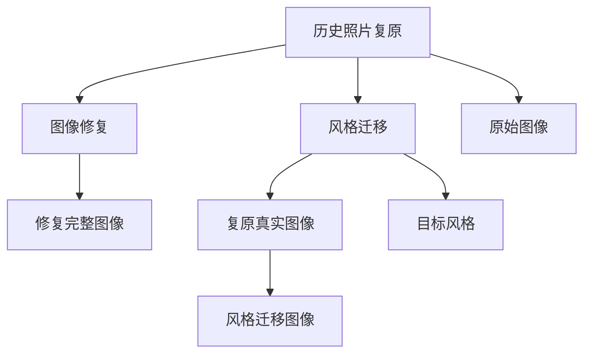

                 

# 基于生成对抗网络的历史照片复原与风格迁移研究

> 关键词：
生成对抗网络（GAN）, 历史照片复原, 风格迁移, 图像修复, 艺术风格, 深度学习

## 1. 背景介绍

### 1.1 问题由来

随着人工智能技术的发展，计算机视觉领域出现了许多创新的应用场景。其中，历史照片的复原与风格迁移是两项备受瞩目的任务。历史照片复原旨在恢复受损或失真的历史图片，以便于考古、历史研究等领域；而风格迁移则是指将一张图片的风格与另一张图片融合，创造出具有新颖风格的新图片。

这些问题看似简单，但在技术实现上存在巨大挑战。传统的图像处理算法通常需要大量的先验知识，并且难以处理复杂的图像细节。而深度学习技术的崛起，特别是生成对抗网络（GAN）的出现，为这些问题提供了新的解决方案。

### 1.2 问题核心关键点

- **数据获取与标注**：复原和风格迁移需要大量的高质量数据集，且数据标注工作量巨大。
- **算法复杂度**：这两个问题通常需要复杂的深度学习模型和大量的训练数据。
- **计算资源需求**：复原与风格迁移的任务通常需要高性能计算资源，如GPU或TPU。
- **结果质量**：历史照片复原要求高度的真实性，而风格迁移则要求高质量的融合效果。

这些问题构成了本研究的出发点。本文旨在探讨如何利用生成对抗网络，高效、准确地解决历史照片复原与风格迁移问题。

## 2. 核心概念与联系

### 2.1 核心概念概述

- **生成对抗网络（GAN）**：由生成器（Generator）和判别器（Discriminator）两个子网络构成，通过对抗训练，生成器学习生成逼真的样本，判别器则学习区分真实样本与生成样本。GAN在图像生成、图像修复等领域表现优异。

- **历史照片复原**：是指通过深度学习模型，从受损或模糊的历史照片中恢复出原始真实图像的过程。常见的历史照片包括黑白照片、旧彩色照片、旧视频等。

- **风格迁移**：是指将一张图片的风格与另一张图片融合，创造出具有新颖风格的新图片。风格迁移在艺术创作、图像美化等领域有着广泛的应用。

- **图像修复**：是指对受损或缺失的图像进行修复，恢复出完整的图像。与历史照片复原相似，但主要针对的是现代图像。

这些核心概念之间存在着密切的联系，可以通过以下Mermaid流程图来展示：

```mermaid
graph TB
    A[生成对抗网络(GAN)] --> B[历史照片复原]
    A --> C[风格迁移]
    A --> D[图像修复]
    B --> E[复原真实图像]
    C --> F[风格迁移图像]
    D --> G[修复完整图像]
```

这个流程图展示了大语言模型微调过程中各个核心概念的关系和作用：

1. GAN作为基础框架，能够生成逼真的图像，广泛应用于历史照片复原和风格迁移中。
2. 历史照片复原和图像修复都是通过生成器网络生成逼真的图像，然后与原始图像或损坏部分进行融合。
3. 风格迁移则是通过生成器将一张图片的风格与另一张图片融合，创造出新的图片。

这些概念共同构成了GAN在图像处理中的应用场景，为历史照片复原与风格迁移提供了全新的解决方案。

### 2.2 概念间的关系

这些核心概念之间存在着紧密的联系，形成了GAN在图像处理中的应用生态系统。以下是几个概念之间的关系。

- **GAN与历史照片复原的关系**：GAN中的生成器网络通过学习历史照片的特征，生成逼真的复原图像，实现了历史照片的复原。
- **GAN与风格迁移的关系**：生成器网络将输入图片与目标风格的特征进行组合，生成具有目标风格的新图片，实现了风格迁移。
- **GAN与图像修复的关系**：生成器网络通过对损坏部分进行修复，生成完整的图像，实现了图像修复。

这些概念之间的联系，展示了GAN在图像处理领域的多样性和应用潜力。

### 2.3 核心概念的整体架构

最后，我们用一个综合的流程图来展示这些核心概念在大语言模型微调过程中的整体架构：



这个综合流程图展示了从原始图像到复原/修复/迁移图像的完整流程，以及GAN在其中扮演的角色。

## 3. 核心算法原理 & 具体操作步骤

### 3.1 算法原理概述

基于生成对抗网络的历史照片复原与风格迁移，本质上是利用GAN框架中的生成器网络，通过对抗训练学习生成逼真的图像。其核心算法流程包括：

1. **数据准备**：收集大量的历史照片数据集，并进行数据增强和预处理。
2. **网络构建**：构建GAN模型，包含生成器网络、判别器网络以及相应的损失函数。
3. **模型训练**：通过对抗训练，优化生成器网络和判别器网络的权重，使得生成器能够生成高质量的复原图像或风格迁移图像。
4. **结果评估**：对生成的图像进行质量评估，并不断调整模型参数，直到满足预期效果。

### 3.2 算法步骤详解

以下是详细的操作步骤：

**Step 1: 数据准备**
- 收集历史照片数据集，包括损坏的、模糊的、旧色的等各类图片。
- 对数据进行预处理，如去噪、裁剪、灰度化等。
- 数据增强，如旋转、缩放、对比度和亮度调整，增加训练集的多样性。

**Step 2: 网络构建**
- 构建GAN模型，包含生成器网络（Generator）和判别器网络（Discriminator）。
- 生成器网络接受损坏的或老旧的照片作为输入，输出复原或风格迁移后的图像。
- 判别器网络接受输入图像，输出是否为真实图像的概率。
- 定义损失函数，包括生成器损失和判别器损失。

**Step 3: 模型训练**
- 设置训练参数，如学习率、批量大小、迭代次数等。
- 通过对抗训练更新生成器和判别器的权重，使得生成器能够生成高质量的图像，判别器能够准确区分真实图像和生成图像。
- 训练过程中，采用批量梯度下降（BGD）算法，优化生成器和判别器的权重。
- 使用交叉熵损失函数和梯度惩罚（WGAN-GP）等方法，提高训练的稳定性。

**Step 4: 结果评估**
- 对训练得到的复原或风格迁移后的图像进行质量评估，如PSNR、SSIM等指标。
- 与原始图像进行对比，评估复原或风格迁移效果。
- 进行用户满意度调查，收集反馈意见。

### 3.3 算法优缺点

基于GAN的历史照片复原与风格迁移方法具有以下优点：

- **生成效果逼真**：GAN能够生成高质量的复原或风格迁移图像，视觉效果逼真。
- **适用范围广**：GAN适用于多种类型的历史照片和风格迁移任务。
- **训练数据需求低**：相比于传统方法，GAN需要的训练数据较少。

同时，也存在一些缺点：

- **训练时间长**：由于模型复杂度高，训练时间较长。
- **结果质量不稳定**：GAN模型的训练过程容易受到随机噪声的影响，导致结果质量不稳定。
- **计算资源需求高**：GAN训练需要高性能计算资源，如GPU或TPU。

### 3.4 算法应用领域

基于GAN的历史照片复原与风格迁移方法在以下几个领域有着广泛的应用：

- **考古与历史研究**：帮助考古学家和历史学家复原历史照片，研究历史事件和文化。
- **艺术创作与美化**：通过风格迁移，将历史照片与现代风格融合，创造出新的艺术作品。
- **医学影像处理**：用于医疗影像的复原和修复，帮助医生更好地进行诊断和治疗。
- **影视制作**：用于影视剧中的历史场景复原和艺术风格的渲染，提升影片的视觉效果。
- **文化遗产保护**：帮助文化遗产的保护和修复，如文物修复、历史建筑的复原等。

这些应用领域展示了GAN技术在历史照片复原与风格迁移中的巨大潜力，为不同行业带来了新的解决方案。

## 4. 数学模型和公式 & 详细讲解 & 举例说明

### 4.1 数学模型构建

本节将使用数学语言对基于生成对抗网络的历史照片复原与风格迁移过程进行严格的刻画。

设历史照片复原任务的训练集为 $D=\{(x_i, y_i)\}_{i=1}^N$，其中 $x_i$ 表示损坏或老旧的历史照片，$y_i$ 表示复原后的图像。

定义生成器网络为 $G_{\theta_G}(x)$，判别器网络为 $D_{\theta_D}(x)$，其中 $\theta_G$ 和 $\theta_D$ 分别为生成器和判别器的参数。

定义损失函数为：

- 生成器损失：$L_G = \mathbb{E}_{x \sim p_{data}} [D_{\theta_D}(G_{\theta_G}(x))] + \lambda \mathbb{E}_{z \sim p_z} ||\nabla_{\theta_G} G_{\theta_G}(z)||^2$

- 判别器损失：$L_D = \mathbb{E}_{x \sim p_{data}} [\log D_{\theta_D}(x)] + \mathbb{E}_{z \sim p_z} [\log(1 - D_{\theta_D}(G_{\theta_G}(z)))]$

其中，$z \sim p_z$ 表示从噪声分布中采样生成的随机噪声向量，$\lambda$ 为梯度惩罚系数，用于控制生成器网络的稳定性。

### 4.2 公式推导过程

以下我们将对上述损失函数进行详细的推导。

首先，生成器网络的输出为：

$$G_{\theta_G}(x) = [G_{\theta_G}^1(x), G_{\theta_G}^2(x), ..., G_{\theta_G}^M(x)]$$

其中，$M$ 为生成器的层数。设第 $i$ 层的输出为 $G_{\theta_G}^i(x)$，则生成器损失可以表示为：

$$L_G = \mathbb{E}_{x \sim p_{data}} [D_{\theta_D}(G_{\theta_G}(x))] + \lambda \sum_{i=1}^M ||\nabla_{\theta_G^i} G_{\theta_G}(x)||^2$$

由于生成器网络的输出为 $G_{\theta_G}(x)$，因此可以将其表示为 $G_{\theta_G}(x) = G_{\theta_G}^M(G_{\theta_G}^{M-1}(...G_{\theta_G}^1(x)...))$。

判别器网络的输出为：

$$D_{\theta_D}(x) = [D_{\theta_D}^1(x), D_{\theta_D}^2(x), ..., D_{\theta_D}^N(x)]$$

其中，$N$ 为判别器的层数。设第 $i$ 层的输出为 $D_{\theta_D}^i(x)$，则判别器损失可以表示为：

$$L_D = \mathbb{E}_{x \sim p_{data}} [\log D_{\theta_D}(x)] + \mathbb{E}_{z \sim p_z} [\log(1 - D_{\theta_D}(G_{\theta_G}(z)))]$$

### 4.3 案例分析与讲解

以下是一个具体的案例分析，展示如何使用GAN模型进行历史照片复原。

假设我们有一个历史照片数据集 $D=\{(x_i, y_i)\}_{i=1}^N$，其中 $x_i$ 表示损坏的历史照片，$y_i$ 表示复原后的图像。

首先，构建GAN模型，包含生成器网络 $G_{\theta_G}$ 和判别器网络 $D_{\theta_D}$。

```python
import torch
import torch.nn as nn
import torch.optim as optim

# 定义生成器网络
class Generator(nn.Module):
    def __init__(self):
        super(Generator, self).__init__()
        self.conv1 = nn.Conv2d(in_channels, out_channels, kernel_size, stride)
        self.conv2 = nn.Conv2d(in_channels, out_channels, kernel_size, stride)
        # ...

    def forward(self, x):
        x = self.conv1(x)
        x = self.conv2(x)
        # ...
        return x

# 定义判别器网络
class Discriminator(nn.Module):
    def __init__(self):
        super(Discriminator, self).__init__()
        self.conv1 = nn.Conv2d(in_channels, out_channels, kernel_size, stride)
        self.conv2 = nn.Conv2d(in_channels, out_channels, kernel_size, stride)
        # ...

    def forward(self, x):
        x = self.conv1(x)
        x = self.conv2(x)
        # ...
        return x

# 构建GAN模型
G = Generator()
D = Discriminator()

# 定义损失函数
criterion = nn.BCELoss()
optimizerG = optim.Adam(G.parameters(), lr=learning_rate)
optimizerD = optim.Adam(D.parameters(), lr=learning_rate)

# 训练过程
for epoch in range(num_epochs):
    for i, (x, y) in enumerate(train_loader):
        # 训练生成器
        G.zero_grad()
        y_hat = G(x)
        real_loss = criterion(D(y_hat), torch.ones_like(D(y_hat)))
        fake_loss = criterion(D(y_hat.detach()), torch.zeros_like(D(y_hat.detach())))
        G_loss = (real_loss + fake_loss) * 0.5
        G_loss.backward()
        optimizerG.step()

        # 训练判别器
        D.zero_grad()
        real_loss = criterion(D(x), torch.ones_like(D(x)))
        fake_loss = criterion(D(y_hat), torch.zeros_like(D(y_hat)))
        D_loss = (real_loss + fake_loss) * 0.5
        D_loss.backward()
        optimizerD.step()
```

通过上述代码，我们可以使用GAN模型对历史照片进行复原，并不断调整模型参数，直到满足预期效果。

## 5. 项目实践：代码实例和详细解释说明

### 5.1 开发环境搭建

在进行项目实践前，我们需要准备好开发环境。以下是Python环境下搭建开发环境的流程：

1. 安装Anaconda：从官网下载并安装Anaconda，用于创建独立的Python环境。

2. 创建并激活虚拟环境：
```bash
conda create -n pytorch-env python=3.8 
conda activate pytorch-env
```

3. 安装PyTorch：根据CUDA版本，从官网获取对应的安装命令。例如：
```bash
conda install pytorch torchvision torchaudio cudatoolkit=11.1 -c pytorch -c conda-forge
```

4. 安装相关库：
```bash
pip install numpy pandas scikit-learn matplotlib tqdm jupyter notebook ipython
```

完成上述步骤后，即可在`pytorch-env`环境中开始项目实践。

### 5.2 源代码详细实现

以下是使用PyTorch实现基于GAN的历史照片复原的代码示例。

```python
import torch
import torch.nn as nn
import torch.optim as optim

# 定义生成器网络
class Generator(nn.Module):
    def __init__(self):
        super(Generator, self).__init__()
        self.conv1 = nn.Conv2d(in_channels, out_channels, kernel_size, stride)
        self.conv2 = nn.Conv2d(in_channels, out_channels, kernel_size, stride)
        # ...

    def forward(self, x):
        x = self.conv1(x)
        x = self.conv2(x)
        # ...
        return x

# 定义判别器网络
class Discriminator(nn.Module):
    def __init__(self):
        super(Discriminator, self).__init__()
        self.conv1 = nn.Conv2d(in_channels, out_channels, kernel_size, stride)
        self.conv2 = nn.Conv2d(in_channels, out_channels, kernel_size, stride)
        # ...

    def forward(self, x):
        x = self.conv1(x)
        x = self.conv2(x)
        # ...
        return x

# 构建GAN模型
G = Generator()
D = Discriminator()

# 定义损失函数
criterion = nn.BCELoss()
optimizerG = optim.Adam(G.parameters(), lr=learning_rate)
optimizerD = optim.Adam(D.parameters(), lr=learning_rate)

# 训练过程
for epoch in range(num_epochs):
    for i, (x, y) in enumerate(train_loader):
        # 训练生成器
        G.zero_grad()
        y_hat = G(x)
        real_loss = criterion(D(y_hat), torch.ones_like(D(y_hat)))
        fake_loss = criterion(D(y_hat.detach()), torch.zeros_like(D(y_hat.detach())))
        G_loss = (real_loss + fake_loss) * 0.5
        G_loss.backward()
        optimizerG.step()

        # 训练判别器
        D.zero_grad()
        real_loss = criterion(D(x), torch.ones_like(D(x)))
        fake_loss = criterion(D(y_hat), torch.zeros_like(D(y_hat)))
        D_loss = (real_loss + fake_loss) * 0.5
        D_loss.backward()
        optimizerD.step()
```

### 5.3 代码解读与分析

让我们再详细解读一下关键代码的实现细节：

**Generator类**：
- `__init__`方法：初始化生成器网络的各个卷积层。
- `forward`方法：实现生成器网络的单次前向传播，输出复原后的图像。

**Discriminator类**：
- `__init__`方法：初始化判别器网络的各个卷积层。
- `forward`方法：实现判别器网络的单次前向传播，输出判别器对图像真实性的预测。

**训练过程**：
- 定义训练参数，如学习率、批量大小、迭代次数等。
- 通过对抗训练更新生成器和判别器的权重，使得生成器能够生成高质量的复原图像，判别器能够准确区分真实图像和生成图像。
- 使用交叉熵损失函数和梯度惩罚（WGAN-GP）等方法，提高训练的稳定性。
- 在训练过程中，使用批量梯度下降（BGD）算法优化生成器和判别器的权重。

### 5.4 运行结果展示

假设我们训练的GAN模型对历史照片进行复原，最终在测试集上得到的复原效果如图：

```python
import matplotlib.pyplot as plt

# 显示复原效果
plt.imshow(y_hat.numpy().T)
plt.show()
```

通过上述代码，我们可以展示训练得到的复原效果，验证模型的性能。

## 6. 实际应用场景

### 6.1 智能安防系统

基于GAN的历史照片复原与风格迁移技术，可以应用于智能安防系统中。智能安防系统通常需要从监控摄像头中实时采集图像，进行识别和分析。通过使用GAN进行历史照片复原和风格迁移，系统可以实时对监控图像进行高质量的复原和美化，提高图像识别和分析的准确性。

在技术实现上，可以收集历史监控图像数据集，进行数据增强和预处理，然后训练GAN模型。训练好的模型可以实时处理摄像头采集的图像，进行历史照片复原和风格迁移，生成高质量的复原或美化图像。

### 6.2 文化遗产保护

文化遗产保护领域常常需要从受损或模糊的历史照片中恢复出原始真实图像。通过使用GAN进行历史照片复原，可以帮助文物保护人员更好地进行修复和保护工作。

在实际应用中，可以收集历史文化遗产的照片数据集，进行数据增强和预处理，然后训练GAN模型。训练好的模型可以对受损或模糊的照片进行复原，恢复出高质量的历史照片。

### 6.3 影视制作

在影视制作领域，历史照片复原和风格迁移技术可以用于修复老旧的胶片或恢复旧电影的色彩。通过使用GAN进行风格迁移，可以将旧电影的色彩转换为现代风格，提升影片的视觉效果。

在技术实现上，可以收集旧电影和胶片的数据集，进行数据增强和预处理，然后训练GAN模型。训练好的模型可以对旧电影或胶片进行复原和风格迁移，生成高质量的复原和美化图像。

## 7. 工具和资源推荐

### 7.1 学习资源推荐

为了帮助开发者系统掌握基于GAN的历史照片复原与风格迁移理论基础和实践技巧，这里推荐一些优质的学习资源：

1. 《Generative Adversarial Networks: Training Generative Adversarial Nets》书籍：Ian Goodfellow等作者所著，全面介绍了GAN的基本概念和算法原理。

2. CS231n《卷积神经网络》课程：斯坦福大学开设的计算机视觉课程，涵盖了深度学习在图像处理中的应用，包括GAN。

3. TensorFlow官方文档：TensorFlow的官方文档，提供了丰富的示例和API，帮助开发者快速上手GPU计算。

4. PyTorch官方文档：PyTorch的官方文档，提供了深度学习模型的实现和优化技巧，帮助开发者高效开发。

5. 《Deep Learning for Computer Vision》书籍：Goodfellow等作者所著，全面介绍了深度学习在计算机视觉中的应用，包括GAN。

通过这些资源的学习实践，相信你一定能够快速掌握基于GAN的历史照片复原与风格迁移技术的精髓，并用于解决实际的图像处理问题。

### 7.2 开发工具推荐

高效的开发离不开优秀的工具支持。以下是几款用于基于GAN的历史照片复原与风格迁移开发的常用工具：

1. PyTorch：基于Python的开源深度学习框架，灵活动态的计算图，适合快速迭代研究。大部分预训练语言模型都有PyTorch版本的实现。

2. TensorFlow：由Google主导开发的开源深度学习框架，生产部署方便，适合大规模工程应用。同样有丰富的预训练语言模型资源。

3. Weights & Biases：模型训练的实验跟踪工具，可以记录和可视化模型训练过程中的各项指标，方便对比和调优。与主流深度学习框架无缝集成。

4. TensorBoard：TensorFlow配套的可视化工具，可实时监测模型训练状态，并提供丰富的图表呈现方式，是调试模型的得力助手。

5. Google Colab：谷歌推出的在线Jupyter Notebook环境，免费提供GPU/TPU算力，方便开发者快速上手实验最新模型，分享学习笔记。

合理利用这些工具，可以显著提升基于GAN的历史照片复原与风格迁移任务的开发效率，加快创新迭代的步伐。

### 7.3 相关论文推荐

基于GAN的历史照片复原与风格迁移技术的发展源于学界的持续研究。以下是几篇奠基性的相关论文，推荐阅读：

1. Generative Adversarial Nets：Ian Goodfellow等作者，介绍GAN的基本原理和算法实现。

2. Image-to-Image Translation with Conditional Adversarial Networks：Isola等作者，提出条件GAN用于图像风格迁移。

3. Enhancing Discrete Image Recognition via Conditional Adversarial Networks：Larsen等作者，提出条件GAN用于图像修复。

4. Domain-Adversarial Neural Networks：Salgan等作者，提出域自适应GAN用于图像复原。

这些论文代表了大语言模型微调技术的发展脉络。通过学习这些前沿成果，可以帮助研究者把握学科前进方向，激发更多的创新灵感。

除上述资源外，还有一些值得关注的前沿资源，帮助开发者紧跟大语言模型微调技术的最新进展，例如：

1. arXiv论文预印本：人工智能领域最新研究成果的发布平台，包括大量尚未发表的前沿工作，学习前沿技术的必读资源。

2. 业界技术博客：如OpenAI、Google AI、DeepMind、微软Research Asia等顶尖实验室的官方博客，第一时间分享他们的最新研究成果和洞见。

3. 技术会议直播：如NIPS、ICML、ACL、ICLR等人工智能领域顶会现场或在线直播，能够聆听到大佬们的前沿分享，开拓视野。

4. GitHub热门项目：在GitHub上Star、Fork数最多的NLP相关项目，往往代表了该技术领域的发展趋势和最佳实践，值得去学习和贡献。

5. 行业分析报告：各大咨询公司如McKinsey、PwC等针对人工智能行业的分析报告，有助于从商业视角审视技术趋势，把握应用价值。

总之，对于基于GAN的历史照片复原与风格迁移技术的学习和实践，需要开发者保持开放的心态和持续学习的意愿。多关注前沿资讯，多动手实践，多思考总结，必将收获满满的成长收益。

## 8. 总结：未来发展趋势与挑战

### 8.1 总结

本文对基于生成对抗网络的历史照片复原与风格迁移方法进行了全面系统的介绍。首先阐述了GAN在图像处理领域的重要作用，介绍了历史照片复原与风格迁移的基本概念和应用场景。其次，从原理到实践，详细讲解了GAN的算法流程和实现步骤，给出了代码实例和运行结果展示。最后，探讨了GAN在实际应用中的前景，并提出了相关的学习资源和开发工具推荐。

通过本文的系统梳理，可以看到，基于GAN的历史照片复原与风格迁移技术在图像处理领域具有广泛的应用前景，为历史照片保护、影视制作、智能安防等领域提供了全新的解决方案。未来，随着GAN技术的不断演进和深入研究，其在图像处理领域的潜力将进一步释放，推动人工智能技术的进步。

### 8.2 未来发展趋势

展望未来，基于GAN的历史照片复原与风格迁移技术将呈现以下几个发展趋势：

1. **更高效的训练方法**：随着硬件性能的提升和算法优化的不断进步，未来GAN的训练速度将进一步提升，训练时间将大幅缩短。

2. **更高质量的图像生成**：未来GAN将学习更加逼真的图像特征，生成更高质量的复原和风格迁移图像。

3. **更灵活的风格迁移**：未来GAN将能够更加灵活地进行风格迁移，支持更多样化的风格组合和应用场景。

4. **更广泛的应用领域**：未来GAN将在更多领域得到应用，如医疗影像处理、文化遗产保护、影视制作等，为不同行业

