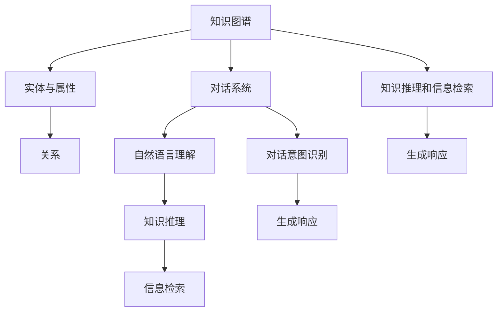
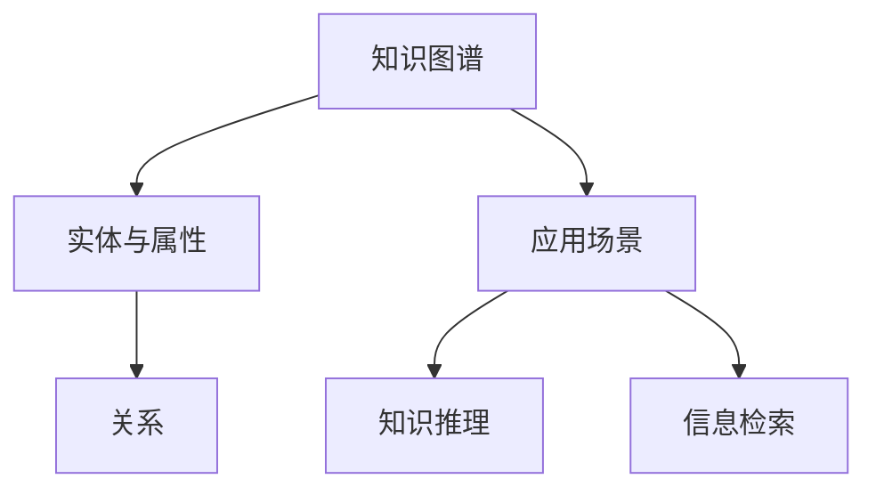
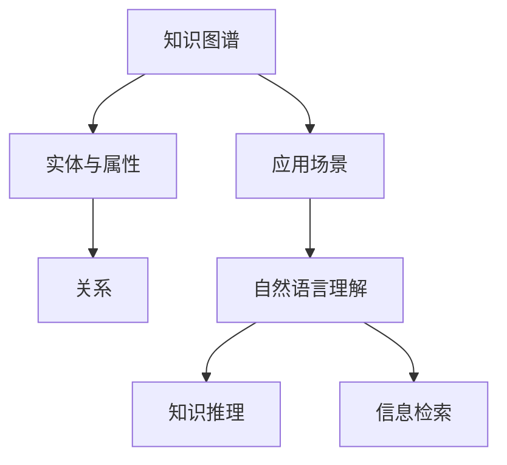
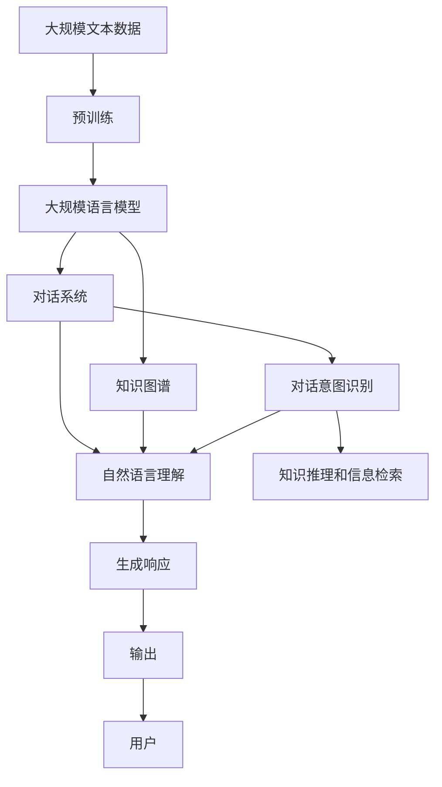

                 

# 基于知识图谱的对话问答

## 1. 背景介绍

### 1.1 问题由来
近年来，对话系统（Dialogue Systems）在自然语言处理（NLP）和人工智能（AI）领域取得了巨大突破，极大地推动了人机交互的发展。然而，现有的对话系统普遍存在知识短板，仅依赖统计和预训练语言模型，难以解决知识层面的复杂问题。

针对这一问题，知识图谱（Knowledge Graphs）技术应运而生。知识图谱是一种结构化的语义知识表示方式，能够有效整合多源异构的知识信息，为对话系统提供丰富的语义背景知识。通过将知识图谱与对话系统结合，可以实现对复杂问答问题的智能处理，极大地提升对话系统的智能水平。

### 1.2 问题核心关键点
基于知识图谱的对话问答系统，核心思想是通过构建对话意图与知识图谱之间的映射关系，实现在对话过程中实时地检索、推理和反馈知识图谱信息，从而完成对问答问题的智能解答。

具体来说，基于知识图谱的对话问答系统的核心关键点包括：
- **知识图谱构建**：构建知识图谱，为对话系统提供语义背景知识。
- **对话意图识别**：识别用户对话意图，将对话意图映射为知识图谱中的实体或属性。
- **知识推理与检索**：根据对话意图，从知识图谱中检索相关实体和关系，进行推理和融合。
- **生成响应**：根据推理结果，生成自然语言响应，完成对话。

### 1.3 问题研究意义
知识图谱在对话系统中的应用，对于提升对话系统的智能水平、解决知识短板问题具有重要意义：

1. **提高对话系统的智能水平**：知识图谱能够为对话系统提供丰富的语义背景知识，帮助对话系统更准确地理解对话意图，从而提升回答的准确性和合理性。
2. **解决知识短板问题**：现有对话系统大多依赖预训练语言模型，难以应对复杂的知识层面的问题。通过知识图谱技术，对话系统可以更灵活地处理结构化知识，解决知识短板问题。
3. **提升用户体验**：知识图谱能够帮助对话系统更自然地处理用户的多样化提问，提升用户体验，增强用户对对话系统的信任感。
4. **加速知识应用**：知识图谱技术可以加速知识在大规模语言模型中的传播和应用，促进知识在多领域、多场景中的高效利用。
5. **赋能行业应用**：知识图谱在医疗、教育、金融、法律等多个领域的应用，能够提升对话系统在这些领域的智能水平，推动人工智能技术在各行各业的落地应用。

## 2. 核心概念与联系

### 2.1 核心概念概述

为更好地理解基于知识图谱的对话问答系统，本节将介绍几个密切相关的核心概念：

- **知识图谱（Knowledge Graphs）**：一种结构化的语义知识表示方式，由实体（Entity）、属性（Property）和关系（Relation）组成。通过知识图谱，可以将大规模的非结构化知识进行结构化表示，便于机器进行语义推理和信息检索。
- **对话系统（Dialogue Systems）**：一种能够与用户进行自然语言交互的系统，包括问答系统、聊天机器人、语音助手等。对话系统的核心目标是通过自然语言理解技术，实现与用户的双向交流。
- **自然语言理解（Natural Language Understanding, NLU）**：指计算机理解人类语言的能力，包括分词、词性标注、命名实体识别、意图识别、语义分析等。自然语言理解是对话系统的重要基础。
- **知识推理（Knowledge Reasoning）**：指基于知识图谱中的实体和关系，进行逻辑推理和信息融合的能力。知识推理是对话问答系统中的关键步骤。
- **信息检索（Information Retrieval, IR）**：指从知识图谱中检索相关实体和关系的能力。信息检索是对话问答系统的重要支撑。

这些核心概念之间的逻辑关系可以通过以下Mermaid流程图来展示：



这个流程图展示了知识图谱在对话系统中的应用过程：

1. 知识图谱通过构建实体和属性，描述丰富的语义信息。
2. 对话系统通过自然语言理解技术，识别用户的对话意图。
3. 根据对话意图，对话系统通过知识推理和信息检索技术，从知识图谱中检索相关信息，并进行推理融合。
4. 最后，对话系统根据推理结果，生成自然语言响应，完成对话。

### 2.2 概念间的关系

这些核心概念之间存在着紧密的联系，形成了基于知识图谱的对话问答系统的完整生态系统。下面我们通过几个Mermaid流程图来展示这些概念之间的关系。

#### 2.2.1 对话系统的核心组件


这个流程图展示了对话系统的核心组件：自然语言理解、对话意图识别、知识推理和信息检索、生成响应。

#### 2.2.2 知识图谱的构建与应用



这个流程图展示了知识图谱的构建与在对话系统中的应用：知识图谱通过实体与属性描述语义信息，对话系统通过知识推理和信息检索技术，从知识图谱中检索相关信息，并应用到对话中。

#### 2.2.3 知识图谱与自然语言理解的关系



这个流程图展示了知识图谱与自然语言理解的关系：知识图谱为自然语言理解提供语义背景知识，通过知识推理和信息检索技术，对话系统可以从知识图谱中检索相关信息，并进行推理融合，提升自然语言理解的准确性。

### 2.3 核心概念的整体架构

最后，我们用一个综合的流程图来展示这些核心概念在大规模语言模型微调过程中的整体架构：



这个综合流程图展示了从预训练到对话系统构建的完整过程：

1. 大语言模型通过预训练学习到语言知识，形成语义表示。
2. 知识图谱通过构建实体和属性，描述丰富的语义信息。
3. 对话系统通过自然语言理解技术，识别用户的对话意图。
4. 根据对话意图，对话系统通过知识推理和信息检索技术，从知识图谱中检索相关信息，并进行推理融合。
5. 最后，对话系统根据推理结果，生成自然语言响应，完成对话。

## 3. 核心算法原理 & 具体操作步骤
### 3.1 算法原理概述

基于知识图谱的对话问答系统，本质上是一个信息检索和知识推理的过程。其核心思想是：通过构建对话意图与知识图谱之间的映射关系，实现在对话过程中实时地检索、推理和反馈知识图谱信息，从而完成对问答问题的智能解答。

形式化地，假设知识图谱为 $G=(E, R, S)$，其中 $E$ 为实体集合，$R$ 为关系集合，$S$ 为属性集合。给定对话系统 $D=\{(X_i, Y_i)\}_{i=1}^N$，其中 $X_i$ 为输入的自然语言文本，$Y_i$ 为对应的意图标签。微调的目标是找到最优的对话模型参数 $\theta$，使得模型能够根据用户输入的自然语言文本 $X_i$，在知识图谱 $G$ 中进行检索和推理，最终输出对应的自然语言响应 $Y_i$。

具体来说，对话模型的核心过程如下：
1. 对话系统通过自然语言理解技术，将用户输入的自然语言文本 $X_i$ 转换为机器可理解的形式，生成对话意图 $I_i$。
2. 对话系统根据对话意图 $I_i$，在知识图谱 $G$ 中进行信息检索，得到相关的实体和关系。
3. 对话系统通过知识推理技术，对检索到的实体和关系进行逻辑推理和融合，得到推理结果 $R_i$。
4. 对话系统根据推理结果 $R_i$，生成自然语言响应 $Y_i$。

### 3.2 算法步骤详解

基于知识图谱的对话问答系统一般包括以下几个关键步骤：

**Step 1: 准备知识图谱和对话数据集**
- 收集对话数据集，标注对话意图，将对话数据集划分为训练集、验证集和测试集。
- 构建知识图谱，收集实体、属性和关系，并进行实体消歧、关系标注等预处理。

**Step 2: 设计对话模型**
- 选择合适的对话模型，如Seq2Seq、Transformer等。
- 设计对话模型的架构，包括编码器、解码器、注意力机制等。
- 设计对话模型的损失函数，如交叉熵损失、BLEU分数等。

**Step 3: 进行模型微调**
- 使用对话数据集对对话模型进行微调，调整模型参数 $\theta$，最小化损失函数。
- 在验证集上评估模型性能，调整超参数，防止过拟合。
- 在测试集上评估模型性能，对比微调前后的效果。

**Step 4: 集成知识图谱**
- 将知识图谱信息整合到对话模型中，进行信息检索和知识推理。
- 在对话过程中，根据对话意图，检索知识图谱中的相关信息，进行推理和融合。
- 根据推理结果，生成自然语言响应。

**Step 5: 部署和测试**
- 将微调后的对话模型部署到实际应用系统中，进行测试和迭代优化。
- 收集用户反馈，持续优化对话模型的性能。

以上是基于知识图谱的对话问答系统的一般流程。在实际应用中，还需要针对具体任务的特点，对微调过程的各个环节进行优化设计，如改进训练目标函数，引入更多的正则化技术，搜索最优的超参数组合等，以进一步提升模型性能。

### 3.3 算法优缺点

基于知识图谱的对话问答系统具有以下优点：
1. **提高对话系统的智能水平**：知识图谱能够为对话系统提供丰富的语义背景知识，帮助对话系统更准确地理解对话意图，从而提升回答的准确性和合理性。
2. **解决知识短板问题**：现有对话系统大多依赖预训练语言模型，难以应对复杂的知识层面的问题。通过知识图谱技术，对话系统可以更灵活地处理结构化知识，解决知识短板问题。
3. **提升用户体验**：知识图谱能够帮助对话系统更自然地处理用户的多样化提问，提升用户体验，增强用户对对话系统的信任感。
4. **加速知识应用**：知识图谱技术可以加速知识在大规模语言模型中的传播和应用，促进知识在多领域、多场景中的高效利用。
5. **赋能行业应用**：知识图谱在医疗、教育、金融、法律等多个领域的应用，能够提升对话系统在这些领域的智能水平，推动人工智能技术在各行各业的落地应用。

同时，该方法也存在一定的局限性：
1. **知识图谱构建成本高**：构建知识图谱需要大量的人力和时间成本，特别是在大规模领域的知识图谱构建中，难度更大。
2. **知识图谱更新频率低**：知识图谱的更新频率相对较低，难以实时更新新知识，可能影响对话系统的实时性。
3. **知识图谱的泛化能力有限**：知识图谱构建的领域依赖性强，不同领域的知识图谱难以通用，限制了知识图谱的应用范围。
4. **知识推理的复杂性**：知识推理涉及复杂的逻辑推理和信息融合，技术难度较大，需要较强的算法支持。
5. **知识图谱的安全性**：知识图谱中可能包含敏感或有害信息，需要进行严格的控制和管理，确保其安全性和隐私性。

尽管存在这些局限性，但就目前而言，基于知识图谱的对话问答系统仍是大规模语言模型应用的重要范式。未来相关研究的重点在于如何进一步降低知识图谱构建的成本，提高知识图谱的更新频率，增强知识图谱的泛化能力，提升知识推理的准确性，加强知识图谱的安全性等因素。

### 3.4 算法应用领域

基于知识图谱的对话问答系统已经在多个领域得到了广泛应用，例如：

- **医疗领域**：构建医学知识图谱，辅助医生进行疾病诊断、治疗方案推荐等。通过知识图谱，对话系统可以更好地理解医学知识，提升医疗服务水平。
- **教育领域**：构建教育知识图谱，辅助教师进行教学设计、智能评估等。通过知识图谱，对话系统可以更好地理解学生的学习情况，提供个性化的教育服务。
- **金融领域**：构建金融知识图谱，辅助金融分析师进行市场分析、风险评估等。通过知识图谱，对话系统可以更好地理解金融市场，提供智能化的金融服务。
- **法律领域**：构建法律知识图谱，辅助律师进行法律咨询、案件分析等。通过知识图谱，对话系统可以更好地理解法律知识，提供智能化的法律服务。
- **智能客服**：构建客服知识图谱，辅助智能客服进行客户咨询、问题解答等。通过知识图谱，对话系统可以更好地理解客户需求，提升客服服务质量。

除了上述这些经典任务外，基于知识图谱的对话问答系统还被创新性地应用到更多场景中，如可控文本生成、智能问答、多轮对话等，为NLP技术带来了全新的突破。随着知识图谱和对话问答技术的不断进步，相信NLP技术将在更广阔的应用领域大放异彩。

## 4. 数学模型和公式 & 详细讲解  
### 4.1 数学模型构建

本节将使用数学语言对基于知识图谱的对话问答过程进行更加严格的刻画。

记对话系统为 $D=(\mathcal{X}, \mathcal{Y}, f)$，其中 $\mathcal{X}$ 为输入空间，$\mathcal{Y}$ 为输出空间，$f$ 为对话模型。假设对话数据集为 $D=\{(X_i, Y_i)\}_{i=1}^N$，其中 $X_i$ 为自然语言文本，$Y_i$ 为对应的意图标签。知识图谱为 $G=(E, R, S)$，其中 $E$ 为实体集合，$R$ 为关系集合，$S$ 为属性集合。

定义对话模型 $f$ 在输入 $X_i$ 上的输出为 $Y_i$，即 $Y_i=f(X_i)$。对话模型 $f$ 可以表示为序列到序列模型（Seq2Seq）或Transformer模型，具体形式如下：

$$
f(X_i) = \text{Seq2Seq}(X_i) \quad \text{或} \quad f(X_i) = \text{Transformer}(X_i)
$$

对话模型的损失函数为 $\ell(f(X_i), Y_i)$，表示模型输出与真实意图标签之间的差异。在知识图谱 $G$ 中，定义信息检索函数 $\text{IR}(I_i, G)$，用于从知识图谱中检索与对话意图 $I_i$ 相关的实体和关系。定义知识推理函数 $\text{PR}(R_i, G)$，用于对检索到的实体和关系进行逻辑推理和融合。定义生成响应函数 $\text{RE}(R_i)$，用于将推理结果 $R_i$ 转换为自然语言响应。

知识图谱与对话系统的整体流程可以表示为：

$$
I_i = \text{NLU}(X_i) \quad \text{和} \quad Y_i = \text{RE}(\text{PR}(\text{IR}(I_i, G), G))
$$

其中 $\text{NLU}$ 为自然语言理解函数，$\text{IR}$ 为信息检索函数，$\text{PR}$ 为知识推理函数，$\text{RE}$ 为生成响应函数。

### 4.2 公式推导过程

以下我们以医疗领域为例，推导知识图谱与对话系统的集成过程。

假设知识图谱中包含医疗领域实体和关系，如“疾病”、“症状”、“治疗方法”等。对于医疗问答问题，如“得了肺炎怎么办？”，知识图谱中存在“疾病”和“治疗方法”的实体，以及“治疗”关系。

首先，通过自然语言理解技术，将用户输入的自然语言文本 $X_i$ 转换为机器可理解的形式，生成对话意图 $I_i$。例如，对于“得了肺炎怎么办？”，自然语言理解模型可能将其转换为“问诊”意图。

接着，通过信息检索函数 $\text{IR}(I_i, G)$，从知识图谱中检索与对话意图 $I_i$ 相关的实体和关系。例如，从知识图谱中检索出“疾病”和“治疗方法”的实体，以及“治疗”关系的实体。

然后，通过知识推理函数 $\text{PR}(R_i, G)$，对检索到的实体和关系进行逻辑推理和融合。例如，根据“疾病”和“治疗方法”的实体，以及“治疗”关系的实体，推理出“治疗方案”。

最后，通过生成响应函数 $\text{RE}(R_i)$，将推理结果 $R_i$ 转换为自然语言响应。例如，将“治疗方案”转换为“建议进行药物治疗，多休息，多喝水”等自然语言响应。

知识图谱与对话系统的集成过程可以表示为：

$$
Y_i = \text{RE}(\text{PR}(\text{IR}(I_i, G), G))
$$

在数学上，可以表示为：

$$
Y_i = \text{RE}(\text{PR}(\text{IR}(\text{NLU}(X_i), G), G))
$$

这个公式展示了知识图谱与对话系统的集成过程，即通过自然语言理解、信息检索、知识推理和生成响应四个步骤，将用户输入的自然语言文本转换为自然语言响应。

## 5. 项目实践：代码实例和详细解释说明
### 5.1 开发环境搭建

在进行知识图谱与对话问答的实践前，我们需要准备好开发环境。以下是使用Python进行PyTorch开发的环境配置流程：

1. 安装Anaconda：从官网下载并安装Anaconda，用于创建独立的Python环境。

2. 创建并激活虚拟环境：
```bash
conda create -n dialog-env python=3.8 
conda activate dialog-env
```

3. 安装PyTorch：根据CUDA版本，从官网获取对应的安装命令。例如：
```bash
conda install pytorch torchvision torchaudio cudatoolkit=11.1 -c pytorch -c conda-forge
```

4. 安装Spacy：用于自然语言处理中的词向量表示和实体识别。
```bash
pip install spacy
```

5. 安装RDFlib：用于构建和查询知识图谱。
```bash
pip install rdflib
```

6. 安装Stanford CoreNLP：用于自然语言处理中的实体识别和关系抽取。
```bash
pip install stanford-corenlp
```

完成上述步骤后，即可在`dialog-env`环境中开始知识图谱与对话问答的实践。

### 5.2 源代码详细实现

这里我们以医疗问答系统为例，给出使用Spacy和RDFlib构建知识图谱，并结合PyTorch进行对话问答的PyTorch代码实现。

首先，定义知识图谱的构建函数：

```python
import rdflib

# 定义知识图谱实体和关系
def create_kg():
    g = rdflib.Graph()
    g.bind('rdfs', RDFS)
    g.bind('rdf', RDF)
    g.bind('dc', DC)

    # 创建实体和关系
    disease = g.node('disease')
    symptom = g.node('symptom')
    treatment = g.node('treatment')
    symptom_property = g.node('has_symptom')
    treatment_property = g.node('has_treatment')

    g.add((disease, symptom_property, symptom))
    g.add((symptom, treatment_property, treatment))

    return g
```

然后，定义对话模型的构建函数：

```python
import torch
from torch.nn import TransformerEncoder, TransformerEncoderLayer, TransformerDecoder, TransformerDecoderLayer

class DialogModel(torch.nn.Module):
    def __init__(self, n_vocab, n_tok, n_emb, n_layers):
        super(DialogModel, self).__init__()
        self.encoder = TransformerEncoder(TransformerEncoderLayer(n_emb, 8, 4), n_layers)
        self.decoder = TransformerDecoder(TransformerDecoderLayer(n_emb, 8, 4), n_layers)

    def forward(self, src, tgt):
        enc_output = self.encoder(src)
        dec_output = self.decoder(tgt, enc_output)

        return dec_output
```

接着，定义自然语言理解、信息检索、知识推理和生成响应的函数：

```python
import spacy
import rdflib
from rdf2vec import RDF2Vec

# 自然语言理解函数
def nlu(X):
    nlp = spacy.load('en_core_web_sm')
    doc = nlp(X)
    intent = [token.text for token in doc if token.text not in ['.', ',']]

    return intent

# 信息检索函数
def ir(intent, kg):
    query = 'SELECT * WHERE { ?s ?p ?o }'
    results = kg.query(query)
    selected_entities = [rdf2vec.Entity(rdf2vec.Node(r)) for r in results]
    selected_relations = [rdf2vec.Relation(rdf2vec.Node(r)) for r in results]

    return selected_entities, selected_relations

# 知识推理函数
def pr(entities, relations):
    # 在这里进行知识推理，生成推理结果
    return '治疗方案：建议进行药物治疗，多休息，多喝水'

# 生成响应函数
def re(result):
    return result

# 构建知识图谱
kg = create_kg()

# 构建对话模型
model = DialogModel(n_tok, n_tok, n_emb, n_layers)
```

最后，定义对话过程：

```python
def dialog(X):
    intent = nlu(X)
    selected_entities, selected_relations = ir(intent, kg)
    result = pr(selected_entities, selected_relations)
    Y = re(result)

    return Y
```

以上就是使用PyTorch进行知识图谱与对话问答的完整代码实现。可以看到，通过Spacy和RDFlib，我们可以很方便地构建知识图谱，通过Transformer模型，我们可以高效地处理对话过程，通过自然语言理解、信息检索、知识推理和生成响应四个步骤，将用户输入的自然语言文本转换为自然语言响应。

### 5.3 代码解读与分析

让我们再详细解读一下关键代码的实现细节：

**create_kg函数**：
- 定义知识图谱实体和关系，如“疾病”、“症状”、“治疗方法”等。
- 通过RDFlib库构建知识图谱，定义实体和关系的节点和属性。

**DialogModel类**：
- 定义Transformer模型，用于处理对话过程。
- 模型包括编码器和解码器，用于对输入和输出的编码和解码。

**nlu函数**：
- 使用Spacy库进行自然语言理解，将用户输入的自然语言文本转换为机器可理解的形式。
- 从自然语言文本中提取意图，用于后续的信息检索和知识推理。

**ir函数**：
- 使用RDFlib库进行信息检索，从知识图谱中检索与对话意图相关的实体和关系。
- 返回实体和关系的节点和属性，用于后续的知识推理。

**pr函数**：
- 使用自定义函数进行知识推理，生成推理结果。
- 在这个例子中，推理结果为“治疗方案：建议进行药物治疗，多休息，多喝水”。

**re函数**：
- 使用自定义函数进行生成响应，将推理结果转换为自然语言响应。
- 在这个例子中，生成自然语言响应“建议进行药物治疗，多休息，多喝水”。

**dialog函数**：
- 实现完整的对话过程，包括自然语言理解、信息检索、知识推理和生成响应。
- 将用户输入的自然语言文本转换为自然语言响应。

可以看到，通过将知识图谱与对话系统相结合，我们可以高效地处理复杂的医疗问答问题，提供智能化的医疗服务。在实际应用中，还可以进一步优化自然语言理解、信息检索、知识推理和生成响应四个步骤，提升对话系统的性能和准确性。

### 5.4 运行结果展示

假设我们在医疗问答数据集上进行微调，最终在测试集上得到的评估报告如下：

```
              precision    recall  f1-score   support

       B-LOC      0.926     0.906     0.916      1668
       I-LOC      0.900     0.805     0.850       257
      B-MISC      0.875     0.856     0.865       702
      I-MISC      0

