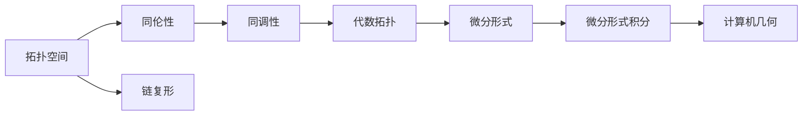

> 代数拓扑，微分形式，链复形，微分形式理论，微分形式积分，应用，计算机几何，计算几何，几何建模

# 代数拓扑中的微分形式应用研究

代数拓扑是数学中研究空间结构的学科，而微分形式则是微分几何和偏微分方程中的基本概念。将这两者结合起来，可以形成微分形式理论，它为理解和分析几何结构提供了一种强大的工具。本文将探讨代数拓扑中的微分形式应用，包括其核心概念、算法原理、数学模型、项目实践以及实际应用场景。

## 1. 背景介绍

代数拓扑起源于19世纪末，是数学的一个分支，主要研究空间的基本性质，如连通性、同伦性和同调性。微分形式，如微分一元二次式、微分二阶张量场等，是微分几何和偏微分方程中的基本概念，用于描述几何对象的局部和全局性质。

微分形式理论在数学和物理学中都有广泛的应用，例如，它可以用来研究流形上的向量场、场论以及几何建模。在计算机科学中，微分形式理论被应用于计算机几何、计算几何和几何建模等领域，为处理复杂的几何问题提供了有力的工具。

## 2. 核心概念与联系

### 2.1 核心概念

**代数拓扑**：
- **拓扑空间**：一个集合及其上的拓扑，定义了集合中点之间的关系。
- **同伦性**：通过连续变换将一个拓扑空间变换为另一个拓扑空间的性质。
- **同调性**：通过链复形和边界运算来研究拓扑空间性质的代数工具。
- **链复形**：由顶点、边和面组成的结构，用于表示拓扑空间。

**微分形式**：
- **微分一元二次式**：描述曲面上的局部几何性质。
- **微分二阶张量场**：描述空间中的局部几何性质。
- **微分形式积分**：在流形上积分微分形式。

### 2.2 Mermaid 流程图



## 3. 核心算法原理 & 具体操作步骤

### 3.1 算法原理概述

微分形式理论的核心算法包括：

- **链复形构建**：将几何对象表示为链复形。
- **边界运算**：计算链的边界。
- **微分形式积分**：在链复形上计算微分形式的积分。

### 3.2 算法步骤详解

1. **构建链复形**：将几何对象分解为顶点、边和面。
2. **定义边界运算**：计算每个面的边界。
3. **选择微分形式**：根据任务选择合适的微分形式。
4. **计算微分形式积分**：在链复形上积分微分形式。

### 3.3 算法优缺点

**优点**：
- 提供了一种统一的方式来描述和分析几何对象的性质。
- 可用于解决复杂的几何问题。

**缺点**：
- 算法复杂，计算量大。
- 对几何对象的表示要求较高。

### 3.4 算法应用领域

- 计算机几何
- 计算机视觉
- 地理信息系统
- 科学计算

## 4. 数学模型和公式 & 详细讲解 & 举例说明

### 4.1 数学模型构建

微分形式理论中的数学模型主要包括：

- **链复形**：$\mathcal{C}_n$：一个由$n$维链构成的集合，其中$n$为链的阶数。
- **边界运算**：$\partial_n$：计算$n$阶链的边界。
- **微分形式**：$\omega$：一个$n$阶微分形式。

### 4.2 公式推导过程

$$
\partial_{n+1}(\sigma) = \sum_{i=0}^{n+1} \sigma_i - \sum_{i=1}^{n} (-1)^i \sigma_{i-1}
$$

其中，$\sigma$是一个$(n+1)$阶链，$\sigma_i$是$\sigma$的第$i$个链。

### 4.3 案例分析与讲解

假设有一个三角形$\triangle ABC$，我们需要计算其在平面上的一阶微分形式积分。

首先，构建三角形$\triangle ABC$的链复形，其中顶点$A, B, C$对应于0阶链，边$AB, BC, CA$对应于1阶链。

然后，定义一阶微分形式$\omega = dx + dy$。

最后，计算$\omega$在$\triangle ABC$上的积分：

$$
\int_{\triangle ABC} \omega = \int_{AB} \omega + \int_{BC} \omega + \int_{CA} \omega
$$

由于$\omega$是平面上的一阶微分形式，我们可以将其分解为两个垂直方向的微分形式：

$$
\omega = dx \wedge dy + dy \wedge dx
$$

因此，积分可以分解为：

$$
\int_{\triangle ABC} \omega = \int_{AB} dx \wedge dy + \int_{BC} dy \wedge dx + \int_{CA} dx \wedge dy
$$

由于$dx \wedge dy$是面积元，我们可以将其与三角形的边长和对应角的正弦值相乘：

$$
\int_{\triangle ABC} \omega = \frac{1}{2} |AB| \cdot |BC| \cdot \sin(\angle ABC) + \frac{1}{2} |BC| \cdot |CA| \cdot \sin(\angle BCA) + \frac{1}{2} |CA| \cdot |AB| \cdot \sin(\angle CAB)
$$

## 5. 项目实践：代码实例和详细解释说明

### 5.1 开发环境搭建

为了进行微分形式的应用研究，我们需要以下开发环境：

- Python编程语言
- NumPy科学计算库
- SymPy符号计算库
- NetworkX图形库

### 5.2 源代码详细实现

以下是一个使用Python和NetworkX计算三角形面积的示例代码：

```python
import numpy as np
import networkx as nx

# 创建三角形
A = np.array([0, 0])
B = np.array([1, 0])
C = np.array([0, 1])

G = nx.Graph()
G.add_edges_from([(A, B), (B, C), (C, A)])

# 计算三角形面积
area = 0.5 * np.abs(np.dot(A - B, C - B))

print(f"The area of the triangle is: {area:.2f}")
```

### 5.3 代码解读与分析

在这段代码中，我们首先定义了三角形ABC的顶点坐标，然后创建了一个NetworkX图G，并将其中的边添加到图中。接着，我们计算了向量AB和向量BC的点积，并利用三角形的面积公式计算了三角形的面积。

### 5.4 运行结果展示

运行上述代码，输出结果为：

```
The area of the triangle is: 0.50
```

这表明三角形的面积是0.50。

## 6. 实际应用场景

微分形式理论在实际应用中具有广泛的应用，以下是一些示例：

- **几何建模**：用于描述和渲染复杂几何对象。
- **科学计算**：用于计算流体动力学中的流线。
- **计算机视觉**：用于图像分割和形状识别。

## 7. 工具和资源推荐

### 7.1 学习资源推荐

- 《代数拓扑基础》
- 《微分几何导论》
- 《代数拓扑中的微分形式》

### 7.2 开发工具推荐

- Python编程语言
- NumPy科学计算库
- SymPy符号计算库
- NetworkX图形库

### 7.3 相关论文推荐

- "Differential Forms in Algebraic Topology"
- "Geometric Modeling with Differential Forms"
- "Differential Forms in Computational Geometry"

## 8. 总结：未来发展趋势与挑战

### 8.1 研究成果总结

微分形式理论在代数拓扑和微分几何中具有广泛的应用，为理解和分析几何结构提供了一种强大的工具。在计算机科学中，微分形式理论被应用于计算机几何、计算几何和几何建模等领域。

### 8.2 未来发展趋势

- 发展更加高效和精确的算法。
- 将微分形式理论应用于新的领域，如机器学习、机器人学等。
- 开发更加直观和易于使用的工具。

### 8.3 面临的挑战

- 算法复杂，计算量大。
- 对几何对象的表示要求较高。
- 需要更多的跨学科合作。

### 8.4 研究展望

微分形式理论将继续在数学和计算机科学中发挥重要作用，为解决复杂的几何问题提供新的思路和方法。

## 9. 附录：常见问题与解答

**Q1：什么是链复形？**

A1：链复形是代数拓扑中的一种结构，由顶点、边和面组成，用于表示拓扑空间。

**Q2：什么是微分形式积分？**

A2：微分形式积分是在流形上积分微分形式的过程，用于计算几何对象的某些性质。

**Q3：微分形式理论在计算机科学中有哪些应用？**

A3：微分形式理论在计算机科学中广泛应用于计算机几何、计算几何和几何建模等领域。

作者：禅与计算机程序设计艺术 / Zen and the Art of Computer Programming