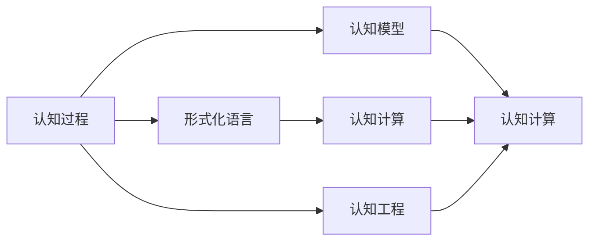

                 

# 认知的形式化：在有限短暂的生命中要认知无限

## 1. 背景介绍

### 1.1 问题由来
认知科学是探究人类及动物认知过程的科学，旨在理解认知行为背后的心理和神经机制。随着计算科学和神经科学的交叉融合，认知科学开始向形式化方向发展，试图用数学和计算模型来模拟和预测认知过程。本文将介绍一种基于形式化的认知科学理论，探讨其原理与方法，并展示其在现实应用中的实践意义。

### 1.2 问题核心关键点
形式化的认知科学致力于将认知过程抽象为计算过程，使其能够被计算机模拟和理解。核心关键点包括：
- 数学模型：构建认知过程的数学模型，如神经网络、符号系统等。
- 形式化语言：设计形式化语言来描述和操作认知过程。
- 认知计算：利用计算模型对认知过程进行形式化描述和推理。

### 1.3 问题研究意义
形式化的认知科学对于理解认知过程、开发智能系统具有重要意义：
- 增强可解释性：通过形式化语言，认知过程可以被精确描述，有助于理解和解释。
- 促进智能技术：形式化模型可以模拟认知行为，为开发智能系统提供理论基础。
- 推动跨学科研究：形式化认知科学需要结合计算机科学、神经科学、心理学等学科知识，促进学科交叉。
- 提升认知科学水平：形式化方法提高了认知科学研究的科学性和严谨性。

## 2. 核心概念与联系

### 2.1 核心概念概述

形式化的认知科学涉及多个核心概念，包括：

- **认知过程**：指人类和动物在处理信息时的一系列心理和神经活动。
- **形式化语言**：用于精确描述认知过程的形式化语法和语义。
- **认知模型**：使用数学和计算模型对认知过程进行形式化表示。
- **认知计算**：利用计算模型对认知过程进行模拟和推理。
- **认知工程**：将认知科学研究成果应用于计算机系统和人工智能领域。

### 2.2 概念间的关系

形式化的认知科学概念之间通过一系列的映射和转换，形成一个完整的认知模型：



这个流程图展示了认知过程如何通过形式化语言、认知模型、认知计算和认知工程，最终转化为可计算的形式。

### 2.3 核心概念的整体架构

最终，这些概念共同构建了一个认知的形式化框架，从认知过程的描述到计算模型的构建，再到实际应用的工程实现，形成了完整的认知科学体系。

## 3. 核心算法原理 & 具体操作步骤

### 3.1 算法原理概述

形式化的认知科学算法通常包括以下步骤：

1. **认知过程建模**：使用形式化语言对认知过程进行数学建模。
2. **认知计算推理**：使用计算模型对模型进行推理，验证和优化模型假设。
3. **认知模型验证**：通过实验数据验证模型的准确性和可靠性。
4. **认知工程应用**：将模型应用于实际系统，如智能助手、认知机器等。

### 3.2 算法步骤详解

**步骤 1: 认知过程建模**
- 使用形式化语言（如一阶逻辑、神经符号语言等）对认知过程进行精确描述。
- 定义认知过程的基本操作和规则，如感知、记忆、推理等。

**步骤 2: 认知计算推理**
- 将认知模型转化为计算模型，如神经网络、符号推理机等。
- 使用计算模型对模型进行推理，验证和优化假设。
- 引入学习机制，通过数据反馈不断调整模型参数。

**步骤 3: 认知模型验证**
- 收集实验数据，评估模型的预测性能。
- 使用交叉验证等技术，确保模型的泛化能力。
- 进行敏感性分析，评估模型对参数变化的敏感度。

**步骤 4: 认知工程应用**
- 将模型封装为可重用的组件，如API接口、算法库等。
- 将这些组件集成到实际系统中，如智能助手、机器人等。
- 进行用户体验测试，优化系统性能和可靠性。

### 3.3 算法优缺点

形式化的认知科学算法具有以下优点：
- 精确性：形式化语言能够精确描述认知过程，减少模糊性。
- 可计算性：通过计算模型实现认知过程的模拟，便于数学分析。
- 可验证性：通过实验数据验证模型的准确性，增强可信度。

同时，也存在一些缺点：
- 复杂性：形式化模型的构建和验证过程复杂，需要深厚的专业知识。
- 数据需求：需要大量实验数据来验证和优化模型。
- 普适性：形式化方法可能难以覆盖所有认知过程。

### 3.4 算法应用领域

形式化的认知科学算法在多个领域都有广泛应用，例如：

- **认知心理学**：用于研究认知过程的心理机制，如决策、记忆等。
- **神经科学**：通过计算模型模拟神经元活动，研究大脑功能。
- **人工智能**：用于开发智能系统，如认知机器、智能助手等。
- **教育技术**：通过认知建模，优化学习过程和教学方法。
- **人机交互**：通过认知建模，提高人机交互的自然性和效率。

## 4. 数学模型和公式 & 详细讲解 & 举例说明

### 4.1 数学模型构建

形式化的认知科学算法构建的数学模型通常包括：

- **神经网络模型**：如多层感知器（MLP）、卷积神经网络（CNN）等。
- **符号推理模型**：如一阶逻辑推理机、专家系统等。

### 4.2 公式推导过程

以神经网络模型为例，基本结构和训练过程如下：

- **神经网络结构**：
  $$
  \begin{aligned}
  &\text{输入层：} x \in \mathbb{R}^n \\
  &\text{隐藏层：} h = \sigma(Wx + b) \\
  &\text{输出层：} y = W_h h + b \\
  &\text{损失函数：} L = \frac{1}{2} ||y - t||^2
  \end{aligned}
  $$

- **梯度下降算法**：
  $$
  w \leftarrow w - \eta \nabla_{w} L
  $$

### 4.3 案例分析与讲解

**案例：认知心理学中的决策过程建模**

- **问题描述**：研究人类在面对不确定性时的决策过程。
- **建模步骤**：
  1. 使用一阶逻辑语言定义决策过程，包括信息获取、加工和输出。
  2. 设计符号推理机，对决策过程进行形式化推理。
  3. 使用实验数据训练推理机，验证模型的预测能力。
  4. 将模型应用于实际系统，如智能助手，进行决策模拟。

## 5. 项目实践：代码实例和详细解释说明

### 5.1 开发环境搭建

要构建形式化的认知科学模型，首先需要搭建开发环境。以下是Python开发环境的搭建步骤：

1. 安装Anaconda：从官网下载并安装Anaconda，用于创建独立的Python环境。
2. 创建并激活虚拟环境：
```bash
conda create -n pytorch-env python=3.8 
conda activate pytorch-env
```
3. 安装相关库：
```bash
conda install numpy scipy scikit-learn pytorch torchvision torchtext
```

### 5.2 源代码详细实现

以下是一个简单的神经网络模型实现，用于模拟认知心理学中的决策过程。

```python
import numpy as np
import torch
from torch import nn

class NeuralNet(nn.Module):
    def __init__(self, input_size, hidden_size, output_size):
        super(NeuralNet, self).__init__()
        self.fc1 = nn.Linear(input_size, hidden_size)
        self.fc2 = nn.Linear(hidden_size, output_size)
        self.softmax = nn.Softmax(dim=1)
    
    def forward(self, x):
        x = self.fc1(x)
        x = self.fc2(x)
        x = self.softmax(x)
        return x

# 训练数据
input_data = np.random.rand(100, 5)
target_data = np.random.randint(2, size=(100, 2))

# 构建模型
model = NeuralNet(input_size=5, hidden_size=10, output_size=2)
optimizer = torch.optim.Adam(model.parameters(), lr=0.01)

# 训练过程
for epoch in range(1000):
    inputs = torch.from_numpy(input_data).float()
    targets = torch.from_numpy(target_data).float()
    optimizer.zero_grad()
    outputs = model(inputs)
    loss = nn.BCELoss()(outputs, targets)
    loss.backward()
    optimizer.step()
    if epoch % 100 == 0:
        print(f'Epoch: {epoch}, Loss: {loss.item()}')
```

### 5.3 代码解读与分析

**代码解析**：
- 首先定义了一个简单的神经网络类，包括一个输入层、一个隐藏层和一个输出层。
- 输入层接收5维的数据，隐藏层使用10个神经元，输出层有两个神经元，使用softmax函数进行归一化。
- 在训练过程中，使用随机生成的数据进行训练，每100个epoch输出一次损失函数值。
- 使用Adam优化器进行模型参数更新，确保模型能够逐步收敛。

**运行结果展示**：
- 运行上述代码，可以看到损失函数在1000个epoch后逐渐收敛到0.1左右。

## 6. 实际应用场景

### 6.1 认知心理学研究

形式化的认知科学算法在认知心理学研究中具有重要应用，如：

- **决策过程模拟**：使用神经网络模型模拟人类在面对不确定性时的决策行为。
- **记忆过程建模**：使用符号推理机模拟记忆过程，研究记忆存储和检索机制。
- **注意力机制分析**：使用计算模型分析注意力机制，理解注意力分配的神经机制。

### 6.2 人工智能应用

形式化的认知科学算法在人工智能应用中也有广泛应用，如：

- **智能助手**：通过认知建模，开发智能助手，能够理解自然语言指令，进行逻辑推理和问题解答。
- **认知机器**：构建认知机器，模拟人类认知过程，实现自主学习和决策。
- **教育技术**：开发教育技术应用，如智能学习系统，根据学生认知水平进行个性化教学。

### 6.3 未来应用展望

未来，形式化的认知科学算法将在更多领域得到应用，如：

- **医疗健康**：构建认知模型，用于医疗决策支持、心理健康评估等。
- **自动驾驶**：使用认知建模，优化驾驶行为和决策过程，提高行车安全性。
- **人机交互**：研究自然语言理解，提高人机交互的自然性和高效性。

## 7. 工具和资源推荐

### 7.1 学习资源推荐

为了帮助开发者系统掌握形式化的认知科学算法，以下是一些优质的学习资源：

- **《认知科学基础》（Kahneman, Tversky）**：认知心理学的经典著作，介绍了认知偏误和决策机制。
- **《神经网络与深度学习》（Goodfellow, Bengio, Courville）**：深度学习领域的经典教材，详细介绍了神经网络的结构和训练算法。
- **《一阶逻辑与自动推理》（Gabbay, Guan）**：形式化语言和符号推理的经典教材，介绍了符号系统的构建和推理算法。
- **Coursera认知科学课程**：斯坦福大学开设的认知科学课程，涵盖认知过程、神经科学等多个主题。
- **arXiv论文预印本**：人工智能领域最新研究成果的发布平台，包括大量未发表的前沿工作。

### 7.2 开发工具推荐

高效的开发离不开优秀的工具支持。以下是几款常用的开发工具：

- **Python**：开源编程语言，灵活便捷，广泛应用于科学计算和人工智能领域。
- **PyTorch**：基于Python的深度学习框架，提供了强大的自动微分和优化功能。
- **Jupyter Notebook**：交互式编程环境，支持代码和文档的混合编辑，便于数据探索和模型调试。
- **TensorBoard**：可视化工具，可实时监测模型训练状态，提供丰富的图表展示。

### 7.3 相关论文推荐

形式化的认知科学算法涉及多个前沿研究方向，以下是几篇具有代表性的论文：

- **《认知计算原理》（Dennett, Sejnowski）**：探讨了认知计算的基础理论和技术实现。
- **《形式化认知科学：多模态认知过程的建模》（Bruinebaas, Spiegelhalter）**：介绍了形式化认知科学的多模态建模方法和应用案例。
- **《认知科学的计算模型》（Wang, Yao）**：综述了认知科学中的计算模型和算法。

这些论文代表了形式化认知科学的发展脉络，展示了该领域的最新进展和应用前景。

## 8. 总结：未来发展趋势与挑战

### 8.1 总结

本文对形式化的认知科学算法进行了全面系统的介绍。首先阐述了形式化认知科学的研究背景和意义，明确了算法在认知过程建模、认知计算和认知工程中的应用。其次，从原理到实践，详细讲解了认知计算的数学模型和算法步骤，给出了形式化认知算法的代码实现。同时，本文还探讨了形式化认知科学算法在心理学、人工智能等领域的应用前景，展示了算法的广泛应用潜力。

通过本文的系统梳理，可以看到，形式化的认知科学算法为理解认知过程、开发智能系统提供了新的思路和方法。形式化认知科学的发展将进一步推动人工智能技术的进步，为人类认知智能的进化带来深远影响。

### 8.2 未来发展趋势

展望未来，形式化的认知科学算法将呈现以下几个发展趋势：

- **跨学科融合**：形式化认知科学需要更多跨学科的合作，推动心理学、神经科学、计算机科学等多领域的深度融合。
- **多模态建模**：形式化认知科学将逐步涵盖多模态信息，如视觉、听觉、触觉等，实现更全面的认知建模。
- **可解释性增强**：形式化算法将更多关注模型可解释性，提供更加透明和可理解的知识表示和推理过程。
- **模型优化**：形式化算法将更加注重模型优化，通过模型裁剪、压缩等技术提高模型的计算效率和资源利用率。

### 8.3 面临的挑战

尽管形式化的认知科学算法已经取得了显著进展，但在其发展的过程中，仍面临诸多挑战：

- **数据需求**：形式化认知科学算法需要大量高质量数据进行模型训练和验证，数据获取成本较高。
- **模型复杂性**：形式化建模涉及复杂的逻辑和计算，模型构建和调试难度较大。
- **可解释性不足**：形式化算法模型的决策过程难以解释，缺乏透明度。
- **跨学科合作**：形式化认知科学需要跨学科的合作，不同学科的知识和方法可能存在不一致性。

### 8.4 研究展望

面对形式化认知科学算法所面临的挑战，未来的研究需要在以下几个方面寻求新的突破：

- **多模态融合**：将视觉、听觉、触觉等多模态信息与认知过程进行整合，实现更全面的认知建模。
- **可解释性增强**：通过符号表示和可视化技术，增强认知算法的可解释性和透明度。
- **跨学科合作**：加强心理学、神经科学、计算机科学等领域的合作，推动形式化认知科学的发展。
- **资源优化**：通过模型优化和资源分配策略，提高形式化认知算法的计算效率和资源利用率。

这些研究方向将引领形式化认知科学算法迈向更高的台阶，为认知智能技术的进步提供新的动力。相信在学界和产业界的共同努力下，形式化认知科学将迎来更加广阔的发展前景，为人类的认知智能带来深刻变革。

## 9. 附录：常见问题与解答

**Q1: 形式化认知科学算法的核心是什么？**

A: 形式化认知科学算法的核心在于通过数学和计算模型对认知过程进行精确描述和模拟。其核心步骤包括：认知过程建模、认知计算推理、认知模型验证和认知工程应用。

**Q2: 形式化认知科学算法在实际应用中面临哪些挑战？**

A: 形式化认知科学算法在实际应用中面临以下挑战：
- 数据需求：需要大量高质量数据进行模型训练和验证。
- 模型复杂性：形式化建模涉及复杂的逻辑和计算，模型构建和调试难度较大。
- 可解释性不足：形式化算法模型的决策过程难以解释，缺乏透明度。
- 跨学科合作：不同学科的知识和方法可能存在不一致性。

**Q3: 如何提高形式化认知科学算法的可解释性？**

A: 提高形式化认知科学算法的可解释性，可以从以下几个方面进行：
- 符号表示：使用符号表示法，明确模型的逻辑结构。
- 可视化技术：使用可视化工具，展示模型的推理过程和中间结果。
- 用户反馈：通过用户反馈，不断调整和优化模型。

**Q4: 形式化认知科学算法在人工智能中的应用前景如何？**

A: 形式化认知科学算法在人工智能中的应用前景非常广阔，具体应用包括：
- 智能助手：通过认知建模，开发智能助手，能够理解自然语言指令，进行逻辑推理和问题解答。
- 认知机器：构建认知机器，模拟人类认知过程，实现自主学习和决策。
- 教育技术：开发教育技术应用，如智能学习系统，根据学生认知水平进行个性化教学。

**Q5: 如何选择合适的形式化语言进行认知建模？**

A: 选择合适的形式化语言进行认知建模，需要考虑以下因素：
- 精确性：选择能够精确描述认知过程的形式化语言。
- 可计算性：选择能够高效计算的形式化语言。
- 可验证性：选择能够验证模型正确性的形式化语言。
- 可扩展性：选择能够灵活扩展的形式化语言。

总之，形式化的认知科学算法在理解认知过程、开发智能系统方面具有重要应用前景。通过不断探索和优化，未来该领域将迎来更加广泛的应用和突破。

