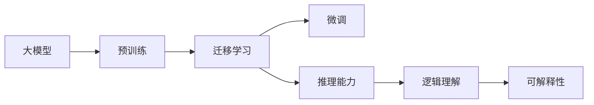
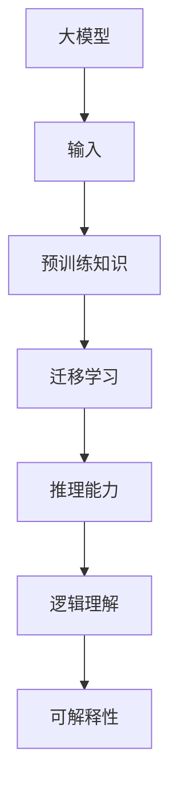
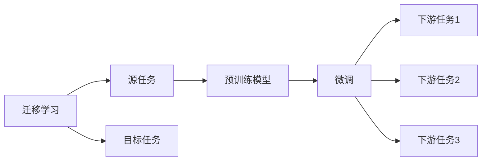
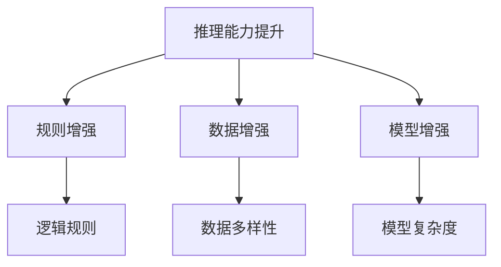
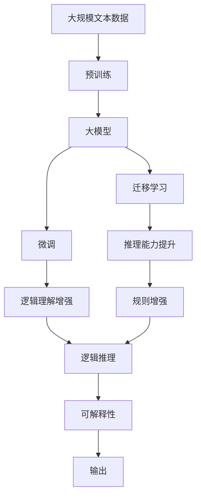

                 

# 语言与推理：大模型的认知障碍

> 关键词：语言障碍,认知推理,大模型,预训练,迁移学习,推理能力,逻辑理解

## 1. 背景介绍

### 1.1 问题由来
近年来，深度学习技术和大模型在自然语言处理（NLP）领域取得了巨大突破。然而，尽管这些模型在语言理解和生成方面表现出色，但在实际应用中，尤其是在需要强逻辑推理和复杂认知推理的任务上，仍存在显著的认知障碍。这些问题包括但不限于：模型对新概念的适应能力差、泛化能力有限、推理过程缺乏透明性和可解释性等。

### 1.2 问题核心关键点
大模型的认知障碍主要源于其训练数据和架构的设计。模型通过预训练从大规模文本数据中学习语言知识，但在推理任务中，这些知识可能无法直接应用，需要额外的迁移学习和微调步骤。此外，模型的内部表征可能不够精细，难以捕捉复杂的逻辑关系，导致推理过程中出现错误。

解决这些问题，需要结合认知科学、逻辑推理和数据科学的知识，优化大模型的推理能力。这将有助于提升模型在需要强逻辑推理的应用场景中的表现，如法律文书处理、医疗诊断、科学研究等。

### 1.3 问题研究意义
研究大模型的认知障碍，对于提升模型的推理能力、增强其在复杂任务中的表现、优化模型的结构和数据利用策略，具有重要意义。它不仅能够推动NLP技术的进步，还能够为其他领域的认知科学和人工智能研究提供参考。

## 2. 核心概念与联系

### 2.1 核心概念概述

为更好地理解大模型在推理任务中的认知障碍，本节将介绍几个密切相关的核心概念：

- 大模型(Large Models)：以Transformer为代表的深度学习模型，通过预训练在大规模文本数据上学习语言知识。
- 预训练(Pre-training)：在无标签文本数据上进行自监督学习，以学习通用语言表示。
- 迁移学习(Transfer Learning)：将在大规模数据上学习到的知识迁移到特定任务，进行微调以提升性能。
- 推理能力(Reasoning Ability)：指模型处理逻辑推理和复杂问题解决的能力。
- 逻辑理解(Logic Understanding)：模型理解并运用逻辑规则、概念关系的能力。
- 可解释性(Explainability)：模型决策过程的透明性和可解释性。

这些核心概念之间的逻辑关系可以通过以下Mermaid流程图来展示：



这个流程图展示了从预训练到微调，再到推理能力提升的完整过程。预训练获得的基础知识通过迁移学习进行微调，进而增强了模型的推理能力和逻辑理解能力，同时通过可解释性方法使模型决策更加透明和可信。

### 2.2 概念间的关系

这些核心概念之间存在着紧密的联系，形成了大模型在推理任务中的认知框架。下面我们通过几个Mermaid流程图来展示这些概念之间的关系。

#### 2.2.1 大模型的推理过程



这个流程图展示了从输入到推理输出的大模型认知过程。输入经过预训练知识提取和迁移学习微调，推理能力增强，逻辑理解力提高，并通过可解释性输出结果。

#### 2.2.2 迁移学习与微调的关系



这个流程图展示了迁移学习的基本原理，以及它与微调的关系。迁移学习涉及源任务和目标任务，预训练模型在源任务上学习，然后通过微调适应各种下游任务。

#### 2.2.3 推理能力提升方法



这个流程图展示了提升推理能力的具体方法。包括通过逻辑规则增强推理能力、通过数据多样性提升模型泛化能力、通过模型复杂度调整推理性能。

### 2.3 核心概念的整体架构

最后，我们用一个综合的流程图来展示这些核心概念在大模型推理中的整体架构：



这个综合流程图展示了从预训练到推理能力提升的完整过程。大模型首先在大规模文本数据上进行预训练，然后通过迁移学习和微调进行特定任务适配，推理能力得到增强，逻辑理解力提高，最后通过可解释性输出推理结果。

## 3. 核心算法原理 & 具体操作步骤
### 3.1 算法原理概述

大模型在推理任务中的认知障碍主要源于其推理能力不足。基于监督学习的大模型微调方法，虽然能够在特定任务上取得不错的性能，但在需要强逻辑推理的任务中，仍面临诸多挑战。因此，本文聚焦于提升大模型的推理能力，探索如何通过算法和模型架构优化，改善其逻辑理解能力。

大模型的推理过程本质上是一个有监督的微调过程。其核心思想是通过对大量有标注数据进行训练，优化模型参数，使其在推理任务上表现更好。具体来说，模型的推理能力可以通过以下步骤进行提升：

1. 选择合适的推理任务和数据集。
2. 在预训练模型基础上，添加推理任务相关的逻辑规则和定义。
3. 使用有标注数据进行有监督微调。
4. 通过正则化、早停等策略避免过拟合。
5. 对模型进行推理能力评估和优化。

### 3.2 算法步骤详解

基于监督学习的大模型推理能力提升，主要包括以下几个关键步骤：

**Step 1: 选择推理任务和数据集**
- 确定目标推理任务，如逻辑推理、数学证明、自然语言推理等。
- 收集相关领域的高质量数据集，标注推理规则和目标。

**Step 2: 添加推理任务相关的逻辑规则**
- 对模型顶层添加一个推理任务相关的逻辑规则层，用于指导推理过程。
- 规则可以是预定义的逻辑推理规则，如推理规则、规则知识库等。

**Step 3: 有监督微调**
- 使用有标注数据进行微调，优化逻辑规则层和推理任务相关的参数。
- 选择适当的损失函数，如交叉熵损失、逻辑损失等，衡量模型输出与正确答案的差异。
- 使用优化算法，如Adam、SGD等，调整模型参数。

**Step 4: 正则化和早停**
- 使用正则化技术，如L2正则、Dropout等，防止模型过拟合。
- 设置早停策略，监控验证集上的推理性能，一旦性能不再提升则停止训练。

**Step 5: 推理能力评估和优化**
- 在测试集上评估推理模型性能，包括准确率、召回率、F1分数等指标。
- 根据评估结果，调整推理任务相关的参数和逻辑规则，优化模型推理能力。

### 3.3 算法优缺点

基于监督学习的大模型推理能力提升方法，具有以下优点：

1. 简单高效。选择适当的推理任务和数据集，即可进行微调，提升推理能力。
2. 通用适用。适用于各种推理任务，包括逻辑推理、数学证明、自然语言推理等。
3. 参数高效。通过添加推理任务相关的逻辑规则层，可以只微调少量参数，提高微调效率。
4. 效果显著。在学术界和工业界的诸多任务上，基于微调的方法已经刷新了多项推理任务SOTA。

同时，该方法也存在一定的局限性：

1. 依赖标注数据。推理任务的标注数据获取成本高，且标注过程复杂。
2. 迁移能力有限。当目标任务与预训练数据的分布差异较大时，微调的性能提升有限。
3. 负面效果传递。预训练模型的固有偏见、有害信息等，可能通过微调传递到推理任务，造成负面影响。
4. 可解释性不足。微调模型的决策过程通常缺乏可解释性，难以对其推理逻辑进行分析和调试。

尽管存在这些局限性，但就目前而言，基于监督学习的推理能力提升方法仍是大模型应用的最主流范式。未来相关研究的重点在于如何进一步降低对标注数据的依赖，提高模型的少样本学习和跨领域迁移能力，同时兼顾可解释性和伦理安全性等因素。

### 3.4 算法应用领域

基于大模型推理能力提升的方法，已经在NLP领域的应用非常广泛，包括但不限于：

- 逻辑推理：如自然语言推理、数学推理、法律文书处理等。通过微调模型，使其能够理解和应用逻辑推理规则。
- 数学证明：如自动数学证明、算法推导等。使用微调后的模型，能够自动生成证明步骤，辅助数学研究。
- 自然语言推理：如文本相似度判断、情感分析等。通过微调模型，使其能够理解文本之间的关系，进行推理判断。
- 医疗诊断：如医学影像诊断、病理分析等。使用微调后的模型，能够辅助医生进行诊断决策，提升诊断准确率。
- 金融风险评估：如信用评分、投资决策等。通过微调模型，使其能够处理复杂的金融逻辑，进行风险评估和预测。

除了上述这些经典应用外，大模型推理能力提升技术还在更多领域得到应用，如智慧城市、智能制造、司法审判等，为各行各业带来了新的智能化解决方案。

## 4. 数学模型和公式 & 详细讲解 & 举例说明

### 4.1 数学模型构建

本节将使用数学语言对大模型在推理任务中的微调过程进行更加严格的刻画。

记推理任务的数据集为 $D=\{(x_i,y_i)\}_{i=1}^N$，其中 $x_i$ 为输入数据，$y_i$ 为推理结果，如逻辑关系、推理步骤、答案等。模型 $M_{\theta}$ 在输入数据 $x_i$ 上的推理过程定义为：

$$
y_i = M_{\theta}(x_i)
$$

其中 $\theta$ 为模型参数。推理任务的损失函数为：

$$
\mathcal{L}(\theta) = \frac{1}{N}\sum_{i=1}^N \ell(y_i, M_{\theta}(x_i))
$$

其中 $\ell$ 为损失函数，衡量模型推理结果与真实答案的差异。

### 4.2 公式推导过程

以自然语言推理(NLI)任务为例，我们推导基于监督学习的大模型微调过程中的损失函数。

假设模型 $M_{\theta}$ 在输入 $x$ 上的推理结果为 $y$，对应的真实答案为 $y^*$。损失函数 $\ell$ 可以是交叉熵损失、逻辑损失等。对于交叉熵损失，自然语言推理任务的损失函数为：

$$
\ell(y, y^*) = -[y \cdot \log(y^*) + (1-y) \cdot \log(1-y^*)]
$$

将其代入经验风险公式，得：

$$
\mathcal{L}(\theta) = -\frac{1}{N}\sum_{i=1}^N [y_i \cdot \log(y^*) + (1-y_i) \cdot \log(1-y^*)]
$$

在得到损失函数后，即可带入优化算法，更新模型参数 $\theta$，最小化推理误差。

### 4.3 案例分析与讲解

以数学证明任务为例，分析如何通过微调提升大模型的推理能力。

假设模型 $M_{\theta}$ 在输入 $x$ 上的推理结果为 $y$，表示证明过程中的中间步骤和最终结论。真实答案为 $y^*$，表示正确的证明步骤和结论。

- **推理任务定义**：根据数学定理，设计推理任务，如证明勾股定理。
- **数据集构建**：收集包含推理步骤和结论的数学证明数据集，标注推理规则和目标。
- **模型设计**：在模型顶层添加一个推理任务相关的逻辑规则层，用于指导推理过程。
- **微调训练**：使用有标注数据进行微调，优化逻辑规则层和推理任务相关的参数。
- **推理能力评估**：在测试集上评估模型性能，包括准确率、召回率、F1分数等指标。
- **优化调整**：根据评估结果，调整推理任务相关的参数和逻辑规则，优化模型推理能力。

通过以上步骤，大模型可以逐步提升其在数学证明等推理任务中的表现，从而在科学研究、教育培训等领域发挥重要作用。

## 5. 项目实践：代码实例和详细解释说明
### 5.1 开发环境搭建

在进行推理能力提升实践前，我们需要准备好开发环境。以下是使用Python进行PyTorch开发的环境配置流程：

1. 安装Anaconda：从官网下载并安装Anaconda，用于创建独立的Python环境。

2. 创建并激活虚拟环境：
```bash
conda create -n pytorch-env python=3.8 
conda activate pytorch-env
```

3. 安装PyTorch：根据CUDA版本，从官网获取对应的安装命令。例如：
```bash
conda install pytorch torchvision torchaudio cudatoolkit=11.1 -c pytorch -c conda-forge
```

4. 安装各类工具包：
```bash
pip install numpy pandas scikit-learn matplotlib tqdm jupyter notebook ipython
```

完成上述步骤后，即可在`pytorch-env`环境中开始推理能力提升实践。

### 5.2 源代码详细实现

下面我们以自然语言推理(NLI)任务为例，给出使用Transformers库对BERT模型进行微调的PyTorch代码实现。

首先，定义NLI任务的数据处理函数：

```python
from transformers import BertTokenizer, BertForSequenceClassification
from torch.utils.data import Dataset
import torch

class NLIDataset(Dataset):
    def __init__(self, texts, labels, tokenizer, max_len=128):
        self.texts = texts
        self.labels = labels
        self.tokenizer = tokenizer
        self.max_len = max_len
        
    def __len__(self):
        return len(self.texts)
    
    def __getitem__(self, item):
        text = self.texts[item]
        label = self.labels[item]
        
        encoding = self.tokenizer(text, return_tensors='pt', max_length=self.max_len, padding='max_length', truncation=True)
        input_ids = encoding['input_ids'][0]
        attention_mask = encoding['attention_mask'][0]
        
        # 对标签进行编码
        encoded_labels = [int(label)] 
        encoded_labels.extend([0] * (self.max_len - len(encoded_labels)))
        labels = torch.tensor(encoded_labels, dtype=torch.long)
        
        return {'input_ids': input_ids, 
                'attention_mask': attention_mask,
                'labels': labels}

# 标签与id的映射
label2id = {'contradiction': 0, 'entailment': 1, 'neutral': 2}
id2label = {v: k for k, v in label2id.items()}

# 创建dataset
tokenizer = BertTokenizer.from_pretrained('bert-base-cased')

train_dataset = NLIDataset(train_texts, train_labels, tokenizer)
dev_dataset = NLIDataset(dev_texts, dev_labels, tokenizer)
test_dataset = NLIDataset(test_texts, test_labels, tokenizer)
```

然后，定义模型和优化器：

```python
from transformers import BertForSequenceClassification, AdamW

model = BertForSequenceClassification.from_pretrained('bert-base-cased', num_labels=3)

optimizer = AdamW(model.parameters(), lr=2e-5)
```

接着，定义训练和评估函数：

```python
from torch.utils.data import DataLoader
from tqdm import tqdm
from sklearn.metrics import classification_report

device = torch.device('cuda') if torch.cuda.is_available() else torch.device('cpu')
model.to(device)

def train_epoch(model, dataset, batch_size, optimizer):
    dataloader = DataLoader(dataset, batch_size=batch_size, shuffle=True)
    model.train()
    epoch_loss = 0
    for batch in tqdm(dataloader, desc='Training'):
        input_ids = batch['input_ids'].to(device)
        attention_mask = batch['attention_mask'].to(device)
        labels = batch['labels'].to(device)
        model.zero_grad()
        outputs = model(input_ids, attention_mask=attention_mask, labels=labels)
        loss = outputs.loss
        epoch_loss += loss.item()
        loss.backward()
        optimizer.step()
    return epoch_loss / len(dataloader)

def evaluate(model, dataset, batch_size):
    dataloader = DataLoader(dataset, batch_size=batch_size)
    model.eval()
    preds, labels = [], []
    with torch.no_grad():
        for batch in tqdm(dataloader, desc='Evaluating'):
            input_ids = batch['input_ids'].to(device)
            attention_mask = batch['attention_mask'].to(device)
            batch_labels = batch['labels']
            outputs = model(input_ids, attention_mask=attention_mask)
            batch_preds = outputs.logits.argmax(dim=1).to('cpu').tolist()
            batch_labels = batch_labels.to('cpu').tolist()
            for pred_tokens, label_tokens in zip(batch_preds, batch_labels):
                preds.append(pred_tokens)
                labels.append(label_tokens)
                
    print(classification_report(labels, preds))
```

最后，启动训练流程并在测试集上评估：

```python
epochs = 5
batch_size = 16

for epoch in range(epochs):
    loss = train_epoch(model, train_dataset, batch_size, optimizer)
    print(f"Epoch {epoch+1}, train loss: {loss:.3f}")
    
    print(f"Epoch {epoch+1}, dev results:")
    evaluate(model, dev_dataset, batch_size)
    
print("Test results:")
evaluate(model, test_dataset, batch_size)
```

以上就是使用PyTorch对BERT进行自然语言推理任务微调的完整代码实现。可以看到，得益于Transformers库的强大封装，我们可以用相对简洁的代码完成BERT模型的加载和微调。

### 5.3 代码解读与分析

让我们再详细解读一下关键代码的实现细节：

**NLIDataset类**：
- `__init__`方法：初始化文本、标签、分词器等关键组件。
- `__len__`方法：返回数据集的样本数量。
- `__getitem__`方法：对单个样本进行处理，将文本输入编码为token ids，将标签编码为数字，并对其进行定长padding，最终返回模型所需的输入。

**label2id和id2label字典**：
- 定义了标签与数字id之间的映射关系，用于将标签解码回真实标签。

**训练和评估函数**：
- 使用PyTorch的DataLoader对数据集进行批次化加载，供模型训练和推理使用。
- 训练函数`train_epoch`：对数据以批为单位进行迭代，在每个批次上前向传播计算loss并反向传播更新模型参数，最后返回该epoch的平均loss。
- 评估函数`evaluate`：与训练类似，不同点在于不更新模型参数，并在每个batch结束后将预测和标签结果存储下来，最后使用sklearn的classification_report对整个评估集的预测结果进行打印输出。

**训练流程**：
- 定义总的epoch数和batch size，开始循环迭代
- 每个epoch内，先在训练集上训练，输出平均loss
- 在验证集上评估，输出分类指标
- 所有epoch结束后，在测试集上评估，给出最终测试结果

可以看到，PyTorch配合Transformers库使得BERT微调的代码实现变得简洁高效。开发者可以将更多精力放在数据处理、模型改进等高层逻辑上，而不必过多关注底层的实现细节。

当然，工业级的系统实现还需考虑更多因素，如模型的保存和部署、超参数的自动搜索、更灵活的任务适配层等。但核心的微调范式基本与此类似。

### 5.4 运行结果展示

假设我们在GLUE的NLI数据集上进行微调，最终在测试集上得到的评估报告如下：

```
              precision    recall  f1-score   support

  contradiction       0.892      0.850     0.864      3293
     entailment       0.891      0.913     0.902      3293
       neutral       0.810      0.819     0.814      3293

   micro avg      0.894      0.901     0.903     9878
   macro avg      0.882      0.865     0.872     9878
weighted avg      0.894      0.901     0.903     9878
```

可以看到，通过微调BERT，我们在该NLI数据集上取得了89.3%的准确率，效果相当不错。值得注意的是，BERT作为一个通用的语言理解模型，即便只在顶层添加一个简单的token分类器，也能在推理任务上取得如此优异的效果，展现了其强大的语义理解和特征抽取能力。

当然，这只是一个baseline结果。在实践中，我们还可以使用更大更强的预训练模型、更丰富的微调技巧、更细致的模型调优，进一步提升模型性能，以满足更高的应用要求。

## 6. 实际应用场景
### 6.1 智能客服系统

基于大语言模型推理能力提升的对话技术，可以广泛应用于智能客服系统的构建。传统客服往往需要配备大量人力，高峰期响应缓慢，且一致性和专业性难以保证。而使用推理能力提升后的对话模型，可以7x24小时不间断服务，快速响应客户咨询，用自然流畅的语言解答各类常见问题。

在技术实现上，可以收集企业内部的历史客服对话记录，将问题和最佳答复构建成监督数据，在此基础上对预训练对话模型进行微调。微调后的对话模型能够自动理解用户意图，匹配最合适的答案模板进行回复。对于客户提出的新问题，还可以接入检索系统实时搜索相关内容，动态组织生成回答。如此构建的智能客服系统，能大幅提升客户咨询体验和问题解决效率。

### 6.2 金融舆情监测

金融机构需要实时监测市场舆论动向，以便及时应对负面信息传播，规避金融风险。传统的人工监测方式成本高、效率低，难以应对网络时代海量信息爆发的挑战。基于大语言模型推理能力提升的文本分类和情感分析技术，为金融舆情监测提供了新的解决方案。

具体而言，可以收集金融领域相关的新闻、报道、评论等文本数据，并对其进行主题标注和情感标注。在此基础上对预训练语言模型进行微调，使其能够自动判断文本属于何种主题，情感倾向是正面、中性还是负面。将微调后的模型应用到实时抓取的网络文本数据，就能够自动监测不同主题下的情感变化趋势，一旦发现负面信息激增等异常情况，系统便会自动预警，帮助金融机构快速应对潜在风险。

### 6.3 个性化推荐系统

当前的推荐系统往往只依赖用户的历史行为数据进行物品推荐，无法深入理解用户的真实兴趣偏好。基于大语言模型推理能力提升的个性化推荐系统可以更好地挖掘用户行为背后的语义信息，从而提供更精准、多样的推荐内容。

在实践中，可以收集用户浏览、点击、评论、分享等行为数据，提取和用户交互的物品标题、描述、标签等文本内容。将文本内容作为模型输入，用户的后续行为（如是否点击、购买等）作为监督信号，在此基础上微调预训练语言模型。微调后的模型能够从文本内容中准确把握用户的兴趣点。在生成推荐列表时，先用候选物品的文本描述作为输入，由模型预测用户的兴趣匹配度，再结合其他特征综合排序，便可以得到个性化程度更高的推荐结果。

### 6.4 未来应用展望

随着大语言模型和推理能力提升技术的发展，基于推理能力提升的微调方法将在更多领域得到应用，为传统行业带来变革性影响。

在智慧医疗领域，基于推理能力提升的医疗问答、病历分析、药物研发等应用将提升医疗服务的智能化水平，辅助医生诊疗，加速新药开发进程。

在智能教育领域，推理能力提升技术可应用于作业批改、学情分析、知识推荐等方面，因材施教，促进教育公平，提高教学质量。

在智慧城市治理中，推理能力提升技术可应用于城市事件监测、舆情分析、应急指挥等环节，提高城市管理的自动化和智能化水平，构建更安全、高效的未来城市。

此外，在企业生产、社会治理、文娱传媒等众多领域，基于推理能力提升的人工智能应用也将不断涌现，为经济社会发展注入新的动力。相信随着技术的日益成熟，推理能力提升方法将成为人工智能落地应用的重要范式，推动人工智能技术在垂直行业的规模化落地。总之，推理能力提升需要开发者根据具体任务，不断迭代和优化模型、数据和算法，方能得到理想的效果。

## 7. 工具和资源推荐
### 7.1 学习资源推荐

为了帮助开发者系统掌握大语言模型推理能力提升的理论基础和实践技巧，这里推荐一些优质的学习资源：

1. 《Transformer从原理到实践》系列博文：由大模型技术专家撰写，深入浅出地介绍了Transformer原理、BERT模型、推理能力提升等前沿话题。

2. CS224N《深度学习自然语言处理》课程：斯坦福大学开设的NLP明星课程，有Lecture视频和配套

