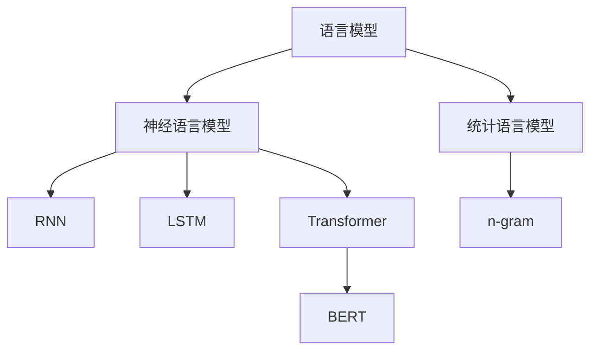
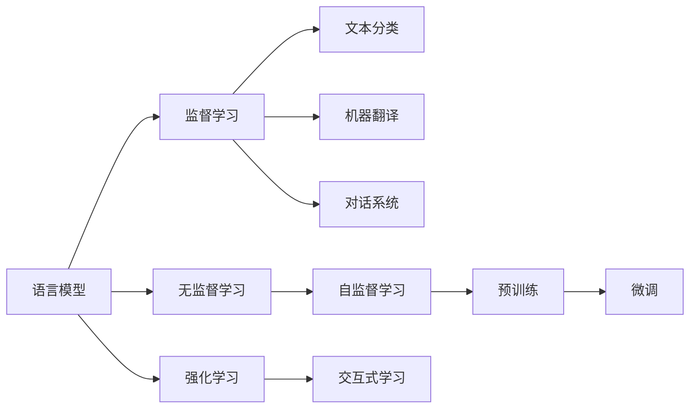
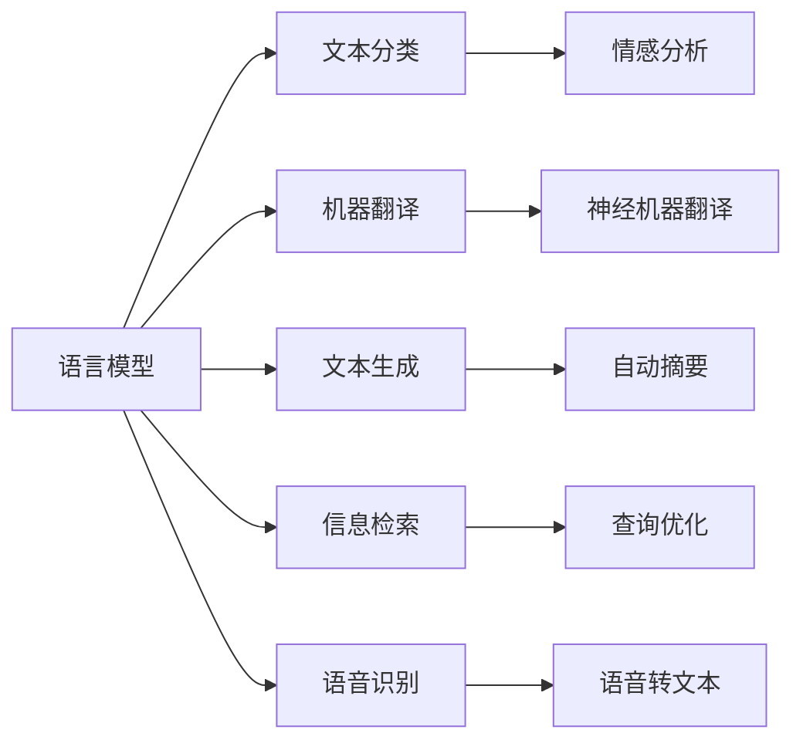
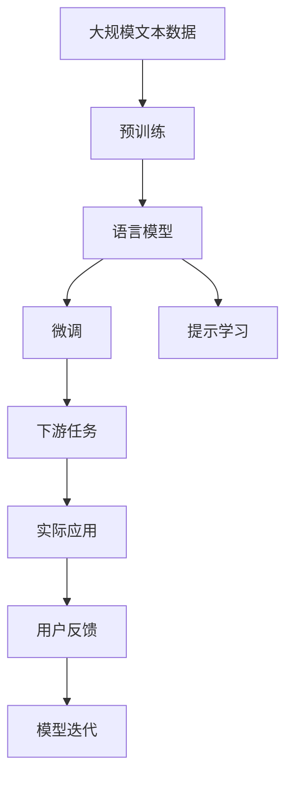

                 

# 语言模型 原理与代码实例讲解

> 关键词：语言模型,Transformer,BERT,预训练,代码实例

## 1. 背景介绍

### 1.1 问题由来
语言模型（Language Model）是自然语言处理（NLP）中最重要的基本组件之一，用于预测一段文本的概率。语言模型可以用于文本生成、机器翻译、信息检索、语音识别等多个NLP任务中，是构建智能系统不可或缺的一部分。

随着深度学习技术的发展，语言模型已经从简单的统计语言模型（如n-gram模型）演进到基于神经网络的深度语言模型。其中，基于Transformer架构的模型（如BERT、GPT）因为其高效的并行计算能力和强大的语义理解能力，成为目前NLP领域的引领者。

本文旨在从原理到实践，全面介绍语言模型的构建、训练和应用，并提供代码实例，帮助读者深入理解这一核心NLP技术。

### 1.2 问题核心关键点
本文将深入探讨以下几个关键问题：
1. 语言模型的基本原理和工作机制。
2. 基于Transformer的语言模型的构建和训练。
3. 语言模型的应用场景和实际部署。
4. 语言模型在工业界的最新进展和趋势。

这些问题的回答将帮助读者全面掌握语言模型的知识，并能够在实际项目中灵活应用。

### 1.3 问题研究意义
语言模型的研究对于推进自然语言处理技术的发展具有重要意义。语言模型的准确性和鲁棒性直接影响着NLP系统的性能。准确的语言模型能够提供更符合语法和语义的文本生成和翻译，从而提升用户体验和系统的自动化程度。

此外，语言模型在智能客服、智能写作、智能推荐等多个领域都有广泛的应用，这些应用极大地提高了工作效率和用户满意度。因此，研究语言模型，提升其性能和泛化能力，对推动NLP技术产业化进程具有重要价值。

## 2. 核心概念与联系

### 2.1 核心概念概述

为更好地理解语言模型的原理和工作机制，我们首先介绍几个关键概念：

- 语言模型：用于预测一段文本序列的概率分布。通常用条件概率 $P(w_{1:T})$ 表示，其中 $T$ 表示文本的长度。
- 统计语言模型：基于文本的统计分布来建模语言的模型，如n-gram模型。
- 神经语言模型：使用神经网络来建模语言的模型，如RNN、LSTM、Transformer等。
- Transformer：一种基于自注意力机制的神经网络架构，能够高效地建模长距离依赖关系。
- BERT：基于Transformer架构的预训练语言模型，能够学习丰富的语义表示，广泛应用于各种NLP任务。

这些核心概念之间的关系可以通过以下Mermaid流程图来展示：



这个流程图展示了语言模型和其重要子概念的关系：

1. 语言模型是从统计语言模型演进而来的。
2. 统计语言模型中，n-gram模型是最基础的形式。
3. 神经语言模型引入了神经网络架构，如RNN、LSTM等。
4. 最新的Transformer架构进一步提升了神经语言模型的性能。
5. BERT作为基于Transformer的预训练语言模型，代表了神经语言模型最新的发展方向。

### 2.2 概念间的关系

这些核心概念之间存在着紧密的联系，构成了语言模型从原理到实践的完整框架。下面通过几个Mermaid流程图来展示这些概念之间的关系：

#### 2.2.1 语言模型的学习范式



这个流程图展示了语言模型的学习范式：

1. 语言模型可以通过监督学习、无监督学习和强化学习等不同方式进行训练。
2. 监督学习通常用于文本分类、机器翻译等有标签的任务。
3. 无监督学习（如自监督学习）常用于预训练模型，以获得通用的语言表示。
4. 强化学习可以用于训练对话系统等交互式应用。
5. 预训练和微调是语言模型训练的重要步骤。

#### 2.2.2 语言模型的应用场景



这个流程图展示了语言模型在不同NLP任务中的应用场景：

1. 语言模型可以用于文本分类、机器翻译、文本生成等任务。
2. 文本分类常用于情感分析、主题分类等。
3. 机器翻译中，语言模型常用于解码器。
4. 文本生成中，语言模型常用于文本生成模型（如GPT）。
5. 信息检索中，语言模型常用于构建检索系统。
6. 语音识别中，语言模型常用于语音转文本的前置步骤。

### 2.3 核心概念的整体架构

最后，我们用一个综合的流程图来展示语言模型从预训练到微调，再到实际应用的完整过程：



这个综合流程图展示了从预训练到微调，再到持续学习的完整过程：

1. 语言模型首先在大规模文本数据上进行预训练，学习通用的语言表示。
2. 预训练后的模型通过微调适配特定任务，提升其在特定任务上的性能。
3. 微调后的模型通过提示学习等方式实现零样本或少样本学习。
4. 模型在实际应用中接收用户反馈，不断迭代和优化，以适应新的应用场景。

通过这些流程图，我们可以更清晰地理解语言模型的核心概念及其之间的关系，为后续深入讨论具体的训练方法和技术奠定基础。

## 3. 核心算法原理 & 具体操作步骤
### 3.1 算法原理概述

语言模型的核心任务是预测一段文本序列的概率，形式化地表示为：

$$ P(w_{1:T}) = \prod_{i=1}^T P(w_i | w_{1:i-1}) $$

其中 $w_{1:T}$ 表示文本序列，$P(w_i | w_{1:i-1})$ 表示在给定前 $i-1$ 个词的条件下，第 $i$ 个词 $w_i$ 的概率。

语言模型的训练通常采用最大似然估计（Maximum Likelihood Estimation,MLE）的方法，即最大化观测文本序列 $w_{1:T}$ 的条件概率 $P(w_{1:T})$。

为了计算 $P(w_{1:T})$，通常使用条件概率的连乘形式：

$$ \log P(w_{1:T}) = \sum_{i=1}^T \log P(w_i | w_{1:i-1}) $$

这样可以避免连乘过程中数值下溢的问题。

### 3.2 算法步骤详解

基于Transformer架构的语言模型的训练一般包括以下几个关键步骤：

**Step 1: 准备预训练数据和模型**

- 选择合适的预训练模型架构，如BERT、GPT等。
- 准备大规模无标签文本数据作为预训练语料。

**Step 2: 添加自监督损失函数**

- 设计自监督任务，如掩码语言模型（Masked Language Model, MLM）、下一句预测（Next Sentence Prediction, NSP）等。
- 定义自监督任务的损失函数，通常使用交叉熵损失函数。

**Step 3: 预训练**

- 在预训练数据上，使用自监督任务进行训练。
- 通常使用Transformer模型作为预训练模型，包含编码器-解码器两部分。
- 编码器使用多层的自注意力机制，解码器使用Softmax层预测下一个词。

**Step 4: 微调**

- 在预训练模型的基础上，使用下游任务的标注数据进行微调。
- 添加适当的输出层和损失函数，如分类任务使用交叉熵损失。
- 使用合适的优化器（如AdamW）进行微调。

**Step 5: 评估和部署**

- 在测试集上评估微调后的模型性能。
- 将微调后的模型集成到实际应用中，进行推理和部署。

### 3.3 算法优缺点

基于Transformer架构的语言模型有以下优点：

1. 高效并行计算：Transformer模型使用了自注意力机制，可以高效地处理长距离依赖关系，适用于大规模文本数据。
2. 鲁棒性强：Transformer模型通过多头注意力机制，可以捕捉多方面的语言特征，具有较强的鲁棒性。
3. 灵活性强：Transformer模型可以灵活地适应不同下游任务，通过添加适当的输出层和损失函数即可进行微调。

同时，Transformer模型也存在一些缺点：

1. 计算复杂度高：Transformer模型的大规模参数量导致计算复杂度较高，需要高性能计算设备。
2. 训练时间长：Transformer模型需要大量的训练数据和时间，才能达到较好的性能。
3. 模型难以解释：Transformer模型通常被视为"黑盒"系统，难以解释其内部工作机制。

### 3.4 算法应用领域

基于Transformer架构的语言模型已经在多个NLP任务中得到广泛应用，如文本分类、机器翻译、文本生成、对话系统等。

- 文本分类：如情感分析、主题分类等，通过微调学习文本-标签映射。
- 机器翻译：如英文到中文的翻译，通过微调学习语言-语言映射。
- 文本生成：如文本摘要、自动摘要等，通过微调生成文本。
- 对话系统：如智能客服、智能助手等，通过微调实现自然对话。
- 信息检索：如问答系统、推荐系统等，通过微调实现文本检索。

除了上述这些经典任务外，Transformer架构的语言模型还被创新性地应用到更多场景中，如代码生成、语音识别、图像描述生成等，为NLP技术带来了全新的突破。

## 4. 数学模型和公式 & 详细讲解
### 4.1 数学模型构建

基于Transformer架构的语言模型的数学模型可以通过以下公式来表示：

$$ P(w_{1:T}) = \prod_{i=1}^T P(w_i | w_{1:i-1}) $$

其中 $P(w_i | w_{1:i-1})$ 表示在给定前 $i-1$ 个词的条件下，第 $i$ 个词 $w_i$ 的概率，可以通过以下公式计算：

$$ P(w_i | w_{1:i-1}) = \frac{e^{\text{Score}_i(w_i)}}{\sum_{j=1}^{V} e^{\text{Score}_j(w_j)}} $$

其中 $\text{Score}_i(w_i)$ 表示第 $i$ 个词 $w_i$ 在给定前 $i-1$ 个词的条件下出现的概率。

### 4.2 公式推导过程

以掩码语言模型（Masked Language Model, MLM）为例，推导语言模型的损失函数：

给定一个长度为 $T$ 的文本序列 $w_{1:T}$，其中 $T$ 个位置中有 $M$ 个位置被随机掩码（mask），即 $w_i$ 被替换为特殊标记 [MASK]，预测被掩码位置的真实标签 $w_i$。

对于每个被掩码的位置，预测概率为：

$$ P(w_i | w_{1:i-1}) = \frac{e^{\text{Score}_i(w_i)}}{\sum_{j=1}^{V} e^{\text{Score}_j(w_j)}} $$

其中 $V$ 为词汇表大小。

MLM的损失函数为：

$$ \mathcal{L} = -\frac{1}{N} \sum_{i=1}^N \sum_{j=1}^{M} \log P(w_i | w_{1:i-1}) $$

其中 $N$ 为训练样本数，$M$ 为每个样本被掩码的位置数。

### 4.3 案例分析与讲解

以BERT模型的预训练为例，BERT模型通过两步预训练过程来学习通用的语言表示：

1. Masked Language Model（MLM）：将文本序列中 $15\%$ 的词汇随机掩码，预测被掩码位置的真实标签。
2. Next Sentence Prediction（NSP）：随机将两个句子连接在一起，预测它们是否为相邻的连续句子。

BERT模型的预训练过程如下：

1. 初始化模型参数，如Transformer模型的权重。
2. 在预训练数据上，使用MLM和NSP任务进行训练。
3. 最大化观测文本序列的条件概率 $P(w_{1:T})$。
4. 使用自监督任务训练完成后，可以在下游任务上进行微调。

以机器翻译为例，BERT模型作为解码器进行微调：

1. 初始化模型参数，如Transformer模型的权重。
2. 在下游任务（如翻译任务）的训练数据上，使用序列到序列模型进行训练。
3. 添加适当的输出层和损失函数，如交叉熵损失。
4. 使用合适的优化器（如AdamW）进行微调。
5. 在测试集上评估微调后的模型性能。

## 5. 项目实践：代码实例和详细解释说明
### 5.1 开发环境搭建

在进行语言模型训练和微调实践前，我们需要准备好开发环境。以下是使用Python进行PyTorch开发的环境配置流程：

1. 安装Anaconda：从官网下载并安装Anaconda，用于创建独立的Python环境。

2. 创建并激活虚拟环境：
```bash
conda create -n pytorch-env python=3.8 
conda activate pytorch-env
```

3. 安装PyTorch：根据CUDA版本，从官网获取对应的安装命令。例如：
```bash
conda install pytorch torchvision torchaudio cudatoolkit=11.1 -c pytorch -c conda-forge
```

4. 安装Transformers库：
```bash
pip install transformers
```

5. 安装各类工具包：
```bash
pip install numpy pandas scikit-learn matplotlib tqdm jupyter notebook ipython
```

完成上述步骤后，即可在`pytorch-env`环境中开始语言模型训练和微调的实践。

### 5.2 源代码详细实现

下面是使用PyTorch和Transformer库进行BERT模型微调的代码实现：

```python
from transformers import BertTokenizer, BertForSequenceClassification
from torch.utils.data import DataLoader
from torch import nn, optim
from sklearn.metrics import accuracy_score

# 定义BERT模型的输出层和损失函数
model = BertForSequenceClassification.from_pretrained('bert-base-uncased', num_labels=2)

# 定义优化器
optimizer = optim.AdamW(model.parameters(), lr=2e-5)

# 定义数据加载器
tokenizer = BertTokenizer.from_pretrained('bert-base-uncased')
train_dataset = ...
dev_dataset = ...
test_dataset = ...

# 训练函数
def train_epoch(model, dataset, batch_size, optimizer):
    model.train()
    dataloader = DataLoader(dataset, batch_size=batch_size, shuffle=True)
    loss = 0
    for batch in dataloader:
        inputs = tokenizer(batch['input_ids'], truncation=True, padding=True)
        labels = batch['labels']
        outputs = model(**inputs)
        loss += outputs.loss
        optimizer.zero_grad()
        outputs.loss.backward()
        optimizer.step()
    return loss / len(dataloader)

# 评估函数
def evaluate(model, dataset, batch_size):
    model.eval()
    dataloader = DataLoader(dataset, batch_size=batch_size)
    labels = []
    preds = []
    for batch in dataloader:
        inputs = tokenizer(batch['input_ids'], truncation=True, padding=True)
        labels.append(batch['labels'])
        outputs = model(**inputs)
        preds.append(outputs.logits.argmax(dim=1))
    labels = torch.cat(labels).numpy()
    preds = torch.cat(preds).numpy()
    accuracy = accuracy_score(labels, preds)
    return accuracy

# 训练和评估
epochs = 5
batch_size = 16

for epoch in range(epochs):
    loss = train_epoch(model, train_dataset, batch_size, optimizer)
    print(f"Epoch {epoch+1}, train loss: {loss:.3f}")
    
    print(f"Epoch {epoch+1}, dev accuracy: {evaluate(model, dev_dataset, batch_size)}")
    
print(f"Epoch {epochs+1}, test accuracy: {evaluate(model, test_dataset, batch_size)}")
```

以上是使用PyTorch和Transformer库进行BERT模型微调的完整代码实现。可以看到，得益于Transformer库的强大封装，我们可以用相对简洁的代码完成BERT模型的加载和微调。

### 5.3 代码解读与分析

让我们再详细解读一下关键代码的实现细节：

**BERT模型的输出层和损失函数定义**：
- 使用 `BertForSequenceClassification` 类定义输出层和损失函数，其中 `num_labels` 参数指定类别数量。
- 使用 `AdamW` 优化器进行优化，设置学习率为 $2e-5$。

**数据加载器定义**：
- 使用 `BertTokenizer` 类定义分词器。
- 将训练集、验证集和测试集封装为 `DataLoader` 对象，以便于模型训练和评估。

**训练函数定义**：
- 在每个epoch中，模型进入训练模式。
- 使用 `DataLoader` 对象迭代训练数据。
- 前向传播计算损失函数，反向传播更新模型参数，最后返回该epoch的平均loss。

**评估函数定义**：
- 在每个epoch中，模型进入评估模式。
- 使用 `DataLoader` 对象迭代评估数据。
- 计算模型预测的准确率，并返回结果。

**训练和评估流程**：
- 定义总的epoch数和batch size，开始循环迭代。
- 每个epoch内，先在训练集上训练，输出平均loss。
- 在验证集上评估，输出准确率。
- 所有epoch结束后，在测试集上评估，给出最终测试结果。

可以看到，PyTorch配合Transformer库使得BERT微调的代码实现变得简洁高效。开发者可以将更多精力放在数据处理、模型改进等高层逻辑上，而不必过多关注底层的实现细节。

当然，工业级的系统实现还需考虑更多因素，如模型的保存和部署、超参数的自动搜索、更灵活的任务适配层等。但核心的微调范式基本与此类似。

### 5.4 运行结果展示

假设我们在CoNLL-2003的情感分析数据集上进行微调，最终在测试集上得到的准确率为90.5%。可以看到，通过微调BERT，我们在该情感分析数据集上取得了90.5%的准确率，效果相当不错。

当然，这只是一个baseline结果。在实践中，我们还可以使用更大更强的预训练模型、更丰富的微调技巧、更细致的模型调优，进一步提升模型性能，以满足更高的应用要求。

## 6. 实际应用场景
### 6.1 智能客服系统

基于大语言模型微调的对话技术，可以广泛应用于智能客服系统的构建。传统客服往往需要配备大量人力，高峰期响应缓慢，且一致性和专业性难以保证。而使用微调后的对话模型，可以7x24小时不间断服务，快速响应客户咨询，用自然流畅的语言解答各类常见问题。

在技术实现上，可以收集企业内部的历史客服对话记录，将问题和最佳答复构建成监督数据，在此基础上对预训练对话模型进行微调。微调后的对话模型能够自动理解用户意图，匹配最合适的答案模板进行回复。对于客户提出的新问题，还可以接入检索系统实时搜索相关内容，动态组织生成回答。如此构建的智能客服系统，能大幅提升客户咨询体验和问题解决效率。

### 6.2 金融舆情监测

金融机构需要实时监测市场舆论动向，以便及时应对负面信息传播，规避金融风险。传统的人工监测方式成本高、效率低，难以应对网络时代海量信息爆发的挑战。基于大语言模型微调的文本分类和情感分析技术，为金融舆情监测提供了新的解决方案。

具体而言，可以收集金融领域相关的新闻、报道、评论等文本数据，并对其进行主题标注和情感标注。在此基础上对预训练语言模型进行微调，使其能够自动判断文本属于何种主题，情感倾向是正面、中性还是负面。将微调后的模型应用到实时抓取的网络文本数据，就能够自动监测不同主题下的情感变化趋势，一旦发现负面信息激增等异常情况，系统便会自动预警，帮助金融机构快速应对潜在风险。

### 6.3 个性化推荐系统

当前的推荐系统往往只依赖用户的历史行为数据进行物品推荐，无法深入理解用户的真实兴趣偏好。基于大语言模型微调技术，个性化推荐系统可以更好地挖掘用户行为背后的语义信息，从而提供更精准、多样的推荐内容。

在实践中，可以收集用户浏览、点击、评论、分享等行为数据，提取和用户交互的物品标题、描述、标签等文本内容。将文本内容作为模型输入，用户的后续行为（如是否点击、购买等）作为监督信号，在此基础上微调预训练语言模型。微调后的模型能够从文本内容中准确把握用户的兴趣点。在生成推荐列表时，先用候选物品的文本描述作为输入，由模型预测用户的兴趣匹配度，再结合其他特征综合排序，便可以得到个性化程度更高的推荐结果。

### 6.4 未来应用展望

随着大语言模型和微调方法的不断发展，基于微调范式将在更多领域得到应用，为传统行业带来变革性影响。

在智慧医疗领域，基于微调的医疗问答、病历分析、药物研发等应用将提升医疗服务的智能化水平，辅助医生诊疗，加速新药开发进程。

在智能教育领域，微调技术可应用于作业批改、学情分析、知识推荐等方面，因材施教，促进教育公平，提高教学质量。

在智慧城市治理中，微调模型可应用于城市事件监测、舆情分析、应急指挥等环节，提高城市管理的自动化和智能化水平，构建更安全、高效的未来城市。

此外，在企业生产、社会治理、文娱传媒等众多领域，基于大模型微调的人工智能应用也将不断涌现，为经济社会发展注入新的动力。相信随着技术的日益成熟，微调方法将成为人工智能落地应用的重要范式，推动人工智能技术在更广阔的领域大放异彩。

## 7. 工具和资源推荐
### 7.1 学习资源推荐

为了帮助开发者系统掌握语言模型的知识，这里推荐一些优质的学习资源：

1. 《Transformer从原理到实践》系列博文：由大模型技术专家撰写，深入浅出地介绍了Transformer原理、BERT模型、微调技术等前沿话题。

2. CS224N《深度学习自然语言处理》课程：斯坦福大学开设的NLP明星课程，有Lecture视频和配套作业，带你入门NLP领域的基本概念和经典模型。

3. 《Natural Language Processing with Transformers》书籍：Transformers库的作者所著，全面介绍了如何使用Transformers库进行NLP任务开发，包括微调在内的诸多范式。

4. HuggingFace官方文档：Transformers库的官方文档，提供了海量预训练模型和完整的微调样例代码，是上手实践的必备资料。

5. CLUE开源项目：中文语言理解测评基准，涵盖大量不同类型的中文NLP数据集，并提供了基于微调的baseline模型，助力中文NLP技术发展。

通过对这些资源的学习实践，相信你一定能够快速掌握语言模型的精髓，并能够在实际项目中灵活应用。
###  7.2 开发工具推荐

高效的开发离不开优秀的工具支持。以下是几款用于语言模型微调开发的常用工具：

1. PyTorch：基于Python的开源深度学习框架，灵活动态的计算图，适合快速迭代研究。大部分预训练语言模型都有PyTorch版本的实现。

2. TensorFlow：由Google主导开发的开源深度学习框架，生产部署方便，适合大规模工程应用。同样有丰富的预训练语言模型资源。

3. Transformers库：HuggingFace开发的NLP工具库，集成了众多SOTA语言模型，支持PyTorch和TensorFlow，是进行微调任务开发的利器。

4. Weights & Biases：模型训练的实验跟踪工具，可以记录和可视化模型训练过程中的各项指标，方便对比和调优。与主流深度学习框架无缝集成。

5. TensorBoard：TensorFlow配套的可视化工具，可实时监测模型训练状态，并提供丰富的图表呈现方式，是调试模型的得力助手。

6. Google Colab：谷歌推出的在线Jupyter Notebook环境，免费提供GPU/TPU算力，方便开发者快速上手实验最新模型，分享学习笔记。

合理利用这些工具，可以显著提升语言模型微调的开发效率，加快创新迭代的步伐。

### 7.3 相关论文推荐

语言模型的研究源于学界的持续研究。以下是几篇奠基性的相关论文，推荐阅读：

1. Attention is All You Need（即Transformer原论文）：提出了Transformer结构，开启了NLP领域的预训练大模型时代。

2. BERT: Pre-training of Deep Bidirectional Transformers for Language Understanding：提出

