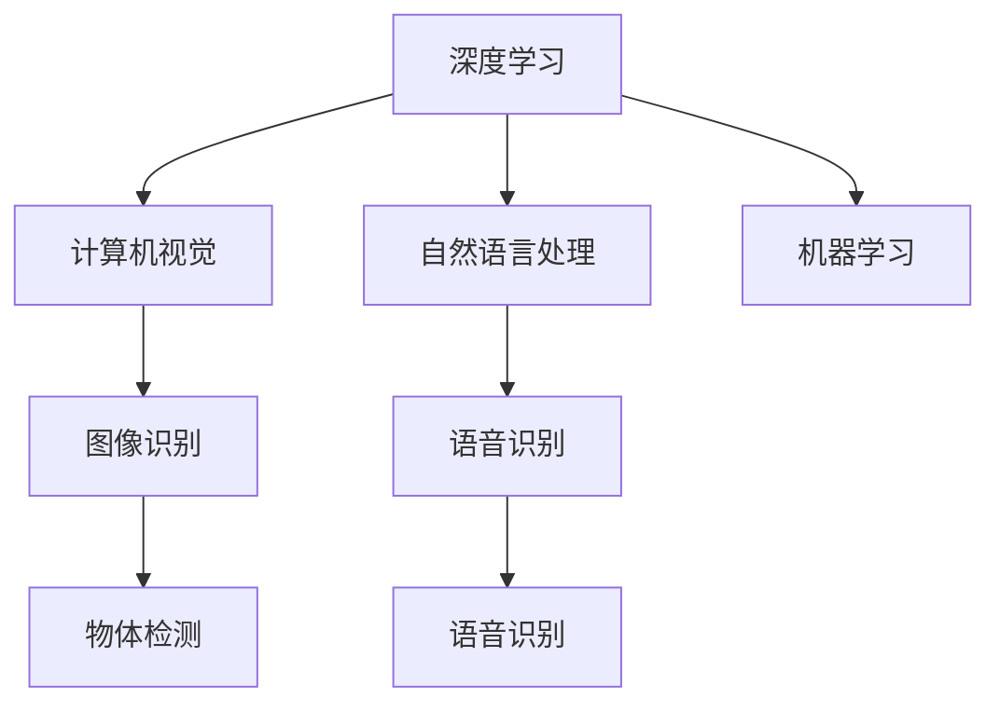
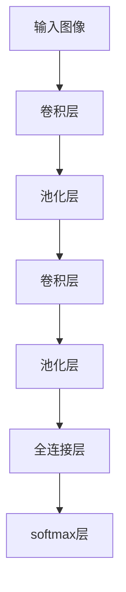

                 

# 软件 2.0 的应用领域 : 图像识别、语音识别

> 关键词：
- 图像识别 (Image Recognition)
- 语音识别 (Speech Recognition)
- 深度学习 (Deep Learning)
- 计算机视觉 (Computer Vision)
- 自然语言处理 (Natural Language Processing)
- 机器学习 (Machine Learning)
- 人工智能 (Artificial Intelligence)

## 1. 背景介绍

随着信息技术的发展，特别是人工智能技术的不断进步，我们正在进入一个新的时代——软件 2.0 时代。这个时代，软件不再是简单的规则和逻辑的执行，而是能够自我学习和进化的智能系统。图像识别和语音识别作为软件 2.0 的重要应用领域，正在改变我们的生活方式和工作方式。

### 1.1 图像识别 (Image Recognition)

图像识别是计算机视觉领域的一项重要技术，其目标是从图像中识别出物体、场景、文字等信息。图像识别技术已经被广泛应用于各种场景，如智能安防、自动驾驶、医疗影像分析等。通过图像识别，机器可以自动识别车辆、行人、道路标志等信息，从而辅助驾驶；也可以自动识别医学影像中的病变区域，辅助诊断；还可以自动识别文字信息，实现文档处理、信息检索等功能。

### 1.2 语音识别 (Speech Recognition)

语音识别技术是指将语音信号转换成文本信息的技术。语音识别技术已经广泛应用于智能助手、语音搜索、语音控制等场景。通过语音识别，用户可以通过简单的语音指令与计算机进行交互，实现控制设备、搜索信息等功能。语音识别技术已经深入到我们的日常生活，成为我们不可或缺的一部分。

## 2. 核心概念与联系

### 2.1 核心概念概述

为更好地理解图像识别和语音识别的原理，本节将介绍几个密切相关的核心概念：

- 深度学习 (Deep Learning)：一种模拟人脑神经网络的机器学习技术，通过多层次的神经网络结构，实现对数据的复杂映射和分类。
- 计算机视觉 (Computer Vision)：一种研究计算机如何通过图像和视频获取、处理和理解视觉信息的技术。
- 自然语言处理 (Natural Language Processing)：一种研究计算机如何处理和理解自然语言的技术，包括语言模型、文本分类、情感分析等。
- 机器学习 (Machine Learning)：一种使计算机能够通过数据自动学习并优化算法，提高性能的技术。

这些核心概念之间的逻辑关系可以通过以下Mermaid流程图来展示：



这个流程图展示了这个生态系统的核心概念及其之间的关系：

1. 深度学习作为底层技术，为计算机视觉和自然语言处理提供支持。
2. 计算机视觉通过图像识别技术，实现对视觉信息的理解和处理。
3. 自然语言处理通过语音识别技术，实现对语音信息的理解和处理。
4. 机器学习通过深度学习提供的高效算法，实现数据驱动的自我学习。

### 2.2 概念间的关系

这些核心概念之间存在着紧密的联系，形成了软件 2.0 技术的完整生态系统。下面我通过几个Mermaid流程图来展示这些概念之间的关系。

#### 2.2.1 深度学习与计算机视觉

```mermaid
graph LR
    A[深度学习] --> B[卷积神经网络 (CNN)]
    A --> C[循环神经网络 (RNN)]
    B --> D[图像分类]
    B --> E[物体检测]
    C --> F[图像生成]
    E --> G[语义分割]
    F --> H[图像风格转换]
```

这个流程图展示了深度学习在计算机视觉中的应用。通过卷积神经网络 (CNN) 和循环神经网络 (RNN)，深度学习可以实现图像分类、物体检测、图像生成、语义分割、图像风格转换等功能。

#### 2.2.2 自然语言处理与语音识别

```mermaid
graph LR
    A[深度学习] --> B[循环神经网络 (RNN)]
    A --> C[卷积神经网络 (CNN)]
    B --> D[语音识别]
    B --> E[文本生成]
    C --> F[情感分析]
    E --> G[对话系统]
    F --> H[机器翻译]
```

这个流程图展示了深度学习在自然语言处理中的应用。通过循环神经网络 (RNN) 和卷积神经网络 (CNN)，深度学习可以实现语音识别、文本生成、情感分析、对话系统、机器翻译等功能。

## 3. 核心算法原理 & 具体操作步骤

### 3.1 算法原理概述

图像识别和语音识别的核心算法都是深度学习。深度学习是一种通过多层次神经网络实现数据映射和分类的技术，其基本原理是通过大量标注数据进行训练，学习数据的特征表示，从而实现分类和识别。

图像识别的核心算法包括卷积神经网络 (CNN)、循环神经网络 (RNN)、长短期记忆网络 (LSTM)、残差网络 (ResNet) 等。这些网络结构可以有效地捕捉图像中的特征，实现对物体、场景的分类和识别。

语音识别的核心算法包括卷积神经网络 (CNN)、循环神经网络 (RNN)、长短时记忆网络 (LSTM)、Transformer 等。这些网络结构可以有效地捕捉语音中的特征，实现对语音的转录和理解。

### 3.2 算法步骤详解

以下是图像识别和语音识别的核心算法步骤：

**图像识别**

1. **数据预处理**：将原始图像进行归一化、裁剪、旋转等预处理，使其符合模型输入要求。
2. **模型训练**：使用标注数据对模型进行训练，调整网络参数，使其能够准确分类图像。
3. **模型验证**：在验证集上评估模型性能，选择最优模型。
4. **模型测试**：在测试集上评估模型性能，评估其分类准确率。

**语音识别**

1. **数据预处理**：将原始语音信号进行降噪、分帧、特征提取等预处理，使其符合模型输入要求。
2. **模型训练**：使用标注数据对模型进行训练，调整网络参数，使其能够准确转录语音。
3. **模型验证**：在验证集上评估模型性能，选择最优模型。
4. **模型测试**：在测试集上评估模型性能，评估其转录准确率。

### 3.3 算法优缺点

深度学习在图像识别和语音识别中具有以下优点：

- 强大的特征学习能力：通过多层次网络结构，可以学习到复杂的数据特征，实现高精度的分类和识别。
- 自动化学习：不需要手动设计特征提取器，模型可以通过数据自动学习特征表示。
- 适应性广：可以通过微调和迁移学习，适应各种不同的应用场景。

但同时，深度学习也存在一些缺点：

- 需要大量标注数据：深度学习需要大量标注数据进行训练，数据收集和标注成本较高。
- 计算资源需求高：深度学习模型参数量大，计算资源需求高，训练时间较长。
- 过拟合风险：深度学习模型容易出现过拟合，需要进行正则化和防止过拟合的策略。

### 3.4 算法应用领域

图像识别和语音识别的应用领域非常广泛，以下是几个典型应用场景：

**图像识别**

- **安防监控**：通过监控摄像头识别异常行为，实现智能监控和安全防范。
- **医学影像分析**：识别医学影像中的病变区域，辅助医生诊断。
- **自动驾驶**：识别道路标志、车辆行人，实现自动驾驶和安全预警。
- **智能家居**：通过识别家庭成员行为，实现智能家居控制。

**语音识别**

- **智能助手**：通过语音识别实现与计算机的交互，提供信息查询、任务调度等功能。
- **语音搜索**：通过语音识别实现对互联网内容的搜索和查询。
- **语音控制**：通过语音识别实现对智能设备的控制，如家电、汽车等。
- **语音翻译**：实现跨语言语音翻译，促进国际交流。

## 4. 数学模型和公式 & 详细讲解 & 举例说明

### 4.1 数学模型构建

假设有一个图像识别任务，输入是一张 $n \times n$ 的图像，输出是 $k$ 个类别的概率分布，其中 $k=10$ 表示 10 种物体类别。我们可以使用一个卷积神经网络 (CNN) 来实现该任务，其结构如图：



其中卷积层和池化层用于提取图像的特征，全连接层用于将特征映射到类别概率，softmax层用于将概率分布归一化。

### 4.2 公式推导过程

假设我们使用一个单通道的卷积核 $w$，卷积操作可以用以下公式表示：

$$
f(x, w) = \sum_{i,j} x_{i,j} \cdot w_{i,j}
$$

其中 $x_{i,j}$ 是输入图像上的像素值，$w_{i,j}$ 是卷积核的参数。卷积操作可以有效地捕捉图像的局部特征，实现特征提取。

### 4.3 案例分析与讲解

以医学影像识别为例，假设我们有一个肺部 CT 图像，其大小为 $256 \times 256$，我们需要识别其中是否存在肺结节。首先，我们将图像进行归一化、预处理，然后使用卷积神经网络 (CNN) 进行特征提取，最后使用全连接层和 softmax 层进行分类，输出每个类别的概率分布。在训练过程中，我们使用交叉熵损失函数来衡量模型的预测与真实标签之间的差异。

假设训练数据集中有 1000 张肺部 CT 图像，其中 600 张包含肺结节，400 张不包含。我们随机选择其中 800 张作为训练集，200 张作为验证集，100 张作为测试集。通过多轮训练和验证，我们得到一个高精度的医学影像识别模型。

## 5. 项目实践：代码实例和详细解释说明

### 5.1 开发环境搭建

在进行图像识别和语音识别开发前，我们需要准备好开发环境。以下是使用 Python 进行 TensorFlow 和 PyTorch 开发的环境配置流程：

1. 安装 Anaconda：从官网下载并安装 Anaconda，用于创建独立的 Python 环境。

2. 创建并激活虚拟环境：
```bash
conda create -n pytorch-env python=3.8 
conda activate pytorch-env
```

3. 安装 TensorFlow 和 PyTorch：根据 CUDA 版本，从官网获取对应的安装命令。例如：
```bash
conda install pytorch torchvision torchaudio cudatoolkit=11.1 -c pytorch -c conda-forge
```

4. 安装 Keras 和 TensorBoard：
```bash
pip install keras tensorflow-model-optimizer tensorboard
```

5. 安装 Transformers 和 PyAudio：
```bash
pip install transformers pyaudio
```

完成上述步骤后，即可在 `pytorch-env` 环境中开始图像识别和语音识别的开发实践。

### 5.2 源代码详细实现

这里以图像识别为例，使用 PyTorch 实现一个简单的卷积神经网络 (CNN)。

```python
import torch
import torch.nn as nn
import torchvision.transforms as transforms
from torchvision import datasets, models

# 定义模型
class Net(nn.Module):
    def __init__(self):
        super(Net, self).__init__()
        self.conv1 = nn.Conv2d(3, 6, 5)
        self.pool = nn.MaxPool2d(2, 2)
        self.conv2 = nn.Conv2d(6, 16, 5)
        self.fc1 = nn.Linear(16 * 5 * 5, 120)
        self.fc2 = nn.Linear(120, 84)
        self.fc3 = nn.Linear(84, 10)

    def forward(self, x):
        x = self.pool(torch.relu(self.conv1(x)))
        x = self.pool(torch.relu(self.conv2(x)))
        x = x.view(-1, 16 * 5 * 5)
        x = torch.relu(self.fc1(x))
        x = torch.relu(self.fc2(x))
        x = self.fc3(x)
        return x

# 加载数据集
train_dataset = datasets.CIFAR10(root='data', train=True, transform=transforms.ToTensor(), download=True)
test_dataset = datasets.CIFAR10(root='data', train=False, transform=transforms.ToTensor(), download=True)

# 定义数据加载器
train_loader = torch.utils.data.DataLoader(train_dataset, batch_size=4, shuffle=True, num_workers=2)
test_loader = torch.utils.data.DataLoader(test_dataset, batch_size=4, shuffle=False, num_workers=2)

# 定义模型、损失函数和优化器
model = Net()
criterion = nn.CrossEntropyLoss()
optimizer = torch.optim.SGD(model.parameters(), lr=0.001, momentum=0.9)

# 训练模型
for epoch in range(2):
    running_loss = 0.0
    for i, data in enumerate(train_loader, 0):
        inputs, labels = data
        optimizer.zero_grad()
        outputs = model(inputs)
        loss = criterion(outputs, labels)
        loss.backward()
        optimizer.step()

        running_loss += loss.item()
        if i % 2000 == 1999:    # 每 2000 mini-batches 输出一次损失信息
            print('[%d, %5d] loss: %.3f' %
                  (epoch + 1, i + 1, running_loss / 2000))
            running_loss = 0.0

print('Finished Training')
```

### 5.3 代码解读与分析

让我们再详细解读一下关键代码的实现细节：

**Net 类**：
- `__init__` 方法：初始化网络结构，包括卷积层、池化层、全连接层等。
- `forward` 方法：定义前向传播过程，即输入经过卷积层、池化层和全连接层后，输出分类概率。

**CIFAR10 数据集**：
- 使用 `torchvision.datasets.CIFAR10` 加载 CIFAR10 数据集，并进行预处理，包括归一化、预处理等。

**数据加载器**：
- 使用 `torch.utils.data.DataLoader` 定义数据加载器，实现批量数据的加载和随机化。

**模型、损失函数和优化器**：
- 定义模型结构，包括卷积层、全连接层等。
- 定义损失函数和优化器，用于模型训练和优化。

**模型训练**：
- 使用 `for` 循环进行多轮训练，每轮训练包括前向传播、反向传播和参数更新。
- 每 2000 mini-batches 输出一次损失信息，方便监控模型训练进度。

可以看到，PyTorch 提供了丰富的 API，使得模型训练过程变得简洁高效。开发者可以将更多精力放在数据处理、模型设计等高层逻辑上，而不必过多关注底层实现细节。

## 6. 实际应用场景

### 6.1 安防监控

在安防监控领域，图像识别技术被广泛应用于智能摄像头、视频监控等设备中。通过监控摄像头识别异常行为，实现智能监控和安全防范。例如，智能摄像头可以识别行人的面部特征，判断其是否为陌生人或可疑人员，并在异常情况下发出警报。

### 6.2 医学影像分析

在医学影像分析领域，图像识别技术被广泛应用于医学影像的自动识别和诊断。例如，CT 和 MRI 影像自动识别病变区域，帮助医生进行诊断和治疗。

### 6.3 自动驾驶

在自动驾驶领域，图像识别技术被广泛应用于车道识别、车辆行人识别等场景。例如，自动驾驶汽车通过摄像头识别道路标志、车辆行人，实现自动驾驶和安全预警。

### 6.4 语音助手

在语音助手领域，语音识别技术被广泛应用于智能助手、语音搜索等场景。例如，智能助手可以通过语音识别用户指令，进行信息查询、任务调度等功能。

### 6.5 语音控制

在语音控制领域，语音识别技术被广泛应用于智能家居、智能汽车等场景。例如，智能家居可以通过语音识别用户的指令，实现灯光、电视等设备的控制。

## 7. 工具和资源推荐

### 7.1 学习资源推荐

为了帮助开发者系统掌握图像识别和语音识别的理论基础和实践技巧，这里推荐一些优质的学习资源：

1. 《深度学习》系列博文：由大模型技术专家撰写，深入浅出地介绍了深度学习的原理和应用，涵盖了图像识别和语音识别等多个领域。

2. 《计算机视觉》课程：斯坦福大学开设的计算机视觉课程，有Lecture视频和配套作业，带你入门计算机视觉领域的基本概念和经典模型。

3. 《语音识别》书籍：语音识别领域的经典教材，全面介绍了语音识别的原理和应用，提供了大量的实践案例和代码。

4. Coursera 和 Udacity：这两个平台提供了许多优秀的计算机视觉和语音识别课程，涵盖从基础到高级的各个层次。

5. arXiv 论文预印本：人工智能领域最新研究成果的发布平台，包括大量尚未发表的前沿工作，学习前沿技术的必读资源。

通过对这些资源的学习实践，相信你一定能够快速掌握图像识别和语音识别的精髓，并用于解决实际的图像和语音处理问题。

### 7.2 开发工具推荐

高效的开发离不开优秀的工具支持。以下是几款用于图像识别和语音识别开发的常用工具：

1. TensorFlow：由 Google 主导开发的开源深度学习框架，生产部署方便，适合大规模工程应用。

2. PyTorch：基于 Python 的开源深度学习框架，灵活动态的计算图，适合快速迭代研究。

3. Keras：高级深度学习 API，提供简单易用的接口，适合快速原型设计和实验。

4. OpenCV：开源计算机视觉库，提供了丰富的图像处理和分析函数，适合进行图像识别的开发。

5. PyAudio：Python 的音频处理库，支持音频数据的采集和处理，适合进行语音识别的开发。

合理利用这些工具，可以显著提升图像识别和语音识别开发的效率，加快创新迭代的步伐。

### 7.3 相关论文推荐

图像识别和语音识别技术的发展源于学界的持续研究。以下是几篇奠基性的相关论文，推荐阅读：

1. AlexNet: ImageNet Classification with Deep Convolutional Neural Networks：提出了卷积神经网络 (CNN)，开创了深度学习在图像识别领域的应用。

2. Speech Recognition with Deep Recurrent Neural Networks：提出了循环神经网络 (RNN)，奠定了深度学习在语音识别领域的基础。

3. GoogLeNet: A Scene Understanding System：提出了 Inception 网络，提高了深度学习在图像分类和识别中的应用效果。

4. Deep Speech 2: End-to-End Speech Recognition in English and Mandarin：提出长短期记忆网络 (LSTM)，提高了深度学习在语音识别中的应用效果。

5. Transformer is All you Need：提出了 Transformer 网络，提高了深度学习在语音识别和自然语言处理中的应用效果。

这些论文代表了大语言模型微调技术的发展脉络。通过学习这些前沿成果，可以帮助研究者把握学科前进方向，激发更多的创新灵感。

除上述资源外，还有一些值得关注的前沿资源，帮助开发者紧跟图像识别和语音识别技术的最新进展，例如：

1. GitHub 热门项目：在 GitHub 上 Star、Fork 数最多的图像识别和语音识别相关项目，往往代表了该技术领域的发展趋势和最佳实践，值得去学习和贡献。

2. AI 会议直播：如 NIPS、ICML、CVPR、ACL 等人工智能领域顶会现场或在线直播，能够聆听到大佬们的前沿分享，开拓视野。

3. 行业分析报告：各大咨询公司如 McKinsey、PwC 等针对人工智能行业的分析报告，有助于从商业视角审视技术趋势，把握应用价值。

总之，对于图像识别和语音识别技术的学习和实践，需要开发者保持开放的心态和持续学习的意愿。多关注前沿资讯，多动手实践，多思考总结，必将收获满满的成长收益。

## 8. 总结：未来发展趋势与挑战

### 8.1 总结

本文对图像识别和语音识别的原理、算法和应用进行了全面系统的介绍。首先阐述了图像识别和语音识别的研究背景和意义，明确了这两个技术在软件 2.0 时代的重要价值。其次，从原理到实践，详细讲解了图像识别和语音识别的数学模型和关键步骤，给出了具体的代码实例。同时，本文还广泛探讨了图像识别和语音识别技术在安防监控、医学影像分析、自动驾驶、语音助手、语音控制等多个领域的应用前景，展示了这两个技术在各行业中的广泛应用。

通过本文的系统梳理，可以看到，图像识别和语音识别技术正在成为软件 2.0 时代的重要应用，极大地拓展了计算机视觉和自然语言处理的应用边界，为各种行业带来了全新的可能性。未来，伴随图像识别和语音识别技术的不断进步，相信这两个技术将进一步渗透到更多领域，为人类认知智能的进化带来深远影响。

### 8.2 未来发展趋势

展望未来，图像识别和语音识别技术将呈现以下几个发展趋势：

1. 模型规模持续增大。随着算力成本的下降和数据规模的扩张，深度学习模型的参数量还将持续增长。超大规模模型蕴含的丰富特征表示，有望支撑更加复杂多变的应用场景。

2. 模型效率提升。未来的深度学习模型将更加高效，不仅在性能上更优，在计算速度和资源占用上也更加合理。推理速度和效率的提升，将使深度学习在更多领域得到应用。

3. 多模态融合。未来的深度学习模型将更加注重多模态数据的融合，实现视觉、语音、文本等多种信息的协同建模，提供更加全面的智能体验。

4. 迁移学习普及。迁移学习技术将更加普及，通过预训练和微调，使模型能够快速适应各种新的应用场景，提升模型的泛化能力和应用效率。

5. 端到端学习。未来的深度学习模型将更加注重端到端学习，减少手工设计特征的环节，提高模型的自动化和智能化水平。

以上趋势凸显了图像识别和语音识别技术的广阔前景。这些方向的探索发展，必将进一步提升深度学习模型的性能和应用范围，为各种行业带来更多的可能性。

### 8.3 面临的挑战

尽管图像识别和语音识别技术已经取得了瞩目成就，但在迈向更加智能化、普适化应用的过程中，它们仍面临着诸多挑战：

1. 数据收集和标注成本高。图像识别和语音识别需要大量标注数据进行训练，数据收集和标注成本较高。

2. 计算资源需求高。深度学习模型参数量大，计算资源需求高，训练时间较长。

3. 模型鲁棒性不足。当前深度学习模型面对域外数据时，泛化性能往往大打折扣。

4. 隐私和安全风险。深度学习模型需要大量数据进行训练，数据隐私和安全问题也引起了越来越多的关注。

5. 模型可解释性差。深度学习模型往往被视为"黑盒"系统，难以解释其内部工作机制和决策逻辑。

6. 伦理道德问题。深度学习模型容易出现偏见和歧视，如何保障其伦理道德性，还需要进一步探索。

正视图像识别和语音识别面临的这些挑战，积极应对并寻求突破，将使这些技术在实际应用中更加可靠和可行。

### 8.4 未来突破

面对图像识别和语音识别所面临的种种挑战，未来的研究需要在以下几个方面寻求新的突破：

1. 探索无监督和半监督学习。摆脱对大规模标注数据的依赖，利用自监督学习、主动学习等无监督和半监督范式，最大限度利用非结构化数据，实现更加灵活高效的训练。

2. 开发更加高效和轻量级的模型。开发更加高效和轻量级的深度学习模型，提高推理速度和计算效率，适应更多资源受限的场景。

3. 引入更多先验知识。将符号化的先验知识，如知识图谱、逻辑规则等，与深度学习模型进行巧妙融合，提高模型的自动化和智能化水平。

4. 结合因果分析和博弈论工具。将因果分析方法引入深度学习模型，增强模型建立稳定因果关系的能力，学习更加普适、鲁棒的语言表征。

5. 加强数据隐私和安全保障。通过数据脱敏、加密等技术，保障数据隐私和安全，减少数据泄露的风险。

6. 赋予模型更强的可解释性。通过可解释性工具和方法，赋予深度学习模型更强的可解释性，提高模型的透明性和可控性。

这些研究方向的探索，必将引领图像识别和语音识别技术迈向更高的台阶，为构建更加智能、安全、可控的系统铺平道路。面向未来，图像识别和语音识别技术还需要与其他人工智能技术进行更深入的融合，如知识表示、因果推理、强化学习等，多路径协同发力，共同推动人工智能技术的发展。只有勇于创新、敢于突破，才能不断拓展深度学习模型的边界，让智能技术更好地造福人类社会。

## 9. 附录：常见问题与解答

**Q1：深度学习需要大量的标注数据，如何降低数据成本？**

A: 深度学习需要大量的标注数据，数据收集和标注成本较高。一种降低数据成本的方法是利用无监督学习和半监督学习，从非标注数据中学习特征，再使用少量的标注数据进行微调。另一种方法是利用数据增强技术，通过一些数据变换（如旋转、翻转、随机裁剪等）生成更多的训练数据。

**Q2：深度学习模型容易过拟合，如何解决过拟合问题？**

A: 深度学习模型容易过拟合，常见的解决方法包括正则化、Dropout、Early Stopping、数据增强等。通过增加正则化项、使用Dropout、在训练集上进行Early Stopping等措施，可以有效防止模型过拟合

